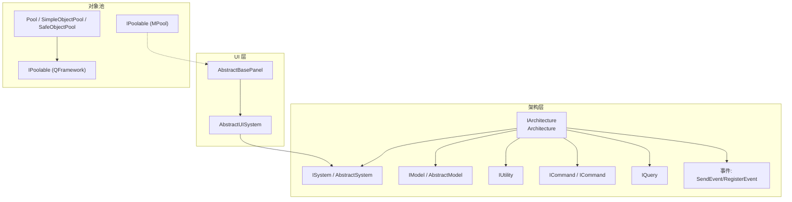
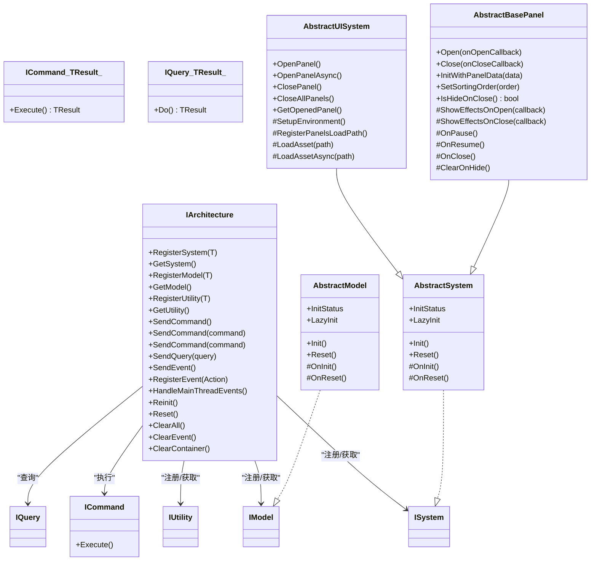
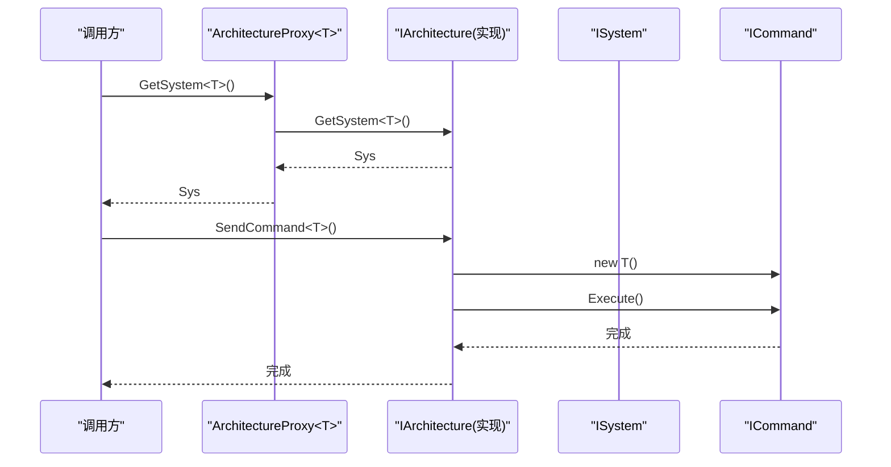
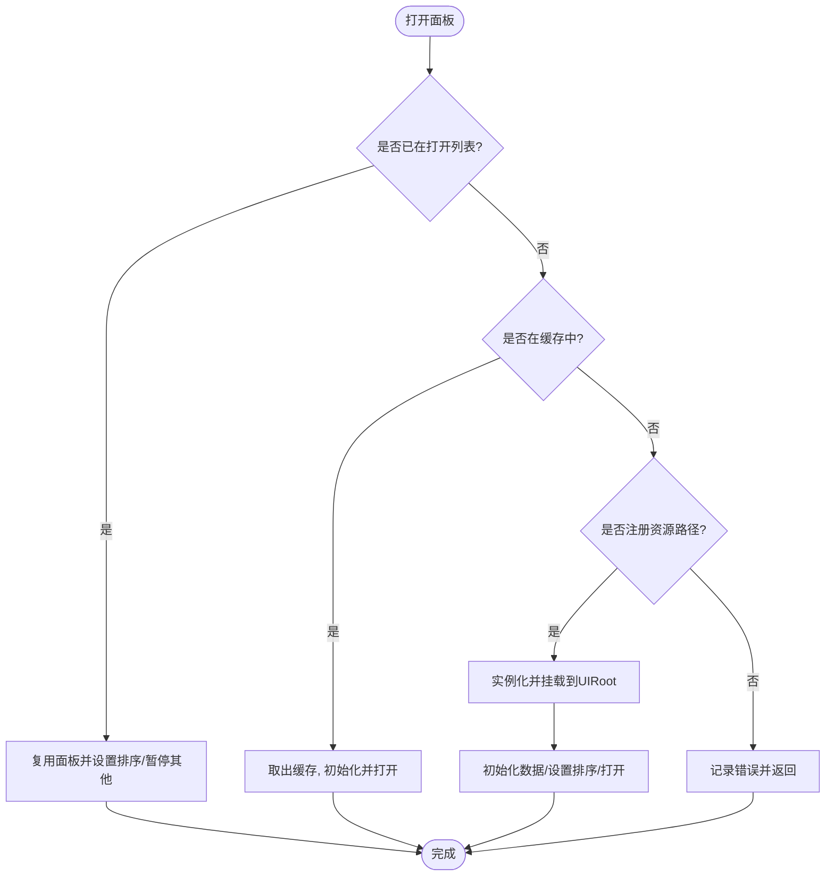
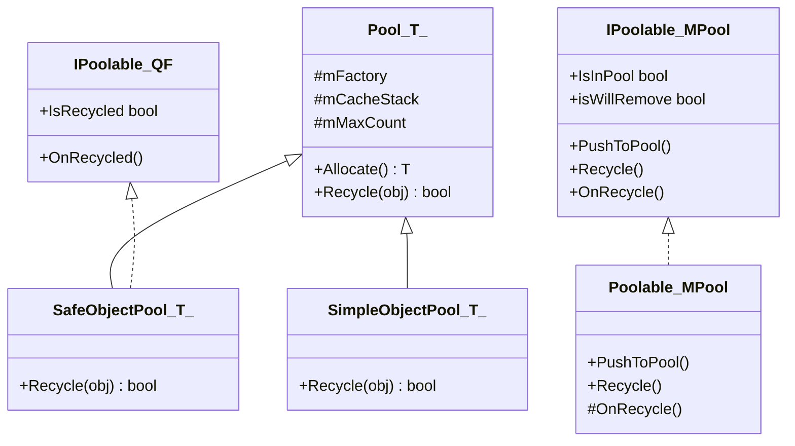
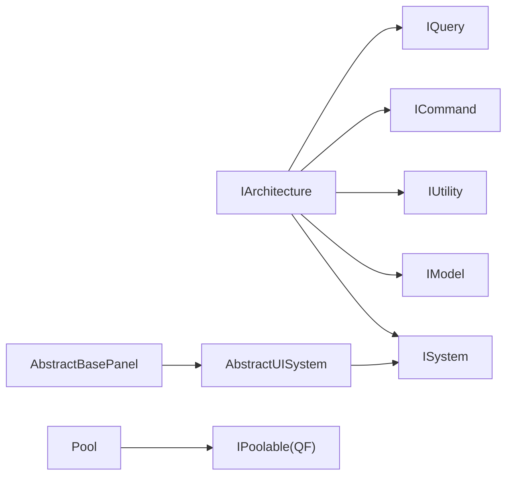

# API 参考

<cite>
**本文引用的文件**   
- [QFramework.cs](file://Assets/Game/Framework/Qframework/Runtime/QFramework.cs)
- [ArchitectureProxy.cs](file://Assets/Game/Framework/Qframework/Runtime/Moyv/Proxies/ArchitectureProxy.cs)
- [AbstractUISystem.cs](file://Assets/Game/Framework/Ugui/Runtime/NodePanel/AbstractUISystem.cs)
- [AbstractBasePanel.cs](file://Assets/Game/Framework/Ugui/Runtime/NodePanel/AbstractBasePanel.cs)
- [PoolKit.cs](file://Assets/Game/Framework/Qframework/Runtime/Toolkits/PoolKit.cs)
- [IPoolable.cs](file://Assets/Game/Framework/MPool/IPoolable.cs)
</cite>

## 目录
1. [简介](#简介)
2. [项目结构](#项目结构)
3. [核心组件](#核心组件)
4. [架构总览](#架构总览)
5. [详细组件分析](#详细组件分析)
6. [依赖关系分析](#依赖关系分析)
7. [性能与内存建议](#性能与内存建议)
8. [故障排查指南](#故障排查指南)
9. [结论](#结论)
10. [附录：版本兼容与迁移指南](#附录版本兼容与迁移指南)

## 简介
本 API 参考面向 SimulationClient 项目的架构与 UI 子系统，聚焦以下目标：
- 完整记录核心架构接口 IArchitecture、ISystem、IModel、IUtility 及其抽象基类的职责与使用方式
- 说明对象池接口 IPoolable 的实现要求与最佳实践
- 提供 UI 系统接口的使用示例，包括 AbstractUISystem 的继承与重写要点
- 给出命令、查询、事件等常用模式的调用流程与注意事项
- 为开发者提供快速查找和理解 API 功能的参考手册

## 项目结构
本项目采用分层与模块化组织：
- 架构层（QFramework）：提供 IOC、命令、查询、事件、生命周期管理等基础设施
- UI 层（Ugui/NodePanel）：基于 AbstractSystem 扩展出 AbstractUISystem，管理面板生命周期与资源加载
- 对象池（MPool/QFramework.PoolKit）：提供通用对象池与可回收对象协议

图表来源
- [QFramework.cs:45-92](file://Assets/Game/Framework/Qframework/Runtime/QFramework.cs#L45-L92)
- [AbstractUISystem.cs:11-51](file://Assets/Game/Framework/Ugui/Runtime/NodePanel/AbstractUISystem.cs#L11-L51)
- [AbstractBasePanel.cs:18-215](file://Assets/Game/Framework/Ugui/Runtime/NodePanel/AbstractBasePanel.cs#L18-L215)
- [PoolKit.cs:317-373](file://Assets/Game/Framework/Qframework/Runtime/Toolkits/PoolKit.cs#L317-L373)
- [IPoolable.cs:7-22](file://Assets/Game/Framework/MPool/IPoolable.cs#L7-L22)

章节来源
- [QFramework.cs:45-92](file://Assets/Game/Framework/Qframework/Runtime/QFramework.cs#L45-L92)
- [AbstractUISystem.cs:11-51](file://Assets/Game/Framework/Ugui/Runtime/NodePanel/AbstractUISystem.cs#L11-L51)
- [AbstractBasePanel.cs:18-215](file://Assets/Game/Framework/Ugui/Runtime/NodePanel/AbstractBasePanel.cs#L18-L215)
- [PoolKit.cs:317-373](file://Assets/Game/Framework/Qframework/Runtime/Toolkits/PoolKit.cs#L317-L373)
- [IPoolable.cs:7-22](file://Assets/Game/Framework/MPool/IPoolable.cs#L7-L22)

## 核心组件
本节概述核心架构接口与抽象基类，并说明其职责边界与典型用法。

- IArchitecture
  - 职责：注册与获取 System/Model/Utility；发送命令、查询、事件；清理容器与事件
  - 关键方法：RegisterSystem/GetSystem、RegisterModel/GetModel、RegisterUtility/GetUtility、SendCommand/SendQuery、SendEvent/RegisterEvent、ClearAll/ClearContainer/ClearEvent
  - 生命周期：Reinit/Reset/ClearAll 用于重启、重置与彻底清理
  - 线程：HandleMainThreadEvents 用于主线程事件派发

- ISystem / AbstractSystem
  - 职责：系统级逻辑单元，具备初始化、重置、懒加载能力
  - 关键点：InitStatus/LazyInit/OnInit/OnReset；可通过扩展方法便捷访问 Model/System/Utility/事件

- IModel / AbstractModel
  - 职责：数据模型，持有状态并提供事件通知
  - 关键点：同 System 的生命周期与懒加载模式

- IUtility
  - 职责：无状态的通用工具服务，通过 Architecture 注册与获取

- Command/Query/Event
  - 命令：ICommand/ICommand<TResult>，封装业务动作，支持返回值
  - 查询：IQuery<TResult>，纯查询操作，返回结果
  - 事件：SendEvent/RegisterEvent，支持主线程派发

章节来源
- [QFramework.cs:45-92](file://Assets/Game/Framework/Qframework/Runtime/QFramework.cs#L45-L92)
- [QFramework.cs:424-509](file://Assets/Game/Framework/Qframework/Runtime/QFramework.cs#L424-L509)
- [QFramework.cs:512-590](file://Assets/Game/Framework/Qframework/Runtime/QFramework.cs#L512-L590)
- [QFramework.cs:699-714](file://Assets/Game/Framework/Qframework/Runtime/QFramework.cs#L699-L714)

## 架构总览
下图展示从入口到各组件的交互关系，以及 UI 系统与面板的关系。

图表来源
- [QFramework.cs:45-92](file://Assets/Game/Framework/Qframework/Runtime/QFramework.cs#L45-L92)
- [QFramework.cs:424-509](file://Assets/Game/Framework/Qframework/Runtime/QFramework.cs#L424-L509)
- [QFramework.cs:512-590](file://Assets/Game/Framework/Qframework/Runtime/QFramework.cs#L512-L590)
- [AbstractUISystem.cs:11-51](file://Assets/Game/Framework/Ugui/Runtime/NodePanel/AbstractUISystem.cs#L11-L51)
- [AbstractBasePanel.cs:18-215](file://Assets/Game/Framework/Ugui/Runtime/NodePanel/AbstractBasePanel.cs#L18-L215)

## 详细组件分析

### 架构接口与代理
- IArchitecture 是统一入口，负责 IOC 注册与获取、命令/查询/事件分发、生命周期管理
- ArchitectureProxy<T> 提供静态 Interface 访问，内部委托至具体实现（如 GameArchitecture），便于在编辑器或不同平台切换实现

图表来源
- [ArchitectureProxy.cs:53-157](file://Assets/Game/Framework/Qframework/Runtime/Moyv/Proxies/ArchitectureProxy.cs#L53-L157)
- [QFramework.cs:45-92](file://Assets/Game/Framework/Qframework/Runtime/QFramework.cs#L45-L92)
- [QFramework.cs:512-558](file://Assets/Game/Framework/Qframework/Runtime/QFramework.cs#L512-L558)

章节来源
- [ArchitectureProxy.cs:53-157](file://Assets/Game/Framework/Qframework/Runtime/Moyv/Proxies/ArchitectureProxy.cs#L53-L157)
- [QFramework.cs:45-92](file://Assets/Game/Framework/Qframework/Runtime/QFramework.cs#L45-L92)

### UI 系统：AbstractUISystem 与 AbstractBasePanel
- AbstractUISystem
  - 暴露 OpenPanel/OpenPanelAsync/ClosePanel/CloseAllPanels/GetOpenedPanel 等面板管理 API
  - 需要子类实现 SetupEnvironment、RegisterPanelsLoadPath、LoadAsset/LoadAssetAsync
  - 维护已打开面板列表、缓存面板字典、加载队列与排序顺序
- AbstractBasePanel
  - 提供 Open/Close 生命周期，支持关闭时隐藏或销毁
  - 提供 InitWithPanelData、ShowEffectsOnOpen/Close、OnPause/OnResume/OnClose、ClearOnHide 等钩子
  - 管理 Canvas sortingOrder，配合 UI 层级显示

图表来源
- [AbstractUISystem.cs:52-112](file://Assets/Game/Framework/Ugui/Runtime/NodePanel/AbstractUISystem.cs#L52-L112)
- [AbstractBasePanel.cs:47-105](file://Assets/Game/Framework/Ugui/Runtime/NodePanel/AbstractBasePanel.cs#L47-L105)

章节来源
- [AbstractUISystem.cs:11-344](file://Assets/Game/Framework/Ugui/Runtime/NodePanel/AbstractUISystem.cs#L11-L344)
- [AbstractBasePanel.cs:18-215](file://Assets/Game/Framework/Ugui/Runtime/NodePanel/AbstractBasePanel.cs#L18-L215)

### 对象池接口与实现
- QFramework 对象池
  - IPoolable：定义 OnRecycled 与 IsRecycled 标记
  - Pool<T>：抽象池，提供 Allocate/Recycle 与工厂注入
  - SimpleObjectPool<T>：带重置回调的简单池
  - SafeObjectPool<T>：单例安全池，约束 T 实现 IPoolable
- MPool 对象池
  - IPoolable（MPool）：定义 PushToPool/Recycle/OnRecycle 及 InPool/WillRemove 标记
  - Poolable：抽象基类，简化入池/回收流程

图表来源
- [PoolKit.cs:317-373](file://Assets/Game/Framework/Qframework/Runtime/Toolkits/PoolKit.cs#L317-L373)
- [IPoolable.cs:7-22](file://Assets/Game/Framework/MPool/IPoolable.cs#L7-L22)

章节来源
- [PoolKit.cs:317-373](file://Assets/Game/Framework/Qframework/Runtime/Toolkits/PoolKit.cs#L317-L373)
- [IPoolable.cs:7-22](file://Assets/Game/Framework/MPool/IPoolable.cs#L7-L22)

### 使用示例（以路径引用代替代码片段）
- 注册与获取 System/Model/Utility
  - 参考：[注册与获取:206-306](file://Assets/Game/Framework/Qframework/Runtime/QFramework.cs#L206-L306)
- 发送命令与查询
  - 参考：[命令发送:308-324](file://Assets/Game/Framework/Qframework/Runtime/QFramework.cs#L308-L324)、[查询发送:326-332](file://Assets/Game/Framework/Qframework/Runtime/QFramework.cs#L326-L332)
- 事件订阅与主线程派发
  - 参考：[事件注册/发送:334-348](file://Assets/Game/Framework/Qframework/Runtime/QFramework.cs#L334-L348)、[主线程处理:191-194](file://Assets/Game/Framework/Qframework/Runtime/QFramework.cs#L191-L194)
- 自定义 System/Model
  - 参考：[AbstractSystem:429-459](file://Assets/Game/Framework/Qframework/Runtime/QFramework.cs#L429-L459)、[AbstractModel:470-500](file://Assets/Game/Framework/Qframework/Runtime/QFramework.cs#L470-L500)
- 自定义 UI 系统
  - 参考：[AbstractUISystem 继承点:34-51](file://Assets/Game/Framework/Ugui/Runtime/NodePanel/AbstractUISystem.cs#L34-L51)
- 自定义面板
  - 参考：[AbstractBasePanel 生命周期钩子:153-213](file://Assets/Game/Framework/Ugui/Runtime/NodePanel/AbstractBasePanel.cs#L153-L213)
- 对象池使用
  - 参考：[SafeObjectPool 使用约束:44-56](file://Assets/Game/Framework/Qframework/Runtime/Toolkits/PoolKit.cs#L44-L56)、[SimpleObjectPool 重置回调:19-40](file://Assets/Game/Framework/Qframework/Runtime/Toolkits/PoolKit.cs#L19-L40)

## 依赖关系分析
- 耦合与内聚
  - IArchitecture 作为中心枢纽，松耦合地连接 System/Model/Utility/Command/Query/Event
  - AbstractUISystem 仅依赖 AbstractSystem 与 Unity 基础类型，保持 UI 层内聚
  - 对象池接口独立于业务，便于替换实现
- 外部依赖
  - Unity 场景与渲染（Canvas、Camera）
  - UniTask（异步加载）
  - 可选的多线程事件宏 ENABLE_MULTITHREAD_EVENT

图表来源
- [QFramework.cs:45-92](file://Assets/Game/Framework/Qframework/Runtime/QFramework.cs#L45-L92)
- [AbstractUISystem.cs:11-51](file://Assets/Game/Framework/Ugui/Runtime/NodePanel/AbstractUISystem.cs#L11-L51)
- [PoolKit.cs:317-373](file://Assets/Game/Framework/Qframework/Runtime/Toolkits/PoolKit.cs#L317-L373)

章节来源
- [QFramework.cs:45-92](file://Assets/Game/Framework/Qframework/Runtime/QFramework.cs#L45-L92)
- [AbstractUISystem.cs:11-51](file://Assets/Game/Framework/Ugui/Runtime/NodePanel/AbstractUISystem.cs#L11-L51)
- [PoolKit.cs:317-373](file://Assets/Game/Framework/Qframework/Runtime/Toolkits/PoolKit.cs#L317-L373)

## 性能与内存建议
- 优先使用对象池
  - 高频创建/销毁的对象应实现 IPoolable 并使用 SafeObjectPool/T 或 SimpleObjectPool<T>
  - 在 Recycle/OnRecycled 中务必重置状态，避免脏数据
- 合理使用懒加载
  - 对大型 System/Model 开启 LazyInit，按需初始化减少启动开销
- 控制面板层级
  - 利用 SortingOrderAddition 合理拉开层级，避免频繁重排
- 主线程事件
  - 跨线程发送的事件通过 HandleMainThreadEvents 在主线程派发，避免直接修改 UI

## 故障排查指南
- 未注册资源路径导致面板无法打开
  - 现象：日志提示“没有注册 XX 的资源路径”
  - 排查：确认 RegisterPanelsLoadPath 中是否正确添加路径
  - 参考：[路径检查与错误日志:88-98](file://Assets/Game/Framework/Ugui/Runtime/NodePanel/AbstractUISystem.cs#L88-L98)
- 面板未继承 BasePanel
  - 现象：日志提示“XX 没有继承 BasePanel”
  - 排查：确保面板脚本继承自 AbstractBasePanel
  - 参考：[类型检查与错误日志:103-107](file://Assets/Game/Framework/Ugui/Runtime/NodePanel/AbstractUISystem.cs#L103-L107)
- 重复关闭或关闭空面板
  - 现象：ClosePanel 无效果或异常
  - 排查：先判断是否存在目标面板，或使用 CloseAllPanels 批量关闭
  - 参考：[关闭逻辑:199-242](file://Assets/Game/Framework/Ugui/Runtime/NodePanel/AbstractUISystem.cs#L199-L242)
- 对象池未正确回收
  - 现象：内存增长或状态污染
  - 排查：确保 Recycle/OnRecycled 被调用且重置所有字段
  - 参考：[IPoolable 接口:7-22](file://Assets/Game/Framework/MPool/IPoolable.cs#L7-L22)、[QFramework IPoolable:317-324](file://Assets/Game/Framework/Qframework/Runtime/Toolkits/PoolKit.cs#L317-L324)

章节来源
- [AbstractUISystem.cs:88-107](file://Assets/Game/Framework/Ugui/Runtime/NodePanel/AbstractUISystem.cs#L88-L107)
- [AbstractUISystem.cs:199-242](file://Assets/Game/Framework/Ugui/Runtime/NodePanel/AbstractUISystem.cs#L199-L242)
- [IPoolable.cs:7-22](file://Assets/Game/Framework/MPool/IPoolable.cs#L7-L22)
- [PoolKit.cs:317-324](file://Assets/Game/Framework/Qframework/Runtime/Toolkits/PoolKit.cs#L317-L324)

## 结论
本参考文档梳理了 SimulationClient 的核心架构与 UI 子系统 API，明确了 IArchitecture/ISystem/IModel/IUtility 的职责边界与使用方式，提供了 AbstractUISystem 与 AbstractBasePanel 的集成要点，并总结了对象池接口的实现规范。遵循本文档的实践，可有效提升系统的可维护性与运行效率。

## 附录：版本兼容与迁移指南
- 事件与主线程派发
  - 若启用多线程事件宏，需在每帧调用 HandleMainThreadEvents 以派发主线程事件
  - 参考：[主线程事件处理:191-194](file://Assets/Game/Framework/Qframework/Runtime/QFramework.cs#L191-L194)
- 对象池接口差异
  - QFramework 的 IPoolable 与 MPool 的 IPoolable 命名相同但成员不同，迁移时需区分命名空间与语义
  - 参考：[QFramework IPoolable:317-324](file://Assets/Game/Framework/Qframework/Runtime/Toolkits/PoolKit.cs#L317-L324)、[MPool IPoolable:7-22](file://Assets/Game/Framework/MPool/IPoolable.cs#L7-L22)
- UI 系统升级
  - 新增异步打开面板 OpenPanelAsync，建议在资源加载耗时较大的场景使用
  - 参考：[异步打开面板:115-143](file://Assets/Game/Framework/Ugui/Runtime/NodePanel/AbstractUISystem.cs#L115-L143)

章节来源
- [QFramework.cs:191-194](file://Assets/Game/Framework/Qframework/Runtime/QFramework.cs#L191-L194)
- [PoolKit.cs:317-324](file://Assets/Game/Framework/Qframework/Runtime/Toolkits/PoolKit.cs#L317-L324)
- [IPoolable.cs:7-22](file://Assets/Game/Framework/MPool/IPoolable.cs#L7-L22)
- [AbstractUISystem.cs:115-143](file://Assets/Game/Framework/Ugui/Runtime/NodePanel/AbstractUISystem.cs#L115-L143)