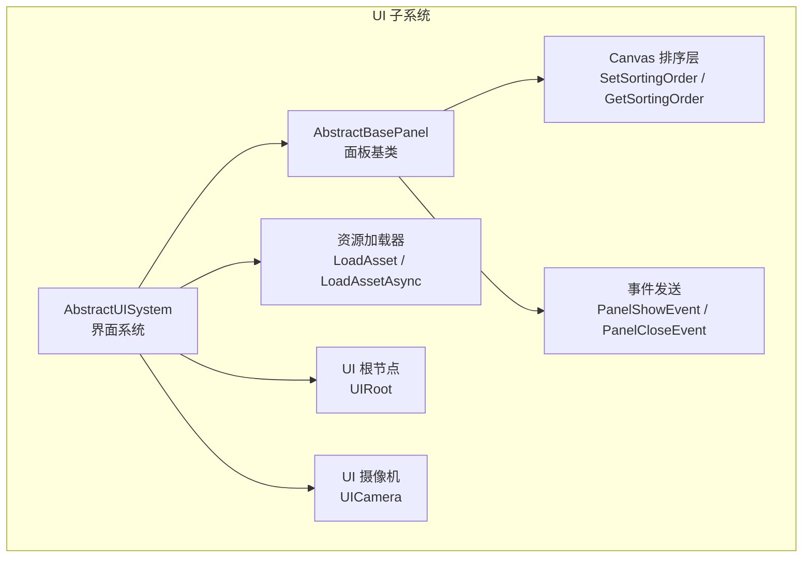
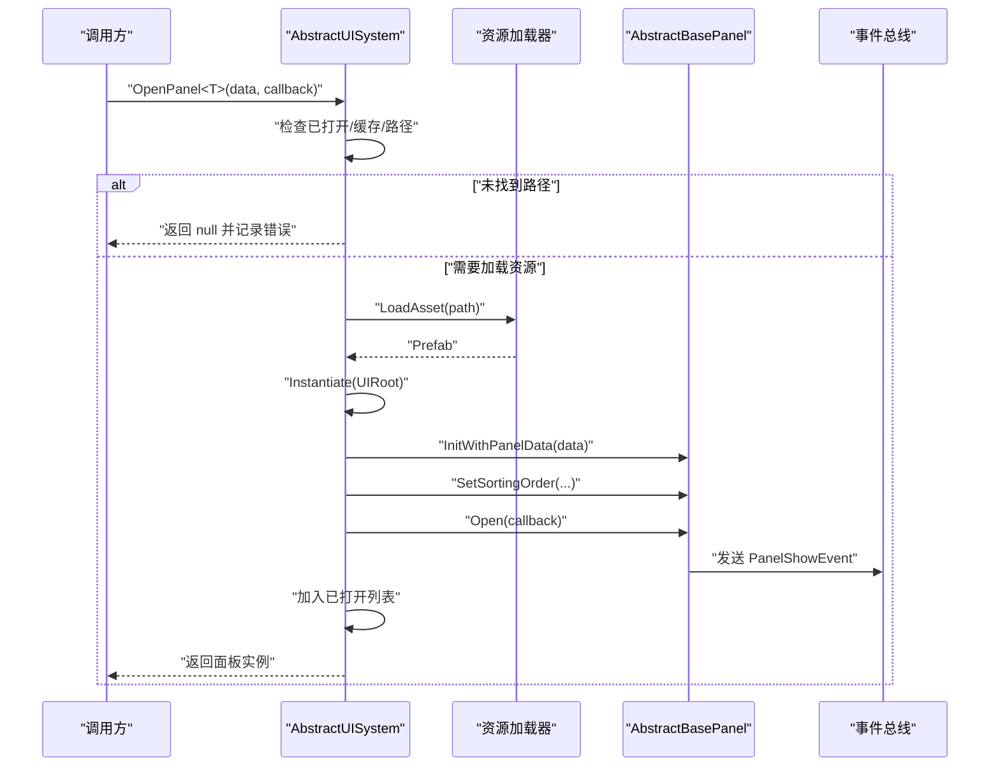
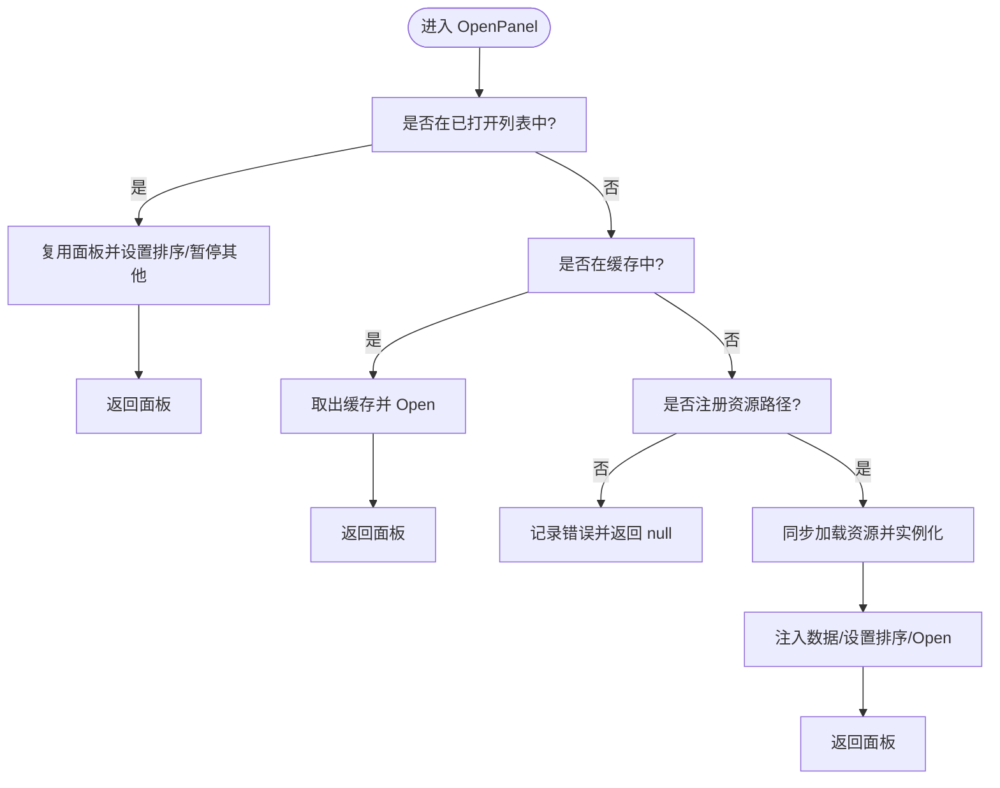
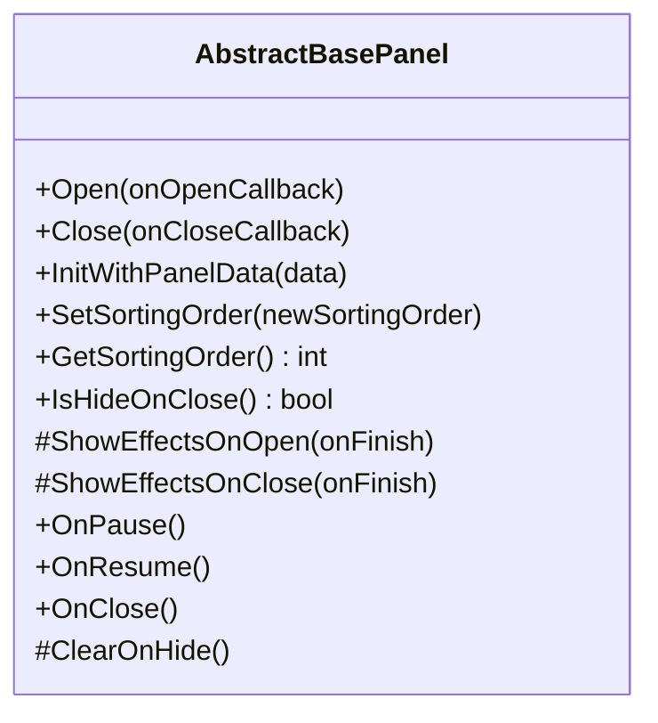
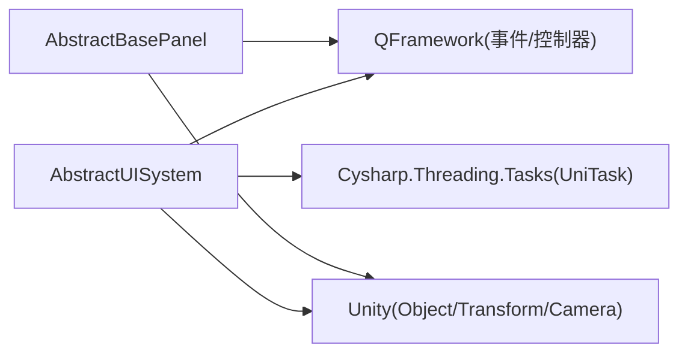

# UI 接口

<cite>
**本文引用的文件**   
- [AbstractUISystem.cs](file://Assets/Game/Framework/Ugui/Runtime/NodePanel\AbstractUISystem.cs)
- [AbstractBasePanel.cs](file://Assets/Game/Framework/Ugui/Runtime/NodePanel\AbstractBasePanel.cs)
</cite>

## 目录
1. [简介](#简介)
2. [项目结构](#项目结构)
3. [核心组件](#核心组件)
4. [架构总览](#架构总览)
5. [详细组件分析](#详细组件分析)
6. [依赖关系分析](#依赖关系分析)
7. [性能与资源管理](#性能与资源管理)
8. [故障排查指南](#故障排查指南)
9. [结论](#结论)
10. [附录：自定义面板实现示例](#附录自定义面板实现示例)

## 简介
本章节为 SimulationClient 项目的 UI 接口文档，聚焦于界面系统基类 AbstractUISystem 与 AbstractBasePanel。内容涵盖生命周期方法、扩展点、打开/关闭/显示/隐藏等核心操作、界面层级管理与资源加载策略、事件处理与用户交互方式，以及性能优化与资源管理的最佳实践。读者可据此快速理解并扩展 UI 框架能力。

## 项目结构
UI 相关核心代码位于 UGUI 运行时模块的 NodePanel 子系统中，包含两个关键基类：
- AbstractUISystem：负责 UI 环境初始化、面板资源路径注册、面板打开/关闭、排序层级管理、缓存与异步加载队列等。
- AbstractBasePanel：定义面板的生命周期钩子（打开、关闭、暂停、恢复、隐藏清理）、动效展示入口、Canvas 排序层控制等。

图表来源
- [AbstractUISystem.cs:11-51](file://Assets/Game/Framework/Ugui/Runtime/NodePanel\AbstractUISystem.cs#L11-L51)
- [AbstractBasePanel.cs:117-142](file://Assets/Game/Framework/Ugui/Runtime/NodePanel\AbstractBasePanel.cs#L117-L142)

章节来源
- [AbstractUISystem.cs:11-51](file://Assets/Game/Framework/Ugui/Runtime/NodePanel\AbstractUISystem.cs#L11-L51)
- [AbstractBasePanel.cs:117-142](file://Assets/Game/Framework/Ugui/Runtime/NodePanel\AbstractBasePanel.cs#L117-L142)

## 核心组件
本节概述两大基类的职责与对外 API。

- AbstractUISystem
  - 职责：维护已打开面板列表、缓存面板字典、面板资源路径映射；提供同步/异步打开面板、关闭指定或全部面板、获取已打开面板、排序层级计算、暂停/恢复其他面板、事件订阅等。
  - 关键 API：OpenPanel<T>、OpenPanelAsync<T>、ClosePanel<T>、CloseAllPanels、GetOpenedPanel<T>、AddPanelLoadPath<T>。
  - 扩展点：SetupEnvironment、RegisterPanelsLoadPath、LoadAsset、LoadAssetAsync。

- AbstractBasePanel
  - 职责：封装面板打开/关闭流程、动效展示入口、暂停/恢复/关闭/隐藏清理等生命周期钩子；管理 Canvas 排序层与是否关闭时隐藏。
  - 关键 API：Open、Close、InitWithPanelData、SetSortingOrder、GetSortingOrder、IsHideOnClose。
  - 扩展点：ShowEffectsOnOpen、ShowEffectsOnClose、OnPause、OnResume、OnClose、ClearOnHide。

章节来源
- [AbstractUISystem.cs:52-192](file://Assets/Game/Framework/Ugui/Runtime/NodePanel\AbstractUISystem.cs#L52-L192)
- [AbstractBasePanel.cs:44-115](file://Assets/Game/Framework/Ugui/Runtime/NodePanel\AbstractBasePanel.cs#L44-L115)

## 架构总览
下图展示了 UI 系统的整体交互：上层通过 AbstractUISystem 打开/关闭面板，系统根据类型查找资源路径并加载实例化，随后将面板加入已打开列表并设置排序层级；面板内部通过事件通知系统更新状态。

图表来源
- [AbstractUISystem.cs:52-112](file://Assets/Game/Framework/Ugui/Runtime/NodePanel\AbstractUISystem.cs#L52-L112)
- [AbstractBasePanel.cs:44-68](file://Assets/Game/Framework/Ugui/Runtime/NodePanel\AbstractBasePanel.cs#L44-L68)

## 详细组件分析

### AbstractUISystem 分析
- 生命周期与环境
  - OnInit：完成环境 Setup、注册面板资源路径、订阅 PanelShowEvent 与 PanelCloseEvent，用于维护已打开面板集合。
  - 扩展点：SetupEnvironment、RegisterPanelsLoadPath、LoadAsset、LoadAssetAsync。

- 打开面板流程
  - OpenPanel<T>：优先复用已打开面板；其次从缓存中取回；若未注册路径则报错；否则同步加载资源、实例化、设置排序、注入数据、触发 Open。
  - OpenPanelAsync<T>：支持异步加载，内部使用 EnqueuePanelAsync 串行执行，避免并发加载导致排序错乱或资源竞争。

- 关闭面板流程
  - ClosePanel<T>：若面板配置为“关闭时隐藏”，则放入缓存；调用面板 Close；恢复上一个活动面板。
  - CloseAllPanels：逆序遍历已打开面板，按策略缓存或销毁，统一关闭。

- 层级与暂停/恢复
  - GetNewPanelSortingOrder：基于当前最大排序值递增分配新层级，保证后打开的面板在最上层。
  - PauseOtherPanels / ResumeLastActivePanel：当新面板打开或旧面板关闭时，对非活动面板调用 OnPause，对活动面板调用 OnResume。

- 资源路径注册
  - AddPanelLoadPath<T>：在 RegisterPanelsLoadPath 中集中注册各面板类型对应的资源路径。

图表来源
- [AbstractUISystem.cs:52-112](file://Assets/Game/Framework/Ugui/Runtime/NodePanel\AbstractUISystem.cs#L52-L112)

章节来源
- [AbstractUISystem.cs:316-342](file://Assets/Game/Framework/Ugui/Runtime/NodePanel\AbstractUISystem.cs#L316-L342)
- [AbstractUISystem.cs:52-192](file://Assets/Game/Framework/Ugui/Runtime/NodePanel\AbstractUISystem.cs#L52-L192)
- [AbstractUISystem.cs:194-245](file://Assets/Game/Framework/Ugui/Runtime/NodePanel\AbstractUISystem.cs#L194-L245)
- [AbstractUISystem.cs:260-314](file://Assets/Game/Framework/Ugui/Runtime/NodePanel\AbstractUISystem.cs#L260-L314)

### AbstractBasePanel 分析
- 打开/关闭流程
  - Open：激活 GameObject，调用 OnResume，可选播放打开动效，完成后发送 PanelShowEvent 并执行回调。
  - Close：调用 OnClose，可选播放关闭动效，结束后发送 PanelCloseEvent，依据 hideOnClose 决定销毁或隐藏。

- 生命周期钩子（供派生类重写）
  - InitWithPanelData：接收面板数据初始化。
  - ShowEffectsOnOpen / ShowEffectsOnClose：打开/关闭动效入口。
  - OnPause / OnResume：面板暂停/恢复时的逻辑。
  - OnClose：关闭前逻辑。
  - ClearOnHide：隐藏时的清理逻辑。

- 层级与可见性
  - SetSortingOrder / GetSortingOrder：控制 Canvas 的 overrideSorting 与 sortingOrder。
  - IsHideOnClose：判断关闭时是否隐藏而非销毁。

图表来源
- [AbstractBasePanel.cs:44-115](file://Assets/Game/Framework/Ugui/Runtime/NodePanel\AbstractBasePanel.cs#L44-L115)
- [AbstractBasePanel.cs:122-151](file://Assets/Game/Framework/Ugui/Runtime/NodePanel\AbstractBasePanel.cs#L122-L151)
- [AbstractBasePanel.cs:153-213](file://Assets/Game/Framework/Ugui/Runtime/NodePanel\AbstractBasePanel.cs#L153-L213)

章节来源
- [AbstractBasePanel.cs:44-115](file://Assets/Game/Framework/Ugui/Runtime/NodePanel\AbstractBasePanel.cs#L44-L115)
- [AbstractBasePanel.cs:117-151](file://Assets/Game/Framework/Ugui/Runtime/NodePanel\AbstractBasePanel.cs#L117-L151)
- [AbstractBasePanel.cs:153-213](file://Assets/Game/Framework/Ugui/Runtime/NodePanel\AbstractBasePanel.cs#L153-L213)

## 依赖关系分析
- AbstractUISystem 依赖
  - QFramework：事件注册与发送（SendEvent）。
  - Unity：Object.Instantiate、Transform、Camera、GameObject 等。
  - Cysharp.Threading.Tasks：UniTask 异步支持。
- AbstractBasePanel 依赖
  - QFramework：AbstractMonoBehaviourController、ICanSendEvent、SendEvent。
  - Unity：Canvas、GameObject。

图表来源
- [AbstractUISystem.cs:1-8](file://Assets/Game/Framework/Ugui/Runtime/NodePanel\AbstractUISystem.cs#L1-L8)
- [AbstractBasePanel.cs:1-4](file://Assets/Game/Framework/Ugui/Runtime/NodePanel\AbstractBasePanel.cs#L1-L4)

章节来源
- [AbstractUISystem.cs:1-8](file://Assets/Game/Framework/Ugui/Runtime/NodePanel\AbstractUISystem.cs#L1-L8)
- [AbstractBasePanel.cs:1-4](file://Assets/Game/Framework/Ugui/Runtime/NodePanel\AbstractBasePanel.cs#L1-L4)

## 性能与资源管理
- 资源加载策略
  - 同步加载：OpenPanel<T> 直接 LoadAsset，适合小资源或启动阶段。
  - 异步加载：OpenPanelAsync<T> 使用 EnqueuePanelAsync 串行队列，避免并发导致的排序与状态问题。
  - 建议：在大场景或多面板频繁切换时优先使用异步加载，结合资源池减少 GC 压力。

- 面板缓存与复用
  - 关闭时若 hideOnClose 为真，面板会被缓存并在下次打开时复用，避免重复实例化与资源加载。
  - 建议在高频打开/关闭的面板（如弹窗、提示）上启用 hideOnClose，并在 ClearOnHide 中释放引用与停止协程。

- 层级与渲染
  - 通过 GetNewPanelSortingOrder 动态递增排序值，确保后打开的面板始终在最上层。
  - 建议合理设置 SortingOrderAddition，避免排序值过大造成浮点精度问题。

- 暂停/恢复
  - 新面板打开时，对其他面板调用 OnPause；关闭时恢复上一个活动面板并再次暂停其余面板。
  - 建议在 OnPause 中停止动画、音频、定时器；在 OnResume 中恢复。

- 事件驱动
  - 面板通过 PanelShowEvent / PanelCloseEvent 通知系统维护已打开列表，降低耦合度。
  - 建议在业务层监听这些事件进行统计或日志记录。

[本节为通用指导，不直接分析具体文件]

## 故障排查指南
- 未注册资源路径
  - 现象：打开面板返回 null 并记录错误。
  - 排查：确认 RegisterPanelsLoadPath 中是否调用 AddPanelLoadPath<T>("path")。
  - 参考位置：[AbstractUISystem.cs:88-92](file://Assets/Game/Framework/Ugui/Runtime/NodePanel\AbstractUISystem.cs#L88-L92)、[AbstractUISystem.cs:156-161](file://Assets/Game/Framework/Ugui/Runtime/NodePanel\AbstractUISystem.cs#L156-L161)

- 资源加载失败
  - 现象：未能加载资源或实例化失败。
  - 排查：检查 LoadAsset/LoadAssetAsync 的实现是否正确返回有效对象；确认资源路径与打包配置一致。
  - 参考位置：[AbstractUISystem.cs:93-100](file://Assets/Game/Framework/Ugui/Runtime/NodePanel\AbstractUISystem.cs#L93-L100)、[AbstractUISystem.cs:163-170](file://Assets/Game/Framework/Ugui/Runtime/NodePanel\AbstractUISystem.cs#L163-L170)

- 面板未继承正确基类
  - 现象：实例化后找不到组件或报错。
  - 排查：确保 Prefab 挂载的脚本继承自 AbstractBasePanel。
  - 参考位置：[AbstractUISystem.cs:103-107](file://Assets/Game/Framework/Ugui/Runtime/NodePanel\AbstractUISystem.cs#L103-L107)、[AbstractUISystem.cs:173-178](file://Assets/Game/Framework/Ugui/Runtime/NodePanel\AbstractUISystem.cs#L173-L178)

- 层级异常
  - 现象：面板被遮挡或层级错乱。
  - 排查：检查 SetSortingOrder 是否生效；确认 Canvas.overrideSorting 与 sortingOrder 设置。
  - 参考位置：[AbstractBasePanel.cs:122-142](file://Assets/Game/Framework/Ugui/Runtime/NodePanel\AbstractBasePanel.cs#L122-L142)

- 关闭后仍占用内存
  - 现象：面板关闭后未被销毁且无后续使用。
  - 排查：确认 hideOnClose 配置；必要时在业务层主动 CloseAllPanels 或手动销毁。
  - 参考位置：[AbstractBasePanel.cs:97-105](file://Assets/Game/Framework/Ugui/Runtime/NodePanel\AbstractBasePanel.cs#L97-L105)

章节来源
- [AbstractUISystem.cs:88-107](file://Assets/Game/Framework/Ugui/Runtime/NodePanel\AbstractUISystem.cs#L88-L107)
- [AbstractUISystem.cs:156-178](file://Assets/Game/Framework/Ugui/Runtime/NodePanel\AbstractUISystem.cs#L156-L178)
- [AbstractBasePanel.cs:122-142](file://Assets/Game/Framework/Ugui/Runtime/NodePanel\AbstractBasePanel.cs#L122-L142)
- [AbstractBasePanel.cs:97-105](file://Assets/Game/Framework/Ugui/Runtime/NodePanel\AbstractBasePanel.cs#L97-L105)

## 结论
AbstractUISystem 与 AbstractBasePanel 共同构成了 SimulationClient 的 UI 基础框架：前者负责面板生命周期编排、资源加载与层级管理，后者提供统一的打开/关闭流程与扩展钩子。遵循本文档的实践建议，可在保证性能与稳定性的前提下高效扩展各类 UI 面板。

[本节为总结，不直接分析具体文件]

## 附录：自定义面板实现示例
以下为创建自定义 UI 面板的步骤与要点（以路径引用代替代码片段）：

- 步骤概览
  - 新建一个继承自 AbstractBasePanel 的脚本，并在 Prefab 上挂载该组件。
  - 在 AbstractUISystem 的子类中，重写 RegisterPanelsLoadPath，调用 AddPanelLoadPath<YourPanel>("资源路径")。
  - 在 YourPanel 中根据需要重写 InitWithPanelData、ShowEffectsOnOpen、ShowEffectsOnClose、OnPause、OnResume、OnClose、ClearOnHide。
  - 通过 AbstractUISystem.OpenPanel<YourPanel> 或 OpenPanelAsync<YourPanel> 打开面板。

- 关键实现参考
  - 注册资源路径：[AbstractUISystem.cs:339-342](file://Assets/Game/Framework/Ugui/Runtime/NodePanel\AbstractUISystem.cs#L339-L342)
  - 打开面板（同步/异步）：[AbstractUISystem.cs:52-112](file://Assets/Game/Framework/Ugui/Runtime/NodePanel\AbstractUISystem.cs#L52-L112)、[AbstractUISystem.cs:115-143](file://Assets/Game/Framework/Ugui/Runtime/NodePanel\AbstractUISystem.cs#L115-L143)
  - 面板生命周期钩子：[AbstractBasePanel.cs:153-213](file://Assets/Game/Framework/Ugui/Runtime/NodePanel\AbstractBasePanel.cs#L153-L213)
  - 动效入口：[AbstractBasePanel.cs:167-179](file://Assets/Game/Framework/Ugui/Runtime/NodePanel\AbstractBasePanel.cs#L167-L179)
  - 排序层控制：[AbstractBasePanel.cs:122-142](file://Assets/Game/Framework/Ugui/Runtime/NodePanel\AbstractBasePanel.cs#L122-L142)

- 常见模式
  - 弹窗类面板：hideOnClose = true，在 ClearOnHide 中清空文本/图片引用，避免内存泄漏。
  - 全屏面板：在 OnPause 中暂停背景动画/音频，在 OnResume 中恢复。
  - 多步引导：在 InitWithPanelData 中读取步骤数据，配合 ShowEffectsOnOpen 做入场动画。

[本节为概念性示例，不直接分析具体文件]