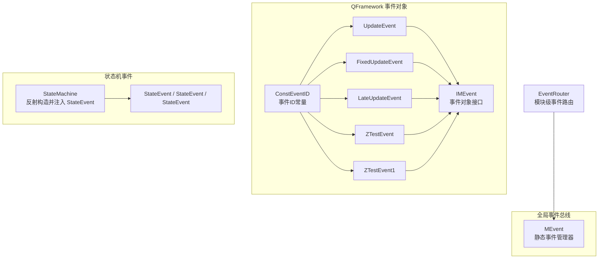
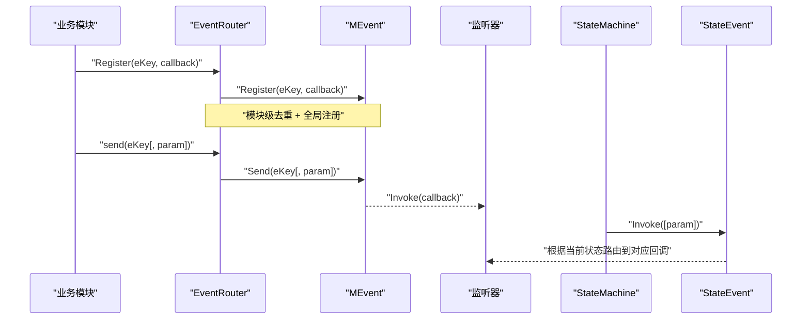
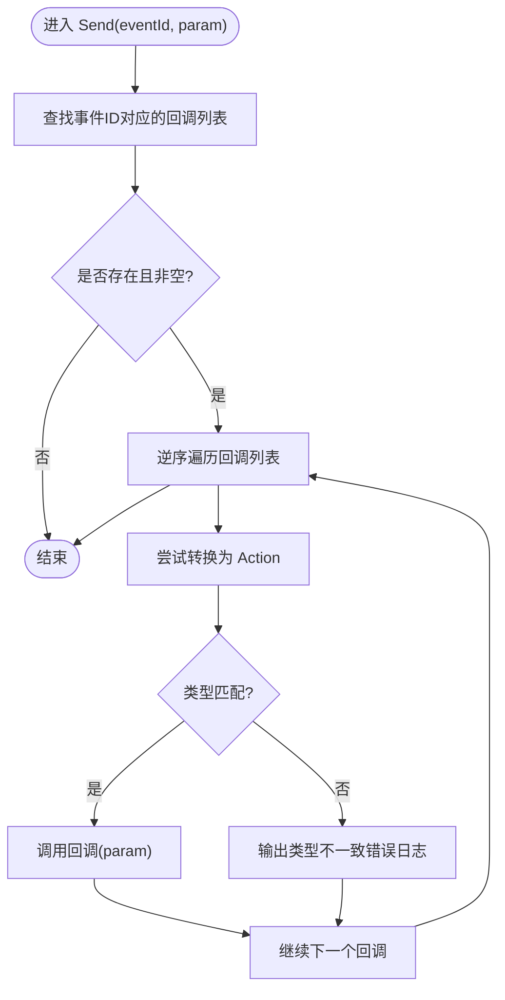
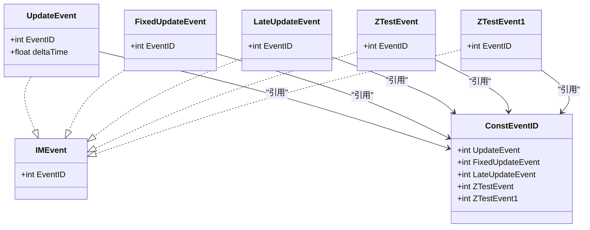
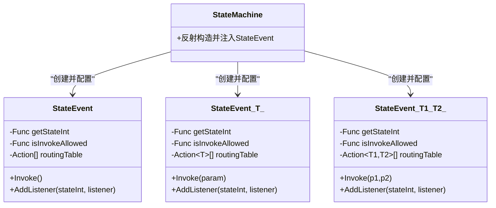
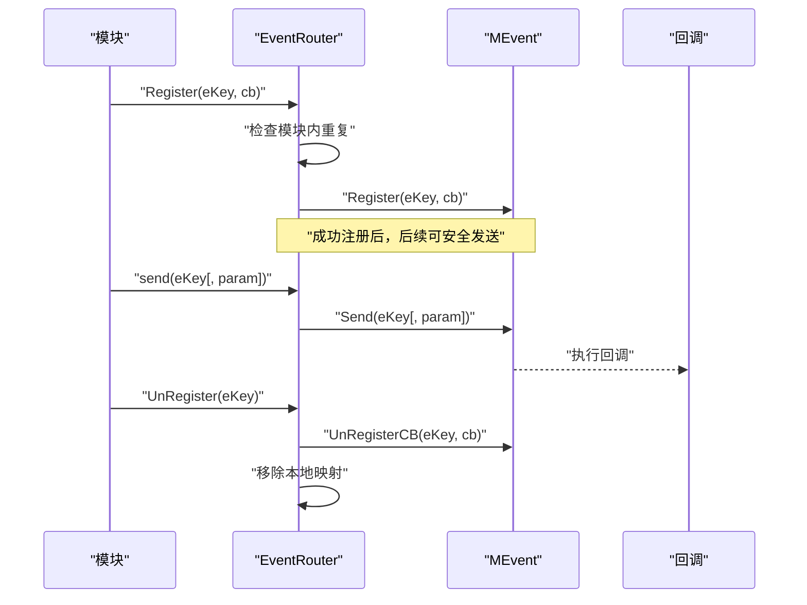
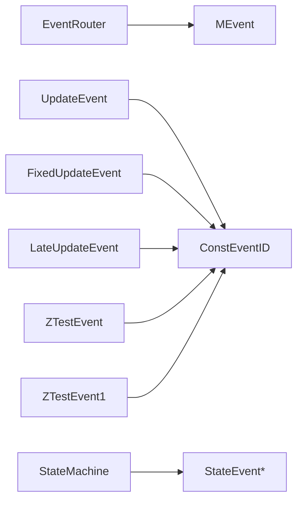

# 事件接口

<cite>
**本文引用的文件**   
- [MEvent.cs](file://Assets/Game/Framework/MEvent/MEvent.cs)
- [IMEvent.cs](file://Assets/Game/Framework/Qframework/Runtime/Moyv/Events/IMEvent.cs)
- [UpdateEvent.cs](file://Assets/Game/Framework/Qframework/Runtime/Moyv/Events/UpdateEvent.cs)
- [FixedUpdateEvent.cs](file://Assets/Game/Framework/Qframework/Runtime/Moyv/Events/FixedUpdateEvent.cs)
- [LateUpdateEvent.cs](file://Assets/Game/Framework/Qframework/Runtime/Moyv/Events/LateUpdateEvent.cs)
- [ZTestEvent.cs](file://Assets/Game/Framework/Qframework/Runtime/Moyv/Events/ZTestEvent.cs)
- [ZTestEvent1.cs](file://Assets/Game/Framework/Qframework/Runtime/Moyv/Events/ZTestEvent1.cs)
- [ConstEventID.cs](file://Assets/Game/Framework/Qframework/Runtime/Moyv/Events/ConstEventID.cs)
- [StateEvent.cs](file://Assets/Game/Framework/FSM/Runtime/Events/StateEvent.cs)
- [StateMachine.cs](file://Assets/Game/Framework/FSM/Runtime/StateMachine.cs)
- [EventRouter.cs](file://Assets/Game/Scripts/Game/Runtime/Logic/Router/EventRouter.cs)
</cite>

## 目录
1. [简介](#简介)
2. [项目结构](#项目结构)
3. [核心组件](#核心组件)
4. [架构总览](#架构总览)
5. [详细组件分析](#详细组件分析)
6. [依赖分析](#依赖分析)
7. [性能考虑](#性能考虑)
8. [故障排查指南](#故障排查指南)
9. [结论](#结论)
10. [附录](#附录)

## 简介
本文件为 SimulationClient 项目中的事件系统 API 文档，聚焦以下目标：
- 记录 MEvent 事件系统的核心接口与方法，包括事件的注册、触发与销毁。
- 文档化 IMEvent 接口的设计模式与实现要求。
- 解释状态机事件 StateEvent 的使用方式与生命周期管理。
- 提供事件驱动编程的完整示例，展示如何设计和使用自定义事件。
- 说明多线程环境下的事件处理与安全考虑。
- 给出事件系统的性能优化与内存管理建议。

## 项目结构
事件系统由三层组成：
- 轻量全局事件总线：MEvent（基于 int 事件 ID 与 Action 委托）
- 面向 QFramework 的事件对象体系：IMEvent 及其具体事件类型（如 UpdateEvent、FixedUpdateEvent、LateUpdateEvent、ZTestEvent 等），配合 ConstEventID 集中管理事件 ID
- 状态机事件：StateEvent（按当前状态路由到对应监听器）

图表来源
- [MEvent.cs:1-288](file://Assets/Game/Framework/MEvent/MEvent.cs#L1-L288)
- [IMEvent.cs:1-4](file://Assets/Game/Framework/Qframework/Runtime/Moyv/Events/IMEvent.cs#L1-L4)
- [UpdateEvent.cs:1-7](file://Assets/Game/Framework/Qframework/Runtime/Moyv/Events/UpdateEvent.cs#L1-L7)
- [FixedUpdateEvent.cs:1-7](file://Assets/Game/Framework/Qframework/Runtime/Moyv/Events/FixedUpdateEvent.cs#L1-L7)
- [LateUpdateEvent.cs:1-7](file://Assets/Game/Framework/Qframework/Runtime/Moyv/Events/LateUpdateEvent.cs#L1-L7)
- [ZTestEvent.cs:1-7](file://Assets/Game/Framework/Qframework/Runtime/Moyv/Events/ZTestEvent.cs#L1-L7)
- [ZTestEvent1.cs:1-7](file://Assets/Game/Framework/Qframework/Runtime/Moyv/Events/ZTestEvent1.cs#L1-L7)
- [ConstEventID.cs:1-200](file://Assets/Game/Framework/Qframework/Runtime/Moyv/Events/ConstEventID.cs#L1-L200)
- [StateEvent.cs:1-132](file://Assets/Game/Framework/FSM/Runtime/Events/StateEvent.cs#L1-L132)
- [StateMachine.cs:206-253](file://Assets/Game/Framework/FSM/Runtime/StateMachine.cs#L206-L253)
- [EventRouter.cs:1-90](file://Assets/Game/Scripts/Game/Runtime/Logic/Router/EventRouter.cs#L1-L90)

章节来源
- [MEvent.cs:1-288](file://Assets/Game/Framework/MEvent/MEvent.cs#L1-L288)
- [IMEvent.cs:1-4](file://Assets/Game/Framework/Qframework/Runtime/Moyv/Events/IMEvent.cs#L1-L4)
- [UpdateEvent.cs:1-7](file://Assets/Game/Framework/Qframework/Runtime/Moyv/Events/UpdateEvent.cs#L1-L7)
- [FixedUpdateEvent.cs:1-7](file://Assets/Game/Framework/Qframework/Runtime/Moyv/Events/FixedUpdateEvent.cs#L1-L7)
- [LateUpdateEvent.cs:1-7](file://Assets/Game/Framework/Qframework/Runtime/Moyv/Events/LateUpdateEvent.cs#L1-L7)
- [ZTestEvent.cs:1-7](file://Assets/Game/Framework/Qframework/Runtime/Moyv/Events/ZTestEvent.cs#L1-L7)
- [ZTestEvent1.cs:1-7](file://Assets/Game/Framework/Qframework/Runtime/Moyv/Events/ZTestEvent1.cs#L1-L7)
- [ConstEventID.cs:1-200](file://Assets/Game/Framework/Qframework/Runtime/Moyv/Events/ConstEventID.cs#L1-L200)
- [StateEvent.cs:1-132](file://Assets/Game/Framework/FSM/Runtime/Events/StateEvent.cs#L1-L132)
- [StateMachine.cs:206-253](file://Assets/Game/Framework/FSM/Runtime/StateMachine.cs#L206-L253)
- [EventRouter.cs:1-90](file://Assets/Game/Scripts/Game/Runtime/Logic/Router/EventRouter.cs#L1-L90)

## 核心组件
- MEvent：全局静态事件总线，使用字典维护事件 ID 到回调列表的映射，支持无参与单参泛型回调的注册、注销与发送。
- IMEvent：事件对象接口，仅暴露 EventID 属性，用于以对象形式承载事件数据与标识。
- 具体事件对象：UpdateEvent、FixedUpdateEvent、LateUpdateEvent、ZTestEvent、ZTestEvent1 等，均实现 IMEvent，并通过 ConstEventID 提供稳定的事件 ID。
- StateEvent：状态机内的事件路由机制，根据当前状态将调用分发到对应监听器，支持无参与带参版本。
- EventRouter：模块级事件路由器，封装对 MEvent 的注册/注销/发送，并提供重复注册保护与统一回收。

章节来源
- [MEvent.cs:1-288](file://Assets/Game/Framework/MEvent/MEvent.cs#L1-L288)
- [IMEvent.cs:1-4](file://Assets/Game/Framework/Qframework/Runtime/Moyv/Events/IMEvent.cs#L1-L4)
- [UpdateEvent.cs:1-7](file://Assets/Game/Framework/Qframework/Runtime/Moyv/Events/UpdateEvent.cs#L1-L7)
- [FixedUpdateEvent.cs:1-7](file://Assets/Game/Framework/Qframework/Runtime/Moyv/Events/FixedUpdateEvent.cs#L1-L7)
- [LateUpdateEvent.cs:1-7](file://Assets/Game/Framework/Qframework/Runtime/Moyv/Events/LateUpdateEvent.cs#L1-L7)
- [ZTestEvent.cs:1-7](file://Assets/Game/Framework/Qframework/Runtime/Moyv/Events/ZTestEvent.cs#L1-L7)
- [ZTestEvent1.cs:1-7](file://Assets/Game/Framework/Qframework/Runtime/Moyv/Events/ZTestEvent1.cs#L1-L7)
- [ConstEventID.cs:1-200](file://Assets/Game/Framework/Qframework/Runtime/Moyv/Events/ConstEventID.cs#L1-L200)
- [StateEvent.cs:1-132](file://Assets/Game/Framework/FSM/Runtime/Events/StateEvent.cs#L1-L132)
- [EventRouter.cs:1-90](file://Assets/Game/Scripts/Game/Runtime/Logic/Router/EventRouter.cs#L1-L90)

## 架构总览
下图展示了从模块到事件总线再到监听器的整体流程，以及状态机事件在 FSM 中的角色。

图表来源
- [EventRouter.cs:24-85](file://Assets/Game/Scripts/Game/Runtime/Logic/Router/EventRouter.cs#L24-L85)
- [MEvent.cs:25-165](file://Assets/Game/Framework/MEvent/MEvent.cs#L25-L165)
- [StateEvent.cs:31-131](file://Assets/Game/Framework/FSM/Runtime/Events/StateEvent.cs#L31-L131)
- [StateMachine.cs:206-253](file://Assets/Game/Framework/FSM/Runtime/StateMachine.cs#L206-L253)

## 详细组件分析

### MEvent 事件总线
- 职责
  - 维护事件 ID 到回调集合的映射。
  - 提供 Register/Send/UnRegisterCB/OnReset 等静态方法。
- 关键行为
  - 注册时检测重复回调并告警。
  - 发送时按逆序遍历回调列表执行，避免在遍历过程中修改集合导致异常。
  - Send<T> 会校验参数类型一致性，不匹配则输出错误日志。
- 生命周期
  - OnReset 清空所有事件映射，适合场景切换或重置时使用。
- 线程安全
  - 内部使用非线程安全的集合，未加锁；不建议跨线程并发读写。

图表来源
- [MEvent.cs:144-165](file://Assets/Game/Framework/MEvent/MEvent.cs#L144-L165)

章节来源
- [MEvent.cs:1-288](file://Assets/Game/Framework/MEvent/MEvent.cs#L1-L288)

### IMEvent 事件对象与具体事件
- 设计模式
  - 通过 IMEvent 抽象事件对象，强制每个事件具备唯一 EventID。
  - 结合 ConstEventID 集中管理事件 ID，避免魔法数字。
- 典型事件
  - UpdateEvent、FixedUpdateEvent、LateUpdateEvent：与 Unity 帧循环相关的事件载体。
  - ZTestEvent、ZTestEvent1：示例业务事件。
- 实现要求
  - 实现 IMEvent 接口，提供 EventID 属性。
  - 建议使用 static readonly 或 static property 暴露 eventID，并从 ConstEventID 获取。

图表来源
- [IMEvent.cs:1-4](file://Assets/Game/Framework/Qframework/Runtime/Moyv/Events/IMEvent.cs#L1-L4)
- [UpdateEvent.cs:1-7](file://Assets/Game/Framework/Qframework/Runtime/Moyv/Events/UpdateEvent.cs#L1-L7)
- [FixedUpdateEvent.cs:1-7](file://Assets/Game/Framework/Qframework/Runtime/Moyv/Events/FixedUpdateEvent.cs#L1-L7)
- [LateUpdateEvent.cs:1-7](file://Assets/Game/Framework/Qframework/Runtime/Moyv/Events/LateUpdateEvent.cs#L1-L7)
- [ZTestEvent.cs:1-7](file://Assets/Game/Framework/Qframework/Runtime/Moyv/Events/ZTestEvent.cs#L1-L7)
- [ZTestEvent1.cs:1-7](file://Assets/Game/Framework/Qframework/Runtime/Moyv/Events/ZTestEvent1.cs#L1-L7)
- [ConstEventID.cs:1-200](file://Assets/Game/Framework/Qframework/Runtime/Moyv/Events/ConstEventID.cs#L1-L200)

章节来源
- [IMEvent.cs:1-4](file://Assets/Game/Framework/Qframework/Runtime/Moyv/Events/IMEvent.cs#L1-L4)
- [UpdateEvent.cs:1-7](file://Assets/Game/Framework/Qframework/Runtime/Moyv/Events/UpdateEvent.cs#L1-L7)
- [FixedUpdateEvent.cs:1-7](file://Assets/Game/Framework/Qframework/Runtime/Moyv/Events/FixedUpdateEvent.cs#L1-L7)
- [LateUpdateEvent.cs:1-7](file://Assets/Game/Framework/Qframework/Runtime/Moyv/Events/LateUpdateEvent.cs#L1-L7)
- [ZTestEvent.cs:1-7](file://Assets/Game/Framework/Qframework/Runtime/Moyv/Events/ZTestEvent.cs#L1-L7)
- [ZTestEvent1.cs:1-7](file://Assets/Game/Framework/Qframework/Runtime/Moyv/Events/ZTestEvent1.cs#L1-L7)
- [ConstEventID.cs:1-200](file://Assets/Game/Framework/Qframework/Runtime/Moyv/Events/ConstEventID.cs#L1-L200)

### 状态机事件 StateEvent
- 设计要点
  - 通过 isInvokeAllowed 控制是否允许在当前上下文触发。
  - 通过 getStateInt 获取当前状态索引，作为路由表下标。
  - 内部维护固定容量的路由表，按状态索引直接定位监听器。
- 生命周期
  - 由 StateMachine 反射发现字段并构造 StateEvent，注入到 Driver 中。
  - 在合适的时机调用 Invoke 完成状态相关的事件分发。
- 使用约束
  - 容量需合理预估，避免越界。
  - 仅在状态机上下文中使用，外部不建议直接使用。

图表来源
- [StateEvent.cs:31-131](file://Assets/Game/Framework/FSM/Runtime/Events/StateEvent.cs#L31-L131)
- [StateMachine.cs:206-253](file://Assets/Game/Framework/FSM/Runtime/StateMachine.cs#L206-L253)

章节来源
- [StateEvent.cs:1-132](file://Assets/Game/Framework/FSM/Runtime/Events/StateEvent.cs#L1-L132)
- [StateMachine.cs:206-253](file://Assets/Game/Framework/FSM/Runtime/StateMachine.cs#L206-L253)

### 模块级事件路由 EventRouter
- 职责
  - 为模块提供统一的注册/注销/发送入口。
  - 维护模块内事件到回调的映射，防止同一模块重复注册。
  - 在回收/重置时统一注销所有事件，避免泄漏。
- 与 MEvent 的关系
  - 所有注册最终委托给 MEvent.Register。
  - 发送委托给 MEvent.Send。
  - 注销委托给 MEvent.UnRegisterCB。

图表来源
- [EventRouter.cs:24-85](file://Assets/Game/Scripts/Game/Runtime/Logic/Router/EventRouter.cs#L24-L85)
- [MEvent.cs:25-165](file://Assets/Game/Framework/MEvent/MEvent.cs#L25-L165)

章节来源
- [EventRouter.cs:1-90](file://Assets/Game/Scripts/Game/Runtime/Logic/Router/EventRouter.cs#L1-L90)
- [MEvent.cs:1-288](file://Assets/Game/Framework/MEvent/MEvent.cs#L1-L288)

## 依赖分析
- 耦合关系
  - EventRouter 强依赖 MEvent，负责模块边界内的注册管理与复用。
  - 具体事件对象依赖 ConstEventID，确保事件 ID 的一致性。
  - StateMachine 依赖 StateEvent，通过反射动态构建并注入。
- 潜在风险
  - MEvent 使用非线程安全集合，跨线程并发访问可能导致异常。
  - StateEvent 的路由表容量固定，超出容量会导致越界。
  - 事件发送时若参数类型与注册不一致，会输出错误日志但不会中断流程。

图表来源
- [EventRouter.cs:1-90](file://Assets/Game/Scripts/Game/Runtime/Logic/Router/EventRouter.cs#L1-L90)
- [MEvent.cs:1-288](file://Assets/Game/Framework/MEvent/MEvent.cs#L1-L288)
- [ConstEventID.cs:1-200](file://Assets/Game/Framework/Qframework/Runtime/Moyv/Events/ConstEventID.cs#L1-L200)
- [StateEvent.cs:1-132](file://Assets/Game/Framework/FSM/Runtime/Events/StateEvent.cs#L1-L132)
- [StateMachine.cs:206-253](file://Assets/Game/Framework/FSM/Runtime/StateMachine.cs#L206-L253)

章节来源
- [EventRouter.cs:1-90](file://Assets/Game/Scripts/Game/Runtime/Logic/Router/EventRouter.cs#L1-L90)
- [MEvent.cs:1-288](file://Assets/Game/Framework/MEvent/MEvent.cs#L1-L288)
- [ConstEventID.cs:1-200](file://Assets/Game/Framework/Qframework/Runtime/Moyv/Events/ConstEventID.cs#L1-L200)
- [StateEvent.cs:1-132](file://Assets/Game/Framework/FSM/Runtime/Events/StateEvent.cs#L1-L132)
- [StateMachine.cs:206-253](file://Assets/Game/Framework/FSM/Runtime/StateMachine.cs#L206-L253)

## 性能考虑
- 事件注册与发送
  - 使用逆序遍历以避免在遍历期间删除元素导致的迭代器失效问题。
  - 建议尽量使用无参或单参事件，减少装箱与类型转换开销。
- 内存管理
  - 在场景切换或模块销毁时，务必调用 UnRegisterAll 或 MEvent.OnReset，避免回调持有长生命周期对象导致内存泄漏。
  - 对于高频事件（如 UpdateEvent），建议合并或节流，降低每帧事件数量。
- 状态机事件
  - 合理设置 StateEvent 的 capacity，避免扩容与越界。
  - 将复杂逻辑下沉到独立处理器，保持 Invoke 路径短小。

[本节为通用指导，无需列出具体文件来源]

## 故障排查指南
- 常见问题
  - 重复注册警告：当同一回调被重复注册时会输出警告，检查模块初始化逻辑，确保只注册一次。
  - 参数类型不一致：Send<T> 与 Register<T> 的类型必须一致，否则会在运行时输出错误日志。
  - 未注销导致回调仍被调用：确认模块回收时调用了 UnRegisterAll 或 MEvent.OnReset。
- 定位步骤
  - 查看 MEvent 的错误日志，定位事件 ID 与参数类型。
  - 检查 EventRouter 的重复注册保护是否生效。
  - 对于状态机事件，确认当前状态是否正确，以及 StateEvent 的 capacity 是否足够。

章节来源
- [MEvent.cs:60-79](file://Assets/Game/Framework/MEvent/MEvent.cs#L60-L79)
- [MEvent.cs:144-165](file://Assets/Game/Framework/MEvent/MEvent.cs#L144-L165)
- [EventRouter.cs:24-48](file://Assets/Game/Scripts/Game/Runtime/Logic/Router/EventRouter.cs#L24-L48)
- [EventRouter.cs:65-72](file://Assets/Game/Scripts/Game/Runtime/Logic/Router/EventRouter.cs#L65-L72)

## 结论
- MEvent 提供了轻量、易用且高效的全局事件总线，适合解耦模块间通信。
- IMEvent 与 ConstEventID 的组合提升了事件的可维护性与可读性。
- StateEvent 为状态机提供了按状态路由的事件机制，简化了状态相关逻辑的组织。
- 在生产环境中，应重视事件的生命周期管理、线程安全与性能优化，避免内存泄漏与性能瓶颈。

[本节为总结性内容，无需列出具体文件来源]

## 附录
- 自定义事件最佳实践
  - 定义事件对象：实现 IMEvent，并在 ConstEventID 中分配稳定 ID。
  - 注册与发送：优先使用 EventRouter 进行模块内注册与发送，确保生命周期一致。
  - 清理策略：在模块回收时调用 UnRegisterAll，或在场景切换时调用 MEvent.OnReset。
  - 线程模型：事件处理应在主线程执行，避免跨线程访问 Unity API。
  - 性能优化：合并高频事件、减少参数传递、避免在回调中进行重型计算。

[本节为概念性指导，无需列出具体文件来源]