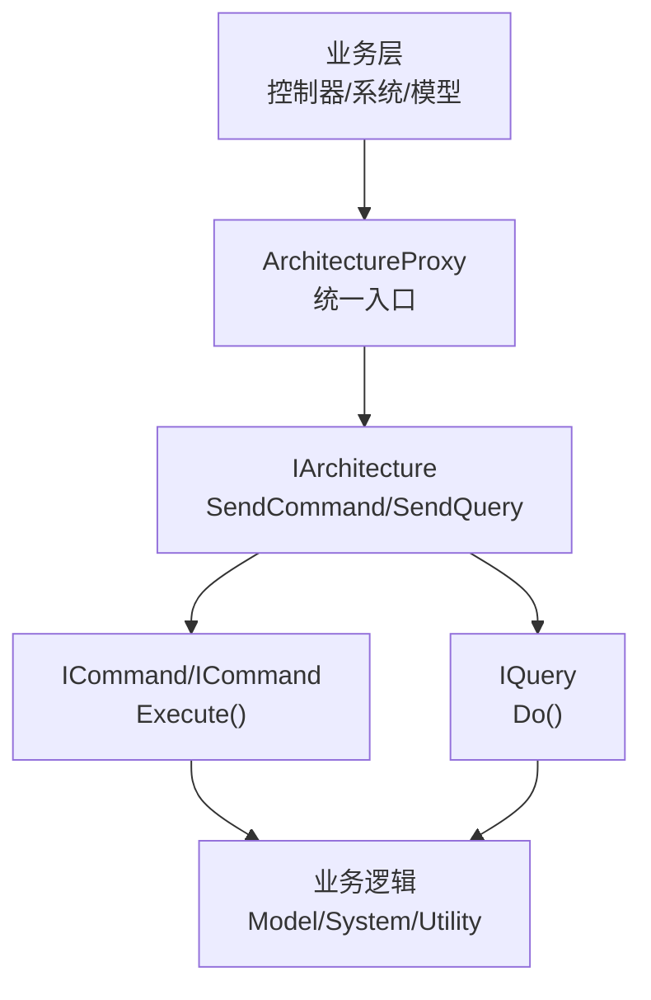
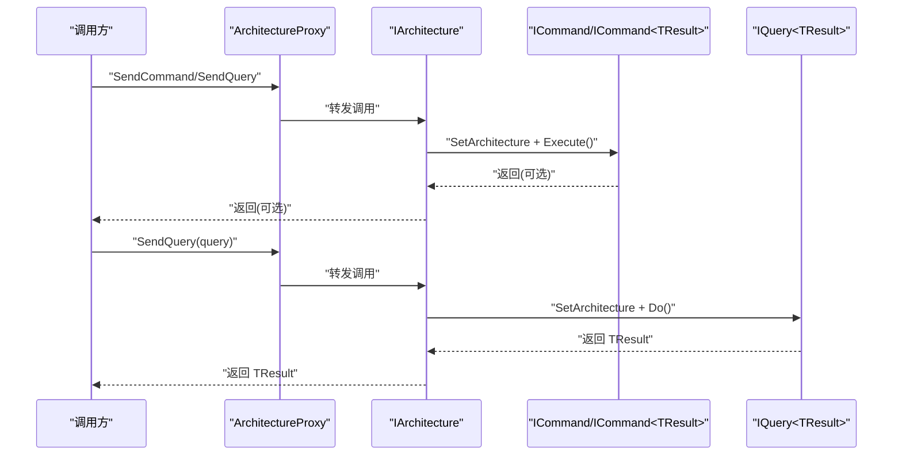
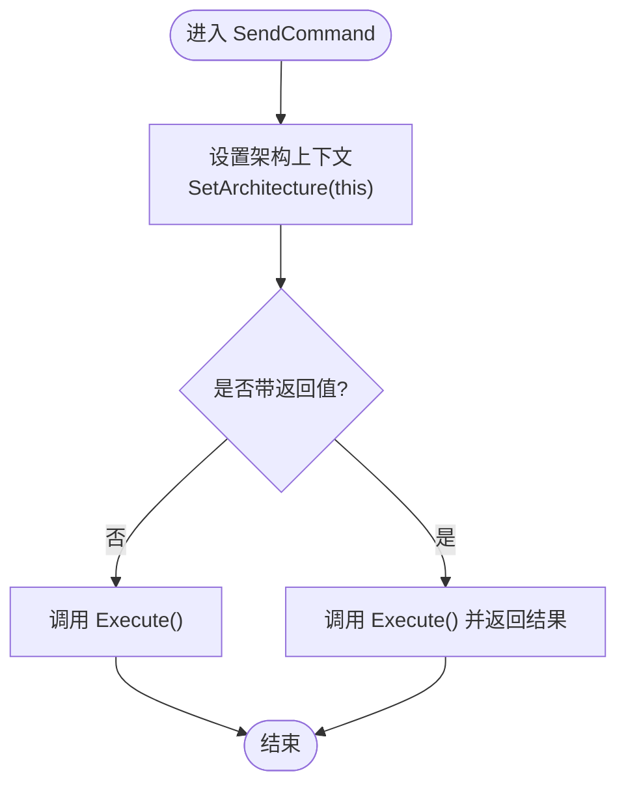
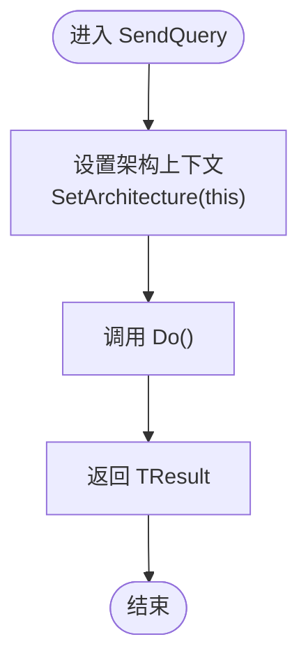
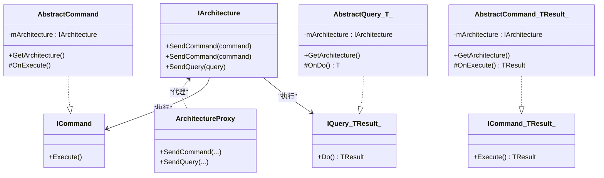
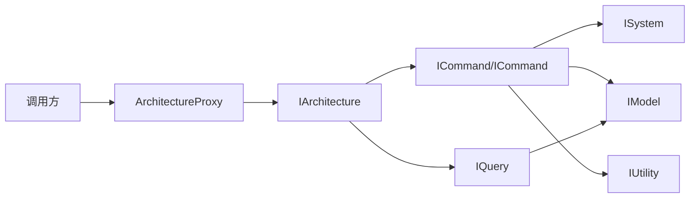

# 命令查询接口

<cite>
**本文引用的文件**   
- [QFramework.cs](file://Assets/Game/Framework/Qframework/Runtime/QFramework.cs)
- [ArchitectureProxy.cs](file://Assets/Game/Framework/Qframework/Runtime/Moyv/Proxies/ArchitectureProxy.cs)
</cite>

## 目录
1. [简介](#简介)
2. [项目结构](#项目结构)
3. [核心组件](#核心组件)
4. [架构总览](#架构总览)
5. [详细组件分析](#详细组件分析)
6. [依赖关系分析](#依赖关系分析)
7. [性能与异步处理](#性能与异步处理)
8. [错误处理与事务回滚最佳实践](#错误处理与事务回滚最佳实践)
9. [结论](#结论)
10. [附录：自定义命令与查询示例](#附录自定义命令与查询示例)

## 简介
本文件为 SimulationClient 项目的命令与查询接口提供完整 API 文档，聚焦以下目标：
- 详细说明 ICommand 与 ICommand<TResult> 接口的实现要求与执行流程
- 文档化 IQuery<TResult> 接口的设计与返回值处理机制
- 解释命令模式在架构中的应用与调用链
- 提供自定义命令与查询的完整示例（以路径引用形式）
- 说明命令的执行顺序与异步处理机制
- 给出错误处理与事务回滚的最佳实践

## 项目结构
本项目基于 QFramework 的命令/查询体系。核心定义位于运行时框架中，并通过 Architecture 统一调度。关键位置如下：
- 命令与查询接口、抽象基类、扩展方法、以及 Architecture 的发送与执行入口均集中在运行时主文件中
- 通过 ArchitectureProxy 对外暴露统一的静态访问方式，便于业务层使用

图表来源
- [QFramework.cs:45-92](file://Assets/Game/Framework/Qframework/Runtime/QFramework.cs#L45-L92)
- [QFramework.cs:514-557](file://Assets/Game/Framework/Qframework/Runtime/QFramework.cs#L514-L557)
- [QFramework.cs:563-588](file://Assets/Game/Framework/Qframework/Runtime/QFramework.cs#L563-L588)
- [ArchitectureProxy.cs:114-132](file://Assets/Game/Framework/Qframework/Runtime/Moyv/Proxies/ArchitectureProxy.cs#L114-L132)

章节来源
- [QFramework.cs:45-92](file://Assets/Game/Framework/Qframework/Runtime/QFramework.cs#L45-L92)
- [ArchitectureProxy.cs:1-197](file://Assets/Game/Framework/Qframework/Runtime/Moyv/Proxies/ArchitectureProxy.cs#L1-L197)

## 核心组件
本节聚焦命令与查询的核心接口与抽象基类，并说明其职责与约束。

- ICommand
  - 职责：表示一个无返回值的操作单元，封装副作用（如修改 Model、调用 System、发送事件等）
  - 关键方法：Execute
  - 能力注入：可通过扩展方法获取 System/Model/Utility、发送事件、发送命令与查询

- ICommand<TResult>
  - 职责：表示一个有返回值的操作单元，适合需要立即返回计算结果或状态快照的场景
  - 关键方法：Execute<TResult>
  - 能力注入：同 ICommand

- IQuery<TResult>
  - 职责：纯查询，不产生副作用，仅读取数据并返回结果
  - 关键方法：Do<TResult>
  - 能力注入：可获取 System/Model，并可发送其他查询

- AbstractCommand / AbstractCommand<TResult>
  - 职责：提供默认生命周期与架构注入，子类只需实现 OnExecute/OnExecute<TResult>
  - 统计：在开启性能分析时自动计数

- AbstractQuery<T>
  - 职责：提供默认 Do 包装与架构注入，子类只需实现 OnDo

- Architecture 的发送与执行
  - SendCommand / SendCommand<TResult>：设置架构上下文后调用 Execute
  - SendQuery：设置架构上下文后调用 Do

章节来源
- [QFramework.cs:514-557](file://Assets/Game/Framework/Qframework/Runtime/QFramework.cs#L514-L557)
- [QFramework.cs:563-588](file://Assets/Game/Framework/Qframework/Runtime/QFramework.cs#L563-L588)
- [QFramework.cs:308-332](file://Assets/Game/Framework/Qframework/Runtime/QFramework.cs#L308-L332)

## 架构总览
下图展示了从业务层到命令/查询执行的完整链路，包括 Architecture 的注入与执行过程。

图表来源
- [ArchitectureProxy.cs:114-132](file://Assets/Game/Framework/Qframework/Runtime/Moyv/Proxies/ArchitectureProxy.cs#L114-L132)
- [QFramework.cs:308-332](file://Assets/Game/Framework/Qframework/Runtime/QFramework.cs#L308-L332)

## 详细组件分析

### 命令接口与执行流程
- 接口契约
  - ICommand.Execute：无返回值，用于执行副作用
  - ICommand<TResult>.Execute<TResult>：返回业务结果
- 执行流程
  - 调用方通过 Architecture 或扩展方法发送命令
  - Architecture 将自身注入到命令（SetArchitecture）
  - 调用命令的 Execute 方法
  - 若为带返回值的命令，返回结果给调用方
- 典型用法
  - 在命令内部通过扩展方法获取 System/Model/Utility，执行业务逻辑
  - 可在命令内发送事件或触发其他命令/查询

图表来源
- [QFramework.cs:308-324](file://Assets/Game/Framework/Qframework/Runtime/QFramework.cs#L308-L324)
- [QFramework.cs:514-557](file://Assets/Game/Framework/Qframework/Runtime/QFramework.cs#L514-L557)

章节来源
- [QFramework.cs:308-324](file://Assets/Game/Framework/Qframework/Runtime/QFramework.cs#L308-L324)
- [QFramework.cs:514-557](file://Assets/Game/Framework/Qframework/Runtime/QFramework.cs#L514-L557)

### 查询接口与返回值处理
- 接口契约
  - IQuery<TResult>.Do<TResult>：只读查询，返回结果
- 执行流程
  - 调用方通过 Architecture 或扩展方法发送查询
  - Architecture 将自身注入到查询（SetArchitecture）
  - 调用查询的 Do 方法并返回结果
- 设计要点
  - 查询不应产生副作用，避免影响全局状态
  - 适合读取 Model 状态、聚合计算、校验等

图表来源
- [QFramework.cs:326-332](file://Assets/Game/Framework/Qframework/Runtime/QFramework.cs#L326-L332)
- [QFramework.cs:563-588](file://Assets/Game/Framework/Qframework/Runtime/QFramework.cs#L563-L588)

章节来源
- [QFramework.cs:326-332](file://Assets/Game/Framework/Qframework/Runtime/QFramework.cs#L326-L332)
- [QFramework.cs:563-588](file://Assets/Game/Framework/Qframework/Runtime/QFramework.cs#L563-L588)

### 类关系图（代码级）

图表来源
- [QFramework.cs:45-92](file://Assets/Game/Framework/Qframework/Runtime/QFramework.cs#L45-L92)
- [QFramework.cs:514-557](file://Assets/Game/Framework/Qframework/Runtime/QFramework.cs#L514-L557)
- [QFramework.cs:563-588](file://Assets/Game/Framework/Qframework/Runtime/QFramework.cs#L563-L588)
- [ArchitectureProxy.cs:114-132](file://Assets/Game/Framework/Qframework/Runtime/Moyv/Proxies/ArchitectureProxy.cs#L114-L132)

## 依赖关系分析
- 耦合与内聚
  - 命令/查询通过扩展方法获得对 System/Model/Utility 的访问，降低直接依赖
  - Architecture 作为唯一调度中心，集中管理生命周期与执行
- 外部依赖点
  - 事件系统：命令/查询可通过扩展方法发送事件
  - 容器：System/Model/Utility 由 IOC 容器管理
- 可能的循环依赖
  - 应避免在命令/查询中反向依赖上层调用者；如需回调，建议使用事件或回调参数

图表来源
- [ArchitectureProxy.cs:114-132](file://Assets/Game/Framework/Qframework/Runtime/Moyv/Proxies/ArchitectureProxy.cs#L114-L132)
- [QFramework.cs:308-332](file://Assets/Game/Framework/Qframework/Runtime/QFramework.cs#L308-L332)

章节来源
- [ArchitectureProxy.cs:1-197](file://Assets/Game/Framework/Qframework/Runtime/Moyv/Proxies/ArchitectureProxy.cs#L1-L197)
- [QFramework.cs:308-332](file://Assets/Game/Framework/Qframework/Runtime/QFramework.cs#L308-L332)

## 性能与异步处理
- 同步执行
  - 当前命令与查询均为同步执行，调用方会阻塞直到完成
- 异步策略建议
  - 对于耗时操作，建议在命令内部使用协程或任务队列，并在完成后通过事件通知 UI 或上层
  - 使用 Architecture 的主线程事件分发机制，确保 UI 相关更新在主线程执行
- 性能统计
  - 在开启性能分析宏时，AbstractCommand/AbstractQuery 会在构造时进行计数，便于定位热点

章节来源
- [QFramework.cs:531-536](file://Assets/Game/Framework/Qframework/Runtime/QFramework.cs#L531-L536)
- [QFramework.cs:573-578](file://Assets/Game/Framework/Qframework/Runtime/QFramework.cs#L573-L578)

## 错误处理与事务回滚最佳实践
- 异常处理
  - 命令/查询应捕获并记录异常，必要时向上抛出或转换为错误码
  - 对于带返回值的命令，可使用 Result 对象封装成功/失败及错误信息
- 事务性操作
  - 在命令中维护本地变更集，成功后再持久化；发生异常时回滚变更集
  - 涉及多步写操作时，采用“先备份后修改”的策略，失败则恢复
- 幂等性与重试
  - 对网络或外部依赖的操作，尽量保证幂等；必要时实现重试与退避
- 日志与追踪
  - 利用内置日志能力记录关键步骤，便于问题定位

[本节为通用指导，不直接分析具体文件]

## 结论
- 命令与查询接口提供了清晰的分层与职责分离：命令负责副作用，查询负责只读
- Architecture 作为统一入口，简化了依赖注入与执行流程
- 通过扩展方法，命令/查询可以便捷地访问 System/Model/Utility 并发送事件
- 结合事件系统与主线程调度，可实现良好的异步体验
- 遵循错误处理与事务回滚最佳实践，可提升系统的健壮性与可维护性

[本节为总结，不直接分析具体文件]

## 附录：自定义命令与查询示例
以下为创建自定义命令与查询的步骤与参考路径（以路径引用形式呈现）：

- 自定义无返回值命令
  - 新建类继承 AbstractCommand，实现 OnExecute
  - 在 OnExecute 中通过扩展方法获取 Model/System/Utility，执行业务逻辑
  - 参考路径：[AbstractCommand 定义:527-544](file://Assets/Game/Framework/Qframework/Runtime/QFramework.cs#L527-L544)

- 自定义带返回值命令
  - 新建类继承 AbstractCommand<TResult>，实现 OnExecute<TResult>
  - 在 OnExecute<TResult> 中返回业务结果
  - 参考路径：[AbstractCommand<TResult> 定义:546-557](file://Assets/Game/Framework/Qframework/Runtime/QFramework.cs#L546-L557)

- 自定义查询
  - 新建类继承 AbstractQuery<TResult>，实现 OnDo<TResult>
  - 在 OnDo<TResult> 中读取 Model/System 状态并返回结果
  - 参考路径：[AbstractQuery<T> 定义:569-588](file://Assets/Game/Framework/Qframework/Runtime/QFramework.cs#L569-L588)

- 发送命令与查询
  - 通过 ArchitectureProxy 或扩展方法发送命令/查询
  - 参考路径：[ArchitectureProxy 发送接口:114-132](file://Assets/Game/Framework/Qframework/Runtime/Moyv/Proxies/ArchitectureProxy.cs#L114-L132)

- 在命令/查询中访问资源
  - 使用扩展方法 GetSystem/GetModel/GetUtility
  - 参考路径：[扩展方法定义:620-697](file://Assets/Game/Framework/Qframework/Runtime/QFramework.cs#L620-L697)

章节来源
- [QFramework.cs:527-557](file://Assets/Game/Framework/Qframework/Runtime/QFramework.cs#L527-L557)
- [QFramework.cs:569-588](file://Assets/Game/Framework/Qframework/Runtime/QFramework.cs#L569-L588)
- [ArchitectureProxy.cs:114-132](file://Assets/Game/Framework/Qframework/Runtime/Moyv/Proxies/ArchitectureProxy.cs#L114-L132)
- [QFramework.cs:620-697](file://Assets/Game/Framework/Qframework/Runtime/QFramework.cs#L620-L697)