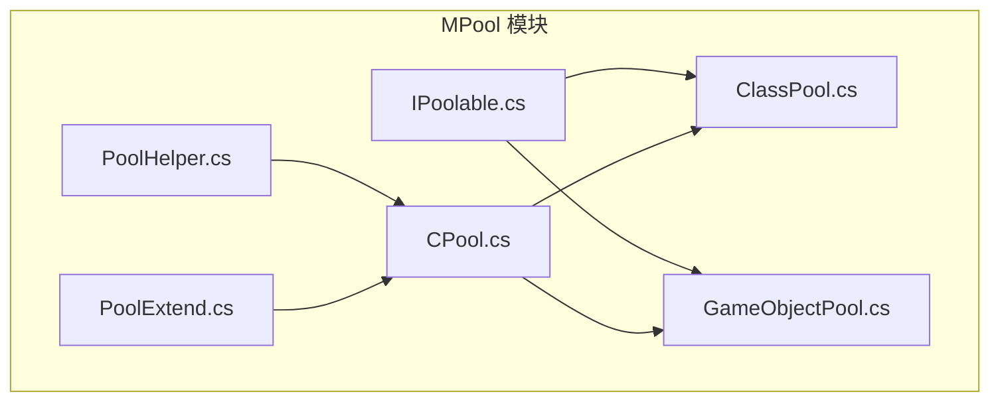
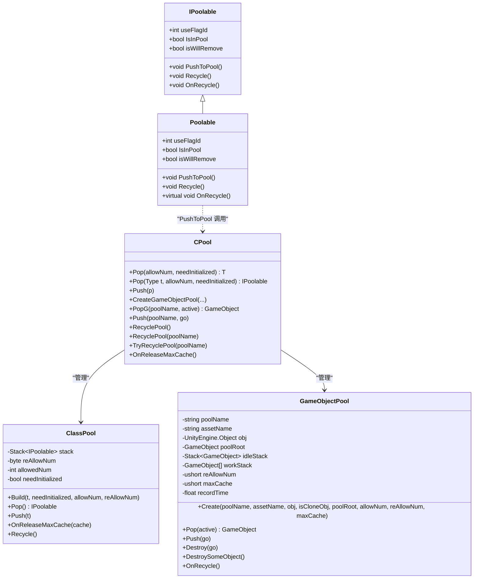
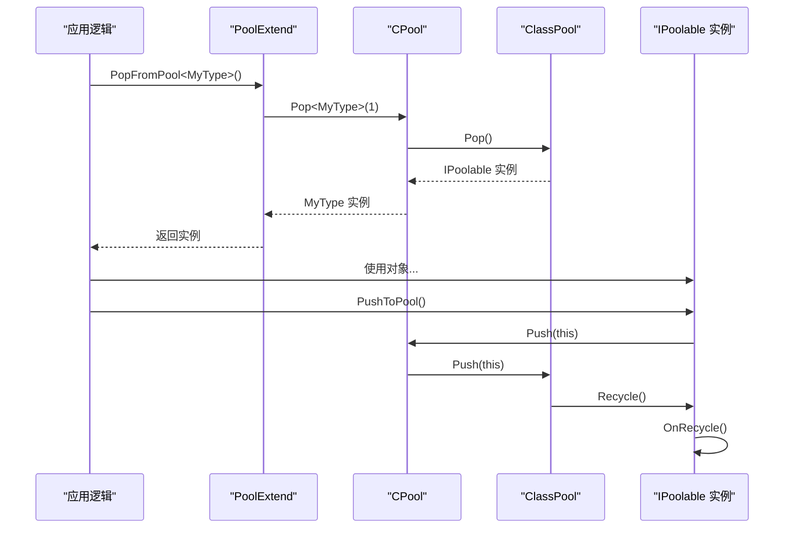

# 对象池接口

<cite>
**本文引用的文件**   
- [IPoolable.cs](file://Assets/Game/Framework/MPool/IPoolable.cs)
- [GameObjectPool.cs](file://Assets/Game/Framework/MPool/GameObjectPool.cs)
- [ClassPool.cs](file://Assets/Game/Framework/MPool/ClassPool.cs)
- [CPool.cs](file://Assets/Game/Framework/MPool/CPool.cs)
- [PoolHelper.cs](file://Assets/Game/Framework/MPool/PoolHelper.cs)
- [PoolExtend.cs](file://Assets/Game/Framework/MPool/PoolExtend.cs)
</cite>

## 目录
1. [简介](#简介)
2. [项目结构](#项目结构)
3. [核心组件](#核心组件)
4. [架构总览](#架构总览)
5. [详细组件分析](#详细组件分析)
6. [依赖关系分析](#依赖关系分析)
7. [性能与配置调优](#性能与配置调优)
8. [最佳实践](#最佳实践)
9. [常见问题排查](#常见问题排查)
10. [结论](#结论)

## 简介
本文件为 SimulationClient 项目的对象池子系统 API 文档，聚焦于以下目标：
- 明确 IPoolable 接口的生命周期方法实现要求（包含 OnSpawn、OnRecycle、OnDestroy 等语义说明）
- 文档化 GameObjectPool、ClassPool、CPool 的使用方式与参数含义
- 提供自定义对象池实现的完整示例路径与步骤
- 解释对象池的配置参数与性能调优选项
- 总结最佳实践与常见问题解决方案
- 说明对象池与 Unity 生命周期的集成方式

注意：当前仓库中未直接定义名为 OnSpawn 和 OnDestroy 的接口方法。若需要这些语义，可在业务层通过扩展或约定进行补充，详见“自定义对象池实现”章节。

## 项目结构
对象池相关代码位于 Framework/MPool 目录下，核心文件如下：
- IPoolable.cs：定义对象池通用接口与抽象基类
- ClassPool.cs：泛型类对象池实现
- GameObjectPool.cs：Unity GameObject 对象池实现
- CPool.cs：统一入口静态管理器，管理两类对象池
- PoolHelper.cs：常用对象池名称与便捷方法
- PoolExtend.cs：扩展方法与便捷 API

图表来源
- [IPoolable.cs:1-71](file://Assets/Game/Framework/MPool/IPoolable.cs#L1-L71)
- [ClassPool.cs:1-127](file://Assets/Game/Framework/MPool/ClassPool.cs#L1-L127)
- [GameObjectPool.cs:1-191](file://Assets/Game/Framework/MPool/GameObjectPool.cs#L1-L191)
- [CPool.cs:1-263](file://Assets/Game/Framework/MPool/CPool.cs#L1-L263)
- [PoolHelper.cs:1-66](file://Assets/Game/Framework/MPool/PoolHelper.cs#L1-L66)
- [PoolExtend.cs:1-25](file://Assets/Game/Framework/MPool/PoolExtend.cs#L1-L25)

章节来源
- [IPoolable.cs:1-71](file://Assets/Game/Framework/MPool/IPoolable.cs#L1-L71)
- [ClassPool.cs:1-127](file://Assets/Game/Framework/MPool/ClassPool.cs#L1-L127)
- [GameObjectPool.cs:1-191](file://Assets/Game/Framework/MPool/GameObjectPool.cs#L1-L191)
- [CPool.cs:1-263](file://Assets/Game/Framework/MPool/CPool.cs#L1-L263)
- [PoolHelper.cs:1-66](file://Assets/Game/Framework/MPool/PoolHelper.cs#L1-L66)
- [PoolExtend.cs:1-25](file://Assets/Game/Framework/MPool/PoolExtend.cs#L1-L25)

## 核心组件
- IPoolable 接口与 Poolable 抽象基类
  - 职责：定义对象进入/离开池时的状态标记与回调钩子；提供默认回收流程与工具方法
  - 关键成员：useFlagId、IsInPool、isWillRemove、PushToPool、Recycle、OnRecycle
- ClassPool 类对象池
  - 职责：按类型维护 IPoolable 实例栈，支持按需扩容、自动初始化控制、最大缓存释放
- GameObjectPool GameObject 对象池
  - 职责：基于 Stack 与 List 管理空闲与工作集合，支持超时回收、最大缓存清理、销毁与入池
- CPool 统一入口
  - 职责：集中管理 ClassPool 与 GameObjectPool 的创建、获取、弹出、回收与全局缓存释放
- PoolHelper 与 PoolExtend
  - 职责：提供常用池名常量、快捷创建与 Pop/Push 扩展方法

章节来源
- [IPoolable.cs:1-71](file://Assets/Game/Framework/MPool/IPoolable.cs#L1-L71)
- [ClassPool.cs:1-127](file://Assets/Game/Framework/MPool/ClassPool.cs#L1-L127)
- [GameObjectPool.cs:1-191](file://Assets/Game/Framework/MPool/GameObjectPool.cs#L1-L191)
- [CPool.cs:1-263](file://Assets/Game/Framework/MPool/CPool.cs#L1-L263)
- [PoolHelper.cs:1-66](file://Assets/Game/Framework/MPool/PoolHelper.cs#L1-L66)
- [PoolExtend.cs:1-25](file://Assets/Game/Framework/MPool/PoolExtend.cs#L1-L25)

## 架构总览
下图展示了对象池的整体结构与交互关系：

图表来源
- [IPoolable.cs:1-71](file://Assets/Game/Framework/MPool/IPoolable.cs#L1-L71)
- [ClassPool.cs:1-127](file://Assets/Game/Framework/MPool/ClassPool.cs#L1-L127)
- [GameObjectPool.cs:1-191](file://Assets/Game/Framework/MPool/GameObjectPool.cs#L1-L191)
- [CPool.cs:1-263](file://Assets/Game/Framework/MPool/CPool.cs#L1-L263)

## 详细组件分析

### IPoolable 接口与 Poolable 基类
- 接口契约
  - useFlagId：每次使用唯一标记，用于检测对象是否被复用或变更
  - IsInPool：是否在池中
  - isWillRemove：是否将被移除
  - PushToPool：将自身推回池中（内部委托给 CPool.Push）
  - Recycle：框架层调用，设置状态并触发 OnRecycle
  - OnRecycle：对象返回池前的重置钩子
- 基类行为
  - 提供 IsNull/IsNullOrChanged 静态判断工具
  - PushToPool 会检查 IsInPool 避免重复入池
  - Recycle 保证仅当不在池中时执行 OnRecycle 并置位 IsInPool
  - OnRecycle 默认空实现，供子类覆盖

章节来源
- [IPoolable.cs:1-71](file://Assets/Game/Framework/MPool/IPoolable.cs#L1-L71)

### ClassPool 类对象池
- 构造与初始化
  - Build：指定类型、是否需要构造函数初始化、初始数量与扩容步长
  - Allow：根据 needInitialized 选择无构造或反射构造实例，并置 IsInPool
- 分配与回收
  - Pop：从栈取对象，若为空则扩容；重置 IsInPool/isWillRemove，更新 useFlagId
  - Push：去重后调用 Recycle 并压栈
  - OnReleaseMaxCache：场景切换后释放多余缓存
  - Recycle：遍历栈内对象，调用 Recycle 以重置状态
- 注意事项
  - needInitialized=false 可提升性能，但需确保使用前字段全部赋值
  - useFlagId 自增防止旧引用误用

章节来源
- [ClassPool.cs:1-127](file://Assets/Game/Framework/MPool/ClassPool.cs#L1-L127)

### GameObjectPool GameObject 对象池
- 构造与初始化
  - Create：注册池名、资源名、克隆参照物、根节点、初始数量、扩容步长、最大缓存
- 分配与回收
  - Pop：空闲栈为空则扩容；出栈后加入工作栈并记录时间
  - Push：从工作栈移除，挂到池根节点，压入空闲栈
  - Destroy：从工作栈移除并销毁对象
  - DestroySomeObject：空闲超过 maxCache 时销毁多余对象
  - OnRecycle：清空空闲与工作栈，销毁所有对象与克隆参照物
- 超时策略
  - outTime：当工作栈为空且超过该时间，视为可回收

章节来源
- [GameObjectPool.cs:1-191](file://Assets/Game/Framework/MPool/GameObjectPool.cs#L1-L191)

### CPool 统一入口
- 类对象池
  - Pop<T>/Pop(Type)：按类型懒加载 ClassPool，必要时扩容
  - Push：查找对应 ClassPool 并 Push，不存在则直接 Recycle
  - RecyclePool<T>/RecyclePool(IPoolable)：回收指定类型的池
- GameObject 对象池
  - CreateGameObjectPool：创建并注册池
  - PopG/Push：从指定池名获取或归还对象
  - RecyclePool/TryRecyclePool/RecyclePoolByAsset：多种回收策略
  - OnReleaseMaxCache：全局释放策略，优先回收无引用类型池，裁剪游戏对象池缓存
- 根节点
  - poolRoot：统一管理 GameObject 对象的父节点

章节来源
- [CPool.cs:1-263](file://Assets/Game/Framework/MPool/CPool.cs#L1-L263)

### PoolHelper 与 PoolExtend
- PoolHelper
  - 提供 Actor 相关根对象池名与便捷获取方法
- PoolExtend
  - AddChild_Pool：设置父节点并激活
  - PopFromPool<T>：便捷从 CPool 弹出对象
  - PushToPool(GameObject, string)：便捷归还对象到指定池

章节来源
- [PoolHelper.cs:1-66](file://Assets/Game/Framework/MPool/PoolHelper.cs#L1-L66)
- [PoolExtend.cs:1-25](file://Assets/Game/Framework/MPool/PoolExtend.cs#L1-L25)

## 依赖关系分析
- 耦合关系
  - Poolable 在 PushToPool 中依赖 CPool.Push
  - CPool 同时管理 ClassPool 与 GameObjectPool
  - GameObjectPool 依赖 Unity 的 Transform 与 GameObject 生命周期
- 外部依赖
  - Unity 引擎 API（Transform.SetParent、GameObject.Instantiate/Destroy、Time.realtimeSinceStartup）
  - System.Reflection（ClassPool 中使用 Activator/FormatterServices）

图表来源
- [PoolExtend.cs:13-21](file://Assets/Game/Framework/MPool/PoolExtend.cs#L13-L21)
- [CPool.cs:55-91](file://Assets/Game/Framework/MPool/CPool.cs#L55-L91)
- [ClassPool.cs:62-96](file://Assets/Game/Framework/MPool/ClassPool.cs#L62-L96)
- [IPoolable.cs:48-69](file://Assets/Game/Framework/MPool/IPoolable.cs#L48-L69)

## 性能与配置调优
- ClassPool
  - needInitialized=false：跳过构造函数，减少分配开销，但必须在使用前完成所有字段赋值
  - allowNum/reAllowNum：合理设置初始与扩容步长，降低频繁扩容带来的 GC 压力
  - OnReleaseMaxCache：在场景切换后裁剪缓存，控制内存峰值
- GameObjectPool
  - allowNum/reAllowNum/maxCache/outTime：平衡即时可用性与内存占用
  - DestroySomeObject：定期清理空闲超量对象，避免长期驻留
  - 超时回收：workStack 为空且超过 outTime 时可考虑整体释放
- 通用建议
  - 避免在 OnRecycle 中进行耗时操作
  - 使用 useFlagId 校验对象有效性，防止异步复用导致的数据竞争
  - 对热点类型预分配较大 allowNum，减少运行时扩容

章节来源
- [ClassPool.cs:29-59](file://Assets/Game/Framework/MPool/ClassPool.cs#L29-L59)
- [ClassPool.cs:104-125](file://Assets/Game/Framework/MPool/ClassPool.cs#L104-L125)
- [GameObjectPool.cs:55-71](file://Assets/Game/Framework/MPool/GameObjectPool.cs#L55-L71)
- [GameObjectPool.cs:133-145](file://Assets/Game/Framework/MPool/GameObjectPool.cs#L133-L145)
- [GameObjectPool.cs:127-130](file://Assets/Game/Framework/MPool/GameObjectPool.cs#L127-L130)
- [CPool.cs:14-42](file://Assets/Game/Framework/MPool/CPool.cs#L14-L42)

## 最佳实践
- 生命周期方法实现要求
  - OnRecycle：必须在此处重置所有可变状态（字段、事件、定时器、动画等），确保对象回到“干净”状态
  - OnSpawn：当前仓库未提供此接口方法。建议在业务层通过扩展或约定，在首次使用或每次 Pop 后执行一次性的初始化逻辑（如绑定事件、设置初始属性）。参考路径：[PoolExtend.cs:13-16](file://Assets/Game/Framework/MPool/PoolExtend.cs#L13-L16)、[ClassPool.cs:80-96](file://Assets/Game/Framework/MPool/ClassPool.cs#L80-L96)
  - OnDestroy：当前仓库未提供此接口方法。对于 GameObject 对象，应遵循 Unity 的 Destroy 机制；对于非 GameObject 对象，可在业务层自行实现销毁逻辑或在 OnRecycle 中释放托管资源
- 使用模式
  - 类对象：优先使用 CPool.Pop<T> 与 PushToPool，结合 useFlagId 做有效性校验
  - GameObject：使用 CPool.CreateGameObjectPool 创建并按池名 PopG/Push
- 安全回收
  - 始终在对象不再使用时立即 Push，避免悬挂引用
  - 使用 TryRecyclePool 在无使用中对象时主动释放池
- 与 Unity 生命周期集成
  - GameObject 对象池由 CPool.poolRoot 统一管理父子关系
  - 在场景切换时调用 CPool.OnReleaseMaxCache 进行全局裁剪
  - 利用 PoolHelper 提供的 Actor 根对象池简化常见场景

章节来源
- [IPoolable.cs:48-69](file://Assets/Game/Framework/MPool/IPoolable.cs#L48-L69)
- [ClassPool.cs:80-96](file://Assets/Game/Framework/MPool/ClassPool.cs#L80-L96)
- [CPool.cs:14-42](file://Assets/Game/Framework/MPool/CPool.cs#L14-L42)
- [PoolHelper.cs:33-43](file://Assets/Game/Framework/MPool/PoolHelper.cs#L33-L43)

## 常见问题排查
- 问题：对象状态污染
  - 现象：复用后出现脏数据
  - 排查：确认 OnRecycle 是否重置了所有字段与事件；检查 needInitialized=false 时是否遗漏赋值
  - 参考：[ClassPool.cs:41-59](file://Assets/Game/Framework/MPool/ClassPool.cs#L41-L59)、[IPoolable.cs:67-69](file://Assets/Game/Framework/MPool/IPoolable.cs#L67-L69)
- 问题：重复入池或丢失引用
  - 现象：Push 无效或对象无法回收
  - 排查：检查 IsInPool 与 PushToPool 调用时机；避免在业务层直接修改 IsInPool
  - 参考：[IPoolable.cs:48-65](file://Assets/Game/Framework/MPool/IPoolable.cs#L48-L65)
- 问题：GameObject 未被正确销毁
  - 现象：内存泄漏或层级混乱
  - 排查：确认 Push 到正确的池名；检查 Destroy 与 OnRecycle 中的销毁逻辑
  - 参考：[GameObjectPool.cs:96-125](file://Assets/Game/Framework/MPool/GameObjectPool.cs#L96-L125)、[GameObjectPool.cs:153-189](file://Assets/Game/Framework/MPool/GameObjectPool.cs#L153-L189)
- 问题：池未创建或找不到
  - 现象：PopG 返回 null 或警告
  - 排查：确认已调用 CreateGameObjectPool；使用 HasGameObjPool 检查存在性
  - 参考：[CPool.cs:164-178](file://Assets/Game/Framework/MPool/CPool.cs#L164-L178)、[CPool.cs:181-193](file://Assets/Game/Framework/MPool/CPool.cs#L181-L193)

章节来源
- [ClassPool.cs:41-59](file://Assets/Game/Framework/MPool/ClassPool.cs#L41-L59)
- [IPoolable.cs:48-69](file://Assets/Game/Framework/MPool/IPoolable.cs#L48-L69)
- [GameObjectPool.cs:96-125](file://Assets/Game/Framework/MPool/GameObjectPool.cs#L96-L125)
- [GameObjectPool.cs:153-189](file://Assets/Game/Framework/MPool/GameObjectPool.cs#L153-L189)
- [CPool.cs:164-193](file://Assets/Game/Framework/MPool/CPool.cs#L164-L193)

## 结论
- IPoolable 定义了对象池的核心契约，重点在于 OnRecycle 的状态重置与 useFlagId 的有效性校验
- ClassPool 与 GameObjectPool 分别面向纯类与 Unity 对象，配合 CPool 统一管理
- 通过合理的配置参数与回收策略，可在性能与内存之间取得良好平衡
- 若需 OnSpawn/OnDestroy 语义，可在业务层通过扩展或约定实现，并与现有生命周期保持一致