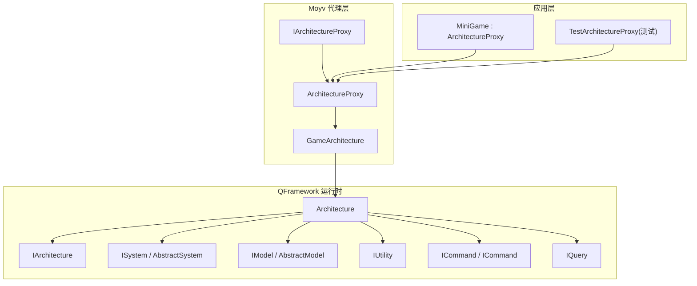
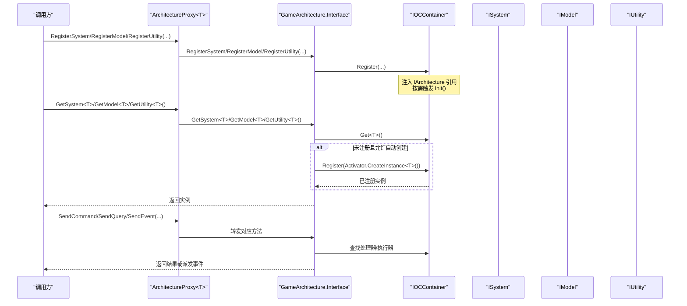
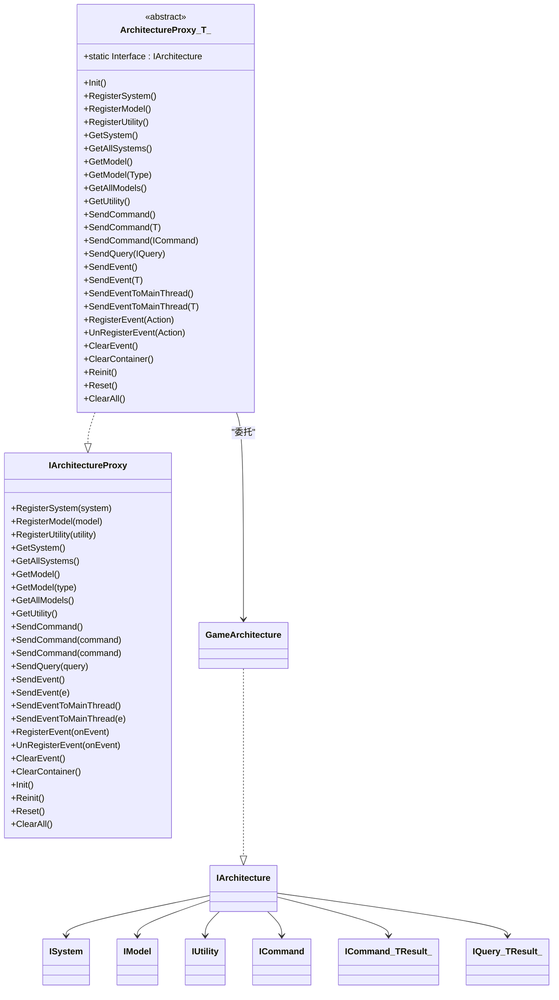
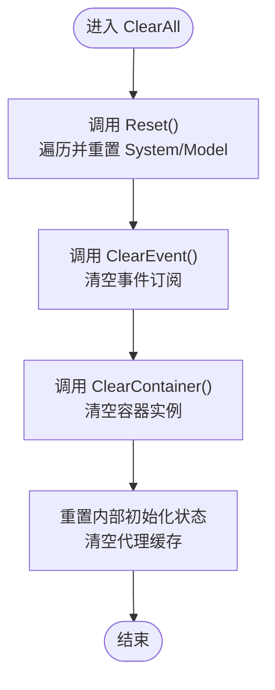
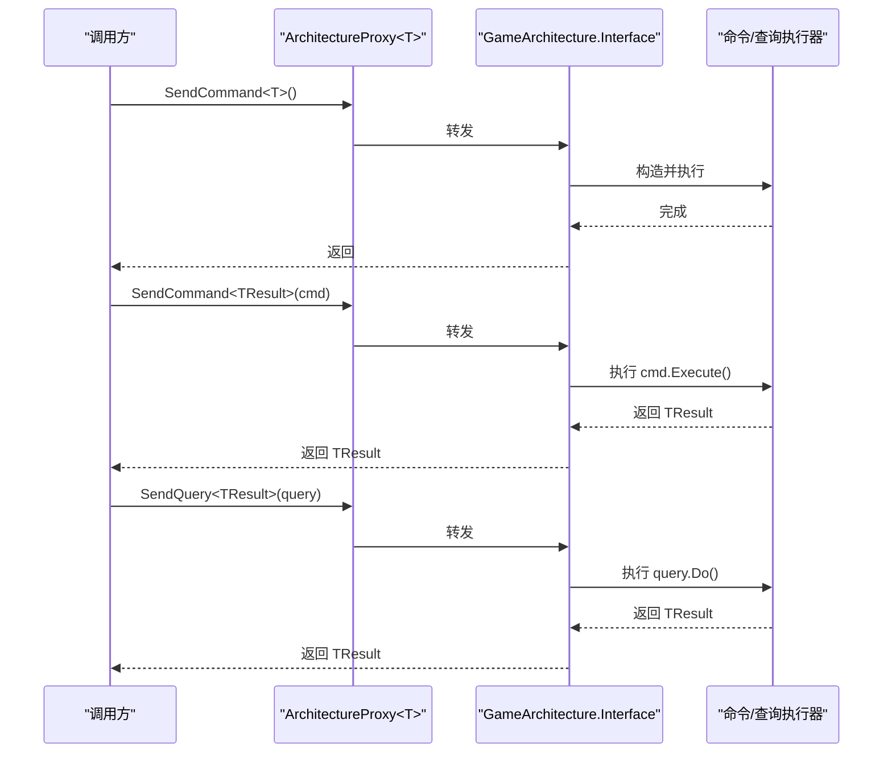
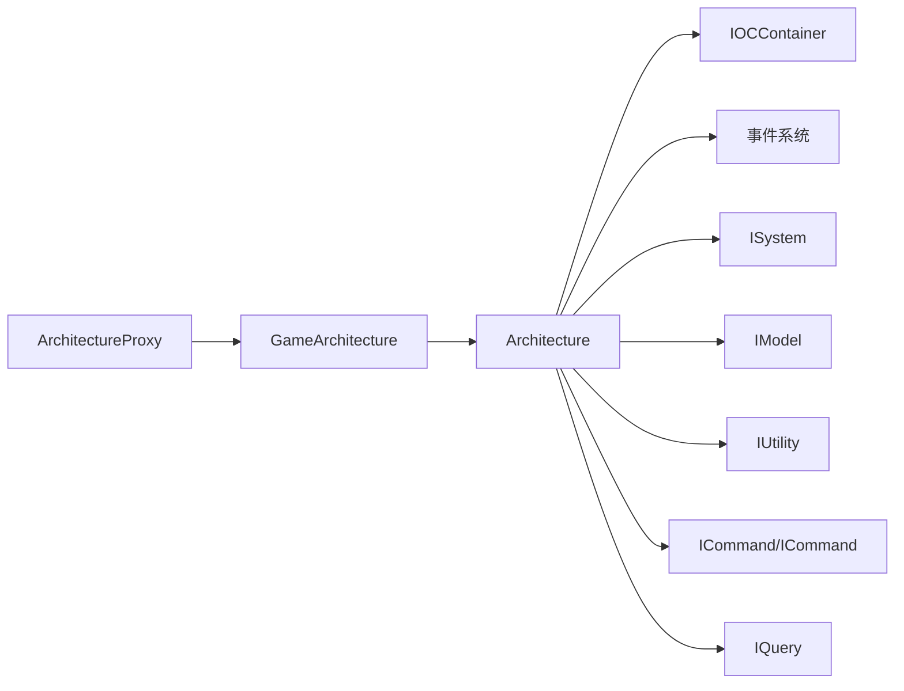

# 架构接口

<cite>
**本文引用的文件**   
- [ArchitectureProxy.cs](file://Assets/Game/Framework/Qframework/Runtime/Moyv/Proxies/ArchitectureProxy.cs)
- [QFramework.cs](file://Assets/Game/Framework/Qframework/Runtime/QFramework.cs)
- [GameArchitecture.cs](file://Assets/Game/Framework/Qframework/Runtime/Moyv/Proxies/GameArchitecture.cs)
- [MiniGame.cs](file://Assets/Game/Scripts/MiniGame_Scripts/MiniGame.cs)
- [TestArchitectureProxy.cs](file://Assets/Game/Framework/Qframework/Tests/Runtime/TestArchitectureProxy.cs)
</cite>

## 目录
1. [简介](#简介)
2. [项目结构](#项目结构)
3. [核心组件](#核心组件)
4. [架构总览](#架构总览)
5. [详细组件分析](#详细组件分析)
6. [依赖关系分析](#依赖关系分析)
7. [性能与内存管理](#性能与内存管理)
8. [故障排查指南](#故障排查指南)
9. [结论](#结论)
10. [附录：使用示例与最佳实践](#附录使用示例与最佳实践)

## 简介
本文件为 SimulationClient 项目的“架构接口”API 文档，聚焦于 IArchitectureProxy 接口及其默认实现 ArchitectureProxy<T> 抽象类。内容涵盖注册与获取 System、Model、Utility 的 API，命令发送 SendCommand、查询发送 SendQuery、事件处理 SendEvent/RegisterEvent 等核心能力；并解释 ArchitectureProxy<T> 的使用方式与继承模式、生命周期管理、清理机制以及错误处理建议。

## 项目结构
与架构接口相关的核心代码位于 QFramework 运行时模块与游戏入口中：
- 接口与代理：IArchitectureProxy、ArchitectureProxy<T>
- 架构基类与容器：IArchitecture、Architecture<T>（包含 IOC 容器、事件分发、重置/清理逻辑）
- 具体架构实例：GameArchitecture
- 业务入口：MiniGame（继承自 ArchitectureProxy<MiniGame>，用于初始化注册）
- 测试用例：TestArchitectureProxy（演示多 Proxy 场景）

图表来源
- [ArchitectureProxy.cs:7-51](file://Assets/Game/Framework/Qframework/Runtime/Moyv/Proxies/ArchitectureProxy.cs#L7-L51)
- [ArchitectureProxy.cs:53-197](file://Assets/Game/Framework/Qframework/Runtime/Moyv/Proxies/ArchitectureProxy.cs#L53-L197)
- [QFramework.cs:45-92](file://Assets/Game/Framework/Qframework/Runtime/QFramework.cs#L45-L92)
- [QFramework.cs:94-187](file://Assets/Game/Framework/Qframework/Runtime/QFramework.cs#L94-L187)
- [QFramework.cs:424-509](file://Assets/Game/Framework/Qframework/Runtime/QFramework.cs#L424-L509)
- [QFramework.cs:513-588](file://Assets/Game/Framework/Qframework/Runtime/QFramework.cs#L513-L588)
- [GameArchitecture.cs:5-10](file://Assets/Game/Framework/Qframework/Runtime/Moyv/Proxies/GameArchitecture.cs#L5-L10)
- [MiniGame.cs:4-29](file://Assets/Game/Scripts/MiniGame_Scripts/MiniGame.cs#L4-L29)

章节来源
- [ArchitectureProxy.cs:7-51](file://Assets/Game/Framework/Qframework/Runtime/Moyv/Proxies/ArchitectureProxy.cs#L7-L51)
- [ArchitectureProxy.cs:53-197](file://Assets/Game/Framework/Qframework/Runtime/Moyv/Proxies/ArchitectureProxy.cs#L53-L197)
- [QFramework.cs:45-92](file://Assets/Game/Framework/Qframework/Runtime/QFramework.cs#L45-L92)
- [QFramework.cs:94-187](file://Assets/Game/Framework/Qframework/Runtime/QFramework.cs#L94-L187)
- [QFramework.cs:424-509](file://Assets/Game/Framework/Qframework/Runtime/QFramework.cs#L424-L509)
- [QFramework.cs:513-588](file://Assets/Game/Framework/Qframework/Runtime/QFramework.cs#L513-L588)
- [GameArchitecture.cs:5-10](file://Assets/Game/Framework/Qframework/Runtime/Moyv/Proxies/GameArchitecture.cs#L5-L10)
- [MiniGame.cs:4-29](file://Assets/Game/Scripts/MiniGame_Scripts/MiniGame.cs#L4-L29)

## 核心组件
- IArchitectureProxy：面向上层使用的统一代理接口，提供注册/获取 System、Model、Utility，命令/查询/事件收发，以及生命周期管理方法。
- ArchitectureProxy<T>：IArchitectureProxy 的通用实现，内部委托至 GameArchitecture.Interface（即 Architecture<GameArchitecture>），并提供静态 Interface 便捷访问。
- IArchitecture 与 Architecture<T>：框架核心，负责 IOC 容器管理、System/Model/Utility 的注册与获取、命令与查询的执行、事件分发、重置与清理。
- GameArchitecture：具体架构单例，继承自 Architecture<GameArchitecture>，作为全局唯一入口。
- MiniGame：业务入口，继承自 ArchitectureProxy<MiniGame>，在 Init 中完成 Utility/Model/System 的注册。

章节来源
- [ArchitectureProxy.cs:7-51](file://Assets/Game/Framework/Qframework/Runtime/Moyv/Proxies/ArchitectureProxy.cs#L7-L51)
- [ArchitectureProxy.cs:53-197](file://Assets/Game/Framework/Qframework/Runtime/Moyv/Proxies/ArchitectureProxy.cs#L53-L197)
- [QFramework.cs:45-92](file://Assets/Game/Framework/Qframework/Runtime/QFramework.cs#L45-L92)
- [QFramework.cs:94-187](file://Assets/Game/Framework/Qframework/Runtime/QFramework.cs#L94-L187)
- [GameArchitecture.cs:5-10](file://Assets/Game/Framework/Qframework/Runtime/Moyv/Proxies/GameArchitecture.cs#L5-L10)
- [MiniGame.cs:4-29](file://Assets/Game/Scripts/MiniGame_Scripts/MiniGame.cs#L4-L29)

## 架构总览
下图展示了从调用方到架构容器的完整调用链，包括注册、获取、命令/查询执行与事件分发。

图表来源
- [ArchitectureProxy.cs:69-162](file://Assets/Game/Framework/Qframework/Runtime/Moyv/Proxies/ArchitectureProxy.cs#L69-L162)
- [QFramework.cs:206-242](file://Assets/Game/Framework/Qframework/Runtime/QFramework.cs#L206-L242)
- [QFramework.cs:180-187](file://Assets/Game/Framework/Qframework/Runtime/QFramework.cs#L180-L187)

## 详细组件分析

### IArchitectureProxy 接口定义与职责
- 注册类
  - RegisterSystem<T>(T system)：注册系统实例，设置架构引用，必要时触发初始化。
  - RegisterModel<T>(T model)：注册模型实例，设置架构引用，必要时触发初始化。
  - RegisterUtility<T>(T utility)：注册工具类实例。
- 获取类
  - GetSystem<T>()：按类型获取系统，支持自动创建与延迟初始化。
  - GetAllSystems()：获取所有已注册系统列表。
  - GetModel<T>() / GetModel(Type type)：按类型获取模型。
  - GetAllModels()：获取所有已注册模型列表。
  - GetUtility<T>()：按类型获取工具类。
- 命令与查询
  - SendCommand<T>() / SendCommand<T>(T command) / SendCommand<TResult>(ICommand<TResult>)：无参构造、传入实例、带返回值三种命令发送方式。
  - SendQuery<TResult>(IQuery<TResult>)：同步查询，返回结果。
- 事件
  - SendEvent<T>() / SendEvent<T>(T e)：发送事件。
  - SendEventToMainThread<T>() / SendEventToMainThread<T>(T e)：在主线程回调中发送事件。
  - RegisterEvent<T>(Action<T>) / UnRegisterEvent<T>(Action<T>)：订阅/取消订阅事件，返回可释放对象。
  - ClearEvent()：清空事件订阅。
- 生命周期与清理
  - Init()：由具体子类实现，完成注册。
  - Reinit()：重置后重启尚未初始化的 System/Model。
  - Reset()：调用各 System/Model 的 Reset。
  - ClearAll()：Reset + ClearEvent + ClearContainer，并重置内部状态。

章节来源
- [ArchitectureProxy.cs:7-51](file://Assets/Game/Framework/Qframework/Runtime/Moyv/Proxies/ArchitectureProxy.cs#L7-L51)
- [ArchitectureProxy.cs:69-197](file://Assets/Game/Framework/Qframework/Runtime/Moyv/Proxies/ArchitectureProxy.cs#L69-L197)

### ArchitectureProxy<T> 抽象类与继承模式
- 设计要点
  - 通过泛型约束 where T : ArchitectureProxy<T>, new() 确保派生类具备无参构造。
  - 提供静态属性 Interface，内部调用 GameArchitecture.Interface.RegisterProxy<T>()，从而懒加载并缓存具体 Proxy 实例。
  - 所有 IArchitectureProxy 方法均转发至 GameArchitecture.Interface，保持与底层架构一致。
- 典型用法
  - 自定义业务 Proxy 继承 ArchitectureProxy<YourProxy>，重写 Init 完成注册。
  - 通过 YourProxy.Interface 获取 IArchitecture 进行后续操作。

图表来源
- [ArchitectureProxy.cs:7-51](file://Assets/Game/Framework/Qframework/Runtime/Moyv/Proxies/ArchitectureProxy.cs#L7-L51)
- [ArchitectureProxy.cs:53-197](file://Assets/Game/Framework/Qframework/Runtime/Moyv/Proxies/ArchitectureProxy.cs#L53-L197)
- [QFramework.cs:45-92](file://Assets/Game/Framework/Qframework/Runtime/QFramework.cs#L45-L92)
- [QFramework.cs:424-509](file://Assets/Game/Framework/Qframework/Runtime/QFramework.cs#L424-L509)
- [QFramework.cs:513-588](file://Assets/Game/Framework/Qframework/Runtime/QFramework.cs#L513-L588)
- [GameArchitecture.cs:5-10](file://Assets/Game/Framework/Qframework/Runtime/Moyv/Proxies/GameArchitecture.cs#L5-L10)

章节来源
- [ArchitectureProxy.cs:53-197](file://Assets/Game/Framework/Qframework/Runtime/Moyv/Proxies/ArchitectureProxy.cs#L53-L197)
- [GameArchitecture.cs:5-10](file://Assets/Game/Framework/Qframework/Runtime/Moyv/Proxies/GameArchitecture.cs#L5-L10)

### 生命周期管理与清理机制
- 初始化流程
  - 首次访问 ArchitectureProxy<T>.Interface 时，会调用 GameArchitecture.Interface.RegisterProxy<T>()，若该 Proxy 未创建则创建并调用其 Init()。
  - 注册 System/Model 时，会设置架构引用，并根据 LazyInit 决定是否立即 Init。
- 重置与重启
  - Reset()：遍历已初始化的 System/Model，调用其 Reset()，并将 InitStatus 置为未初始化。
  - Reinit()：仅对尚未初始化的 System/Model 执行 Init()，适合 Reset 后的二次启动。
- 清理
  - ClearEvent()：清空事件订阅。
  - ClearContainer()：清空容器内注册的实例。
  - ClearAll()：组合 Reset + ClearEvent + ClearContainer，并重置内部初始化状态与代理缓存。

图表来源
- [QFramework.cs:180-187](file://Assets/Game/Framework/Qframework/Runtime/QFramework.cs#L180-L187)
- [QFramework.cs:164-175](file://Assets/Game/Framework/Qframework/Runtime/QFramework.cs#L164-L175)
- [QFramework.cs:148-159](file://Assets/Game/Framework/Qframework/Runtime/QFramework.cs#L148-L159)

章节来源
- [QFramework.cs:148-187](file://Assets/Game/Framework/Qframework/Runtime/QFramework.cs#L148-L187)
- [ArchitectureProxy.cs:174-197](file://Assets/Game/Framework/Qframework/Runtime/Moyv/Proxies/ArchitectureProxy.cs#L174-L197)

### 命令与查询执行流程
- 命令发送
  - 无参构造：SendCommand<T>()，框架内部通过 Activator 创建实例并执行。
  - 传入实例：SendCommand<T>(T command)，直接执行。
  - 带返回值：SendCommand<TResult>(ICommand<TResult>)，执行并返回结果。
- 查询发送
  - SendQuery<TResult>(IQuery<TResult>)：同步执行查询并返回结果。

图表来源
- [ArchitectureProxy.cs:114-132](file://Assets/Game/Framework/Qframework/Runtime/Moyv/Proxies/ArchitectureProxy.cs#L114-L132)
- [QFramework.cs:65-70](file://Assets/Game/Framework/Qframework/Runtime/QFramework.cs#L65-L70)

章节来源
- [ArchitectureProxy.cs:114-132](file://Assets/Game/Framework/Qframework/Runtime/Moyv/Proxies/ArchitectureProxy.cs#L114-L132)
- [QFramework.cs:65-70](file://Assets/Game/Framework/Qframework/Runtime/QFramework.cs#L65-L70)

### 事件处理与主线程调度
- 订阅与取消
  - RegisterEvent<T>(Action<T>)：返回可释放对象，便于统一释放。
  - UnRegisterEvent<T>(Action<T>)：显式取消订阅。
  - ClearEvent()：批量清空所有事件订阅。
- 发送
  - SendEvent<T>() / SendEvent<T>(T e)：普通事件发送。
  - SendEventToMainThread<T>() / SendEventToMainThread<T>(T e)：将事件投递到主线程回调队列，保证 UI 安全。

章节来源
- [ArchitectureProxy.cs:134-167](file://Assets/Game/Framework/Qframework/Runtime/Moyv/Proxies/ArchitectureProxy.cs#L134-L167)
- [QFramework.cs:72-81](file://Assets/Game/Framework/Qframework/Runtime/QFramework.cs#L72-L81)

## 依赖关系分析
- ArchitectureProxy<T> 强依赖 GameArchitecture.Interface，所有方法均为转发。
- GameArchitecture 继承自 Architecture<GameArchitecture>，复用 IOC 容器、事件系统与生命周期管理。
- ISystem/IModel/IUtility/ICommand/IQuery 等接口由 Architecture<T> 统一管理，并通过扩展方法暴露便捷访问。

图表来源
- [ArchitectureProxy.cs:53-197](file://Assets/Game/Framework/Qframework/Runtime/Moyv/Proxies/ArchitectureProxy.cs#L53-L197)
- [QFramework.cs:94-187](file://Assets/Game/Framework/Qframework/Runtime/QFramework.cs#L94-L187)
- [QFramework.cs:424-588](file://Assets/Game/Framework/Qframework/Runtime/QFramework.cs#L424-L588)

章节来源
- [ArchitectureProxy.cs:53-197](file://Assets/Game/Framework/Qframework/Runtime/Moyv/Proxies/ArchitectureProxy.cs#L53-L197)
- [QFramework.cs:94-187](file://Assets/Game/Framework/Qframework/Runtime/QFramework.cs#L94-L187)
- [QFramework.cs:424-588](file://Assets/Game/Framework/Qframework/Runtime/QFramework.cs#L424-L588)

## 性能与内存管理
- 自动创建与延迟初始化
  - GetSystem<T>() 支持 autoCreate 与 LazyInit，避免不必要的实例化与初始化开销。
- 容器与缓存
  - 注册后由 IOC 容器管理实例生命周期；ClearContainer() 可一次性释放容器内对象。
- 事件与主线程
  - 主线程事件需配合 HandleMainThreadEvents() 定期消费，避免堆积。
- 清理策略
  - 场景切换或热重载前优先调用 ClearAll()，确保事件与实例完全释放，防止内存泄漏。

[本节为通用指导，不直接分析具体文件]

## 故障排查指南
- 常见问题
  - 获取 System/Model 为空：确认是否已在某个 Proxy 的 Init 中完成 Register；或使用 GetSystem<T>(autoCreate=true) 自动创建。
  - 事件未触发：检查是否正确 RegisterEvent，并在适当时机调用 ClearEvent 或释放返回的 IUnRegister。
  - 主线程相关异常：确保每帧调用 HandleMainThreadEvents() 以消费主线程事件队列。
  - 重复注册导致状态异常：在 Reset/Reinit 前后明确生命周期边界，必要时先 ClearAll 再重新 Init。
- 定位建议
  - 利用 ArchitectureProxy<T>.Interface 获取 IArchitecture，结合日志输出关键节点。
  - 使用测试用例中的多 Proxy 模式验证隔离性。

章节来源
- [TestArchitectureProxy.cs:45-61](file://Assets/Game/Framework/Qframework/Tests/Runtime/TestArchitectureProxy.cs#L45-L61)
- [QFramework.cs:191-194](file://Assets/Game/Framework/Qframework/Runtime/QFramework.cs#L191-L194)

## 结论
IArchitectureProxy 与 ArchitectureProxy<T> 提供了统一的架构访问门面，屏蔽了底层 IOC 容器与事件系统的复杂性。通过清晰的注册/获取、命令/查询/事件 API，以及完善的生命周期管理（Init/Reset/Reinit/ClearAll），开发者可以构建高内聚、低耦合的游戏架构。建议在大型项目中采用多 Proxy 划分领域，配合 ClearAll 与 Reinit 实现安全的场景切换与热更新。

## 附录：使用示例与最佳实践
- 最小可用示例（参考路径）
  - 自定义 Proxy 并注册：参见 [MiniGame.cs:4-29](file://Assets/Game/Scripts/MiniGame_Scripts/MiniGame.cs#L4-L29)
  - 多 Proxy 场景与依赖访问：参见 [TestArchitectureProxy.cs:45-61](file://Assets/Game/Framework/Qframework/Tests/Runtime/TestArchitectureProxy.cs#L45-L61)
- 推荐步骤
  - 在业务 Proxy 的 Init 中集中注册 Utility/Model/System。
  - 使用 ArchitectureProxy<T>.Interface 获取 IArchitecture 进行跨模块通信。
  - 需要跨线程 UI 更新时使用 SendEventToMainThread。
  - 场景切换前调用 ClearAll，必要时 Reinit 恢复必要资源。

章节来源
- [MiniGame.cs:4-29](file://Assets/Game/Scripts/MiniGame_Scripts/MiniGame.cs#L4-L29)
- [TestArchitectureProxy.cs:45-61](file://Assets/Game/Framework/Qframework/Tests/Runtime/TestArchitectureProxy.cs#L45-L61)