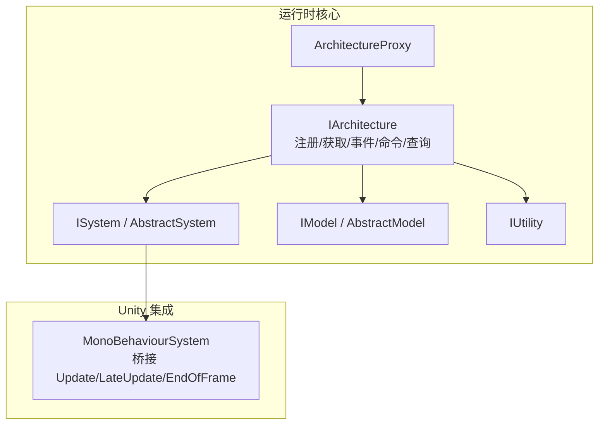
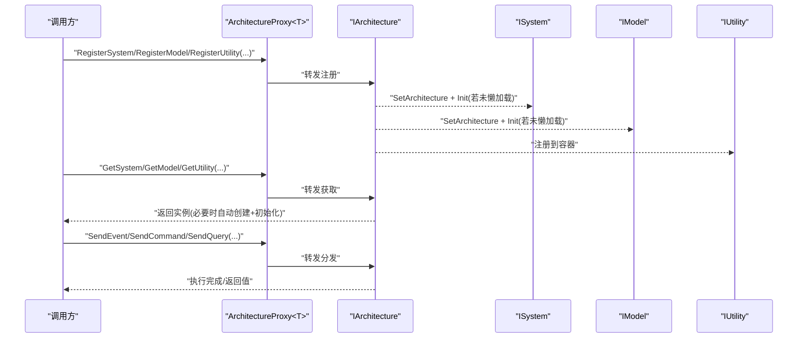
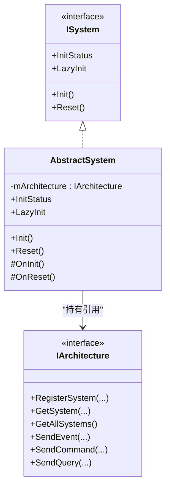
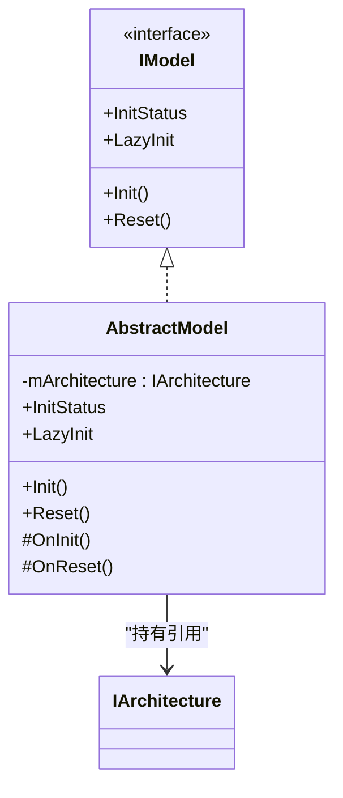
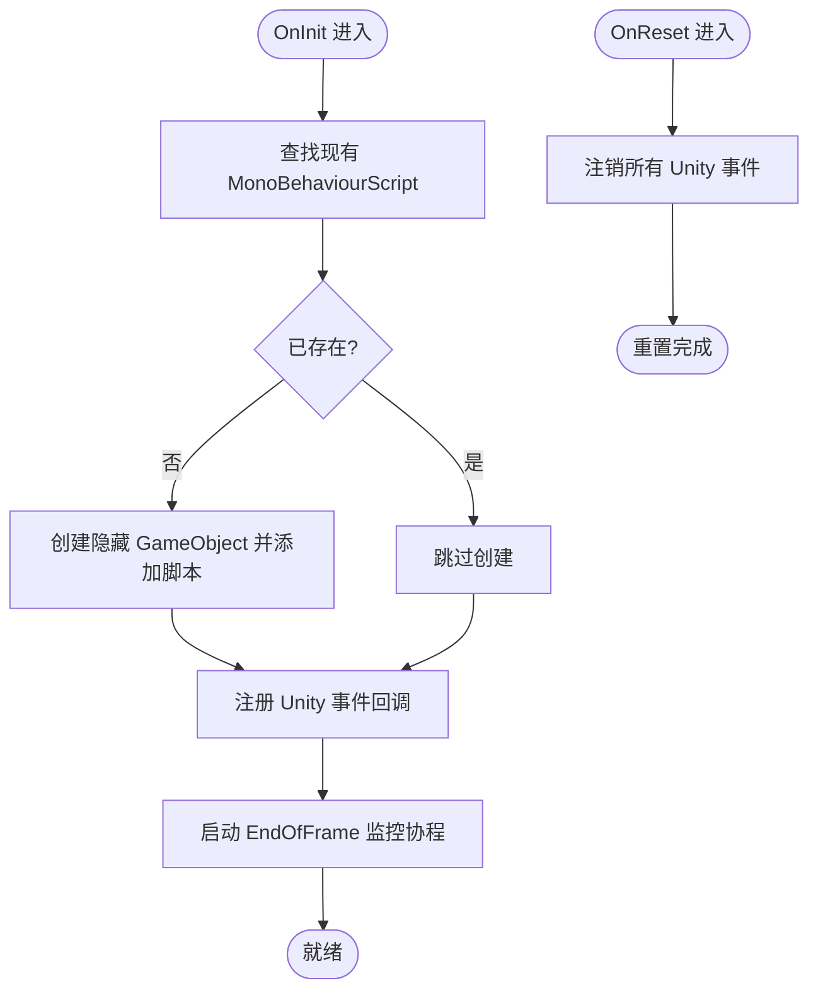
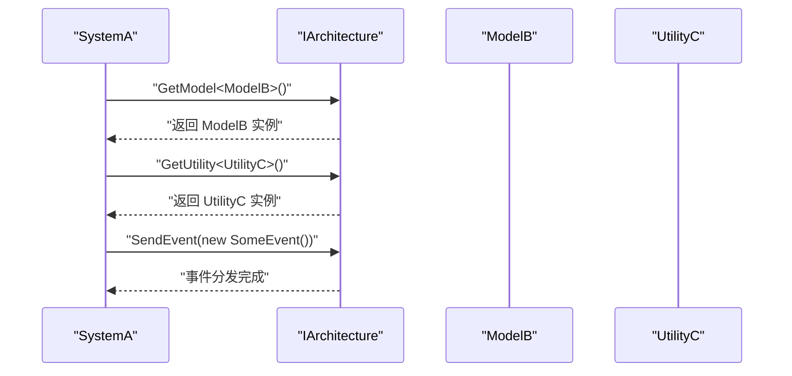
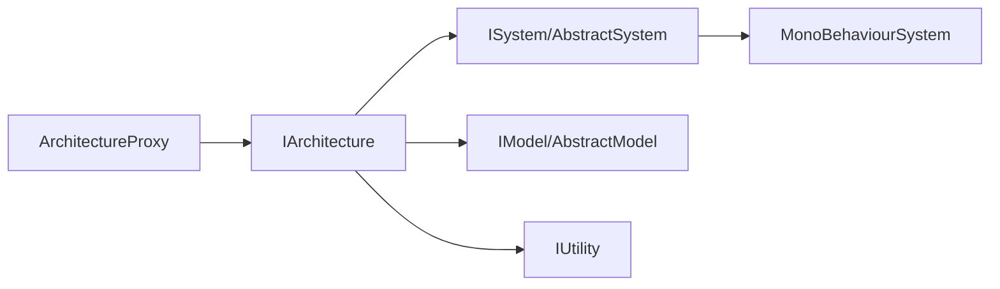

# 系统模型工具接口

<cite>
**本文引用的文件**
- [QFramework.cs](file://Assets/Game/Framework/Qframework/Runtime/QFramework.cs)
- [MonoBehaviourSystem.cs](file://Assets/Game/Framework/Qframework/Runtime/Moyv/Systems/MonoBehaviourSystem.cs)
- [ArchitectureProxy.cs](file://Assets/Game/Framework/Qframework/Runtime/Moyv/Proxies/ArchitectureProxy.cs)
</cite>

## 目录
1. [简介](#简介)
2. [项目结构](#项目结构)
3. [核心组件](#核心组件)
4. [架构总览](#架构总览)
5. [详细组件分析](#详细组件分析)
6. [依赖关系分析](#依赖关系分析)
7. [性能考虑](#性能考虑)
8. [故障排查指南](#故障排查指南)
9. [结论](#结论)
10. [附录](#附录)

## 简介
本文件为 SimulationClient 项目的系统、模型与工具接口提供完整 API 文档，覆盖以下要点：
- ISystem、IModel、IUtility 接口的定义与使用方式
- MonoBehaviourSystem 基类的生命周期方法与扩展点
- AbstractSystem、AbstractModel、AbstractUtility（以 IUtility 为准）抽象类的作用与重写要求
- 自定义 System、Model、Utility 的实现示例指引
- 组件间的依赖注入与通信机制（注册、获取、事件、命令、查询）
- 性能优化建议与最佳实践

## 项目结构
与本文相关的核心代码位于 QFramework 运行时模块中，关键文件如下：
- QFramework.cs：定义 Architecture、ISystem、AbstractSystem、IModel、AbstractModel、IUtility、Command/Query 等核心类型与扩展方法
- MonoBehaviourSystem.cs：提供 Unity 生命周期桥接的 System 基类，封装 Update/LateUpdate/EndOfFrame 等事件
- ArchitectureProxy.cs：对外暴露统一的注册/获取/发送事件/命令/查询的代理入口

图表来源
- [QFramework.cs:45-92](file://Assets/Game/Framework/Qframework/Runtime/QFramework.cs#L45-L92)
- [QFramework.cs:424-459](file://Assets/Game/Framework/Qframework/Runtime/QFramework.cs#L424-L459)
- [QFramework.cs:465-500](file://Assets/Game/Framework/Qframework/Runtime/QFramework.cs#L465-L500)
- [QFramework.cs:506-508](file://Assets/Game/Framework/Qframework/Runtime/QFramework.cs#L506-L508)
- [ArchitectureProxy.cs:53-157](file://Assets/Game/Framework/Qframework/Runtime/Moyv/Proxies/ArchitectureProxy.cs#L53-L157)
- [MonoBehaviourSystem.cs:7-186](file://Assets/Game/Framework/Qframework/Runtime/Moyv/Systems/MonoBehaviourSystem.cs#L7-L186)

章节来源
- [QFramework.cs:45-92](file://Assets/Game/Framework/Qframework/Runtime/QFramework.cs#L45-L92)
- [ArchitectureProxy.cs:53-157](file://Assets/Game/Framework/Qframework/Runtime/Moyv/Proxies/ArchitectureProxy.cs#L53-L157)
- [MonoBehaviourSystem.cs:7-186](file://Assets/Game/Framework/Qframework/Runtime/Moyv/Systems/MonoBehaviourSystem.cs#L7-L186)

## 核心组件
本节聚焦三大核心接口与其抽象实现，说明职责、生命周期与扩展点。

- ISystem 与 AbstractSystem
  - 职责：承载业务逻辑单元，具备初始化、重置、获取其他组件的能力
  - 生命周期：InitStatus 状态机；LazyInit 支持懒加载；OnInit() 必须重写；OnReset() 可选重写
  - 能力：通过扩展方法访问 Model/Utility/System、注册/发送事件、发送命令/查询
  - 参考路径：[ISystem/AbstractSystem:424-459](file://Assets/Game/Framework/Qframework/Runtime/QFramework.cs#L424-L459)

- IModel 与 AbstractModel
  - 职责：管理游戏数据与状态，可被多个 System 共享读取/写入
  - 生命周期：同 System，包含 Init/Reset 与 LazyInit
  - 能力：通过扩展方法访问 Utility、发送事件
  - 参考路径：[IModel/AbstractModel:465-500](file://Assets/Game/Framework/Qframework/Runtime/QFramework.cs#L465-L500)

- IUtility
  - 职责：无状态的通用工具服务（如网络、音频、配置等），通过容器注册并全局获取
  - 生命周期：无内置生命周期，按需创建或单例持有
  - 参考路径：[IUtility:506-508](file://Assets/Game/Framework/Qframework/Runtime/QFramework.cs#L506-L508)

- MonoBehaviourSystem
  - 职责：将 Unity 主循环事件（Update/LateUpdate/EndOfFrame）以及应用生命周期事件转换为统一事件流，供 System 订阅
  - 生命周期：内部维护一个隐藏 GameObject 及其脚本，自动注册/注销 Unity 事件，提供 Coroutine 辅助
  - 扩展点：继承后在 OnInit 中订阅所需事件，在 OnReset 中清理资源
  - 参考路径：[MonoBehaviourSystem:7-186](file://Assets/Game/Framework/Qframework/Runtime/Moyv/Systems/MonoBehaviourSystem.cs#L7-L186)

章节来源
- [QFramework.cs:424-459](file://Assets/Game/Framework/Qframework/Runtime/QFramework.cs#L424-L459)
- [QFramework.cs:465-500](file://Assets/Game/Framework/Qframework/Runtime/QFramework.cs#L465-L500)
- [QFramework.cs:506-508](file://Assets/Game/Framework/Qframework/Runtime/QFramework.cs#L506-L508)
- [MonoBehaviourSystem.cs:7-186](file://Assets/Game/Framework/Qframework/Runtime/Moyv/Systems/MonoBehaviourSystem.cs#L7-L186)

## 架构总览
下图展示了 Architecture 作为中心枢纽，如何统一管理 System/Model/Utility 的注册、获取与生命周期，并通过事件/命令/查询进行通信。

图表来源
- [ArchitectureProxy.cs:53-157](file://Assets/Game/Framework/Qframework/Runtime/Moyv/Proxies/ArchitectureProxy.cs#L53-L157)
- [QFramework.cs:45-92](file://Assets/Game/Framework/Qframework/Runtime/QFramework.cs#L45-L92)
- [QFramework.cs:206-242](file://Assets/Game/Framework/Qframework/Runtime/QFramework.cs#L206-L242)
- [QFramework.cs:273-306](file://Assets/Game/Framework/Qframework/Runtime/QFramework.cs#L273-L306)
- [QFramework.cs:308-348](file://Assets/Game/Framework/Qframework/Runtime/QFramework.cs#L308-L348)

## 详细组件分析

### ISystem 与 AbstractSystem
- 设计要点
  - 通过 IBelongToArchitecture 获得日志与架构访问能力
  - 通过 ICanGetModel/ICanGetUtility/ICanGetSystem 扩展方法便捷访问其他组件
  - 通过 ICanRegisterEvent/ICanSendEvent 扩展方法进行事件通信
  - 通过 ICanSendCommand/ICanSendQuery 发起命令与查询
  - 通过 ICanInit 控制初始化与重置流程，支持 LazyInit
- 生命周期
  - InitStatus: NotDo -> Doing -> Did
  - Reset(): 调用 OnReset() 并将状态置回 NotDo
- 典型用法
  - 在 OnInit() 中订阅事件、初始化资源
  - 在 OnReset() 中释放资源、取消订阅
- 参考路径
  - [ISystem/AbstractSystem:424-459](file://Assets/Game/Framework/Qframework/Runtime/QFramework.cs#L424-L459)
  - [扩展方法：获取/事件/命令/查询:608-697](file://Assets/Game/Framework/Qframework/Runtime/QFramework.cs#L608-L697)

图表来源
- [QFramework.cs:424-459](file://Assets/Game/Framework/Qframework/Runtime/QFramework.cs#L424-L459)
- [QFramework.cs:45-92](file://Assets/Game/Framework/Qframework/Runtime/QFramework.cs#L45-L92)

章节来源
- [QFramework.cs:424-459](file://Assets/Game/Framework/Qframework/Runtime/QFramework.cs#L424-L459)
- [QFramework.cs:608-697](file://Assets/Game/Framework/Qframework/Runtime/QFramework.cs#L608-L697)

### IModel 与 AbstractModel
- 设计要点
  - 与 System 类似的生命周期与扩展能力，但更侧重数据管理与状态同步
  - 可通过 GetUtility 访问工具服务，通过 SendEvent 通知变更
- 生命周期
  - 与 System 一致，支持 LazyInit 与 Reset
- 典型用法
  - 在 OnInit() 中加载配置、建立数据结构
  - 在 OnReset() 中清空数据、释放缓存
- 参考路径
  - [IModel/AbstractModel:465-500](file://Assets/Game/Framework/Qframework/Runtime/QFramework.cs#L465-L500)

图表来源
- [QFramework.cs:465-500](file://Assets/Game/Framework/Qframework/Runtime/QFramework.cs#L465-L500)
- [QFramework.cs:45-92](file://Assets/Game/Framework/Qframework/Runtime/QFramework.cs#L45-L92)

章节来源
- [QFramework.cs:465-500](file://Assets/Game/Framework/Qframework/Runtime/QFramework.cs#L465-L500)

### IUtility
- 设计要点
  - 无状态工具接口，适合封装平台/第三方库/通用算法等
  - 通过容器注册，任意位置通过 GetUtility<T>() 获取
- 参考路径
  - [IUtility:506-508](file://Assets/Game/Framework/Qframework/Runtime/QFramework.cs#L506-L508)

章节来源
- [QFramework.cs:506-508](file://Assets/Game/Framework/Qframework/Runtime/QFramework.cs#L506-L508)

### MonoBehaviourSystem
- 设计要点
  - 内部维护一个隐藏的 MonoBehaviourScript，负责监听 Unity 主循环与应用生命周期事件
  - 将 Unity 事件转换为统一事件（Update/LateUpdate/Destroy/ApplicationPause/Focus/Quit/EndOfFrame）
  - 提供 StartCoroutine/StopCoroutine 辅助方法
- 生命周期
  - OnInit(): 查找/创建 MonoBehaviourScript，注册 Unity 事件，启动帧末监控协程
  - OnReset(): 注销所有 Unity 事件
- 扩展点
  - 继承后在 OnInit() 中订阅所需事件，在 OnReset() 中清理
- 参考路径
  - [MonoBehaviourSystem:7-186](file://Assets/Game/Framework/Qframework/Runtime/Moyv/Systems/MonoBehaviourSystem.cs#L7-L186)

图表来源
- [MonoBehaviourSystem.cs:79-116](file://Assets/Game/Framework/Qframework/Runtime/Moyv/Systems/MonoBehaviourSystem.cs#L79-L116)
- [MonoBehaviourSystem.cs:118-136](file://Assets/Game/Framework/Qframework/Runtime/Moyv/Systems/MonoBehaviourSystem.cs#L118-L136)
- [MonoBehaviourSystem.cs:178-185](file://Assets/Game/Framework/Qframework/Runtime/Moyv/Systems/MonoBehaviourSystem.cs#L178-L185)

章节来源
- [MonoBehaviourSystem.cs:7-186](file://Assets/Game/Framework/Qframework/Runtime/Moyv/Systems/MonoBehaviourSystem.cs#L7-L186)

### 依赖注入与通信机制
- 依赖注入
  - 通过 Architecture.RegisterSystem/RegisterModel/RegisterUtility 显式注册
  - 通过 GetSystem/GetModel/GetUtility 获取，支持自动创建与懒加载
  - 所有 System/Model 在注册时会被注入 IArchitecture 引用
- 通信机制
  - 事件：SendEvent/SendEventToMainThread/注册事件委托
  - 命令：SendCommand（含带返回值版本）
  - 查询：SendQuery（只读查询）
- 参考路径
  - [注册/获取:206-306](file://Assets/Game/Framework/Qframework/Runtime/QFramework.cs#L206-306)
  - [事件/命令/查询:308-348](file://Assets/Game/Framework/Qframework/Runtime/QFramework.cs#L308-348)
  - [扩展方法:608-697](file://Assets/Game/Framework/Qframework/Runtime/QFramework.cs#L608-697)
  - [ArchitectureProxy 代理入口:53-157](file://Assets/Game/Framework/Qframework/Runtime/Moyv/Proxies/ArchitectureProxy.cs#L53-157)

图表来源
- [QFramework.cs:273-306](file://Assets/Game/Framework/Qframework/Runtime/QFramework.cs#L273-L306)
- [QFramework.cs:308-348](file://Assets/Game/Framework/Qframework/Runtime/QFramework.cs#L308-L348)
- [QFramework.cs:608-697](file://Assets/Game/Framework/Qframework/Runtime/QFramework.cs#L608-L697)

章节来源
- [QFramework.cs:206-348](file://Assets/Game/Framework/Qframework/Runtime/QFramework.cs#L206-L348)
- [QFramework.cs:608-697](file://Assets/Game/Framework/Qframework/Runtime/QFramework.cs#L608-L697)
- [ArchitectureProxy.cs:53-157](file://Assets/Game/Framework/Qframework/Runtime/Moyv/Proxies/ArchitectureProxy.cs#L53-L157)

### 自定义组件实现示例（步骤指引）
以下为创建自定义 System、Model、Utility 的标准步骤（不直接展示代码内容，仅给出路径与要点）：

- 自定义 System
  - 新建类继承 AbstractSystem，实现 OnInit()/OnReset()
  - 在 OnInit() 中订阅事件、初始化资源；在 OnReset() 中释放资源
  - 通过扩展方法访问 Model/Utility/System、发送事件/命令/查询
  - 参考路径：[ISystem/AbstractSystem:424-459](file://Assets/Game/Framework/Qframework/Runtime/QFramework.cs#L424-L459)

- 自定义 Model
  - 新建类继承 AbstractModel，实现 OnInit()/OnReset()
  - 在 OnInit() 中加载数据、建立索引；在 OnReset() 中清空数据
  - 通过扩展方法访问 Utility、发送事件
  - 参考路径：[IModel/AbstractModel:465-500](file://Assets/Game/Framework/Qframework/Runtime/QFramework.cs#L465-L500)

- 自定义 Utility
  - 新建类实现 IUtility，保持无状态或持有线程安全单例
  - 通过 RegisterUtility 注册，GetUtility 获取
  - 参考路径：[IUtility:506-508](file://Assets/Game/Framework/Qframework/Runtime/QFramework.cs#L506-L508)

- 注册与获取
  - 在应用启动阶段通过 ArchitectureProxy.Interface 或 IArchitecture 注册各组件
  - 在需要处通过 GetSystem/GetModel/GetUtility 获取
  - 参考路径：[ArchitectureProxy:53-157](file://Assets/Game/Framework/Qframework/Runtime/Moyv/Proxies/ArchitectureProxy.cs#L53-157)

章节来源
- [QFramework.cs:424-459](file://Assets/Game/Framework/Qframework/Runtime/QFramework.cs#L424-L459)
- [QFramework.cs:465-500](file://Assets/Game/Framework/Qframework/Runtime/QFramework.cs#L465-L500)
- [QFramework.cs:506-508](file://Assets/Game/Framework/Qframework/Runtime/QFramework.cs#L506-L508)
- [ArchitectureProxy.cs:53-157](file://Assets/Game/Framework/Qframework/Runtime/Moyv/Proxies/ArchitectureProxy.cs#L53-L157)

## 依赖关系分析
- 耦合与内聚
  - Architecture 集中管理容器与生命周期，内聚度高
  - System/Model 通过扩展方法间接依赖 Architecture，降低直接耦合
- 外部依赖
  - MonoBehaviourSystem 依赖 Unity 主循环与 GameObject 生命周期
- 潜在循环依赖
  - 避免 System 之间互相强引用，优先通过事件/命令/查询解耦
- 接口契约
  - ISystem/IModel/IUtility 明确职责边界，便于替换实现

图表来源
- [QFramework.cs:45-92](file://Assets/Game/Framework/Qframework/Runtime/QFramework.cs#L45-L92)
- [QFramework.cs:424-459](file://Assets/Game/Framework/Qframework/Runtime/QFramework.cs#L424-L459)
- [QFramework.cs:465-500](file://Assets/Game/Framework/Qframework/Runtime/QFramework.cs#L465-L500)
- [QFramework.cs:506-508](file://Assets/Game/Framework/Qframework/Runtime/QFramework.cs#L506-L508)
- [ArchitectureProxy.cs:53-157](file://Assets/Game/Framework/Qframework/Runtime/Moyv/Proxies/ArchitectureProxy.cs#L53-L157)
- [MonoBehaviourSystem.cs:7-186](file://Assets/Game/Framework/Qframework/Runtime/Moyv/Systems/MonoBehaviourSystem.cs#L7-L186)

章节来源
- [QFramework.cs:45-92](file://Assets/Game/Framework/Qframework/Runtime/QFramework.cs#L45-L92)
- [ArchitectureProxy.cs:53-157](file://Assets/Game/Framework/Qframework/Runtime/Moyv/Proxies/ArchitectureProxy.cs#L53-L157)
- [MonoBehaviourSystem.cs:7-186](file://Assets/Game/Framework/Qframework/Runtime/Moyv/Systems/MonoBehaviourSystem.cs#L7-L186)

## 性能考虑
- 懒加载
  - 对重型 System/Model 设置 LazyInit=true，按需初始化，减少启动开销
  - 参考路径：[LazyInit 行为:439-446](file://Assets/Game/Framework/Qframework/Runtime/QFramework.cs#L439-L446)
- 事件与消息
  - 避免每帧广播大量事件，合并批量更新或使用专用 Tick 系统
  - 使用 SendEventToMainThread 确保 UI 相关操作在主线程执行
  - 参考路径：[事件分发:336-348](file://Assets/Game/Framework/Qframework/Runtime/QFramework.cs#L336-L348)
- 对象分配
  - 复用事件对象或采用值类型事件，减少 GC 压力
  - 谨慎在 Update 中频繁创建临时对象
- 资源管理
  - 在 OnReset() 中及时释放资源、取消订阅，防止内存泄漏
  - 参考路径：[OnReset 钩子:456-458](file://Assets/Game/Framework/Qframework/Runtime/QFramework.cs#L456-L458)
- Unity 集成
  - 使用 MonoBehaviourSystem 提供的 EndOfFrame 事件进行渲染后处理，避免阻塞主循环
  - 参考路径：[EndOfFrame 监控:178-185](file://Assets/Game/Framework/Qframework/Runtime/Moyv/Systems/MonoBehaviourSystem.cs#L178-L185)

## 故障排查指南
- 常见问题
  - 组件未注册导致获取为空：检查是否在启动阶段正确调用 RegisterSystem/RegisterModel/RegisterUtility
  - 事件未触发：确认是否正确注册事件委托，并在合适时机取消订阅
  - Unity 生命周期异常：确保 MonoBehaviourSystem 的 OnDestroy/OnDisable 能正确注销事件
- 定位手段
  - 使用 Architecture.GetAllSystems/GetAllModels 检查容器状态
  - 利用日志扩展方法输出上下文信息
  - 参考路径：
    - [获取全部组件:259-304](file://Assets/Game/Framework/Qframework/Runtime/QFramework.cs#L259-L304)
    - [日志扩展:594-601](file://Assets/Game/Framework/Qframework/Runtime/QFramework.cs#L594-L601)
    - [MonoBehaviourSystem 事件注销:128-136](file://Assets/Game/Framework/Qframework/Runtime/Moyv/Systems/MonoBehaviourSystem.cs#L128-L136)

章节来源
- [QFramework.cs:259-304](file://Assets/Game/Framework/Qframework/Runtime/QFramework.cs#L259-L304)
- [QFramework.cs:594-601](file://Assets/Game/Framework/Qframework/Runtime/QFramework.cs#L594-L601)
- [MonoBehaviourSystem.cs:128-136](file://Assets/Game/Framework/Qframework/Runtime/Moyv/Systems/MonoBehaviourSystem.cs#L128-L136)

## 结论
通过 ISystem/IModel/IUtility 与 Architecture 的统一编排，SimulationClient 实现了高内聚、低耦合的系统架构。结合 MonoBehaviourSystem 的 Unity 生命周期桥接，开发者可以以声明式的方式组织业务逻辑、数据与工具服务，并通过事件/命令/查询进行松耦合通信。遵循懒加载、资源管理与事件批量的最佳实践，可在保证可维护性的同时获得良好的性能表现。

## 附录
- 常用扩展方法速查
  - 获取组件：GetSystem/GetModel/GetUtility
  - 事件：RegisterEvent/UnRegisterEvent/SendEvent/SendEventToMainThread
  - 命令/查询：SendCommand/SendQuery
  - 参考路径：[扩展方法汇总:608-697](file://Assets/Game/Framework/Qframework/Runtime/QFramework.cs#L608-L697)

章节来源
- [QFramework.cs:608-697](file://Assets/Game/Framework/Qframework/Runtime/QFramework.cs#L608-L697)