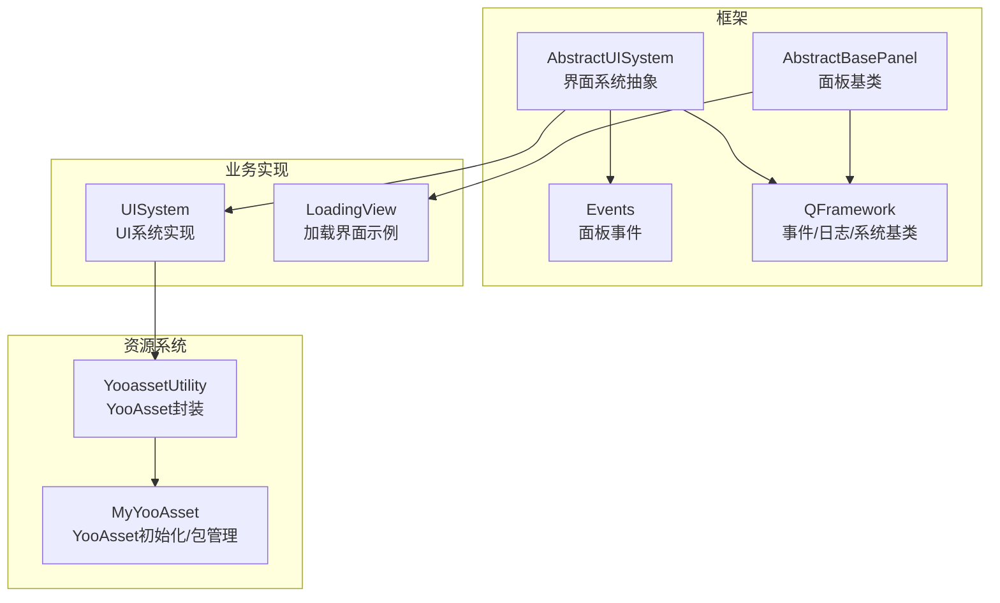
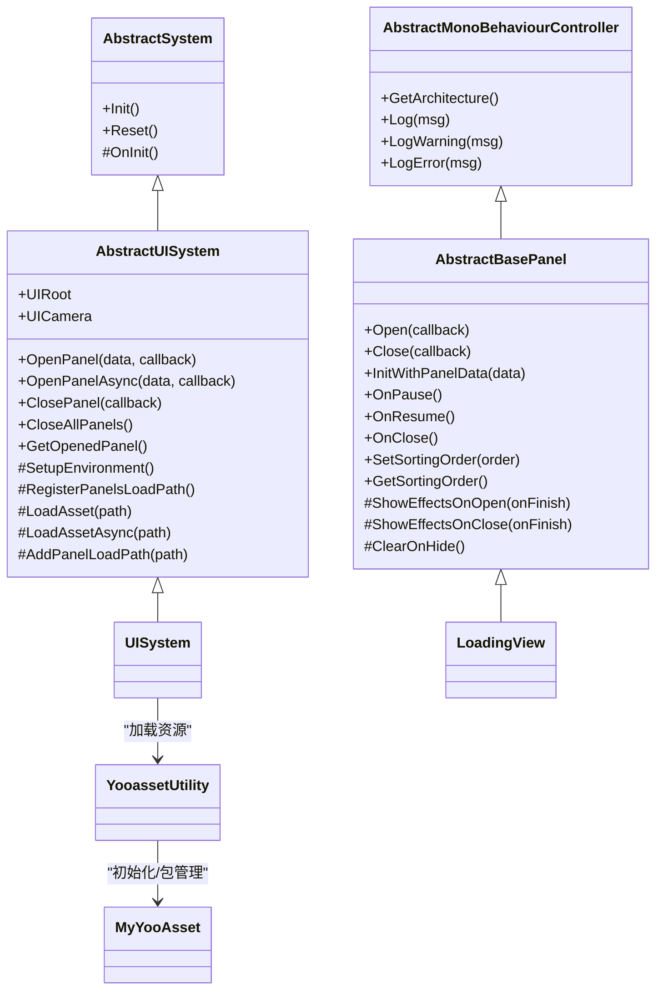
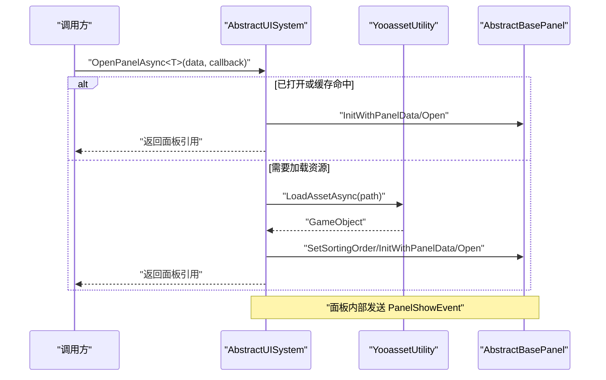
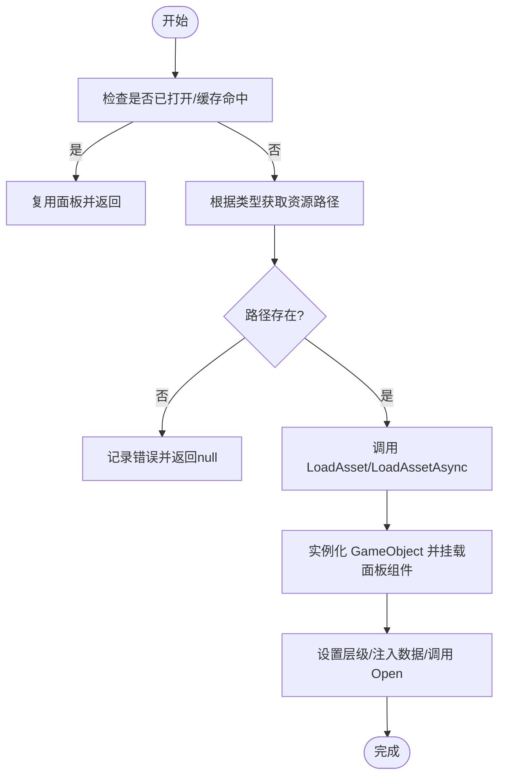
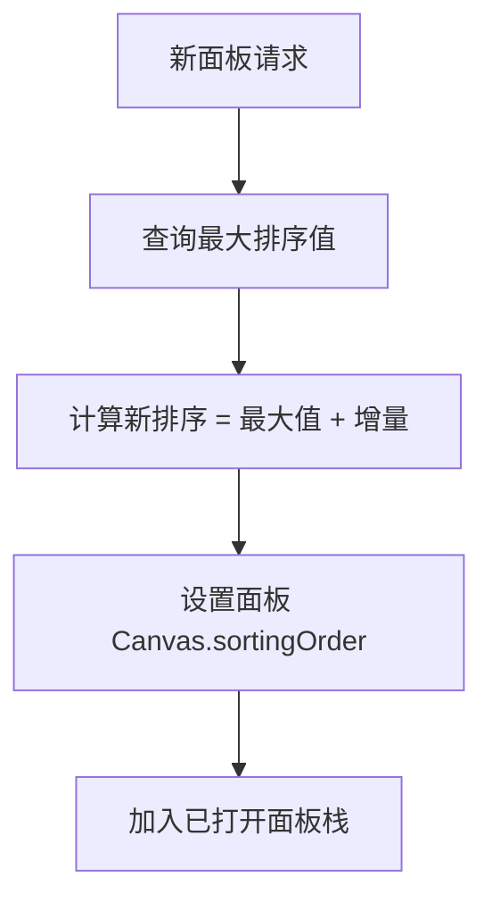
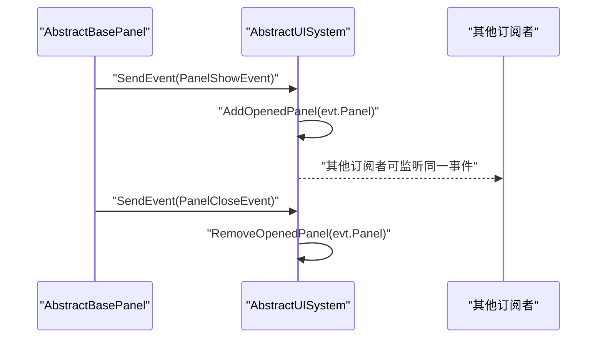
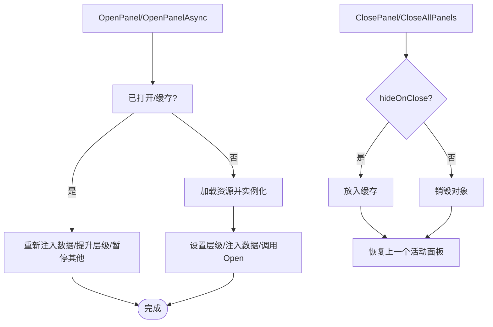
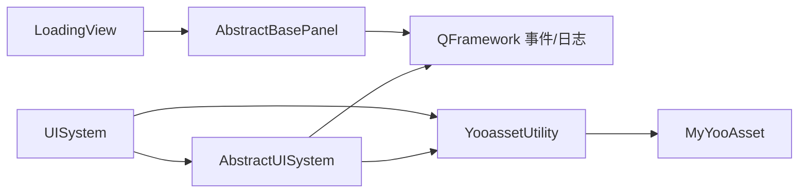

# UI 管理系统

<cite>
**本文引用的文件列表**
- [AbstractUISystem.cs](file://Assets/Game/Framework/Ugui/Runtime/NodePanel/AbstractUISystem.cs)
- [AbstractBasePanel.cs](file://Assets/Game/Framework/Ugui/Runtime/NodePanel/AbstractBasePanel.cs)
- [Events.cs](file://Assets/Game/Framework/Ugui/Runtime/NodePanel/Events.cs)
- [UISystem.cs](file://Assets/Game/Scripts/MiniGame_Scripts/System/UISystem.cs)
- [LoadingView.cs](file://Assets/Game/Scripts/MiniGame_Scripts/Controller/LoadingView.cs)
- [YooassetUtility.cs](file://Assets/Game/Scripts/MiniGame_Scripts/Utility/YooassetUtility.cs)
- [MyYooAsset.cs](file://Assets/Game/Scripts/MiniGame_Scripts/Utility/MyYooAsset.cs)
- [QFramework.cs](file://Assets/Game/Framework/Qframework/Runtime/QFramework.cs)
</cite>

## 目录
1. [简介](#简介)
2. [项目结构](#项目结构)
3. [核心组件](#核心组件)
4. [架构总览](#架构总览)
5. [详细组件分析](#详细组件分析)
6. [依赖关系分析](#依赖关系分析)
7. [性能与资源策略](#性能与资源策略)
8. [故障排查指南](#故障排查指南)
9. [结论](#结论)
10. [附录：扩展点与最佳实践](#附录扩展点与最佳实践)

## 简介
本文件面向 SimulationClient 的 UI 管理系统，系统性阐述 UISystem 的实现架构、界面生命周期管理、资源加载策略与层级控制；解释 AbstractUISystem 与 AbstractBasePanel 的设计模式；文档化界面打开、关闭、切换的处理流程，以及事件绑定和解绑机制；说明与 YooAsset 资源系统的集成方式、异步加载流程和错误处理机制；并提供创建自定义界面组件和处理用户交互逻辑的实践指引。

## 项目结构
UI 管理系统位于 Framework 与业务脚本之间，采用“系统 + 面板”的分层设计：
- 抽象层：AbstractUISystem 负责 UI 根节点、资源加载、面板队列、排序与生命周期协调；AbstractBasePanel 定义面板生命周期钩子与动画效果接口。
- 实现层：UISystem 继承自 AbstractUISystem，注入具体环境（UIRoot、UICamera）与资源加载器（YooassetUtility）。
- 业务层：LoadingView 等具体面板继承 AbstractBasePanel，承载业务逻辑与交互。
- 资源层：YooassetUtility 封装 YooAsset 的初始化、加载与释放能力。

图表来源
- [AbstractUISystem.cs:1-344](file://Assets/Game/Framework/Ugui/Runtime/NodePanel/AbstractUISystem.cs#L1-L344)
- [AbstractBasePanel.cs:1-215](file://Assets/Game/Framework/Ugui/Runtime/NodePanel/AbstractBasePanel.cs#L1-L215)
- [Events.cs:1-24](file://Assets/Game/Framework/Ugui/Runtime/NodePanel/Events.cs#L1-L24)
- [UISystem.cs:1-38](file://Assets/Game/Scripts/MiniGame_Scripts/System/UISystem.cs#L1-L38)
- [LoadingView.cs:1-49](file://Assets/Game/Scripts/MiniGame_Scripts/Controller/LoadingView.cs#L1-L49)
- [YooassetUtility.cs:1-121](file://Assets/Game/Scripts/MiniGame_Scripts/Utility/YooassetUtility.cs#L1-L121)
- [MyYooAsset.cs:1-82](file://Assets/Game/Scripts/MiniGame_Scripts/Utility/MyYooAsset.cs#L1-L82)
- [QFramework.cs:376-459](file://Assets/Game/Framework/Qframework/Runtime/QFramework.cs#L376-L459)

章节来源
- [AbstractUISystem.cs:1-344](file://Assets/Game/Framework/Ugui/Runtime/NodePanel/AbstractUISystem.cs#L1-L344)
- [AbstractBasePanel.cs:1-215](file://Assets/Game/Framework/Ugui/Runtime/NodePanel/AbstractBasePanel.cs#L1-L215)
- [Events.cs:1-24](file://Assets/Game/Framework/Ugui/Runtime/NodePanel/Events.cs#L1-L24)
- [UISystem.cs:1-38](file://Assets/Game/Scripts/MiniGame_Scripts/System/UISystem.cs#L1-L38)
- [LoadingView.cs:1-49](file://Assets/Game/Scripts/MiniGame_Scripts/Controller/LoadingView.cs#L1-L49)
- [YooassetUtility.cs:1-121](file://Assets/Game/Scripts/MiniGame_Scripts/Utility/YooassetUtility.cs#L1-L121)
- [MyYooAsset.cs:1-82](file://Assets/Game/Scripts/MiniGame_Scripts/Utility/MyYooAsset.cs#L1-L82)
- [QFramework.cs:376-459](file://Assets/Game/Framework/Qframework/Runtime/QFramework.cs#L376-L459)

## 核心组件
- AbstractUISystem
  - 职责：维护 UI 根节点与摄像机、注册面板资源路径、同步/异步打开面板、关闭与缓存、层级排序、暂停/恢复其他面板、监听面板显示/关闭事件以维护已打开面板集合。
  - 关键能力：
    - 同步打开：OpenPanel<T>(data, onOpenCallback)
    - 异步打开：OpenPanelAsync<T>(data, onOpenCallback)，内部使用队列串行化资源加载避免并发冲突
    - 关闭：ClosePanel<T>() / ClosePanel(panel) / CloseAllPanels()
    - 层级：SetSortingOrder/GetSortingOrder 配合 SortingOrderAddition 增量
    - 生命周期：OnInit 中 SetupEnvironment 与 RegisterPanelsLoadPath，并注册 PanelShowEvent/PanelCloseEvent
- AbstractBasePanel
  - 职责：提供面板生命周期钩子（InitWithPanelData、OnResume、OnPause、OnClose、ClearOnHide）、打开/关闭流程、可选动效（ShowEffectsOnOpen/ShowEffectsOnClose）、隐藏或销毁策略（hideOnClose）、Canvas 层级设置。
  - 事件：在打开完成时发送 PanelShowEvent，关闭完成时发送 PanelCloseEvent。
- UISystem
  - 职责：实例化 UI 根节点与摄像机、注册面板资源路径、通过 YooassetUtility 进行同步/异步资源加载。
- LoadingView
  - 职责：演示如何继承 AbstractBasePanel，接收 BasePanelData 数据，暴露 SetProgress/Complete 等方法供外部调用。
- YooassetUtility / MyYooAsset
  - 职责：封装 YooAsset 初始化、包创建、版本更新、清单获取、下载、卸载等；对外暴露 LoadAssetSync/LoadAssetAsync 给 UI 系统使用。

章节来源
- [AbstractUISystem.cs:1-344](file://Assets/Game/Framework/Ugui/Runtime/NodePanel/AbstractUISystem.cs#L1-L344)
- [AbstractBasePanel.cs:1-215](file://Assets/Game/Framework/Ugui/Runtime/NodePanel/AbstractBasePanel.cs#L1-L215)
- [UISystem.cs:1-38](file://Assets/Game/Scripts/MiniGame_Scripts/System/UISystem.cs#L1-L38)
- [LoadingView.cs:1-49](file://Assets/Game/Scripts/MiniGame_Scripts/Controller/LoadingView.cs#L1-L49)
- [YooassetUtility.cs:1-121](file://Assets/Game/Scripts/MiniGame_Scripts/Utility/YooassetUtility.cs#L1-L121)
- [MyYooAsset.cs:1-82](file://Assets/Game/Scripts/MiniGame_Scripts/Utility/MyYooAsset.cs#L1-L82)

## 架构总览
UI 系统采用“系统驱动 + 面板控制器”的模式：
- 系统层（AbstractUISystem/UISystem）负责资源加载、面板实例化、层级与生命周期调度。
- 面板层（AbstractBasePanel/LoadingView）专注自身展示与交互，通过事件与系统解耦。
- 资源层（YooassetUtility/MyYooAsset）统一封装 YooAsset，屏蔽平台差异与异步细节。

图表来源
- [AbstractUISystem.cs:1-344](file://Assets/Game/Framework/Ugui/Runtime/NodePanel/AbstractUISystem.cs#L1-L344)
- [AbstractBasePanel.cs:1-215](file://Assets/Game/Framework/Ugui/Runtime/NodePanel/AbstractBasePanel.cs#L1-L215)
- [UISystem.cs:1-38](file://Assets/Game/Scripts/MiniGame_Scripts/System/UISystem.cs#L1-L38)
- [LoadingView.cs:1-49](file://Assets/Game/Scripts/MiniGame_Scripts/Controller/LoadingView.cs#L1-L49)
- [YooassetUtility.cs:1-121](file://Assets/Game/Scripts/MiniGame_Scripts/Utility/YooassetUtility.cs#L1-L121)
- [MyYooAsset.cs:1-82](file://Assets/Game/Scripts/MiniGame_Scripts/Utility/MyYooAsset.cs#L1-L82)
- [QFramework.cs:376-459](file://Assets/Game/Framework/Qframework/Runtime/QFramework.cs#L376-L459)

## 详细组件分析

### 界面生命周期管理
- 打开流程
  - 同步 OpenPanel<T>：优先复用已打开面板或缓存面板；否则根据类型查找资源路径，同步加载并实例化，设置层级，注入数据，调用 Open，最后返回面板引用。
  - 异步 OpenPanelAsync<T>：若当前正在加载则入队等待；否则标记加载中，按顺序执行 EnqueuePanelAsync，完成后出队下一个任务。
- 关闭流程
  - ClosePanel<T>/ClosePanel(panel)：若面板配置为 hideOnClose，则进入缓存字典；调用面板 Close，随后恢复上一个活动面板。
  - CloseAllPanels：从栈顶向下依次关闭，遵循 hideOnClose 策略。
- 暂停/恢复
  - 当新面板激活时，调用 PauseOtherPanels 触发其他面板 OnPause；关闭后 ResumeLastActivePanel 恢复上一个面板并再次暂停其余面板。
- 事件驱动
  - 面板打开完成发送 PanelShowEvent，AbstractUISystem 监听并加入已打开列表；关闭完成发送 PanelCloseEvent，移除列表项。

图表来源
- [AbstractUISystem.cs:115-190](file://Assets/Game/Framework/Ugui/Runtime/NodePanel/AbstractUISystem.cs#L115-L190)
- [AbstractBasePanel.cs:47-68](file://Assets/Game/Framework/Ugui/Runtime/NodePanel/AbstractBasePanel.cs#L47-L68)
- [Events.cs:15-23](file://Assets/Game/Framework/Ugui/Runtime/NodePanel/Events.cs#L15-L23)
- [YooassetUtility.cs:33-87](file://Assets/Game/Scripts/MiniGame_Scripts/Utility/YooassetUtility.cs#L33-L87)

章节来源
- [AbstractUISystem.cs:52-190](file://Assets/Game/Framework/Ugui/Runtime/NodePanel/AbstractUISystem.cs#L52-L190)
- [AbstractBasePanel.cs:47-105](file://Assets/Game/Framework/Ugui/Runtime/NodePanel/AbstractBasePanel.cs#L47-L105)
- [Events.cs:1-24](file://Assets/Game/Framework/Ugui/Runtime/NodePanel/Events.cs#L1-L24)

### 资源加载策略与 YooAsset 集成
- 路径注册
  - 在 UISystem.RegisterPanelsLoadPath 中通过 AddPanelLoadPath<T>("资源路径") 将面板类型与资源路径绑定。
- 同步加载
  - AbstractUISystem.LoadAsset 由 UISystem 实现，委托 YooassetUtility.LoadAssetSync<GameObject>。
- 异步加载
  - AbstractUISystem.LoadAssetAsync 由 UISystem 实现，委托 YooassetUtility.LoadAssetAsync<GameObject>。
- YooAsset 封装
  - YooassetUtility 提供 InitPackage、LoadConfigsAsync、LoadSceneAsync、UnloadUnusedAssets、ForceUnloadAllAssets、TryUnloadUnusedAsset 等能力。
  - MyYooAsset 负责 YooAsset 初始化、包创建、版本更新、清单更新、下载与清理。

图表来源
- [AbstractUISystem.cs:52-112](file://Assets/Game/Framework/Ugui/Runtime/NodePanel/AbstractUISystem.cs#L52-L112)
- [UISystem.cs:23-36](file://Assets/Game/Scripts/MiniGame_Scripts/System/UISystem.cs#L23-L36)
- [YooassetUtility.cs:33-87](file://Assets/Game/Scripts/MiniGame_Scripts/Utility/YooassetUtility.cs#L33-L87)

章节来源
- [UISystem.cs:13-36](file://Assets/Game/Scripts/MiniGame_Scripts/System/UISystem.cs#L13-L36)
- [YooassetUtility.cs:1-121](file://Assets/Game/Scripts/MiniGame_Scripts/Utility/YooassetUtility.cs#L1-L121)
- [MyYooAsset.cs:1-82](file://Assets/Game/Scripts/MiniGame_Scripts/Utility/MyYooAsset.cs#L1-L82)

### 层级控制与面板栈
- 层级计算
  - GetNewPanelSortingOrder 基于已打开面板的最大排序值加上增量（SortingOrderAddition），确保新面板始终在最上层。
- 面板栈
  - _openedPanelsList 维护已打开面板的顺序，用于恢复上一个活动面板与暂停其他面板。
- Canvas 层级
  - AbstractBasePanel.SetSortingOrder 直接设置 Canvas.sortingOrder，需保证面板所在 Canvas 启用 overrideSorting。

图表来源
- [AbstractUISystem.cs:264-273](file://Assets/Game/Framework/Ugui/Runtime/NodePanel/AbstractUISystem.cs#L264-L273)
- [AbstractBasePanel.cs:122-142](file://Assets/Game/Framework/Ugui/Runtime/NodePanel/AbstractBasePanel.cs#L122-L142)

章节来源
- [AbstractUISystem.cs:264-314](file://Assets/Game/Framework/Ugui/Runtime/NodePanel/AbstractUISystem.cs#L264-L314)
- [AbstractBasePanel.cs:122-142](file://Assets/Game/Framework/Ugui/Runtime/NodePanel/AbstractBasePanel.cs#L122-L142)

### 事件绑定与解绑机制
- 面板侧
  - AbstractBasePanel.Open 完成后发送 PanelShowEvent；Close 完成后发送 PanelCloseEvent。
- 系统侧
  - AbstractUISystem.OnInit 中注册 PanelShowEvent/PanelCloseEvent，分别添加/移除已打开面板。
- 外部订阅
  - 任意模块可通过 QFramework 的事件系统订阅这些事件，实现跨模块通知。

图表来源
- [AbstractBasePanel.cs:63-105](file://Assets/Game/Framework/Ugui/Runtime/NodePanel/AbstractBasePanel.cs#L63-L105)
- [AbstractUISystem.cs:316-332](file://Assets/Game/Framework/Ugui/Runtime/NodePanel/AbstractUISystem.cs#L316-L332)
- [Events.cs:1-24](file://Assets/Game/Framework/Ugui/Runtime/NodePanel/Events.cs#L1-L24)
- [QFramework.cs:341-365](file://Assets/Game/Framework/Qframework/Runtime/QFramework.cs#L341-L365)

章节来源
- [AbstractBasePanel.cs:63-105](file://Assets/Game/Framework/Ugui/Runtime/NodePanel/AbstractBasePanel.cs#L63-L105)
- [AbstractUISystem.cs:316-332](file://Assets/Game/Framework/Ugui/Runtime/NodePanel/AbstractUISystem.cs#L316-L332)
- [QFramework.cs:341-365](file://Assets/Game/Framework/Qframework/Runtime/QFramework.cs#L341-L365)

### 打开、关闭、切换处理流程
- 打开
  - 同步/异步入口均会：
    - 检查已打开/缓存命中
    - 解析资源路径并加载
    - 实例化并挂载面板组件
    - 设置层级、注入数据、调用 Open
- 关闭
  - 根据 hideOnClose 决定是否缓存
  - 调用面板 Close，完成后恢复上一个活动面板
- 切换
  - 新面板打开时自动暂停其他面板；关闭后恢复上一个面板并再次暂停其余面板

图表来源
- [AbstractUISystem.cs:52-112](file://Assets/Game/Framework/Ugui/Runtime/NodePanel/AbstractUISystem.cs#L52-L112)
- [AbstractUISystem.cs:199-242](file://Assets/Game/Framework/Ugui/Runtime/NodePanel/AbstractUISystem.cs#L199-L242)
- [AbstractBasePanel.cs:74-105](file://Assets/Game/Framework/Ugui/Runtime/NodePanel/AbstractBasePanel.cs#L74-L105)

章节来源
- [AbstractUISystem.cs:52-242](file://Assets/Game/Framework/Ugui/Runtime/NodePanel/AbstractUISystem.cs#L52-L242)
- [AbstractBasePanel.cs:74-105](file://Assets/Game/Framework/Ugui/Runtime/NodePanel/AbstractBasePanel.cs#L74-L105)

### 实际代码示例与扩展点
- 创建自定义界面组件
  - 新建一个继承 AbstractBasePanel 的类，例如名为 MyPanel。
  - 在 UISystem.RegisterPanelsLoadPath 中调用 AddPanelLoadPath<MyPanel>("MyPanel") 注册资源路径。
  - 在业务代码中通过 UISystem.OpenPanelAsync<MyPanel>(data, callback) 打开界面。
- 处理用户交互逻辑
  - 在 MyPanel 中重写 InitWithPanelData 接收数据，重写 ShowEffectsOnOpen/ShowEffectsOnClose 实现动效。
  - 在面板内通过 QFramework 事件系统订阅全局事件，或在面板方法中回调外部逻辑。
- 参考示例
  - LoadingView 展示了如何接收 BasePanelData、暴露进度更新与完成回调的方法。

章节来源
- [UISystem.cs:23-26](file://Assets/Game/Scripts/MiniGame_Scripts/System/UISystem.cs#L23-L26)
- [LoadingView.cs:27-47](file://Assets/Game/Scripts/MiniGame_Scripts/Controller/LoadingView.cs#L27-L47)
- [AbstractBasePanel.cs:159-211](file://Assets/Game/Framework/Ugui/Runtime/NodePanel/AbstractBasePanel.cs#L159-L211)

## 依赖关系分析
- 组件耦合
  - AbstractUISystem 依赖 QFramework 的事件系统与日志能力；依赖 YooassetUtility 进行资源加载。
  - AbstractBasePanel 依赖 QFramework 的事件发送能力与 Unity 的 Canvas 层级。
  - UISystem 依赖 Unity 的 Resources 加载 UI 根节点，并通过 YooassetUtility 访问 YooAsset。
- 外部依赖
  - YooAsset：通过 YooassetUtility 与 MyYooAsset 初始化包、更新版本与清单、下载资源。
- 潜在循环依赖
  - 当前结构无循环依赖；面板仅通过事件与系统通信，保持低耦合。

图表来源
- [AbstractUISystem.cs:1-344](file://Assets/Game/Framework/Ugui/Runtime/NodePanel/AbstractUISystem.cs#L1-L344)
- [AbstractBasePanel.cs:1-215](file://Assets/Game/Framework/Ugui/Runtime/NodePanel/AbstractBasePanel.cs#L1-L215)
- [UISystem.cs:1-38](file://Assets/Game/Scripts/MiniGame_Scripts/System/UISystem.cs#L1-L38)
- [YooassetUtility.cs:1-121](file://Assets/Game/Scripts/MiniGame_Scripts/Utility/YooassetUtility.cs#L1-L121)
- [MyYooAsset.cs:1-82](file://Assets/Game/Scripts/MiniGame_Scripts/Utility/MyYooAsset.cs#L1-L82)
- [QFramework.cs:341-459](file://Assets/Game/Framework/Qframework/Runtime/QFramework.cs#L341-L459)

章节来源
- [AbstractUISystem.cs:1-344](file://Assets/Game/Framework/Ugui/Runtime/NodePanel/AbstractUISystem.cs#L1-L344)
- [AbstractBasePanel.cs:1-215](file://Assets/Game/Framework/Ugui/Runtime/NodePanel/AbstractBasePanel.cs#L1-L215)
- [UISystem.cs:1-38](file://Assets/Game/Scripts/MiniGame_Scripts/System/UISystem.cs#L1-L38)
- [YooassetUtility.cs:1-121](file://Assets/Game/Scripts/MiniGame_Scripts/Utility/YooassetUtility.cs#L1-L121)
- [MyYooAsset.cs:1-82](file://Assets/Game/Scripts/MiniGame_Scripts/Utility/MyYooAsset.cs#L1-L82)
- [QFramework.cs:341-459](file://Assets/Game/Framework/Qframework/Runtime/QFramework.cs#L341-L459)

## 性能与资源策略
- 异步串行加载
  - OpenPanelAsync 使用队列串行化资源加载，避免并发导致的资源竞争与卡顿。
- 面板缓存
  - 支持 hideOnClose 的面板进入缓存字典，下次打开直接复用，减少实例化开销。
- 层级优化
  - 通过 SortingOrderAddition 增量分配层级，避免频繁重排与覆盖问题。
- 资源释放
  - 提供 UnloadUnusedAssets、ForceUnloadAllAssets、TryUnloadUnusedAsset 等接口，建议在场景切换或空闲时机调用。

[本节为通用指导，不直接分析具体文件]

## 故障排查指南
- 未注册资源路径
  - 现象：打开面板时报错“没有注册 xxx 的资源路径”。
  - 排查：确认在 UISystem.RegisterPanelsLoadPath 中已调用 AddPanelLoadPath<T>("路径")。
- 资源加载失败
  - 现象：报错“未能加载 xxx 的资源”。
  - 排查：检查 YooassetUtility 初始化是否成功、包名/版本号是否正确、资源是否存在于包中。
- 面板未继承正确基类
  - 现象：报错“xxx 没有继承 BasePanel”。
  - 排查：确保面板类继承 AbstractBasePanel。
- 层级异常
  - 现象：面板被遮挡或层级错乱。
  - 排查：确认面板所在 Canvas 启用 overrideSorting，且未被父级 Transform 影响。
- 事件未触发
  - 现象：监听 PanelShowEvent/PanelCloseEvent 无效。
  - 排查：确认订阅者在合适时机注册事件，并在不再需要时解绑。

章节来源
- [AbstractUISystem.cs:88-112](file://Assets/Game/Framework/Ugui/Runtime/NodePanel/AbstractUISystem.cs#L88-L112)
- [AbstractUISystem.cs:156-190](file://Assets/Game/Framework/Ugui/Runtime/NodePanel/AbstractUISystem.cs#L156-L190)
- [AbstractBasePanel.cs:122-142](file://Assets/Game/Framework/Ugui/Runtime/NodePanel/AbstractBasePanel.cs#L122-L142)
- [AbstractBasePanel.cs:63-105](file://Assets/Game/Framework/Ugui/Runtime/NodePanel/AbstractBasePanel.cs#L63-L105)

## 结论
该 UI 管理系统通过抽象系统 + 面板基类的分层设计，实现了清晰的界面生命周期管理、可插拔的资源加载策略与稳定的层级控制。结合 YooAsset 的异步加载与缓存机制，系统在性能与可维护性上达到良好平衡。开发者只需关注面板业务逻辑与交互，即可快速构建复杂的 UI 体系。

[本节为总结，不直接分析具体文件]

## 附录：扩展点与最佳实践
- 扩展点
  - 自定义资源加载：重写 UISystem 的 LoadAsset/LoadAssetAsync，接入不同资源系统。
  - 自定义环境：重写 SetupEnvironment，替换 UI 根节点或摄像机。
  - 自定义路径注册：在 RegisterPanelsLoadPath 中集中管理所有面板资源路径。
- 最佳实践
  - 合理设置 hideOnClose：对频繁打开的面板启用缓存，降低 GC 压力。
  - 使用 OpenPanelAsync：避免阻塞主线程，提升用户体验。
  - 及时释放资源：在场景切换或长时间空闲时调用卸载接口。
  - 事件解绑：在面板销毁前解除事件订阅，防止内存泄漏。

[本节为通用指导，不直接分析具体文件]