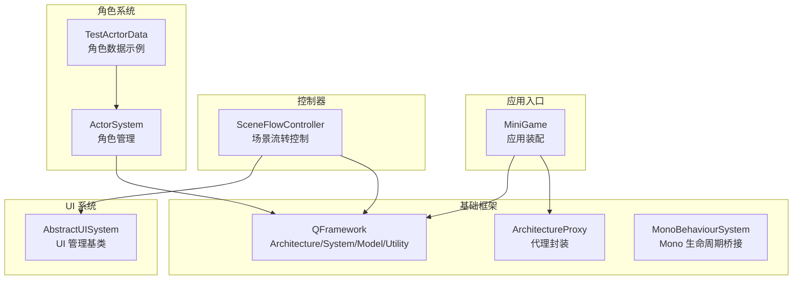
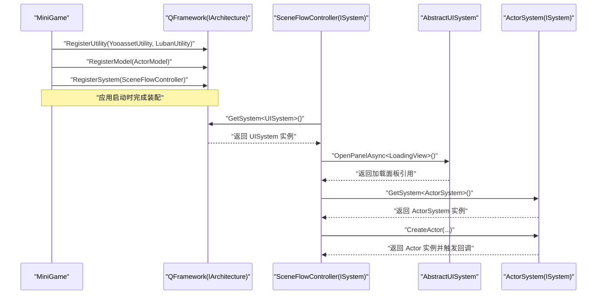
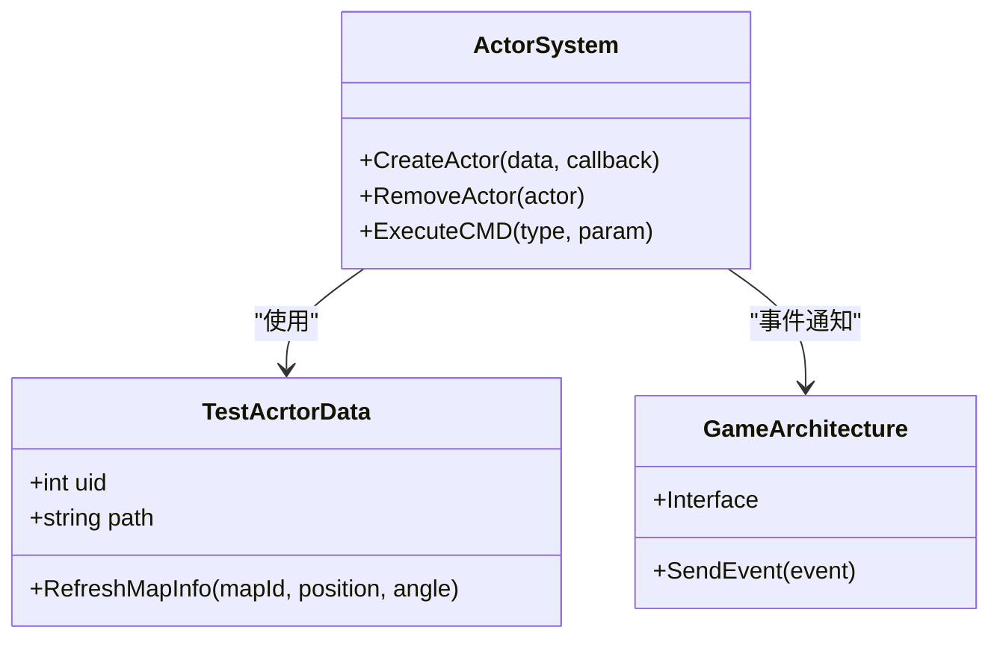
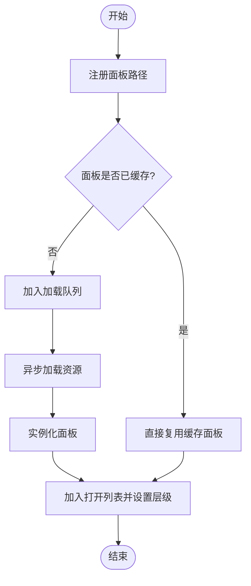
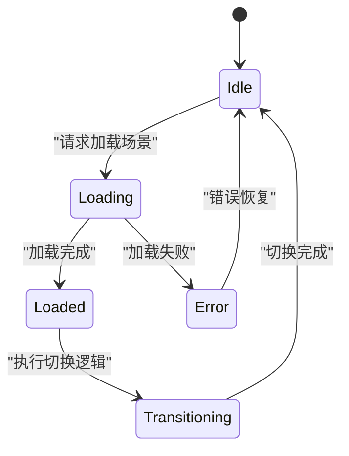
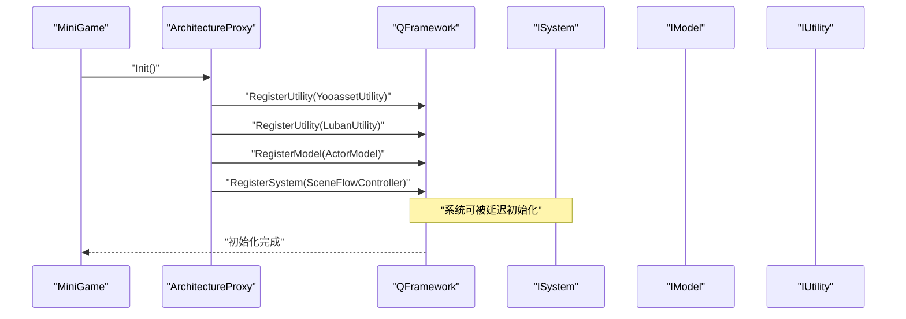
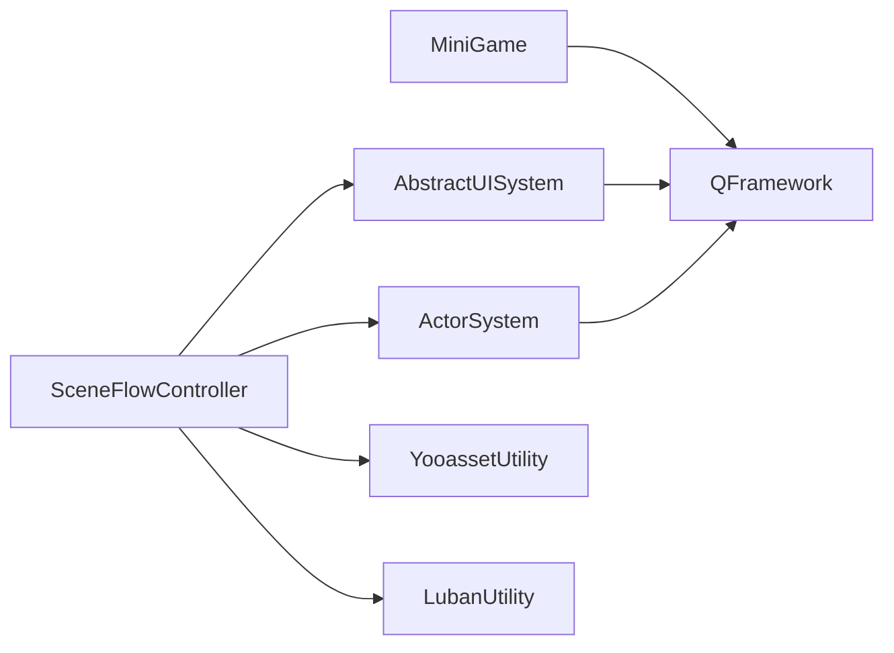

# 业务系统

<cite>
**本文引用的文件**   
- [MiniGame.cs](file://Assets/Game/Scripts/MiniGame_Scripts/MiniGame.cs)
- [SceneFlowController.cs](file://Assets/Game/Scripts/MiniGame_Scripts/Controller/SceneFlowController.cs)
- [AbstractUISystem.cs](file://Assets/Game/Framework/Ugui/Runtime/NodePanel/AbstractUISystem.cs)
- [QFramework.cs](file://Assets/Game/Framework/Qframework/Runtime/QFramework.cs)
- [ArchitectureProxy.cs](file://Assets/Game/Framework/Qframework/Runtime/Moyv/Proxies/ArchitectureProxy.cs)
- [MonoBehaviourSystem.cs](file://Assets/Game/Framework/Qframework/Runtime/Moyv/Systems/MonoBehaviourSystem.cs)
- [TestAcrtorData.cs](file://Assets/Game/Scripts/Game/Runtime/Logic/Actor/GameActor/TestAcrtorData.cs)
</cite>

## 目录
1. [简介](#简介)
2. [项目结构](#项目结构)
3. [核心组件](#核心组件)
4. [架构总览](#架构总览)
5. [详细组件分析](#详细组件分析)
6. [依赖分析](#依赖分析)
7. [性能考虑](#性能考虑)
8. [故障排查指南](#故障排查指南)
9. [结论](#结论)
10. [附录](#附录)

## 简介
本文件面向 SimulationClient 的业务系统，聚焦以下三大子系统：
- 角色管理系统（ActorSystem）：负责角色的创建、生命周期管理、事件与命令分发。
- UI 管理系统（UISystem）：基于抽象基类实现面板的注册、加载、打开、关闭与排序等能力。
- 场景流转控制（SceneFlowController）：使用状态机驱动场景加载、切换与进度反馈，并与 UI 系统协作展示加载界面。

文档将深入说明各系统的职责边界、数据模型、状态管理、调用关系、接口定义、生命周期、资源加载策略、错误处理机制，并提供扩展与自定义实践建议及与其他系统的集成方式与性能优化技巧。

## 项目结构
本项目采用分层与模块化组织方式：
- 业务入口与装配：MiniGame 作为应用级代理，负责初始化工具、模型与系统。
- 控制器层：SceneFlowController 负责场景流程控制。
- UI 框架：AbstractUISystem 提供通用 UI 管理能力。
- 基础框架：QFramework 提供 Architecture、System、Model、Utility 等基础设施。
- 角色系统：ActorSystem 及其数据模型（示例 TestAcrtorData）。

图表来源
- [MiniGame.cs:1-30](file://Assets/Game/Scripts/MiniGame_Scripts/MiniGame.cs#L1-L30)
- [SceneFlowController.cs:1-88](file://Assets/Game/Scripts/MiniGame_Scripts/Controller/SceneFlowController.cs#L1-L88)
- [AbstractUISystem.cs:1-45](file://Assets/Game/Framework/Ugui/Runtime/NodePanel/AbstractUISystem.cs#L1-L45)
- [QFramework.cs:197-469](file://Assets/Game/Framework/Qframework/Runtime/QFramework.cs#L197-L469)
- [ArchitectureProxy.cs:53-107](file://Assets/Game/Framework/Qframework/Runtime/Moyv/Proxies/ArchitectureProxy.cs#L53-L107)
- [MonoBehaviourSystem.cs:1-54](file://Assets/Game/Framework/Qframework/Runtime/Moyv/Systems/MonoBehaviourSystem.cs#L1-L54)
- [TestAcrtorData.cs:1-7](file://Assets/Game/Scripts/Game/Runtime/Logic/Actor/GameActor/TestAcrtorData.cs#L1-L7)

章节来源
- [MiniGame.cs:1-30](file://Assets/Game/Scripts/MiniGame_Scripts/MiniGame.cs#L1-L30)
- [QFramework.cs:197-469](file://Assets/Game/Framework/Qframework/Runtime/QFramework.cs#L197-L469)
- [ArchitectureProxy.cs:53-107](file://Assets/Game/Framework/Qframework/Runtime/Moyv/Proxies/ArchitectureProxy.cs#L53-L107)

## 核心组件
- MiniGame：应用装配器，注册工具、模型与系统，统一启动流程。
- SceneFlowController：基于状态机的场景流转控制器，协调 UI 加载界面与场景切换。
- AbstractUISystem：UI 系统抽象基类，提供面板路径注册、缓存、队列加载、层级排序等能力。
- QFramework：提供 IArchitecture、ISystem、IModel、IUtility 等接口与容器管理。
- ActorSystem：角色管理核心（在业务代码中通过 GetSystem 获取），负责角色实例化、事件与命令分发。
- MonoBehaviourSystem：为 Mono 行为提供统一的 Update/LateUpdate/OnDestroy 等事件桥接。

章节来源
- [MiniGame.cs:1-30](file://Assets/Game/Scripts/MiniGame_Scripts/MiniGame.cs#L1-L30)
- [SceneFlowController.cs:1-88](file://Assets/Game/Scripts/MiniGame_Scripts/Controller/SceneFlowController.cs#L1-L88)
- [AbstractUISystem.cs:1-45](file://Assets/Game/Framework/Ugui/Runtime/NodePanel/AbstractUISystem.cs#L1-L45)
- [QFramework.cs:197-469](file://Assets/Game/Framework/Qframework/Runtime/QFramework.cs#L197-L469)
- [MonoBehaviourSystem.cs:1-54](file://Assets/Game/Framework/Qframework/Runtime/Moyv/Systems/MonoBehaviourSystem.cs#L1-L54)

## 架构总览
整体采用“应用装配 + 系统/模型/工具”的分层架构：
- 应用装配层：MiniGame 通过 ArchitectureProxy 向 QFramework 注册工具、模型与系统。
- 系统层：SceneFlowController、ActorSystem、UISystem 等系统通过 ISystem 接入容器，按需懒加载或立即初始化。
- 模型层：ActorModel 等模型通过 IModel 暴露共享状态。
- 工具层：YooassetUtility、LubanUtility 等工具通过 IUtility 提供跨系统能力。
- UI 层：AbstractUISystem 提供面板加载、显示、隐藏与排序的统一管理。

图表来源
- [MiniGame.cs:1-30](file://Assets/Game/Scripts/MiniGame_Scripts/MiniGame.cs#L1-L30)
- [SceneFlowController.cs:1-88](file://Assets/Game/Scripts/MiniGame_Scripts/Controller/SceneFlowController.cs#L1-L88)
- [AbstractUISystem.cs:1-45](file://Assets/Game/Framework/Ugui/Runtime/NodePanel/AbstractUISystem.cs#L1-L45)
- [QFramework.cs:197-469](file://Assets/Game/Framework/Qframework/Runtime/QFramework.cs#L197-L469)

## 详细组件分析

### 角色管理系统（ActorSystem）
- 职责
  - 角色实例的创建与销毁。
  - 角色数据模型绑定（如 TestAcrtorData）。
  - 事件与命令分发（例如 ExecuteCMD、SendEvent）。
- 关键数据模型
  - TestAcrtorData：继承自 BaseActorData，用于承载角色基础信息（uid、path、地图信息等）。
- 典型调用链
  - 从 SceneFlowController 或其他业务逻辑处获取 ActorSystem 实例。
  - 构造角色数据对象并调用 CreateActor，传入回调以执行后续逻辑。
  - 在回调中可通过 GameArchitecture.Interface.SendEvent 发送全局事件，或通过 actor.ExecuteCMD 下发命令。
- 扩展点
  - 新增角色类型：扩展 BaseActorData 的子类，并在 ActorSystem 中注册对应创建逻辑。
  - 新增命令：定义新的 AFuncType 与参数类，在 ActorSystem 的命令路由中处理。
  - 事件订阅：在任意系统或模型中监听 ZTestEvent/ZTestEvent1 等事件进行解耦通信。

图表来源
- [TestAcrtorData.cs:1-7](file://Assets/Game/Scripts/Game/Runtime/Logic/Actor/GameActor/TestAcrtorData.cs#L1-L7)
- [SceneFlowController.cs:249-286](file://Assets/Game/Scripts/MiniGame_Scripts/Controller/SceneFlowController.cs#L249-L286)

章节来源
- [TestAcrtorData.cs:1-7](file://Assets/Game/Scripts/Game/Runtime/Logic/Actor/GameActor/TestAcrtorData.cs#L1-L7)
- [SceneFlowController.cs:249-286](file://Assets/Game/Scripts/MiniGame_Scripts/Controller/SceneFlowController.cs#L249-L286)

### UI 管理系统（UISystem）
- 职责
  - 面板资源路径注册与映射。
  - 面板实例缓存与复用。
  - 面板打开/关闭、层级排序与队列加载。
- 关键数据结构
  - _panelLoadPathDic：面板类型到资源路径的映射。
  - _cachedPanelsDic：已加载面板的缓存。
  - _openedPanelsList：当前打开的面板列表。
  - _loadingPanelQueue：异步加载队列。
- 生命周期与环境设置
  - SetupEnvironment：设置 UI 根节点与摄像机。
  - RegisterPanelsLoadPath：集中注册面板资源路径。
- 异步加载与进度
  - OpenPanelAsync：支持异步打开面板，便于与场景加载流程配合。
  - SetProgress：由外部更新进度条（如 LoadingView）。

图表来源
- [AbstractUISystem.cs:1-45](file://Assets/Game/Framework/Ugui/Runtime/NodePanel/AbstractUISystem.cs#L1-L45)

章节来源
- [AbstractUISystem.cs:1-45](file://Assets/Game/Framework/Ugui/Runtime/NodePanel/AbstractUISystem.cs#L1-L45)

### 场景流转控制（SceneFlowController）
- 职责
  - 使用状态机驱动场景加载、切换与错误处理。
  - 与 UI 系统协作展示加载界面与进度。
  - 协调其他系统（如 ActorSystem）在场景切换前后执行必要逻辑。
- 状态定义
  - Idle：空闲状态。
  - Loading：加载中。
  - Loaded：加载完毕。
  - Transitioning：切换中。
  - Error：错误状态。
- 关键流程
  - Awake：初始化状态机，获取 UISystem 引用，进入 Idle。
  - Loading_Enter：打开 LoadingView，启动协程加载场景。
  - Loading_Update：更新进度并通过事件通知 UI。
  - 加载完成后切换到 Loaded 或 Transitioning，最终回到 Idle。
- 与角色系统集成
  - 在场景准备阶段创建角色实例，触发事件与命令，完成初始化。

图表来源
- [SceneFlowController.cs:1-88](file://Assets/Game/Scripts/MiniGame_Scripts/Controller/SceneFlowController.cs#L1-L88)

章节来源
- [SceneFlowController.cs:1-88](file://Assets/Game/Scripts/MiniGame_Scripts/Controller/SceneFlowController.cs#L1-L88)
- [SceneFlowController.cs:249-286](file://Assets/Game/Scripts/MiniGame_Scripts/Controller/SceneFlowController.cs#L249-L286)

### 应用装配与生命周期（MiniGame 与 QFramework）
- MiniGame.Init
  - 注册工具：YooassetUtility、LubanUtility。
  - 注册模型：ActorModel。
  - 注册系统：可扩展注册更多系统（如 UISystem、ActorSystem）。
- QFramework 容器
  - RegisterSystem/RegisterModel/RegisterUtility：将系统、模型、工具注入容器。
  - GetSystem<T>/GetModel<T>：按类型获取实例，支持懒初始化。
  - ISystem/IModel/IUtility：定义系统、模型、工具的契约。
- MonoBehaviourSystem
  - 提供 onUpdate/onLateUpdate/onDestroy 等事件，便于非 MonoBehaviour 系统订阅 Unity 生命周期。

图表来源
- [MiniGame.cs:1-30](file://Assets/Game/Scripts/MiniGame_Scripts/MiniGame.cs#L1-L30)
- [ArchitectureProxy.cs:53-107](file://Assets/Game/Framework/Qframework/Runtime/Moyv/Proxies/ArchitectureProxy.cs#L53-L107)
- [QFramework.cs:197-469](file://Assets/Game/Framework/Qframework/Runtime/QFramework.cs#L197-L469)
- [MonoBehaviourSystem.cs:1-54](file://Assets/Game/Framework/Qframework/Runtime/Moyv/Systems/MonoBehaviourSystem.cs#L1-L54)

章节来源
- [MiniGame.cs:1-30](file://Assets/Game/Scripts/MiniGame_Scripts/MiniGame.cs#L1-L30)
- [ArchitectureProxy.cs:53-107](file://Assets/Game/Framework/Qframework/Runtime/Moyv/Proxies/ArchitectureProxy.cs#L53-L107)
- [QFramework.cs:197-469](file://Assets/Game/Framework/Qframework/Runtime/QFramework.cs#L197-L469)
- [MonoBehaviourSystem.cs:1-54](file://Assets/Game/Framework/Qframework/Runtime/Moyv/Systems/MonoBehaviourSystem.cs#L1-L54)

## 依赖分析
- 耦合关系
  - SceneFlowController 依赖 UISystem 与 ActorSystem，通过 QFramework 容器获取。
  - MiniGame 依赖 QFramework 容器进行装配。
  - AbstractUISystem 依赖 QFramework 的事件与日志能力。
- 外部依赖
  - YooassetUtility：资源打包与加载。
  - LubanUtility：配置表加载。
  - UniTask/Cysharp.Threading.Tasks：异步任务。
  - MonsterLove.StateMachine：状态机驱动。
- 潜在循环依赖
  - 通过 IArchitecture 与容器解耦，避免直接强引用；建议在系统间通过事件与命令通信。

图表来源
- [MiniGame.cs:1-30](file://Assets/Game/Scripts/MiniGame_Scripts/MiniGame.cs#L1-L30)
- [SceneFlowController.cs:1-88](file://Assets/Game/Scripts/MiniGame_Scripts/Controller/SceneFlowController.cs#L1-L88)
- [AbstractUISystem.cs:1-45](file://Assets/Game/Framework/Ugui/Runtime/NodePanel/AbstractUISystem.cs#L1-L45)
- [QFramework.cs:197-469](file://Assets/Game/Framework/Qframework/Runtime/QFramework.cs#L197-L469)

章节来源
- [MiniGame.cs:1-30](file://Assets/Game/Scripts/MiniGame_Scripts/MiniGame.cs#L1-L30)
- [SceneFlowController.cs:1-88](file://Assets/Game/Scripts/MiniGame_Scripts/Controller/SceneFlowController.cs#L1-L88)
- [AbstractUISystem.cs:1-45](file://Assets/Game/Framework/Ugui/Runtime/NodePanel/AbstractUISystem.cs#L1-L45)
- [QFramework.cs:197-469](file://Assets/Game/Framework/Qframework/Runtime/QFramework.cs#L197-L469)

## 性能考虑
- 资源加载
  - 使用 YooassetUtility 进行资源管理与卸载，结合 UnloadUnusedAssets 减少内存占用。
  - 利用 AbstractUISystem 的缓存与队列机制，避免重复加载与阻塞主线程。
- 异步与协程
  - 使用 UniTask 与协程组合，确保 UI 进度更新与场景加载不卡顿。
- 状态机与事件
  - 使用状态机明确场景流转，降低分支复杂度；通过事件与命令解耦系统间通信。
- 对象池与复用
  - 对频繁创建销毁的对象（如 UI 面板、特效）建议使用对象池（项目中已有 MPool 模块）。

[本节为通用指导，无需特定文件来源]

## 故障排查指南
- 常见问题
  - UISystem 未正确初始化：检查 SetupEnvironment 与 RegisterPanelsLoadPath 是否调用。
  - 场景加载卡住：确认 Loading_Update 是否正确更新进度，以及异步任务是否异常。
  - 角色创建失败：检查 TestAcrtorData 字段赋值与 RefreshMapInfo 调用是否正确。
- 日志与调试
  - 使用 QFramework 提供的 Log/LogWarning/LogError 输出上下文信息。
  - 在关键路径添加时间戳与状态打印，定位耗时与异常点。
- 恢复策略
  - 场景加载错误时切换到 Error 状态并尝试重试或回退到 Idle。
  - 资源加载失败时记录错误并提示用户，必要时清理缓存。

章节来源
- [SceneFlowController.cs:1-88](file://Assets/Game/Scripts/MiniGame_Scripts/Controller/SceneFlowController.cs#L1-L88)
- [AbstractUISystem.cs:1-45](file://Assets/Game/Framework/Ugui/Runtime/NodePanel/AbstractUISystem.cs#L1-L45)
- [QFramework.cs:197-469](file://Assets/Game/Framework/Qframework/Runtime/QFramework.cs#L197-L469)

## 结论
SimulationClient 的业务系统围绕 QFramework 的 Architecture 模式构建，通过 MiniGame 完成装配，SceneFlowController 驱动场景流转，AbstractUISystem 统一管理 UI，ActorSystem 负责角色生命周期与交互。该架构具备良好的扩展性与解耦性，适合复杂业务的持续演进。建议在实际开发中遵循事件与命令通信规范，合理使用异步与对象池，并结合日志与状态机提升可维护性与稳定性。

[本节为总结，无需特定文件来源]

## 附录
- 扩展与自定义实践
  - 新增系统：继承 AbstractSystem，实现 OnInit，并通过 MiniGame.RegisterSystem 注册。
  - 新增模型：实现 IModel，在 MiniGame.RegisterModel 中注册。
  - 新增工具：实现 IUtility，在 MiniGame.RegisterUtility 中注册。
  - 新增 UI 面板：在 AbstractUISystem.RegisterPanelsLoadPath 中注册路径，并通过 OpenPanelAsync 打开。
  - 新增角色类型：扩展 BaseActorData，并在 ActorSystem 中注册创建逻辑。
- 集成方式
  - 通过 GameArchitecture.Interface 访问全局能力（事件、系统、模型、工具）。
  - 在系统间使用 SendEvent 与 ExecuteCMD 进行解耦通信。

[本节为概念性内容，无需特定文件来源]