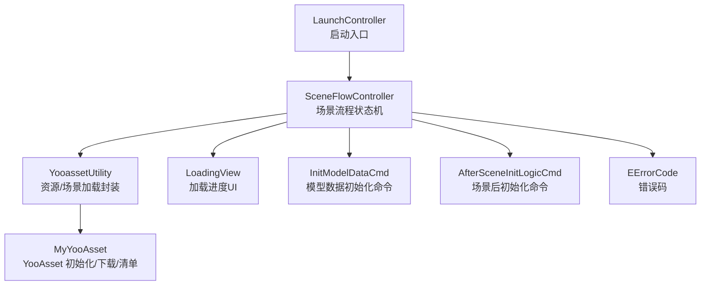
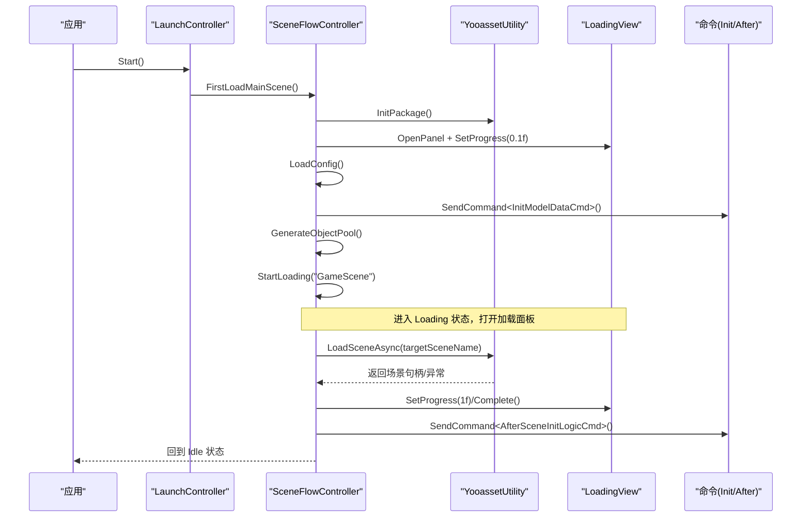
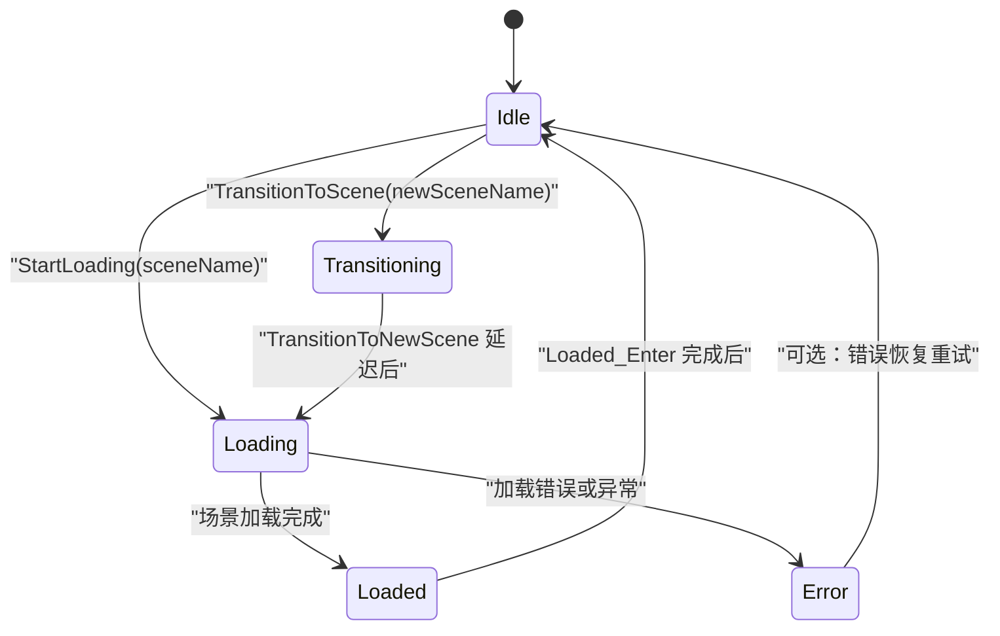
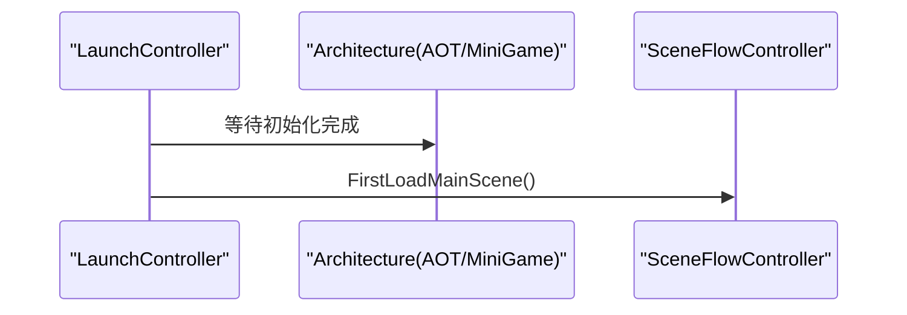
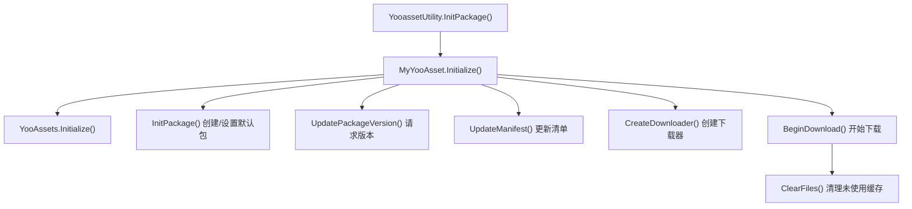
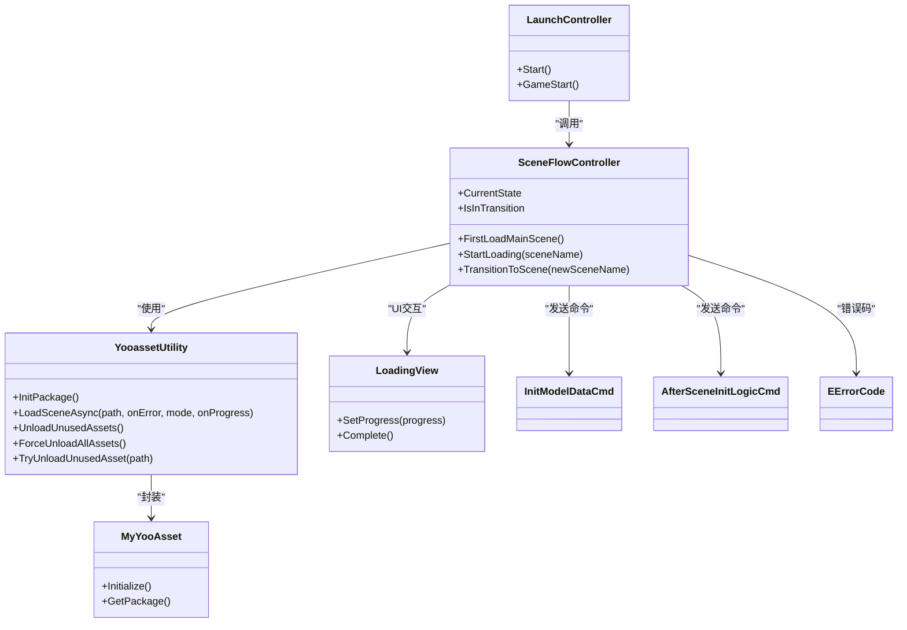

# 场景流转控制

<cite>
**本文引用的文件**   
- [SceneFlowController.cs](file://Assets/Game/Scripts/MiniGame_Scripts/Controller/SceneFlowController.cs)
- [LaunchController.cs](file://Assets/Game/Scripts/MiniGame_Scripts/Utility/LaunchController.cs)
- [YooassetUtility.cs](file://Assets/Game/Scripts/MiniGame_Scripts/Utility/YooassetUtility.cs)
- [MyYooAsset.cs](file://Assets/Game/Scripts/MiniGame_Scripts/Utility/MyYooAsset.cs)
- [LoadingView.cs](file://Assets/Game/Scripts/MiniGame_Scripts/Controller/LoadingView.cs)
- [InitModelDataCmd.cs](file://Assets/Game/Scripts/MiniGame_Scripts/Command/InitModelDataCmd.cs)
- [AfterSceneInitLogicCmd.cs](file://Assets/Game/Scripts/MiniGame_Scripts/Command/AfterSceneInitLogicCmd.cs)
- [EErrorCode.cs](file://Assets/Game/Scripts/MiniGame_Scripts/Utility/EErrorCode.cs)
</cite>

## 目录
1. [简介](#简介)
2. [项目结构](#项目结构)
3. [核心组件](#核心组件)
4. [架构总览](#架构总览)
5. [详细组件分析](#详细组件分析)
6. [依赖关系分析](#依赖关系分析)
7. [性能考虑](#性能考虑)
8. [故障排查指南](#故障排查指南)
9. [结论](#结论)
10. [附录：扩展与示例](#附录扩展与示例)

## 简介
本文件面向 SimulationClient 的场景流转控制系统，围绕 SceneFlowController 的状态机实现、异步加载流程与进度反馈机制进行深入说明；同时解释 LaunchController 的启动流程与初始化逻辑。文档覆盖场景切换生命周期管理、资源预加载策略、错误恢复机制、命令模式应用、系统协调方式以及与各业务系统的集成点、数据清理与资源释放策略，并提供可扩展场景加载逻辑与自定义初始化流程的实践指引。

## 项目结构
与场景流转控制直接相关的代码主要分布在以下位置：
- 控制器层：SceneFlowController（场景流程状态机）、LaunchController（启动入口）
- 资源工具层：YooassetUtility、MyYooAsset（基于 YooAsset 的资源包与场景加载封装）
- UI 面板：LoadingView（加载进度展示）
- 命令层：InitModelDataCmd、AfterSceneInitLogicCmd（场景前后初始化命令）
- 错误码：EErrorCode（资源/场景加载错误枚举）

图表来源
- [LaunchController.cs:19-35](file://Assets/Game/Scripts/MiniGame_Scripts/Utility/LaunchController.cs#L19-L35)
- [SceneFlowController.cs:15-58](file://Assets/Game/Scripts/MiniGame_Scripts/Controller/SceneFlowController.cs#L15-L58)
- [YooassetUtility.cs:12-31](file://Assets/Game/Scripts/MiniGame_Scripts/Utility/YooassetUtility.cs#L12-L31)
- [MyYooAsset.cs:36-62](file://Assets/Game/Scripts/MiniGame_Scripts/Utility/MyYooAsset.cs#L36-L62)
- [LoadingView.cs:13-48](file://Assets/Game/Scripts/MiniGame_Scripts/Controller/LoadingView.cs#L13-L48)
- [InitModelDataCmd.cs:3-10](file://Assets/Game/Scripts/MiniGame_Scripts/Command/InitModelDataCmd.cs#L3-L10)
- [AfterSceneInitLogicCmd.cs:4-17](file://Assets/Game/Scripts/MiniGame_Scripts/Command/AfterSceneInitLogicCmd.cs#L4-L17)
- [EErrorCode.cs:1-7](file://Assets/Game/Scripts/MiniGame_Scripts/Utility/EErrorCode.cs#L1-L7)

章节来源
- [LaunchController.cs:19-35](file://Assets/Game/Scripts/MiniGame_Scripts/Utility/LaunchController.cs#L19-L35)
- [SceneFlowController.cs:15-58](file://Assets/Game/Scripts/MiniGame_Scripts/Controller/SceneFlowController.cs#L15-L58)

## 核心组件
- SceneFlowController：基于 MonsterLove.StateMachine 的状态机驱动场景流转，负责首次加载主场景、常规场景切换、进度回调、错误处理与场景后初始化。
- LaunchController：作为启动控制器，等待架构初始化完成后触发 SceneFlowController 的首次加载流程。
- YooassetUtility / MyYooAsset：封装 YooAsset 的资源包初始化、版本与清单更新、下载、场景异步加载与资源卸载等能力。
- LoadingView：显示加载进度条，支持设置进度与完成回调。
- 命令 InitModelDataCmd / AfterSceneInitLogicCmd：在场景加载前/后进行数据与系统初始化。
- EErrorCode：定义资源/场景加载的错误码。

章节来源
- [SceneFlowController.cs:15-58](file://Assets/Game/Scripts/MiniGame_Scripts/Controller/SceneFlowController.cs#L15-L58)
- [LaunchController.cs:19-35](file://Assets/Game/Scripts/MiniGame_Scripts/Utility/LaunchController.cs#L19-L35)
- [YooassetUtility.cs:12-31](file://Assets/Game/Scripts/MiniGame_Scripts/Utility/YooassetUtility.cs#L12-L31)
- [MyYooAsset.cs:36-62](file://Assets/Game/Scripts/MiniGame_Scripts/Utility/MyYooAsset.cs#L36-L62)
- [LoadingView.cs:13-48](file://Assets/Game/Scripts/MiniGame_Scripts/Controller/LoadingView.cs#L13-L48)
- [InitModelDataCmd.cs:3-10](file://Assets/Game/Scripts/MiniGame_Scripts/Command/InitModelDataCmd.cs#L3-L10)
- [AfterSceneInitLogicCmd.cs:4-17](file://Assets/Game/Scripts/MiniGame_Scripts/Command/AfterSceneInitLogicCmd.cs#L4-L17)
- [EErrorCode.cs:1-7](file://Assets/Game/Scripts/MiniGame_Scripts/Utility/EErrorCode.cs#L1-L7)

## 架构总览
整体采用“启动器 -> 场景流程控制器 -> 资源工具 -> UI/命令/系统”的分层协作模式。启动器等待架构就绪后调用场景流程控制器；场景流程控制器通过状态机驱动加载流程，借助资源工具进行场景异步加载，并通过 UI 面板反馈进度；加载完成后发送命令触发后续系统初始化。

图表来源
- [LaunchController.cs:19-35](file://Assets/Game/Scripts/MiniGame_Scripts/Utility/LaunchController.cs#L19-L35)
- [SceneFlowController.cs:169-227](file://Assets/Game/Scripts/MiniGame_Scripts/Controller/SceneFlowController.cs#L169-L227)
- [YooassetUtility.cs:68-87](file://Assets/Game/Scripts/MiniGame_Scripts/Utility/YooassetUtility.cs#L68-L87)
- [LoadingView.cs:37-47](file://Assets/Game/Scripts/MiniGame_Scripts/Controller/LoadingView.cs#L37-L47)
- [InitModelDataCmd.cs:3-10](file://Assets/Game/Scripts/MiniGame_Scripts/Command/InitModelDataCmd.cs#L3-L10)
- [AfterSceneInitLogicCmd.cs:4-17](file://Assets/Game/Scripts/MiniGame_Scripts/Command/AfterSceneInitLogicCmd.cs#L4-L17)

## 详细组件分析

### SceneFlowController 状态机与流程
- 状态定义：Idle、Loading、Loaded、Transitioning、Error。
- 关键行为：
  - Idle_Enter：重置进度为 0。
  - Loading_Enter：打开 LoadingView，并启动异步加载协程。
  - Loading_Update：每帧广播 OnLoadProgress 并更新 UI 进度。
  - Loaded_Enter：标记完成、关闭面板、回到 Idle。
  - Transitioning_Enter：延迟后进入 Loading 状态（用于过渡动画或准备）。
  - Error_Enter：记录错误日志。
- 异步加载：
  - LoadSceneCoroutine：模拟延迟后调用 LoadSceneAsync，完成后执行 DoAfterLevelLoad。
  - LoadSceneAsync：通过 YooassetUtility.LoadSceneAsync 加载目标场景，监听错误码并切换到 Error 状态；成功则设置进度为 1 并切换到 Loaded。
- 公共接口：
  - FirstLoadMainScene：初始化资源包、着色器预热、打开加载面板、加载配置、初始化模型数据、生成对象池、开始加载主场景。
  - StartLoading/TransitionToScene：设置目标场景名并切换状态。
  - CurrentState/IsInTransition：暴露当前状态与是否处于过渡中。

图表来源
- [SceneFlowController.cs:17-24](file://Assets/Game/Scripts/MiniGame_Scripts/Controller/SceneFlowController.cs#L17-L24)
- [SceneFlowController.cs:62-111](file://Assets/Game/Scripts/MiniGame_Scripts/Controller/SceneFlowController.cs#L62-L111)
- [SceneFlowController.cs:117-163](file://Assets/Game/Scripts/MiniGame_Scripts/Controller/SceneFlowController.cs#L117-L163)
- [SceneFlowController.cs:213-227](file://Assets/Game/Scripts/MiniGame_Scripts/Controller/SceneFlowController.cs#L213-L227)

章节来源
- [SceneFlowController.cs:15-58](file://Assets/Game/Scripts/MiniGame_Scripts/Controller/SceneFlowController.cs#L15-L58)
- [SceneFlowController.cs:62-111](file://Assets/Game/Scripts/MiniGame_Scripts/Controller/SceneFlowController.cs#L62-L111)
- [SceneFlowController.cs:117-163](file://Assets/Game/Scripts/MiniGame_Scripts/Controller/SceneFlowController.cs#L117-L163)
- [SceneFlowController.cs:169-227](file://Assets/Game/Scripts/MiniGame_Scripts/Controller/SceneFlowController.cs#L169-L227)

### LaunchController 启动流程
- 在 Start 中等待架构初始化完成（AOT.Interface、MiniGame.Interface），获取 UISystem，然后调用 GameStart。
- GameStart 调用 SceneFlowController.Instance.FirstLoadMainScene() 启动首次加载主场景流程。

图表来源
- [LaunchController.cs:19-35](file://Assets/Game/Scripts/MiniGame_Scripts/Utility/LaunchController.cs#L19-L35)
- [SceneFlowController.cs:169-187](file://Assets/Game/Scripts/MiniGame_Scripts/Controller/SceneFlowController.cs#L169-L187)

章节来源
- [LaunchController.cs:19-35](file://Assets/Game/Scripts/MiniGame_Scripts/Utility/LaunchController.cs#L19-L35)

### 资源系统与场景加载（YooassetUtility / MyYooAsset）
- YooassetUtility：
  - InitPackage：委托 MyYooAsset.Initialize 完成资源包初始化，并缓存 Package。
  - LoadSceneAsync：使用 ResourcePackage.LoadSceneAsync 异步加载场景，支持错误回调与进度回调。
  - UnloadUnusedAssets/ForceUnloadAllAssets/TryUnloadUnusedAsset：提供资源释放能力。
- MyYooAsset：
  - Initialize：初始化 YooAssets、设置时间片、创建/设置默认包、更新版本与清单、创建下载器并开始下载、清理未使用缓存。
  - GetPackage：返回已初始化的 ResourcePackage。

图表来源
- [YooassetUtility.cs:27-31](file://Assets/Game/Scripts/MiniGame_Scripts/Utility/YooassetUtility.cs#L27-L31)
- [MyYooAsset.cs:36-62](file://Assets/Game/Scripts/MiniGame_Scripts/Utility/MyYooAsset.cs#L36-L62)
- [MyYooAsset.cs:66-82](file://Assets/Game/Scripts/MiniGame_Scripts/Utility/MyYooAsset.cs#L66-L82)
- [MyYooAsset.cs:213-247](file://Assets/Game/Scripts/MiniGame_Scripts/Utility/MyYooAsset.cs#L213-L247)
- [MyYooAsset.cs:251-280](file://Assets/Game/Scripts/MiniGame_Scripts/Utility/MyYooAsset.cs#L251-L280)

章节来源
- [YooassetUtility.cs:12-31](file://Assets/Game/Scripts/MiniGame_Scripts/Utility/YooassetUtility.cs#L12-L31)
- [YooassetUtility.cs:68-87](file://Assets/Game/Scripts/MiniGame_Scripts/Utility/YooassetUtility.cs#L68-L87)
- [YooassetUtility.cs:96-118](file://Assets/Game/Scripts/MiniGame_Scripts/Utility/YooassetUtility.cs#L96-L118)
- [MyYooAsset.cs:36-62](file://Assets/Game/Scripts/MiniGame_Scripts/Utility/MyYooAsset.cs#L36-L62)

### 进度反馈与 UI 联动（LoadingView）
- LoadingView 提供 SetProgress 与 Complete 方法，由 SceneFlowController 在 Loading_Update 与 Loaded_Enter 中调用以更新进度与完成状态。
- 进度值来源于内部 loadingProgress 字段，并在 Loading_OnLoadProgress 回调中更新。

章节来源
- [SceneFlowController.cs:83-92](file://Assets/Game/Scripts/MiniGame_Scripts/Controller/SceneFlowController.cs#L83-L92)
- [SceneFlowController.cs:94-100](file://Assets/Game/Scripts/MiniGame_Scripts/Controller/SceneFlowController.cs#L94-L100)
- [LoadingView.cs:37-47](file://Assets/Game/Scripts/MiniGame_Scripts/Controller/LoadingView.cs#L37-L47)

### 命令模式与系统协调
- InitModelDataCmd：在场景加载前执行数据初始化（如存档数据）。
- AfterSceneInitLogicCmd：在场景加载完成后执行系统初始化（例如 ActorSystem.AfterSceneInit）。
- SceneFlowController 在 FirstLoadMainScene 与 DoAfterLevelLoad 中分别发送这两个命令，形成“加载前 -> 加载 -> 加载后”的完整生命周期。

章节来源
- [InitModelDataCmd.cs:3-10](file://Assets/Game/Scripts/MiniGame_Scripts/Command/InitModelDataCmd.cs#L3-L10)
- [AfterSceneInitLogicCmd.cs:4-17](file://Assets/Game/Scripts/MiniGame_Scripts/Command/AfterSceneInitLogicCmd.cs#L4-L17)
- [SceneFlowController.cs:169-187](file://Assets/Game/Scripts/MiniGame_Scripts/Controller/SceneFlowController.cs#L169-L187)
- [SceneFlowController.cs:232-235](file://Assets/Game/Scripts/MiniGame_Scripts/Controller/SceneFlowController.cs#L232-L235)

### 错误处理与恢复机制
- 错误来源：
  - YooassetUtility.LoadSceneAsync 的 onError 回调返回 EErrorCode。
  - LoadSceneAsync 的 try/catch 捕获异常。
- 处理策略：
  - 将状态切换到 Error，并记录错误日志。
  - 可在外部监听 Error 状态后实现重试或回退逻辑（例如重新初始化资源包、提示用户检查网络或磁盘空间）。

章节来源
- [SceneFlowController.cs:129-156](file://Assets/Game/Scripts/MiniGame_Scripts/Controller/SceneFlowController.cs#L129-L156)
- [EErrorCode.cs:1-7](file://Assets/Game/Scripts/MiniGame_Scripts/Utility/EErrorCode.cs#L1-L7)

## 依赖关系分析
- LaunchController 依赖 Architecture 初始化完成，再调用 SceneFlowController。
- SceneFlowController 依赖：
  - YooassetUtility（资源/场景加载）
  - UISystem（打开/关闭 LoadingView）
  - 命令系统（InitModelDataCmd、AfterSceneInitLogicCmd）
  - 其他系统（如 ActorSystem）用于场景后初始化
- YooassetUtility 依赖 MyYooAsset 与 YooAsset 底层 API。

图表来源
- [LaunchController.cs:19-35](file://Assets/Game/Scripts/MiniGame_Scripts/Utility/LaunchController.cs#L19-L35)
- [SceneFlowController.cs:15-58](file://Assets/Game/Scripts/MiniGame_Scripts/Controller/SceneFlowController.cs#L15-L58)
- [YooassetUtility.cs:12-31](file://Assets/Game/Scripts/MiniGame_Scripts/Utility/YooassetUtility.cs#L12-L31)
- [MyYooAsset.cs:36-62](file://Assets/Game/Scripts/MiniGame_Scripts/Utility/MyYooAsset.cs#L36-L62)
- [LoadingView.cs:13-48](file://Assets/Game/Scripts/MiniGame_Scripts/Controller/LoadingView.cs#L13-L48)
- [InitModelDataCmd.cs:3-10](file://Assets/Game/Scripts/MiniGame_Scripts/Command/InitModelDataCmd.cs#L3-L10)
- [AfterSceneInitLogicCmd.cs:4-17](file://Assets/Game/Scripts/MiniGame_Scripts/Command/AfterSceneInitLogicCmd.cs#L4-L17)
- [EErrorCode.cs:1-7](file://Assets/Game/Scripts/MiniGame_Scripts/Utility/EErrorCode.cs#L1-L7)

章节来源
- [LaunchController.cs:19-35](file://Assets/Game/Scripts/MiniGame_Scripts/Utility/LaunchController.cs#L19-L35)
- [SceneFlowController.cs:15-58](file://Assets/Game/Scripts/MiniGame_Scripts/Controller/SceneFlowController.cs#L15-L58)
- [YooassetUtility.cs:12-31](file://Assets/Game/Scripts/MiniGame_Scripts/Utility/YooassetUtility.cs#L12-L31)

## 性能考虑
- 资源包初始化与清单更新：建议在首次加载时一次性完成，避免频繁重复初始化。
- 着色器预热：通过 ShaderVariantCollection.WarmUp 减少运行时卡顿。
- 对象池：在场景切换前生成对象池，降低实例化开销。
- 资源卸载：在场景切换后调用 UnloadUnusedAssets 或 ForceUnloadAllAssets，及时释放内存。
- 异步加载：使用 UniTask 与 YooAsset 的异步 API，避免阻塞主线程。

[本节为通用性能建议，不直接分析具体文件]

## 故障排查指南
- 常见问题定位：
  - 资源包未初始化：检查 YooassetUtility.InitPackage 是否被调用且 MyYooAsset.Initialize 成功。
  - 清单/版本失败：查看 UpdatePackageVersion/UpdateManifest 的日志输出。
  - 下载失败：关注 BeginDownload 的 DownloadErrorCallback 与 TotalDownloadCount。
  - 场景加载错误：检查 LoadSceneAsync 的 onError 回调与 EErrorCode。
- 恢复策略：
  - 在 Error 状态下可尝试重新 InitPackage 或提示用户检查网络/磁盘空间。
  - 对特定资源路径使用 TryUnloadUnusedAsset 强制释放。

章节来源
- [MyYooAsset.cs:213-247](file://Assets/Game/Scripts/MiniGame_Scripts/Utility/MyYooAsset.cs#L213-L247)
- [MyYooAsset.cs:251-280](file://Assets/Game/Scripts/MiniGame_Scripts/Utility/MyYooAsset.cs#L251-L280)
- [YooassetUtility.cs:96-118](file://Assets/Game/Scripts/MiniGame_Scripts/Utility/YooassetUtility.cs#L96-L118)
- [SceneFlowController.cs:129-156](file://Assets/Game/Scripts/MiniGame_Scripts/Controller/SceneFlowController.cs#L129-L156)
- [EErrorCode.cs:1-7](file://Assets/Game/Scripts/MiniGame_Scripts/Utility/EErrorCode.cs#L1-L7)

## 结论
SceneFlowController 通过清晰的状态机与异步加载流程，实现了稳定的场景流转控制；配合 YooassetUtility/MyYooAsset 的资源管理能力与 LoadingView 的进度反馈，形成了完整的“启动 -> 预加载 -> 加载 -> 初始化 -> 运行”的生命周期。命令模式进一步解耦了前后置初始化逻辑，便于扩展与维护。通过合理的资源释放与错误恢复策略，可有效提升用户体验与系统稳定性。

[本节为总结性内容，不直接分析具体文件]

## 附录：扩展与示例
- 扩展场景加载逻辑：
  - 在 LoadSceneAsync 中增加自定义预处理步骤（如动态配置注入、地图网格初始化），并在成功后继续推进到 Loaded 状态。
  - 参考路径：[SceneFlowController.cs:129-156](file://Assets/Game/Scripts/MiniGame_Scripts/Controller/SceneFlowController.cs#L129-L156)
- 自定义场景初始化流程：
  - 新增命令类继承 AbstractCommand，在 OnExecute 中实现自定义初始化逻辑，并在 DoAfterLevelLoad 中发送该命令。
  - 参考路径：[AfterSceneInitLogicCmd.cs:4-17](file://Assets/Game/Scripts/MiniGame_Scripts/Command/AfterSceneInitLogicCmd.cs#L4-L17)
- 集成业务系统：
  - 在 AfterSceneInitLogicCmd 中调用 MapGridSystem、PathfindSystem、ActorSystem 等的 AfterSceneInit 方法，确保场景相关系统正确初始化。
  - 参考路径：[AfterSceneInitLogicCmd.cs:11-16](file://Assets/Game/Scripts/MiniGame_Scripts/Command/AfterSceneInitLogicCmd.cs#L11-L16)
- 资源清理与释放：
  - 在场景切换后调用 YooassetUtility.UnloadUnusedAssets 或 ForceUnloadAllAssets，避免内存泄漏。
  - 参考路径：[YooassetUtility.cs:96-118](file://Assets/Game/Scripts/MiniGame_Scripts/Utility/YooassetUtility.cs#L96-L118)

章节来源
- [SceneFlowController.cs:129-156](file://Assets/Game/Scripts/MiniGame_Scripts/Controller/SceneFlowController.cs#L129-L156)
- [AfterSceneInitLogicCmd.cs:4-17](file://Assets/Game/Scripts/MiniGame_Scripts/Command/AfterSceneInitLogicCmd.cs#L4-L17)
- [YooassetUtility.cs:96-118](file://Assets/Game/Scripts/MiniGame_Scripts/Utility/YooassetUtility.cs#L96-L118)