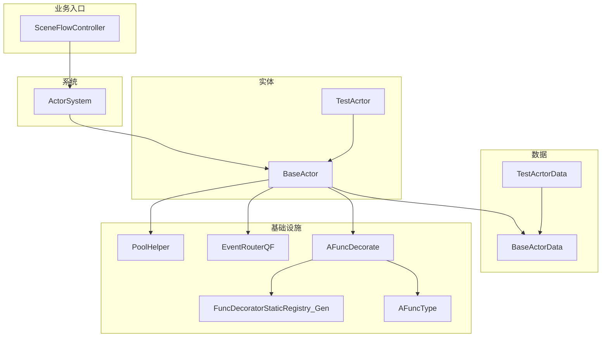
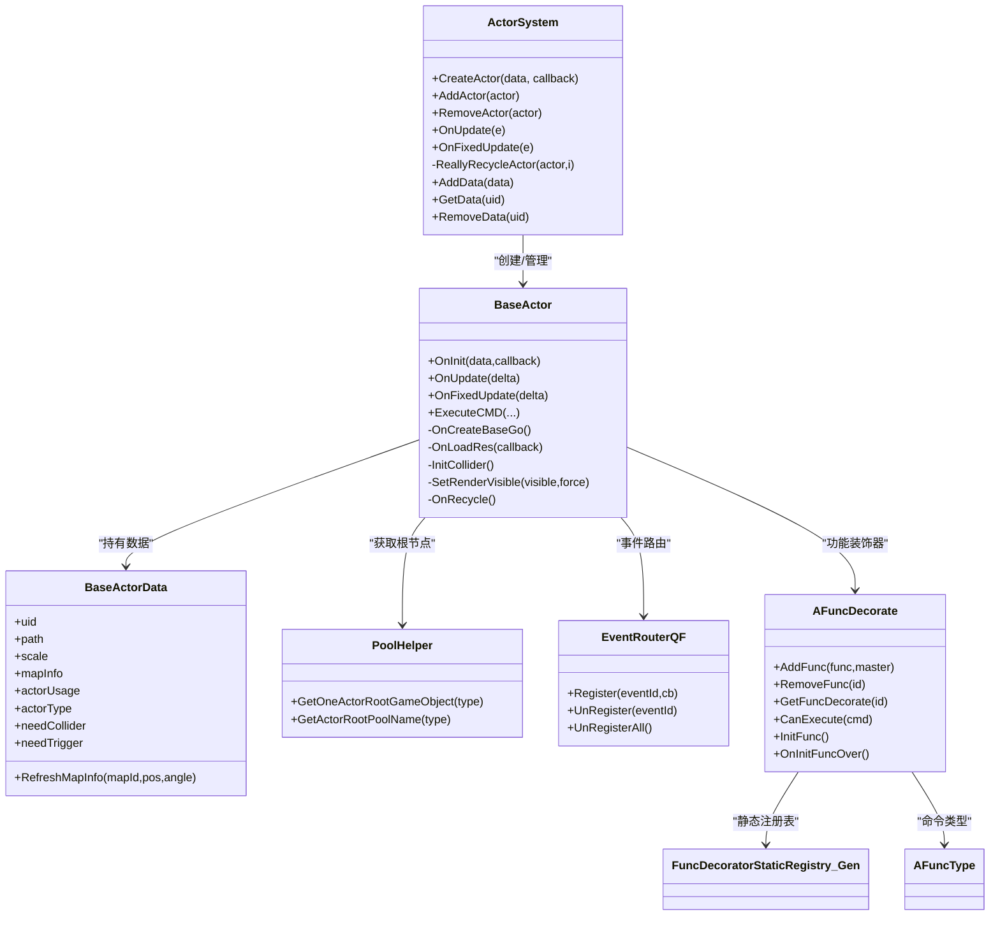
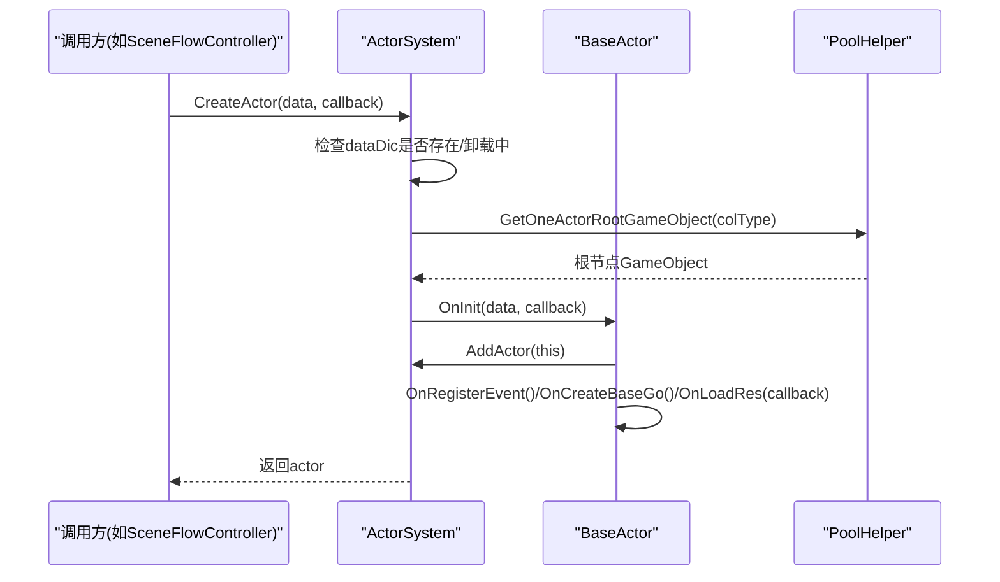
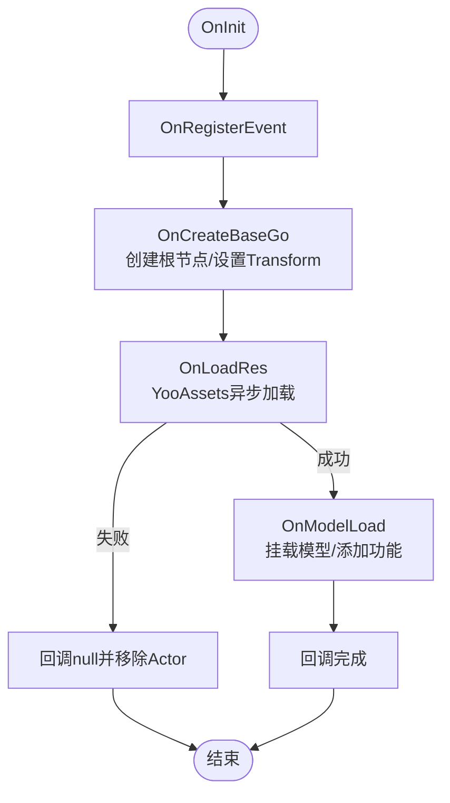
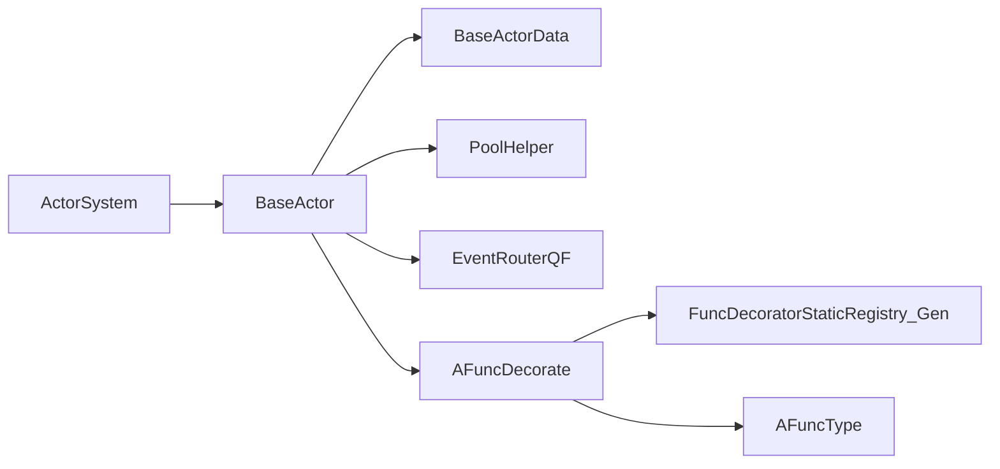

# 角色管理系统

<cite>
**本文引用的文件列表**
- [ActorSystem.cs](file://Assets/Game/Scripts/MiniGame_Scripts/System/ActorSystem.cs)
- [BaseActor.cs](file://Assets/Game/Scripts/Game/Runtime/Logic/Actor/BaseActor.cs)
- [BaseActorData.cs](file://Assets/Game/Scripts/Game/Runtime/Logic/Actor/BaseActorData.cs)
- [PoolHelper.cs](file://Assets/Game/Framework/MPool/PoolHelper.cs)
- [EventRouterQF.cs](file://Assets/Game/Scripts/Game/Runtime/Logic/Router/EventRouterQF.cs)
- [AFuncDecorate.cs](file://Assets/Game/Scripts/Game/Runtime/Logic/Decorate/AFuncDecorate.cs)
- [FuncDecoratorStaticRegistry_Gen.cs](file://Assets/Game/Scripts/Game/Runtime/Logic/Decorate/FuncDecoratorStaticRegistry_Gen.cs)
- [AFuncType.cs](file://Assets/Game/Scripts/Game/Runtime/Logic/Decorate/AFuncType.cs)
- [TestAcrtor.cs](file://Assets/Game/Scripts/Game/Runtime/Logic/Actor/GameActor/TestAcrtor.cs)
- [TestAcrtorData.cs](file://Assets/Game/Scripts/Game/Runtime/Logic/Actor/GameActor/TestAcrtorData.cs)
- [SceneFlowController.cs](file://Assets/Game/Scripts/MiniGame_Scripts/Controller/SceneFlowController.cs)
</cite>

## 目录
1. [简介](#简介)
2. [项目结构](#项目结构)
3. [核心组件](#核心组件)
4. [架构总览](#架构总览)
5. [详细组件分析](#详细组件分析)
6. [依赖关系分析](#依赖关系分析)
7. [性能考量](#性能考量)
8. [故障排查指南](#故障排查指南)
9. [结论](#结论)
10. [附录：使用示例与最佳实践](#附录使用示例与最佳实践)

## 简介
本文件为 SimulationClient 的角色管理系统提供系统化、可操作的技术文档。围绕 ActorSystem 的创建、添加、移除与生命周期管理，深入解析 BaseActor 基类的设计模式与扩展机制；说明对象池集成、事件路由机制与性能优化策略；并给出数据模型 BaseActorData 的管理方式、UID 分配机制与内存回收策略。文末提供实际调用路径与使用模式，帮助快速上手自定义角色类型与交互逻辑。

## 项目结构
角色管理系统主要分布在以下模块：
- 系统层：ActorSystem（角色系统）
- 实体层：BaseActor（抽象角色）、具体角色实现（如 TestAcrtor）
- 数据层：BaseActorData（角色数据），具体数据（如 TestAcrtorData）
- 基础设施：对象池 PoolHelper、事件路由 EventRouterQF、功能装饰器 AFuncDecorate 及静态注册表
- 业务入口：场景流程控制器 SceneFlowController（演示如何创建与驱动角色）

图表来源
- [ActorSystem.cs:1-272](file://Assets/Game/Scripts/MiniGame_Scripts/System/ActorSystem.cs#L1-L272)
- [BaseActor.cs:1-572](file://Assets/Game/Scripts/Game/Runtime/Logic/Actor/BaseActor.cs#L1-L572)
- [BaseActorData.cs:1-64](file://Assets/Game/Scripts/Game/Runtime/Logic/Actor/BaseActorData.cs#L1-L64)
- [PoolHelper.cs:1-66](file://Assets/Game/Scripts/Game/Framework/MPool/PoolHelper.cs#L1-L66)
- [EventRouterQF.cs:1-51](file://Assets/Game/Scripts/Game/Runtime/Logic/Router/EventRouterQF.cs#L1-L51)
- [AFuncDecorate.cs:77-222](file://Assets/Game/Scripts/Game/Runtime/Logic/Decorate/AFuncDecorate.cs#L77-L222)
- [FuncDecoratorStaticRegistry_Gen.cs:1-41](file://Assets/Game/Scripts/Game/Runtime/Logic/Decorate/FuncDecoratorStaticRegistry_Gen.cs#L1-L41)
- [AFuncType.cs:1-26](file://Assets/Game/Scripts/Game/Runtime/Logic/Decorate/AFuncType.cs#L1-L26)
- [SceneFlowController.cs:249-286](file://Assets/Game/Scripts/MiniGame_Scripts/Controller/SceneFlowController.cs#L249-L286)

章节来源
- [ActorSystem.cs:1-272](file://Assets/Game/Scripts/MiniGame_Scripts/System/ActorSystem.cs#L1-L272)
- [BaseActor.cs:1-572](file://Assets/Game/Scripts/Game/Runtime/Logic/Actor/BaseActor.cs#L1-L572)
- [BaseActorData.cs:1-64](file://Assets/Game/Scripts/Game/Runtime/Logic/Actor/BaseActorData.cs#L1-L64)
- [PoolHelper.cs:1-66](file://Assets/Game/Scripts/Game/Framework/MPool/PoolHelper.cs#L1-L66)
- [EventRouterQF.cs:1-51](file://Assets/Game/Scripts/Game/Runtime/Logic/Router/EventRouterQF.cs#L1-L51)
- [AFuncDecorate.cs:77-222](file://Assets/Game/Scripts/Game/Runtime/Logic/Decorate/AFuncDecorate.cs#L77-L222)
- [FuncDecoratorStaticRegistry_Gen.cs:1-41](file://Assets/Game/Scripts/Game/Runtime/Logic/Decorate/FuncDecoratorStaticRegistry_Gen.cs#L1-L41)
- [AFuncType.cs:1-26](file://Assets/Game/Scripts/Game/Runtime/Logic/Decorate/AFuncType.cs#L1-L26)
- [SceneFlowController.cs:249-286](file://Assets/Game/Scripts/MiniGame_Scripts/Controller/SceneFlowController.cs#L249-L286)

## 核心组件
- ActorSystem：角色系统的中心调度器，负责角色的创建、注册、更新分发、移除与数据字典维护，并提供事件路由服务。
- BaseActor：所有角色的抽象基类，封装了外壳 GameObject 创建、资源异步加载、碰撞体/触发器初始化、命令执行框架、渲染可见性控制等。
- BaseActorData：角色数据抽象，承载 UID、资源路径、缩放、地图位置、用途与类型等信息，支持对象池复用。
- PoolHelper：按碰撞体类型区分根节点对象池，避免频繁实例化带来的 GC 压力。
- EventRouterQF：基于 QFramework 的事件路由封装，统一注册/注销事件，便于调试与排障。
- AFuncDecorate 及其静态注册表：功能装饰器体系，通过命令区间划分与排序，将复杂行为模块化并可插拔。
- 示例角色：TestAcrtor/TestAcrtorData，展示如何继承基类、注册事件、添加功能模块与处理指令。

章节来源
- [ActorSystem.cs:1-272](file://Assets/Game/Scripts/MiniGame_Scripts/System/ActorSystem.cs#L1-L272)
- [BaseActor.cs:1-572](file://Assets/Game/Scripts/Game/Runtime/Logic/Actor/BaseActor.cs#L1-L572)
- [BaseActorData.cs:1-64](file://Assets/Game/Scripts/Game/Runtime/Logic/Actor/BaseActorData.cs#L1-L64)
- [PoolHelper.cs:1-66](file://Assets/Game/Scripts/Game/Framework/MPool/PoolHelper.cs#L1-L66)
- [EventRouterQF.cs:1-51](file://Assets/Game/Scripts/Game/Runtime/Logic/Router/EventRouterQF.cs#L1-L51)
- [AFuncDecorate.cs:77-222](file://Assets/Game/Scripts/Game/Runtime/Logic/Decorate/AFuncDecorate.cs#L77-L222)
- [FuncDecoratorStaticRegistry_Gen.cs:1-41](file://Assets/Game/Scripts/Game/Runtime/Logic/Decorate/FuncDecoratorStaticRegistry_Gen.cs#L1-L41)
- [AFuncType.cs:1-26](file://Assets/Game/Scripts/Game/Runtime/Logic/Decorate/AFuncType.cs#L1-L26)
- [TestAcrtor.cs:1-41](file://Assets/Game/Scripts/Game/Runtime/Logic/Actor/GameActor/TestAcrtor.cs#L1-L41)
- [TestAcrtorData.cs:1-7](file://Assets/Game/Scripts/Game/Runtime/Logic/Actor/GameActor/TestAcrtorData.cs#L1-L7)

## 架构总览
角色系统采用“系统-实体-数据”三层分离，配合对象池与装饰器模式，形成高内聚、低耦合的可扩展架构。

图表来源
- [ActorSystem.cs:1-272](file://Assets/Game/Scripts/MiniGame_Scripts/System/ActorSystem.cs#L1-L272)
- [BaseActor.cs:1-572](file://Assets/Game/Scripts/Game/Runtime/Logic/Actor/BaseActor.cs#L1-L572)
- [BaseActorData.cs:1-64](file://Assets/Game/Scripts/Game/Runtime/Logic/Actor/BaseActorData.cs#L1-L64)
- [PoolHelper.cs:1-66](file://Assets/Game/Scripts/Game/Framework/MPool/PoolHelper.cs#L1-L66)
- [EventRouterQF.cs:1-51](file://Assets/Game/Scripts/Game/Runtime/Logic/Router/EventRouterQF.cs#L1-L51)
- [AFuncDecorate.cs:77-222](file://Assets/Game/Scripts/Game/Runtime/Logic/Decorate/AFuncDecorate.cs#L77-L222)
- [FuncDecoratorStaticRegistry_Gen.cs:1-41](file://Assets/Game/Scripts/Game/Runtime/Logic/Decorate/FuncDecoratorStaticRegistry_Gen.cs#L1-L41)
- [AFuncType.cs:1-26](file://Assets/Game/Scripts/Game/Runtime/Logic/Decorate/AFuncType.cs#L1-L26)

## 详细组件分析

### ActorSystem：角色生命周期与调度
- 职责
  - 维护 actor 与 data 的双向索引（按 uid）。
  - 在 Update/FixedUpdate 中遍历并分发 OnUpdate/OnFixedUpdate。
  - 管理待删除队列（以负数 UID 标记），延迟回收，避免迭代期修改集合。
  - 提供 CreateActor/AddActor/RemoveActor 以及 Data 增删查接口。
- 关键流程
  - CreateActor：校验数据是否已存在或处于卸载中；从对象池取出根节点；调用 BaseActor.OnInit；设置初始位置与角度；返回 actor。
  - AddActor：去重与替换旧实例；加入 list 与 actorDic。
  - RemoveActor：若存在则标记 isWillRemove 并将 uid 映射到 waitRomoveUid 负值区间，等待帧末清理；否则直接回收。
  - ReallyRecycleActor：从字典与列表中移除，PushToPool 回收对象。
- 事件路由
  - AfterSceneInit 中注册全局 Update/FixedUpdate 事件，驱动角色循环。
  - RegisterRoutes 通过 RouteService 注入 EventRouterQF 实例。

图表来源
- [ActorSystem.cs:123-147](file://Assets/Game/Scripts/MiniGame_Scripts/System/ActorSystem.cs#L123-L147)
- [BaseActor.cs:46-57](file://Assets/Game/Scripts/Game/Runtime/Logic/Actor/BaseActor.cs#L46-L57)
- [PoolHelper.cs:33-43](file://Assets/Game/Scripts/Game/Framework/MPool/PoolHelper.cs#L33-L43)

章节来源
- [ActorSystem.cs:37-121](file://Assets/Game/Scripts/MiniGame_Scripts/System/ActorSystem.cs#L37-L121)
- [ActorSystem.cs:149-205](file://Assets/Game/Scripts/MiniGame_Scripts/System/ActorSystem.cs#L149-L205)
- [ActorSystem.cs:207-268](file://Assets/Game/Scripts/MiniGame_Scripts/System/ActorSystem.cs#L207-L268)

### BaseActor：角色基类与扩展点
- 设计要点
  - 外壳与模型解耦：先创建可参与逻辑/碰撞的根节点，再异步加载模型。
  - 资源加载：基于 YooAssets 异步加载，完成后挂载模型并回调。
  - 碰撞体/触发器：根据配置或默认策略创建 Box/Capsule/Sphere 等，支持按需启用。
  - 命令执行：通过 AFuncDecorate 装饰器链，支持带参/无参、有返回值/无返回值指令，未初始化时排队等待。
  - 可见性控制：批量切换子树 Renderer 的 enabled。
- 生命周期钩子
  - OnInit：注册事件、创建根节点、加载资源。
  - OnModelLoad：添加功能模块，触发 OnAddFuncOver。
  - OnRecycle：释放资源、注销事件、回收根节点与触发器、重置状态。
- 扩展机制
  - 重写 OnRegisterEvent/OnUnRegisterEvent 进行事件绑定/解绑。
  - 重写 OnAddOtherFuncs 添加自定义功能装饰器。
  - 重写 OnResLoaded/OnModelLoad 进行资源就绪后的二次初始化。

图表来源
- [BaseActor.cs:46-57](file://Assets/Game/Scripts/Game/Runtime/Logic/Actor/BaseActor.cs#L46-L57)
- [BaseActor.cs:112-148](file://Assets/Game/Scripts/Game/Runtime/Logic/Actor/BaseActor.cs#L112-L148)
- [BaseActor.cs:151-220](file://Assets/Game/Scripts/Game/Runtime/Logic/Actor/BaseActor.cs#L151-L220)
- [BaseActor.cs:248-255](file://Assets/Game/Scripts/Game/Runtime/Logic/Actor/BaseActor.cs#L248-L255)
- [BaseActor.cs:59-91](file://Assets/Game/Scripts/Game/Runtime/Logic/Actor/BaseActor.cs#L59-L91)

章节来源
- [BaseActor.cs:1-572](file://Assets/Game/Scripts/Game/Runtime/Logic/Actor/BaseActor.cs#L1-L572)

### BaseActorData：数据模型与管理
- 字段与语义
  - uid：唯一标识，用于系统级索引与查找。
  - path：外壳资源路径（不含扩展名），用于构造预制体路径。
  - scale/mapInfo：缩放与地图位置信息（含 mapId、pos、angle）。
  - actorUsage/actorType：用途与类型枚举，便于分类与后续扩展。
  - needCollider/needTrigger：默认是否需要自动开启碰撞体与触发器。
- 工具方法
  - RefreshMapInfo：安全地拷贝 MapPosInfo 结构体，避免 GC。
- 对象池
  - 继承自 Poolable，支持 PushToPool/Pop 复用，减少分配。

章节来源
- [BaseActorData.cs:1-64](file://Assets/Game/Scripts/Game/Runtime/Logic/Actor/BaseActorData.cs#L1-L64)

### 对象池集成：根节点与类对象
- 根节点对象池
  - 按 ColliderType 区分不同池名，避免类型不匹配导致的重复销毁重建。
  - 首次访问时自动创建池并缓存。
- 类对象池
  - CPool/ClassPool 提供泛型 Pop/Push，支持预分配与惰性创建。
  - 回收时调用 Recycle 重置状态，防止脏数据。

章节来源
- [PoolHelper.cs:1-66](file://Assets/Game/Scripts/Game/Framework/MPool/PoolHelper.cs#L1-L66)
- [CPool.cs:63-97](file://Assets/Game/Scripts/Game/Framework/MPool/CPool.cs#L63-L97)
- [ClassPool.cs:37-86](file://Assets/Game/Scripts/Game/Framework/MPool/ClassPool.cs#L37-L86)

### 事件路由机制：EventRouterQF
- 特点
  - 基于 QFramework 的 BaseRouter 封装，内部维护 eventId -> Delegate 映射，便于调试与防重复注册。
  - 提供 Register/UnRegister/UnRegisterAll 统一生命周期管理。
- 使用模式
  - 在 BaseActor.OnRegisterEvent 中注册事件，在 OnUnRegisterEvent 中注销。
  - 示例角色 TestAcrtor 展示了注册两个事件并在回调中读取 data.uid。

章节来源
- [EventRouterQF.cs:1-51](file://Assets/Game/Scripts/Game/Runtime/Logic/Router/EventRouterQF.cs#L1-L51)
- [TestAcrtor.cs:17-33](file://Assets/Game/Scripts/Game/Runtime/Logic/Actor/GameActor/TestAcrtor.cs#L17-L33)

### 功能装饰器模式：AFuncDecorate 与静态注册表
- 设计思想
  - 每个装饰器拥有命令区间 [funcType, funcType + offset)，互不重叠，确保命令路由唯一命中。
  - 支持动态添加/移除装饰器，按 order 排序决定优先级。
  - 通过 FuncDecoratorStaticRegistry_Gen 自动生成类型与命令映射，降低手工维护成本。
- 命令执行
  - BaseActor.ExecuteCMD 系列重载支持多种签名；若未初始化完成，命令会被暂存至等待队列，初始化后统一执行。
- 示例
  - AFunc_TestE 通过特性标注声明其命令区间与顺序，并在 OnRegisterCMD 中注册处理器。

章节来源
- [AFuncDecorate.cs:77-222](file://Assets/Game/Scripts/Game/Runtime/Logic/Decorate/AFuncDecorate.cs#L77-L222)
- [FuncDecoratorStaticRegistry_Gen.cs:1-41](file://Assets/Game/Scripts/Game/Runtime/Logic/Decorate/FuncDecoratorStaticRegistry_Gen.cs#L1-L41)
- [AFuncType.cs:1-26](file://Assets/Game/Scripts/Game/Runtime/Logic/Decorate/AFuncType.cs#L1-L26)
- [BaseActor.cs:476-552](file://Assets/Game/Scripts/Game/Runtime/Logic/Actor/BaseActor.cs#L476-L552)

### 示例角色：TestAcrtor 与 TestAcrtorData
- TestAcrtorData：继承 BaseActorData，无需额外字段即可使用默认能力。
- TestAcrtor：
  - 在 OnAddOtherFuncs 中添加自定义功能装饰器（如 AFunc_Test）。
  - 在 OnRegisterEvent 中注册事件，并在回调中打印日志与 uid。
  - 重写 UpdateFunc 输出运行期信息。

章节来源
- [TestAcrtorData.cs:1-7](file://Assets/Game/Scripts/Game/Runtime/Logic/Actor/GameActor/TestAcrtorData.cs#L1-L7)
- [TestAcrtor.cs:1-41](file://Assets/Game/Scripts/Game/Runtime/Logic/Actor/GameActor/TestAcrtor.cs#L1-L41)

## 依赖关系分析
- ActorSystem 依赖
  - BaseActor：创建与生命周期管理。
  - PoolHelper：获取根节点对象池。
  - EventRouterQF：订阅 Update/FixedUpdate 事件。
- BaseActor 依赖
  - ActorSystem：注册自身、移除自身。
  - PoolHelper：获取根节点与触发器根节点。
  - YooAssets：异步加载模型资源。
  - AFuncDecorate：功能装饰器链与命令执行。
  - EventRouterQF：事件注册/注销。
- 数据层
  - BaseActorData：被 ActorSystem 与 BaseActor 共同持有，作为权威数据源。

图表来源
- [ActorSystem.cs:1-272](file://Assets/Game/Scripts/MiniGame_Scripts/System/ActorSystem.cs#L1-L272)
- [BaseActor.cs:1-572](file://Assets/Game/Scripts/Game/Runtime/Logic/Actor/BaseActor.cs#L1-L572)
- [BaseActorData.cs:1-64](file://Assets/Game/Scripts/Game/Runtime/Logic/Actor/BaseActorData.cs#L1-L64)
- [PoolHelper.cs:1-66](file://Assets/Game/Scripts/Game/Framework/MPool/PoolHelper.cs#L1-L66)
- [EventRouterQF.cs:1-51](file://Assets/Game/Scripts/Game/Runtime/Logic/Router/EventRouterQF.cs#L1-L51)
- [AFuncDecorate.cs:77-222](file://Assets/Game/Scripts/Game/Runtime/Logic/Decorate/AFuncDecorate.cs#L77-L222)
- [FuncDecoratorStaticRegistry_Gen.cs:1-41](file://Assets/Game/Scripts/Game/Runtime/Logic/Decorate/FuncDecoratorStaticRegistry_Gen.cs#L1-L41)
- [AFuncType.cs:1-26](file://Assets/Game/Scripts/Game/Runtime/Logic/Decorate/AFuncType.cs#L1-L26)

## 性能考量
- 对象池
  - 根节点按碰撞体类型分池，避免类型转换与重复构建。
  - 类对象池（CPool/ClassPool）减少频繁 new 与 GC。
- 资源加载
  - 异步加载模型，避免阻塞主线程；加载失败及时移除 Actor 并回调 null。
- 更新分发
  - 倒序遍历 list，边遍历边移除，避免额外临时集合。
  - 使用 isUnUsed/isWillRemove 标记延迟回收，保证遍历安全。
- 数据结构
  - Dictionary 按 uid 索引 O(1) 查找；list 用于有序遍历。
- 可见性优化
  - SetRenderVisible 批量开关 Renderer，减少逐对象判断开销。

[本节为通用性能建议，不直接分析具体文件]

## 故障排查指南
- 重复添加 Actor
  - 现象：日志提示重复添加同一 uid 的 Actor。
  - 原因：AddActor 检测到同 uid 非同一实例时的冲突。
  - 处理：确保业务侧不会并发添加相同 uid 的新实例；必要时先 Remove 旧实例。
- 资源未找到
  - 现象：资源路径无效导致错误日志并移除 Actor。
  - 处理：检查 AssetPathConst.prefab_actor 前缀与 data.path 是否正确提交到资源包。
- 事件重复注册
  - 现象：EventRouterQF 报错不允许重复注册。
  - 处理：确保 OnRegisterEvent 仅注册一次，或在 OnUnRegisterEvent 中正确注销。
- 命令执行时机
  - 现象：初始化未完成时 ExecuteCMD 会警告并排队。
  - 处理：确认装饰器已初始化完成；或使用回调确保时序。

章节来源
- [ActorSystem.cs:169-171](file://Assets/Game/Scripts/MiniGame_Scripts/System/ActorSystem.cs#L169-L171)
- [BaseActor.cs:214-219](file://Assets/Game/Scripts/Game/Runtime/Logic/Actor/BaseActor.cs#L214-L219)
- [EventRouterQF.cs:28-36](file://Assets/Game/Scripts/Game/Runtime/Logic/Router/EventRouterQF.cs#L28-L36)
- [BaseActor.cs:482-552](file://Assets/Game/Scripts/Game/Runtime/Logic/Actor/BaseActor.cs#L482-L552)

## 结论
角色管理系统通过 ActorSystem 集中调度、BaseActor 统一生命周期与扩展点、BaseActorData 权威数据模型，结合对象池与装饰器模式，实现了高性能、可扩展、易维护的角色生态。事件路由与命令执行机制进一步提升了模块间的解耦程度。建议在业务中遵循数据先行、资源异步、池化复用与装饰器组合的最佳实践，以获得稳定与高效的运行时表现。

[本节为总结性内容，不直接分析具体文件]

## 附录：使用示例与最佳实践

### 创建自定义角色类型
- 步骤
  - 定义数据：继承 BaseActorData，按需扩展字段。
  - 定义角色：继承 BaseActor，重写 OnRegisterEvent/OnAddOtherFuncs/OnResLoaded 等。
  - 注册功能：在 OnAddOtherFuncs 中使用 AddFunc 添加装饰器。
  - 创建与驱动：通过 ActorSystem.CreateActor 传入数据与回调。
- 参考路径
  - 数据示例：[TestAcrtorData.cs:1-7](file://Assets/Game/Scripts/Game/Runtime/Logic/Actor/GameActor/TestAcrtorData.cs#L1-L7)
  - 角色示例：[TestAcrtor.cs:1-41](file://Assets/Game/Scripts/Game/Runtime/Logic/Actor/GameActor/TestAcrtor.cs#L1-L41)
  - 创建调用：[SceneFlowController.cs:263-275](file://Assets/Game/Scripts/MiniGame_Scripts/Controller/SceneFlowController.cs#L263-L275)

### 处理角色交互逻辑
- 事件驱动
  - 在 OnRegisterEvent 中注册事件，在回调中读取 data.uid 并执行业务。
  - 参考：[TestAcrtor.cs:17-33](file://Assets/Game/Scripts/Game/Runtime/Logic/Actor/GameActor/TestAcrtor.cs#L17-L33)
- 命令驱动
  - 通过 ExecuteCMD 发送指令，装饰器内部处理。
  - 参考：[BaseActor.cs:476-552](file://Assets/Game/Scripts/Game/Runtime/Logic/Actor/BaseActor.cs#L476-L552)

### 数据模型管理与 UID 分配
- 数据管理
  - 使用 ActorSystem.AddData/GetData/RemoveData 维护数据字典。
  - 参考：[ActorSystem.cs:207-268](file://Assets/Game/Scripts/MiniGame_Scripts/System/ActorSystem.cs#L207-L268)
- UID 分配
  - 由业务侧在 BaseActorData.uid 中设置唯一 ID，系统据此建立索引。
  - 参考：[BaseActorData.cs:7-8](file://Assets/Game/Scripts/Game/Runtime/Logic/Actor/BaseActorData.cs#L7-L8)

### 内存回收策略
- 对象回收
  - BaseActor.OnRecycle 中释放模型、注销事件、回收根节点与触发器。
  - 参考：[BaseActor.cs:59-91](file://Assets/Game/Scripts/Game/Runtime/Logic/Actor/BaseActor.cs#L59-L91)
- 延迟移除
  - RemoveActor 将 uid 映射到负值区间，等待帧末 ReallyRecycleActor 统一回收。
  - 参考：[ActorSystem.cs:181-205](file://Assets/Game/Scripts/MiniGame_Scripts/System/ActorSystem.cs#L181-L205)