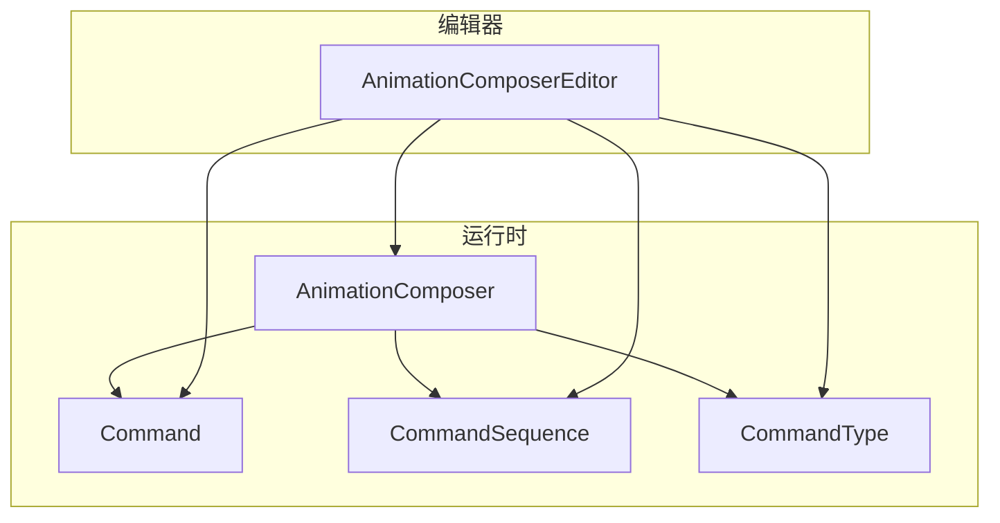
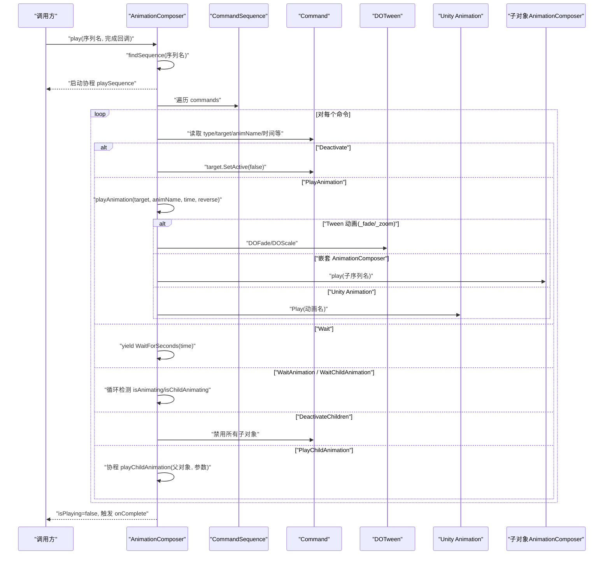
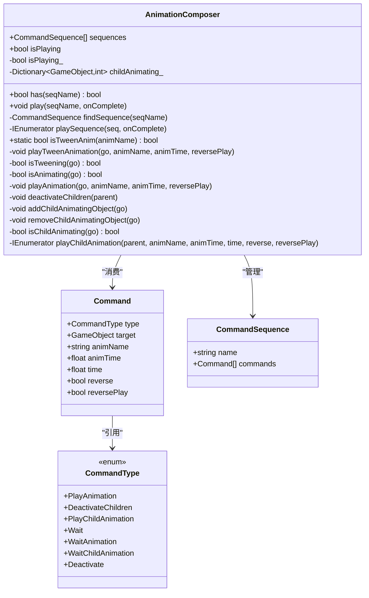
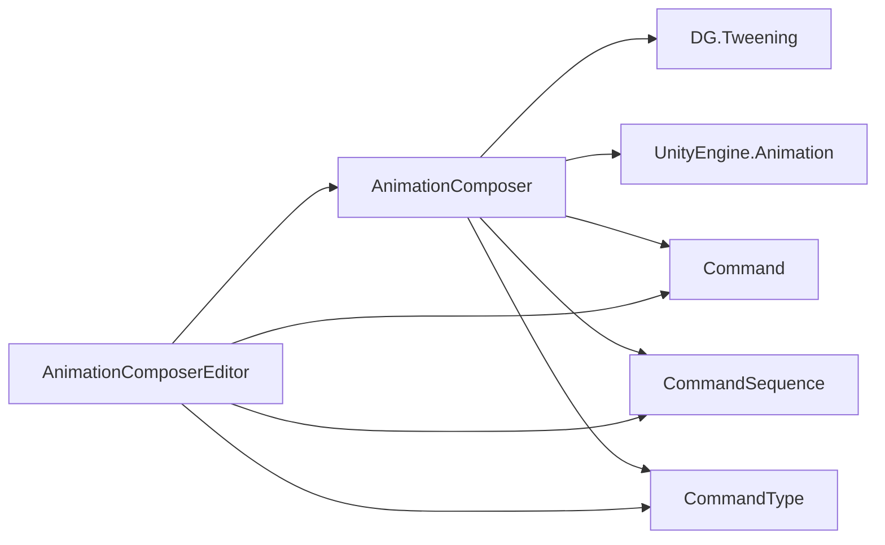

# AnimationComposer 动画编排器

<cite>
**本文引用的文件**   
- [AnimationComposer.cs](file://Assets/Game/Framework/AnimationComposer/AnimationComposer.cs)
- [Command.cs](file://Assets/Game/Framework/AnimationComposer/Command.cs)
- [CommandSequence.cs](file://Assets/Game/Framework/AnimationComposer/CommandSequence.cs)
- [CommandType.cs](file://Assets/Game/Framework/AnimationComposer/CommandType.cs)
- [AnimationComposerEditor.cs](file://Assets/Game/Framework/AnimationComposer/Editor/AnimationComposerEditor.cs)
</cite>

## 目录
1. [简介](#简介)
2. [项目结构](#项目结构)
3. [核心组件](#核心组件)
4. [架构总览](#架构总览)
5. [详细组件分析](#详细组件分析)
6. [依赖关系分析](#依赖关系分析)
7. [性能与优化建议](#性能与优化建议)
8. [调试与排错指南](#调试与排错指南)
9. [结论](#结论)
10. [附录：使用示例与最佳实践](#附录使用示例与最佳实践)

## 简介
AnimationComposer 是一个用于协同多个对象及其子对象的动画控制系统。它通过“命令（Command）”和“命令序列（CommandSequence）”将多种动画能力统一编排，支持 Unity 原生 Animation、DOTween 以及嵌套的 AnimationComposer 序列。其核心目标是在 UI 或角色等场景中，以声明式的方式组合复杂的入场、出场、等待与联动动画流程。

## 项目结构
AnimationComposer 模块位于 Framework 下，包含运行时逻辑与编辑器扩展两部分：
- 运行时
  - AnimationComposer：主控制器，负责查找并执行命令序列，协调 DOTween、Unity Animation 与子对象动画状态。
  - Command：单个动画控制命令的数据载体。
  - CommandSequence：命令集合，构成一个可命名的动画流程。
  - CommandType：命令类型枚举，定义支持的命令种类。
- 编辑器
  - AnimationComposerEditor：为 AnimationComposer 提供可视化编辑体验，包括序列与命令的增删改查。

图表来源
- [AnimationComposer.cs:1-316](file://Assets/Game/Framework/AnimationComposer/AnimationComposer.cs#L1-L316)
- [Command.cs:1-48](file://Assets/Game/Framework/AnimationComposer/Command.cs#L1-L48)
- [CommandSequence.cs:1-21](file://Assets/Game/Framework/AnimationComposer/CommandSequence.cs#L1-L21)
- [CommandType.cs:1-43](file://Assets/Game/Framework/AnimationComposer/CommandType.cs#L1-L43)
- [AnimationComposerEditor.cs:1-263](file://Assets/Game/Framework/AnimationComposer/Editor/AnimationComposerEditor.cs#L1-L263)

章节来源
- [AnimationComposer.cs:1-316](file://Assets/Game/Framework/AnimationComposer/AnimationComposer.cs#L1-L316)
- [Command.cs:1-48](file://Assets/Game/Framework/AnimationComposer/Command.cs#L1-L48)
- [CommandSequence.cs:1-21](file://Assets/Game/Framework/AnimationComposer/CommandSequence.cs#L1-L21)
- [CommandType.cs:1-43](file://Assets/Game/Framework/AnimationComposer/CommandType.cs#L1-L43)
- [AnimationComposerEditor.cs:1-263](file://Assets/Game/Framework/AnimationComposer/Editor/AnimationComposerEditor.cs#L1-L263)

## 核心组件
- AnimationComposer
  - 维护一组 CommandSequence，提供按名称播放的能力。
  - 内部协程驱动命令序列的执行，处理等待、停用、播放动画、子对象动画等。
  - 集成 DOTween 与 Unity Animation，并支持嵌套调用其他 AnimationComposer 的序列。
- Command
  - 描述一次动画操作的目标对象、动画名、时长、是否反播、是否反向遍历子对象等参数。
- CommandSequence
  - 命名化的命令列表，作为可被播放的完整动画流程。
- CommandType
  - 定义支持的命令类型，如 PlayAnimation、Wait、Deactivate、PlayChildAnimation、WaitAnimation、WaitChildAnimation、DeactivateChildren。

章节来源
- [AnimationComposer.cs:1-316](file://Assets/Game/Framework/AnimationComposer/AnimationComposer.cs#L1-L316)
- [Command.cs:1-48](file://Assets/Game/Framework/AnimationComposer/Command.cs#L1-L48)
- [CommandSequence.cs:1-21](file://Assets/Game/Framework/AnimationComposer/CommandSequence.cs#L1-L21)
- [CommandType.cs:1-43](file://Assets/Game/Framework/AnimationComposer/CommandType.cs#L1-L43)

## 架构总览
AnimationComposer 采用“命令驱动 + 协程调度”的架构：
- 外部通过 play(seqName, onComplete) 触发指定序列。
- 内部通过协程 playSequence 顺序执行每个命令，遇到需要异步等待的命令时挂起协程，直到条件满足再继续。
- 动画执行层根据命令类型分发到不同实现：DOTween、Unity Animation、嵌套 AnimationComposer 或子对象批量动画。

图表来源
- [AnimationComposer.cs:47-120](file://Assets/Game/Framework/AnimationComposer/AnimationComposer.cs#L47-L120)
- [AnimationComposer.cs:139-242](file://Assets/Game/Framework/AnimationComposer/AnimationComposer.cs#L139-L242)
- [AnimationComposer.cs:299-315](file://Assets/Game/Framework/AnimationComposer/AnimationComposer.cs#L299-L315)

## 详细组件分析

### 命令系统（Command 与 CommandType）
- Command 字段说明
  - type：命令类型，决定执行行为。
  - target：目标 GameObject。
  - animName：动画名称，对于 Tween 动画使用特殊名称（如 _fade、_zoom），对于 Unity Animation 则为动画片段名，对于嵌套 AnimationComposer 则为子序列名。
  - animTime：动画持续时间（仅对 Tween 有效）。
  - time：等待时长（对 Wait 命令有效）。
  - reverse：是否反向遍历子对象（对 PlayChildAnimation 有效）。
  - reversePlay：是否反播动画（对 PlayAnimation 与 PlayChildAnimation 有效）。
- CommandType 支持的命令
  - PlayAnimation：在目标对象上播放动画（支持 Tween、Unity Animation、嵌套序列）。
  - Deactivate：停用目标对象。
  - DeactivateChildren：停用目标对象的所有直接子对象。
  - PlayChildAnimation：对目标对象的所有子对象依次播放动画，支持间隔与反向遍历。
  - Wait：等待固定时长。
  - WaitAnimation：等待目标对象上的任意动画（含 Tween、Unity Animation、嵌套序列）结束。
  - WaitChildAnimation：等待目标对象的所有子对象动画结束。

章节来源
- [Command.cs:1-48](file://Assets/Game/Framework/AnimationComposer/Command.cs#L1-L48)
- [CommandType.cs:1-43](file://Assets/Game/Framework/AnimationComposer/CommandType.cs#L1-L43)

### 命令序列（CommandSequence）
- name：序列的名称，用于通过 play(seqName) 定位。
- commands：命令列表，顺序执行。

章节来源
- [CommandSequence.cs:1-21](file://Assets/Game/Framework/AnimationComposer/CommandSequence.cs#L1-L21)

### 动画编排器（AnimationComposer）
- 关键属性与方法
  - sequences：当前挂载对象上定义的命令序列集合。
  - has(seqName)：判断是否存在指定名称的序列。
  - isPlaying：当前是否正在播放序列。
  - play(seqName, onComplete)：按名称播放序列，若已在播放则记录错误日志。
  - findSequence(seqName)：在本地序列列表中查找对应序列。
  - playSequence(seq, onComplete)：协程驱动的核心执行逻辑。
  - isTweenAnim(animName)：判定是否为内置 Tween 动画名。
  - playAnimation(go, animName, animTime, reversePlay)：分派到具体动画后端。
  - deactivateChildren(parent)：禁用所有直接子对象。
  - addChildAnimatingObject/removeChildAnimatingObject/isChildAnimating：跟踪子对象动画状态，供 WaitChildAnimation 使用。
  - playChildAnimation(parent, animName, animTime, time, reverse, reversePlay)：协程逐个播放子对象动画，支持间隔与反向遍历。

- 与 DOTween 的集成
  - 当 animName 为 _fade 时，确保目标有 CanvasGroup，设置初始透明度后调用 DOFade。
  - 当 animName 为 _zoom 时，设置初始缩放后调用 DOScale。
  - 通过 isTweening 检测 CanvasGroup 或 Transform 是否有活跃 Tween。

- 与 Unity Animation 的集成
  - 若无 Tween 且无嵌套 AnimationComposer，则尝试在目标对象上获取 Animation 组件并播放指定动画片段。
  - 支持 reversePlay 通过设置 speed 与 time 实现倒放。

- 与嵌套 AnimationComposer 的集成
  - 若目标对象上有另一个 AnimationComposer，则递归调用其 play 方法播放子序列。

- 状态管理与错误处理
  - isPlaying_ 标记全局播放状态，防止重入。
  - childAnimating_ 字典维护父对象与其子对象动画引用计数，配合 isChildAnimating 进行精确等待。
  - 对缺失组件或找不到动画的情况输出错误日志。

图表来源
- [AnimationComposer.cs:1-316](file://Assets/Game/Framework/AnimationComposer/AnimationComposer.cs#L1-L316)
- [Command.cs:1-48](file://Assets/Game/Framework/AnimationComposer/Command.cs#L1-L48)
- [CommandSequence.cs:1-21](file://Assets/Game/Framework/AnimationComposer/CommandSequence.cs#L1-L21)
- [CommandType.cs:1-43](file://Assets/Game/Framework/AnimationComposer/CommandType.cs#L1-L43)

章节来源
- [AnimationComposer.cs:1-316](file://Assets/Game/Framework/AnimationComposer/AnimationComposer.cs#L1-L316)

### 编辑器扩展（AnimationComposerEditor）
- 功能概览
  - 在 Inspector 中展示所有序列，支持新增序列。
  - 使用 ReorderableList 管理命令列表，支持增删、拖拽排序。
  - 针对不同命令类型动态绘制字段（目标对象、动画名、时长、反播开关、反向遍历开关等）。
  - 自动记录 Undo 并标记对象脏状态。

- 交互要点
  - 对 PlayAnimation 与 PlayChildAnimation，当 animName 为 _fade/_zoom 时显示 animTime 字段。
  - PlayChildAnimation 额外显示 time（子对象间间隔）、reverse（反向遍历）、reversePlay（反播）。

章节来源
- [AnimationComposerEditor.cs:1-263](file://Assets/Game/Framework/AnimationComposer/Editor/AnimationComposerEditor.cs#L1-L263)

## 依赖关系分析
- 外部依赖
  - DG.Tweening：用于 _fade/_zoom 动画的实现与 IsTweening 检测。
  - UnityEngine.Animation：用于传统 Animation 片段的播放与状态检测。
- 内部耦合
  - AnimationComposer 强依赖 Command、CommandSequence、CommandType 数据结构。
  - 编辑器扩展依赖运行时类以提供可视化配置。

图表来源
- [AnimationComposer.cs:1-316](file://Assets/Game/Framework/AnimationComposer/AnimationComposer.cs#L1-L316)
- [AnimationComposerEditor.cs:1-263](file://Assets/Game/Framework/AnimationComposer/Editor/AnimationComposerEditor.cs#L1-L263)

章节来源
- [AnimationComposer.cs:1-316](file://Assets/Game/Framework/AnimationComposer/AnimationComposer.cs#L1-L316)
- [AnimationComposerEditor.cs:1-263](file://Assets/Game/Framework/AnimationComposer/Editor/AnimationComposerEditor.cs#L1-L263)

## 性能与优化建议
- 避免重复创建 Tween
  - 同一对象频繁播放相同 Tween 动画时，注意复用或提前初始化相关组件（如 CanvasGroup），减少每帧分配。
- 合理使用 WaitAnimation/WaitChildAnimation
  - 这些命令会逐帧轮询动画状态，建议在复杂场景中使用更明确的等待策略（如基于事件或回调）以降低空转开销。
- 子对象动画批量化
  - PlayChildAnimation 会逐个播放子对象动画，若子对象数量较大，考虑合并动画或使用 DOTween 的并行能力以减少帧延迟。
- 避免嵌套过深
  - 嵌套 AnimationComposer 会增加协程栈深度与状态追踪成本，建议扁平化设计或在必要时拆分序列。
- 组件存在性检查
  - 在大量对象上使用 AnimationComposer 前，确保目标对象具备所需组件（CanvasGroup、Animation 等），避免运行时错误分支带来的额外开销。

[本节为通用指导，不直接分析具体文件]

## 调试与排错指南
- 常见问题
  - 未找到序列：play 时若序列不存在会输出错误日志，请确认序列名称一致。
  - 目标对象缺少组件：播放 Unity Animation 时若目标没有 Animation 组件，会输出错误日志；播放 _fade 时需 CanvasGroup。
  - 动画名无效：不支持的 Tween 动画名将报错，请使用 _fade/_zoom。
  - 并发播放冲突：isPlaying 为真时再次播放会记录错误日志，应避免重入。
- 调试技巧
  - 在编辑器中利用 AnimationComposerEditor 快速验证命令参数与顺序。
  - 使用 isPlaying 与日志输出定位播放状态。
  - 对 WaitAnimation/WaitChildAnimation 的等待行为，可通过临时改为 Wait 来隔离问题。

章节来源
- [AnimationComposer.cs:47-120](file://Assets/Game/Framework/AnimationComposer/AnimationComposer.cs#L47-L120)
- [AnimationComposer.cs:139-242](file://Assets/Game/Framework/AnimationComposer/AnimationComposer.cs#L139-L242)

## 结论
AnimationComposer 通过命令与序列的组合，提供了统一的动画编排能力，兼容 DOTween 与 Unity Animation，并支持嵌套与子对象批量动画。其协程驱动的调度方式简洁直观，适合 UI 与简单角色动画的快速构建。在生产环境中，建议结合性能优化与调试手段，合理组织序列与命令，以获得稳定高效的动画表现。

[本节为总结性内容，不直接分析具体文件]

## 附录：使用示例与最佳实践

- 创建与播放序列
  - 在编辑器中添加序列，并为序列添加命令（如 PlayAnimation、Wait、Deactivate 等）。
  - 在代码中通过 play(seqName, onComplete) 触发播放，并在 onComplete 中处理后续逻辑。

- 典型命令组合
  - 入场动画：先 Deactivate 目标，再 PlayAnimation(_fade/_zoom)，最后 WaitAnimation 等待完成。
  - 子对象联动：使用 PlayChildAnimation 对子对象依次播放动画，设置 time 控制节奏，reverse 控制遍历方向。
  - 退出动画：DeactivateChildren 清理子对象，再 Deactivate 目标对象。

- 与 DOTween 集成要点
  - 使用 _fade/_zoom 作为 animName，并确保目标对象具备相应组件（CanvasGroup 用于 _fade）。
  - 通过 reversePlay 控制淡入/淡出或放大/缩小的方向。

- 与 Unity Animation 集成要点
  - 在目标对象上准备 Animation 组件与动画片段，animName 指向片段名。
  - 使用 reversePlay 实现倒放，注意设置初始 time 与 speed。

- 嵌套序列
  - 将复杂流程拆分为多个子序列，通过 PlayAnimation 调用子序列名，提升可维护性与复用性。

- 最佳实践
  - 保持序列命名清晰，便于查找与维护。
  - 谨慎使用 WaitAnimation/WaitChildAnimation，必要时改用显式等待或事件机制。
  - 在编辑器中充分利用 AnimationComposerEditor 的可视化能力，快速迭代与验证。

[本节为概念性指导，不直接分析具体文件]