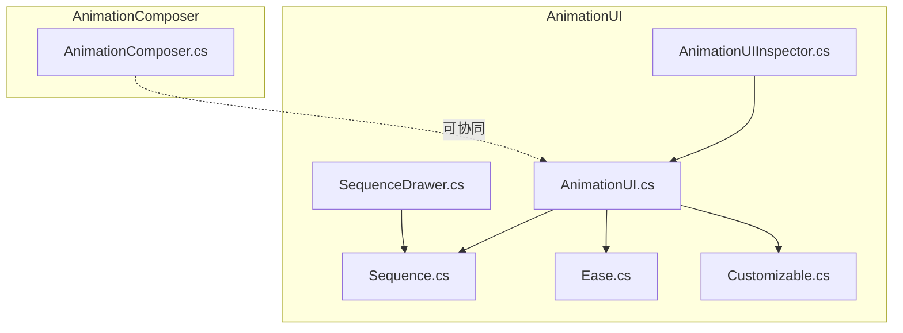
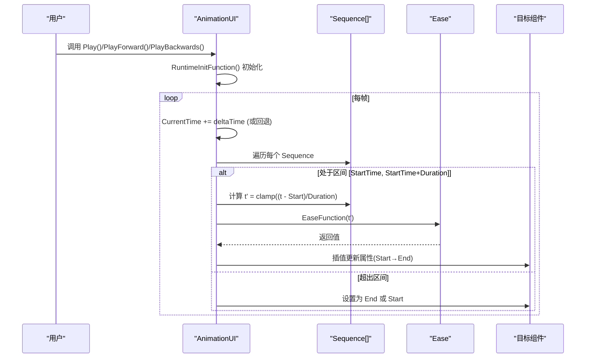
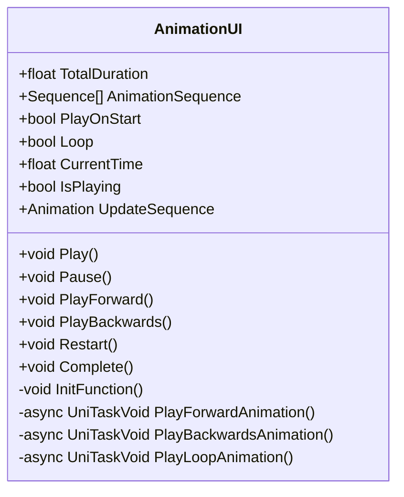
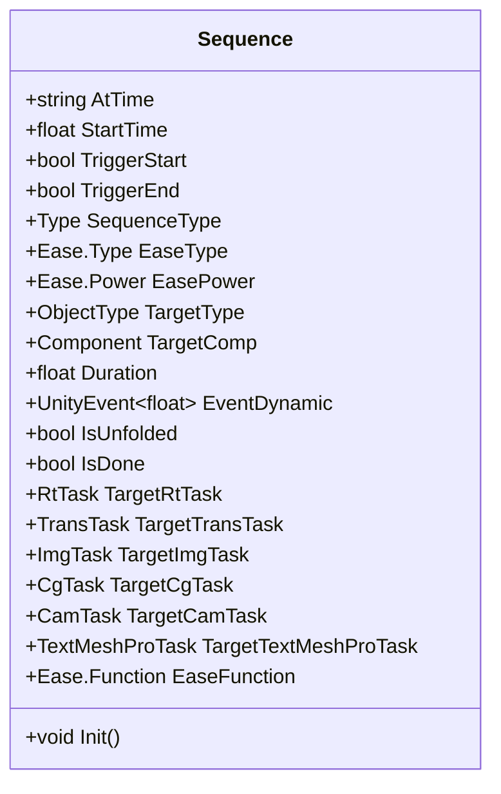
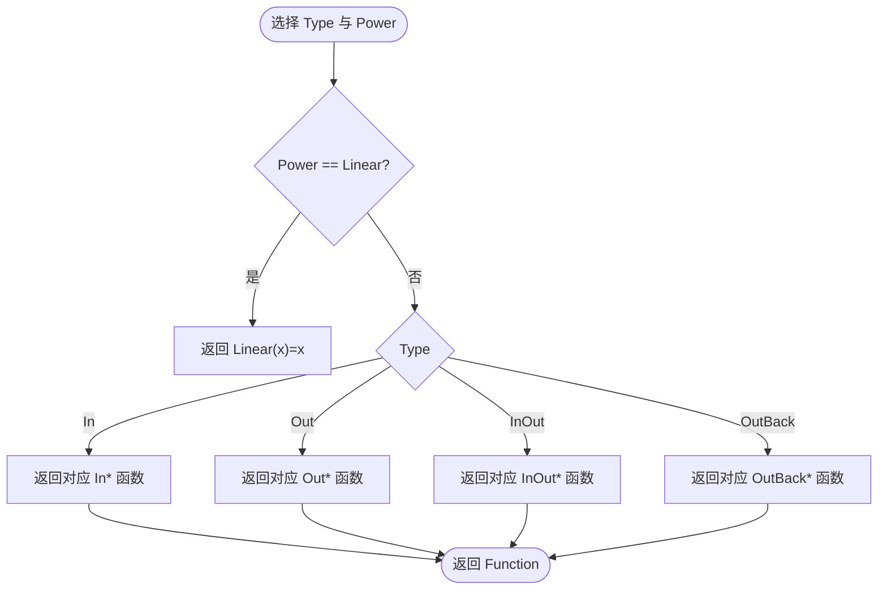
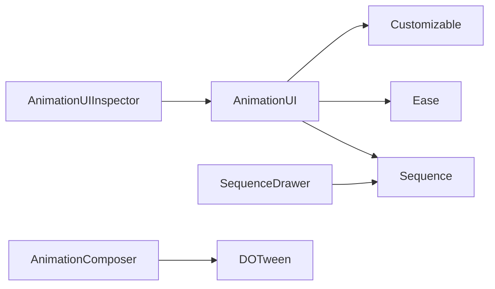

# AnimationUI 动画界面系统

<cite>
**本文引用的文件**   
- [AnimationUI.cs](file://Assets/Game/Framework/AnimationUI/Script/AnimationUI.cs)
- [Sequence.cs](file://Assets/Game/Framework/AnimationUI/Script/Sequence.cs)
- [Ease.cs](file://Assets/Game/Framework/AnimationUI/Script/Ease.cs)
- [Customizable.cs](file://Assets/Game/Framework/AnimationUI/Script/Customizable.cs)
- [AnimationUIInspector.cs](file://Assets/Game/Framework/AnimationUI/Editor/AnimationUIInspector.cs)
- [SequenceDrawer.cs](file://Assets/Game/Framework/AnimationUI/Editor/SequenceDrawer.cs)
- [AnimationComposer.cs](file://Assets/Game/Framework/AnimationComposer/AnimationComposer.cs)
</cite>

## 目录
1. [简介](#简介)
2. [项目结构](#项目结构)
3. [核心组件](#核心组件)
4. [架构总览](#架构总览)
5. [详细组件分析](#详细组件分析)
6. [依赖关系分析](#依赖关系分析)
7. [性能与优化建议](#性能与优化建议)
8. [故障排查指南](#故障排查指南)
9. [结论](#结论)
10. [附录：编辑器扩展与自定义开发指南](#附录编辑器扩展与自定义开发指南)

## 简介
本技术文档围绕 AnimationUI 动画界面系统，系统性阐述其设计理念、运行时机制与编辑器可视化能力。重点包括：
- AnimationUI 组件如何驱动 Sequence 序列在时间轴上推进，并应用 Ease 缓动函数更新目标属性
- Sequence 的数据结构与状态机，支持多种目标类型（RectTransform、Transform、Image、CanvasGroup、Camera、TextMeshPro、UnityEvent）
- Ease 缓动系统的实现与曲线选择
- Customizable 接口的设计模式与可扩展点
- 与 AnimationComposer 的协作关系与数据传递方式
- 编辑器扩展的使用方法与自定义动画效果的开发指南

## 项目结构
AnimationUI 位于 Framework 模块下，包含运行时脚本与编辑器扩展；AnimationComposer 为独立的动画编排器，用于组合多个对象或子对象的动画。

图表来源
- [AnimationUI.cs:1-1351](file://Assets/Game/Framework/AnimationUI/Script/AnimationUI.cs#L1-L1351)
- [Sequence.cs:1-275](file://Assets/Game/Framework/AnimationUI/Script/Sequence.cs#L1-L275)
- [Ease.cs:1-124](file://Assets/Game/Framework/AnimationUI/Script/Ease.cs#L1-L124)
- [Customizable.cs:1-25](file://Assets/Game/Framework/AnimationUI/Script/Customizable.cs#L1-L25)
- [AnimationUIInspector.cs:1-334](file://Assets/Game/Framework/AnimationUI/Editor/AnimationUIInspector.cs#L1-L334)
- [SequenceDrawer.cs:1-631](file://Assets/Game/Framework/AnimationUI/Editor/SequenceDrawer.cs#L1-L631)
- [AnimationComposer.cs:1-316](file://Assets/Game/Framework/AnimationComposer/AnimationComposer.cs#L1-L316)

章节来源
- [AnimationUI.cs:1-1351](file://Assets/Game/Framework/AnimationUI/Script/AnimationUI.cs#L1-L1351)
- [Sequence.cs:1-275](file://Assets/Game/Framework/AnimationUI/Script/Sequence.cs#L1-L275)
- [Ease.cs:1-124](file://Assets/Game/Framework/AnimationUI/Script/Ease.cs#L1-L124)
- [Customizable.cs:1-25](file://Assets/Game/Framework/AnimationUI/Script/Customizable.cs#L1-L25)
- [AnimationUIInspector.cs:1-334](file://Assets/Game/Framework/AnimationUI/Editor/AnimationUIInspector.cs#L1-L334)
- [SequenceDrawer.cs:1-631](file://Assets/Game/Framework/AnimationUI/Editor/SequenceDrawer.cs#L1-L631)
- [AnimationComposer.cs:1-316](file://Assets/Game/Framework/AnimationComposer/AnimationComposer.cs#L1-L316)

## 核心组件
- AnimationUI：运行时动画控制器，维护时间轴、播放状态、事件回调，并在每帧调用 UpdateSequence 委托以驱动各 Sequence 的属性更新。
- Sequence：描述单个动画片段的数据容器，包含起始时间、时长、目标类型、任务标志位、起止值、缓动函数等。
- Ease：提供多种缓动曲线（In/Out/InOut/OutBack）与幂次（Linear/Quad/Cubic/Quart/Quint），并通过工厂方法返回对应函数。
- Customizable：静态扩展点，用于接入输入开关、音效播放等系统。
- 编辑器扩展：AnimationUIInspector 与 SequenceDrawer 提供可视化编辑、预览、进度条控制与属性面板绘制。
- AnimationComposer：独立于 AnimationUI 的动画编排器，通过命令序列协调多对象动画，可与 AnimationUI 配合使用。

章节来源
- [AnimationUI.cs:1-1351](file://Assets/Game/Framework/AnimationUI/Script/AnimationUI.cs#L1-L1351)
- [Sequence.cs:1-275](file://Assets/Game/Framework/AnimationUI/Script/Sequence.cs#L1-L275)
- [Ease.cs:1-124](file://Assets/Game/Framework/AnimationUI/Script/Ease.cs#L1-L124)
- [Customizable.cs:1-25](file://Assets/Game/Framework/AnimationUI/Script/Customizable.cs#L1-L25)
- [AnimationUIInspector.cs:1-334](file://Assets/Game/Framework/AnimationUI/Editor/AnimationUIInspector.cs#L1-L334)
- [SequenceDrawer.cs:1-631](file://Assets/Game/Framework/AnimationUI/Editor/SequenceDrawer.cs#L1-L631)
- [AnimationComposer.cs:1-316](file://Assets/Game/Framework/AnimationComposer/AnimationComposer.cs#L1-L316)

## 架构总览
AnimationUI 采用“时间驱动 + 委托聚合”的架构：
- 启动时初始化所有 Sequence，构建 UpdateSequence 委托链
- 播放时按当前时间 t 遍历委托链，根据每个 Sequence 的 StartTime 与 Duration 计算归一化时间，应用 Ease 函数插值更新目标属性
- 支持正向、反向、循环播放，以及完成态设置
- 编辑器中通过 Inspector 与 PropertyDrawer 提供可视化编辑与实时预览

图表来源
- [AnimationUI.cs:165-236](file://Assets/Game/Framework/AnimationUI/Script/AnimationUI.cs#L165-L236)
- [AnimationUI.cs:538-1216](file://Assets/Game/Framework/AnimationUI/Script/AnimationUI.cs#L538-L1216)
- [Sequence.cs:267-270](file://Assets/Game/Framework/AnimationUI/Script/Sequence.cs#L267-L270)
- [Ease.cs:84-122](file://Assets/Game/Framework/AnimationUI/Script/Ease.cs#L84-L122)

## 详细组件分析

### AnimationUI 组件
- 职责
  - 管理播放状态（正向、反向、循环、暂停）
  - 维护时间轴（CurrentTime、TotalDuration）
  - 初始化阶段构建 UpdateSequence 委托链，将各 Sequence 的更新逻辑注册到统一入口
  - 每帧推进时间并调用 UpdateSequence，驱动属性更新
  - 提供事件钩子（AtTime、AtEnd）
- 关键流程
  - InitFunction：遍历 AnimationSequence，根据 SequenceType 与 TargetType 生成对应的更新闭包并追加到 UpdateSequence
  - PlayForwardAnimation / PlayBackwardsAnimation / PlayLoopAnimation：分别处理正向、反向、循环的时间推进与边界处理
  - Complete：直接跳转到 TotalDuration，并按逆序执行已注册的更新回调以得到最终状态
- 运行时任务
  - 内置大量协程任务（TaskAnchoredPosition、TaskLocalScale 等），可用于一次性过渡动画（非主时间轴驱动）

图表来源
- [AnimationUI.cs:14-1351](file://Assets/Game/Framework/AnimationUI/Script/AnimationUI.cs#L14-L1351)

章节来源
- [AnimationUI.cs:14-1351](file://Assets/Game/Framework/AnimationUI/Script/AnimationUI.cs#L14-L1351)

### Sequence 数据结构与工作机制
- 字段与枚举
  - Type：Animation、Wait、SetActiveAllInput、SetActive、SFX、LoadScene、UnityEvent
  - ObjectType：Automatic、RectTransform、Transform、Image、CanvasGroup、Camera、TextMeshPro、UnityEventDynamic
  - 针对每种目标类型的任务标志位（RtTask、TransTask、ImgTask、CgTask、CamTask、TextMeshProTask）
  - 起止值与状态（Before/During/After）
  - EaseType、EasePower、EaseFunction
- 运行机制
  - Init：根据 EaseType 与 EasePower 获取具体缓动函数
  - 在 AnimationUI.InitFunction 中，根据 TargetType 与 Task 标志位动态绑定更新闭包
  - 每帧根据当前时间判断是否处于动画区间，进行插值或边界赋值

图表来源
- [Sequence.cs:8-275](file://Assets/Game/Framework/AnimationUI/Script/Sequence.cs#L8-L275)

章节来源
- [Sequence.cs:8-275](file://Assets/Game/Framework/AnimationUI/Script/Sequence.cs#L8-L275)

### Ease 缓动系统
- 设计要点
  - 提供 In、Out、InOut、OutBack 四类形态
  - 提供 Linear、Quad、Cubic、Quart、Quint 五种幂次
  - GetEase(Type, Power) 工厂方法返回对应 Function(float x)
- 数学原理与视觉效果
  - In：加速进入，适合强调起始冲击
  - Out：减速退出，适合自然收尾
  - InOut：先加速后减速，整体平滑
  - OutBack：轻微过冲再回弹，增加弹性感
  - 幂次越高，曲线越陡峭，变化更剧烈

图表来源
- [Ease.cs:5-122](file://Assets/Game/Framework/AnimationUI/Script/Ease.cs#L5-L122)

章节来源
- [Ease.cs:5-122](file://Assets/Game/Framework/AnimationUI/Script/Ease.cs#L5-L122)

### Customizable 接口设计模式
- 目的
  - 将外部系统（如输入管理器、音效系统）解耦，便于替换实现
- 扩展点
  - SetActiveAllInput(bool)：切换全局输入激活状态
  - PlaySound(AudioClip) / PlaySound(int)：按资源文件或索引播放音效
- 使用方式
  - 在 Sequence 的 SetActiveAllInput 与 SFX 类型中，运行时调用这些静态方法
  - 开发者可在项目中重写这些方法以接入实际系统

章节来源
- [Customizable.cs:1-25](file://Assets/Game/Framework/AnimationUI/Script/Customizable.cs#L1-L25)
- [AnimationUI.cs:1094-1116](file://Assets/Game/Framework/AnimationUI/Script/AnimationUI.cs#L1094-L1116)
- [AnimationUI.cs:1145-1190](file://Assets/Game/Framework/AnimationUI/Script/AnimationUI.cs#L1145-L1190)

### 与 AnimationComposer 的协作关系
- 角色定位
  - AnimationUI：基于时间轴的 UI 动画编排，适合精细控制 UI 属性与事件
  - AnimationComposer：基于命令序列的组合动画，擅长协调多对象与子对象动画，支持 DOTween 与 Unity Animation
- 协作方式
  - 可在同一场景中同时使用两者：例如用 AnimationComposer 控制窗口出现（淡入/缩放），再用 AnimationUI 控制内部 UI 元素的入场动画
  - 数据传递：无强耦合，可通过事件或共享状态（如布尔标志、单例）协调两个系统的时序

章节来源
- [AnimationComposer.cs:1-316](file://Assets/Game/Framework/AnimationComposer/AnimationComposer.cs#L1-L316)
- [AnimationUI.cs:14-1351](file://Assets/Game/Framework/AnimationUI/Script/AnimationUI.cs#L14-L1351)

## 依赖关系分析
- 运行时依赖
  - AnimationUI 依赖 Sequence 与 Ease
  - Sequence 依赖 UnityEngine 基础类型与 UnityEvents
  - Customizable 为纯静态扩展点，不引入额外依赖
- 编辑器依赖
  - AnimationUIInspector 依赖 UnityEditor 与 TMPro
  - SequenceDrawer 依赖 UnityEditor 与 UI/TMP 组件以读取属性
- 外部库
  - AnimationUI 使用 Cysharp.Threading.Tasks（UniTask）进行异步帧等待
  - AnimationComposer 使用 DG.Tweening（DOTween）

图表来源
- [AnimationUI.cs:1-1351](file://Assets/Game/Framework/AnimationUI/Script/AnimationUI.cs#L1-L1351)
- [Sequence.cs:1-275](file://Assets/Game/Framework/AnimationUI/Script/Sequence.cs#L1-L275)
- [Ease.cs:1-124](file://Assets/Game/Framework/AnimationUI/Script/Ease.cs#L1-L124)
- [Customizable.cs:1-25](file://Assets/Game/Framework/AnimationUI/Script/Customizable.cs#L1-L25)
- [AnimationUIInspector.cs:1-334](file://Assets/Game/Framework/AnimationUI/Editor/AnimationUIInspector.cs#L1-L334)
- [SequenceDrawer.cs:1-631](file://Assets/Game/Framework/AnimationUI/Editor/SequenceDrawer.cs#L1-L631)
- [AnimationComposer.cs:1-316](file://Assets/Game/Framework/AnimationComposer/AnimationComposer.cs#L1-L316)

章节来源
- [AnimationUI.cs:1-1351](file://Assets/Game/Framework/AnimationUI/Script/AnimationUI.cs#L1-L1351)
- [Sequence.cs:1-275](file://Assets/Game/Framework/AnimationUI/Script/Sequence.cs#L1-L275)
- [Ease.cs:1-124](file://Assets/Game/Framework/AnimationUI/Script/Ease.cs#L1-L124)
- [Customizable.cs:1-25](file://Assets/Game/Framework/AnimationUI/Script/Customizable.cs#L1-L25)
- [AnimationUIInspector.cs:1-334](file://Assets/Game/Framework/AnimationUI/Editor/AnimationUIInspector.cs#L1-L334)
- [SequenceDrawer.cs:1-631](file://Assets/Game/Framework/AnimationUI/Editor/SequenceDrawer.cs#L1-L631)
- [AnimationComposer.cs:1-316](file://Assets/Game/Framework/AnimationComposer/AnimationComposer.cs#L1-L316)

## 性能与优化建议
- 委托链开销
  - UpdateSequence 为委托聚合，频繁调用可能带来一定开销。建议：
    - 合并相近属性的动画，减少 Sequence 数量
    - 避免在高频路径中进行反射或装箱操作
- 插值与缓动
  - 使用 LerpUnclamped 与 Clamp01 保证数值稳定，但注意浮点误差累积
  - 高幂次缓动（Quint）在极端情况下可能导致数值波动，需结合业务场景权衡
- 协程任务
  - 内置 Task* 协程适用于一次性过渡，但不参与主时间轴。若大量并发，注意协程池与生命周期管理
- 编辑器预览
  - EditorUpdate 在非运行模式下强制重绘，建议在复杂场景下谨慎使用，避免卡顿

[本节为通用指导，无需特定文件引用]

## 故障排查指南
- 常见问题
  - 未分配目标组件：当 TargetComp 为空时，相关属性无法更新，需在 Inspector 中正确赋值
  - 目标类型不匹配：如指定 RectTransform 但对象不含该组件，会导致无效更新
  - 时间轴异常：TotalDuration 计算错误可能导致播放不完整，检查 Sequence 的 Duration 与 Wait 类型
  - 音效未播放：确认 Customizable.PlaySound 已接入实际系统
- 调试手段
  - 使用编辑器中的进度条与 Preview 按钮逐步定位问题
  - 在 Sequence 的 AtTime 标签中查看目标名称与类型，快速识别配置错误

章节来源
- [AnimationUIInspector.cs:128-316](file://Assets/Game/Framework/AnimationUI/Editor/AnimationUIInspector.cs#L128-L316)
- [SequenceDrawer.cs:130-631](file://Assets/Game/Framework/AnimationUI/Editor/SequenceDrawer.cs#L130-L631)
- [AnimationUI.cs:1094-1190](file://Assets/Game/Framework/AnimationUI/Script/AnimationUI.cs#L1094-L1190)

## 结论
AnimationUI 提供了轻量、直观且强大的 UI 动画解决方案，通过 Sequence 与 Ease 的组合，能够灵活表达复杂的 UI 动效。配合编辑器扩展，开发者可以在 Inspector 中高效配置与预览。Customizable 的解耦设计使得系统易于集成到现有工程中。与 AnimationComposer 的互补使用，可以覆盖从简单 UI 动效到复杂多对象动画的全场景需求。

[本节为总结性内容，无需特定文件引用]

## 附录：编辑器扩展与自定义开发指南

### 编辑器使用方法
- 添加 AnimationUI 组件后，在 Inspector 中：
  - 点击 “Preview Animation” 进行完整预览
  - 拖动进度条或使用 “Preview Start/End” 快速跳转
  - 勾选 “PlayOnStart” 与 “Loop” 控制自动播放与循环
- 在 Sequence 列表中：
  - 选择 Type 与 TargetType，配置起止值与缓动
  - 使用 “Set Start/Set End” 快捷按钮从当前组件状态复制起止值
  - 使用 “Start/End” 按钮触发局部预览

章节来源
- [AnimationUIInspector.cs:21-116](file://Assets/Game/Framework/AnimationUI/Editor/AnimationUIInspector.cs#L21-L116)
- [SequenceDrawer.cs:130-631](file://Assets/Game/Framework/AnimationUI/Editor/SequenceDrawer.cs#L130-L631)

### 自定义动画效果开发指南
- 新增目标类型
  - 在 Sequence.ObjectType 中添加新类型
  - 在 Sequence 中新增对应任务标志位与起止值字段
  - 在 AnimationUI.InitFunction 中为新类型编写更新闭包并注册到 UpdateSequence
- 新增缓动曲线
  - 在 Ease 中实现新的数学函数，并在 GetEase 中注册
- 接入外部系统
  - 在 Customizable 中实现 SetActiveAllInput 与 PlaySound 的具体逻辑
- 示例流程（概念说明）
  - 定义新属性（如 TextMeshPro.fontSize）
  - 在 Sequence 中新增 SizeDelta 类似的字段与状态
  - 在 AnimationUI 中新增对应插值逻辑
  - 在 SequenceDrawer 中新增绘制与“Set Start/Set End”按钮
  - 在 AnimationUIInspector 中更新 AtTime 标签显示

章节来源
- [Sequence.cs:8-275](file://Assets/Game/Framework/AnimationUI/Script/Sequence.cs#L8-L275)
- [AnimationUI.cs:538-1216](file://Assets/Game/Framework/AnimationUI/Script/AnimationUI.cs#L538-L1216)
- [Ease.cs:84-122](file://Assets/Game/Framework/AnimationUI/Script/Ease.cs#L84-L122)
- [Customizable.cs:1-25](file://Assets/Game/Framework/AnimationUI/Script/Customizable.cs#L1-L25)
- [SequenceDrawer.cs:130-631](file://Assets/Game/Framework/AnimationUI/Editor/SequenceDrawer.cs#L130-L631)
- [AnimationUIInspector.cs:128-316](file://Assets/Game/Framework/AnimationUI/Editor/AnimationUIInspector.cs#L128-L316)