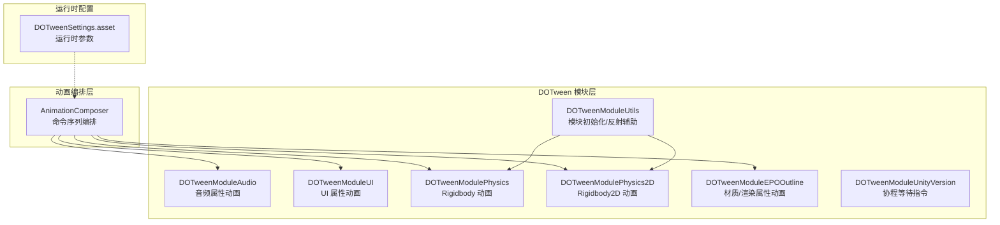
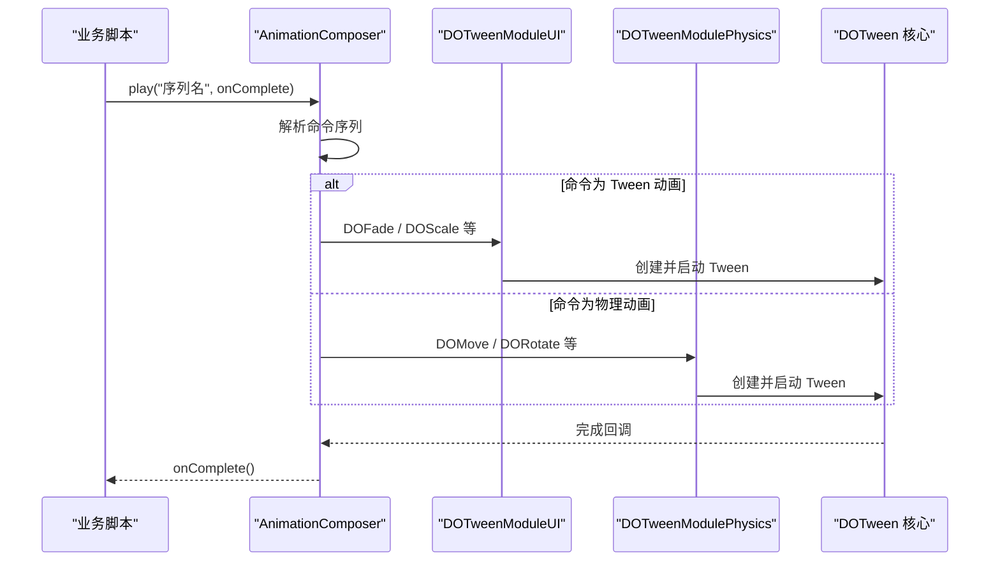
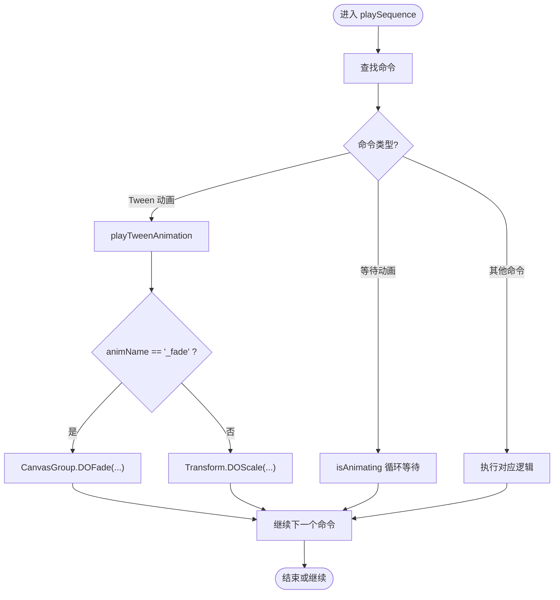
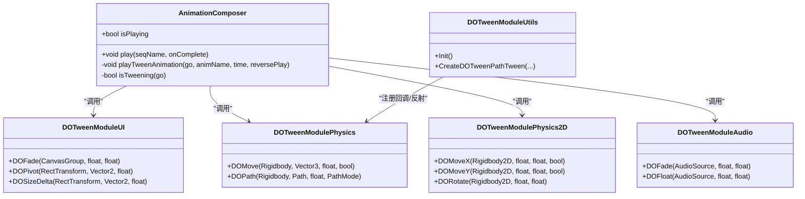

# DOTween Pro 动画库集成

<cite>
**本文引用的文件**   
- [AnimationComposer.cs](file://Assets/Game/Framework/AnimationComposer/AnimationComposer.cs)
- [DOTweenModuleAudio.cs](file://Assets/Game/Framework/DoTween/DOTween/Modules/DOTweenModuleAudio.cs)
- [DOTweenModuleUI.cs](file://Assets/Game/Framework/DoTween/DOTween/Modules/DOTweenModuleUI.cs)
- [DOTweenModulePhysics.cs](file://Assets/Game/Framework/DoTween/DOTween/Modules/DOTweenModulePhysics.cs)
- [DOTweenModulePhysics2D.cs](file://Assets/Game/Framework/DoTween/DOTween/Modules/DOTweenModulePhysics2D.cs)
- [DOTweenModuleEPOOutline.cs](file://Assets/Game/Framework/DoTween/DOTween/Modules/DOTweenModuleEPOOutline.cs)
- [DOTweenModuleUtils.cs](file://Assets/Game/Framework/DoTween/DOTween/Modules/DOTweenModuleUtils.cs)
- [DOTweenModuleUnityVersion.cs](file://Assets/Game/Framework/DoTween/DOTween/Modules/DOTweenModuleUnityVersion.cs)
- [DOTween.XML](file://Assets/Game/Framework/DoTween/DOTween/DOTween.XML)
- [readme_DOTweenPro.txt](file://Assets/Game/Framework/DoTween/readme_DOTweenPro.txt)
- [DOTweenSettings.asset](file://Assets/Game/Resources/DOTweenSettings.asset)
</cite>

## 目录
1. [简介](#简介)
2. [项目结构](#项目结构)
3. [核心组件](#核心组件)
4. [架构总览](#架构总览)
5. [详细组件分析](#详细组件分析)
6. [依赖关系分析](#依赖关系分析)
7. [性能考虑](#性能考虑)
8. [故障排查指南](#故障排查指南)
9. [结论](#结论)
10. [附录](#附录)

## 简介
本技术文档面向在 SimulationClient 中集成与使用 DOTween Pro 的开发者，系统阐述以下主题：
- DOTween 的核心概念与 API 设计：Tween 对象的创建、管理与生命周期控制
- 模块能力与用法：音频动画（DOTweenModuleAudio）、UI 元素动画（DOTweenModuleUI）、物理动画（DOTweenModulePhysics / Physics2D）等
- 性能优化机制：对象池复用、内存管理与 GC 优化策略
- 与 AnimationComposer 的集成方式：如何将 DOTween 动画嵌入到动画序列中
- 常见动画效果的代码示例路径：位置移动、缩放旋转、透明度变化等
- 调试工具与性能监控最佳实践
- 配置选项与高级特性使用方法

## 项目结构
本项目将 DOTween Pro 以模块化方式引入，并通过 AnimationComposer 统一编排多对象动画。关键目录与职责如下：
- Assets/Game/Framework/DoTween/DOTween/Modules：各功能模块扩展（Audio/UI/Physics/EPO Outline 等）
- Assets/Game/Framework/AnimationComposer：动画编排器，支持命令序列与子对象动画协同
- Assets/Game/Resources/DOTweenSettings.asset：运行时 DOTween 设置资源

图表来源
- [AnimationComposer.cs:1-316](file://Assets/Game/Framework/AnimationComposer/AnimationComposer.cs#L1-L316)
- [DOTweenModuleAudio.cs:1-30](file://Assets/Game/Framework/DoTween/DOTween/Modules/DOTweenModuleAudio.cs#L1-L30)
- [DOTweenModuleUI.cs:1-38](file://Assets/Game/Framework/DoTween/DOTween/Modules/DOTweenModuleUI.cs#L1-L38)
- [DOTweenModulePhysics.cs:1-31](file://Assets/Game/Framework/DoTween/DOTween/Modules/DOTweenModulePhysics.cs#L1-L31)
- [DOTweenModulePhysics2D.cs:43-64](file://Assets/Game/Framework/DoTween/DOTween/Modules/DOTweenModulePhysics2D.cs#L43-L64)
- [DOTweenModuleEPOOutline.cs:33-83](file://Assets/Game/Framework/DoTween/DOTween/Modules/DOTweenModuleEPOOutline.cs#L33-L83)
- [DOTweenModuleUtils.cs:1-52](file://Assets/Game/Framework/DoTween/DOTween/Modules/DOTweenModuleUtils.cs#L1-L52)
- [DOTweenModuleUnityVersion.cs:311-347](file://Assets/Game/Framework/DoTween/DOTween/Modules/DOTweenModuleUnityVersion.cs#L311-L347)
- [DOTweenSettings.asset](file://Assets/Game/Resources/DOTweenSettings.asset)

章节来源
- [AnimationComposer.cs:1-316](file://Assets/Game/Framework/AnimationComposer/AnimationComposer.cs#L1-L316)
- [DOTweenModuleAudio.cs:1-30](file://Assets/Game/Framework/DoTween/DOTween/Modules/DOTweenModuleAudio.cs#L1-L30)
- [DOTweenModuleUI.cs:1-38](file://Assets/Game/Framework/DoTween/DOTween/Modules/DOTweenModuleUI.cs#L1-L38)
- [DOTweenModulePhysics.cs:1-31](file://Assets/Game/Framework/DoTween/DOTween/Modules/DOTweenModulePhysics.cs#L1-L31)
- [DOTweenModulePhysics2D.cs:43-64](file://Assets/Game/Framework/DoTween/DOTween/Modules/DOTweenModulePhysics2D.cs#L43-L64)
- [DOTweenModuleEPOOutline.cs:33-83](file://Assets/Game/Framework/DoTween/DOTween/DOTween/Modules/DOTweenModuleEPOOutline.cs#L33-L83)
- [DOTweenModuleUtils.cs:1-52](file://Assets/Game/Framework/DoTween/DOTween/Modules/DOTweenModuleUtils.cs#L1-L52)
- [DOTweenModuleUnityVersion.cs:311-347](file://Assets/Game/Framework/DoTween/DOTween/Modules/DOTweenModuleUnityVersion.cs#L311-L347)
- [DOTweenSettings.asset](file://Assets/Game/Resources/DOTweenSettings.asset)

## 核心组件
- AnimationComposer：提供命令序列编排能力，支持播放 Tween、Animation、嵌套 Composer 以及等待条件；内置对 DOTween 的识别与调用入口。
- DOTween 模块族：通过静态扩展方法为不同目标类型提供便捷动画 API（如 CanvasGroup.DOFade、RectTransform.DOScale、Rigidbody.DOMove 等）。
- DOTween 运行时：负责 Tween 生命周期管理、插值计算、回调调度、对象池与容量管理等。

章节来源
- [AnimationComposer.cs:127-181](file://Assets/Game/Framework/AnimationComposer/AnimationComposer.cs#L127-L181)
- [DOTween.XML:497-528](file://Assets/Game/Framework/DoTween/DOTween/DOTween.XML#L497-L528)

## 架构总览
下图展示了从业务侧到 DOTween 模块层的调用链路，以及 AnimationComposer 如何桥接 DOTween 动画。

图表来源
- [AnimationComposer.cs:78-120](file://Assets/Game/Framework/AnimationComposer/AnimationComposer.cs#L78-L120)
- [DOTweenModuleUI.cs:29-34](file://Assets/Game/Framework/DoTween/DOTween/Modules/DOTweenModuleUI.cs#L29-L34)
- [DOTweenModulePhysics.cs:27-31](file://Assets/Game/Framework/DoTween/DOTween/Modules/DOTweenModulePhysics.cs#L27-L31)
- [DOTween.XML:497-528](file://Assets/Game/Framework/DoTween/DOTween/DOTween.XML#L497-L528)

## 详细组件分析

### AnimationComposer 与 DOTween 集成
- 动画识别：通过命名约定判断是否为 Tween 动画（例如 _fade、_zoom），从而走 DOTween 分支。
- 透明度过渡：为 CanvasGroup 提供 DOFade 快捷方法，自动处理初始状态与反向播放。
- 缩放过渡：为 Transform 提供 DOScale 快捷方法，支持从零或一作为起点。
- 状态检测：利用 DOTween.IsTweening 判断目标是否仍在播放，用于“等待动画”命令。
- 子对象动画：遍历子节点并发或串行触发动画，维护引用计数避免误判。

图表来源
- [AnimationComposer.cs:78-120](file://Assets/Game/Framework/AnimationComposer/AnimationComposer.cs#L78-L120)
- [AnimationComposer.cs:139-166](file://Assets/Game/Framework/AnimationComposer/AnimationComposer.cs#L139-L166)
- [AnimationComposer.cs:173-181](file://Assets/Game/Framework/AnimationComposer/AnimationComposer.cs#L173-L181)

章节来源
- [AnimationComposer.cs:127-181](file://Assets/Game/Framework/AnimationComposer/AnimationComposer.cs#L127-L181)
- [AnimationComposer.cs:139-166](file://Assets/Game/Framework/AnimationComposer/AnimationComposer.cs#L139-L166)
- [AnimationComposer.cs:173-181](file://Assets/Game/Framework/AnimationComposer/AnimationComposer.cs#L173-L181)

### DOTweenModuleAudio 音频动画
- 能力概览：为 AudioSource 提供音量淡入淡出、音高平滑变化、混音器组属性动画等扩展方法。
- 典型用法：
  - 音量淡入淡出：DOFade(endValue, duration)
  - 音高平滑：DOFloat(pitch, duration)
  - 混音器属性：针对 AudioMixer 属性的 To/ToAlpha 封装
- 生命周期：返回 TweenerCore，可链式配置 SetOptions/SetTarget/OnComplete 等。

章节来源
- [DOTweenModuleAudio.cs:20-30](file://Assets/Game/Framework/DoTween/DOTween/Modules/DOTweenModuleAudio.cs#L20-L30)
- [DOTweenModuleAudio.cs:36-36](file://Assets/Game/Framework/DoTween/DOTween/Modules/DOTweenModuleAudio.cs#L36-L36)
- [DOTweenModuleAudio.cs:52-52](file://Assets/Game/Framework/DoTween/DOTween/Modules/DOTweenModuleAudio.cs#L52-L52)
- [DOTweenModuleAudio.cs:84-84](file://Assets/Game/Framework/DoTween/DOTween/Modules/DOTweenModuleAudio.cs#L84-L84)
- [DOTweenModuleAudio.cs:187-187](file://Assets/Game/Framework/DoTween/DOTween/Modules/DOTweenModuleAudio.cs#L187-L187)

### DOTweenModuleUI UI 元素动画
- 能力概览：为 CanvasGroup、Graphic、Text、Image、RectTransform 等提供常用动画扩展。
- 典型用法：
  - 透明度：CanvasGroup.DOFade(alpha, duration)
  - 锚点/枢轴：RectTransform.DOPivot / DOPivotX / DOPivotY
  - 尺寸：RectTransform.DOSizeDelta(sizeDelta, duration)
  - 冲击/抖动：DOPunchAnchorPos / DOShakeAnchorPos
- 注意事项：部分方法支持 snapping 与轴约束，适合对齐网格或单轴动画。

章节来源
- [DOTweenModuleUI.cs:29-34](file://Assets/Game/Framework/DoTween/DOTween/Modules/DOTweenModuleUI.cs#L29-L34)
- [DOTweenModuleUI.cs:298-335](file://Assets/Game/Framework/DoTween/DOTween/Modules/DOTweenModuleUI.cs#L298-L335)
- [DOTweenModuleUI.cs:347-382](file://Assets/Game/Framework/DoTween/DOTween/Modules/DOTweenModuleUI.cs#L347-L382)

### DOTweenModulePhysics 物理动画
- 能力概览：为 Rigidbody/Rigidbody2D 提供基于 MovePosition/MoveRotation 的物理安全动画。
- 典型用法：
  - 三维位移：Rigidbody.DOMove(endValue, duration, snapping)
  - 二维位移：Rigidbody2D.DOMoveX/Y/Z
  - 旋转：Rigidbody2D.DORotate(endValue, duration)
  - 路径动画：DOPath/DOLocalPath（结合 PathPlugin）
- 注意：物理动画优先使用 MovePosition/MoveRotation，避免直接修改 transform.position 导致物理引擎冲突。

章节来源
- [DOTweenModulePhysics.cs:27-31](file://Assets/Game/Framework/DoTween/DOTween/Modules/DOTweenModulePhysics.cs#L27-L31)
- [DOTweenModulePhysics.cs:178-216](file://Assets/Game/Framework/DoTween/DOTween/Modules/DOTweenModulePhysics.cs#L178-L216)
- [DOTweenModulePhysics2D.cs:43-64](file://Assets/Game/Framework/DoTween/DOTween/Modules/DOTweenModulePhysics2D.cs#L43-L64)

### DOTweenModuleEPOOutline 外部资产扩展
- 能力概览：为 EPO Outline 及 Shader Graph SerializedPass 提供颜色、向量、浮点属性动画。
- 典型用法：
  - 属性色值：DOColor(propertyName/endValue, duration)
  - 向量属性：DOVector(propertyName/endValue, duration)
  - 浮点属性：DOFloat(propertyId/endValue, duration)
  - Alpha 淡入淡出：DOFade(propertyId/endValue, duration)
- 适用场景：自定义后处理、Outline 强度、模糊/膨胀偏移等动态调节。

章节来源
- [DOTweenModuleEPOOutline.cs:33-83](file://Assets/Game/Framework/DoTween/DOTween/Modules/DOTweenModuleEPOOutline.cs#L33-L83)

### DOTweenModuleUtils 模块初始化与反射辅助
- 作用：
  - 模块可用性检测与初始化（Init）
  - 注册路径方向设置回调（SetOrientationOnPath）
  - 编辑器模式下播放状态监听
  - 反射创建路径动画（CreateDOTweenPathTween）
- 建议：确保在首次使用 DOTween 前完成初始化流程。

章节来源
- [DOTweenModuleUtils.cs:1-52](file://Assets/Game/Framework/DoTween/DOTween/Modules/DOTweenModuleUtils.cs#L1-L52)
- [DOTweenModuleUtils.cs:125-154](file://Assets/Game/Framework/DoTween/DOTween/Modules/DOTweenModuleUtils.cs#L125-L154)

### DOTweenModuleUnityVersion Unity 版本兼容
- 作用：提供 CustomYieldInstruction 实现，便于在协程中等待 Tween 完成、回退或销毁。
- 典型用法：
  - WaitForCompletion：等待 Tween 完成
  - WaitForRewind：等待 Tween 回到起始位置
  - WaitForKill：等待 Tween 被销毁

章节来源
- [DOTweenModuleUnityVersion.cs:311-347](file://Assets/Game/Framework/DoTween/DOTween/Modules/DOTweenModuleUnityVersion.cs#L311-L347)

## 依赖关系分析
- AnimationComposer 依赖 DG.Tweening 命名空间，内部通过 DOTween.To/IsTweening 等 API 驱动动画。
- 各 Module 通过静态扩展方法暴露便捷 API，底层均委托给 DOTween 核心。
- DOTweenModuleUtils 在初始化阶段注册全局回调，影响路径动画的方向行为。

图表来源
- [AnimationComposer.cs:127-181](file://Assets/Game/Framework/AnimationComposer/AnimationComposer.cs#L127-L181)
- [DOTweenModuleUI.cs:29-34](file://Assets/Game/Framework/DoTween/DOTween/Modules/DOTweenModuleUI.cs#L29-L34)
- [DOTweenModulePhysics.cs:27-31](file://Assets/Game/Framework/DoTween/DOTween/Modules/DOTweenModulePhysics.cs#L27-L31)
- [DOTweenModulePhysics2D.cs:43-64](file://Assets/Game/Framework/DoTween/DOTween/Modules/DOTweenModulePhysics2D.cs#L43-L64)
- [DOTweenModuleAudio.cs:20-30](file://Assets/Game/Framework/DoTween/DOTween/Modules/DOTweenModuleAudio.cs#L20-L30)
- [DOTweenModuleUtils.cs:1-52](file://Assets/Game/Framework/DoTween/DOTween/Modules/DOTweenModuleUtils.cs#L1-L52)

章节来源
- [AnimationComposer.cs:127-181](file://Assets/Game/Framework/AnimationComposer/AnimationComposer.cs#L127-L181)
- [DOTweenModuleUtils.cs:1-52](file://Assets/Game/Framework/DoTween/DOTween/Modules/DOTweenModuleUtils.cs#L1-L52)

## 性能考虑
- 对象池与回收
  - 可通过 DOTween.Init 启用默认回收策略，使被 Kill 的 Tween 进入对象池复用，减少 GC 分配。
  - 可在 Init 时设置 Tweener/Sequence 的最大容量，避免运行时扩容带来的开销。
- Safe Mode
  - 开启 safe mode 会提升安全性（自动处理目标失效等情况），但会带来轻微性能损耗。
- 日志级别
  - 合理设置 logBehaviour，生产环境建议使用 ErrorsOnly 以降低日志开销。
- 模块按需启用
  - 仅启用必要的模块，避免不必要的反射与初始化成本。
- 路径动画
  - 使用 DOPath/DOLocalPath 时，尽量复用 Path 实例，避免频繁创建。

章节来源
- [DOTween.XML:497-528](file://Assets/Game/Framework/DoTween/DOTween/DOTween.XML#L497-L528)
- [DOTween.XML:617-631](file://Assets/Game/Framework/DoTween/DOTween/DOTween.XML#L617-L631)
- [DOTween.XML:2812-2892](file://Assets/Game/Framework/DoTween/DOTween/DOTween.XML#L2812-L2892)

## 故障排查指南
- 未找到动画名称
  - 现象：播放命令时报错找不到动画。
  - 排查：确认 CommandSequence 中的 animName 与目标对象支持的动画一致；对于 Tween 动画需遵循命名约定（如 _fade/_zoom）。
- 目标无所需组件
  - 现象：目标对象缺少 CanvasGroup/Animation 等组件。
  - 排查：在 playAnimation 分支中检查组件是否存在，必要时自动添加或修正层级结构。
- 无法识别 Tween 动画
  - 现象：Tween 动画未生效。
  - 排查：确认 using DG.Tweening 已引入，且模块已正确启用；检查 DOTween.Init 是否被调用。
- 物理动画异常
  - 现象：物体位置突变或与物理引擎冲突。
  - 排查：使用 Rigidbody.DOMove/MovePosition 系列接口，避免直接赋值 transform.position。
- 协程等待不生效
  - 现象：WaitForCompletion 等指令未按预期工作。
  - 排查：确认传入的是有效的 Tween 引用，且未被提前 Kill。

章节来源
- [AnimationComposer.cs:208-242](file://Assets/Game/Framework/AnimationComposer/AnimationComposer.cs#L208-L242)
- [DOTweenModuleUnityVersion.cs:311-347](file://Assets/Game/Framework/DoTween/DOTween/Modules/DOTweenModuleUnityVersion.cs#L311-L347)

## 结论
通过将 DOTween Pro 的模块化 API 与 AnimationComposer 的命令序列相结合，SimulationClient 实现了灵活、高性能且易于编排的动画系统。借助对象池、容量预分配与按需启用的模块策略，可在保证交互流畅性的同时有效控制内存与 GC 压力。建议在复杂场景中优先使用 AnimationComposer 进行高层编排，并在具体模块中选择最合适的扩展方法以获得最佳性能与可读性。

## 附录

### 常见动画效果示例路径
- 透明度变化（CanvasGroup）
  - 参考：[DOTweenModuleUI.cs:29-34](file://Assets/Game/Framework/DoTween/DOTween/Modules/DOTweenModuleUI.cs#L29-L34)
- 缩放（Transform）
  - 参考：[AnimationComposer.cs:154-163](file://Assets/Game/Framework/AnimationComposer/AnimationComposer.cs#L154-L163)
- 位置移动（Rigidbody）
  - 参考：[DOTweenModulePhysics.cs:27-31](file://Assets/Game/Framework/DoTween/DOTween/Modules/DOTweenModulePhysics.cs#L27-L31)
- 旋转（Rigidbody2D）
  - 参考：[DOTweenModulePhysics2D.cs:57-62](file://Assets/Game/Framework/DoTween/DOTween/Modules/DOTweenModulePhysics2D.cs#L57-L62)
- 音量淡入淡出（AudioSource）
  - 参考：[DOTweenModuleAudio.cs:20-30](file://Assets/Game/Framework/DoTween/DOTween/Modules/DOTweenModuleAudio.cs#L20-L30)

### 与 AnimationComposer 的集成要点
- 命名约定：_fade 表示透明度动画，_zoom 表示缩放动画。
- 自动补全组件：若目标缺少 CanvasGroup，会自动添加。
- 等待机制：isAnimating 综合检测 Tween、Animation 与嵌套 Composer 的状态。
- 子对象动画：支持顺序/逆序遍历子节点并逐个播放动画。

章节来源
- [AnimationComposer.cs:127-181](file://Assets/Game/Framework/AnimationComposer/AnimationComposer.cs#L127-L181)
- [AnimationComposer.cs:299-316](file://Assets/Game/Framework/AnimationComposer/AnimationComposer.cs#L299-L316)

### 配置选项与高级特性
- 初始化与容量设置
  - 参考：[DOTween.XML:497-528](file://Assets/Game/Framework/DoTween/DOTween/DOTween.XML#L497-L528)
- 通用属性动画（任意 getter/setter）
  - 参考：[DOTween.XML:617-631](file://Assets/Game/Framework/DoTween/DOTween/DOTween.XML#L617-L631)
- 路径动画选项（锁轴/闭合路径等）
  - 参考：[DOTween.XML:2878-2892](file://Assets/Game/Framework/DoTween/DOTween/DOTween.XML#L2878-L2892)
- 模块启用与偏好设置
  - 参考：[readme_DOTweenPro.txt:15-15](file://Assets/Game/Framework/DoTween/readme_DOTweenPro.txt#L15-L15)
- 运行时设置资源
  - 参考：[DOTweenSettings.asset](file://Assets/Game/Resources/DOTweenSettings.asset)