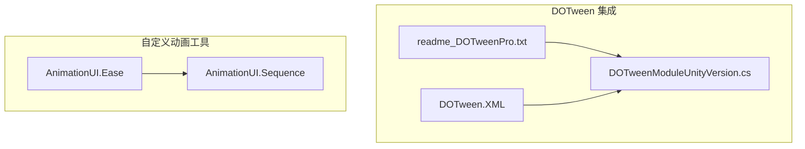
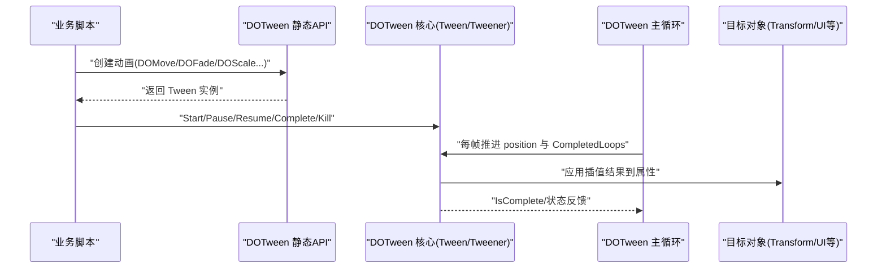
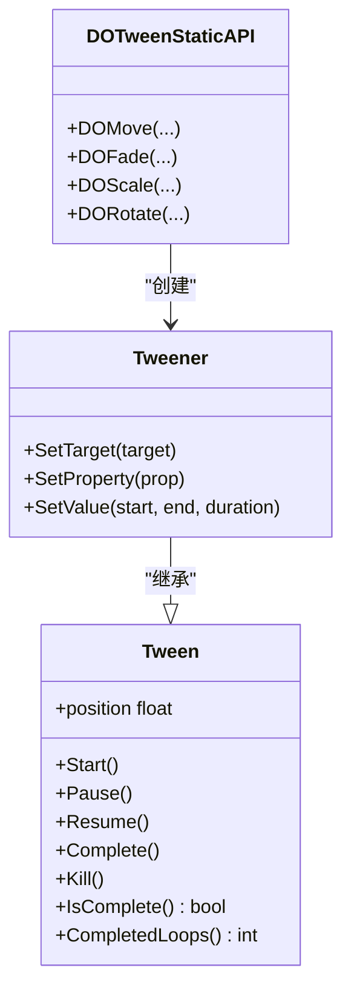
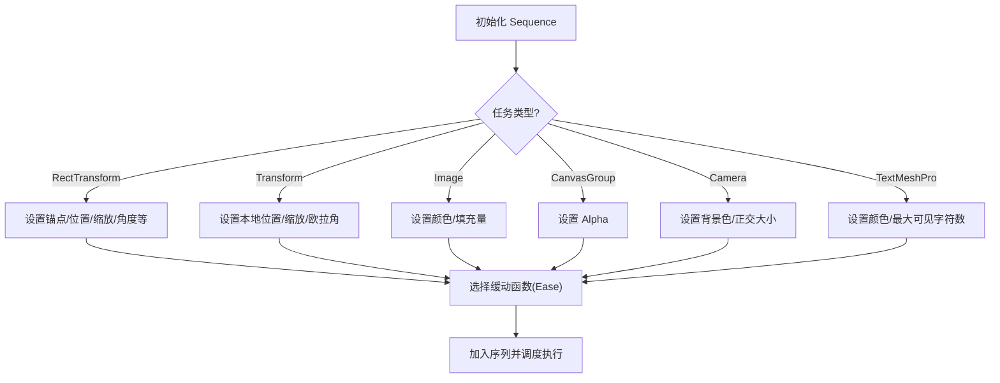
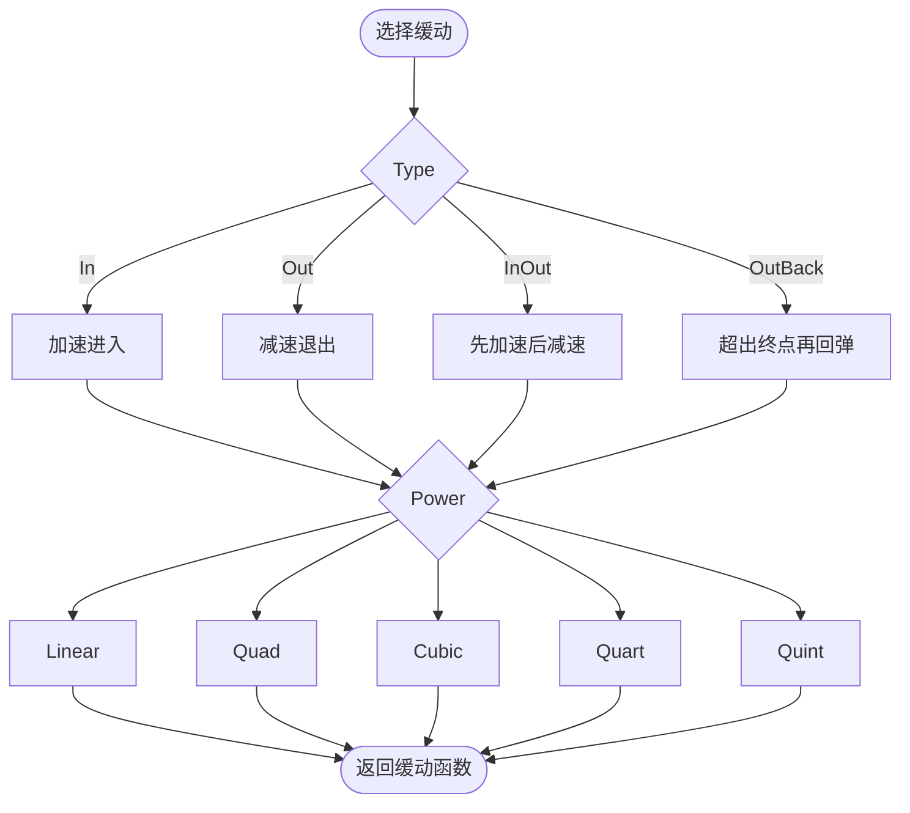
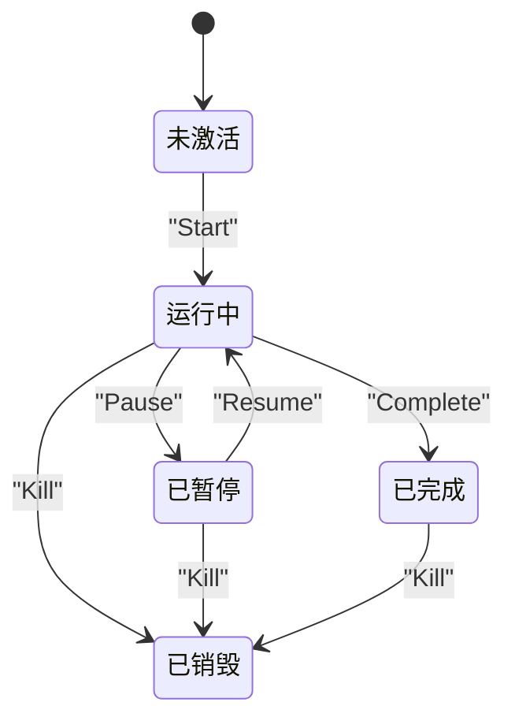
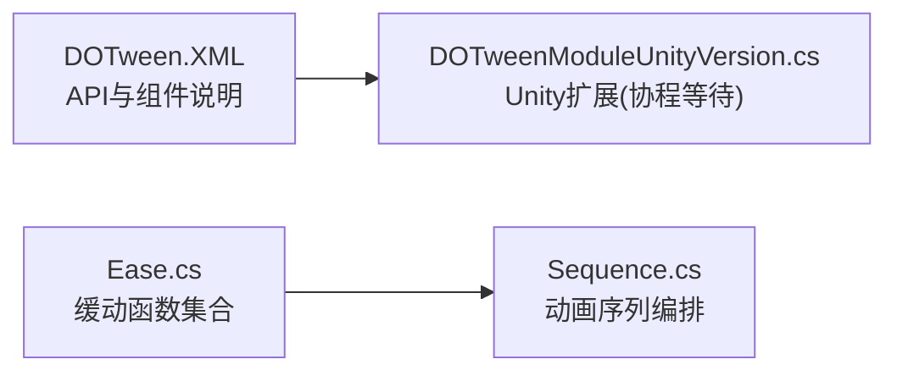

# DOTween 核心概念与基础使用

<cite>
**本文引用的文件**   
- [readme_DOTweenPro.txt](file://Assets/Game/Framework/DoTween/readme_DOTweenPro.txt)
- [DOTweenModuleUnityVersion.cs](file://Assets/Game/Framework/DoTween/DOTween/Modules/DOTweenModuleUnityVersion.cs)
- [DOTween.XML](file://Assets/Game/Framework/DoTween/DOTween/ DOTween.XML)
- [Sequence.cs](file://Assets/Game/Framework/AnimationUI/Script/Sequence.cs)
- [Ease.cs](file://Assets/Game/Framework/AnimationUI/Script/Ease.cs)
</cite>

## 目录
1. [简介](#简介)
2. [项目结构](#项目结构)
3. [核心组件](#核心组件)
4. [架构总览](#架构总览)
5. [详细组件分析](#详细组件分析)
6. [依赖关系分析](#依赖关系分析)
7. [性能考虑](#性能考虑)
8. [故障排查指南](#故障排查指南)
9. [结论](#结论)
10. [附录](#附录)

## 简介
本技术文档面向在 Unity 中使用 DOTween 的开发者，聚焦于核心概念与基础用法：包括 Tween、Tweener、Sequence 的概念与区别；动画对象的创建方式（如 DOFade、DOMove、DOScale 等）；生命周期管理（Start、Pause、Resume、Complete、Kill）；缓动函数（Easing）体系与常见效果；以及链式调用最佳实践与性能优化建议。文档同时结合仓库中已有的 DOTween 模块与自定义动画序列实现，帮助读者快速上手并高效使用。

## 项目结构
本项目在 Assets/Game/Framework/DoTween 下集成了 DOTween 的核心模块与扩展，并在 AnimationUI 中提供了基于 DOTween 的 Sequence 与 Ease 工具类，便于在 UI 动画编排中使用。

图表来源
- [readme_DOTweenPro.txt:1-35](file://Assets/Game/Framework/DoTween/readme_DOTweenPro.txt#L1-L35)
- [DOTweenModuleUnityVersion.cs:72-131](file://Assets/Game/Framework/DoTween/DOTween/Modules/DOTweenModuleUnityVersion.cs#L72-L131)
- [DOTween.XML:47-70](file://Assets/Game/Framework/DoTween/DOTween/ DOTween.XML#L47-L70)
- [Sequence.cs:1-275](file://Assets/Game/Framework/AnimationUI/Script/Sequence.cs#L1-L275)
- [Ease.cs:1-124](file://Assets/Game/Framework/AnimationUI/Script/Ease.cs#L1-L124)

章节来源
- [readme_DOTweenPro.txt:1-35](file://Assets/Game/Framework/DoTween/readme_DOTweenPro.txt#L1-L35)
- [DOTween.XML:47-70](file://Assets/Game/Framework/DoTween/DOTween/ DOTween.XML#L47-L70)

## 核心组件
- Tween：动画的最小执行单元，表示对某个属性从起始值到目标值的插值过程。提供 Start、Pause、Resume、Complete、Kill 等生命周期控制方法，以及 IsComplete、CompletedLoops、position 等查询接口。
- Tweener：继承自 Tween，用于对具体对象属性进行动画（如位置、缩放、透明度等）。常用工厂方法包括 DOMove、DOFade、DOScale、DORotate 等。
- Sequence：将多个 Tween/Tweener 按顺序或并行组合成一条“动画序列”，支持延迟、等待、事件回调等编排能力。

要点说明
- 通过 DOTween 的静态 API 创建 Tweener 实例后，可立即返回 Tween 引用以进行统一控制。
- Sequence 内部维护一个命令队列，按时间轴调度各个 Tween 的执行时机。
- 缓动函数（Easing）决定插值曲线的形状，影响动画的速度曲线与视觉感受。

章节来源
- [DOTween.XML:47-70](file://Assets/Game/Framework/DoTween/DOTween/ DOTween.XML#L47-L70)
- [DOTweenModuleUnityVersion.cs:72-131](file://Assets/Game/Framework/DoTween/DOTween/Modules/DOTweenModuleUnityVersion.cs#L72-L131)
- [Sequence.cs:1-275](file://Assets/Game/Framework/AnimationUI/Script/Sequence.cs#L1-L275)

## 架构总览
下图展示了 DOTween 在 Unity 中的运行流程：代码通过静态 API 创建动画，DOTween 主循环驱动更新，最终应用到目标对象属性上。

图表来源
- [DOTween.XML:47-70](file://Assets/Game/Framework/DoTween/DOTween/ DOTween.XML#L47-L70)
- [DOTweenModuleUnityVersion.cs:72-131](file://Assets/Game/Framework/DoTween/DOTween/Modules/DOTweenModuleUnityVersion.cs#L72-L131)

## 详细组件分析

### Tween 与 Tweener 的关系与职责
- Tween 是抽象基类，定义通用生命周期与进度查询接口。
- Tweener 是具体实现，负责绑定目标对象与属性，计算插值并写入。
- 通过静态 API 创建的通常是 Tweener，但对外暴露为 Tween 类型，便于统一管理。

图表来源
- [DOTween.XML:47-70](file://Assets/Game/Framework/DoTween/DOTween/ DOTween.XML#L47-L70)

章节来源
- [DOTween.XML:47-70](file://Assets/Game/Framework/DoTween/DOTween/ DOTween.XML#L47-L70)

### Sequence 动画序列
Sequence 用于编排多个动画步骤，支持等待、事件、场景切换等复合行为。在本项目中，Sequence 封装了多种任务类型（如 RectTransform、Transform、Image、CanvasGroup、Camera、TextMeshPro 的属性变化），并通过 Ease 系统选择缓动曲线。

图表来源
- [Sequence.cs:1-275](file://Assets/Game/Framework/AnimationUI/Script/Sequence.cs#L1-L275)
- [Ease.cs:1-124](file://Assets/Game/Framework/AnimationUI/Script/Ease.cs#L1-L124)

章节来源
- [Sequence.cs:1-275](file://Assets/Game/Framework/AnimationUI/Script/Sequence.cs#L1-L275)
- [Ease.cs:1-124](file://Assets/Game/Framework/AnimationUI/Script/Ease.cs#L1-L124)

### 缓动函数（Easing）系统
缓动函数决定了动画速度随时间的变化曲线。DOTween 内置大量标准缓动（如 In、Out、InOut、Back、Bounce 等），也可自定义。项目中提供了 Ease 工具类，支持线性、二次、三次、四次、五次幂及 Back 系列效果，并通过 GetEase 方法根据 Type 与 Power 返回对应函数。

图表来源
- [Ease.cs:1-124](file://Assets/Game/Framework/AnimationUI/Script/Ease.cs#L1-L124)

章节来源
- [Ease.cs:1-124](file://Assets/Game/Framework/AnimationUI/Script/Ease.cs#L1-L124)

### 动画生命周期管理
- Start：启动或恢复动画。
- Pause：暂停当前动画，保留进度。
- Resume：从暂停处继续播放。
- Complete：立即完成动画，跳到结束状态。
- Kill：销毁动画，释放资源。

配合协程等待指令（WaitForCompletion、WaitForRewind、WaitForKill、WaitForElapsedLoops），可在协程中精确控制动画时序。

图表来源
- [DOTweenModuleUnityVersion.cs:72-131](file://Assets/Game/Framework/DoTween/DOTween/Modules/DOTweenModuleUnityVersion.cs#L72-L131)

章节来源
- [DOTweenModuleUnityVersion.cs:72-131](file://Assets/Game/Framework/DoTween/DOTween/Modules/DOTweenModuleUnityVersion.cs#L72-L131)

### 常用动画方法与参数配置
- DOMove：移动目标 Transform 到指定位置，支持持续时间、是否使用相对坐标、路径模式等。
- DOFade：对 CanvasGroup 或 Image 的透明度进行淡入淡出，支持持续时间与自动销毁选项。
- DOScale：对 Transform 的缩放进行动画，支持各轴向独立控制与同步/异步模式。
- DORotate：对 Transform 的旋转进行动画，支持欧拉角与四元数模式。

提示
- 所有方法均返回 Tween 实例，可链式调用 SetOptions、OnComplete、OnUpdate 等进一步配置。
- 可通过 SetId 为动画打标签，便于批量控制。

章节来源
- [readme_DOTweenPro.txt:21-23](file://Assets/Game/Framework/DoTween/readme_DOTweenPro.txt#L21-L23)

### 链式调用最佳实践
- 优先使用链式 API 减少中间变量，提高可读性。
- 合理拆分复杂动画为多个小片段，便于复用与维护。
- 使用 OnComplete 与 OnUpdate 处理回调与逐帧逻辑，避免在 Update 中手动推进。
- 对频繁使用的动画，使用 SetId 进行分组管理，便于批量暂停/恢复/销毁。

章节来源
- [DOTween.XML:47-70](file://Assets/Game/Framework/DoTween/DOTween/ DOTween.XML#L47-L70)

## 依赖关系分析
- DOTween 核心通过 XML 文档描述公共 API 与组件职责，模块层提供 Unity 特定扩展（如协程等待指令）。
- 自定义 Sequence 依赖 Ease 工具类选择缓动曲线，形成“编排+曲线”的组合。

图表来源
- [DOTween.XML:47-70](file://Assets/Game/Framework/DoTween/DOTween/ DOTween.XML#L47-L70)
- [DOTweenModuleUnityVersion.cs:72-131](file://Assets/Game/Framework/DoTween/DOTween/Modules/DOTweenModuleUnityVersion.cs#L72-L131)
- [Ease.cs:1-124](file://Assets/Game/Framework/AnimationUI/Script/Ease.cs#L1-L124)
- [Sequence.cs:1-275](file://Assets/Game/Framework/AnimationUI/Script/Sequence.cs#L1-L275)

章节来源
- [DOTween.XML:47-70](file://Assets/Game/Framework/DoTween/DOTween/ DOTween.XML#L47-L70)
- [DOTweenModuleUnityVersion.cs:72-131](file://Assets/Game/Framework/DoTween/DOTween/Modules/DOTweenModuleUnityVersion.cs#L72-L131)
- [Ease.cs:1-124](file://Assets/Game/Framework/AnimationUI/Script/Ease.cs#L1-L124)
- [Sequence.cs:1-275](file://Assets/Game/Framework/AnimationUI/Script/Sequence.cs#L1-L275)

## 性能考虑
- 容量预分配：通过 DOTweenComponent.SetCapacity 直接设置 Tweeners 与 Sequences 的最大并发数量，避免运行时扩容导致的卡顿。
- 合理使用 Kill：及时销毁不再需要的动画，防止内存泄漏与无效更新。
- 避免过度链式嵌套：复杂链式调用可能增加 GC 压力，必要时拆分为独立方法。
- 选择合适的缓动：高次幂（如 Quint）在某些平台上开销略大，可根据平台特性权衡。

章节来源
- [DOTween.XML:56-70](file://Assets/Game/Framework/DoTween/DOTween/ DOTween.XML#L56-L70)

## 故障排查指南
- 升级问题：从旧版本升级到 1.2.000+ 时，需关闭并重启 Unity，再通过 Utility Panel 执行 Setup DOTween，并根据需要启用/禁用模块。
- 模块选择：在 Add/Remove Modules 面板中按需开启 Unity 系统与外部资产（如 TextMesh Pro）的模块。
- 协程等待：确保 Tween 处于 active 状态后再调用 WaitFor* 指令，否则可能返回 null。

章节来源
- [readme_DOTweenPro.txt:3-12](file://Assets/Game/Framework/DoTween/readme_DOTweenPro.txt#L3-L12)
- [readme_DOTweenPro.txt:15-16](file://Assets/Game/Framework/DoTween/readme_DOTweenPro.txt#L15-L16)
- [DOTweenModuleUnityVersion.cs:72-131](file://Assets/Game/Framework/DoTween/DOTween/Modules/DOTweenModuleUnityVersion.cs#L72-L131)

## 结论
DOTween 提供了简洁高效的动画 API，配合 Sequence 与 Ease 可实现丰富的动画编排与视觉效果。掌握 Tween/Tweener 的职责划分、生命周期管理与缓动体系，是构建高质量动画体验的关键。建议在项目中遵循链式调用最佳实践，并结合容量预分配与及时销毁策略，以获得稳定且高性能的动画表现。

## 附录
- 官方文档与示例：参考 readme_DOTweenPro.txt 提供的网站链接与使用说明。
- 实用技巧：
  - 使用 SetId 对动画进行分组管理。
  - 在 UI 场景中优先使用 CanvasGroup 的 DOFade 进行整体淡入淡出。
  - 利用 Sequence 的等待与事件节点，组织复杂的入场/出场动画。

章节来源
- [readme_DOTweenPro.txt:26-32](file://Assets/Game/Framework/DoTween/readme_DOTweenPro.txt#L26-L32)