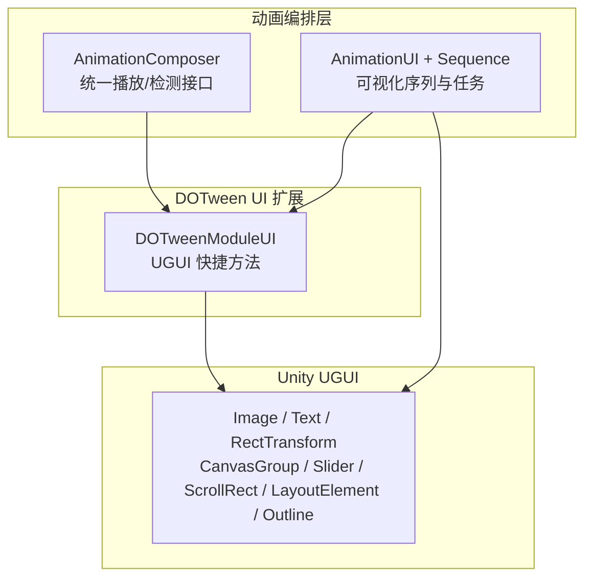
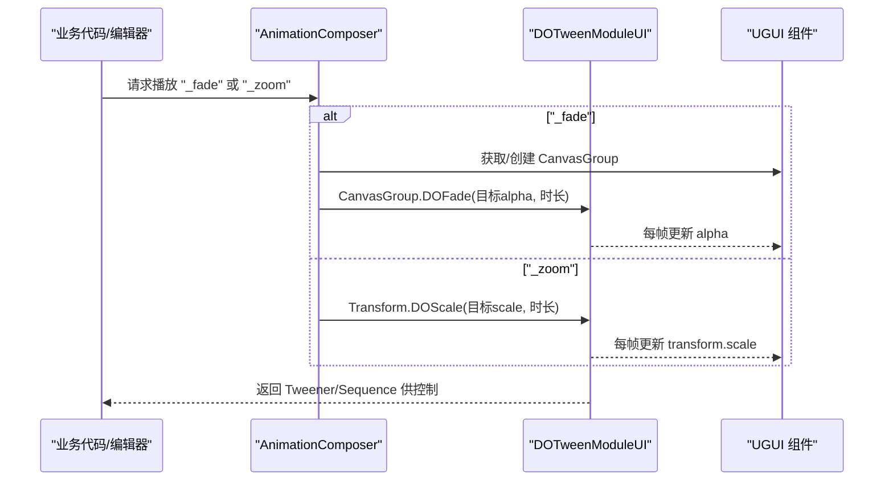
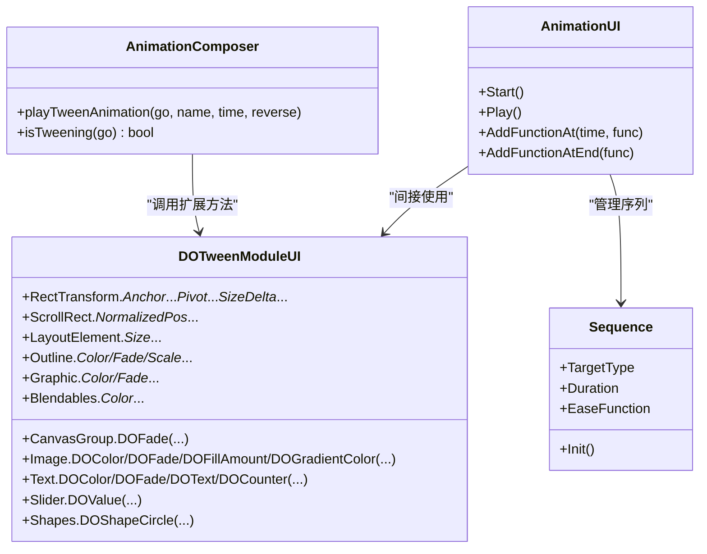

# UI 动画模块 (DOTweenModuleUI)

<cite>
**本文引用的文件列表**
- [DOTweenModuleUI.cs](file://Assets/Game/Framework/DoTween/DOTween/Modules/DOTweenModuleUI.cs)
- [AnimationComposer.cs](file://Assets/Game/Framework/AnimationComposer/AnimationComposer.cs)
- [AnimationUI.cs](file://Assets/Game/Framework/AnimationUI/Script/AnimationUI.cs)
- [Sequence.cs](file://Assets/Game/Framework/AnimationUI/Script/Sequence.cs)
</cite>

## 目录
1. [简介](#简介)
2. [项目结构](#项目结构)
3. [核心组件](#核心组件)
4. [架构总览](#架构总览)
5. [详细组件分析](#详细组件分析)
6. [依赖关系分析](#依赖关系分析)
7. [性能与渲染注意事项](#性能与渲染注意事项)
8. [故障排查指南](#故障排查指南)
9. [结论](#结论)
10. [附录：常用 API 速查](#附录常用-api-速查)

## 简介
本技术文档聚焦于 DOTween 的 UI 扩展模块，系统梳理其对 Unity UGUI 组件（如 Image、Text、RectTransform、CanvasGroup、Slider、ScrollRect、LayoutElement、Outline 等）的动画支持。文档将深入说明位置、大小、颜色、透明度等属性的动画控制方法，解释 CanvasGroup 的整体淡入淡出机制，并给出界面切换、按钮交互反馈、进度条动画、弹窗显示等典型场景的实践建议与最佳实践。

## 项目结构
本项目在 Framework 层集成了 DOTween 的 UI 模块，并通过 AnimationComposer 和 AnimationUI 两套体系对 UI 动画进行编排与可视化编辑。核心实现位于 DOTween 的 UI 扩展模块中，提供大量便捷扩展方法；上层框架则封装了更高层的序列动画与编辑器体验。

图表来源
- [DOTweenModuleUI.cs:1-663](file://Assets/Game/Framework/DoTween/DOTween/Modules/DOTweenModuleUI.cs#L1-L663)
- [AnimationComposer.cs:139-181](file://Assets/Game/Framework/AnimationComposer/AnimationComposer.cs#L139-L181)
- [AnimationUI.cs:1-120](file://Assets/Game/Framework/AnimationUI/Script/AnimationUI.cs#L1-L120)
- [Sequence.cs:1-56](file://Assets/Game/Framework/AnimationUI/Script/Sequence.cs#L1-L56)

章节来源
- [DOTweenModuleUI.cs:1-663](file://Assets/Game/Framework/DoTween/DOTween/Modules/DOTweenModuleUI.cs#L1-L663)
- [AnimationComposer.cs:139-181](file://Assets/Game/Framework/AnimationComposer/AnimationComposer.cs#L139-L181)
- [AnimationUI.cs:1-120](file://Assets/Game/Framework/AnimationUI/Script/AnimationUI.cs#L1-L120)
- [Sequence.cs:1-56](file://Assets/Game/Framework/AnimationUI/Script/Sequence.cs#L1-L56)

## 核心组件
- DOTweenModuleUI：为 UGUI 组件提供丰富的扩展方法，覆盖颜色、透明度、填充量、锚点、尺寸、位移、抖动、弹跳、渐变、数值计数、滚动、滑块值等。
- AnimationComposer：统一调用 DOTween 能力，提供“_fade”、“_zoom”等命名动画的播放与状态检测。
- AnimationUI + Sequence：以可视化方式组织多段动画序列，支持多种目标类型（RectTransform、Image、CanvasGroup、Camera、TextMeshPro 等），并在运行时按时间推进更新属性。

章节来源
- [DOTweenModuleUI.cs:20-663](file://Assets/Game/Framework/DoTween/DOTween/Modules/DOTweenModuleUI.cs#L20-L663)
- [AnimationComposer.cs:139-181](file://Assets/Game/Framework/AnimationComposer/AnimationComposer.cs#L139-L181)
- [AnimationUI.cs:14-120](file://Assets/Game/Framework/AnimationUI/Script/AnimationUI.cs#L14-L120)
- [Sequence.cs:1-56](file://Assets/Game/Framework/AnimationUI/Script/Sequence.cs#L1-L56)

## 架构总览
下图展示了从上层编排到具体 UGUI 属性更新的调用链，以及关键方法的职责划分。

图表来源
- [AnimationComposer.cs:139-166](file://Assets/Game/Framework/AnimationComposer/AnimationComposer.cs#L139-L166)
- [DOTweenModuleUI.cs:24-36](file://Assets/Game/Framework/DoTween/DOTween/Modules/DOTweenModuleUI.cs#L24-L36)

章节来源
- [AnimationComposer.cs:139-181](file://Assets/Game/Framework/AnimationComposer/AnimationComposer.cs#L139-L181)
- [DOTweenModuleUI.cs:24-36](file://Assets/Game/Framework/DoTween/DOTween/Modules/DOTweenModuleUI.cs#L24-L36)

## 详细组件分析

### CanvasGroup 整体淡入淡出
- 功能要点
  - 通过 DOFade 对 CanvasGroup.alpha 做插值，适合整屏面板、弹窗、遮罩等的显隐过渡。
  - 可配合 SetTarget 用于过滤操作（例如批量暂停/停止）。
- 典型用法
  - 面板进入：alpha 从 0 到 1
  - 面板退出：alpha 从 1 到 0
  - 组合其他动画：使用 Sequence 串联多个 Tween
- 参考路径
  - [CanvasGroup.DOFade 实现:24-36](file://Assets/Game/Framework/DoTween/DOTween/Modules/DOTweenModuleUI.cs#L24-L36)
  - [AnimationComposer 中的 _fade 播放逻辑:139-166](file://Assets/Game/Framework/AnimationComposer/AnimationComposer.cs#L139-L166)

章节来源
- [DOTweenModuleUI.cs:24-36](file://Assets/Game/Framework/DoTween/DOTween/Modules/DOTweenModuleUI.cs#L24-L36)
- [AnimationComposer.cs:139-166](file://Assets/Game/Framework/AnimationComposer/AnimationComposer.cs#L139-L166)

### Image 动画（颜色、透明度、填充量、渐变）
- 功能要点
  - DOColor/DOFade：对 Image.color 做颜色/透明度的插值。
  - DOFillAmount：对 Image.fillAmount 做 0~1 范围的填充动画（常用于进度条、圆形进度）。
  - DOGradientColor：基于 Gradient 生成 Sequence，逐步改变颜色（仅使用颜色键，忽略 Alpha）。
- 典型用法
  - 按钮高亮/恢复：DOColor/DOFade
  - 进度条增长：DOFillAmount
  - 主题色渐变：DOGradientColor
- 参考路径
  - [Image.DOColor/DOFade/DOFillAmount/DOGradientColor:62-120](file://Assets/Game/Framework/DoTween/DOTween/Modules/DOTweenModuleUI.cs#L62-L120)

章节来源
- [DOTweenModuleUI.cs:62-120](file://Assets/Game/Framework/DoTween/DOTween/Modules/DOTweenModuleUI.cs#L62-L120)

### Text 动画（颜色、透明度、文本内容、数字计数）
- 功能要点
  - DOColor/DOFade：对 Text.color 做颜色/透明度插值。
  - DOText：对 Text.text 做字符串插值，支持富文本与乱序模式。
  - DOCounter：整数计数动画，支持千分位格式化与文化信息。
- 典型用法
  - 提示文字渐显：DOFade
  - 打字机效果：DOText
  - 分数/金币跳动：DOCounter
- 参考路径
  - [Text.DOColor/DOFade/DOText/DOCounter:479-545](file://Assets/Game/Framework/DoTween/DOTween/Modules/DOTweenModuleUI.cs#L479-L545)

章节来源
- [DOTweenModuleUI.cs:479-545](file://Assets/Game/Framework/DoTween/DOTween/Modules/DOTweenModuleUI.cs#L479-L545)

### RectTransform 动画（位置、锚点、枢轴、尺寸、特效）
- 功能要点
  - 位置：DOAnchorPos/DOAnchorPosX/DOAnchorPosY/DOAnchorPos3D 系列
  - 锚点：DOAnchorMin/DOAnchorMax
  - 枢轴：DOPivot/DOPivotX/DOPivotY
  - 尺寸：DOSizeDelta
  - 特效：DOPunchAnchorPos（弹性冲击）、DOShakeAnchorPos（抖动）、DOJumpAnchorPos（跳跃轨迹）
- 典型用法
  - 滑入/滑出：DOAnchorPos
  - 缩放展开：DOSizeDelta + DOPivot
  - 点击反馈：DOPunchAnchorPos/DOShakeAnchorPos
  - 复杂轨迹：DOJumpAnchorPos
- 参考路径
  - [RectTransform 相关方法:202-426](file://Assets/Game/Framework/DoTween/DOTween/Modules/DOTweenModuleUI.cs#L202-L426)

章节来源
- [DOTweenModuleUI.cs:202-426](file://Assets/Game/Framework/DoTween/DOTween/Modules/DOTweenModuleUI.cs#L202-L426)

### 其他 UGUI 组件
- LayoutElement：灵活宽高、最小/首选尺寸的动画（DOFlexibleSize、DOMinSize、DOPreferredSize）
- ScrollRect：归一化滚动位置的平滑移动（DONormalizedPos、DOHorizontalNormalizedPos、DOVerticalNormalizedPos）
- Slider：value 的平滑变化（DOValue）
- Outline：描边颜色、透明度、距离的动画（DOColor、DOFade、DOScale）
- Graphic：通用图形颜色/透明度（DOColor、DOFade）
- Blendables：多源颜色叠加不冲突（Graphic/Image/Text 的 DOBlendableColor）
- Shapes：沿圆轨迹运动（DOShapeCircle）

章节来源
- [LayoutElement 相关:122-166](file://Assets/Game/Framework/DoTween/DOTween/Modules/DOTweenModuleUI.cs#L122-L166)
- [ScrollRect 相关:428-462](file://Assets/Game/Framework/DoTween/DOTween/Modules/DOTweenModuleUI.cs#L428-L462)
- [Slider 相关:464-477](file://Assets/Game/Framework/DoTween/DOTween/Modules/DOTweenModuleUI.cs#L464-L477)
- [Outline 相关:168-200](file://Assets/Game/Framework/DoTween/DOTween/Modules/DOTweenModuleUI.cs#L168-L200)
- [Graphic 相关:38-60](file://Assets/Game/Framework/DoTween/DOTween/Modules/DOTweenModuleUI.cs#L38-L60)
- [Blendables 相关:547-612](file://Assets/Game/Framework/DoTween/DOTween/Modules/DOTweenModuleUI.cs#L547-L612)
- [Shapes 相关:614-635](file://Assets/Game/Framework/DoTween/DOTween/Modules/DOTweenModuleUI.cs#L614-L635)

### 可视化序列与任务（AnimationUI + Sequence）
- 功能要点
  - Sequence 定义单段动画的目标类型、起止时间、缓动函数、目标组件及任务标志（如 Image.Color/FillAmount、CanvasGroup.Alpha、RectTransform.AnchoredPosition 等）。
  - AnimationUI 负责启动、推进、事件回调与预览。
- 典型用法
  - 界面入场：CanvasGroup 淡入 + RectTransform 滑入
  - 按钮交互：Image 颜色闪烁 + RectTransform 微抖动
  - 进度条：Image.fillAmount 渐进
- 参考路径
  - [Sequence 结构与枚举:1-56](file://Assets/Game/Framework/AnimationUI/Script/Sequence.cs#L1-L56)
  - [AnimationUI 初始化与任务分发:43-120](file://Assets/Game/Framework/AnimationUI/Script/AnimationUI.cs#L43-L120)
  - [CanvasGroup 任务执行:421-437](file://Assets/Game/Framework/AnimationUI/Script/AnimationUI.cs#L421-L437)
  - [Image 任务执行（颜色/填充）:402-418](file://Assets/Game/Framework/AnimationUI/Script/AnimationUI.cs#L402-L418)
  - [RectTransform 任务执行（anchoredPosition）:553-566](file://Assets/Game/Framework/AnimationUI/Script/AnimationUI.cs#L553-L566)

章节来源
- [Sequence.cs:1-56](file://Assets/Game/Framework/AnimationUI/Script/Sequence.cs#L1-L56)
- [AnimationUI.cs:43-120](file://Assets/Game/Framework/AnimationUI/Script/AnimationUI.cs#L43-L120)
- [AnimationUI.cs:402-418](file://Assets/Game/Framework/AnimationUI/Script/AnimationUI.cs#L402-L418)
- [AnimationUI.cs:421-437](file://Assets/Game/Framework/AnimationUI/Script/AnimationUI.cs#L421-L437)
- [AnimationUI.cs:553-566](file://Assets/Game/Framework/AnimationUI/Script/AnimationUI.cs#L553-L566)

## 依赖关系分析
- DOTweenModuleUI 直接依赖 UnityEngine.UI 与 DG.Tweening.Core/Plugins，为 UGUI 暴露扩展方法。
- AnimationComposer 依赖 DOTween 的 IsTweening 与扩展方法，作为统一入口。
- AnimationUI/Sequence 依赖 UGUI 组件与自定义缓动工具，负责编排与驱动。

图表来源
- [DOTweenModuleUI.cs:20-663](file://Assets/Game/Framework/DoTween/DOTween/Modules/DOTweenModuleUI.cs#L20-L663)
- [AnimationComposer.cs:139-181](file://Assets/Game/Framework/AnimationComposer/AnimationComposer.cs#L139-L181)
- [AnimationUI.cs:14-120](file://Assets/Game/Framework/AnimationUI/Script/AnimationUI.cs#L14-L120)
- [Sequence.cs:1-56](file://Assets/Game/Framework/AnimationUI/Script/Sequence.cs#L1-L56)

章节来源
- [DOTweenModuleUI.cs:20-663](file://Assets/Game/Framework/DoTween/DOTween/Modules/DOTweenModuleUI.cs#L20-L663)
- [AnimationComposer.cs:139-181](file://Assets/Game/Framework/AnimationComposer/AnimationComposer.cs#L139-L181)
- [AnimationUI.cs:14-120](file://Assets/Game/Framework/AnimationUI/Script/AnimationUI.cs#L14-L120)
- [Sequence.cs:1-56](file://Assets/Game/Framework/AnimationUI/Script/Sequence.cs#L1-L56)

## 性能与渲染注意事项
- 避免过度动画
  - 减少同时运行的 Tween 数量，优先合并同目标的多次赋值，使用 Sequence 串联而非并行过多独立 Tween。
  - 谨慎使用高频抖动/弹跳特效，合理设置 vibrato 与 duration。
- 合理使用对象池
  - 频繁出现的 UI（如按钮、提示框）建议使用对象池复用，避免频繁 Instantiate/Destroy。
  - 结合 DOTween 的 SetTarget 与生命周期管理，确保销毁前正确 Kill/Complete。
- 优化渲染性能
  - 尽量在同一 Canvas 下组织 UI，减少跨 Canvas 的排序与重建开销。
  - 控制同时可见的 UI 数量，隐藏不可见 UI 时及时停止其动画。
  - 对于大文本或复杂材质，避免在动画过程中频繁修改影响重绘的属性。
- 层级与遮挡
  - 使用 Sorting Layer 与 Order in Layer 控制 UI 层级，必要时调整父级 Canvas 的 Render Mode。
  - 注意父级 CanvasGroup 的 alpha 会作用于子节点，避免重复叠加导致视觉异常。
- 数值精度与对齐
  - 对需要像素对齐的位置/尺寸，启用 snapping 选项以减少锯齿与抖动。

[本节为通用指导，无需源码引用]

## 故障排查指南
- 问题：CanvasGroup 未生效
  - 检查是否已添加 CanvasGroup 组件，并确保 DOFade 的目标是 CanvasGroup 而非 Transform。
  - 确认父级 CanvasGroup 的 alpha 未被意外设置为 0。
  - 参考路径：[CanvasGroup.DOFade:24-36](file://Assets/Game/Framework/DoTween/DOTween/Modules/DOTweenModuleUI.cs#L24-L36)、[AnimationComposer._fade:139-166](file://Assets/Game/Framework/AnimationComposer/AnimationComposer.cs#L139-L166)
- 问题：Image.fillAmount 超出范围
  - DOFillAmount 内部会对 0~1 进行钳制，若仍异常，检查外部是否直接修改 fillAmount 或在同一帧多次写入。
  - 参考路径：[Image.DOFillAmount:84-94](file://Assets/Game/Framework/DoTween/DOTween/Modules/DOTweenModuleUI.cs#L84-L94)
- 问题：Text.DOText 出现空引用或标签解析异常
  - 传入 null 会被替换为空字符串以避免错误；确认 richTextEnabled 与 scrambleChars 配置符合预期。
  - 参考路径：[Text.DOText:524-543](file://Assets/Game/Framework/DoTween/DOTween/Modules/DOTweenModuleUI.cs#L524-L543)
- 问题：RectTransform 动画错位
  - 检查 anchoredPosition/anchorMin/anchorMax/pivot 的组合是否与布局系统兼容；必要时使用 snapping。
  - 参考路径：[RectTransform 相关方法:202-426](file://Assets/Game/Framework/DoTween/DOTween/Modules/DOTweenModuleUI.cs#L202-L426)
- 问题：动画状态检测不准确
  - 使用 DOTween.IsTweening 检测目标（CanvasGroup 或 Transform）是否正确；避免对已销毁对象查询。
  - 参考路径：[AnimationComposer.isTweening:173-181](file://Assets/Game/Framework/AnimationComposer/AnimationComposer.cs#L173-L181)

章节来源
- [DOTweenModuleUI.cs:24-36](file://Assets/Game/Framework/DoTween/DOTween/Modules/DOTweenModuleUI.cs#L24-L36)
- [DOTweenModuleUI.cs:84-94](file://Assets/Game/Framework/DoTween/DOTween/Modules/DOTweenModuleUI.cs#L84-L94)
- [DOTweenModuleUI.cs:524-543](file://Assets/Game/Framework/DoTween/DOTween/Modules/DOTweenModuleUI.cs#L524-L543)
- [DOTweenModuleUI.cs:202-426](file://Assets/Game/Framework/DoTween/DOTween/Modules/DOTweenModuleUI.cs#L202-L426)
- [AnimationComposer.cs:173-181](file://Assets/Game/Framework/AnimationComposer/AnimationComposer.cs#L173-L181)

## 结论
DOTweenModuleUI 为 UGUI 提供了全面且高效的动画能力，覆盖常见 UI 元素的核心属性与特效。结合 AnimationComposer 与 AnimationUI/Sequence，可在工程内形成从底层扩展到高层编排的完整链路。在实际项目中，应遵循性能与渲染最佳实践，合理使用对象池与层级管理，以获得流畅稳定的用户体验。

[本节为总结性内容，无需源码引用]

## 附录：常用 API 速查
- CanvasGroup
  - DOFade(endValue, duration)
- Image
  - DOColor(Color, duration)
  - DOFade(float, duration)
  - DOFillAmount(float, duration)
  - DOGradientColor(Gradient, duration)
- Text
  - DOColor(Color, duration)
  - DOFade(float, duration)
  - DOText(string, duration, richTextEnabled, scrambleMode, scrambleChars)
  - DOCounter(fromValue, endValue, duration, addThousandsSeparator, culture)
- RectTransform
  - DOAnchorPos/DOAnchorPosX/DOAnchorPosY/DOAnchorPos3D/DOAnchorPos3DX/DOAnchorPos3DY/DOAnchorPos3DZ
  - DOAnchorMin/DOAnchorMax
  - DOPivot/DOPivotX/DOPivotY
  - DOSizeDelta
  - DOPunchAnchorPos(Vector2, duration, vibrato, elasticity, snapping)
  - DOShakeAnchorPos(duration, strength, vibrato, randomness, snapping, fadeOut, randomnessMode)
  - DOJumpAnchorPos(Vector2, jumpPower, numJumps, duration, snapping)
- ScrollRect
  - DONormalizedPos(Vector2, duration, snapping)
  - DOHorizontalNormalizedPos(float, duration, snapping)
  - DOVerticalNormalizedPos(float, duration, snapping)
- Slider
  - DOValue(float, duration, snapping)
- LayoutElement
  - DOFlexibleSize(Vector2, duration, snapping)
  - DOMinSize(Vector2, duration, snapping)
  - DOPreferredSize(Vector2, duration, snapping)
- Outline
  - DOColor(Color, duration)
  - DOFade(float, duration)
  - DOScale(Vector2, duration)
- Graphic
  - DOColor(Color, duration)
  - DOFade(float, duration)
- Blendables
  - DOBlendableColor(Color, duration)（Graphic/Image/Text）
- Shapes
  - DOShapeCircle(center, endValueDegrees, duration, relativeCenter, snapping)

章节来源
- [DOTweenModuleUI.cs:24-663](file://Assets/Game/Framework/DoTween/DOTween/Modules/DOTweenModuleUI.cs#L24-L663)