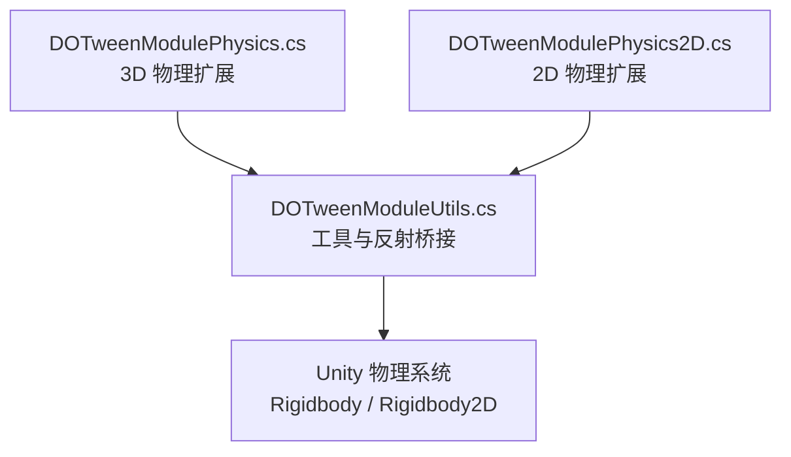
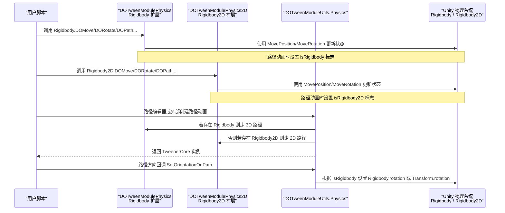
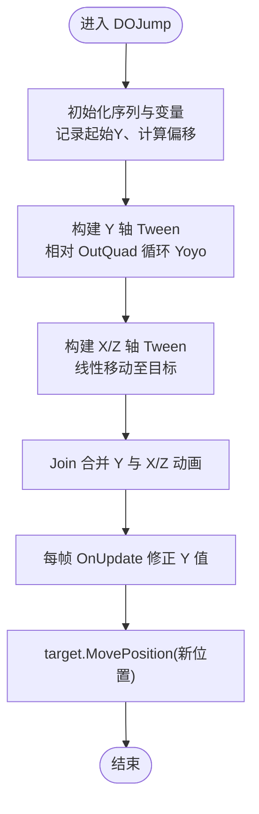
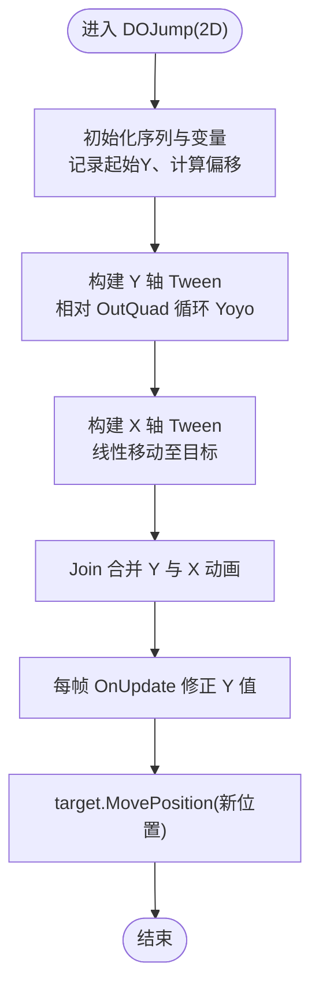
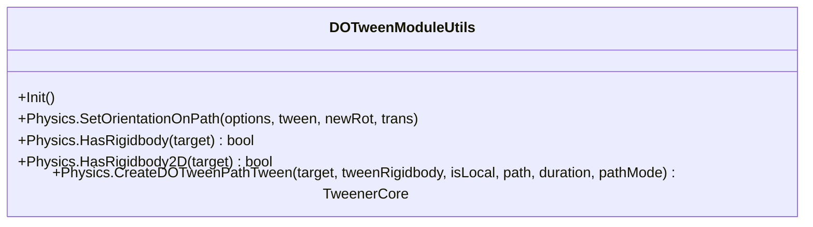
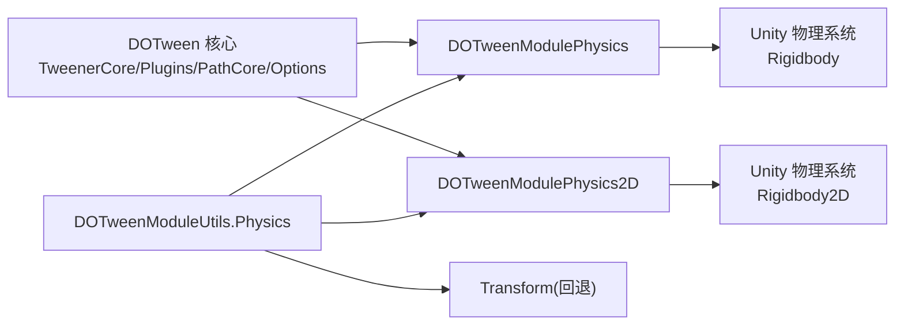

# 物理动画模块 (DOTweenModulePhysics)

<cite>
**本文引用的文件**   
- [DOTweenModulePhysics.cs](file://Assets/Game/Framework/DoTween/DOTween/Modules/DOTweenModulePhysics.cs)
- [DOTweenModulePhysics2D.cs](file://Assets/Game/Framework/DoTween/DOTween/Modules/DOTweenModulePhysics2D.cs)
- [DOTweenModuleUtils.cs](file://Assets/Game/Framework/DoTween/DOTween/Modules/DOTweenModuleUtils.cs)
</cite>

## 目录
1. [简介](#简介)
2. [项目结构](#项目结构)
3. [核心组件](#核心组件)
4. [架构总览](#架构总览)
5. [详细组件分析](#详细组件分析)
6. [依赖关系分析](#依赖关系分析)
7. [性能与最佳实践](#性能与最佳实践)
8. [故障排查指南](#故障排查指南)
9. [结论](#结论)
10. [附录：API 速查与示例路径](#附录api-速查与示例路径)

## 简介
本技术文档聚焦于 DOTween 的物理动画模块，系统阐述其对 Unity 3D 物理系统的集成方式与使用要点。内容覆盖：
- 3D 物理对象（Rigidbody）的位移、旋转、路径跟随、跳跃等动画能力
- 2D 物理对象（Rigidbody2D）的对应动画能力
- 与 Unity 物理引擎的协作机制（如 MovePosition/MoveRotation、固定时间步更新、路径方向对齐等）
- 常见应用场景与实现思路（角色移动、抛掷、弹簧缓冲等）
- 性能优化策略（插值模式、避免频繁物理计算、碰撞检测优化等）

## 项目结构
本项目将 DOTween 对物理系统的扩展以“模块”形式组织在 Modules 目录下，分别提供 3D 与 2D 两套 API：
- 3D 物理模块：DOTweenModulePhysics.cs
- 2D 物理模块：DOTweenModulePhysics2D.cs
- 工具与反射桥接：DOTweenModuleUtils.cs（负责路径方向设置、Rigidbody/Rigidbody2D 存在性检查、路径创建分发等）

图表来源
- [DOTweenModulePhysics.cs:1-216](file://Assets/Game/Framework/DoTween/DOTween/Modules/DOTweenModulePhysics.cs#L1-L216)
- [DOTweenModulePhysics2D.cs:1-194](file://Assets/Game/Framework/DoTween/DOTween/Modules/DOTweenModulePhysics2D.cs#L1-L194)
- [DOTweenModuleUtils.cs:1-168](file://Assets/Game/Framework/DoTween/DOTween/Modules/DOTweenModuleUtils.cs#L1-L168)

章节来源
- [DOTweenModulePhysics.cs:1-216](file://Assets/Game/Framework/DoTween/DOTween/Modules/DOTweenModulePhysics.cs#L1-L216)
- [DOTweenModulePhysics2D.cs:1-194](file://Assets/Game/Framework/DoTween/DOTween/Modules/DOTweenModulePhysics2D.cs#L1-L194)
- [DOTweenModuleUtils.cs:1-168](file://Assets/Game/Framework/DoTween/DOTween/Modules/DOTweenModuleUtils.cs#L1-L168)

## 核心组件
- 3D 物理扩展（DOTweenModulePhysics）
  - 为 Rigidbody 提供 DOMove/DOMoveX/Y/Z、DORotate、DOLookAt、DOJump、DOPath/DOLocalPath 等便捷方法
  - 通过 MovePosition/MoveRotation 与物理系统集成，支持轴约束、路径模式、局部坐标等选项
- 2D 物理扩展（DOTweenModulePhysics2D）
  - 为 Rigidbody2D 提供 DOMove/DOMoveX/Y、DORotate、DOJump、DOPath/DOLocalPath 等便捷方法
  - 针对 2D 特性进行适配（例如 DOJump 直接设置位置而非 MovePosition）
- 工具与反射桥接（DOTweenModuleUtils.Physics）
  - SetOrientationOnPath：根据是否操作 Rigidbody 决定设置 Transform.rotation 还是 Rigidbody.rotation
  - HasRigidbody/HasRigidbody2D：反射式检测目标是否具备相应物理组件
  - CreateDOTweenPathTween：按优先级选择 Rigidbody → Rigidbody2D → Transform 的路径动画创建入口

章节来源
- [DOTweenModulePhysics.cs:22-90](file://Assets/Game/Framework/DoTween/DOTween/Modules/DOTweenModulePhysics.cs#L22-L90)
- [DOTweenModulePhysics.cs:94-182](file://Assets/Game/Framework/DoTween/DOTween/Modules/DOTweenModulePhysics.cs#L94-L182)
- [DOTweenModulePhysics2D.cs:21-100](file://Assets/Game/Framework/DoTween/DOTween/Modules/DOTweenModulePhysics2D.cs#L21-L100)
- [DOTweenModulePhysics2D.cs:114-184](file://Assets/Game/Framework/DoTween/DOTween/Modules/DOTweenModulePhysics2D.cs#L114-L184)
- [DOTweenModuleUtils.cs:85-162](file://Assets/Game/Framework/DoTween/DOTween/Modules/DOTweenModuleUtils.cs#L85-L162)

## 架构总览
下图展示了物理动画从调用到最终作用于 Unity 物理系统的整体流程，包括路径方向对齐与路径创建的分发逻辑。

图表来源
- [DOTweenModulePhysics.cs:143-182](file://Assets/Game/Framework/DoTween/DOTween/Modules/DOTweenModulePhysics.cs#L143-L182)
- [DOTweenModulePhysics2D.cs:114-184](file://Assets/Game/Framework/DoTween/DOTween/Modules/DOTweenModulePhysics2D.cs#L114-L184)
- [DOTweenModuleUtils.cs:88-96](file://Assets/Game/Framework/DoTween/DOTween/Modules/DOTweenModuleUtils.cs#L88-L96)
- [DOTweenModuleUtils.cs:129-162](file://Assets/Game/Framework/DoTween/DOTween/Modules/DOTweenModuleUtils.cs#L129-L162)

## 详细组件分析

### 3D 物理模块（DOTweenModulePhysics）
- 位移控制
  - DOMove/DOMoveX/Y/Z：基于 target.position 读取与 target.MovePosition 写入，支持轴约束与整数吸附
- 旋转控制
  - DORotate：基于 target.rotation 读取与 target.MoveRotation 写入，支持旋转模式
  - DOLookAt：面向目标点，支持轴向约束与 up 向量
- 特殊效果
  - DOJump：组合 X/Z 线性移动与 Y 轴 OutQuad 弹跳，内部维护起始高度与偏移量，逐帧修正 Y 值
- 路径动画
  - DOPath/DOLocalPath：使用 PathPlugin 生成路径，设置 UpdateType.Fixed 与 plugOptions.isRigidbody/mode/useLocalPosition

图表来源
- [DOTweenModulePhysics.cs:102-129](file://Assets/Game/Framework/DoTween/DOTween/Modules/DOTweenModulePhysics.cs#L102-L129)

章节来源
- [DOTweenModulePhysics.cs:22-90](file://Assets/Game/Framework/DoTween/DOTween/Modules/DOTweenModulePhysics.cs#L22-L90)
- [DOTweenModulePhysics.cs:94-182](file://Assets/Game/Framework/DoTween/DOTween/Modules/DOTweenModulePhysics.cs#L94-L182)

### 2D 物理模块（DOTweenModulePhysics2D）
- 位移控制
  - DOMove/DOMoveX/Y：基于 target.position 读取与 target.MovePosition 写入，支持轴约束与整数吸附
- 旋转控制
  - DORotate：基于 target.rotation 读取与 target.MoveRotation 写入
- 特殊效果
  - DOJump：注释指出 2D 无法用 MovePosition 做抛物线，因此采用直接设置 position 的方式叠加 Y 偏移
- 路径动画
  - DOPath/DOLocalPath：将 Vector2[] 转为 Vector3[] 后复用 3D 路径管线，设置 plugOptions.isRigidbody2D/mode/useLocalPosition

图表来源
- [DOTweenModulePhysics2D.cs:75-100](file://Assets/Game/Framework/DoTween/DOTween/Modules/DOTweenModulePhysics2D.cs#L75-L100)

章节来源
- [DOTweenModulePhysics2D.cs:21-100](file://Assets/Game/Framework/DoTween/DOTween/Modules/DOTweenModulePhysics2D.cs#L21-L100)
- [DOTweenModulePhysics2D.cs:114-184](file://Assets/Game/Framework/DoTween/DOTween/Modules/DOTweenModulePhysics2D.cs#L114-L184)

### 工具与反射桥接（DOTweenModuleUtils.Physics）
- 路径方向对齐
  - SetOrientationOnPath：当 options.isRigidbody 为真时设置 Rigidbody.rotation，否则设置 Transform.rotation
- 组件存在性检查
  - HasRigidbody/HasRigidbody2D：反射式判断目标是否包含对应物理组件
- 路径创建分发
  - CreateDOTweenPathTween：优先尝试 Rigidbody → Rigidbody2D → Transform，并区分本地/世界坐标路径

图表来源
- [DOTweenModuleUtils.cs:38-52](file://Assets/Game/Framework/DoTween/DOTween/Modules/DOTweenModuleUtils.cs#L38-L52)
- [DOTweenModuleUtils.cs:88-96](file://Assets/Game/Framework/DoTween/DOTween/Modules/DOTweenModuleUtils.cs#L88-L96)
- [DOTweenModuleUtils.cs:116-123](file://Assets/Game/Framework/DoTween/DOTween/Modules/DOTweenModuleUtils.cs#L116-L123)
- [DOTweenModuleUtils.cs:129-162](file://Assets/Game/Framework/DoTween/DOTween/Modules/DOTweenModuleUtils.cs#L129-L162)

章节来源
- [DOTweenModuleUtils.cs:85-162](file://Assets/Game/Framework/DoTween/DOTween/Modules/DOTweenModuleUtils.cs#L85-L162)

## 依赖关系分析
- 模块间耦合
  - 3D/2D 模块均依赖 DOTween 核心（TweenerCore、Plugins、PathCore、Options）
  - 工具类提供跨模块的统一入口（路径创建、方向设置、组件检测）
- 外部依赖
  - Unity 物理系统（Rigidbody/Rigidbody2D）
  - Unity Transform（作为回退路径）
- 可能的循环依赖
  - 当前模块之间无直接相互引用，仅通过工具类统一协调，耦合度低、内聚度高

图表来源
- [DOTweenModulePhysics.cs:1-11](file://Assets/Game/Framework/DoTween/DOTween/Modules/DOTweenModulePhysics.cs#L1-L11)
- [DOTweenModulePhysics2D.cs:1-11](file://Assets/Game/Framework/DoTween/DOTween/Modules/DOTweenModulePhysics2D.cs#L1-L11)
- [DOTweenModuleUtils.cs:1-10](file://Assets/Game/Framework/DoTween/DOTween/Modules/DOTweenModuleUtils.cs#L1-L10)

章节来源
- [DOTweenModulePhysics.cs:1-11](file://Assets/Game/Framework/DoTween/DOTween/Modules/DOTweenModulePhysics.cs#L1-L11)
- [DOTweenModulePhysics2D.cs:1-11](file://Assets/Game/Framework/DoTween/DOTween/Modules/DOTweenModulePhysics2D.cs#L1-L11)
- [DOTweenModuleUtils.cs:1-10](file://Assets/Game/Framework/DoTween/DOTween/Modules/DOTweenModuleUtils.cs#L1-L10)

## 性能与最佳实践
- 使用 FixedUpdate 更新路径动画
  - 3D/2D 路径方法默认设置 UpdateType.Fixed，确保与物理步进同步，减少抖动与穿透风险
- 合理设置轴约束与吸附
  - 单轴移动时使用 AxisConstraint 可避免多余分量计算；snapping 适合网格化场景
- 谨慎使用 DOJump
  - 2D 中 DOJump 会直接设置位置，可能绕过物理积分器；如需严格物理交互，建议改用力/冲量驱动
- 路径分辨率与复杂度
  - 高 resolution 带来更平滑曲线但增加计算开销；长曲线可适当降低分辨率
- 避免频繁创建/销毁 Tween
  - 复用 Tweener/Sequence，或在必要时 Kill 并回收，减少 GC 压力
- 与物理引擎协作
  - 需要精确碰撞反馈时，尽量让物理系统主导运动（AddForce/velocity），DOTween 用于表现层过渡
  - 若必须用 MovePosition/MoveRotation，注意将 Rigidbody 设为 kinematic 以避免与重力/力场冲突

[本节为通用指导，不直接分析具体文件]

## 故障排查指南
- 路径方向不正确
  - 检查 SetOrientationOnPath 是否正确注册；确认 options.isRigidbody 标志与目标类型匹配
- 2D 跳跃异常
  - 2D DOJump 直接设置位置，可能与物理系统产生不一致；考虑改用 MovePosition 或施加冲量
- 路径未生效或报错
  - 确认目标是否包含 Rigidbody/Rigidbody2D；若两者皆无，将回退到 Transform 路径
- 性能问题
  - 检查路径 resolution 是否过高；确认是否在 Fixed 时间步更新；避免每帧新建 Tween

章节来源
- [DOTweenModuleUtils.cs:88-96](file://Assets/Game/Framework/DoTween/DOTween/Modules/DOTweenModuleUtils.cs#L88-L96)
- [DOTweenModulePhysics2D.cs:69-100](file://Assets/Game/Framework/DoTween/DOTween/Modules/DOTweenModulePhysics2D.cs#L69-L100)
- [DOTweenModuleUtils.cs:129-162](file://Assets/Game/Framework/DoTween/DOTween/Modules/DOTweenModuleUtils.cs#L129-L162)

## 结论
DOTween 的物理动画模块通过简洁的扩展方法，将 Tween 系统与 Unity 物理引擎无缝衔接。3D 与 2D 两套 API 覆盖了常见的位移、旋转、路径与跳跃需求，并通过工具类提供统一的反射桥接与路径创建分发。在实际项目中，应结合物理特性选择合适的动画策略，并注意路径更新时机与参数调优，以获得稳定且高性能的表现效果。

[本节为总结性内容，不直接分析具体文件]

## 附录：API 速查与示例路径
- 3D 物理（Rigidbody）
  - 位移：DOMove/DOMoveX/Y/Z
    - 参考路径：[DOTweenModulePhysics.cs:26-64](file://Assets/Game/Framework/DoTween/DOTween/Modules/DOTweenModulePhysics.cs#L26-L64)
  - 旋转：DORotate/DOLookAt
    - 参考路径：[DOTweenModulePhysics.cs:70-90](file://Assets/Game/Framework/DoTween/DOTween/Modules/DOTweenModulePhysics.cs#L70-L90)
  - 跳跃：DOJump
    - 参考路径：[DOTweenModulePhysics.cs:102-129](file://Assets/Game/Framework/DoTween/DOTween/Modules/DOTweenModulePhysics.cs#L102-L129)
  - 路径：DOPath/DOLocalPath
    - 参考路径：[DOTweenModulePhysics.cs:143-182](file://Assets/Game/Framework/DoTween/DOTween/Modules/DOTweenModulePhysics.cs#L143-L182)
- 2D 物理（Rigidbody2D）
  - 位移：DOMove/DOMoveX/Y
    - 参考路径：[DOTweenModulePhysics2D.cs:25-52](file://Assets/Game/Framework/DoTween/DOTween/Modules/DOTweenModulePhysics2D.cs#L25-L52)
  - 旋转：DORotate
    - 参考路径：[DOTweenModulePhysics2D.cs:57-62](file://Assets/Game/Framework/DoTween/DOTween/Modules/DOTweenModulePhysics2D.cs#L57-L62)
  - 跳跃：DOJump
    - 参考路径：[DOTweenModulePhysics2D.cs:75-100](file://Assets/Game/Framework/DoTween/DOTween/Modules/DOTweenModulePhysics2D.cs#L75-L100)
  - 路径：DOPath/DOLocalPath
    - 参考路径：[DOTweenModulePhysics2D.cs:114-184](file://Assets/Game/Framework/DoTween/DOTween/Modules/DOTweenModulePhysics2D.cs#L114-L184)
- 工具与反射桥接
  - 路径方向设置：SetOrientationOnPath
    - 参考路径：[DOTweenModuleUtils.cs:88-96](file://Assets/Game/Framework/DoTween/DOTween/Modules/DOTweenModuleUtils.cs#L88-L96)
  - 组件检测：HasRigidbody/HasRigidbody2D
    - 参考路径：[DOTweenModuleUtils.cs:116-123](file://Assets/Game/Framework/DoTween/DOTween/Modules/DOTweenModuleUtils.cs#L116-L123)
  - 路径创建分发：CreateDOTweenPathTween
    - 参考路径：[DOTweenModuleUtils.cs:129-162](file://Assets/Game/Framework/DoTween/DOTween/Modules/DOTweenModuleUtils.cs#L129-L162)