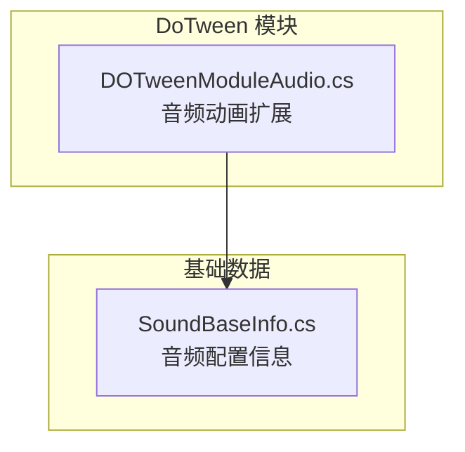
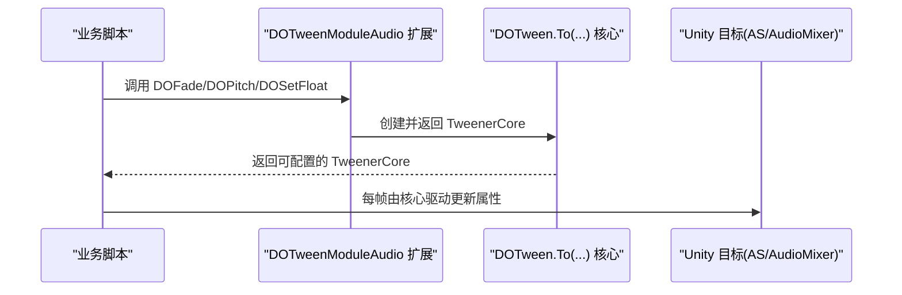
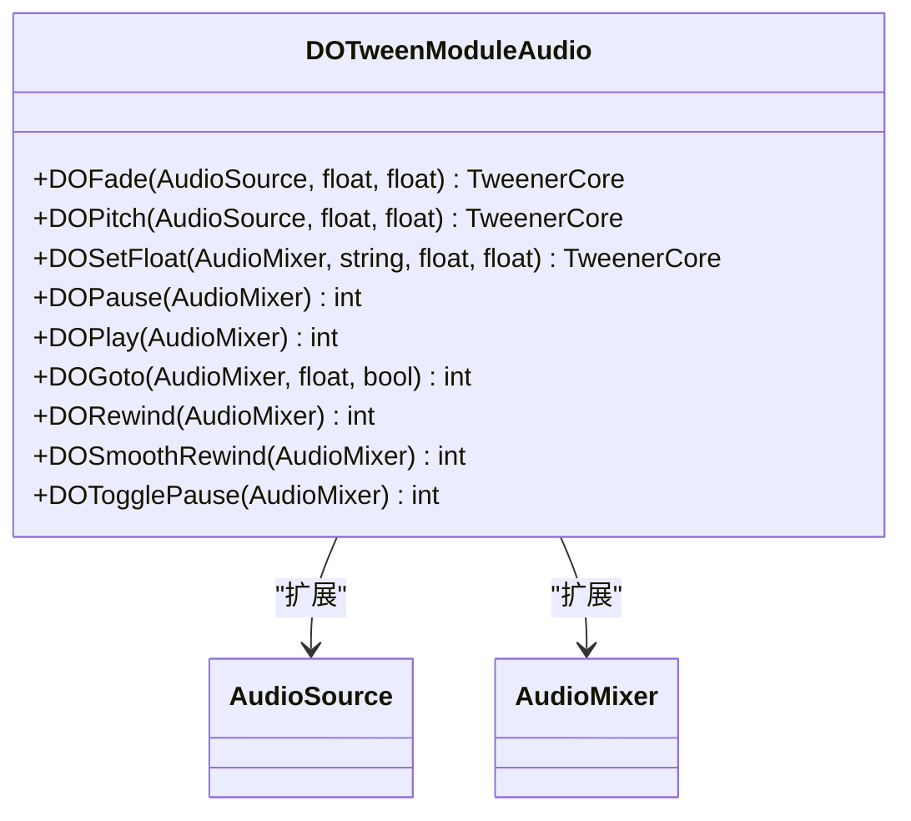

# 音频动画模块 (DOTweenModuleAudio)

<cite>
**本文引用的文件**
- [DOTweenModuleAudio.cs](file://Assets/Game/Framework/DoTween/DOTween/Modules/DOTweenModuleAudio.cs)
- [SoundBaseInfo.cs](file://Assets/Game/Framework/Base/Common/SoundBaseInfo.cs)
</cite>

## 目录
1. [简介](#简介)
2. [项目结构](#项目结构)
3. [核心组件](#核心组件)
4. [架构总览](#架构总览)
5. [详细组件分析](#详细组件分析)
6. [依赖关系分析](#依赖关系分析)
7. [性能与内存优化](#性能与内存优化)
8. [故障排查指南](#故障排查指南)
9. [结论](#结论)
10. [附录：使用示例路径](#附录使用示例路径)

## 简介
本技术文档聚焦于 DOTween 的音频动画扩展模块，围绕 AudioSource 与 AudioMixer 的动画能力进行系统化说明。重点覆盖以下能力：
- DOFade：对 AudioSource 音量进行淡入淡出控制（含范围限制与时间控制）
- DOPitch：对 AudioSource 音调进行平滑变化（频率调整的应用场景）
- DOSetFloat：通过暴露浮点值对 AudioMixer 参数进行动画控制
- 配套操作快捷方法：针对 AudioMixer 目标的生命周期与播放控制（暂停、恢复、跳转、反转等）

该模块以扩展方法形式提供，便于在任意持有 AudioSource 或 AudioMixer 的脚本中直接调用，实现简洁直观的音频动画编排。

## 项目结构
本项目将 DOTween 的音频扩展作为独立模块放置在 DoTween 模块目录下，遵循“按功能域划分”的组织方式。音频相关扩展集中在单一文件中，职责清晰、耦合度低，便于维护与复用。

图表来源
- [DOTweenModuleAudio.cs:1-199](file://Assets/Game/Framework/DoTween/DOTween/Modules/DOTweenModuleAudio.cs#L1-L199)
- [SoundBaseInfo.cs:1-88](file://Assets/Game/Framework/Base/Common/SoundBaseInfo.cs#L1-L88)

章节来源
- [DOTweenModuleAudio.cs:1-199](file://Assets/Game/Framework/DoTween/DOTween/Modules/DOTweenModuleAudio.cs#L1-L199)
- [SoundBaseInfo.cs:1-88](file://Assets/Game/Framework/Base/Common/SoundBaseInfo.cs#L1-L88)

## 核心组件
- 类：DOTweenModuleAudio（静态扩展类）
  - 为 UnityEngine.AudioSource 提供 DOFade、DOPitch 扩展方法
  - 为 UnityEngine.AudioMixer 提供 DOSetFloat 扩展方法与一系列生命周期/播放控制快捷方法（如 DOPause、DOPlay、DOGoto、DORewind、DOSmoothRewind、DOTogglePause 等）

关键特性概览
- 返回值类型统一为 TweenerCore<float, float, FloatOptions>，便于链式配置（缓动曲线、延迟、循环、回调等）
- 自动设置目标对象，支持基于目标的过滤操作（例如批量暂停/恢复）
- DOFade 内部对结束值进行边界钳制，确保音量始终处于有效范围

章节来源
- [DOTweenModuleAudio.cs:14-60](file://Assets/Game/Framework/DoTween/DOTween/Modules/DOTweenModuleAudio.cs#L14-L60)

## 架构总览
从调用方到引擎层的简化流程如下：

图表来源
- [DOTweenModuleAudio.cs:23-60](file://Assets/Game/Framework/DoTween/DOTween/Modules/DOTweenModuleAudio.cs#L23-L60)

## 详细组件分析

### AudioSource 动画：DOFade（音量淡入淡出）
- 作用：对 AudioSource.volume 进行数值插值动画，实现淡入淡出效果
- 参数
  - endValue：目标音量，范围被强制限制在 [0, 1]
  - duration：动画时长（秒）
- 行为细节
  - 若传入的 endValue 小于 0，将被修正为 0；大于 1 则修正为 1
  - 使用 DOTween.To 读取当前 volume 并写入新值，形成连续动画
  - 自动设置目标为 AudioSource，便于后续基于目标的操作（如批量暂停/恢复）
- 适用场景
  - 背景音乐进入/退出时的平滑过渡
  - UI 音效的渐入渐出提示
  - 多音轨混音时的动态音量平衡

章节来源
- [DOTweenModuleAudio.cs:20-30](file://Assets/Game/Framework/DoTween/DOTween/Modules/DOTweenModuleAudio.cs#L20-L30)

### AudioSource 动画：DOPitch（音调变化）
- 作用：对 AudioSource.pitch 进行数值插值动画，实现音调的动态变化
- 参数
  - endValue：目标音调倍数（无内置范围限制）
  - duration：动画时长（秒）
- 行为细节
  - 读取当前 pitch 并逐步写入目标值，形成平滑过渡
  - 自动设置目标为 AudioSource，便于后续基于目标的操作
- 应用场景
  - 角色速度变化导致的音效频率偏移（如车辆加速/减速）
  - 环境氛围变化（如水下、隧道回声）
  - 游戏事件反馈（如命中、拾取、技能释放）

章节来源
- [DOTweenModuleAudio.cs:32-40](file://Assets/Game/Framework/DoTween/DOTween/Modules/DOTweenModuleAudio.cs#L32-L40)

### AudioMixer 动画：DOSetFloat（通过暴露浮点值控制混音器参数）
- 作用：对 AudioMixer 上已暴露的浮点参数进行数值插值动画
- 参数
  - floatName：在 AudioMixerGroup 中手动暴露的浮点变量名
  - endValue：目标浮点值
  - duration：动画时长（秒）
- 行为细节
  - 每次动画前通过 GetFloat 获取当前值，再逐步 SetFloat 写入
  - 自动设置目标为 AudioMixer，便于后续基于目标的操作
- 前置条件
  - 必须在 Unity 编辑器中打开对应 AudioMixer，并在目标组中将需要控制的参数“暴露”为浮点变量，且名称一致
- 典型用途
  - 全局音量、BGM 音量、SFX 音量随场景切换平滑过渡
  - 根据玩家状态（如静音、低电量）动态调节混音器参数
  - 配合 UI 滑块实时调节混音器参数

章节来源
- [DOTweenModuleAudio.cs:45-60](file://Assets/Game/Framework/DoTween/DOTween/Modules/DOTweenModuleAudio.cs#L45-L60)

### AudioMixer 操作快捷方法（生命周期与播放控制）
- 提供一组面向 AudioMixer 目标的便捷方法，用于批量管理与其相关的 Tween：
  - 完成/杀死：DOComplete、DOKill
  - 方向/位置：DOFlip、DOGoto
  - 播放控制：DOPause、DOPlay、DOPlayBackwards、DOPlayForward、DOTogglePause
  - 重放/回退：DORestart、DORewind、DOSmoothRewind
- 这些方法均委托至 DOTween 的核心 API，并以目标为筛选依据，适用于集中管理多个混音器动画

章节来源
- [DOTweenModuleAudio.cs:62-190](file://Assets/Game/Framework/DoTween/DOTween/Modules/DOTweenModuleAudio.cs#L62-L190)

### 与音频配置数据的结合
项目中存在 SoundBaseInfo 数据结构，包含音量、渐入/渐出时间与音调范围等字段，可作为 DOFade/DOPitch 的参数来源，实现配置驱动的音频动画。

章节来源
- [SoundBaseInfo.cs:54-86](file://Assets/Game/Framework/Base/Common/SoundBaseInfo.cs#L54-L86)

## 依赖关系分析
- 外部依赖
  - DG.Tweening.Core：TweenerCore 与 To 核心逻辑
  - DG.Tweening.Plugins.Options：FloatOptions 插件选项
  - UnityEngine.Audio：AudioMixer 类型与 GetFloat/SetFloat 接口
- 内部依赖
  - 无强耦合的业务逻辑，仅依赖 DOTween 核心与 Unity 音频系统

图表来源
- [DOTweenModuleAudio.cs:14-60](file://Assets/Game/Framework/DoTween/DOTween/Modules/DOTweenModuleAudio.cs#L14-L60)

章节来源
- [DOTweenModuleAudio.cs:1-199](file://Assets/Game/Framework/DoTween/DOTween/Modules/DOTweenModuleAudio.cs#L1-L199)

## 性能与内存优化
- 避免频繁创建短生命周期 Tween
  - 复用已有 TweenerCore 实例，或在必要时使用 DOKill 及时销毁不再需要的动画
- 合理设置时长与采样频率
  - 过短的时长会导致高频更新，建议根据业务需求权衡时长与流畅度
- 减少不必要的 GetFloat/SetFloat 调用
  - 对于 AudioMixer，尽量合并多个参数的动画，或使用 Sequence 组合，降低每帧开销
- 利用目标过滤批量控制
  - 通过同一目标（如全局混音器）统一管理多个动画，使用 DOPause/DOPlay 等批量方法提升效率
- 注意音量边界处理
  - DOFade 已内置 [0,1] 钳制，无需在业务层重复校验，避免额外分支判断

[本节为通用指导，不直接分析具体文件]

## 故障排查指南
- DOFade 无效或音量异常
  - 检查 endValue 是否超出 [0,1] 范围（模块内会钳制，但建议业务层也做约束）
  - 确认 AudioSource 未被其他代码直接修改 volume
- DOPitch 无效果
  - 确认 AudioSource 正在播放音频
  - 检查目标端点是否在合理范围内（极端值可能导致听感异常）
- DOSetFloat 报错或无效
  - 确认已在 AudioMixer 中正确暴露同名浮点变量
  - 核对 floatName 拼写与大小写是否与暴露名一致
- 动画无法停止或残留
  - 使用 DOKill(target) 清理目标上的所有动画
  - 使用 DOSmoothRewind(target) 平滑回退后再停止

章节来源
- [DOTweenModuleAudio.cs:20-60](file://Assets/Game/Framework/DoTween/DOTween/Modules/DOTweenModuleAudio.cs#L20-L60)
- [DOTweenModuleAudio.cs:62-190](file://Assets/Game/Framework/DoTween/DOTween/Modules/DOTweenModuleAudio.cs#L62-L190)

## 结论
DOTweenModuleAudio 以最小侵入的方式为 Unity 音频系统提供了直观、高效的动画能力。通过对 AudioSource 的 DOFade/DOPitch 以及对 AudioMixer 的 DOSetFloat，开发者可以灵活地实现从单条音效到全局混音器的平滑过渡与动态控制。配合项目中的音频配置数据，可实现配置驱动的音频体验，并通过合理的生命周期管理与性能优化策略，保障运行时的稳定与高效。

[本节为总结性内容，不直接分析具体文件]

## 附录：使用示例路径
以下为常见音频动画场景的参考路径（不包含具体代码，仅供定位）：
- 背景音乐淡入淡出
  - 参考：[DOTweenModuleAudio.cs:20-30](file://Assets/Game/Framework/DoTween/DOTween/Modules/DOTweenModuleAudio.cs#L20-L30)
- 音效播放控制（音调变化）
  - 参考：[DOTweenModuleAudio.cs:32-40](file://Assets/Game/Framework/DoTween/DOTween/Modules/DOTweenModuleAudio.cs#L32-L40)
- 动态音量调节（混音器参数）
  - 参考：[DOTweenModuleAudio.cs:45-60](file://Assets/Game/Framework/DoTween/DOTween/Modules/DOTweenModuleAudio.cs#L45-L60)
- 基于配置的音频动画（音量/音调范围）
  - 参考：[SoundBaseInfo.cs:54-86](file://Assets/Game/Framework/Base/Common/SoundBaseInfo.cs#L54-L86)