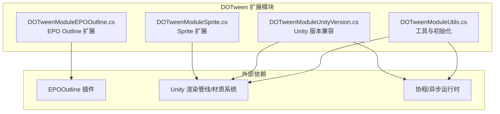
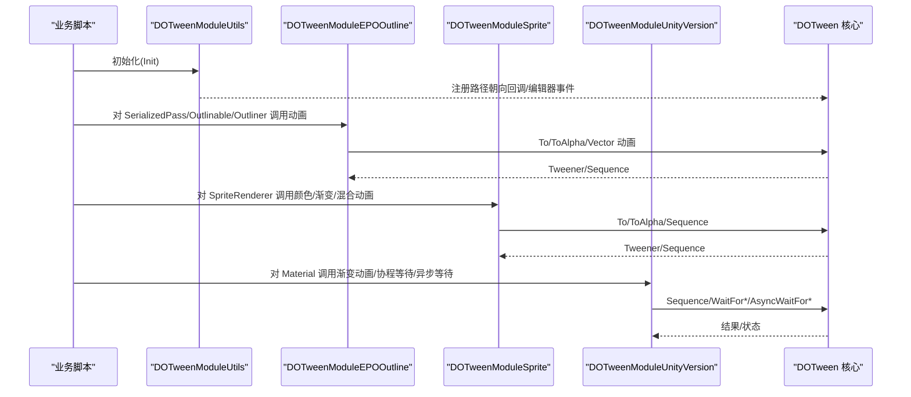
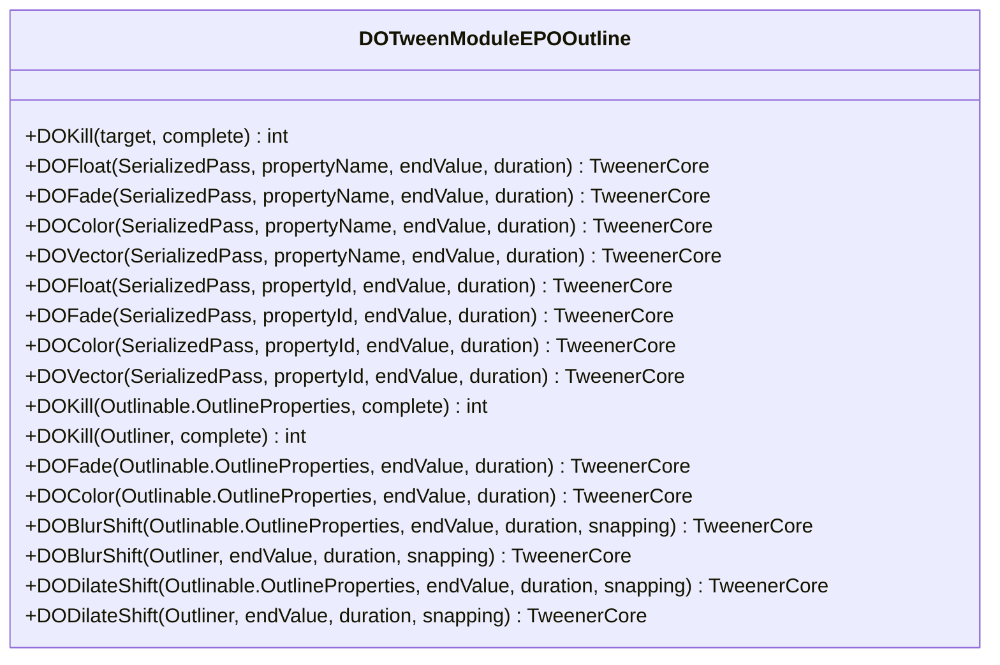
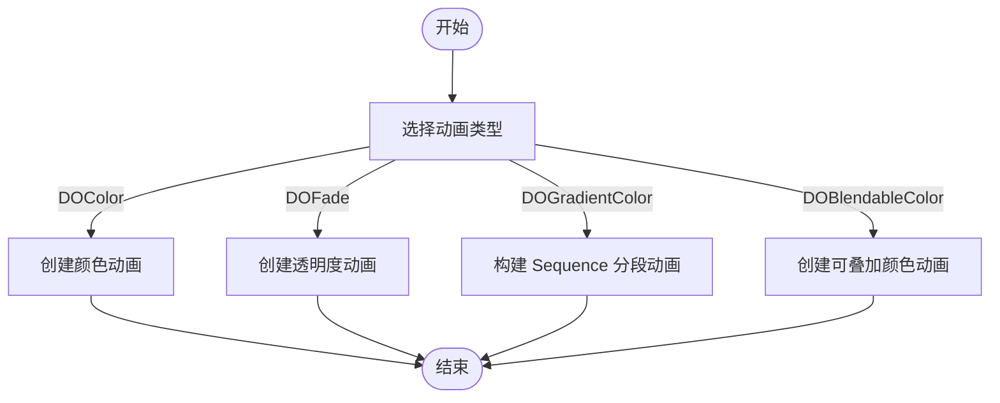
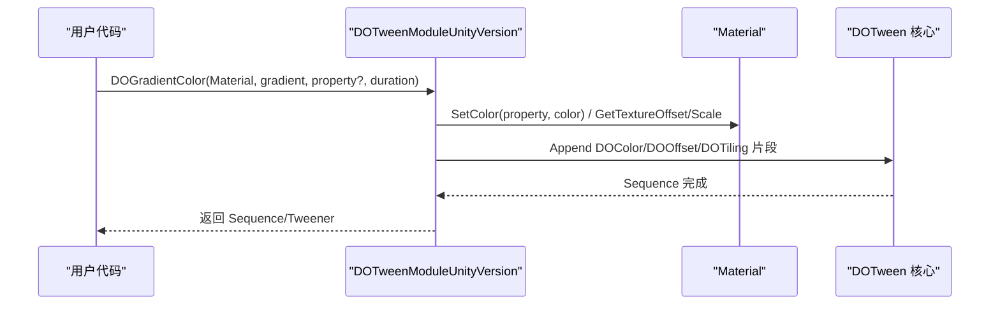
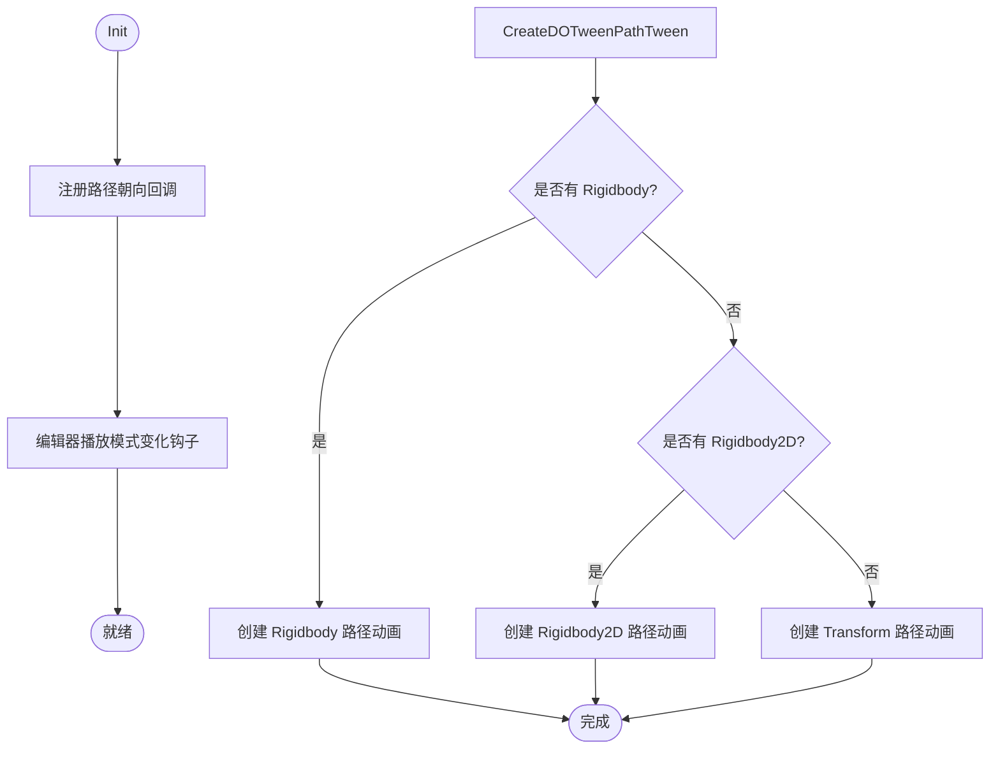
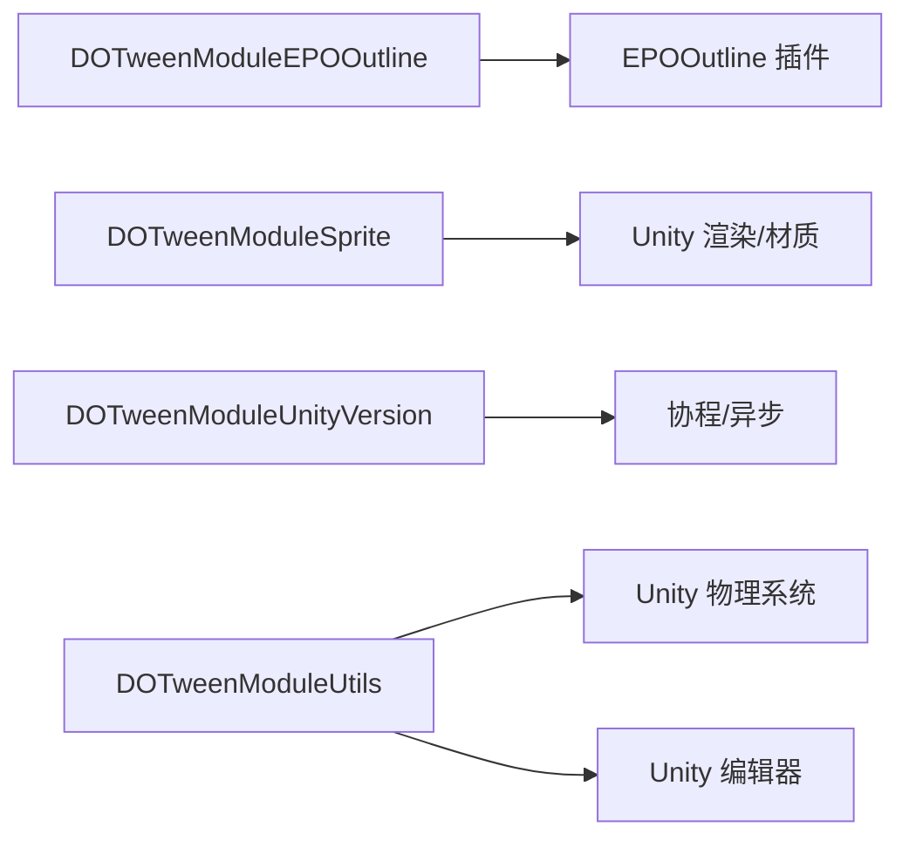

# 高级模块与其他扩展

<cite>
**本文引用的文件**   
- [DOTweenModuleEPOOutline.cs](file://Assets/Game/Framework/DoTween/DOTween/Modules/DOTweenModuleEPOOutline.cs)
- [DOTweenModuleSprite.cs](file://Assets/Game/Framework/DoTween/DOTween/Modules/DOTweenModuleSprite.cs)
- [DOTweenModuleUnityVersion.cs](file://Assets/Game/Framework/DoTween/DOTween/Modules/DOTweenModuleUnityVersion.cs)
- [DOTweenModuleUtils.cs](file://Assets/Game/Framework/DoTween/DOTween/Modules/DOTweenModuleUtils.cs)
- [readme_DOTweenPro.txt](file://Assets/Game/Framework/DoTween/readme_DOTweenPro.txt)
</cite>

## 目录
1. [简介](#简介)
2. [项目结构](#项目结构)
3. [核心组件](#核心组件)
4. [架构总览](#架构总览)
5. [详细组件分析](#详细组件分析)
6. [依赖关系分析](#依赖关系分析)
7. [性能考量](#性能考量)
8. [故障排查指南](#故障排查指南)
9. [结论](#结论)
10. [附录：自定义模块开发指南与实战案例](#附录自定义模块开发指南与实战案例)

## 简介
本技术文档聚焦于 DOTween 的高级模块与扩展能力，围绕以下主题展开：
- EPO Outline 模块（DOTweenModuleEPOOutline）：为 3D 模型添加动态轮廓效果与描边动画。
- Sprite 模块（DOTweenModuleSprite）：对精灵图形的材质属性、颜色、渐变等特效进行动画支持。
- Unity 版本兼容模块（DOTweenModuleUnityVersion）：在不同 Unity 版本下提供一致的 API 体验，包括协程等待与异步等待。
- 工具模块（DOTweenModuleUtils）：提供模块初始化、路径朝向设置、物理组件检测等辅助功能。
- 自定义模块开发方法：如何扩展 DOTween 以支持新的 Unity 组件或第三方插件。
- 实战应用案例：组合使用上述模块实现创意动画效果。
- 集成注意事项与性能优化建议。

## 项目结构
本项目将 DOTween 的扩展模块统一放置在 Modules 目录下，按功能划分：
- EPO Outline 扩展：针对 EPO Outline 插件的 SerializedPass、Outlinable.OutlineProperties、Outliner 等类型提供便捷动画接口。
- Sprite 扩展：为 SpriteRenderer 提供颜色、透明度、渐变颜色以及可叠加的颜色混合动画。
- Unity 版本兼容：提供跨版本的 Material 渐变动画、协程等待指令与 .NET 4.6+ 的异步等待扩展。
- 工具模块：负责模块初始化、编辑器播放状态同步、路径朝向设置、Rigidbody/Rigidbody2D 检测与路径动画创建。

图表来源
- [DOTweenModuleEPOOutline.cs:1-147](file://Assets/Game/Framework/DoTween/DOTween/Modules/DOTweenModuleEPOOutline.cs#L1-L147)
- [DOTweenModuleSprite.cs:1-94](file://Assets/Game/Framework/DoTween/DOTween/Modules/DOTweenModuleSprite.cs#L1-L94)
- [DOTweenModuleUnityVersion.cs:1-390](file://Assets/Game/Framework/DoTween/DOTween/Modules/DOTweenModuleUnityVersion.cs#L1-L390)
- [DOTweenModuleUtils.cs:1-168](file://Assets/Game/Framework/DoTween/DOTween/Modules/DOTweenModuleUtils.cs#L1-L168)

章节来源
- [DOTweenModuleEPOOutline.cs:1-147](file://Assets/Game/Framework/DoTween/DOTween/Modules/DOTweenModuleEPOOutline.cs#L1-L147)
- [DOTweenModuleSprite.cs:1-94](file://Assets/Game/Framework/DoTween/DOTween/Modules/DOTweenModuleSprite.cs#L1-L94)
- [DOTweenModuleUnityVersion.cs:1-390](file://Assets/Game/Framework/DoTween/DOTween/Modules/DOTweenModuleUnityVersion.cs#L1-L390)
- [DOTweenModuleUtils.cs:1-168](file://Assets/Game/Framework/DoTween/DOTween/Modules/DOTweenModuleUtils.cs#L1-L168)

## 核心组件
本节概述各模块的职责与关键能力：
- EPO Outline 模块：为 SerializedPass 提供基于属性名或属性 ID 的 float/color/vector 动画；为 Outlinable.OutlineProperties 和 Outliner 提供轮廓颜色、透明度、模糊偏移、膨胀偏移等动画。
- Sprite 模块：为 SpriteRenderer 提供 DOColor、DOFade、DOGradientColor 以及可叠加的 DOBlendableColor。
- Unity 版本兼容模块：提供 Material 渐变动画、协程等待指令（WaitForCompletion/Start/Kill/Position/ElapsedLoops）、在较新 Unity 与 .NET 环境下提供 AsyncWaitFor* 系列异步等待。
- 工具模块：Init 初始化回调注册、编辑器播放模式变化时触发暂停事件、路径朝向设置、Rigidbody/Rigidbody2D 存在性检测、创建路径动画（优先 Rigidbody，其次 Transform）。

章节来源
- [DOTweenModuleEPOOutline.cs:1-147](file://Assets/Game/Framework/DoTween/DOTween/Modules/DOTweenModuleEPOOutline.cs#L1-L147)
- [DOTweenModuleSprite.cs:1-94](file://Assets/Game/Framework/DoTween/DOTween/Modules/DOTweenModuleSprite.cs#L1-L94)
- [DOTweenModuleUnityVersion.cs:1-390](file://Assets/Game/Framework/DoTween/DOTween/Modules/DOTweenModuleUnityVersion.cs#L1-L390)
- [DOTweenModuleUtils.cs:1-168](file://Assets/Game/Framework/DoTween/DOTween/Modules/DOTweenModuleUtils.cs#L1-L168)

## 架构总览
下图展示了模块间的调用关系与数据流向：
- 上层业务通过扩展方法调用具体模块提供的动画接口。
- 模块内部委托给 DOTween 核心（To/ToAlpha/Sequence），并设置目标对象与选项。
- 工具模块负责初始化与平台差异处理。

图表来源
- [DOTweenModuleUtils.cs:38-78](file://Assets/Game/Framework/DoTween/DOTween/Modules/DOTweenModuleUtils.cs#L38-L78)
- [DOTweenModuleEPOOutline.cs:14-143](file://Assets/Game/Framework/DoTween/DOTween/Modules/DOTweenModuleEPOOutline.cs#L14-L143)
- [DOTweenModuleSprite.cs:22-84](file://Assets/Game/Framework/DoTween/DOTween/Modules/DOTweenModuleSprite.cs#L22-L84)
- [DOTweenModuleUnityVersion.cs:27-70](file://Assets/Game/Framework/DoTween/DOTween/Modules/DOTweenModuleUnityVersion.cs#L27-L70)

## 详细组件分析

### EPO Outline 模块（DOTweenModuleEPOOutline）
该模块为 EPO Outline 相关类型提供丰富的动画扩展：
- SerializedPass：支持按属性名或属性 ID 的 float/color/vector 动画，以及透明度动画。
- Outlinable.OutlineProperties：支持轮廓颜色、透明度、模糊偏移、膨胀偏移等动画。
- Outliner：支持模糊偏移、膨胀偏移等全局控制动画。

图表来源
- [DOTweenModuleEPOOutline.cs:12-144](file://Assets/Game/Framework/DoTween/DOTween/Modules/DOTweenModuleEPOOutline.cs#L12-L144)

章节来源
- [DOTweenModuleEPOOutline.cs:14-143](file://Assets/Game/Framework/DoTween/DOTween/Modules/DOTweenModuleEPOOutline.cs#L14-L143)

### Sprite 模块（DOTweenModuleSprite）
该模块为 SpriteRenderer 提供常用动画：
- DOColor：直接改变颜色。
- DOFade：仅改变透明度。
- DOGradientColor：基于 Gradient 生成 Sequence，逐段线性过渡颜色。
- DOBlendableColor：可叠加的颜色混合动画，避免多个 DOColor 相互覆盖。

图表来源
- [DOTweenModuleSprite.cs:22-84](file://Assets/Game/Framework/DoTween/DOTween/Modules/DOTweenModuleSprite.cs#L22-L84)

章节来源
- [DOTweenModuleSprite.cs:19-84](file://Assets/Game/Framework/DoTween/DOTween/Modules/DOTweenModuleSprite.cs#L19-L84)

### Unity 版本兼容模块（DOTweenModuleUnityVersion）
该模块提供跨版本一致性与增强能力：
- Material 渐变动画：DOGradientColor（默认 color 或指定属性名）。
- 协程等待指令：WaitForCompletion/Start/Kill/Position/ElapsedLoops。
- 异步等待（.NET 4.6+/标准库）：AsyncWaitForCompletion/Start/Kill/Position/ElapsedLoops。
- 纹理偏移与缩放（Unity 2018.1+）：DOOffset/DOTiling（按属性 ID）。

图表来源
- [DOTweenModuleUnityVersion.cs:27-70](file://Assets/Game/Framework/DoTween/DOTween/Modules/DOTweenModuleUnityVersion.cs#L27-L70)
- [DOTweenModuleUnityVersion.cs:176-201](file://Assets/Game/Framework/DoTween/DOTween/Modules/DOTweenModuleUnityVersion.cs#L176-L201)

章节来源
- [DOTweenModuleUnityVersion.cs:27-70](file://Assets/Game/Framework/DoTween/DOTween/Modules/DOTweenModuleUnityVersion.cs#L27-L70)
- [DOTweenModuleUnityVersion.cs:176-201](file://Assets/Game/Framework/DoTween/DOTween/Modules/DOTweenModuleUnityVersion.cs#L176-L201)
- [DOTweenModuleUnityVersion.cs:81-162](file://Assets/Game/Framework/DoTween/DOTween/Modules/DOTweenModuleUnityVersion.cs#L81-L162)
- [DOTweenModuleUnityVersion.cs:216-296](file://Assets/Game/Framework/DoTween/DOTween/Modules/DOTweenModuleUnityVersion.cs#L216-L296)

### 工具模块（DOTweenModuleUtils）
该模块提供基础能力与平台适配：
- Init：注册路径朝向回调、编辑器播放模式变化事件。
- Physics.SetOrientationOnPath：根据是否启用 Rigidbody 设置旋转。
- HasRigidbody/HasRigidbody2D：反射检测物理组件是否存在。
- CreateDOTweenPathTween：智能创建路径动画（优先 Rigidbody，其次 Rigidbody2D，最后 Transform）。

图表来源
- [DOTweenModuleUtils.cs:38-78](file://Assets/Game/Framework/DoTween/DOTween/Modules/DOTweenModuleUtils.cs#L38-L78)
- [DOTweenModuleUtils.cs:88-96](file://Assets/Game/Framework/DoTween/DOTween/Modules/DOTweenModuleUtils.cs#L88-L96)
- [DOTweenModuleUtils.cs:116-123](file://Assets/Game/Framework/DoTween/DOTween/Modules/DOTweenModuleUtils.cs#L116-L123)
- [DOTweenModuleUtils.cs:129-162](file://Assets/Game/Framework/DoTween/DOTween/Modules/DOTweenModuleUtils.cs#L129-L162)

章节来源
- [DOTweenModuleUtils.cs:38-78](file://Assets/Game/Framework/DoTween/DOTween/Modules/DOTweenModuleUtils.cs#L38-L78)
- [DOTweenModuleUtils.cs:88-96](file://Assets/Game/Framework/DoTween/DOTween/Modules/DOTweenModuleUtils.cs#L88-L96)
- [DOTweenModuleUtils.cs:116-123](file://Assets/Game/Framework/DoTween/DOTween/Modules/DOTweenModuleUtils.cs#L116-L123)
- [DOTweenModuleUtils.cs:129-162](file://Assets/Game/Framework/DoTween/DOTween/Modules/DOTweenModuleUtils.cs#L129-L162)

## 依赖关系分析
- 模块间耦合度低，均通过静态扩展方法暴露 API，便于按需启用。
- EPO Outline 模块依赖 EPOOutline 插件类型；Sprite 模块依赖 Unity 渲染与材质系统；Unity 版本兼容模块依赖协程与 .NET 任务；工具模块依赖 Unity 编辑器与物理系统。
- 无循环依赖，职责清晰。

图表来源
- [DOTweenModuleEPOOutline.cs:1-147](file://Assets/Game/Framework/DoTween/DOTween/Modules/DOTweenModuleEPOOutline.cs#L1-L147)
- [DOTweenModuleSprite.cs:1-94](file://Assets/Game/Framework/DoTween/DOTween/Modules/DOTweenModuleSprite.cs#L1-L94)
- [DOTweenModuleUnityVersion.cs:1-390](file://Assets/Game/Framework/DoTween/DOTween/Modules/DOTweenModuleUnityVersion.cs#L1-L390)
- [DOTweenModuleUtils.cs:1-168](file://Assets/Game/Framework/DoTween/DOTween/Modules/DOTweenModuleUtils.cs#L1-L168)

章节来源
- [DOTweenModuleEPOOutline.cs:1-147](file://Assets/Game/Framework/DoTween/DOTween/Modules/DOTweenModuleEPOOutline.cs#L1-L147)
- [DOTweenModuleSprite.cs:1-94](file://Assets/Game/Framework/DoTween/DOTween/Modules/DOTweenModuleSprite.cs#L1-L94)
- [DOTweenModuleUnityVersion.cs:1-390](file://Assets/Game/Framework/DoTween/DOTween/Modules/DOTweenModuleUnityVersion.cs#L1-L390)
- [DOTweenModuleUtils.cs:1-168](file://Assets/Game/Framework/DoTween/DOTween/Modules/DOTweenModuleUtils.cs#L1-L168)

## 性能考量
- 合理使用 DOBlendableColor 替代多 DOColor 叠加，减少冲突与额外计算。
- 使用 DOGradientColor 时注意分段数量与总时长，避免过多分段导致 GC 与 CPU 开销。
- 对大量对象的轮廓动画（EPO Outline）应控制同时活跃的数量，必要时结合对象池与批量更新策略。
- 路径动画优先使用 Rigidbody/Rigidbody2D 时，确保物理组件存在且配置合理，避免不必要的 Transform 插值。
- 在较新版本 Unity 中使用 DOOffset/DOTiling 前检查材质属性是否存在，避免无效调用。

[本节为通用指导，不直接分析具体文件]

## 故障排查指南
- 升级后未正确激活模块：请通过“Tools > Demigiant > DOTween Utility Panel”运行“Setup DOTween...”并在 Add/Remove Modules 面板中启用所需模块。
- 编辑器模式下动画异常：工具模块已订阅编辑器播放模式变化，若仍出现异常，检查是否在编辑器暂停时触发了非预期逻辑。
- 路径动画未生效：确认目标对象是否包含 Rigidbody/Rigidbody2D，或使用 CreateDOTweenPathTween 的智能分支逻辑。
- Material 属性不存在：DOOffset/DOTiling 会检查属性 ID 是否存在，若缺失将返回空并记录日志，需确保材质包含对应属性。

章节来源
- [readme_DOTweenPro.txt:1-15](file://Assets/Game/Framework/DoTween/readme_DOTweenPro.txt#L1-L15)
- [DOTweenModuleUtils.cs:45-78](file://Assets/Game/Framework/DoTween/DOTween/Modules/DOTweenModuleUtils.cs#L45-L78)
- [DOTweenModuleUtils.cs:129-162](file://Assets/Game/Framework/DoTween/DOTween/Modules/DOTweenModuleUtils.cs#L129-L162)
- [DOTweenModuleUnityVersion.cs:176-201](file://Assets/Game/Framework/DoTween/DOTween/Modules/DOTweenModuleUnityVersion.cs#L176-L201)

## 结论
通过对 EPO Outline、Sprite、Unity 版本兼容与工具模块的系统化分析，可以高效地为 3D 模型与 2D 精灵添加丰富动画，并在不同 Unity 版本下保持稳定的 API 行为。结合工具模块的路径与物理检测能力，可实现更自然的运动与交互。建议在项目中按需启用模块，遵循性能最佳实践，并通过实用面板完成模块激活与配置。

[本节为总结性内容，不直接分析具体文件]

## 附录：自定义模块开发指南与实战案例

### 自定义模块开发步骤
- 新建静态类并置于 Modules 目录，命名规范参考现有模块（如 DOTweenModuleYourFeature）。
- 使用条件编译宏控制模块启用（例如 #if YOUR_FEATURE_MARKER），以便通过工具面板管理。
- 为目标类型提供扩展方法，内部委托到 DOTween.To/ToAlpha/Sequence，并设置 SetTarget 与 SetOptions。
- 如需平台差异或外部依赖，参考 DOTweenModuleUnityVersion 与 DOTweenModuleUtils 的实现方式。
- 在工具面板中注册模块定义，确保可按需启用/禁用。

章节来源
- [DOTweenModuleEPOOutline.cs:1-147](file://Assets/Game/Framework/DoTween/DOTween/Modules/DOTweenModuleEPOOutline.cs#L1-L147)
- [DOTweenModuleSprite.cs:1-94](file://Assets/Game/Framework/DoTween/DOTween/Modules/DOTweenModuleSprite.cs#L1-L94)
- [DOTweenModuleUnityVersion.cs:1-390](file://Assets/Game/Framework/DoTween/DOTween/Modules/DOTweenModuleUnityVersion.cs#L1-L390)
- [DOTweenModuleUtils.cs:1-168](file://Assets/Game/Framework/DoTween/DOTween/Modules/DOTweenModuleUtils.cs#L1-L168)
- [readme_DOTweenPro.txt:10-15](file://Assets/Game/Framework/DoTween/readme_DOTweenPro.txt#L10-L15)

### 实战案例：组合使用实现创意动画
- 角色高亮与提示：使用 EPO Outline 的 DOFade/DOColor 对选中角色轮廓进行呼吸式闪烁，配合 DOBlurShift/DODilateShift 强调焦点。
- UI 元素入场：使用 Sprite 模块的 DOGradientColor 为按钮图标做渐变色入场，再叠加 DOBlendableColor 实现点击反馈。
- 场景转场：使用 Unity 版本兼容模块的 Material DOGradientColor 对场景材质进行整体色调过渡，提升视觉连贯性。
- 路径移动：使用工具模块的 CreateDOTweenPathTween 自动选择 Rigidbody/Rigidbody2D/Transform 进行路径动画，简化业务逻辑。

[本节为概念性说明，不直接分析具体文件]