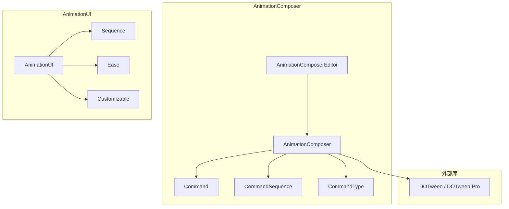
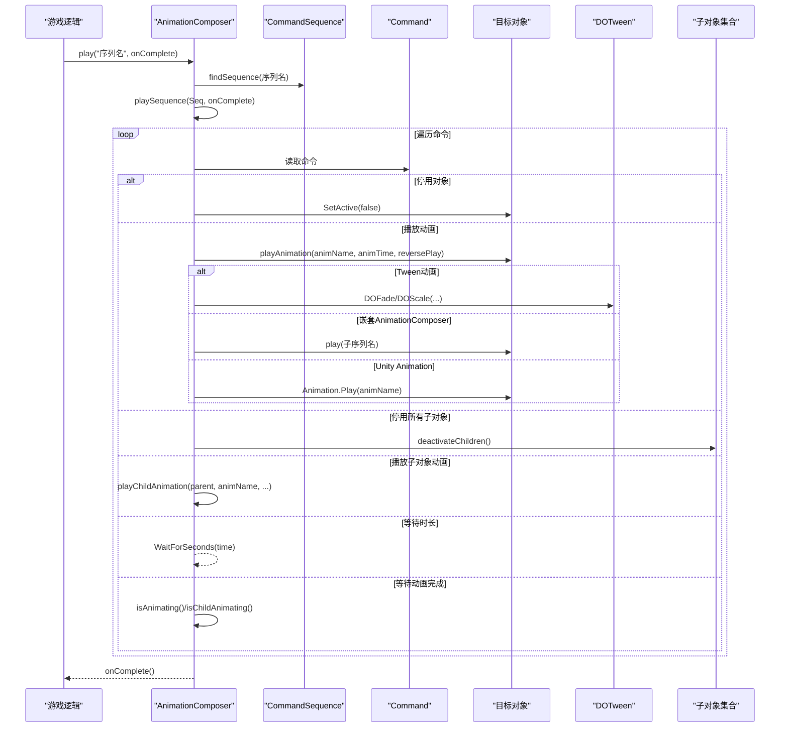
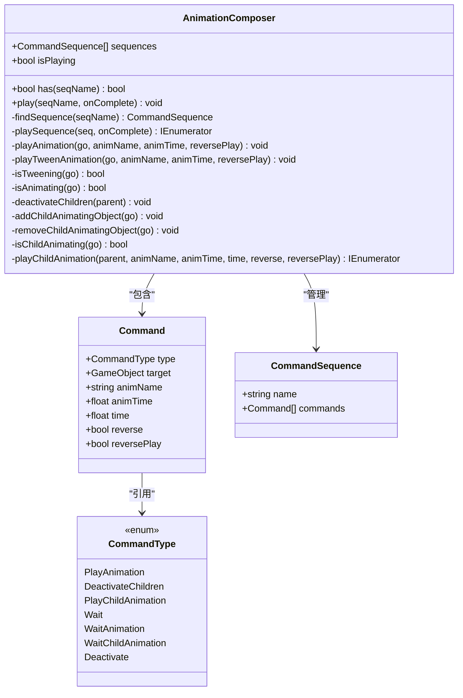
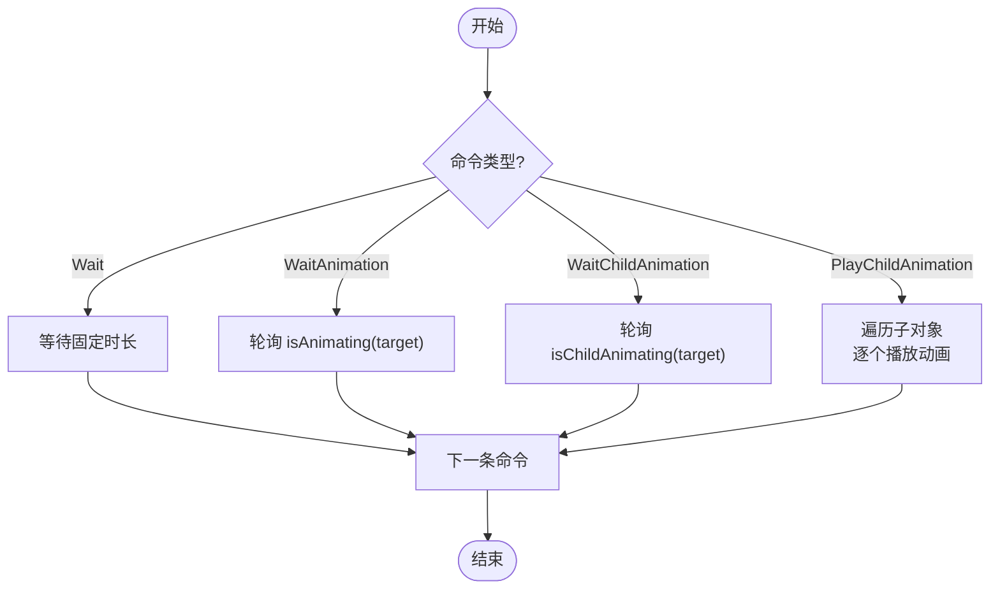
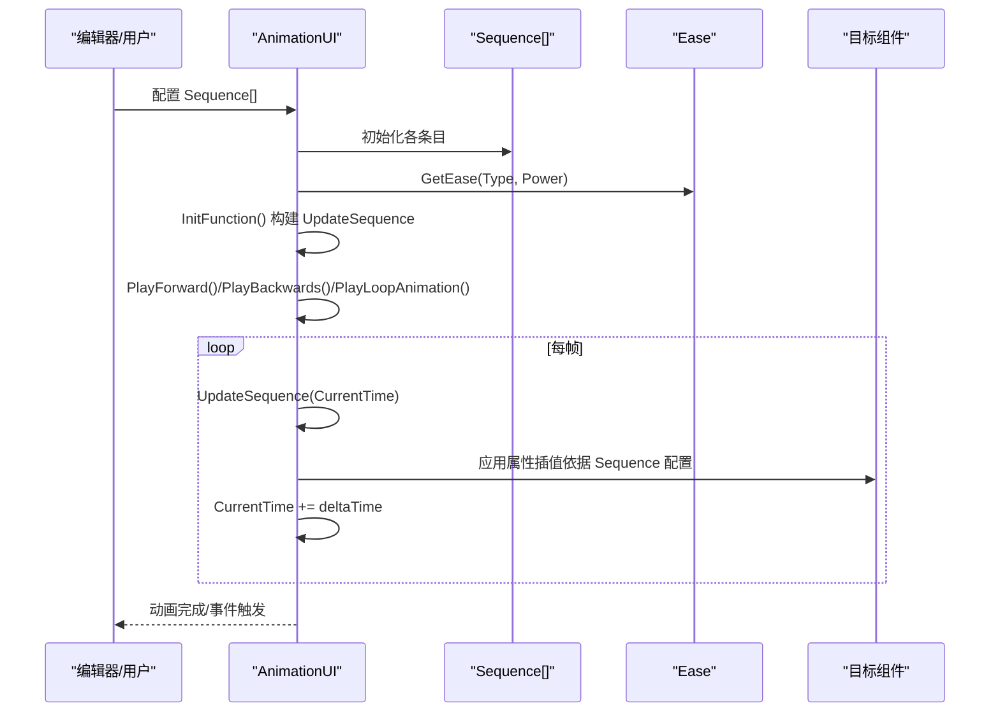
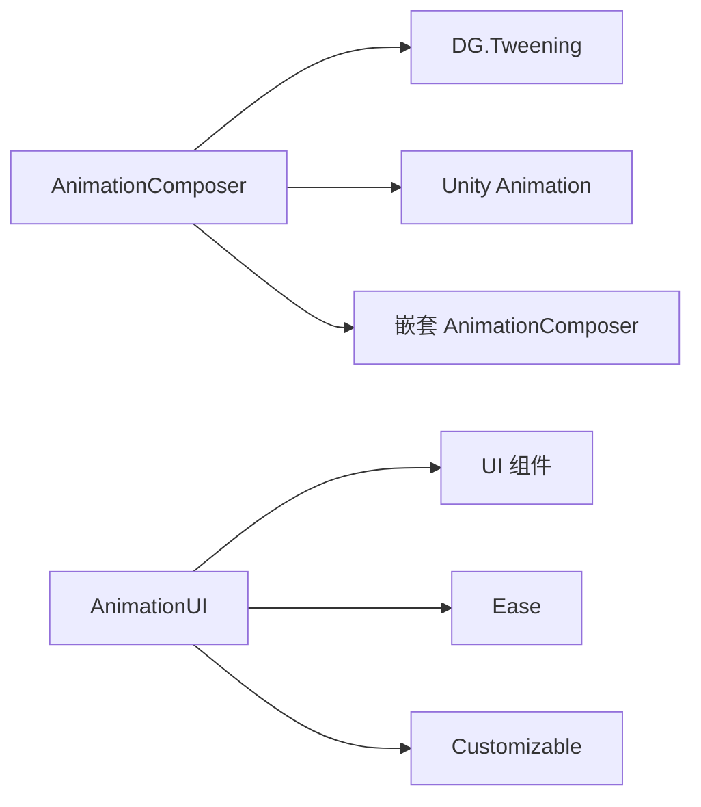

# 动画系统

<cite>
**本文引用的文件**   
- [AnimationComposer.cs](file://Assets/Game/Framework/AnimationComposer/AnimationComposer.cs)
- [Command.cs](file://Assets/Game/Framework/AnimationComposer/Command.cs)
- [CommandSequence.cs](file://Assets/Game/Framework/AnimationComposer/CommandSequence.cs)
- [CommandType.cs](file://Assets/Game/Framework/AnimationComposer/CommandType.cs)
- [AnimationComposerEditor.cs](file://Assets/Game/Framework/AnimationComposer/Editor/AnimationComposerEditor.cs)
- [AnimationUI.cs](file://Assets/Game/Framework/AnimationUI/Script/AnimationUI.cs)
- [Sequence.cs](file://Assets/Game/Framework/AnimationUI/Script/Sequence.cs)
- [Ease.cs](file://Assets/Game/Framework/AnimationUI/Script/Ease.cs)
- [Customizable.cs](file://Assets/Game/Framework/AnimationUI/Script/Customizable.cs)
- [readme_DOTweenPro.txt](file://Assets/Game/Framework/DoTween/readme_DOTweenPro.txt)
</cite>

## 目录
1. [简介](#简介)
2. [项目结构](#项目结构)
3. [核心组件](#核心组件)
4. [架构总览](#架构总览)
5. [详细组件分析](#详细组件分析)
6. [依赖关系分析](#依赖关系分析)
7. [性能与内存优化](#性能与内存优化)
8. [故障排查指南](#故障排查指南)
9. [结论](#结论)
10. [附录：使用示例与最佳实践](#附录使用示例与最佳实践)

## 简介
本技术文档面向 SimulationClient 的动画系统，重点围绕 AnimationComposer 动画编排器与 AnimationUI 时间轴系统展开。内容涵盖：
- 动画序列定义、时间轴管理与状态切换
- DOTween Pro 动画库集成（淡入淡出、缩放等）
- 架构设计、性能优化与内存管理
- 与 UI 系统和游戏逻辑的集成方式
- 调试工具与性能监控的最佳实践

## 项目结构
动画系统由两大子系统构成：
- AnimationComposer：基于命令序列的通用动画编排器，支持 Unity Animation、DOTween 以及嵌套的 AnimationComposer 组合播放。
- AnimationUI：面向 UI 的时间轴系统，提供可视化编辑、缓动函数、多目标属性动画与事件触发。

图表来源
- [AnimationComposer.cs:1-316](file://Assets/Game/Framework/AnimationComposer/AnimationComposer.cs#L1-L316)
- [Command.cs:1-48](file://Assets/Game/Framework/AnimationComposer/Command.cs#L1-L48)
- [CommandSequence.cs:1-21](file://Assets/Game/Framework/AnimationComposer/CommandSequence.cs#L1-L21)
- [CommandType.cs:1-43](file://Assets/Game/Framework/AnimationComposer/CommandType.cs#L1-L43)
- [AnimationComposerEditor.cs:1-263](file://Assets/Game/Framework/AnimationComposer/Editor/AnimationComposerEditor.cs#L1-L263)
- [AnimationUI.cs:1-800](file://Assets/Game/Framework/AnimationUI/Script/AnimationUI.cs#L1-L800)
- [Sequence.cs:1-275](file://Assets/Game/Framework/AnimationUI/Script/Sequence.cs#L1-L275)
- [Ease.cs:1-124](file://Assets/Game/Framework/AnimationUI/Script/Ease.cs#L1-L124)
- [Customizable.cs:1-25](file://Assets/Game/Framework/AnimationUI/Script/Customizable.cs#L1-L25)

章节来源
- [AnimationComposer.cs:1-316](file://Assets/Game/Framework/AnimationComposer/AnimationComposer.cs#L1-L316)
- [AnimationUI.cs:1-800](file://Assets/Game/Framework/AnimationUI/Script/AnimationUI.cs#L1-L800)

## 核心组件
- AnimationComposer：负责按顺序执行命令序列，协调多个对象及子对象的动画；支持等待、停用对象、播放指定动画或子对象动画、递归检测动画完成等。
- Command/CommandSequence/CommandType：描述动画命令的数据结构与类型枚举。
- AnimationComposerEditor：编辑器侧的可视化编排界面，支持增删改查命令与序列。
- AnimationUI：基于时间轴的 UI 动画系统，支持多种目标类型（RectTransform、Transform、Image、CanvasGroup、Camera、TextMeshPro）与缓动函数。
- Sequence/Ease/Customizable：时间轴条目、缓动函数与可定制行为（如音效、输入开关）。

章节来源
- [AnimationComposer.cs:1-316](file://Assets/Game/Framework/AnimationComposer/AnimationComposer.cs#L1-L316)
- [Command.cs:1-48](file://Assets/Game/Framework/AnimationComposer/Command.cs#L1-L48)
- [CommandSequence.cs:1-21](file://Assets/Game/Framework/AnimationComposer/CommandSequence.cs#L1-L21)
- [CommandType.cs:1-43](file://Assets/Game/Framework/AnimationComposer/CommandType.cs#L1-L43)
- [AnimationComposerEditor.cs:1-263](file://Assets/Game/Framework/AnimationComposer/Editor/AnimationComposerEditor.cs#L1-L263)
- [AnimationUI.cs:1-800](file://Assets/Game/Framework/AnimationUI/Script/AnimationUI.cs#L1-L800)
- [Sequence.cs:1-275](file://Assets/Game/Framework/AnimationUI/Script/Sequence.cs#L1-L275)
- [Ease.cs:1-124](file://Assets/Game/Framework/AnimationUI/Script/Ease.cs#L1-L124)
- [Customizable.cs:1-25](file://Assets/Game/Framework/AnimationUI/Script/Customizable.cs#L1-L25)

## 架构总览
AnimationComposer 作为“编排器”，将复杂的多对象动画拆分为可维护的命令序列；AnimationUI 则提供“时间轴”式的声明式动画配置，两者互补：前者适合运行时动态编排与跨对象协作，后者适合 UI 场景下的可视化设计与预览。

图表来源
- [AnimationComposer.cs:78-120](file://Assets/Game/Framework/AnimationComposer/AnimationComposer.cs#L78-L120)
- [AnimationComposer.cs:208-242](file://Assets/Game/Framework/AnimationComposer/AnimationComposer.cs#L208-L242)
- [AnimationComposer.cs:299-315](file://Assets/Game/Framework/AnimationComposer/AnimationComposer.cs#L299-L315)

## 详细组件分析

### AnimationComposer 动画编排器
- 职责
  - 维护并查找命令序列
  - 顺序执行命令，支持等待、停用、播放动画（含子对象批量播放）
  - 识别并调度 DOTween、Unity Animation、嵌套 AnimationComposer
  - 跟踪当前是否正在播放，避免重入
- 关键流程
  - play(seqName, onComplete)：校验状态、查找序列、启动协程
  - playSequence(seq, onComplete)：遍历命令，分支处理不同类型
  - playAnimation(go, animName, animTime, reversePlay)：分派到 Tween/嵌套/Animation
  - playChildAnimation(parent, animName, animTime, time, reverse, reversePlay)：按顺序或逆序对子对象逐一播放，支持间隔
- 数据模型
  - Command：命令类型、目标对象、动画名称、时长、间隔、反向遍历、反播
  - CommandSequence：序列名称与命令列表
  - CommandType：PlayAnimation、DeactivateChildren、PlayChildAnimation、Wait、WaitAnimation、WaitChildAnimation、Deactivate

图表来源
- [AnimationComposer.cs:18-316](file://Assets/Game/Framework/AnimationComposer/AnimationComposer.cs#L18-L316)
- [Command.cs:10-47](file://Assets/Game/Framework/AnimationComposer/Command.cs#L10-L47)
- [CommandSequence.cs:8-20](file://Assets/Game/Framework/AnimationComposer/CommandSequence.cs#L8-L20)
- [CommandType.cs:6-42](file://Assets/Game/Framework/AnimationComposer/CommandType.cs#L6-L42)

章节来源
- [AnimationComposer.cs:18-316](file://Assets/Game/Framework/AnimationComposer/AnimationComposer.cs#L18-L316)
- [Command.cs:10-47](file://Assets/Game/Framework/AnimationComposer/Command.cs#L10-L47)
- [CommandSequence.cs:8-20](file://Assets/Game/Framework/AnimationComposer/CommandSequence.cs#L8-L20)
- [CommandType.cs:6-42](file://Assets/Game/Framework/AnimationComposer/CommandType.cs#L6-L42)

#### DOTween 集成与基础效果
- 支持的内置 Tween 动画名称：_fade（透明度）、_zoom（缩放）
- 实现要点
  - _fade：为对象添加 CanvasGroup，设置初始 alpha，调用 DOFade
  - _zoom：设置初始 localScale，调用 DOScale
  - 通过 IsTweening 判断是否仍在播放
- 典型用法路径
  - 在命令中设置 animName="_fade"/"_zoom"，并配置 animTime 与 reversePlay

章节来源
- [AnimationComposer.cs:127-166](file://Assets/Game/Framework/AnimationComposer/AnimationComposer.cs#L127-L166)
- [AnimationComposer.cs:173-181](file://Assets/Game/Framework/AnimationComposer/AnimationComposer.cs#L173-L181)
- [readme_DOTweenPro.txt:1-35](file://Assets/Game/Framework/DoTween/readme_DOTweenPro.txt#L1-L35)

#### 子对象动画与等待机制
- 子对象动画：按顺序或逆序遍历父对象子节点，逐个播放指定动画，支持间隔时间
- 等待机制：
  - Wait：固定时长等待
  - WaitAnimation：等待目标对象自身动画完成（包括 Tween、嵌套 AC、Unity Animation）
  - WaitChildAnimation：等待目标对象及其子树动画全部完成

图表来源
- [AnimationComposer.cs:78-120](file://Assets/Game/Framework/AnimationComposer/AnimationComposer.cs#L78-L120)
- [AnimationComposer.cs:285-297](file://Assets/Game/Framework/AnimationComposer/AnimationComposer.cs#L285-L297)
- [AnimationComposer.cs:299-315](file://Assets/Game/Framework/AnimationComposer/AnimationComposer.cs#L299-L315)

章节来源
- [AnimationComposer.cs:78-120](file://Assets/Game/Framework/AnimationComposer/AnimationComposer.cs#L78-L120)
- [AnimationComposer.cs:285-315](file://Assets/Game/Framework/AnimationComposer/AnimationComposer.cs#L285-L315)

### AnimationUI 时间轴系统
- 职责
  - 以时间轴形式声明 UI 动画，支持正向、反向、循环播放
  - 针对多种 UI 组件属性进行插值动画（位置、缩放、角度、颜色、填充量、Alpha、相机背景色与正交大小、文本可见字符数等）
  - 提供缓动函数选择与动态事件回调
- 关键流程
  - InitFunction：根据配置的 Sequence 数组构建 UpdateSequence 委托链
  - PlayForward/PlayBackwards/PlayLoopAnimation：驱动时间推进与帧更新
  - Complete：直接跳转到总时长并反向执行事件
- 数据结构
  - Sequence：单条时间轴条目，包含类型、目标类型、起止状态、时长、缓动等
  - Ease：缓动函数工厂，支持 In/Out/InOut/OutBack 与不同幂次

图表来源
- [AnimationUI.cs:43-163](file://Assets/Game/Framework/AnimationUI/Script/AnimationUI.cs#L43-L163)
- [AnimationUI.cs:165-236](file://Assets/Game/Framework/AnimationUI/Script/AnimationUI.cs#L165-L236)
- [Sequence.cs:8-275](file://Assets/Game/Framework/AnimationUI/Script/Sequence.cs#L8-L275)
- [Ease.cs:84-122](file://Assets/Game/Framework/AnimationUI/Script/Ease.cs#L84-L122)

章节来源
- [AnimationUI.cs:43-163](file://Assets/Game/Framework/AnimationUI/Script/AnimationUI.cs#L43-L163)
- [AnimationUI.cs:165-236](file://Assets/Game/Framework/AnimationUI/Script/AnimationUI.cs#L165-L236)
- [Sequence.cs:8-275](file://Assets/Game/Framework/AnimationUI/Script/Sequence.cs#L8-L275)
- [Ease.cs:84-122](file://Assets/Game/Framework/AnimationUI/Script/Ease.cs#L84-L122)

### 编辑器与可视化
- AnimationComposerEditor：提供 ReorderableList 管理命令序列，支持新增/删除/重排，字段布局与 Undo 记录
- SequenceDrawer：为 AnimationUI 的 Sequence 提供折叠面板、快速设置起止值、类型切换与预览按钮

章节来源
- [AnimationComposerEditor.cs:1-263](file://Assets/Game/Framework/AnimationComposer/Editor/AnimationComposerEditor.cs#L1-L263)
- [SequenceDrawer.cs:1-631](file://Assets/Game/Framework/AnimationUI/Editor/SequenceDrawer.cs#L1-L631)

## 依赖关系分析
- AnimationComposer 依赖
  - DG.Tweening：用于 _fade/_zoom 等 Tween 动画
  - Unity Animation：当目标对象存在 Animation 组件时回退到该方案
  - 嵌套 AnimationComposer：允许组合更复杂的整体动画
- AnimationUI 依赖
  - Unity UI 组件：RectTransform、Image、CanvasGroup、Camera、TMP_Text
  - Ease：自定义缓动函数
  - Customizable：可扩展音效与输入控制（占位实现）

图表来源
- [AnimationComposer.cs:127-166](file://Assets/Game/Framework/AnimationComposer/AnimationComposer.cs#L127-L166)
- [AnimationComposer.cs:208-242](file://Assets/Game/Framework/AnimationComposer/AnimationComposer.cs#L208-L242)
- [AnimationUI.cs:538-800](file://Assets/Game/Framework/AnimationUI/Script/AnimationUI.cs#L538-L800)
- [Ease.cs:84-122](file://Assets/Game/Framework/AnimationUI/Script/Ease.cs#L84-L122)
- [Customizable.cs:1-25](file://Assets/Game/Framework/AnimationUI/Script/Customizable.cs#L1-L25)

章节来源
- [AnimationComposer.cs:127-242](file://Assets/Game/Framework/AnimationComposer/AnimationComposer.cs#L127-L242)
- [AnimationUI.cs:538-800](file://Assets/Game/Framework/AnimationUI/Script/AnimationUI.cs#L538-L800)
- [Ease.cs:84-122](file://Assets/Game/Framework/AnimationUI/Script/Ease.cs#L84-L122)
- [Customizable.cs:1-25](file://Assets/Game/Framework/AnimationUI/Script/Customizable.cs#L1-L25)

## 性能与内存优化
- 避免重复创建与销毁
  - 复用 AnimationComposer 实例，减少协程与字典分配
  - 子对象动画批量操作时尽量合并等待与停用命令
- 合理选择动画后端
  - 简单 UI 过渡优先使用 DOTween（_fade/_zoom），避免 Unity Animation 的状态机开销
  - 复杂角色动画使用 Unity Animation，必要时用 AnimationComposer 做编排
- 控制等待与轮询
  - 使用 WaitAnimation/WaitChildAnimation 时注意对象数量与层级深度，避免过多逐帧轮询
  - 对于大量子对象，考虑先停用再启用，减少不必要的动画检测
- 事件与委托
  - AnimationUI 的 UpdateSequence 委托链在初始化时构建，避免运行时频繁拼接
  - 合理使用 AddFunctionAt/AddFunctionAtEnd，避免在高频回调中创建闭包
- 资源与模块
  - 遵循 DOTween 官方升级与模块激活指引，按需开启模块以减少冗余代码

章节来源
- [AnimationComposer.cs:78-120](file://Assets/Game/Framework/AnimationComposer/AnimationComposer.cs#L78-L120)
- [AnimationUI.cs:538-800](file://Assets/Game/Framework/AnimationUI/Script/AnimationUI.cs#L538-L800)
- [readme_DOTweenPro.txt:1-35](file://Assets/Game/Framework/DoTween/readme_DOTweenPro.txt#L1-L35)

## 故障排查指南
- 无法播放序列
  - 检查 isPlaying 标志与序列是否存在
  - 确认目标对象具备所需组件（CanvasGroup、Animation、AnimationComposer）
- 动画未生效
  - 确认 animName 是否为内置 Tween 名称或存在于目标对象的 Animation 中
  - 若为嵌套 AnimationComposer，确保子序列已正确配置
- 等待不结束
  - 检查 isAnimating/isChildAnimating 的判断条件，确认是否有其他动画源（Tween/Animation/嵌套 AC）仍在运行
- 子对象动画异常
  - 确认 reverse 与 reversePlay 的组合是否符合预期
  - 检查父对象子节点数量与遍历方向

章节来源
- [AnimationComposer.cs:47-76](file://Assets/Game/Framework/AnimationComposer/AnimationComposer.cs#L47-L76)
- [AnimationComposer.cs:188-242](file://Assets/Game/Framework/AnimationComposer/AnimationComposer.cs#L188-L242)
- [AnimationComposer.cs:285-315](file://Assets/Game/Framework/AnimationComposer/AnimationComposer.cs#L285-L315)

## 结论
AnimationComposer 提供了强大的命令式动画编排能力，适合跨对象、跨层级的复杂动画组合；AnimationUI 则以时间轴的方式简化了 UI 动画的配置与预览。结合 DOTween 的高效插值与 Unity Animation 的状态机能力，二者共同构成了灵活且高性能的动画体系。通过合理的架构拆分、编辑器支持与性能优化策略，可在保证开发效率的同时获得良好的运行时表现。

## 附录：使用示例与最佳实践
- 使用 AnimationComposer 创建入场动画
  - 在目标对象上添加 AnimationComposer 组件
  - 在 Inspector 中新建序列，添加命令：
    - 命令1：PlayAnimation，目标为根对象，animName="_fade"，animTime=0.5，reversePlay=false
    - 命令2：PlayChildAnimation，目标为根对象，animName="_zoom"，animTime=0.3，time=0.05，reverse=false，reversePlay=false
  - 在游戏逻辑中调用 play("序列名", onComplete)
  - 参考路径：[AnimationComposer.cs:47-120](file://Assets/Game/Framework/AnimationComposer/AnimationComposer.cs#L47-L120)、[AnimationComposer.cs:299-315](file://Assets/Game/Framework/AnimationComposer/AnimationComposer.cs#L299-L315)

- 使用 AnimationUI 制作 UI 弹出动画
  - 在 UI 对象上添加 AnimationUI 组件
  - 在 Inspector 中添加 Sequence 条目：
    - 类型：Animation，目标类型：RectTransform，任务勾选 AnchoredPosition/LocalScale
    - 设置 Start/End 值与 Duration，选择缓动类型与幂次
  - 调用 PlayForward/PlayBackwards/PlayLoopAnimation 控制播放
  - 参考路径：[AnimationUI.cs:88-163](file://Assets/Game/Framework/AnimationUI/Script/AnimationUI.cs#L88-L163)、[Sequence.cs:104-149](file://Assets/Game/Framework/AnimationUI/Script/Sequence.cs#L104-L149)、[Ease.cs:84-122](file://Assets/Game/Framework/AnimationUI/Script/Ease.cs#L84-L122)

- 与游戏逻辑集成
  - 在控制器中根据业务事件触发对应序列（如打开/关闭窗口、提示出现/消失）
  - 使用 onComplete 回调衔接后续逻辑（如加载下一界面、播放音效）
  - 参考路径：[AnimationComposer.cs:47-61](file://Assets/Game/Framework/AnimationComposer/AnimationComposer.cs#L47-L61)

- 调试与监控
  - 使用 AnimationComposerEditor 与 SequenceDrawer 的可视化功能快速定位问题
  - 在运行时打印 isPlaying、CurrentTime、TotalDuration 等状态辅助诊断
  - 参考路径：[AnimationComposerEditor.cs:20-86](file://Assets/Game/Framework/AnimationComposer/Editor/AnimationComposerEditor.cs#L20-L86)、[SequenceDrawer.cs:130-200](file://Assets/Game/Framework/AnimationUI/Editor/SequenceDrawer.cs#L130-L200)