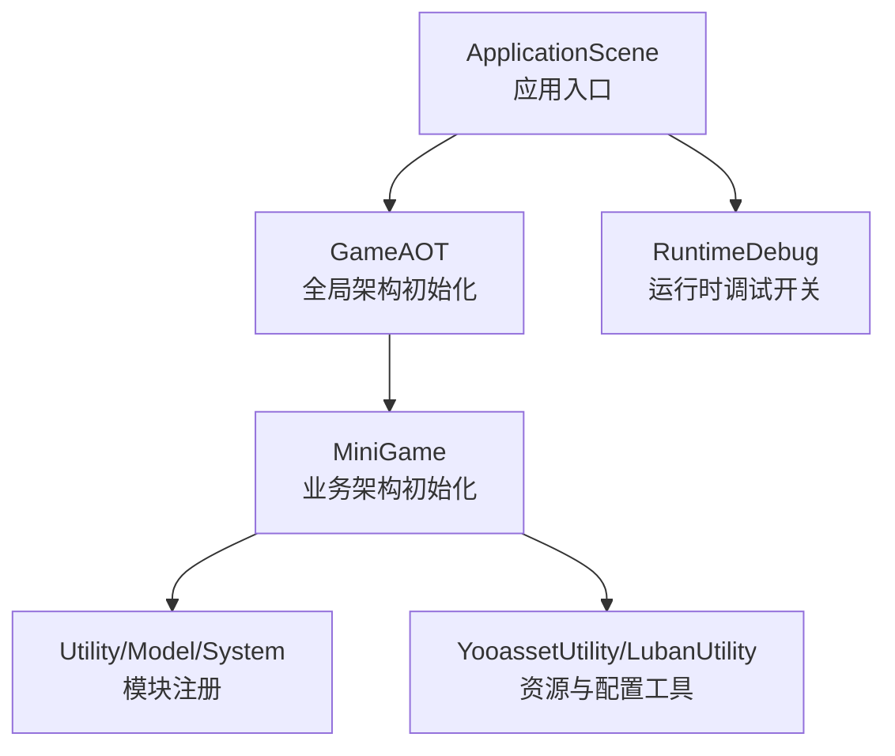
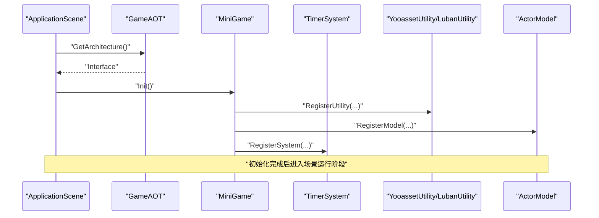
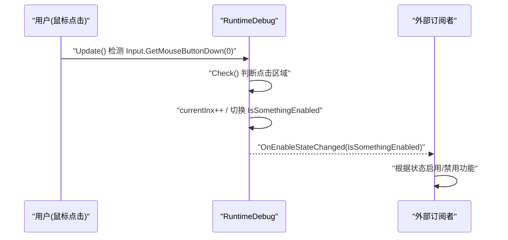
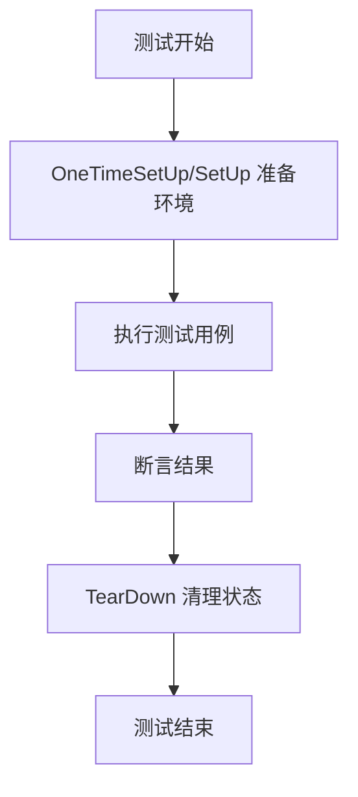
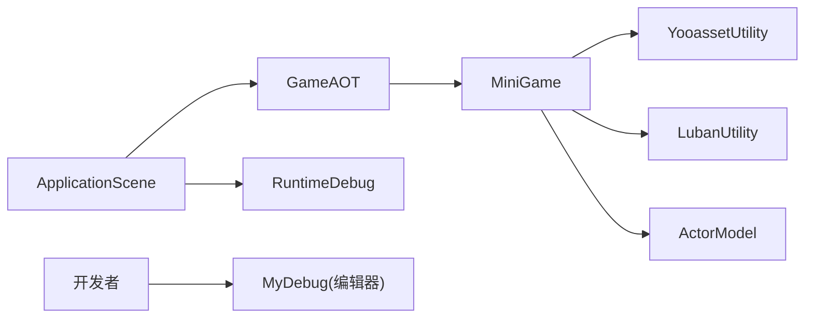

# 开发指南

<cite>
**本文引用的文件**   
- [ApplicationScene.cs](file://Assets/Game/Scripts/ApplicationScene.cs)
- [GameAOT.cs](file://Assets/Game/Scripts/GameAOT.cs)
- [MiniGame.cs](file://Assets/Game/Scripts/MiniGame_Scripts/MiniGame.cs)
- [G.cs](file://Assets/Game/Framework/Base/G.cs)
- [MyDebug.cs](file://Assets/Game/Framework/Base/Extensions/MyDebug.cs)
- [RuntimeDebug.cs](file://Assets/Game/Framework/Base/RuntimeDebug.cs)
- [ProjectVersion.txt](file://ProjectSettings/ProjectVersion.txt)
- [QFramework.Tests.Runtime.asmdef](file://Assets/Game/Framework/Qframework/Tests/Runtime/QFramework.Tests.Runtime.asmdef)
- [QFramework.Tests.Editor.asmdef](file://Assets/Game/Framework/Qframework/Tests/Editor/QFramework.Tests.Editor.asmdef)
- [TestMultipleKeysContainer.cs](file://Assets/Game/Framework/Qframework/Tests/Editor/TestMultipleKeysContainer.cs)
- [ProfilerCollection.cs](file://Assets/Game/Framework/Qframework/Runtime/Profiler/ProfilerCollection.cs)
</cite>

## 目录
1. [简介](#简介)
2. [项目结构](#项目结构)
3. [核心组件](#核心组件)
4. [架构总览](#架构总览)
5. [详细组件分析](#详细组件分析)
6. [依赖分析](#依赖分析)
7. [性能考虑](#性能考虑)
8. [故障排除指南](#故障排除指南)
9. [结论](#结论)
10. [附录](#附录)

## 简介
本指南面向 SimulationClient 项目的开发者，提供从环境搭建、代码规范、调试与性能监控、单元测试到扩展与排障的全流程说明。项目基于 Unity 6000.3.2f1，采用 QFramework 的 Architecture 模式组织系统，结合 YooAsset 资源管理与 Luban 配置生成工具，形成“应用启动 -> 框架初始化 -> 模块注册 -> 场景运行”的清晰链路。

## 项目结构
- 顶层入口与应用生命周期
  - ApplicationScene：负责应用级初始化与暂停事件转发，获取全局 Architecture 接口。
  - GameAOT：全局架构初始化（如 TimerSystem）。
  - MiniGame：业务层架构初始化（注册 Utility、Model、System）。
- 基础库与工具
  - G：常用协程等待常量，避免重复创建 WaitForSeconds。
  - MyDebug：编辑器下调试可视化辅助（包围盒、箭头、坐标轴等）。
  - RuntimeDebug：运行时命令面板，用于开启/关闭调试功能。
- 测试与性能
  - QFramework.Tests.*：NUnit 测试工程定义与示例。
  - ProfilerCollection：基于 Unity Profiling 的性能计数器集合。

图表来源
- [ApplicationScene.cs:1-36](file://Assets/Game/Scripts/ApplicationScene.cs#L1-L36)
- [GameAOT.cs:1-13](file://Assets/Game/Scripts/GameAOT.cs#L1-L13)
- [MiniGame.cs:1-30](file://Assets/Game/Scripts/MiniGame_Scripts/MiniGame.cs#L1-L30)
- [RuntimeDebug.cs:1-140](file://Assets/Game/Framework/Base/RuntimeDebug.cs#L1-L140)

章节来源
- [ApplicationScene.cs:1-36](file://Assets/Game/Scripts/ApplicationScene.cs#L1-L36)
- [GameAOT.cs:1-13](file://Assets/Game/Scripts/GameAOT.cs#L1-L13)
- [MiniGame.cs:1-30](file://Assets/Game/Scripts/MiniGame_Scripts/MiniGame.cs#L1-L30)

## 核心组件
- ApplicationScene
  - 职责：在 Awake 中调用 Initialize，获取全局 Architecture 接口；监听 OnApplicationPause 并广播 onApplicationPause 事件。
  - 关键点：通过 GetArchitecture 返回 GameAOT.Interface，确保后续模块可访问统一架构。
- GameAOT
  - 职责：全局架构初始化，注册通用系统（如 TimerSystem）。
  - 关键点：作为全局入口，被 ApplicationScene 引用。
- MiniGame
  - 职责：业务层架构初始化，按顺序注册 Utility、Model、System。
  - 关键点：当前已注册 YooassetUtility、LubanUtility 与 ActorModel，System 注册位预留扩展点。
- G
  - 职责：提供常用的 WaitForSeconds 常量，减少 GC 分配。
- MyDebug
  - 职责：编辑器下调试可视化（包围盒、射线箭头、三维坐标轴等），仅在 UNITY_EDITOR 编译。
- RuntimeDebug
  - 职责：运行时命令面板，支持点击区域切换调试开关，并通过事件回调通知启用状态变化。

章节来源
- [ApplicationScene.cs:1-36](file://Assets/Game/Scripts/ApplicationScene.cs#L1-L36)
- [GameAOT.cs:1-13](file://Assets/Game/Scripts/GameAOT.cs#L1-L13)
- [MiniGame.cs:1-30](file://Assets/Game/Scripts/MiniGame_Scripts/MiniGame.cs#L1-L30)
- [G.cs:1-14](file://Assets/Game/Framework/Base/G.cs#L1-L14)
- [MyDebug.cs:1-167](file://Assets/Game/Framework/Base/Extensions/MyDebug.cs#L1-L167)
- [RuntimeDebug.cs:1-140](file://Assets/Game/Framework/Base/RuntimeDebug.cs#L1-L140)

## 架构总览
整体采用“应用层 -> 全局架构 -> 业务架构”的分层初始化模型。ApplicationScene 作为场景入口，获取全局架构接口；GameAOT 完成全局系统注册；MiniGame 完成业务相关模块注册。

图表来源
- [ApplicationScene.cs:1-36](file://Assets/Game/Scripts/ApplicationScene.cs#L1-L36)
- [GameAOT.cs:1-13](file://Assets/Game/Scripts/GameAOT.cs#L1-L13)
- [MiniGame.cs:1-30](file://Assets/Game/Scripts/MiniGame_Scripts/MiniGame.cs#L1-L30)

## 详细组件分析

### 应用启动与生命周期
- 启动流程
  - ApplicationScene.Awake 调用 Initialize，随后通过 GetArchitecture 获取 GameAOT.Interface。
  - GameAOT.Init 注册全局系统（例如 TimerSystem）。
  - MiniGame.Init 注册 Utility、Model、System。
- 生命周期事件
  - ApplicationScene.OnApplicationPause 将 pauseStatus 通过静态事件 onApplicationPause 广播，供其他模块订阅处理。

图表来源
- [ApplicationScene.cs:1-36](file://Assets/Game/Scripts/ApplicationScene.cs#L1-L36)
- [GameAOT.cs:1-13](file://Assets/Game/Scripts/GameAOT.cs#L1-L13)
- [MiniGame.cs:1-30](file://Assets/Game/Scripts/MiniGame_Scripts/MiniGame.cs#L1-L30)

章节来源
- [ApplicationScene.cs:1-36](file://Assets/Game/Scripts/ApplicationScene.cs#L1-L36)
- [GameAOT.cs:1-13](file://Assets/Game/Scripts/GameAOT.cs#L1-L13)
- [MiniGame.cs:1-30](file://Assets/Game/Scripts/MiniGame_Scripts/MiniGame.cs#L1-L30)

### 运行时调试工具（RuntimeDebug）
- 功能要点
  - 通过 CommandPositions 数组定义多个点击区域，循环检测鼠标点击以切换 IsSomethingEnabled 状态。
  - 通过 OnEnableStateChanged 事件通知外部订阅者。
  - CreateRuntimeCommand 静态方法便于快速创建调试实例。
- 使用建议
  - 在需要热启停的功能处订阅 OnEnableStateChanged，根据布尔值启用/禁用对应逻辑。
  - 合理设置 areaRatio 与 CommandPositions，避免误触。

图表来源
- [RuntimeDebug.cs:1-140](file://Assets/Game/Framework/Base/RuntimeDebug.cs#L1-L140)

章节来源
- [RuntimeDebug.cs:1-140](file://Assets/Game/Framework/Base/RuntimeDebug.cs#L1-L140)

### 编辑器调试可视化（MyDebug）
- 能力概览
  - 数组日志输出（LogArray<T>），便于批量数据检查。
  - 包围盒绘制（DrawDebugBounds），支持 MeshFilter/MeshRenderer/Bounds。
  - 方向箭头（DrawArrowRay）、三维坐标轴（DrawDimensionalCross）、世界坐标字符串绘制（DrawString）。
- 注意事项
  - 所有可视化方法均受 #if UNITY_EDITOR 保护，仅编辑器可见。
  - 建议在 Editor 模式下使用，避免影响运行时性能。

章节来源
- [MyDebug.cs:1-167](file://Assets/Game/Framework/Base/Extensions/MyDebug.cs#L1-L167)

### 协程时间常量（G）
- 设计目的
  - 预置常用 WaitForSeconds 常量，避免频繁 new 导致 GC 压力。
- 使用建议
  - 在协程中优先复用 G 中的常量，减少内存分配。

章节来源
- [G.cs:1-14](file://Assets/Game/Framework/Base/G.cs#L1-L14)

### 单元测试与测试策略
- 测试工程结构
  - QFramework.Tests.Runtime.asmdef：运行时测试工程定义，引用 NUnit 与 TestRunner。
  - QFramework.Tests.Editor.asmdef：编辑器测试工程定义，包含 UI 相关引用。
- 测试示例
  - TestMultipleKeysContainer：演示如何清理容器并在 OneTimeSetUp 中准备测试环境。
- 编写建议
  - 使用 [OneTimeSetUp]/[SetUp] 进行环境准备与清理。
  - 针对多键容器或共享状态，务必在测试前 ClearContainer，避免用例间污染。
  - 利用 NUnit 断言验证行为，保持用例独立与幂等。

图表来源
- [QFramework.Tests.Runtime.asmdef:1-22](file://Assets/Game/Framework/Qframework/Tests/Runtime/QFramework.Tests.Runtime.asmdef#L1-L22)
- [QFramework.Tests.Editor.asmdef:1-22](file://Assets/Game/Framework/Qframework/Tests/Editor/QFramework.Tests.Editor.asmdef#L1-L22)
- [TestMultipleKeysContainer.cs:1-83](file://Assets/Game/Framework/Qframework/Tests/Editor/TestMultipleKeysContainer.cs#L1-L83)

章节来源
- [QFramework.Tests.Runtime.asmdef:1-22](file://Assets/Game/Framework/Qframework/Tests/Runtime/QFramework.Tests.Runtime.asmdef#L1-L22)
- [QFramework.Tests.Editor.asmdef:1-22](file://Assets/Game/Framework/Qframework/Tests/Editor/QFramework.Tests.Editor.asmdef#L1-L22)
- [TestMultipleKeysContainer.cs:1-83](file://Assets/Game/Framework/Qframework/Tests/Editor/TestMultipleKeysContainer.cs#L1-L83)

## 依赖分析
- 版本与环境
  - Unity 编辑器版本：6000.3.2f1（见 ProjectVersion.txt）。
- 关键依赖
  - QFramework：Architecture 与测试基础设施。
  - YooAsset：资源加载与管理（通过 YooassetUtility）。
  - Luban：配置表生成（通过 LubanUtility）。
  - NUnit：单元测试框架（由 Tests.*.asmdef 引用）。
- 模块耦合
  - ApplicationScene 依赖 GameAOT 的 Interface。
  - MiniGame 依赖 YooassetUtility、LubanUtility 与 ActorModel。
  - RuntimeDebug 与 MyDebug 为横切关注点，不直接耦合业务逻辑。

图表来源
- [ApplicationScene.cs:1-36](file://Assets/Game/Scripts/ApplicationScene.cs#L1-L36)
- [GameAOT.cs:1-13](file://Assets/Game/Scripts/GameAOT.cs#L1-L13)
- [MiniGame.cs:1-30](file://Assets/Game/Scripts/MiniGame_Scripts/MiniGame.cs#L1-L30)
- [RuntimeDebug.cs:1-140](file://Assets/Game/Framework/Base/RuntimeDebug.cs#L1-L140)
- [MyDebug.cs:1-167](file://Assets/Game/Framework/Base/Extensions/MyDebug.cs#L1-L167)
- [ProjectVersion.txt:1-3](file://ProjectSettings/ProjectVersion.txt#L1-L3)

章节来源
- [ProjectVersion.txt:1-3](file://ProjectSettings/ProjectVersion.txt#L1-L3)
- [ApplicationScene.cs:1-36](file://Assets/Game/Scripts/ApplicationScene.cs#L1-L36)
- [GameAOT.cs:1-13](file://Assets/Game/Scripts/GameAOT.cs#L1-L13)
- [MiniGame.cs:1-30](file://Assets/Game/Scripts/MiniGame_Scripts/MiniGame.cs#L1-L30)

## 性能考虑
- 协程时间对象复用
  - 使用 G 中的 WaitForSeconds 常量，避免每帧 new 导致的 GC 抖动。
- 调试开销控制
  - MyDebug 仅在编辑器生效，不影响运行时。
  - RuntimeDebug 可通过开关控制是否启用调试功能，降低运行时成本。
- 性能监控
  - 使用 QFramework.Profiler.ProfilerCollection 提供的计数器，结合 Unity Profiler 观察关键指标（如命令计数、查询计数）。
  - 建议在热点路径前后埋点，定位瓶颈。

章节来源
- [G.cs:1-14](file://Assets/Game/Framework/Base/G.cs#L1-L14)
- [MyDebug.cs:1-167](file://Assets/Game/Framework/Base/Extensions/MyDebug.cs#L1-L167)
- [RuntimeDebug.cs:1-140](file://Assets/Game/Framework/Base/RuntimeDebug.cs#L1-L140)
- [ProfilerCollection.cs:1-20](file://Assets/Game/Framework/Qframework/Runtime/Profiler/ProfilerCollection.cs#L1-L20)

## 故障排除指南
- 常见问题与排查步骤
  - 应用无法启动或架构为空
    - 确认 ApplicationScene 正确获取 GameAOT.Interface。
    - 检查 GameAOT.Init 是否成功注册必要系统。
  - 运行时调试无效
    - 检查 RuntimeDebug.CommandPositions 是否为空。
    - 确认 OnEnableStateChanged 回调是否正确订阅。
  - 编辑器调试不可见
    - 确认 MyDebug 调用位于编辑器环境（UNITY_EDITOR）。
  - 测试用例相互污染
    - 在 OneTimeSetUp 中调用 TestArchitecture.Interface.ClearContainer()，确保状态隔离。
- 日志与可视化
  - 使用 MyDebug.LogArray 打印集合内容，快速定位数据结构问题。
  - 使用 DrawDebugBounds/DrawArrowRay/DrawDimensionalCross 辅助空间关系调试。

章节来源
- [ApplicationScene.cs:1-36](file://Assets/Game/Scripts/ApplicationScene.cs#L1-L36)
- [GameAOT.cs:1-13](file://Assets/Game/Scripts/GameAOT.cs#L1-L13)
- [RuntimeDebug.cs:1-140](file://Assets/Game/Framework/Base/RuntimeDebug.cs#L1-L140)
- [MyDebug.cs:1-167](file://Assets/Game/Framework/Base/Extensions/MyDebug.cs#L1-L167)
- [TestMultipleKeysContainer.cs:1-83](file://Assets/Game/Framework/Qframework/Tests/Editor/TestMultipleKeysContainer.cs#L1-L83)

## 结论
SimulationClient 采用清晰的分层架构与模块化注册机制，配合丰富的调试与测试工具，具备良好的可扩展性与可维护性。遵循本指南的环境搭建、代码规范、调试与测试实践，可有效提升开发效率与质量。

## 附录
- 环境搭建清单
  - Unity 版本：6000.3.2f1（参考 ProjectVersion.txt）。
  - 插件与包：QFramework、YooAsset、Luban、NUnit（测试）。
  - 构建产物：StreamingAssets/yoo 下的 Manifest 与 Catalog 文件。
- 开发规范建议
  - 命名约定：类名采用 PascalCase，字段私有化并使用 _ 前缀（可选），常量使用 static readonly。
  - 文件组织：按功能域划分目录（如 Scripts/MiniGame_Scripts/{Controller,System,Model,Utility}）。
  - 注释规范：公共 API 添加摘要注释，复杂逻辑补充行内注释说明意图与边界条件。
- 扩展现有功能与新增系统模块
  - 在 MiniGame.RegisterSystem 中注册新 System。
  - 在 MiniGame.RegisterUtility 中注册新 Utility。
  - 在 MiniGame.RegisterModel 中注册新 Model。
  - 若需全局系统，可在 GameAOT.Init 中注册。
- 常见任务示例路径
  - 应用启动与架构获取：[ApplicationScene.cs:1-36](file://Assets/Game/Scripts/ApplicationScene.cs#L1-L36)
  - 全局系统注册：[GameAOT.cs:1-13](file://Assets/Game/Scripts/GameAOT.cs#L1-L13)
  - 业务模块注册：[MiniGame.cs:1-30](file://Assets/Game/Scripts/MiniGame_Scripts/MiniGame.cs#L1-L30)
  - 运行时调试开关：[RuntimeDebug.cs:1-140](file://Assets/Game/Framework/Base/RuntimeDebug.cs#L1-L140)
  - 编辑器调试可视化：[MyDebug.cs:1-167](file://Assets/Game/Framework/Base/Extensions/MyDebug.cs#L1-L167)
  - 性能计数器使用：[ProfilerCollection.cs:1-20](file://Assets/Game/Framework/Qframework/Runtime/Profiler/ProfilerCollection.cs#L1-L20)
  - 测试工程定义与示例：[QFramework.Tests.Runtime.asmdef:1-22](file://Assets/Game/Framework/Qframework/Tests/Runtime/QFramework.Tests.Runtime.asmdef#L1-L22)、[QFramework.Tests.Editor.asmdef:1-22](file://Assets/Game/Framework/Qframework/Tests/Editor/QFramework.Tests.Editor.asmdef#L1-L22)、[TestMultipleKeysContainer.cs:1-83](file://Assets/Game/Framework/Qframework/Tests/Editor/TestMultipleKeysContainer.cs#L1-L83)