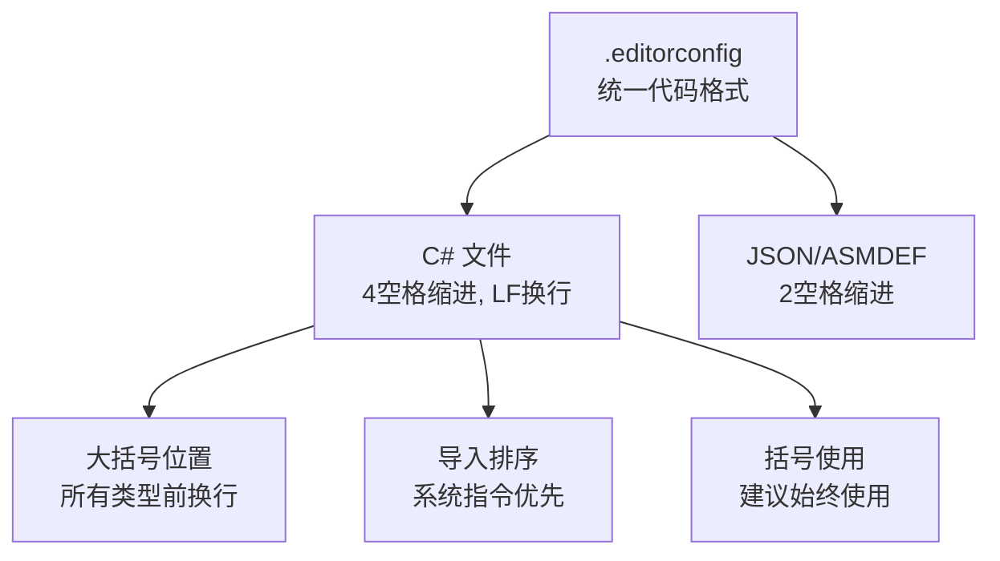
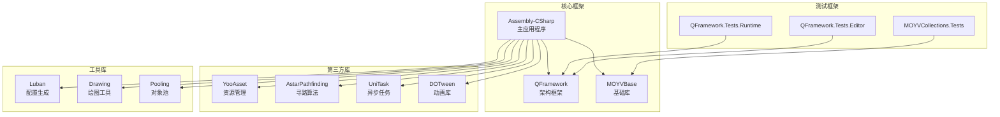
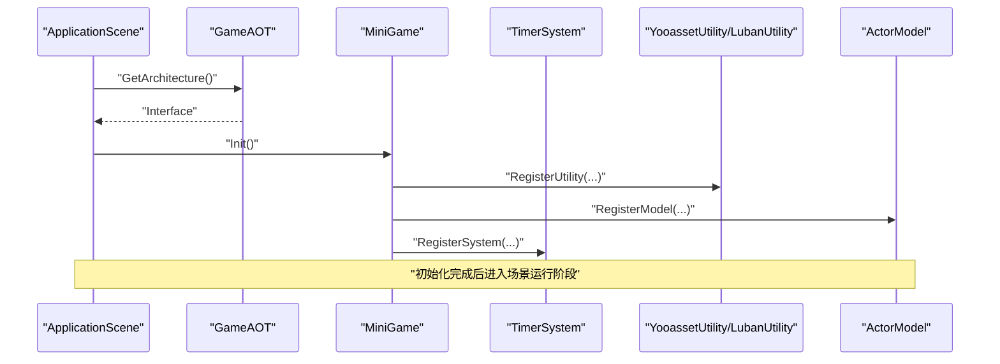
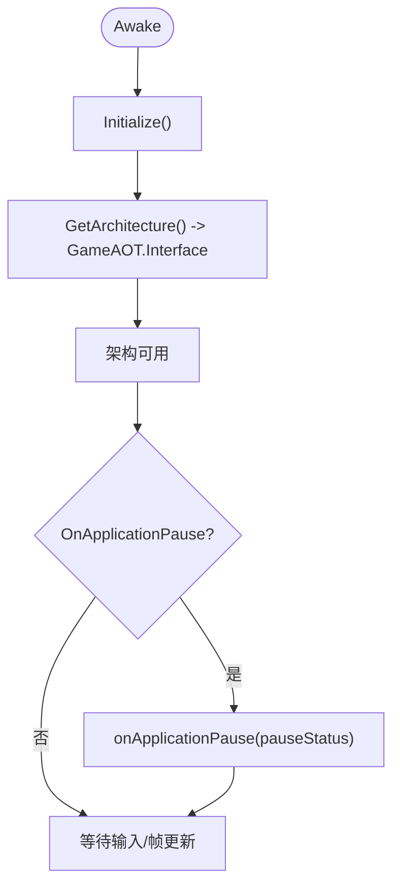
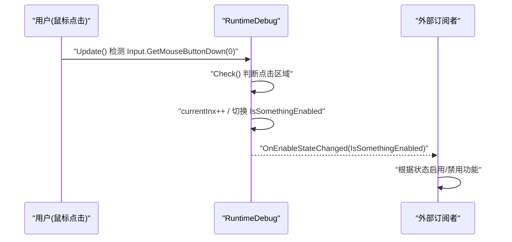
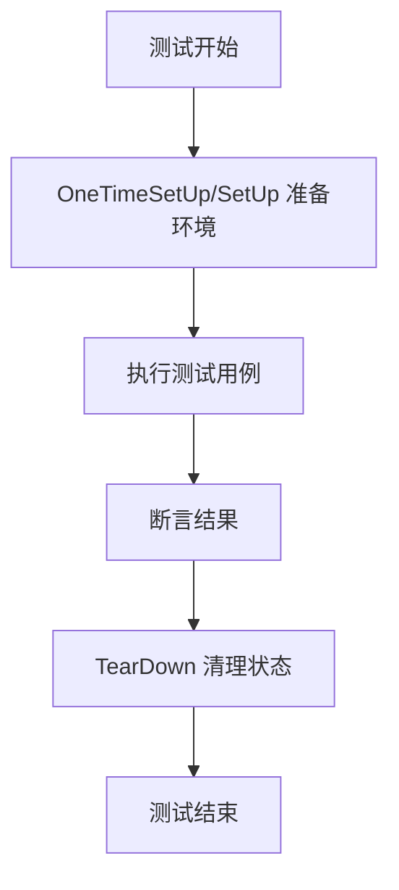
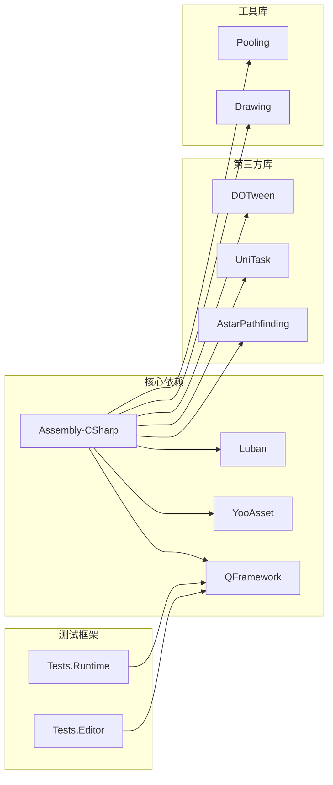

# 开发指南

<cite>
**本文引用的文件**   
- [ApplicationScene.cs](file://Assets/Game/Scripts/ApplicationScene.cs)
- [GameAOT.cs](file://Assets/Game/Scripts/GameAOT.cs)
- [MiniGame.cs](file://Assets/Game/Scripts/MiniGame_Scripts/MiniGame.cs)
- [G.cs](file://Assets/Game/Framework/Base/G.cs)
- [RuntimeDebug.cs](file://Assets/Game/Framework/Base/RuntimeDebug.cs)
- [ProjectVersion.txt](file://ProjectSettings/ProjectVersion.txt)
- [QFramework.Tests.Runtime.asmdef](file://Assets/Game/Framework/Qframework/Tests/Runtime/QFramework.Tests.Runtime.asmdef)
- [QFramework.Tests.Editor.asmdef](file://Assets/Game/Framework/Qframework/Tests/Editor/QFramework.Tests.Editor.asmdef)
- [TestMultipleKeysContainer.cs](file://Assets/Game/Framework/Qframework/Tests/Editor/TestMultipleKeysContainer.cs)
- [ProfilerCollection.cs](file://Assets/Game/Framework/Qframework/Runtime/Profiler/ProfilerCollection.cs)
- [.editorconfig](file:// .editorconfig)
- [omnisharp.json](file://omnisharp.json)
- [.vsconfig](file://.vsconfig)
- [SimulationClient.slnx](file://SimulationClient.slnx)
- [Assembly-CSharp.csproj](file://Assembly-CSharp.csproj)
</cite>

## 更新摘要
**所做更改**   
- 新增开发环境配置章节，详细介绍.editorconfig、omnisharp.json和.vsconfig配置文件
- 更新项目结构部分，反映现代Unity工具链的复杂依赖关系
- 扩展开发规范章节，包含统一的C#代码格式化标准和编辑器配置
- 更新解决方案管理部分，说明多项目引用和依赖管理
- 增强IDE配置指南，提供Visual Studio和VS Code的最佳实践

## 目录
1. [简介](#简介)
2. [开发环境配置](#开发环境配置)
3. [项目结构](#项目结构)
4. [核心组件](#核心组件)
5. [架构总览](#架构总览)
6. [详细组件分析](#详细组件分析)
7. [依赖分析](#依赖分析)
8. [性能考虑](#性能考虑)
9. [故障排除指南](#故障排除指南)
10. [结论](#结论)
11. [附录](#附录)

## 简介
本指南面向 SimulationClient 项目的开发者，提供从环境搭建、代码规范、调试与性能监控、单元测试到扩展与排障的全流程说明。项目基于 Unity 6000.3.2f1，采用 QFramework 的 Architecture 模式组织系统，结合 YooAsset 资源管理与 Luban 配置生成工具，形成"应用启动 -> 框架初始化 -> 模块注册 -> 场景运行"的清晰链路。

**更新** 项目现已建立完整的开发环境配置体系，包括统一的代码格式化标准、IDE配置和多项目管理支持。

## 开发环境配置

### Unity 版本要求
- **Unity 版本**: 6000.3.2f1 (a9779f353c9b)
- **目标平台**: StandaloneWindows64
- **C# 语言版本**: 9.0 (.NET Standard 2.1)

### 开发环境配置文件

#### EditorConfig 统一代码格式标准
项目根目录的 `.editorconfig` 文件定义了统一的C#代码格式化标准：

**图表来源**
- [.editorconfig:1-22](file://.editorconfig#L1-L22)

#### Omnisharp VS Code 配置
`omnisharp.json` 文件为 Visual Studio Code 提供了优化的C#开发体验：

- **MSBuild 配置**: 使用内置MSBuild引擎
- **Roslyn 分析器**: 启用代码分析和智能提示
- **格式化选项**: 支持EditorConfig和自动导入整理

#### Visual Studio 工作负载配置
`.vsconfig` 文件指定了必需的Visual Studio工作负载：
- **Microsoft.VisualStudio.Workload.ManagedGame**: 游戏开发所需的核心组件

**章节来源**
- [.editorconfig:1-22](file://.editorconfig#L1-L22)
- [omnisharp.json:1-14](file://omnisharp.json#L1-L14)
- [.vsconfig:1-7](file://.vsconfig#L1-L7)
- [ProjectVersion.txt:1-3](file://ProjectSettings/ProjectVersion.txt#L1-L3)

### IDE 设置建议

#### Visual Studio Code 推荐插件
- C# Extension (由OmniSharp提供支持)
- Unity Code Snippets
- Error Lens
- GitLens

#### Visual Studio 推荐设置
- 启用实时错误检查
- 配置代码片段
- 设置断点调试
- 集成Git版本控制

## 项目结构

### 顶层入口与应用生命周期
- ApplicationScene：负责应用级初始化与暂停事件转发，获取全局 Architecture 接口。
- GameAOT：全局架构初始化（如 TimerSystem）。
- MiniGame：业务层架构初始化（注册 Utility、Model、System）。

### 基础库与工具
- G：常用协程等待常量，避免重复创建 WaitForSeconds。
- RuntimeDebug：运行时命令面板，用于开启/关闭调试功能。

### 测试与性能
- QFramework.Tests.*：NUnit 测试工程定义与示例。
- ProfilerCollection：基于 Unity Profiling 的性能计数器集合。

### 现代Unity工具链依赖
项目现已扩展到38+个独立项目，反映了Unity现代工具链的复杂性：

**图表来源**
- [SimulationClient.slnx:1-39](file://SimulationClient.slnx#L1-L39)
- [Assembly-CSharp.csproj:1-800](file://Assembly-CSharp.csproj#L1-L800)

**章节来源**
- [ApplicationScene.cs:1-36](file://Assets/Game/Scripts/ApplicationScene.cs#L1-L36)
- [GameAOT.cs:1-13](file://Assets/Game/Scripts/GameAOT.cs#L1-L13)
- [MiniGame.cs:1-30](file://Assets/Game/Scripts/MiniGame_Scripts/MiniGame.cs#L1-L30)
- [SimulationClient.slnx:1-39](file://SimulationClient.slnx#L1-L39)

## 核心组件
- ApplicationScene
  - 职责：在 Awake 中调用 Initialize，获取全局 Architecture 接口；监听 OnApplicationPause 并广播 onApplicationPause 事件。
  - 关键点：通过 GetArchitecture 返回 GameAOT.Interface，确保后续模块可访问统一架构。
- GameAOT
  - 职责：全局架构初始化，注册通用系统（如 TimerSystem）。
  - 关键点：作为全局入口，被 ApplicationScene 引用。
- MiniGame
  - 职责：业务层架构初始化，按顺序注册 Utility、Model、System。
  - 关键点：当前已注册 YooassetUtility、LubanUtility 与 ActorModel，System 注册位预留扩展点。
- G
  - 职责：提供常用的 WaitForSeconds 常量，减少 GC 分配。
- RuntimeDebug
  - 职责：运行时命令面板，支持点击区域切换调试开关，并通过事件回调通知启用状态变化。

**章节来源**
- [ApplicationScene.cs:1-36](file://Assets/Game/Scripts/ApplicationScene.cs#L1-L36)
- [GameAOT.cs:1-13](file://Assets/Game/Scripts/GameAOT.cs#L1-L13)
- [MiniGame.cs:1-30](file://Assets/Game/Scripts/MiniGame_Scripts/MiniGame.cs#L1-L30)
- [G.cs:1-14](file://Assets/Game/Framework/Base/G.cs#L1-L14)
- [RuntimeDebug.cs:1-140](file://Assets/Game/Framework/Base/RuntimeDebug.cs#L1-L140)

## 架构总览
整体采用"应用层 -> 全局架构 -> 业务架构"的分层初始化模型。ApplicationScene 作为场景入口，获取全局架构接口；GameAOT 完成全局系统注册；MiniGame 完成业务相关模块注册。

**图表来源**
- [ApplicationScene.cs:1-36](file://Assets/Game/Scripts/ApplicationScene.cs#L1-L36)
- [GameAOT.cs:1-13](file://Assets/Game/Scripts/GameAOT.cs#L1-L13)
- [MiniGame.cs:1-30](file://Assets/Game/Scripts/MiniGame_Scripts/MiniGame.cs#L1-L30)

## 详细组件分析

### 应用启动与生命周期
- 启动流程
  - ApplicationScene.Awake 调用 Initialize，随后通过 GetArchitecture 获取 GameAOT.Interface。
  - GameAOT.Init 注册全局系统（例如 TimerSystem）。
  - MiniGame.Init 注册 Utility、Model、System。
- 生命周期事件
  - ApplicationScene.OnApplicationPause 将 pauseStatus 通过静态事件 onApplicationPause 广播，供其他模块订阅处理。

**图表来源**
- [ApplicationScene.cs:1-36](file://Assets/Game/Scripts/ApplicationScene.cs#L1-L36)
- [GameAOT.cs:1-13](file://Assets/Game/Scripts/GameAOT.cs#L1-L13)
- [MiniGame.cs:1-30](file://Assets/Game/Scripts/MiniGame_Scripts/MiniGame.cs#L1-L30)

**章节来源**
- [ApplicationScene.cs:1-36](file://Assets/Game/Scripts/ApplicationScene.cs#L1-L36)
- [GameAOT.cs:1-13](file://Assets/Game/Scripts/GameAOT.cs#L1-L13)
- [MiniGame.cs:1-30](file://Assets/Game/Scripts/MiniGame_Scripts/MiniGame.cs#L1-L30)

### 运行时调试工具（RuntimeDebug）
- 功能要点
  - 通过 CommandPositions 数组定义多个点击区域，循环检测鼠标点击以切换 IsSomethingEnabled 状态。
  - 通过 OnEnableStateChanged 事件通知外部订阅者。
  - CreateRuntimeCommand 静态方法便于快速创建调试实例。
- 使用建议
  - 在需要热启停的功能处订阅 OnEnableStateChanged，根据布尔值启用/禁用对应逻辑。
  - 合理设置 areaRatio 与 CommandPositions，避免误触。

**图表来源**
- [RuntimeDebug.cs:1-140](file://Assets/Game/Framework/Base/RuntimeDebug.cs#L1-L140)

**章节来源**
- [RuntimeDebug.cs:1-140](file://Assets/Game/Framework/Base/RuntimeDebug.cs#L1-L140)

### 协程时间常量（G）
- 设计目的
  - 预置常用 WaitForSeconds 常量，避免频繁 new 导致 GC 压力。
- 使用建议
  - 在协程中优先复用 G 中的常量，减少内存分配。

**章节来源**
- [G.cs:1-14](file://Assets/Game/Framework/Base/G.cs#L1-L14)

### 单元测试与测试策略
- 测试工程结构
  - QFramework.Tests.Runtime.asmdef：运行时测试工程定义，引用 NUnit 与 TestRunner。
  - QFramework.Tests.Editor.asmdef：编辑器测试工程定义，包含 UI 相关引用。
- 测试示例
  - TestMultipleKeysContainer：演示如何清理容器并在 OneTimeSetUp 中准备测试环境。
- 编写建议
  - 使用 [OneTimeSetUp]/[SetUp] 进行环境准备与清理。
  - 针对多键容器或共享状态，务必在测试前 ClearContainer，避免用例间污染。
  - 利用 NUnit 断言验证行为，保持用例独立与幂等。

**图表来源**
- [QFramework.Tests.Runtime.asmdef:1-22](file://Assets/Game/Framework/Qframework/Tests/Runtime/QFramework.Tests.Runtime.asmdef#L1-L22)
- [QFramework.Tests.Editor.asmdef:1-22](file://Assets/Game/Framework/Qframework/Tests/Editor/QFramework.Tests.Editor.asmdef#L1-L22)
- [TestMultipleKeysContainer.cs:1-83](file://Assets/Game/Framework/Qframework/Tests/Editor/TestMultipleKeysContainer.cs#L1-L83)

**章节来源**
- [QFramework.Tests.Runtime.asmdef:1-22](file://Assets/Game/Framework/Qframework/Tests/Runtime/QFramework.Tests.Runtime.asmdef#L1-L22)
- [QFramework.Tests.Editor.asmdef:1-22](file://Assets/Game/Framework/Qframework/Tests/Editor/QFramework.Tests.Editor.asmdef#L1-L22)
- [TestMultipleKeysContainer.cs:1-83](file://Assets/Game/Framework/Qframework/Tests/Editor/TestMultipleKeysContainer.cs#L1-L83)

## 依赖分析

### 版本与环境
- Unity 编辑器版本：6000.3.2f1（见 ProjectVersion.txt）。
- C# 语言版本：9.0 (.NET Standard 2.1)。

### 关键依赖
- QFramework：Architecture 与测试基础设施。
- YooAsset：资源加载与管理（通过 YooassetUtility）。
- Luban：配置表生成（通过 LubanUtility）。
- UniTask：异步编程支持。
- AstarPathfinding：路径寻找算法。
- DOTween：动画补间库。
- NUnit：单元测试框架（由 Tests.*.asmdef 引用）。

### 模块耦合
- ApplicationScene 依赖 GameAOT 的 Interface。
- MiniGame 依赖 YooassetUtility、LubanUtility 与 ActorModel。
- RuntimeDebug 为横切关注点，不直接耦合业务逻辑。

### 现代Unity工具链依赖图
项目现包含38+个独立项目，反映了Unity现代开发环境的复杂性：

**图表来源**
- [SimulationClient.slnx:1-39](file://SimulationClient.slnx#L1-L39)
- [Assembly-CSharp.csproj:1-800](file://Assembly-CSharp.csproj#L1-L800)

**章节来源**
- [ProjectVersion.txt:1-3](file://ProjectSettings/ProjectVersion.txt#L1-L3)
- [ApplicationScene.cs:1-36](file://Assets/Game/Scripts/ApplicationScene.cs#L1-L36)
- [GameAOT.cs:1-13](file://Assets/Game/Scripts/GameAOT.cs#L1-L13)
- [MiniGame.cs:1-30](file://Assets/Game/Scripts/MiniGame_Scripts/MiniGame.cs#L1-L30)
- [RuntimeDebug.cs:1-140](file://Assets/Game/Framework/Base/RuntimeDebug.cs#L1-L140)
- [SimulationClient.slnx:1-39](file://SimulationClient.slnx#L1-L39)

## 性能考虑
- 协程时间对象复用
  - 使用 G 中的 WaitForSeconds 常量，避免每帧 new 导致的 GC 抖动。
- 调试开销控制
  - RuntimeDebug 可通过开关控制是否启用调试功能，降低运行时成本。
- 性能监控
  - 使用 QFramework.Profiler.ProfilerCollection 提供的计数器，结合 Unity Profiler 观察关键指标（如命令计数、查询计数）。
  - 建议在热点路径前后埋点，定位瓶颈。

**章节来源**
- [G.cs:1-14](file://Assets/Game/Framework/Base/G.cs#L1-L14)
- [RuntimeDebug.cs:1-140](file://Assets/Game/Framework/Base/RuntimeDebug.cs#L1-L140)
- [ProfilerCollection.cs:1-20](file://Assets/Game/Framework/Qframework/Runtime/Profiler/ProfilerCollection.cs#L1-L20)

## 故障排除指南

### 常见问题与排查步骤
- 应用无法启动或架构为空
  - 确认 ApplicationScene 正确获取 GameAOT.Interface。
  - 检查 GameAOT.Init 是否成功注册必要系统。
- 运行时调试无效
  - 检查 RuntimeDebug.CommandPositions 是否为空。
  - 确认 OnEnableStateChanged 回调是否正确订阅。
- 测试用例相互污染
  - 在 OneTimeSetUp 中调用 TestArchitecture.Interface.ClearContainer()，确保状态隔离。

### 开发环境问题排查
- **代码格式化不一致**
  - 确保所有开发者使用相同的IDE配置。
  - 检查.editorconfig文件是否正确提交到版本控制。
- **编译错误或依赖缺失**
  - 重新生成解决方案文件。
  - 检查Unity包管理器中的依赖项。
- **IDE智能提示失效**
  - 重启IDE并重新加载项目。
  - 清除IDE缓存并重新索引。

**章节来源**
- [ApplicationScene.cs:1-36](file://Assets/Game/Scripts/ApplicationScene.cs#L1-L36)
- [GameAOT.cs:1-13](file://Assets/Game/Scripts/GameAOT.cs#L1-L13)
- [RuntimeDebug.cs:1-140](file://Assets/Game/Framework/Base/RuntimeDebug.cs#L1-L140)
- [TestMultipleKeysContainer.cs:1-83](file://Assets/Game/Framework/Qframework/Tests/Editor/TestMultipleKeysContainer.cs#L1-L83)

## 结论
SimulationClient 采用清晰的分层架构与模块化注册机制，配合丰富的调试与测试工具，具备良好的可扩展性与可维护性。项目现已建立完整的开发环境配置体系，包括统一的代码格式化标准、IDE配置和多项目管理支持。遵循本指南的环境搭建、代码规范、调试与测试实践，可有效提升开发效率与质量。

**更新** 新的开发环境配置确保了团队开发的一致性，现代化的工具链支持提高了开发体验和构建效率。

## 附录

### 环境搭建清单
- **Unity 版本**: 6000.3.2f1（参考 ProjectVersion.txt）。
- **必需插件**: QFramework、YooAsset、Luban、UniTask、AstarPathfinding、DOTween。
- **测试框架**: NUnit（测试）。
- **构建产物**: StreamingAssets/yoo 下的 Manifest 与 Catalog 文件。

### 开发规范建议
- **命名约定**: 类名采用 PascalCase，字段私有化并使用 _ 前缀（可选），常量使用 static readonly。
- **文件组织**: 按功能域划分目录（如 Scripts/MiniGame_Scripts/{Controller,System,Model,Utility}）。
- **注释规范**: 公共 API 添加摘要注释，复杂逻辑补充行内注释说明意图与边界条件。
- **代码格式**: 遵循.editorconfig定义的统一格式标准。

### 扩展现有功能与新增系统模块
- 在 MiniGame.RegisterSystem 中注册新 System。
- 在 MiniGame.RegisterUtility 中注册新 Utility。
- 在 MiniGame.RegisterModel 中注册新 Model。
- 若需全局系统，可在 GameAOT.Init 中注册。

### 常见任务示例路径
- 应用启动与架构获取：[ApplicationScene.cs:1-36](file://Assets/Game/Scripts/ApplicationScene.cs#L1-L36)
- 全局系统注册：[GameAOT.cs:1-13](file://Assets/Game/Scripts/GameAOT.cs#L1-L13)
- 业务模块注册：[MiniGame.cs:1-30](file://Assets/Game/Scripts/MiniGame_Scripts/MiniGame.cs#L1-L30)
- 运行时调试开关：[RuntimeDebug.cs:1-140](file://Assets/Game/Framework/Base/RuntimeDebug.cs#L1-L140)
- 性能计数器使用：[ProfilerCollection.cs:1-20](file://Assets/Game/Framework/Qframework/Runtime/Profiler/ProfilerCollection.cs#L1-L20)
- 测试工程定义与示例：[QFramework.Tests.Runtime.asmdef:1-22](file://Assets/Game/Framework/Qframework/Tests/Runtime/QFramework.Tests.Runtime.asmdef#L1-L22)、[QFramework.Tests.Editor.asmdef:1-22](file://Assets/Game/Framework/Qframework/Tests/Editor/QFramework.Tests.Editor.asmdef#L1-L22)、[TestMultipleKeysContainer.cs:1-83](file://Assets/Game/Framework/Qframework/Tests/Editor/TestMultipleKeysContainer.cs#L1-L83)

### 开发环境配置文件详解
- **EditorConfig 配置**: [.editorconfig:1-22](file://.editorconfig#L1-L22)
- **VS Code 配置**: [omnisharp.json:1-14](file://omnisharp.json#L1-L14)
- **VS 工作负载**: [.vsconfig:1-7](file://.vsconfig#L1-L7)
- **解决方案管理**: [SimulationClient.slnx:1-39](file://SimulationClient.slnx#L1-L39)