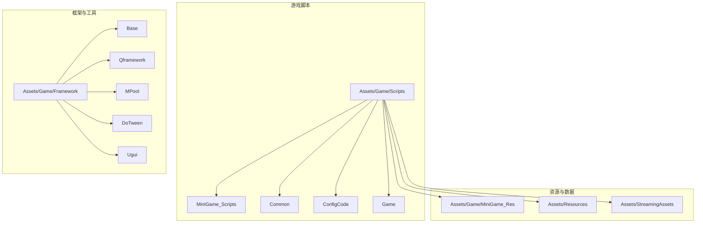
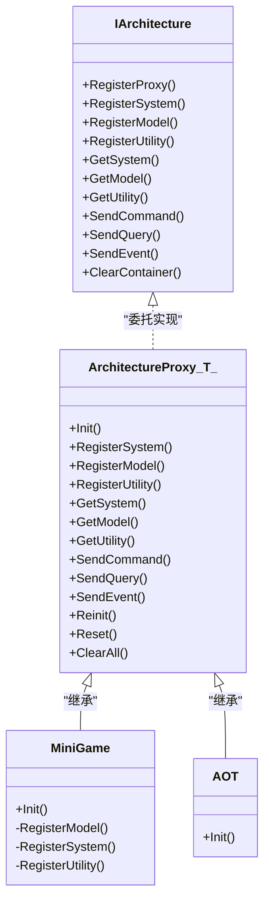
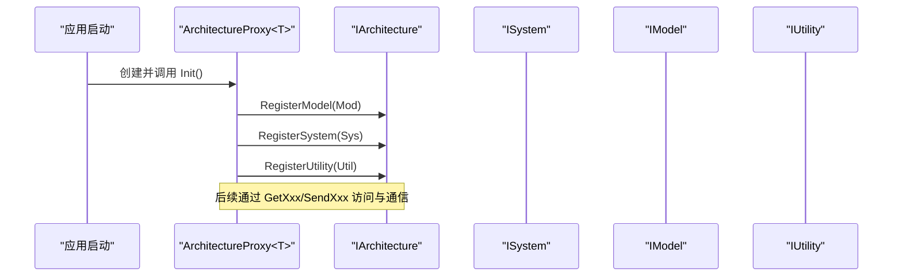
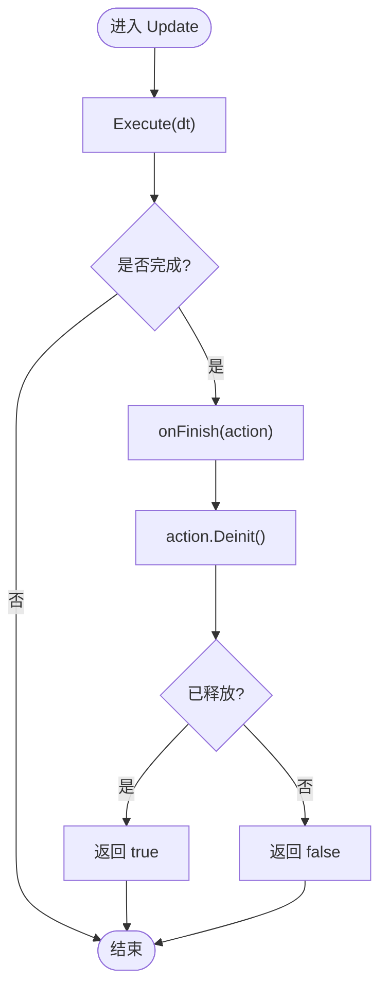
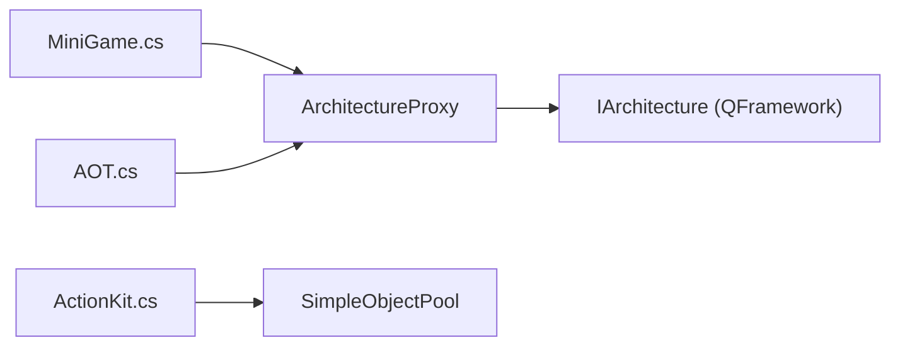

# 开发规范

<cite>
**本文引用的文件**   
- [ArchitectureProxy.cs](file://Assets/Game/Framework/Qframework/Runtime/Moyv/Proxies/ArchitectureProxy.cs)
- [QFramework.cs](file://Assets/Game/Framework/Qframework/Runtime/QFramework.cs)
- [MiniGame.cs](file://Assets/Game/Scripts/MiniGame_Scripts/MiniGame.cs)
- [AOT.cs](file://Assets/Game/Scripts/MiniGame_Scripts/AOT.cs)
- [G.cs](file://Assets/Game/Framework/Base/G.cs)
- [ActionKit.cs](file://Assets/Game/Framework/Qframework/Runtime/Toolkits/ActionKit.cs)
- [00-overview.md](file://.simulationdoc/specs/00-overview.md)
</cite>

## 目录
1. [引言](#引言)
2. [项目结构](#项目结构)
3. [核心组件](#核心组件)
4. [架构总览](#架构总览)
5. [详细组件分析](#详细组件分析)
6. [依赖关系分析](#依赖关系分析)
7. [性能与内存优化](#性能与内存优化)
8. [代码审查清单](#代码审查清单)
9. [结论](#结论)
10. [附录：命名约定与注释规范](#附录命名约定与注释规范)

## 引言
本规范面向 SimulationClient 项目的开发与维护，统一命名、组织、注释、设计模式应用（尤其是 QFramework 架构）、代码审查流程以及性能与内存管理实践。目标是在保证可维护性与可扩展性的同时，提升团队协作效率与运行性能。

## 项目结构
- 脚本与业务逻辑位于 Assets/Game/Scripts 下，按功能域划分；框架与工具位于 Assets/Game/Framework 下。
- 资源与场景位于 Assets/Game/MiniGame_Res、Assets/Resources、Assets/StreamingAssets 等目录，遵循分层与类型化组织原则。
- 配置与生成模板位于 LubanConfig 与 ProjectSettings 等位置。

[本节为概念性结构说明，不直接分析具体文件，故无“章节来源”]

## 核心组件
- 架构代理与容器：通过 ArchitectureProxy<T> 暴露统一的注册与访问接口，内部委托至 QFramework 的 IArchitecture 实现，提供 System/Model/Utility 的注册与获取、命令与查询分发、事件总线能力。
- 启动入口：MiniGame 与 AOT 作为不同模块的 ArchitectureProxy 实现，负责在 Init 中注册模型、系统与工具类。
- 常量与时间片：G 类提供常用 WaitForSeconds 常量，便于协程与定时逻辑复用。
- 动作系统：ActionKit 提供动作执行器与对象池封装，用于动画/序列编排与生命周期管理。

**章节来源**
- [ArchitectureProxy.cs:53-197](file://Assets/Game/Framework/Qframework/Runtime/Moyv/Proxies/ArchitectureProxy.cs#L53-L197)
- [QFramework.cs:36-77](file://Assets/Game/Framework/Qframework/Runtime/QFramework.cs#L36-L77)
- [MiniGame.cs:1-30](file://Assets/Game/Scripts/MiniGame_Scripts/MiniGame.cs#L1-L30)
- [AOT.cs:1-12](file://Assets/Game/Scripts/MiniGame_Scripts/AOT.cs#L1-L12)
- [G.cs:1-14](file://Assets/Game/Framework/Base/G.cs#L1-L14)
- [ActionKit.cs:2540-2600](file://Assets/Game/Framework/Qframework/Runtime/Toolkits/ActionKit.cs#L2540-L2600)

## 架构总览
SimulationClient 采用基于 QFramework 的 MVC-like 架构：
- Model：数据与状态持有者，通过 RegisterModel 注册。
- System：系统行为与更新逻辑，通过 RegisterSystem 注册。
- Utility：通用工具与服务，通过 RegisterUtility 注册。
- Command/Query：命令与查询用于解耦调用方与被调用方。
- Event：事件总线用于跨层通信。

**图表来源**
- [ArchitectureProxy.cs:53-197](file://Assets/Game/Framework/Qframework/Runtime/Moyv/Proxies/ArchitectureProxy.cs#L53-L197)
- [QFramework.cs:36-77](file://Assets/Game/Framework/Qframework/Runtime/QFramework.cs#L36-L77)
- [MiniGame.cs:1-30](file://Assets/Game/Scripts/MiniGame_Scripts/MiniGame.cs#L1-L30)
- [AOT.cs:1-12](file://Assets/Game/Scripts/MiniGame_Scripts/AOT.cs#L1-L12)

**章节来源**
- [ArchitectureProxy.cs:53-197](file://Assets/Game/Framework/Qframework/Runtime/Moyv/Proxies/ArchitectureProxy.cs#L53-L197)
- [QFramework.cs:36-77](file://Assets/Game/Framework/Qframework/Runtime/QFramework.cs#L36-L77)

## 详细组件分析

### 架构代理与初始化流程
- 所有模块以 ArchitectureProxy<T> 的子类形式存在，重写 Init 完成注册。
- MiniGame 侧重数据与工具注册；AOT 侧重 UI 与计时系统等。
- 通过 Interface 静态属性自动将当前 Proxy 注册到全局架构容器。

**图表来源**
- [ArchitectureProxy.cs:53-197](file://Assets/Game/Framework/Qframework/Runtime/Moyv/Proxies/ArchitectureProxy.cs#L53-L197)
- [MiniGame.cs:1-30](file://Assets/Game/Scripts/MiniGame_Scripts/MiniGame.cs#L1-L30)
- [AOT.cs:1-12](file://Assets/Game/Scripts/MiniGame_Scripts/AOT.cs#L1-L12)

**章节来源**
- [ArchitectureProxy.cs:53-197](file://Assets/Game/Framework/Qframework/Runtime/Moyv/Proxies/ArchitectureProxy.cs#L53-L197)
- [MiniGame.cs:1-30](file://Assets/Game/Scripts/MiniGame_Scripts/MiniGame.cs#L1-L30)
- [AOT.cs:1-12](file://Assets/Game/Scripts/MiniGame_Scripts/AOT.cs#L1-L12)

### 动作系统与对象池
- ActionKit 提供 IActionExecutor 与动作生命周期管理，内部使用 SimpleObjectPool 进行对象复用，降低 GC 压力。
- UpdateAction 在每帧驱动动作执行，完成后回调 onFinish 并 Deinit。

**图表来源**
- [ActionKit.cs:2540-2600](file://Assets/Game/Framework/Qframework/Runtime/Toolkits/ActionKit.cs#L2540-L2600)

**章节来源**
- [ActionKit.cs:2540-2600](file://Assets/Game/Framework/Qframework/Runtime/Toolkits/ActionKit.cs#L2540-L2600)

### 常量与时间片管理
- G 类集中定义常用 WaitForSeconds 实例，避免重复创建，减少分配与 GC。
- 建议在协程或延时逻辑中优先复用这些常量。

**章节来源**
- [G.cs:1-14](file://Assets/Game/Framework/Base/G.cs#L1-L14)

## 依赖关系分析
- 业务模块（MiniGame、AOT）依赖 ArchitectureProxy<T> 提供的注册与访问能力。
- ArchitectureProxy<T> 依赖 QFramework 的 IArchitecture 实现，统一管理 System/Model/Utility 的生命周期与通信。
- ActionKit 依赖对象池以减少运行时分配。

**图表来源**
- [ArchitectureProxy.cs:53-197](file://Assets/Game/Framework/Qframework/Runtime/Moyv/Proxies/ArchitectureProxy.cs#L53-L197)
- [QFramework.cs:36-77](file://Assets/Game/Framework/Qframework/Runtime/QFramework.cs#L36-L77)
- [MiniGame.cs:1-30](file://Assets/Game/Scripts/MiniGame_Scripts/MiniGame.cs#L1-L30)
- [AOT.cs:1-12](file://Assets/Game/Scripts/MiniGame_Scripts/AOT.cs#L1-L12)
- [ActionKit.cs:2540-2600](file://Assets/Game/Framework/Qframework/Runtime/Toolkits/ActionKit.cs#L2540-L2600)

**章节来源**
- [ArchitectureProxy.cs:53-197](file://Assets/Game/Framework/Qframework/Runtime/Moyv/Proxies/ArchitectureProxy.cs#L53-L197)
- [QFramework.cs:36-77](file://Assets/Game/Framework/Qframework/Runtime/QFramework.cs#L36-L77)

## 性能与内存优化
- 对象池与复用
  - 优先使用 ActionKit 的动作系统与内置对象池，避免频繁 new。
  - 对热点路径中的临时对象尽量复用或缓存。
- 协程与时间片
  - 使用 G 类提供的 WaitForSeconds 常量，避免每帧分配。
- 事件与委托
  - 在 Tick 热路径中避免创建闭包与委托，必要时缓存引用。
- 资源加载
  - 结合 YooAsset 与 AssetBundle 策略，按需加载与卸载，避免常驻大资源。
- 性能预算与监控
  - 参考项目规格文档中的性能预算与监控建议，建立 CPU/GPU 指标阈值与告警。

**章节来源**
- [ActionKit.cs:2540-2600](file://Assets/Game/Framework/Qframework/Runtime/Toolkits/ActionKit.cs#L2540-L2600)
- [G.cs:1-14](file://Assets/Game/Framework/Base/G.cs#L1-L14)
- [00-overview.md:75-92](file://.simulationdoc/specs/00-overview.md#L75-L92)

## 代码审查清单
- 架构与职责
  - 是否通过 ArchitectureProxy<T> 注册 System/Model/Utility？
  - 是否存在跨层直接耦合？应改用 Command/Query/Event。
- 命名与可读性
  - 类名、方法名、变量名是否符合命名约定（见附录）。
  - 是否避免魔法字符串与硬编码，使用常量或配置。
- 注释与文档
  - 公共 API 是否有清晰的 XML 注释？复杂逻辑是否包含必要说明？
- 性能与内存
  - 是否在热路径中避免分配？是否使用对象池？
  - 是否复用 WaitForSeconds 等常见对象？
- 错误处理与健壮性
  - 是否对空引用、越界、异常路径做了防御性检查？
  - 是否提供合理的日志与调试信息？
- 测试与可验证性
  - 关键逻辑是否具备单元测试或集成测试用例？
  - 是否满足验收标准与边界条件？

[本节为通用指导，不直接分析具体文件，故无“章节来源”]

## 结论
通过统一命名、清晰的文件组织、严格的注释规范与 QFramework 架构模式的应用，配合对象池、协程常量与性能预算，SimulationClient 可在保持高可维护性的同时获得良好的运行性能。建议持续完善自动化检查与代码审查流程，确保团队一致性与质量稳定。

[本节为总结性内容，不直接分析具体文件，故无“章节来源”]

## 附录：命名约定与注释规范

### 命名约定
- 类名与方法名
  - 使用帕斯卡命名法（PascalCase），如 MiniGame、RegisterSystem、SendEvent。
  - 动词开头的方法表达行为，名词开头的表示实体或结果。
- 变量与字段
  - 局部变量使用小驼峰（camelCase），私有字段可使用前缀 m_ 或 _m 保持一致。
  - 常量使用全大写加下划线（UPPER_SNAKE_CASE），如 MAX_COUNT。
- 枚举与接口
  - 枚举成员使用帕斯卡命名法；接口以 I 开头，如 IArchitecture、IActionExecutor。
- 资源与路径
  - 资源路径使用常量集中管理，避免散落的字符串字面量。

[本节为通用约定，不直接分析具体文件，故无“章节来源”]

### 注释规范
- 类注释
  - 每个公共类需包含简要说明与用途描述。
- 方法注释
  - 公共方法需提供摘要、参数说明、返回值说明与异常说明（如有）。
- 复杂逻辑注释
  - 对算法、状态机、Tick 顺序等复杂逻辑，需在关键分支处添加行内注释，解释决策依据与边界条件。
- 示例与参考
  - 对于对外 API，可提供简短的使用示例或链接到相关文档。

[本节为通用约定，不直接分析具体文件，故无“章节来源”]