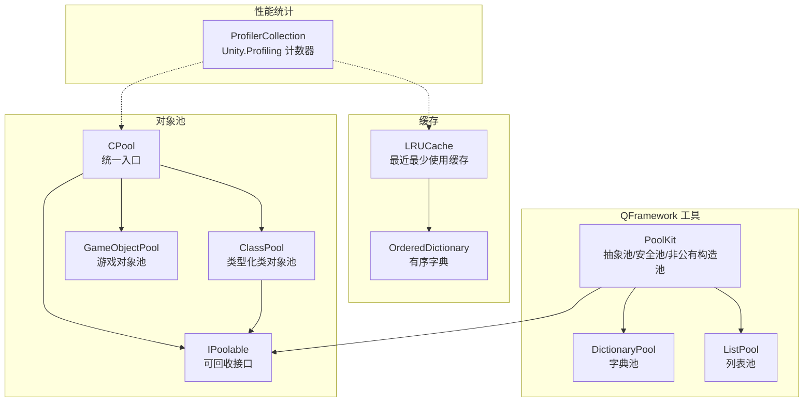
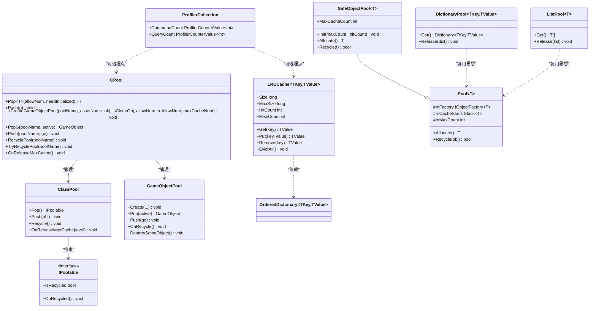
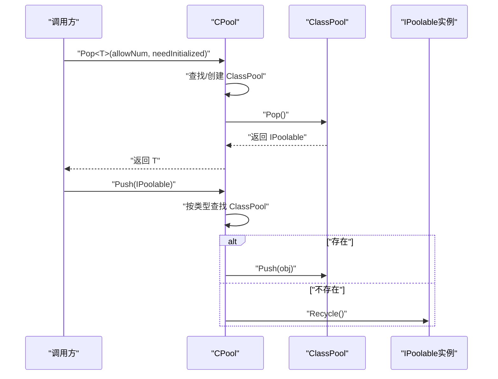
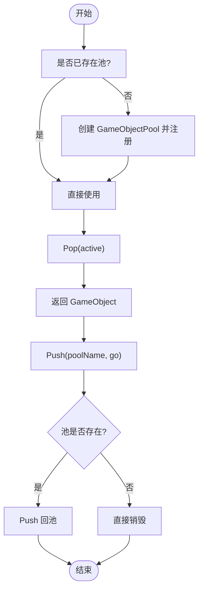
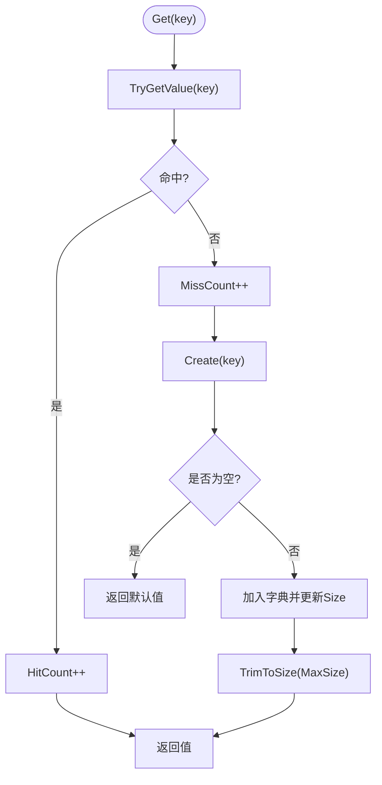
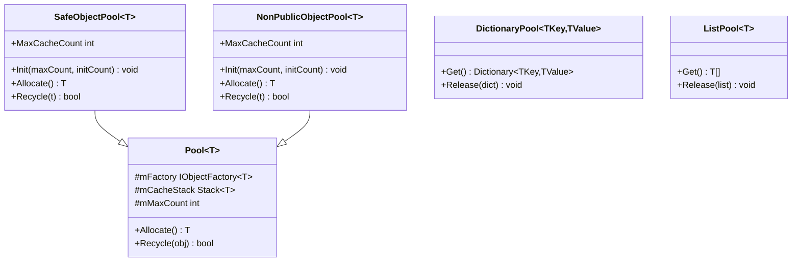
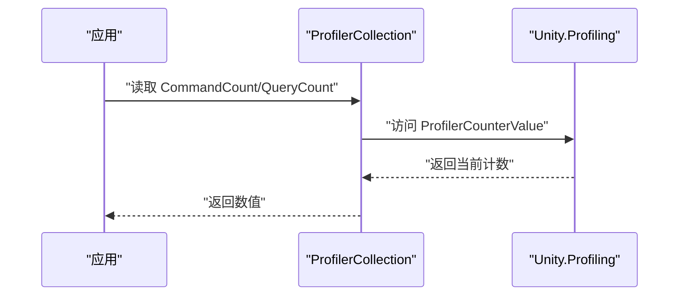
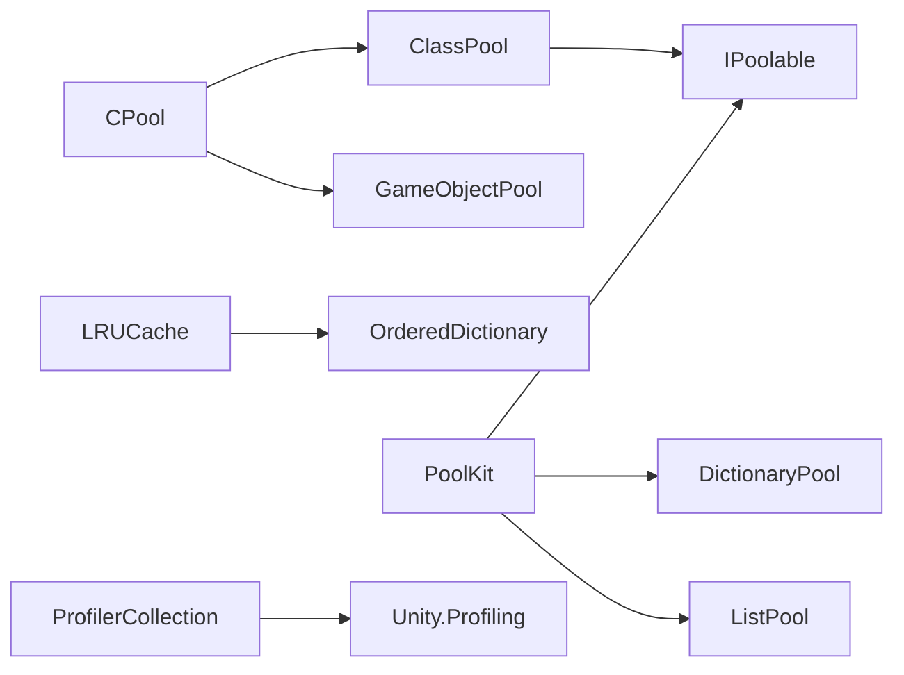

# 性能优化系统

<cite>
**本文引用的文件**   
- [CPool.cs](file://Assets/Game/Framework/MPool/CPool.cs)
- [ClassPool.cs](file://Assets/Game/Framework/MPool/ClassPool.cs)
- [GameObjectPool.cs](file://Assets/Game/Framework/MPool/GameObjectPool.cs)
- [IPoolable.cs](file://Assets/Game/Framework/MPool/IPoolable.cs)
- [LRUCache.cs](file://Assets/Game/Framework/Base/LRUCache.cs)
- [OrderedDictionary.cs](file://Assets/Game/Framework/Base/OrderedDictionary.cs)
- [PoolKit.cs](file://Assets/Game/Framework/Qframework/Runtime/Toolkits/PoolKit.cs)
- [ProfilerCollection.cs](file://Assets/Game/Framework/Qframework/Runtime/Profiler/ProfilerCollection.cs)
</cite>

## 目录
1. [简介](#简介)
2. [项目结构](#项目结构)
3. [核心组件](#核心组件)
4. [架构总览](#架构总览)
5. [详细组件分析](#详细组件分析)
6. [依赖关系分析](#依赖关系分析)
7. [性能考量](#性能考量)
8. [故障排查指南](#故障排查指南)
9. [结论](#结论)
10. [附录](#附录)

## 简介
本文件聚焦于“性能优化系统”，围绕对象池、缓存与轻量级性能统计三大方向，梳理代码库中的关键实现与协作方式。目标是为开发者提供清晰的技术文档，帮助理解：
- 如何通过对象池降低GC压力与分配开销
- 如何使用LRU缓存提升热点数据访问效率
- 如何结合Unity Profiler进行轻量级指标采集与分析

## 项目结构
本项目在框架层提供了多套对象池与缓存工具，并集成Unity Profiler能力用于运行时统计。与性能相关的核心目录与文件如下：
- MPool：通用对象池（类对象池、GameObject对象池）
- Base：基础数据结构（LRU缓存、有序字典等）
- Qframework：框架工具集（对象池抽象、工厂模式、数据容器池）
- Profiler：基于Unity.Profiling的轻量计数器集合

图表来源
- [CPool.cs:1-263](file://Assets/Game/Framework/MPool/CPool.cs#L1-L263)
- [ClassPool.cs](file://Assets/Game/Framework/MPool/ClassPool.cs)
- [GameObjectPool.cs](file://Assets/Game/Framework/MPool/GameObjectPool.cs)
- [IPoolable.cs](file://Assets/Game/Framework/MPool/IPoolable.cs)
- [LRUCache.cs:1-153](file://Assets/Game/Framework/Base/LRUCache.cs#L1-L153)
- [OrderedDictionary.cs](file://Assets/Game/Framework/Base/OrderedDictionary.cs)
- [PoolKit.cs:1-643](file://Assets/Game/Framework/Qframework/Runtime/Toolkits/PoolKit.cs#L1-L643)
- [ProfilerCollection.cs:1-20](file://Assets/Game/Framework/Qframework/Runtime/Profiler/ProfilerCollection.cs#L1-L20)

章节来源
- [CPool.cs:1-263](file://Assets/Game/Framework/MPool/CPool.cs#L1-L263)
- [LRUCache.cs:1-153](file://Assets/Game/Framework/Base/LRUCache.cs#L1-L153)
- [PoolKit.cs:1-643](file://Assets/Game/Framework/Qframework/Runtime/Toolkits/PoolKit.cs#L1-L643)
- [ProfilerCollection.cs:1-20](file://Assets/Game/Framework/Qframework/Runtime/Profiler/ProfilerCollection.cs#L1-L20)

## 核心组件
- 统一对象池入口 CPool
  - 管理类对象池与GameObject对象池的生命周期
  - 提供Pop/Push、创建/回收/尝试回收等便捷API
  - 支持按资源名或池名回收，以及最大缓存释放策略
- 类对象池 ClassPool
  - 针对具体类型的对象池，配合IPoolable实现复用与重置
- GameObject对象池 GameObjectPool
  - 管理场景根节点下的实例化与回收，支持溢出清理
- LRU缓存 LRUCache
  - 基于有序字典实现容量控制、命中/未命中统计、淘汰回调
- QFramework 对象池体系
  - 抽象池 Pool<T>、安全池 SafeObjectPool<T>、非公有构造池 NonPublicObjectPool<T>
  - 数据容器池：DictionaryPool、ListPool 及其扩展方法
- 性能统计 ProfilerCollection
  - 基于 Unity.Profiling 的轻量计数器，便于在关键路径埋点

章节来源
- [CPool.cs:1-263](file://Assets/Game/Framework/MPool/CPool.cs#L1-L263)
- [ClassPool.cs](file://Assets/Game/Framework/MPool/ClassPool.cs)
- [GameObjectPool.cs](file://Assets/Game/Framework/MPool/GameObjectPool.cs)
- [IPoolable.cs](file://Assets/Game/Framework/MPool/IPoolable.cs)
- [LRUCache.cs:1-153](file://Assets/Game/Framework/Base/LRUCache.cs#L1-L153)
- [PoolKit.cs:1-643](file://Assets/Game/Framework/Qframework/Runtime/Toolkits/PoolKit.cs#L1-L643)
- [ProfilerCollection.cs:1-20](file://Assets/Game/Framework/Qframework/Runtime/Profiler/ProfilerCollection.cs#L1-L20)

## 架构总览
下图展示了对象池与缓存的核心交互关系，以及性能统计的接入点。

图表来源
- [CPool.cs:1-263](file://Assets/Game/Framework/MPool/CPool.cs#L1-L263)
- [ClassPool.cs](file://Assets/Game/Framework/MPool/ClassPool.cs)
- [GameObjectPool.cs](file://Assets/Game/Framework/MPool/GameObjectPool.cs)
- [IPoolable.cs](file://Assets/Game/Framework/MPool/IPoolable.cs)
- [LRUCache.cs:1-153](file://Assets/Game/Framework/Base/LRUCache.cs#L1-L153)
- [OrderedDictionary.cs](file://Assets/Game/Framework/Base/OrderedDictionary.cs)
- [PoolKit.cs:1-643](file://Assets/Game/Framework/Qframework/Runtime/Toolkits/PoolKit.cs#L1-L643)
- [ProfilerCollection.cs:1-20](file://Assets/Game/Framework/Qframework/Runtime/Profiler/ProfilerCollection.cs#L1-L20)

## 详细组件分析

### 类对象池与统一入口（CPool / ClassPool / IPoolable）
- 设计要点
  - 通过类型键维护多个ClassPool实例，避免重复创建
  - 支持按需初始化构造函数与批量弹出
  - 提供最大缓存释放策略，减少内存占用
- 关键流程
  - 出栈：查找或创建对应ClassPool -> Pop -> 返回IPoolable
  - 入栈：根据类型Push到对应池；若池不存在则直接回收
  - 回收：按类型或实例回收并移除映射

图表来源
- [CPool.cs:55-91](file://Assets/Game/Framework/MPool/CPool.cs#L55-L91)
- [ClassPool.cs](file://Assets/Game/Framework/MPool/ClassPool.cs)
- [IPoolable.cs](file://Assets/Game/Framework/MPool/IPoolable.cs)

章节来源
- [CPool.cs:1-263](file://Assets/Game/Framework/MPool/CPool.cs#L1-L263)
- [ClassPool.cs](file://Assets/Game/Framework/MPool/ClassPool.cs)
- [IPoolable.cs](file://Assets/Game/Framework/MPool/IPoolable.cs)

### GameObject对象池（CPool / GameObjectPool）
- 设计要点
  - 以名称为键管理多个GameObjectPool
  - 支持从资源或已有对象克隆创建，设置初始/扩容/最大缓存数量
  - 提供销毁部分对象、按资源名回收、尝试回收等策略
- 关键流程
  - 创建：检查是否存在 -> 新建并注册到字典
  - 弹出：存在则Pop，否则告警返回null
  - 回收：存在则Push，否则直接销毁

图表来源
- [CPool.cs:164-213](file://Assets/Game/Framework/MPool/CPool.cs#L164-L213)
- [GameObjectPool.cs](file://Assets/Game/Framework/MPool/GameObjectPool.cs)

章节来源
- [CPool.cs:164-213](file://Assets/Game/Framework/MPool/CPool.cs#L164-L213)
- [GameObjectPool.cs](file://Assets/Game/Framework/MPool/GameObjectPool.cs)

### LRU缓存（LRUCache）
- 设计要点
  - 基于有序字典维护访问顺序，超出容量时淘汰最久未使用项
  - 暴露命中/未命中计数，便于评估命中率
  - 支持自定义SizeOf与EntryEvicted回调
- 复杂度
  - Get/Put/Remove 平均 O(1)
  - TrimToSize 线性扫描至满足容量上限
- 典型用法
  - 覆盖 SizeOf 计算条目大小
  - 覆盖 EntryEvicted 执行资源释放逻辑

图表来源
- [LRUCache.cs:33-57](file://Assets/Game/Framework/Base/LRUCache.cs#L33-L57)
- [LRUCache.cs:105-125](file://Assets/Game/Framework/Base/LRUCache.cs#L105-L125)

章节来源
- [LRUCache.cs:1-153](file://Assets/Game/Framework/Base/LRUCache.cs#L1-L153)
- [OrderedDictionary.cs](file://Assets/Game/Framework/Base/OrderedDictionary.cs)

### QFramework 对象池体系（PoolKit）
- 抽象池 Pool<T>
  - 内部维护栈式缓存与工厂，提供 Allocate/Recycle 基本能力
- 安全池 SafeObjectPool<T>
  - 单例模式，支持最大缓存数限制与预填充
  - 回收时校验状态并触发 OnRecycled
- 非公有构造池 NonPublicObjectPool<T>
  - 通过反射获取无参私有构造器创建对象
- 数据容器池
  - DictionaryPool<TKey,TValue>：复用字典实例
  - ListPool<T>：复用列表实例
  - 提供扩展方法 Release2Pool 简化调用

图表来源
- [PoolKit.cs:338-373](file://Assets/Game/Framework/Qframework/Runtime/Toolkits/PoolKit.cs#L338-L373)
- [PoolKit.cs:45-158](file://Assets/Game/Framework/Qframework/Runtime/Toolkits/PoolKit.cs#L45-L158)
- [PoolKit.cs:164-268](file://Assets/Game/Framework/Qframework/Runtime/Toolkits/PoolKit.cs#L164-L268)
- [PoolKit.cs:384-483](file://Assets/Game/Framework/Qframework/Runtime/Toolkits/PoolKit.cs#L384-L483)

章节来源
- [PoolKit.cs:1-643](file://Assets/Game/Framework/Qframework/Runtime/Toolkits/PoolKit.cs#L1-L643)

### 性能统计（ProfilerCollection）
- 基于 Unity.Profiling 的计数器集合
- 适合在关键路径（如命令处理、查询）埋点，观察帧末刷新与清零行为

图表来源
- [ProfilerCollection.cs:1-20](file://Assets/Game/Framework/Qframework/Runtime/Profiler/ProfilerCollection.cs#L1-L20)

章节来源
- [ProfilerCollection.cs:1-20](file://Assets/Game/Framework/Qframework/Runtime/Profiler/ProfilerCollection.cs#L1-L20)

## 依赖关系分析
- 耦合与内聚
  - CPool 作为统一入口，聚合 ClassPool 与 GameObjectPool，职责清晰
  - ClassPool 与 IPoolable 强耦合，确保对象生命周期可控
  - LRUCache 依赖 OrderedDictionary 维持访问顺序
  - PoolKit 的抽象池与具体实现解耦良好，工厂模式增强扩展性
- 外部依赖
  - Unity.Profiling 用于性能统计
  - Unity 引擎 API（GameObject 生命周期）

图表来源
- [CPool.cs:1-263](file://Assets/Game/Framework/MPool/CPool.cs#L1-L263)
- [ClassPool.cs](file://Assets/Game/Framework/MPool/ClassPool.cs)
- [GameObjectPool.cs](file://Assets/Game/Framework/MPool/GameObjectPool.cs)
- [IPoolable.cs](file://Assets/Game/Framework/MPool/IPoolable.cs)
- [LRUCache.cs:1-153](file://Assets/Game/Framework/Base/LRUCache.cs#L1-L153)
- [OrderedDictionary.cs](file://Assets/Game/Framework/Base/OrderedDictionary.cs)
- [PoolKit.cs:1-643](file://Assets/Game/Framework/Qframework/Runtime/Toolkits/PoolKit.cs#L1-L643)
- [ProfilerCollection.cs:1-20](file://Assets/Game/Framework/Qframework/Runtime/Profiler/ProfilerCollection.cs#L1-L20)

## 性能考量
- 对象池
  - 合理设置初始/扩容/最大缓存数量，避免频繁扩容与过度占用内存
  - 对频繁分配的数据结构（List/Dictionary）优先使用专用池
  - 及时回收并重置对象状态，避免脏数据导致额外计算
- LRU缓存
  - 正确实现 SizeOf，避免误判导致过早淘汰
  - 在 EntryEvicted 中释放引用型资源，防止内存泄漏
  - 监控命中率，动态调整 MaxSize
- 性能统计
  - 仅在关键路径埋点，避免过多Profiler调用影响性能
  - 使用帧末刷新与清零选项，便于逐帧对比

[本节为通用指导，不直接分析具体文件]

## 故障排查指南
- 对象池相关问题
  - 池不存在：检查创建流程与命名一致性
  - 未回收导致内存增长：确认Push/Recycle调用路径，避免遗漏
  - 最大缓存释放无效：检查 canRelease 标志与释放策略
- LRU缓存问题
  - 命中率低：检查 Key 选择与 SizeOf 实现
  - 淘汰异常：确认 TrimToSize 条件与 EvictionCount 统计
- 性能统计问题
  - 计数不更新：确认埋点位置与 Unity.Profiling 启用状态

章节来源
- [CPool.cs:138-153](file://Assets/Game/Framework/MPool/CPool.cs#L138-L153)
- [CPool.cs:196-213](file://Assets/Game/Framework/MPool/CPool.cs#L196-L213)
- [LRUCache.cs:105-125](file://Assets/Game/Framework/Base/LRUCache.cs#L105-L125)

## 结论
该性能优化系统通过对象池与LRU缓存两大手段，有效降低分配与查找成本；结合Unity Profiler的轻量统计，形成“优化-度量-再优化”的闭环。建议在实际项目中：
- 将高频分配的对象纳入对象池
- 对热点数据采用LRU缓存并持续监控命中率
- 在关键路径埋点，定期复盘性能数据并迭代优化

[本节为总结性内容，不直接分析具体文件]

## 附录
- 术语
  - 对象池：预先创建并复用对象的机制
  - LRU缓存：最近最少使用的缓存淘汰策略
  - 埋点：在关键路径插入统计代码以收集性能数据

[本节为概念说明，不直接分析具体文件]