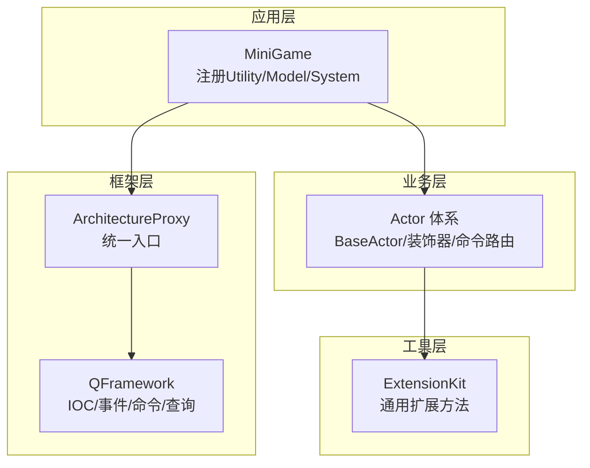
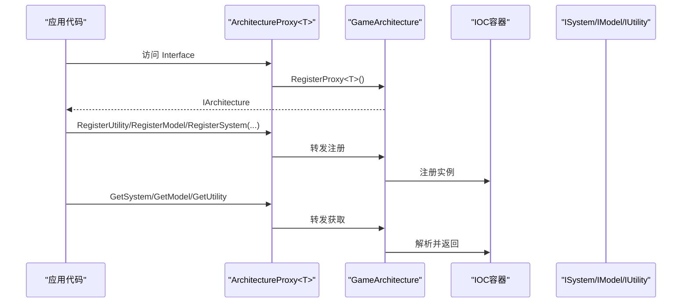
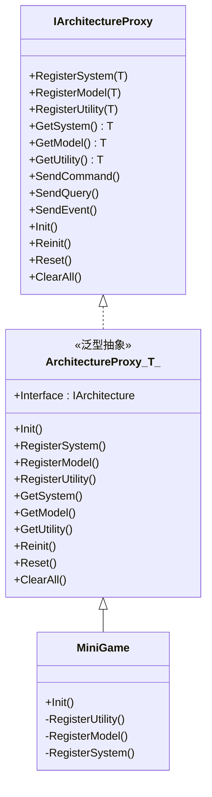
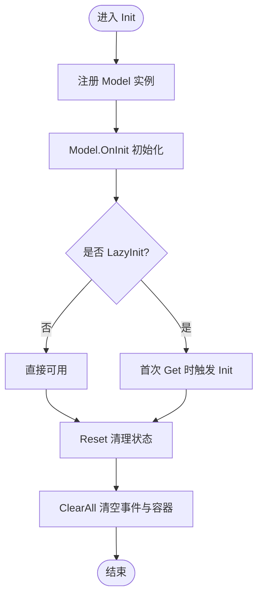
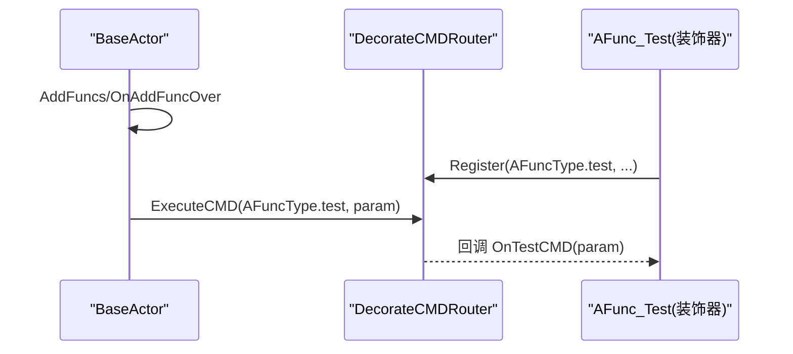
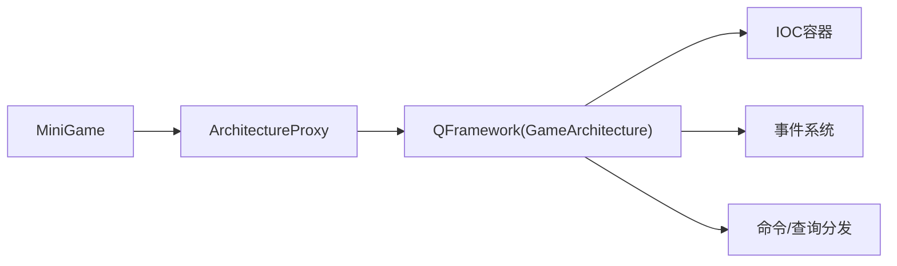

# 扩展开发

<cite>
**本文引用的文件**
- [ArchitectureProxy.cs](file://Assets/Game/Framework/Qframework/Runtime/Moyv/Proxies/ArchitectureProxy.cs)
- [QFramework.cs](file://Assets/Game/Framework/Qframework/Runtime/QFramework.cs)
- [MiniGame.cs](file://Assets/Game/Scripts/MiniGame_Scripts/MiniGame.cs)
- [TestArchitectureProxy.cs](file://Assets/Game/Framework/Qframework/Tests/Runtime/TestArchitectureProxy.cs)
- [SceneFlowController.cs](file://Assets/Game/Scripts/MiniGame_Scripts/Controller/SceneFlowController.cs)
- [BaseActor.cs](file://Assets/Game/Scripts/Game/Runtime/Logic/Actor/BaseActor.cs)
- [DecorateCMDRouter.cs](file://Assets/Game/Scripts/Game/Runtime/Logic/Decorate/Router/DecorateCMDRouter.cs)
- [AFunc_Test.cs](file://Assets/Game/Scripts/Game/Runtime/Logic/Decorate/TestDec/AFunc_Test.cs)
- [ExtensionKit.cs](file://Assets/Game/Framework/Qframework/Runtime/Toolkits/ExtensionKit.cs)
</cite>

## 目录
1. [简介](#简介)
2. [项目结构](#项目结构)
3. [核心组件](#核心组件)
4. [架构总览](#架构总览)
5. [详细组件分析](#详细组件分析)
6. [依赖关系分析](#依赖关系分析)
7. [性能考量](#性能考量)
8. [故障排查指南](#故障排查指南)
9. [结论](#结论)
10. [附录](#附录)

## 简介
本文件面向希望在现有框架基础上进行功能扩展与新增系统模块的开发者。内容涵盖：
- ArchitectureProxy 的扩展机制，包括自定义架构代理的创建与注册
- System 模块的开发流程（基于 ActorSystem 示例）
- Model 层的扩展方法与数据模型生命周期管理
- Utility 工具类的开发规范（接口定义与实现要求）
- 插件开发的完整示例（从需求分析到代码实现）
- 扩展模块的测试与部署指南

## 项目结构
本项目采用分层与模块化组织方式：
- 框架层：QFramework 提供 IOC、事件总线、命令/查询、架构代理等基础设施
- 业务层：MiniGame 作为应用入口，负责注册 Utility、Model、System
- 逻辑层：Actor 体系与装饰器命令路由用于构建可组合的业务能力
- 工具层：通用扩展方法、集合操作、概率计算等



图表来源
- [ArchitectureProxy.cs:1-197](file://Assets/Game/Framework/Qframework/Runtime/Moyv/Proxies/ArchitectureProxy.cs#L1-L197)
- [QFramework.cs:94-235](file://Assets/Game/Framework/Qframework/Runtime/QFramework.cs#L94-L235)
- [MiniGame.cs:1-30](file://Assets/Game/Scripts/MiniGame_Scripts/MiniGame.cs#L1-L30)

章节来源
- [ArchitectureProxy.cs:1-197](file://Assets/Game/Framework/Qframework/Runtime/Moyv/Proxies/ArchitectureProxy.cs#L1-L197)
- [QFramework.cs:94-235](file://Assets/Game/Framework/Qframework/Runtime/QFramework.cs#L94-L235)
- [MiniGame.cs:1-30](file://Assets/Game/Scripts/MiniGame_Scripts/MiniGame.cs#L1-L30)

## 核心组件
- ArchitectureProxy<T>：为具体应用提供统一的架构访问入口，内部委托至 GameArchitecture 完成注册与获取
- GameArchitecture（由 QFramework 提供）：维护 IOC 容器、事件系统、命令/查询分发、System/Model/Utility 生命周期管理
- MiniGame：继承自 ArchitectureProxy<MiniGame>，在 Init 中集中注册 Utility、Model、System
- Actor 体系：以 BaseActor 为核心，结合装饰器与命令路由实现可插拔的功能模块

章节来源
- [ArchitectureProxy.cs:53-197](file://Assets/Game/Framework/Qframework/Runtime/Moyv/Proxies/ArchitectureProxy.cs#L53-L197)
- [QFramework.cs:94-235](file://Assets/Game/Framework/Qframework/Runtime/QFramework.cs#L94-L235)
- [MiniGame.cs:1-30](file://Assets/Game/Scripts/MiniGame_Scripts/MiniGame.cs#L1-L30)

## 架构总览
下图展示了从应用入口到框架核心的调用链与职责划分。



图表来源
- [ArchitectureProxy.cs:57-82](file://Assets/Game/Framework/Qframework/Runtime/Moyv/Proxies/ArchitectureProxy.cs#L57-L82)
- [QFramework.cs:196-223](file://Assets/Game/Framework/Qframework/Runtime/QFramework.cs#L196-L223)

## 详细组件分析

### ArchitectureProxy 扩展机制
- 自定义架构代理创建
  - 新建类继承自 ArchitectureProxy<你的类型>
  - 重写 Init，在其中按顺序注册 Utility、Model、System
  - 通过静态 Interface 属性获取统一入口
- 注册与获取
  - 所有 RegisterXxx 与 GetXxx 均委托给 GameArchitecture
  - 支持延迟初始化与自动创建策略（由底层容器控制）
- 生命周期管理
  - Reinit/Reset/ClearAll 等方法由 ArchitectureProxy 转发至 GameArchitecture
  - 建议在 Reset 后使用 Reinit 重启已注册的 System/Model



图表来源
- [ArchitectureProxy.cs:7-197](file://Assets/Game/Framework/Qframework/Runtime/Moyv/Proxies/ArchitectureProxy.cs#L7-L197)
- [MiniGame.cs:1-30](file://Assets/Game/Scripts/MiniGame_Scripts/MiniGame.cs#L1-L30)

章节来源
- [ArchitectureProxy.cs:53-197](file://Assets/Game/Framework/Qframework/Runtime/Moyv/Proxies/ArchitectureProxy.cs#L53-L197)
- [MiniGame.cs:1-30](file://Assets/Game/Scripts/MiniGame_Scripts/MiniGame.cs#L1-L30)

### System 模块开发流程（基于 ActorSystem 示例）
- 目标：新增一个系统，例如 ActorSystem，用于管理 Actor 的创建、更新与销毁
- 步骤
  1) 在 MiniGame.Init 中注册新系统：RegisterSystem(new ActorSystem())
  2) 在系统中订阅必要的事件或命令，协调 Model 与 UI/场景
  3) 如需与其他系统交互，通过 GetSystem<T>() 获取
- 参考调用点
  - 场景控制器中通过 ArchitectureProxy.Interface 发送事件与命令，驱动 Actor 行为

```mermaid
sequenceDiagram
participant Scene as "场景控制器"
participant Proxy as "ArchitectureProxy.Interface"
participant ActorSys as "ActorSystem(待实现)"
participant Actor as "BaseActor/装饰器"
Scene->>Proxy : SendEvent/ExecuteCMD
Proxy->>ActorSys : 事件/命令分发
ActorSys->>Actor : CreateActor/Update/RemoveActor
Actor-->>ActorSys : 回调/状态上报
```

图表来源
- [SceneFlowController.cs:249-286](file://Assets/Game/Scripts/MiniGame_Scripts/Controller/SceneFlowController.cs#L249-L286)
- [BaseActor.cs:438-480](file://Assets/Game/Scripts/Game/Runtime/Logic/Actor/BaseActor.cs#L438-L480)

章节来源
- [MiniGame.cs:19-22](file://Assets/Game/Scripts/MiniGame_Scripts/MiniGame.cs#L19-L22)
- [SceneFlowController.cs:249-286](file://Assets/Game/Scripts/MiniGame_Scripts/Controller/SceneFlowController.cs#L249-L286)
- [BaseActor.cs:438-480](file://Assets/Game/Scripts/Game/Runtime/Logic/Actor/BaseActor.cs#L438-L480)

### Model 层扩展方法与生命周期管理
- 设计建议
  - 每个业务域对应一个 Model，封装该域的数据与持久化逻辑
  - 在 MiniGame.RegisterModel 中集中注册
- 生命周期
  - OnInit：初始化数据或订阅事件
  - Reset：清理状态，便于热重载或场景切换
  - ClearAll：框架级清空，包含事件与容器
- 参考用例
  - 测试用例展示了多代理下 Model 的注册与获取行为，以及错误日志预期



图表来源
- [QFramework.cs:164-187](file://Assets/Game/Framework/Qframework/Runtime/QFramework.cs#L164-L187)
- [TestArchitectureProxy.cs:72-113](file://Assets/Game/Framework/Qframework/Tests/Runtime/TestArchitectureProxy.cs#L72-L113)

章节来源
- [MiniGame.cs:14-17](file://Assets/Game/Scripts/MiniGame_Scripts/MiniGame.cs#L14-L17)
- [QFramework.cs:164-187](file://Assets/Game/Framework/Qframework/Runtime/QFramework.cs#L164-L187)
- [TestArchitectureProxy.cs:72-113](file://Assets/Game/Framework/Qframework/Tests/Runtime/TestArchitectureProxy.cs#L72-L113)

### Utility 工具类开发规范
- 接口与实现
  - 实现 IUtility 接口（由框架定义），并在 MiniGame.RegisterUtility 中注册
  - 保持无副作用的纯函数风格，必要时提供异步初始化方法
- 常见用途
  - 资源加载（如 YooassetUtility）
  - 配置表加载（如 LubanUtility）
- 参考注册位置
  - MiniGame.RegisterUtility 中集中注册

章节来源
- [MiniGame.cs:24-28](file://Assets/Game/Scripts/MiniGame_Scripts/MiniGame.cs#L24-L28)

### 装饰器与命令路由（Actor 能力扩展）
- 装饰器模式
  - 通过 AFuncDecorate 派生类声明对某 AFuncType 的增强
  - 在 OnRegisterCMD 中向 DecorateCMDRouter 注册命令处理
- 命令路由
  - DecorateCMDRouter 提供多种 Register 重载，支持有参/无参、有返回/无返回
  - 重复注册会记录错误日志，避免覆盖
- 执行流程
  - BaseActor 在 AddFuncs/OnAddFuncOver 阶段组装并执行等待队列中的命令



图表来源
- [DecorateCMDRouter.cs:1-87](file://Assets/Game/Scripts/Game/Runtime/Logic/Decorate/Router/DecorateCMDRouter.cs#L1-L87)
- [AFunc_Test.cs:1-27](file://Assets/Game/Scripts/Game/Runtime/Logic/Decorate/TestDec/AFunc_Test.cs#L1-L27)
- [BaseActor.cs:438-480](file://Assets/Game/Scripts/Game/Runtime/Logic/Actor/BaseActor.cs#L438-L480)

章节来源
- [DecorateCMDRouter.cs:1-87](file://Assets/Game/Scripts/Game/Runtime/Logic/Decorate/Router/DecorateCMDRouter.cs#L1-L87)
- [AFunc_Test.cs:1-27](file://Assets/Game/Scripts/Game/Runtime/Logic/Decorate/TestDec/AFunc_Test.cs#L1-L27)
- [BaseActor.cs:438-480](file://Assets/Game/Scripts/Game/Runtime/Logic/Actor/BaseActor.cs#L438-L480)

### 插件开发完整示例（从需求到实现）
- 需求分析
  - 新增“成就系统”插件：监听玩家行为事件，累计进度，达到阈值解锁成就
- 设计要点
  - Model：AchievementModel，保存成就列表与进度
  - System：AchievementSystem，订阅事件、更新进度、触发解锁通知
  - Utility：AchievementSaveUtility，负责本地存档与读取
  - 装饰器：可选，对特定 Actor 的行为增加成就判定
- 实现步骤
  1) 在 MiniGame.RegisterUtility 中注册 AchievementSaveUtility
  2) 在 MiniGame.RegisterModel 中注册 AchievementModel
  3) 在 MiniGame.RegisterSystem 中注册 AchievementSystem
  4) 在相关系统或场景中发送事件，驱动成就更新
- 验证与回归
  - 使用单元测试验证注册顺序与获取结果
  - 模拟边界条件（重复注册、空数据、异步加载失败）

[本节为概念性说明，不直接分析具体文件]

## 依赖关系分析
- 耦合与内聚
  - ArchitectureProxy 仅依赖 GameArchitecture，内聚度高
  - MiniGame 作为装配中心，低耦合地组合各模块
- 外部依赖
  - IOC 容器、事件系统、命令/查询分发均由 QFramework 提供
- 循环依赖
  - 通过事件与命令解耦，避免 System 之间直接强引用



图表来源
- [ArchitectureProxy.cs:57-82](file://Assets/Game/Framework/Qframework/Runtime/Moyv/Proxies/ArchitectureProxy.cs#L57-L82)
- [QFramework.cs:196-235](file://Assets/Game/Framework/Qframework/Runtime/QFramework.cs#L196-L235)

章节来源
- [ArchitectureProxy.cs:57-82](file://Assets/Game/Framework/Qframework/Runtime/Moyv/Proxies/ArchitectureProxy.cs#L57-L82)
- [QFramework.cs:196-235](file://Assets/Game/Framework/Qframework/Runtime/QFramework.cs#L196-L235)

## 性能考量
- 延迟初始化：按需触发 System/Model 的 Init，减少启动开销
- 对象池：BaseActor 中使用 ListPool 管理临时列表，降低 GC 压力
- 事件与命令：尽量使用轻量事件与结构化命令，避免频繁装箱
- 资源卸载：在合适时机调用 UnloadUnusedAssets，释放内存

章节来源
- [BaseActor.cs:438-480](file://Assets/Game/Scripts/Game/Runtime/Logic/Actor/BaseActor.cs#L438-L480)
- [SceneFlowController.cs:280-286](file://Assets/Game/Scripts/MiniGame_Scripts/Controller/SceneFlowController.cs#L280-L286)

## 故障排查指南
- 常见问题
  - 获取未注册的系统/模型：检查是否在 Init 中正确注册
  - 重复注册命令：DecorateCMDRouter 会记录错误日志，确认唯一性
  - 事件未触发：确认订阅方生命周期与事件发送时机
- 定位手段
  - 使用测试用例断言注册与获取结果
  - 关注错误日志输出，快速定位问题模块

章节来源
- [TestArchitectureProxy.cs:78-107](file://Assets/Game/Framework/Qframework/Tests/Runtime/TestArchitectureProxy.cs#L78-L107)
- [DecorateCMDRouter.cs:34-87](file://Assets/Game/Scripts/Game/Runtime/Logic/Decorate/Router/DecorateCMDRouter.cs#L34-L87)

## 结论
通过 ArchitectureProxy 的统一入口与 QFramework 的基础设施，项目实现了高内聚、低耦合的模块化架构。遵循本文档的扩展规范与最佳实践，可以快速、安全地添加新的系统、模型与工具，并通过装饰器与命令路由灵活组合业务能力。

## 附录
- 常用扩展方法
  - ExtensionKit 提供大量实用扩展，如集合遍历、类型判断、字符串解析等，可在业务中直接使用

章节来源
- [ExtensionKit.cs:226-253](file://Assets/Game/Framework/Qframework/Runtime/Toolkits/ExtensionKit.cs#L226-L253)
- [ExtensionKit.cs:423-456](file://Assets/Game/Framework/Qframework/Runtime/Toolkits/ExtensionKit.cs#L423-L456)
- [ExtensionKit.cs:790-815](file://Assets/Game/Framework/Qframework/Runtime/Toolkits/ExtensionKit.cs#L790-L815)
- [ExtensionKit.cs:1271-1314](file://Assets/Game/Framework/Qframework/Runtime/Toolkits/ExtensionKit.cs#L1271-L1314)