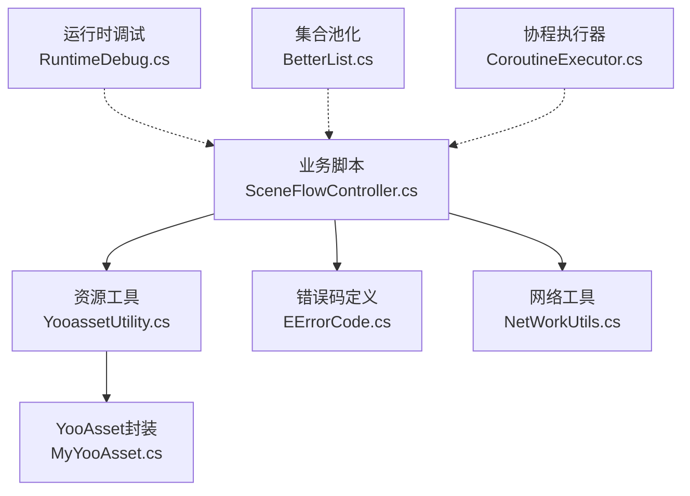
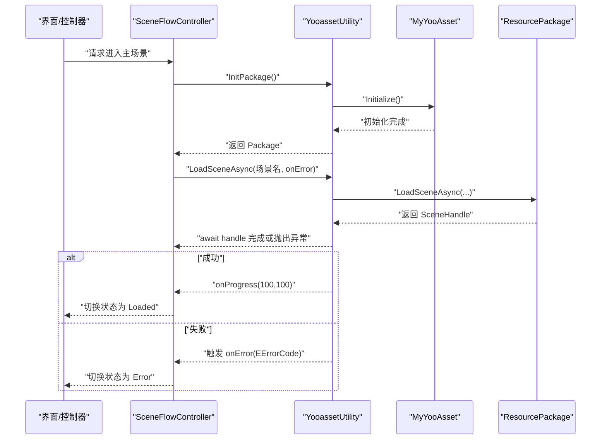
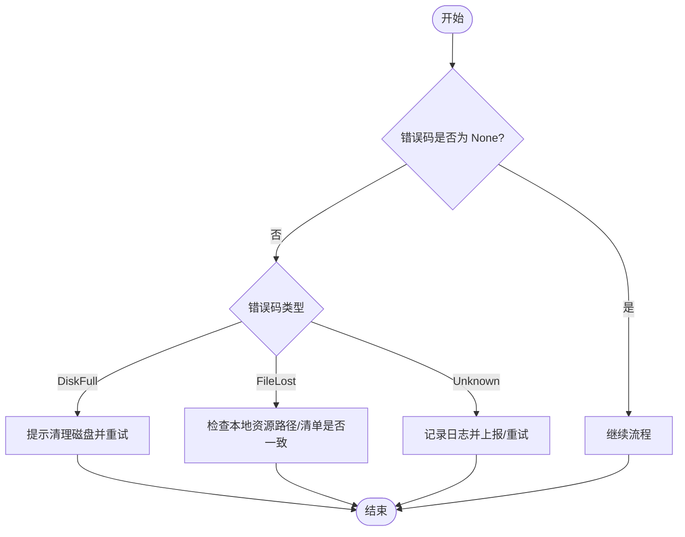
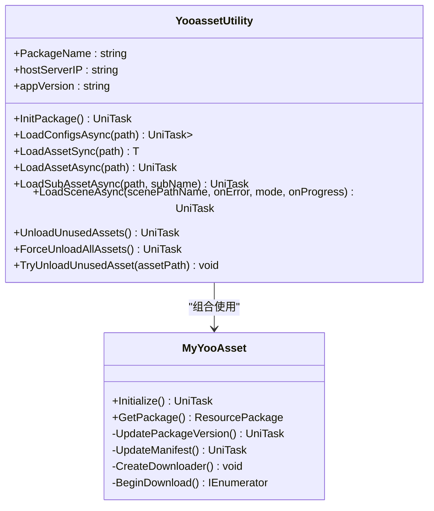
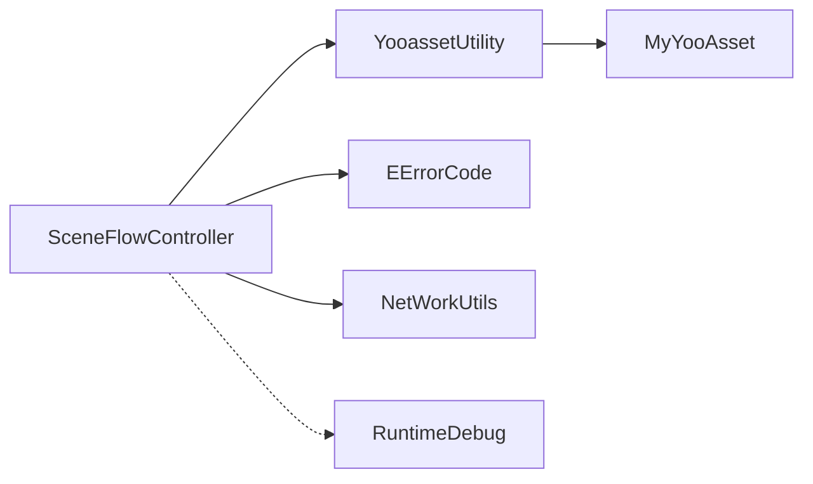

# 故障排除

<cite>
**本文引用的文件**   
- [EErrorCode.cs](file://Assets/Game/Scripts/MiniGame_Scripts/Utility/EErrorCode.cs)
- [YooassetUtility.cs](file://Assets/Game/Scripts/MiniGame_Scripts/Utility/YooassetUtility.cs)
- [MyYooAsset.cs](file://Assets/Game/Scripts/MiniGame_Scripts/Utility/MyYooAsset.cs)
- [SceneFlowController.cs](file://Assets/Game/Scripts/MiniGame_Scripts/Controller/SceneFlowController.cs)
- [NetWorkUtils.cs](file://Assets/Game/Framework/Base/NetWorkUtils.cs)
- [RuntimeDebug.cs](file://Assets/Game/Framework/Base/RuntimeDebug.cs)
- [BetterList.cs](file://Assets/Game/Framework/Base/BetterList.cs)
- [CoroutineExecutor.cs](file://Assets/Game/Framework/Base/CoroutineExecutor.cs)
</cite>

## 目录
1. [简介](#简介)
2. [项目结构](#项目结构)
3. [核心组件](#核心组件)
4. [架构总览](#架构总览)
5. [详细组件分析](#详细组件分析)
6. [依赖关系分析](#依赖关系分析)
7. [性能注意事项](#性能注意事项)
8. [故障排除指南](#故障排除指南)
9. [结论](#结论)
10. [附录](#附录)

## 简介
本指南面向 SimulationClient 项目的开发与运维人员，聚焦常见问题的定位与解决。内容覆盖：
- 编译期错误、运行时异常与资源加载失败
- EErrorCode 错误码含义与诊断流程
- 网络问题与热更新失败的排查方法
- 内存泄漏检测、CPU 瓶颈分析与渲染优化建议
- 调试技巧与工具使用

## 项目结构
本项目基于 Unity 工程组织，关键路径包括：
- Assets/Game/Scripts/MiniGame_Scripts/Utility：资源与错误码等通用工具
- Assets/Game/Scripts/MiniGame_Scripts/Controller：场景流控逻辑
- Assets/Game/Framework/Base：基础库（网络、协程执行器、运行时调试等）

图表来源
- [SceneFlowController.cs:135-177](file://Assets/Game/Scripts/MiniGame_Scripts/Controller/SceneFlowController.cs#L135-L177)
- [YooassetUtility.cs:1-122](file://Assets/Game/Scripts/MiniGame_Scripts/Utility/YooassetUtility.cs#L1-L122)
- [MyYooAsset.cs:193-280](file://Assets/Game/Scripts/MiniGame_Scripts/Utility/MyYooAsset.cs#L193-L280)
- [EErrorCode.cs:1-7](file://Assets/Game/Scripts/MiniGame_Scripts/Utility/EErrorCode.cs#L1-L7)
- [NetWorkUtils.cs:1-62](file://Assets/Game/Framework/Base/NetWorkUtils.cs#L1-L62)
- [RuntimeDebug.cs:1-249](file://Assets/Game/Framework/Base/RuntimeDebug.cs#L1-L249)
- [BetterList.cs:608-676](file://Assets/Game/Framework/Base/BetterList.cs#L608-L676)
- [CoroutineExecutor.cs:1-53](file://Assets/Game/Framework/Base/CoroutineExecutor.cs#L1-L53)

章节来源
- [SceneFlowController.cs:135-177](file://Assets/Game/Scripts/MiniGame_Scripts/Controller/SceneFlowController.cs#L135-L177)
- [YooassetUtility.cs:1-122](file://Assets/Game/Scripts/MiniGame_Scripts/Utility/YooassetUtility.cs#L1-L122)
- [MyYooAsset.cs:193-280](file://Assets/Game/Scripts/MiniGame_Scripts/Utility/MyYooAsset.cs#L193-L280)
- [EErrorCode.cs:1-7](file://Assets/Game/Scripts/MiniGame_Scripts/Utility/EErrorCode.cs#L1-L7)
- [NetWorkUtils.cs:1-62](file://Assets/Game/Framework/Base/NetWorkUtils.cs#L1-L62)
- [RuntimeDebug.cs:1-249](file://Assets/Game/Framework/Base/RuntimeDebug.cs#L1-L249)
- [BetterList.cs:608-676](file://Assets/Game/Framework/Base/BetterList.cs#L608-L676)
- [CoroutineExecutor.cs:1-53](file://Assets/Game/Framework/Base/CoroutineExecutor.cs#L1-L53)

## 核心组件
- 资源加载与释放：通过 YooassetUtility 统一封装 YooAsset 的异步加载、子资源加载、场景加载与资源卸载能力。
- 错误码体系：EErrorCode 提供磁盘空间不足、本地文件丢失、未知错误等语义化错误码，便于上层统一处理。
- 网络工具：NetWorkUtils 提供本机 IP 获取能力，辅助网络连通性自检。
- 运行时调试：RuntimeDebug 提供运行时开关与可视化区域，便于快速启用/禁用调试功能。
- 集合与协程：BetterList 提供缓冲池与清理策略；CoroutineExecutor 用于等待异步操作完成并回调。

章节来源
- [YooassetUtility.cs:1-122](file://Assets/Game/Scripts/MiniGame_Scripts/Utility/YooassetUtility.cs#L1-L122)
- [EErrorCode.cs:1-7](file://Assets/Game/Scripts/MiniGame_Scripts/Utility/EErrorCode.cs#L1-L7)
- [NetWorkUtils.cs:1-62](file://Assets/Game/Framework/Base/NetWorkUtils.cs#L1-L62)
- [RuntimeDebug.cs:1-249](file://Assets/Game/Framework/Base/RuntimeDebug.cs#L1-L249)
- [BetterList.cs:608-676](file://Assets/Game/Framework/Base/BetterList.cs#L608-L676)
- [CoroutineExecutor.cs:1-53](file://Assets/Game/Framework/Base/CoroutineExecutor.cs#L1-L53)

## 架构总览
资源与场景加载的关键调用链如下：

图表来源
- [SceneFlowController.cs:135-177](file://Assets/Game/Scripts/MiniGame_Scripts/Controller/SceneFlowController.cs#L135-L177)
- [YooassetUtility.cs:68-87](file://Assets/Game/Scripts/MiniGame_Scripts/Utility/YooassetUtility.cs#L68-L87)
- [MyYooAsset.cs:193-280](file://Assets/Game/Scripts/MiniGame_Scripts/Utility/MyYooAsset.cs#L193-L280)

## 详细组件分析

### 错误码与错误处理（EErrorCode）
- 枚举项与语义
  - None：无错误
  - DiskFull：磁盘已满，无法保存下载的资源
  - FileLost：本地错误，未找到对应文件
  - Unknown：未知错误
- 使用位置
  - 场景加载回调中根据错误码进行分支处理，并在日志中输出具体错误码以便追踪。

图表来源
- [EErrorCode.cs:1-7](file://Assets/Game/Scripts/MiniGame_Scripts/Utility/EErrorCode.cs#L1-L7)
- [SceneFlowController.cs:135-177](file://Assets/Game/Scripts/MiniGame_Scripts/Controller/SceneFlowController.cs#L135-L177)

章节来源
- [EErrorCode.cs:1-7](file://Assets/Game/Scripts/MiniGame_Scripts/Utility/EErrorCode.cs#L1-L7)
- [SceneFlowController.cs:135-177](file://Assets/Game/Scripts/MiniGame_Scripts/Controller/SceneFlowController.cs#L135-L177)

### 资源加载与热更新（YooassetUtility / MyYooAsset）
- 初始化与包获取
  - InitPackage 内部调用 MyYooAsset.Initialize，随后通过 GetPackage 获取 ResourcePackage。
- 资源加载
  - 支持同步/异步加载单个资源、批量 TextAsset、子资源以及场景加载。
  - 场景加载提供进度回调与错误回调，错误以 EErrorCode 形式回传。
- 版本与清单
  - MyYooAsset 内部包含版本请求与清单更新逻辑，若失败会记录警告信息。
- 资源释放
  - 提供卸载未引用资源、强制卸载所有资源、尝试卸载指定资源等方法。

图表来源
- [YooassetUtility.cs:1-122](file://Assets/Game/Scripts/MiniGame_Scripts/Utility/YooassetUtility.cs#L1-L122)
- [MyYooAsset.cs:193-280](file://Assets/Game/Scripts/MiniGame_Scripts/Utility/MyYooAsset.cs#L193-L280)

章节来源
- [YooassetUtility.cs:1-122](file://Assets/Game/Scripts/MiniGame_Scripts/Utility/YooassetUtility.cs#L1-L122)
- [MyYooAsset.cs:193-280](file://Assets/Game/Scripts/MiniGame_Scripts/Utility/MyYooAsset.cs#L193-L280)

### 网络连通性自检（NetWorkUtils）
- 提供 IPv4/IPv6 地址获取能力，可用于判断当前网络接口是否可用。
- 在 Windows 平台下优先筛选无线与以太网接口，并仅返回处于 Up 状态的接口地址。

章节来源
- [NetWorkUtils.cs:1-62](file://Assets/Game/Framework/Base/NetWorkUtils.cs#L1-L62)

### 运行时调试（RuntimeDebug）
- 运行时可配置多个点击区域作为“命令序列”，按顺序点击后触发启用/禁用事件。
- 编辑器模式下可绘制可视区域，便于定位点击判定范围。

章节来源
- [RuntimeDebug.cs:1-249](file://Assets/Game/Framework/Base/RuntimeDebug.cs#L1-L249)

### 集合与协程（BetterList / CoroutineExecutor）
- BetterList 内置缓冲池与周期性清理策略，有助于降低频繁分配带来的 GC 压力。
- CoroutineExecutor 用于包装 AsyncOperation，完成后回调并销毁自身对象，避免残留。

章节来源
- [BetterList.cs:608-676](file://Assets/Game/Framework/Base/BetterList.cs#L608-L676)
- [CoroutineExecutor.cs:1-53](file://Assets/Game/Framework/Base/CoroutineExecutor.cs#L1-L53)

## 依赖关系分析
- 模块耦合
  - SceneFlowController 依赖 YooassetUtility 进行资源与场景加载，并通过 EErrorCode 接收错误。
  - YooassetUtility 依赖 MyYooAsset 提供的包管理与下载能力。
  - NetWorkUtils 独立于业务层，供网络相关自检使用。
  - RuntimeDebug 通过事件机制与业务层解耦，便于按需启用调试功能。
- 外部依赖
  - YooAsset 资源框架（通过 YooassetUtility 与 MyYooAsset 封装）
  - UniTask（异步任务）
  - Unity 引擎 API（场景、资源、输入等）

图表来源
- [SceneFlowController.cs:135-177](file://Assets/Game/Scripts/MiniGame_Scripts/Controller/SceneFlowController.cs#L135-L177)
- [YooassetUtility.cs:1-122](file://Assets/Game/Scripts/MiniGame_Scripts/Utility/YooassetUtility.cs#L1-L122)
- [MyYooAsset.cs:193-280](file://Assets/Game/Scripts/MiniGame_Scripts/Utility/MyYooAsset.cs#L193-L280)
- [EErrorCode.cs:1-7](file://Assets/Game/Scripts/MiniGame_Scripts/Utility/EErrorCode.cs#L1-L7)
- [NetWorkUtils.cs:1-62](file://Assets/Game/Framework/Base/NetWorkUtils.cs#L1-L62)
- [RuntimeDebug.cs:1-249](file://Assets/Game/Framework/Base/RuntimeDebug.cs#L1-L249)

## 性能注意事项
- 内存管理
  - 使用 YooassetUtility 的 UnloadUnusedAssets/ForceUnloadAllAssets/TryUnloadUnusedAsset 在场景切换或空闲时释放资源，避免常驻内存膨胀。
  - 关注集合类（如 BetterList）的缓冲池清理周期，避免长期持有大数组导致内存峰值。
- CPU 与渲染
  - 减少每帧分配与装箱，复用对象与缓冲。
  - 控制同时加载的资源数量，避免 I/O 与解码阻塞主线程。
  - 合理使用 ShaderWarmUp 与资源预热，降低首帧卡顿。
- 网络与下载
  - 在下载前预估所需空间，结合 EErrorCode.DiskFull 进行用户提示与重试策略。
  - 对下载失败进行指数退避与断点续传（由底层框架支持），提升稳定性。

[本节为通用指导，不直接分析具体文件]

## 故障排除指南

### 一、编译期常见问题
- 命名空间缺失或程序集未引用
  - 现象：找不到类型或命名空间。
  - 排查：确认脚本所在程序集已正确声明引用；检查 YooAsset、UniTask 等第三方包的导入与版本一致性。
- 平台条件编译差异
  - 现象：某些 API 在目标平台不可用。
  - 排查：使用 #if UNITY_EDITOR/UNITY_STANDALONE_WIN 等宏区分实现；参考 NetWorkUtils 的平台分支写法。

章节来源
- [NetWorkUtils.cs:28-34](file://Assets/Game/Framework/Base/NetWorkUtils.cs#L28-L34)

### 二、运行时异常与崩溃
- 空引用与未初始化
  - 现象：访问 _package 或 Handle 为空导致 NullReferenceException。
  - 排查：确保 InitPackage 已完成且 GetPackage 非空；在调用 LoadSceneAsync 前校验返回值。
- 异步未 await 或异常未捕获
  - 现象：异步任务异常未被捕获，导致上层状态机进入错误态。
  - 排查：在 LoadSceneAsync 的 try/catch 中记录异常详情，并将错误码传递给上层。

章节来源
- [YooassetUtility.cs:68-87](file://Assets/Game/Scripts/MiniGame_Scripts/Utility/YooassetUtility.cs#L68-L87)
- [SceneFlowController.cs:151-156](file://Assets/Game/Scripts/MiniGame_Scripts/Controller/SceneFlowController.cs#L151-L156)

### 三、资源加载失败
- 资源路径不正确
  - 现象：LoadAsset/LoadAllAssets 返回空或报错。
  - 排查：确认传入的是确定文件路径而非父级文件夹；核对清单中的资源键值。
- 子资源名称不匹配
  - 现象：LoadSubAssetAsync 取不到目标子资源。
  - 排查：检查 subName 是否与打包时的子资源名一致。
- 场景加载失败
  - 现象：场景切换失败，触发 onError 回调。
  - 排查：根据 EErrorCode 分支处理；查看日志中的错误码与异常消息。

章节来源
- [YooassetUtility.cs:35-66](file://Assets/Game/Scripts/MiniGame_Scripts/Utility/YooassetUtility.cs#L35-L66)
- [YooassetUtility.cs:68-87](file://Assets/Game/Scripts/MiniGame_Scripts/Utility/YooassetUtility.cs#L68-L87)
- [SceneFlowController.cs:135-156](file://Assets/Game/Scripts/MiniGame_Scripts/Controller/SceneFlowController.cs#L135-L156)
- [EErrorCode.cs:1-7](file://Assets/Game/Scripts/MiniGame_Scripts/Utility/EErrorCode.cs#L1-L7)

### 四、网络问题
- 无法获取本机 IP
  - 现象：GetIP 返回空字符串或 null。
  - 排查：检查系统是否支持 IPv6；确认网卡状态为 Up；在 Windows 平台确认接口类型为无线或有线。
- 连接超时或鉴权失败
  - 现象：资源清单或版本请求失败。
  - 排查：检查 hostServerIP 与 appVersion 配置；查看 MyYooAsset 的版本与清单更新日志。

章节来源
- [NetWorkUtils.cs:16-60](file://Assets/Game/Framework/Base/NetWorkUtils.cs#L16-L60)
- [MyYooAsset.cs:213-247](file://Assets/Game/Scripts/MiniGame_Scripts/Utility/MyYooAsset.cs#L213-L247)

### 五、热更新失败
- 版本不一致
  - 现象：UpdatePackageManifestAsync 失败或返回旧清单。
  - 排查：确认 appVersion 与服务端发布版本一致；检查 RequestPackageVersionAsync 的结果。
- 下载失败或中断
  - 现象：BeginDownload 后状态不为 Succeed。
  - 排查：检查 DownloadErrorCallback 的错误信息；评估磁盘空间与网络状况；必要时重试或降级到离线模式。
- 磁盘空间不足
  - 现象：EErrorCode.DiskFull。
  - 排查：提示用户清理空间后重试；在下载前估算 TotalDownloadBytes 并做前置检查。

章节来源
- [MyYooAsset.cs:213-280](file://Assets/Game/Scripts/MiniGame_Scripts/Utility/MyYooAsset.cs#L213-L280)
- [EErrorCode.cs:1-7](file://Assets/Game/Scripts/MiniGame_Scripts/Utility/EErrorCode.cs#L1-L7)

### 六、性能问题排查
- 内存泄漏检测
  - 方法：在场景切换后调用 UnloadUnusedAssets/ForceUnloadAllAssets；观察内存曲线是否回落。
  - 注意：确保不再持有资源的强引用；使用 TryUnloadUnusedAsset 主动释放不再使用的资源。
- CPU 瓶颈分析
  - 方法：统计每帧耗时，识别热点函数；减少每帧分配与复杂计算；将长耗时任务拆分至多帧。
- 渲染性能优化
  - 方法：合并 DrawCall、减少 Overdraw、合理设置 LOD 与遮挡剔除；使用 ShaderVariants 预编译变体。

章节来源
- [YooassetUtility.cs:96-118](file://Assets/Game/Scripts/MiniGame_Scripts/Utility/YooassetUtility.cs#L96-L118)
- [BetterList.cs:629-649](file://Assets/Game/Framework/Base/BetterList.cs#L629-L649)

### 七、调试技巧与工具
- 运行时调试开关
  - 使用 RuntimeDebug 创建命令序列，通过屏幕边缘点击依次验证，达到启用/禁用某功能的目的。
- 日志与断点
  - 在关键路径添加 Debug.Log/Warning/Error，配合 IDE 断点与堆栈跟踪定位问题。
- 协程与异步
  - 使用 CoroutineExecutor 等待异步操作完成，避免遗漏 Done 回调；结合 UniTask 简化异步流程。

章节来源
- [RuntimeDebug.cs:110-123](file://Assets/Game/Framework/Base/RuntimeDebug.cs#L110-L123)
- [CoroutineExecutor.cs:33-53](file://Assets/Game/Framework/Base/CoroutineExecutor.cs#L33-L53)

## 结论
通过统一的错误码体系、资源加载封装与运行时调试工具，SimulationClient 能够高效定位与修复常见问题。建议在开发阶段完善日志与监控，在上线前进行充分的资源与网络压力测试，并结合性能分析工具持续优化。

## 附录
- 常用排查清单
  - 资源路径是否正确？清单是否最新？
  - 版本号与服务器是否一致？
  - 磁盘空间是否充足？
  - 网络接口是否可用？IPv4/IPv6 是否受支持？
  - 是否在合适时机释放资源？
  - 是否存在每帧大量分配导致的 GC 抖动？

[本节为通用指导，不直接分析具体文件]