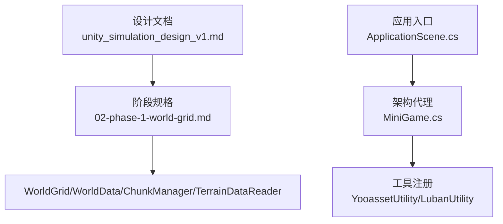
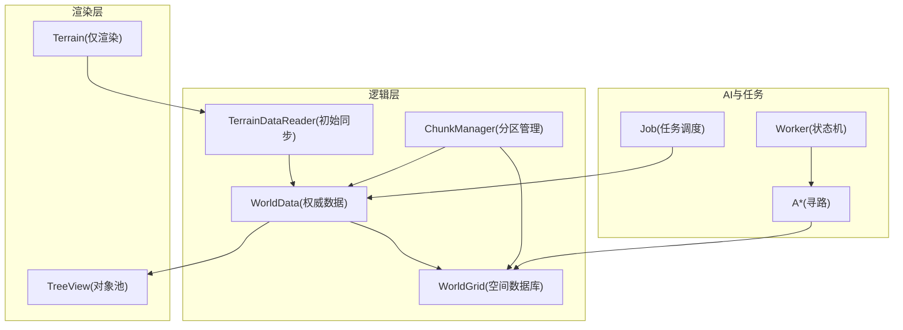
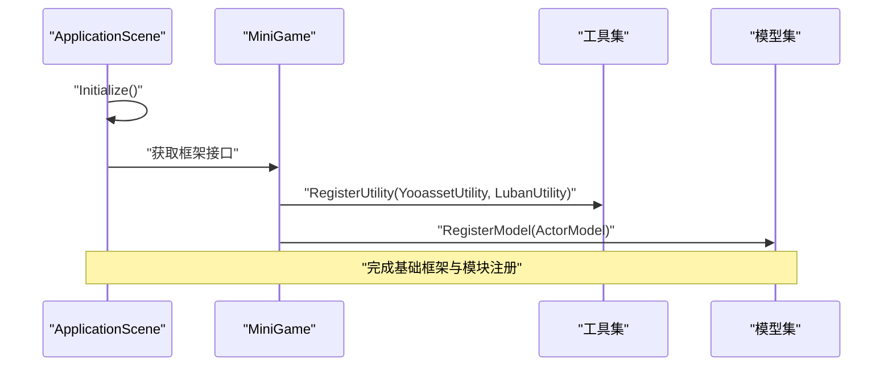
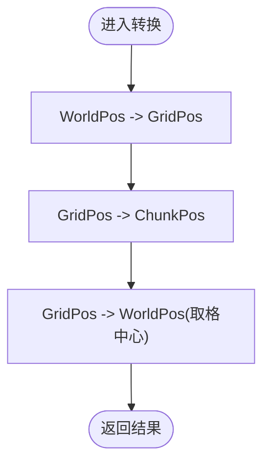
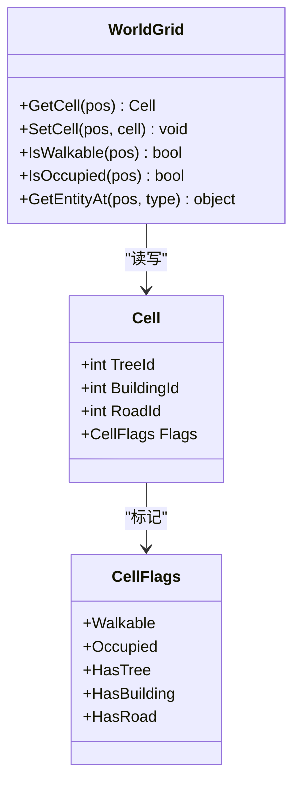
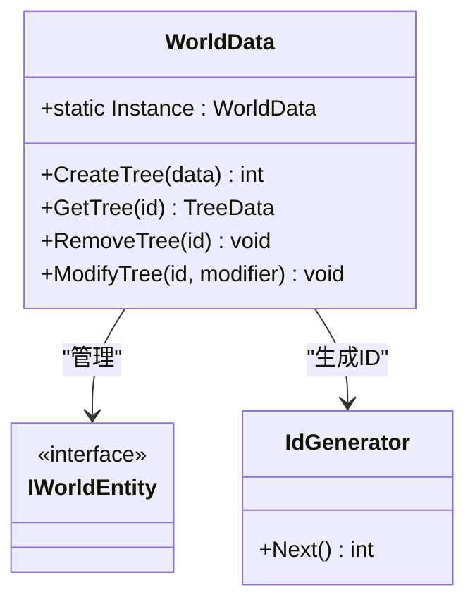
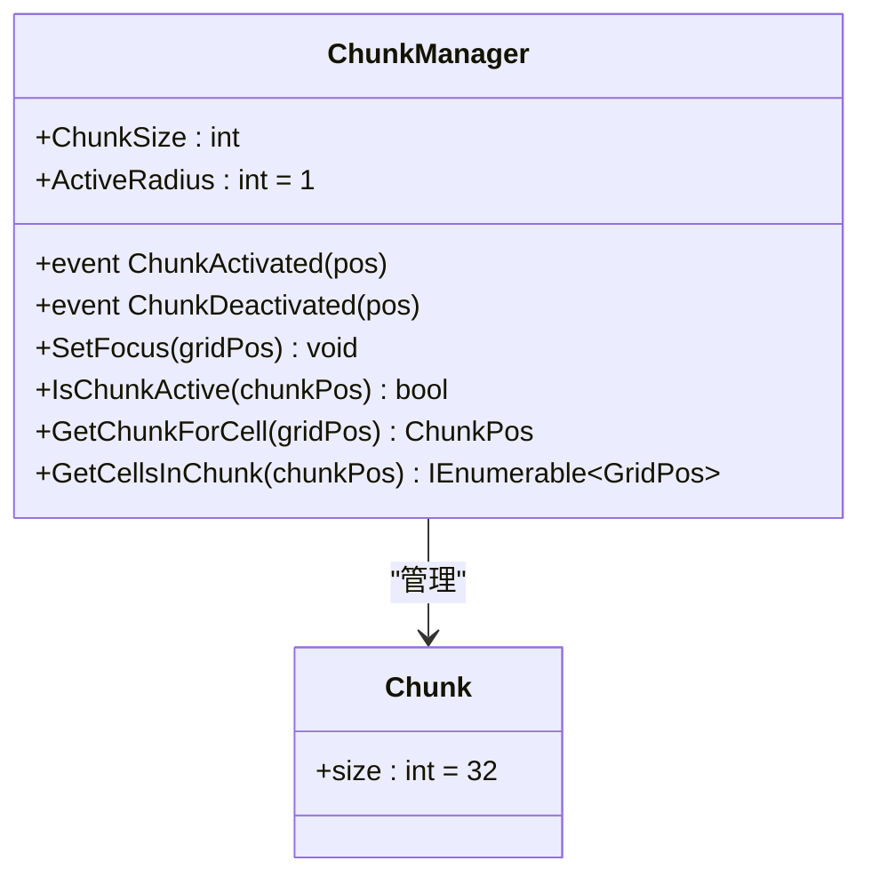
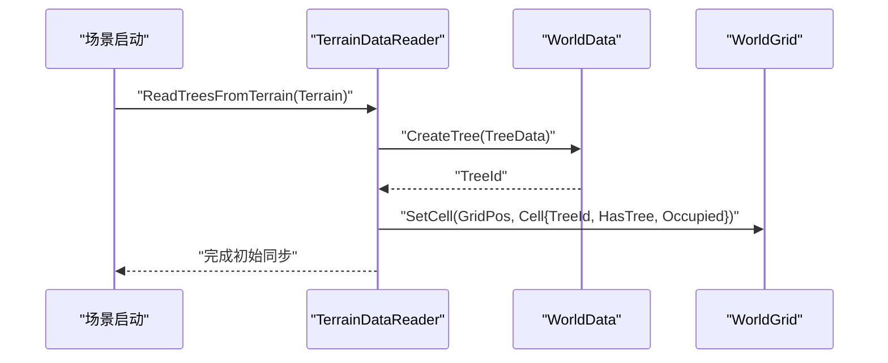
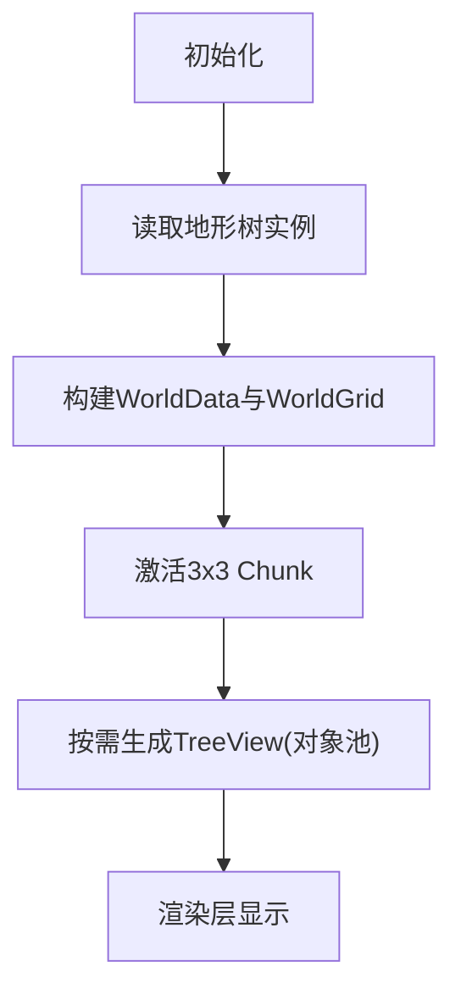
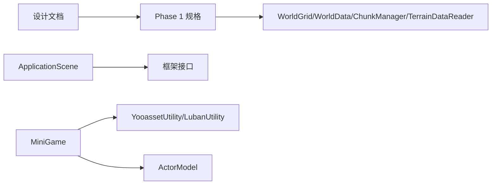

# 模拟场景配置

<cite>
**本文引用的文件**   
- [unity_simulation_design_v1.md](file://.simulationdoc/unity_simulation_design_v1.md)
- [02-phase-1-world-grid.md](file://.simulationdoc/specs/02-phase-1-world-grid.md)
- [ApplicationScene.cs](file://Assets/Game/Scripts/ApplicationScene.cs)
- [MiniGame.cs](file://Assets/Game/Scripts/MiniGame_Scripts/MiniGame.cs)
</cite>

## 目录
1. [简介](#简介)
2. [项目结构](#项目结构)
3. [核心组件](#核心组件)
4. [架构总览](#架构总览)
5. [详细组件分析](#详细组件分析)
6. [依赖分析](#依赖分析)
7. [性能考虑](#性能考虑)
8. [故障排查指南](#故障排查指南)
9. [结论](#结论)
10. [附录](#附录)

## 简介
本项目为Unity“模拟经营”类项目的客户端工程，目标是构建一个支持大地图、大量树木与工人、斜45°视角的高性能可扩展模拟系统。文档聚焦于“模拟场景配置”，包括：
- 世界空间数据库（WorldGrid）
- 权威数据层（WorldData）
- 分区管理（ChunkManager）
- 地形初始同步（TerrainDataReader）
- 坐标体系（WorldPos/GridPos/ChunkPos）
- 启动流程与框架集成（ApplicationScene、MiniGame）

本说明将结合设计文档与现有脚本，给出从架构到落地配置的完整路径，帮助读者快速搭建并扩展模拟场景。

## 项目结构
仓库采用分层组织方式：
- .simulationdoc：设计与阶段规格文档，定义总体架构与分阶段任务
- Assets/Game/Scripts：应用入口与框架集成点
- Bundles/StreamingAssets/Packages等：资源与包管理相关
- ProjectSettings/Plugins/Samples：引擎与第三方插件配置

图示来源
- [unity_simulation_design_v1.md:1-196](file://.simulationdoc/unity_simulation_design_v1.md#L1-L196)
- [02-phase-1-world-grid.md:1-267](file://.simulationdoc/specs/02-phase-1-world-grid.md#L1-L267)
- [ApplicationScene.cs:1-36](file://Assets/Game/Scripts/ApplicationScene.cs#L1-L36)
- [MiniGame.cs:1-30](file://Assets/Game/Scripts/MiniGame_Scripts/MiniGame.cs#L1-L30)

章节来源
- [unity_simulation_design_v1.md:1-196](file://.simulationdoc/unity_simulation_design_v1.md#L1-L196)
- [02-phase-1-world-grid.md:1-267](file://.simulationdoc/specs/02-phase-1-world-grid.md#L1-L267)
- [ApplicationScene.cs:1-36](file://Assets/Game/Scripts/ApplicationScene.cs#L1-L36)
- [MiniGame.cs:1-30](file://Assets/Game/Scripts/MiniGame_Scripts/MiniGame.cs#L1-L30)

## 核心组件
- WorldGrid：二维空间数据库，提供单元格查询、占用与可行走判断
- WorldData：实体权威数据层，负责增删改查与事件回调
- ChunkManager：按3×3窗口激活/停用Chunk，驱动局部加载与卸载
- TerrainDataReader：从Terrain读取树实例，生成TreeData并写入WorldGrid
- 坐标体系：WorldPos/GridPos/ChunkPos及转换工具，保证零分配与一致性
- 启动与集成：ApplicationScene初始化框架；MiniGame注册模型与工具

章节来源
- [02-phase-1-world-grid.md:79-267](file://.simulationdoc/specs/02-phase-1-world-grid.md#L79-L267)
- [unity_simulation_design_v1.md:46-196](file://.simulationdoc/unity_simulation_design_v1.md#L46-L196)
- [ApplicationScene.cs:1-36](file://Assets/Game/Scripts/ApplicationScene.cs#L1-L36)
- [MiniGame.cs:1-30](file://Assets/Game/Scripts/MiniGame_Scripts/MiniGame.cs#L1-L30)

## 架构总览
整体数据流遵循“数据与表现分离”的原则：渲染层仅负责显示，逻辑层基于WorldGrid与WorldData进行计算，ChunkManager控制局部激活，A*寻路仅服务于移动计算。

图示来源
- [unity_simulation_design_v1.md:20-196](file://.simulationdoc/unity_simulation_design_v1.md#L20-L196)
- [02-phase-1-world-grid.md:79-267](file://.simulationdoc/specs/02-phase-1-world-grid.md#L79-L267)

## 详细组件分析

### 启动与框架集成
- ApplicationScene：在Awake中调用Initialize，获取框架接口并暴露应用暂停事件
- MiniGame：作为ArchitectureProxy，完成工具、模型、系统的注册

图示来源
- [ApplicationScene.cs:12-36](file://Assets/Game/Scripts/ApplicationScene.cs#L12-L36)
- [MiniGame.cs:6-29](file://Assets/Game/Scripts/MiniGame_Scripts/MiniGame.cs#L6-L29)

章节来源
- [ApplicationScene.cs:12-36](file://Assets/Game/Scripts/ApplicationScene.cs#L12-L36)
- [MiniGame.cs:6-29](file://Assets/Game/Scripts/MiniGame_Scripts/MiniGame.cs#L6-L29)

### 坐标体系与转换
- GridPos：整数格索引
- ChunkPos：Chunk索引，由GridPos除以ChunkSize得到
- WorldPos：浮点世界坐标，Y由Terrain高度采样
- CoordinateUtility：提供双向转换与比较运算，要求零分配

图示来源
- [02-phase-1-world-grid.md:36-78](file://.simulationdoc/specs/02-phase-1-world-grid.md#L36-L78)

章节来源
- [02-phase-1-world-grid.md:36-78](file://.simulationdoc/specs/02-phase-1-world-grid.md#L36-L78)

### WorldGrid 空间数据库
- CellFlags：使用位标志表示Walkable/Occupied/HasTree/HasBuilding/HasRoad
- Cell：包含TreeId/BuildingId/RoadId与Flags
- WorldGrid：提供GetCell/SetCell/IsWalkable/IsOccupied/GetEntityAt等方法，边界外返回默认不可行走

图示来源
- [02-phase-1-world-grid.md:79-160](file://.simulationdoc/specs/02-phase-1-world-grid.md#L79-L160)

章节来源
- [02-phase-1-world-grid.md:79-160](file://.simulationdoc/specs/02-phase-1-world-grid.md#L79-L160)

### WorldData 权威数据层
- 提供Create/Get/Remove/Modify等API
- ID唯一且递增，删除后查询返回空或默认值
- 事件回调用于通知其他系统更新

图示来源
- [02-phase-1-world-grid.md:161-182](file://.simulationdoc/specs/02-phase-1-world-grid.md#L161-L182)

章节来源
- [02-phase-1-world-grid.md:161-182](file://.simulationdoc/specs/02-phase-1-world-grid.md#L161-L182)

### Chunk 与 ChunkManager
- Chunk大小固定32×32
- ChunkManager维护以焦点为中心的3×3激活窗口
- 提供IsChunkActive、GetChunkForCell、GetCellsInChunk等接口
- 触发ChunkActivated/ChunkDeactivated事件

图示来源
- [02-phase-1-world-grid.md:183-223](file://.simulationdoc/specs/02-phase-1-world-grid.md#L183-L223)

章节来源
- [02-phase-1-world-grid.md:183-223](file://.simulationdoc/specs/02-phase-1-world-grid.md#L183-L223)

### Terrain 树木初始同步
- 启动时读取Terrain.terrainData.treeInstances
- 将每个TreeInstance.position转换为GridPos
- 创建TreeData并通过WorldData注册
- 在WorldGrid对应Cell写入TreeId与HasTree/Occupied标记

图示来源
- [02-phase-1-world-grid.md:224-252](file://.simulationdoc/specs/02-phase-1-world-grid.md#L224-L252)

章节来源
- [02-phase-1-world-grid.md:224-252](file://.simulationdoc/specs/02-phase-1-world-grid.md#L224-L252)

### 概念性概览
以下为不绑定具体源码的概念流程图，展示从地形到视图的端到端工作流：

[此图为概念流程，无需图示来源]

## 依赖分析
- 设计文档驱动实现：总体架构与Phase 1规格定义了WorldGrid/WorldData/ChunkManager/TerrainDataReader的职责与契约
- 启动流程依赖框架集成：ApplicationScene获取框架接口，MiniGame注册工具与模型
- 外部依赖：YooAsset资源管理与Luban配置表工具已在MiniGame中注册

图示来源
- [unity_simulation_design_v1.md:1-196](file://.simulationdoc/unity_simulation_design_v1.md#L1-L196)
- [02-phase-1-world-grid.md:1-267](file://.simulationdoc/specs/02-phase-1-world-grid.md#L1-L267)
- [ApplicationScene.cs:12-36](file://Assets/Game/Scripts/ApplicationScene.cs#L12-L36)
- [MiniGame.cs:6-29](file://Assets/Game/Scripts/MiniGame_Scripts/MiniGame.cs#L6-L29)

章节来源
- [unity_simulation_design_v1.md:1-196](file://.simulationdoc/unity_simulation_design_v1.md#L1-L196)
- [02-phase-1-world-grid.md:1-267](file://.simulationdoc/specs/02-phase-1-world-grid.md#L1-L267)
- [ApplicationScene.cs:12-36](file://Assets/Game/Scripts/ApplicationScene.cs#L12-L36)
- [MiniGame.cs:6-29](file://Assets/Game/Scripts/MiniGame_Scripts/MiniGame.cs#L6-L29)

## 性能考虑
- 对象池：TreeView最大300~500实例，避免频繁Instantiate/Destroy
- 分区激活：3×3 Chunk窗口，减少同时活跃对象数量
- 坐标转换：零分配的双向转换，降低GC压力
- 寻路策略：局部Graph Update，避免全图刷新
- 目标指标：TreeView≤500、Worker≤100、CPU<10ms、GPU<8ms

章节来源
- [unity_simulation_design_v1.md:89-179](file://.simulationdoc/unity_simulation_design_v1.md#L89-L179)

## 故障排查指南
- 坐标转换异常：检查WorldPos↔GridPos↔ChunkPos转换是否一致，确保边缘坐标处理正确
- WorldGrid越界：确认边界外查询返回默认不可行走Cell
- Chunk抖动：为Chunk切换加入滞后/惰性策略，避免频繁激活/停用
- 初始同步失败：验证Terrain树实例读取与Grid写入是否一一对应
- 事件未触发：检查WorldData增删改事件是否正确注册与消费

章节来源
- [02-phase-1-world-grid.md:36-78](file://.simulationdoc/specs/02-phase-1-world-grid.md#L36-L78)
- [02-phase-1-world-grid.md:79-160](file://.simulationdoc/specs/02-phase-1-world-grid.md#L79-L160)
- [02-phase-1-world-grid.md:183-223](file://.simulationdoc/specs/02-phase-1-world-grid.md#L183-L223)
- [02-phase-1-world-grid.md:224-252](file://.simulationdoc/specs/02-phase-1-world-grid.md#L224-L252)

## 结论
通过统一的空间数据库（WorldGrid）、权威数据层（WorldData）、分区管理（ChunkManager）与地形初始同步（TerrainDataReader），配合零分配的坐标转换与对象池优化，可构建出高性能、可扩展的模拟场景。启动流程与框架集成确保了工具与模型的可靠注册，为后续AI、任务与工人系统奠定基础。

## 附录
- 开发阶段建议：Phase 1（World+Grid）→ Phase 2（Tree+View）→ Phase 3（Worker+A*）→ Phase 4（Building+Road）→ Phase 5（Simulation）→ Phase 6（Optimization）

章节来源
- [unity_simulation_design_v1.md:182-196](file://.simulationdoc/unity_simulation_design_v1.md#L182-L196)