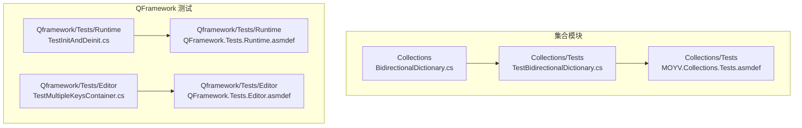
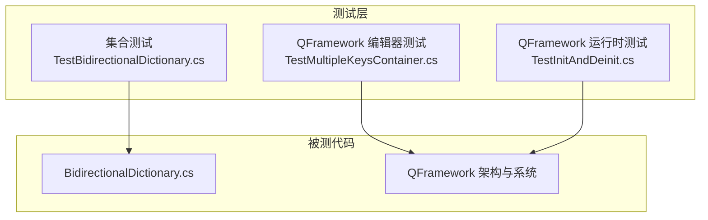
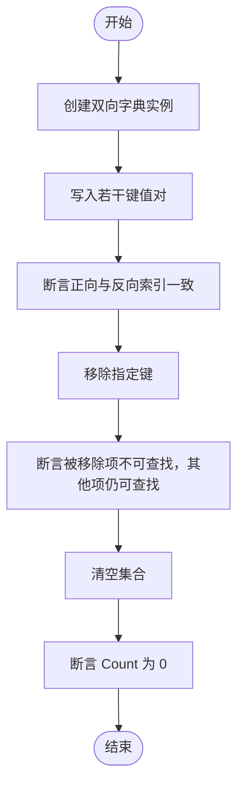
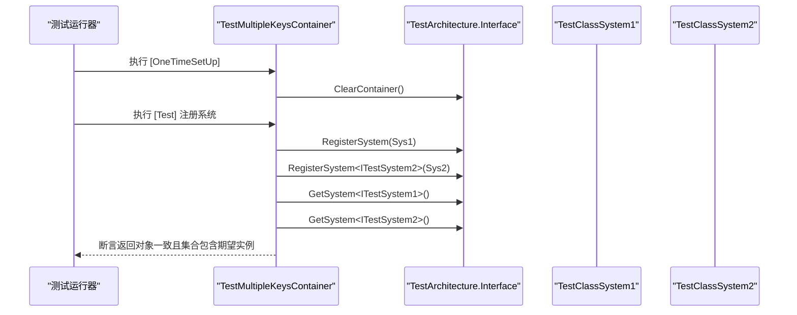
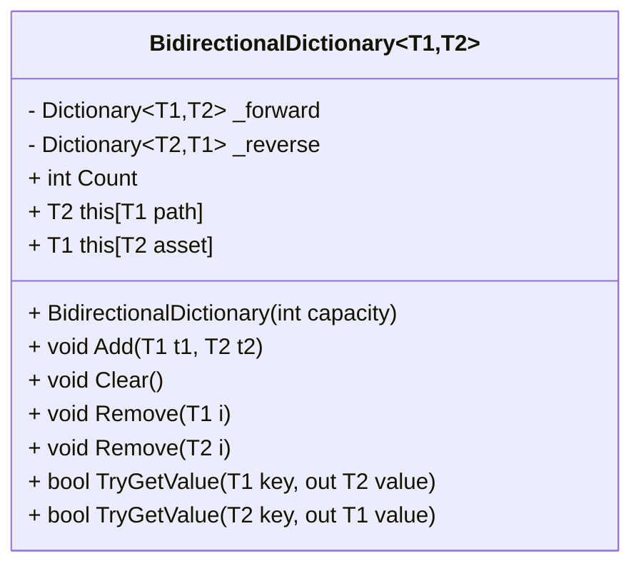
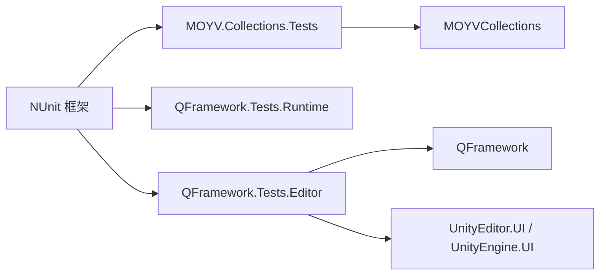

# 测试指南

<cite>
**本文引用的文件列表**
- [BidirectionalDictionary.cs](file://Assets/Game/Framework/Collections/BidirectionalDictionary.cs)
- [TestBidirectionalDictionary.cs](file://Assets/Game/Framework/Collections/Tests/TestBidirectionalDictionary.cs)
- [MOYV.Collections.Tests.asmdef](file://Assets/Game/Framework/Collections/Tests/MOYV.Collections.Tests.asmdef)
- [QFramework.Tests.Runtime.asmdef](file://Assets/Game/Framework/Qframework/Tests/Runtime/QFramework.Tests.Runtime.asmdef)
- [QFramework.Tests.Editor.asmdef](file://Assets/Game/Framework/Qframework/Tests/Editor/QFramework.Tests.Editor.asmdef)
- [TestMultipleKeysContainer.cs](file://Assets/Game/Framework/Qframework/Tests/Editor/TestMultipleKeysContainer.cs)
- [TestInitAndDeinit.cs](file://Assets/Game/Framework/Qframework/Tests/Runtime/TestInitAndDeinit.cs)
- [ProfilerCollection.cs](file://Assets/Game/Framework/Qframework/Runtime/Profiler/ProfilerCollection.cs)
</cite>

## 目录
1. [简介](#简介)
2. [项目结构](#项目结构)
3. [核心组件](#核心组件)
4. [架构总览](#架构总览)
5. [详细组件分析](#详细组件分析)
6. [依赖分析](#依赖分析)
7. [性能考虑](#性能考虑)
8. [故障排查指南](#故障排查指南)
9. [结论](#结论)
10. [附录](#附录)

## 简介
本指南面向 SimulationClient 项目的测试编写与维护，目标是：
- 明确单元测试的编写方法与规范，基于现有示例（如 TestBidirectionalDictionary.cs）展示用例组织与断言风格。
- 说明集成测试的实现方式，覆盖系统间交互与关键业务流程验证。
- 介绍性能测试的方法与工具，包括帧率监控、内存使用分析与加载性能测试。
- 文档化自动化测试流程，包括本地执行、结果报告与持续集成配置建议。
- 给出测试覆盖率要求与测试数据管理策略。

## 项目结构
本项目采用 Unity 工程结构，测试代码按模块划分并配合 asmdef 进行编译域隔离。当前仓库中已存在两类测试组织方式：
- 集合模块测试：位于 Collections/Tests 下，通过 MOYV.Collections.Tests.asmdef 限定在编辑器环境运行，引用 NUnit 框架。
- QFramework 测试：位于 Qframework/Tests 下，分为 Runtime 与 Editor 两个 asmdef，分别用于运行时与编辑器环境的测试。

图表来源
- [BidirectionalDictionary.cs:1-102](file://Assets/Game/Framework/Collections/BidirectionalDictionary.cs#L1-L102)
- [TestBidirectionalDictionary.cs:1-77](file://Assets/Game/Framework/Collections/Tests/TestBidirectionalDictionary.cs#L1-L77)
- [MOYV.Collections.Tests.asmdef:1-24](file://Assets/Game/Framework/Collections/Tests/MOYV.Collections.Tests.asmdef#L1-L24)
- [QFramework.Tests.Runtime.asmdef:1-22](file://Assets/Game/Framework/Qframework/Tests/Runtime/QFramework.Tests.Runtime.asmdef#L1-L22)
- [QFramework.Tests.Editor.asmdef:1-22](file://Assets/Game/Framework/Qframework/Tests/Editor/QFramework.Tests.Editor.asmdef#L1-L22)
- [TestMultipleKeysContainer.cs:1-137](file://Assets/Game/Framework/Qframework/Tests/Editor/TestMultipleKeysContainer.cs#L1-L137)
- [TestInitAndDeinit.cs:156-181](file://Assets/Game/Framework/Qframework/Tests/Runtime/TestInitAndDeinit.cs#L156-L181)

章节来源
- [MOYV.Collections.Tests.asmdef:1-24](file://Assets/Game/Framework/Collections/Tests/MOYV.Collections.Tests.asmdef#L1-L24)
- [QFramework.Tests.Runtime.asmdef:1-22](file://Assets/Game/Framework/Qframework/Tests/Runtime/QFramework.Tests.Runtime.asmdef#L1-L22)
- [QFramework.Tests.Editor.asmdef:1-22](file://Assets/Game/Framework/Qframework/Tests/Editor/QFramework.Tests.Editor.asmdef#L1-L22)

## 核心组件
- BidirectionalDictionary：双向字典实现，提供正向与反向索引、增删改查与清理能力，适用于路径与资源的双向映射场景。
- 测试框架与装配：
  - 集合测试使用 NUnit 框架，并通过 MOYV.Collections.Tests.asmdef 限定在编辑器平台运行。
  - QFramework 测试同样使用 NUnit，并通过 Runtime/Editor 两个 asmdef 区分运行域，便于对架构容器、系统与模型进行初始化与销毁的测试。

章节来源
- [BidirectionalDictionary.cs:1-102](file://Assets/Game/Framework/Collections/BidirectionalDictionary.cs#L1-L102)
- [MOYV.Collections.Tests.asmdef:1-24](file://Assets/Game/Framework/Collections/Tests/MOYV.Collections.Tests.asmdef#L1-L24)
- [QFramework.Tests.Runtime.asmdef:1-22](file://Assets/Game/Framework/Qframework/Tests/Runtime/QFramework.Tests.Runtime.asmdef#L1-L22)
- [QFramework.Tests.Editor.asmdef:1-22](file://Assets/Game/Framework/Qframework/Tests/Editor/QFramework.Tests.Editor.asmdef#L1-L22)

## 架构总览
从测试视角看，项目遵循“按功能域组织测试 + 通过 asmdef 控制编译域”的策略。集合类测试聚焦数据结构正确性；QFramework 测试聚焦架构容器、系统与模型的注册、获取、生命周期等。

图表来源
- [TestBidirectionalDictionary.cs:1-77](file://Assets/Game/Framework/Collections/Tests/TestBidirectionalDictionary.cs#L1-L77)
- [TestMultipleKeysContainer.cs:1-137](file://Assets/Game/Framework/Qframework/Tests/Editor/TestMultipleKeysContainer.cs#L1-L137)
- [TestInitAndDeinit.cs:156-181](file://Assets/Game/Framework/Qframework/Tests/Runtime/TestInitAndDeinit.cs#L156-L181)
- [BidirectionalDictionary.cs:1-102](file://Assets/Game/Framework/Collections/BidirectionalDictionary.cs#L1-L102)

## 详细组件分析

### 单元测试编写规范（以 TestBidirectionalDictionary 为例）
- 命名与组织
  - 测试类名以 Test 前缀开头，方法名以 Test_ 或语义化名称描述行为。
  - 每个测试方法只关注一个职责，避免耦合多个断言逻辑。
- 前置与后置
  - 若需要共享状态，可使用 [SetUp]/[TearDown] 或 [OneTimeSetUp]/[OneTimeTearDown] 管理。
- 断言风格
  - 使用 Assert.AreEqual、Assert.IsTrue/False、Assert.Throws 等标准断言。
  - 对异常路径使用 Assert.Throws 确保抛出预期异常类型。
- 数据准备
  - 在测试方法内构造最小数据集，保证可重复性与隔离性。
- 参考用例
  - 索引器读写、Add 批量添加、Clear 清空计数、Remove 删除后 TryGetValue 校验、同类型泛型构造异常。

图表来源
- [TestBidirectionalDictionary.cs:1-77](file://Assets/Game/Framework/Collections/Tests/TestBidirectionalDictionary.cs#L1-L77)

章节来源
- [TestBidirectionalDictionary.cs:1-77](file://Assets/Game/Framework/Collections/Tests/TestBidirectionalDictionary.cs#L1-L77)

### 集成测试实现方式（架构容器与系统生命周期）
- 目标
  - 验证系统在架构容器中的注册、获取、多接口绑定与生命周期回调。
- 设计要点
  - 使用 [OneTimeSetUp] 清理容器状态，确保测试之间互不干扰。
  - 通过 RegisterSystem 与 GetSystem 验证单例/多实例行为。
  - 针对懒加载 System/Model 的初始化时机进行断言。
- 参考用例
  - 多接口注册与获取一致性、相同接口不同类的注册优先级、重新初始化后的状态一致性。

图表来源
- [TestMultipleKeysContainer.cs:1-137](file://Assets/Game/Framework/Qframework/Tests/Editor/TestMultipleKeysContainer.cs#L1-L137)

章节来源
- [TestMultipleKeysContainer.cs:1-137](file://Assets/Game/Framework/Qframework/Tests/Editor/TestMultipleKeysContainer.cs#L1-L137)
- [TestInitAndDeinit.cs:156-181](file://Assets/Game/Framework/Qframework/Tests/Runtime/TestInitAndDeinit.cs#L156-L181)

### 复杂逻辑组件分析（双向字典内部处理流程）
- 关键点
  - 构造函数限制 T1 与 T2 不得相同，防止对称冲突。
  - 索引器同时维护正向与反向映射，保证一致性。
  - Add/Remove/TryGetValue 均同步更新两个内部字典。
- 复杂度
  - 基本操作时间复杂度 O(1)，空间复杂度 O(n)。
- 优化机会
  - 容量预分配减少扩容开销。
  - 移除时先 TryGetValue 再 Remove，避免多余异常分支。

图表来源
- [BidirectionalDictionary.cs:1-102](file://Assets/Game/Framework/Collections/BidirectionalDictionary.cs#L1-L102)

章节来源
- [BidirectionalDictionary.cs:1-102](file://Assets/Game/Framework/Collections/BidirectionalDictionary.cs#L1-L102)

## 依赖分析
- 测试框架依赖
  - 集合测试与 QFramework 测试均依赖 NUnit 框架，并通过 precompiledReferences 引用 nunit.framework.dll。
  - 通过 includePlatforms 将集合测试限定在编辑器环境运行，避免运行时引擎差异。
- 模块依赖关系
  - 集合测试直接依赖 MOYVCollections 程序集。
  - QFramework 测试依赖 QFramework 运行时与 UI 相关程序集（编辑器测试）。

图表来源
- [MOYV.Collections.Tests.asmdef:1-24](file://Assets/Game/Framework/Collections/Tests/MOYV.Collections.Tests.asmdef#L1-L24)
- [QFramework.Tests.Runtime.asmdef:1-22](file://Assets/Game/Framework/Qframework/Tests/Runtime/QFramework.Tests.Runtime.asmdef#L1-L22)
- [QFramework.Tests.Editor.asmdef:1-22](file://Assets/Game/Framework/Qframework/Tests/Editor/QFramework.Tests.Editor.asmdef#L1-L22)

章节来源
- [MOYV.Collections.Tests.asmdef:1-24](file://Assets/Game/Framework/Collections/Tests/MOYV.Collections.Tests.asmdef#L1-L24)
- [QFramework.Tests.Runtime.asmdef:1-22](file://Assets/Game/Framework/Qframework/Tests/Runtime/QFramework.Tests.Runtime.asmdef#L1-L22)
- [QFramework.Tests.Editor.asmdef:1-22](file://Assets/Game/Framework/Qframework/Tests/Editor/QFramework.Tests.Editor.asmdef#L1-L22)

## 性能考虑
- 帧率监控
  - 使用 Unity Profiler 与自定义标记进行热点定位。项目中已有基于 Unity.Profiling 的性能计数器封装，可在关键路径埋点统计命令数、查询数等指标。
  - 建议在 Tick 循环、路径计算、Chunk 激活/失活等热路径增加 ProfilerMarker 与计数器。
- 内存使用分析
  - 使用 Unity Memory Profiler 采集 GC 与对象分配情况，重点关注频繁分配的对象与临时集合。
  - 对双向字典等高频数据结构，评估容量初始值与扩容策略，避免频繁扩容导致的 GC 压力。
- 加载性能测试
  - 针对资源加载（如 YooAsset）、场景切换、Prefab 实例化建立基准测试，记录首帧耗时与峰值内存。
  - 结合异步加载与进度回调，验证加载管线是否阻塞主线程。

章节来源
- [ProfilerCollection.cs:1-20](file://Assets/Game/Framework/Qframework/Runtime/Profiler/ProfilerCollection.cs#L1-L20)

## 故障排查指南
- 测试无法发现或运行
  - 检查 asmdef 的 includePlatforms 与 defineConstraints 是否正确，确保 UNITY_INCLUDE_TESTS 条件满足。
  - 确认 precompiledReferences 中已引入 nunit.framework.dll。
- 测试失败与状态污染
  - 使用 [OneTimeSetUp]/[OneTimeTearDown] 清理全局容器或静态状态，避免跨用例污染。
  - 对于有外部依赖（网络、文件系统）的测试，使用 Mock 或替换实现隔离。
- 性能回归
  - 对比 Profiler 快照与计数器趋势，定位新增热点。
  - 对可疑算法进行复杂度复核与边界用例补充。

章节来源
- [MOYV.Collections.Tests.asmdef:1-24](file://Assets/Game/Framework/Collections/Tests/MOYV.Collections.Tests.asmdef#L1-L24)
- [QFramework.Tests.Runtime.asmdef:1-22](file://Assets/Game/Framework/Qframework/Tests/Runtime/QFramework.Tests.Runtime.asmdef#L1-L22)
- [QFramework.Tests.Editor.asmdef:1-22](file://Assets/Game/Framework/Qframework/Tests/Editor/QFramework.Tests.Editor.asmdef#L1-L22)

## 结论
本项目已具备清晰的测试分层与框架基础：集合模块与 QFramework 模块各自拥有独立的测试程序集与用例。建议在此基础上：
- 完善更多业务模块的单元测试与集成测试，形成稳定的质量基线。
- 引入性能基准测试与覆盖率统计，纳入持续集成流水线。
- 统一测试数据管理与 Mock 策略，提升测试稳定性与可维护性。

## 附录

### 单元测试编写清单
- 用例粒度：每个方法仅验证单一行为。
- 断言完备：正常路径、异常路径、边界条件均需覆盖。
- 数据隔离：每个用例自给自足，必要时使用 SetUp/TearDown 管理状态。
- 可读性：命名清晰，注释解释复杂逻辑。

### 集成测试编写清单
- 端到端流程：模拟真实用户操作序列，验证关键业务闭环。
- 系统交互：验证系统间事件、消息传递与状态一致性。
- 环境隔离：对外部依赖进行 Mock 或沙箱化。

### 性能测试清单
- 帧率监控：在关键路径埋点，设置阈值告警。
- 内存分析：识别分配热点，优化对象复用与缓存策略。
- 加载性能：建立基准场景，记录首帧与峰值指标。

### 自动化测试与持续集成建议
- 本地执行
  - 使用 Unity Test Runner 在编辑器模式运行所有测试。
  - 输出 XML 报告以便后续分析。
- CI 配置
  - 在 CI 环境中安装 Unity 版本，执行命令行测试任务。
  - 收集测试结果与性能报告，生成可视化报表。
  - 对失败的用例进行归档与通知。

### 测试覆盖率要求
- 行覆盖率：≥ 80%
- 分支覆盖率：≥ 70%
- 关键路径覆盖率：100%（Tick、路径计算、Chunk 管理、资源加载）

### 测试数据管理策略
- 数据分类
  - 小数据：在测试方法内构造。
  - 大数据：使用独立数据文件或二进制资源，按需加载。
- 数据版本
  - 为测试数据建立版本号，随代码变更同步升级。
- 数据清理
  - 测试结束后清理临时文件与缓存，避免磁盘膨胀。