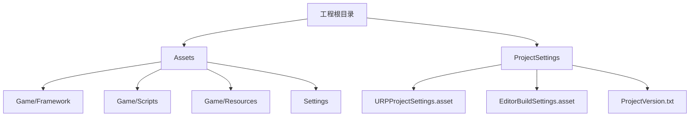
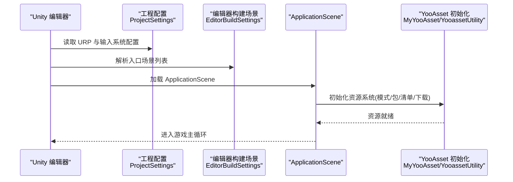
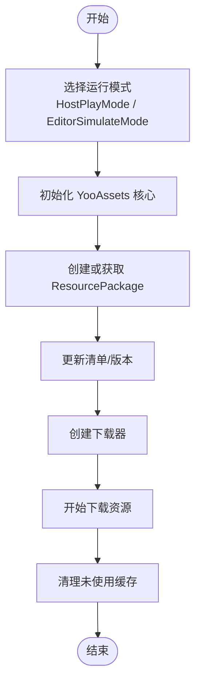
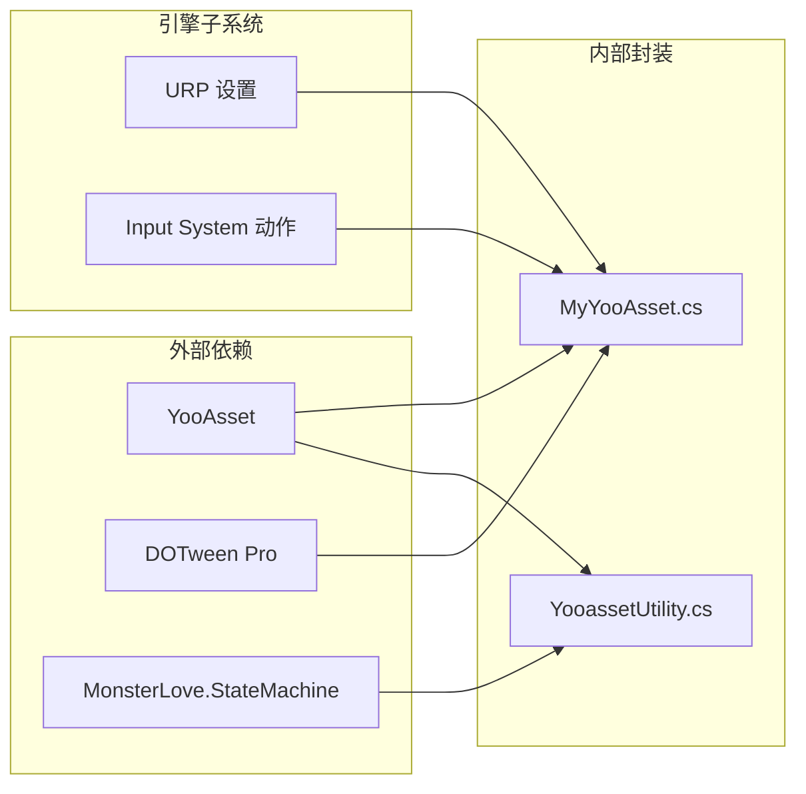

# 环境搭建

<cite>
**本文引用的文件**   
- [ProjectVersion.txt](file://ProjectSettings/ProjectVersion.txt)
- [URPProjectSettings.asset](file://ProjectSettings/URPProjectSettings.asset)
- [InputSystem_Actions.inputactions](file://Assets/InputSystem_Actions.inputactions)
- [EditorBuildSettings.asset](file://ProjectSettings/EditorBuildSettings.asset)
- [YooAssetSettings.asset](file://Assets/Game/Resources/YooAssetSettings.asset)
- [MyYooAsset.cs](file://Assets/Game/Scripts/MiniGame_Scripts/Utility/MyYooAsset.cs)
- [YooassetUtility.cs](file://Assets/Game/Scripts/MiniGame_Scripts/Utility/YooassetUtility.cs)
- [StateMachine.cs](file://Assets/Game/Framework/FSM/Runtime/StateMachine.cs)
- [MonsterLove.StateMachine.Runtime.asmdef](file://Assets/Game/Framework/FSM/Runtime/MonsterLove.StateMachine.Runtime.asmdef)
- [DOTween.dll.meta](file://Assets/Game/Framework/DoTween/DOTween/DOTween.dll.meta)
- [DOTweenEditor.dll.meta](file://Assets/Game/Framework/DoTween/DOTween/Editor/DOTweenEditor.dll.meta)
- [readme_DOTweenPro.txt](file://Assets/Game/Framework/DoTween/readme_DOTweenPro.txt)
</cite>

## 目录
1. [简介](#简介)
2. [项目结构](#项目结构)
3. [核心组件](#核心组件)
4. [架构总览](#架构总览)
5. [详细组件分析](#详细组件分析)
6. [依赖分析](#依赖分析)
7. [性能考虑](#性能考虑)
8. [故障排查指南](#故障排查指南)
9. [结论](#结论)
10. [附录](#附录)

## 简介
本指南面向 SimulationClient 项目的初次搭建与配置，目标是帮助开发者在本地快速、稳定地运行项目。内容涵盖：
- Unity 版本要求（基于 ProjectVersion.txt）
- 关键插件安装与配置（YooAsset、DOTween Pro、MonsterLove.StateMachine）
- 渲染管线与输入系统初始配置（URP、Input System）
- 平台相关设置要点
- 常见问题定位与解决
- 开发工具推荐（Visual Studio / Rider）

## 项目结构
本项目采用分层组织方式：
- Assets/Game/Framework：框架层（包含 FSM、DoTween、QFramework、Ugui 等）
- Assets/Game/Scripts：业务脚本与资源加载封装（YooAsset 初始化与使用）
- Assets/Game/Resources：运行时资源与 YooAsset 配置
- Assets/Settings：URP 全局设置与渲染器
- ProjectSettings：Unity 工程级配置（URP、输入系统、编辑器构建场景等）

图表来源
- [ProjectVersion.txt:1-3](file://ProjectSettings/ProjectVersion.txt#L1-L3)
- [URPProjectSettings.asset:1-17](file://ProjectSettings/URPProjectSettings.asset#L1-L17)
- [EditorBuildSettings.asset:1-17](file://ProjectSettings/EditorBuildSettings.asset#L1-L17)

章节来源
- [ProjectVersion.txt:1-3](file://ProjectSettings/ProjectVersion.txt#L1-L3)
- [URPProjectSettings.asset:1-17](file://ProjectSettings/URPProjectSettings.asset#L1-L17)
- [EditorBuildSettings.asset:1-17](file://ProjectSettings/EditorBuildSettings.asset#L1-L17)

## 核心组件
- 资源系统（YooAsset）
  - 配置文件：Assets/Game/Resources/YooAssetSettings.asset
  - 初始化与使用：Assets/Game/Scripts/MiniGame_Scripts/Utility/MyYooAsset.cs、YooassetUtility.cs
- 动画补间（DOTween Pro）
  - 运行时与编辑器插件元数据：DOTween.dll.meta、DOTweenEditor.dll.meta
  - 升级与模块启用说明：readme_DOTweenPro.txt
- 状态机（MonsterLove.StateMachine）
  - 运行时实现与装配定义：StateMachine.cs、MonsterLove.StateMachine.Runtime.asmdef
- 渲染管线（URP）
  - URP 工程设置：URPProjectSettings.asset
- 输入系统（Input System）
  - 动作映射：Assets/InputSystem_Actions.inputactions
  - 编辑器构建设置中引用 Input Actions：EditorBuildSettings.asset

章节来源
- [YooAssetSettings.asset:1-16](file://Assets/Game/Resources/YooAssetSettings.asset#L1-L16)
- [MyYooAsset.cs:1-82](file://Assets/Game/Scripts/MiniGame_Scripts/Utility/MyYooAsset.cs#L1-L82)
- [YooassetUtility.cs:1-40](file://Assets/Game/Scripts/MiniGame_Scripts/Utility/YooassetUtility.cs#L1-L40)
- [DOTween.dll.meta:1-23](file://Assets/Game/Framework/DoTween/DOTween/DOTween.dll.meta#L1-L23)
- [DOTweenEditor.dll.meta:1-23](file://Assets/Game/Framework/DoTween/DOTween/Editor/DOTweenEditor.dll.meta#L1-L23)
- [readme_DOTweenPro.txt:1-35](file://Assets/Game/Framework/DoTween/readme_DOTweenPro.txt#L1-L35)
- [StateMachine.cs:1-659](file://Assets/Game/Framework/FSM/Runtime/StateMachine.cs#L1-L659)
- [MonsterLove.StateMachine.Runtime.asmdef:1-13](file://Assets/Game/Framework/FSM/Runtime/MonsterLove.StateMachine.Runtime.asmdef#L1-L13)
- [URPProjectSettings.asset:1-17](file://ProjectSettings/URPProjectSettings.asset#L1-L17)
- [InputSystem_Actions.inputactions:1-800](file://Assets/InputSystem_Actions.inputactions#L1-L800)
- [EditorBuildSettings.asset:1-17](file://ProjectSettings/EditorBuildSettings.asset#L1-L17)

## 架构总览
下图展示了启动阶段的关键流程：Unity 读取工程配置，加载 URP 渲染管线；通过 EditorBuildSettings 指定入口场景；应用启动后初始化 YooAsset 资源系统，随后进入游戏逻辑。

图表来源
- [URPProjectSettings.asset:1-17](file://ProjectSettings/URPProjectSettings.asset#L1-L17)
- [EditorBuildSettings.asset:1-17](file://ProjectSettings/EditorBuildSettings.asset#L1-L17)
- [MyYooAsset.cs:1-82](file://Assets/Game/Scripts/MiniGame_Scripts/Utility/MyYooAsset.cs#L1-L82)
- [YooassetUtility.cs:1-40](file://Assets/Game/Scripts/MiniGame_Scripts/Utility/YooassetUtility.cs#L1-L40)

## 详细组件分析

### Unity 版本要求
- 当前工程使用的 Unity 编辑器版本由 ProjectVersion.txt 指定。请确保本地安装的 Unity 版本与工程一致或更高，以避免兼容性问题。
- 建议优先使用 LTS 版本以获得更稳定的体验。

章节来源
- [ProjectVersion.txt:1-3](file://ProjectSettings/ProjectVersion.txt#L1-L3)

### 渲染管线（URP）
- URP 工程设置位于 URPProjectSettings.asset，用于管理 URP 资源路径与材质版本等。
- 若首次打开提示缺少 URP 资源，请在 Package Manager 中安装 Universal Render Pipeline 并选择对应版本的 URP 模板资源。

章节来源
- [URPProjectSettings.asset:1-17](file://ProjectSettings/URPProjectSettings.asset#L1-L17)

### 输入系统（Input System）
- 输入动作映射文件为 InputSystem_Actions.inputactions，定义了 Player 与 UI 两套动作集，支持键盘鼠标、手柄、触屏与 XR 设备。
- 在 EditorBuildSettings.asset 中已关联该输入动作文件，确保在编辑器与打包时均可正确识别。

章节来源
- [InputSystem_Actions.inputactions:1-800](file://Assets/InputSystem_Actions.inputactions#L1-L800)
- [EditorBuildSettings.asset:1-17](file://ProjectSettings/EditorBuildSettings.asset#L1-L17)

### 资源系统（YooAsset）
- 配置文件：Assets/Game/Resources/YooAssetSettings.asset，包含默认 Yoo 文件夹名与包清单前缀等。
- 初始化流程：
  - MyYooAsset.cs 负责按运行模式（如 HostPlayMode 或 EditorSimulateMode）初始化 YooAssets、创建/获取 ResourcePackage、更新清单、创建下载器并执行下载。
  - YooassetUtility.cs 作为统一入口，对外暴露 InitPackage 等方法供上层调用。

图表来源
- [MyYooAsset.cs:1-82](file://Assets/Game/Scripts/MiniGame_Scripts/Utility/MyYooAsset.cs#L1-L82)
- [YooassetUtility.cs:1-40](file://Assets/Game/Scripts/MiniGame_Scripts/Utility/YooassetUtility.cs#L1-L40)
- [YooAssetSettings.asset:1-16](file://Assets/Game/Resources/YooAssetSettings.asset#L1-L16)

章节来源
- [YooAssetSettings.asset:1-16](file://Assets/Game/Resources/YooAssetSettings.asset#L1-L16)
- [MyYooAsset.cs:1-82](file://Assets/Game/Scripts/MiniGame_Scripts/Utility/MyYooAsset.cs#L1-L82)
- [YooassetUtility.cs:1-40](file://Assets/Game/Scripts/MiniGame_Scripts/Utility/YooassetUtility.cs#L1-L40)

### 动画补间（DOTween Pro）
- 运行时与编辑器插件分别以 DLL 形式引入，并通过 .meta 控制平台启用范围。
- 升级与模块启用请参考 readme_DOTweenPro.txt 中的步骤，必要时通过菜单打开 DOTween Utility Panel 进行 Setup 与模块勾选。

章节来源
- [DOTween.dll.meta:1-23](file://Assets/Game/Framework/DoTween/DOTween/DOTween.dll.meta#L1-L23)
- [DOTweenEditor.dll.meta:1-23](file://Assets/Game/Framework/DoTween/DOTween/Editor/DOTweenEditor.dll.meta#L1-L23)
- [readme_DOTweenPro.txt:1-35](file://Assets/Game/Framework/DoTween/readme_DOTweenPro.txt#L1-L35)

### 状态机（MonsterLove.StateMachine）
- 运行时实现位于 StateMachine.cs，提供基于枚举的状态管理与事件驱动机制。
- 通过 MonsterLove.StateMachine.Runtime.asmdef 声明运行时程序集，便于按需编译与引用。

章节来源
- [StateMachine.cs:1-659](file://Assets/Game/Framework/FSM/Runtime/StateMachine.cs#L1-L659)
- [MonsterLove.StateMachine.Runtime.asmdef:1-13](file://Assets/Game/Framework/FSM/Runtime/MonsterLove.StateMachine.Runtime.asmdef#L1-L13)

## 依赖分析
- 外部依赖
  - YooAsset：资源打包与热更方案，需确保 Package Manager 中安装对应版本并与工程匹配。
  - DOTween Pro：动画补间库，注意升级后的模块启用与兼容性。
  - MonsterLove.StateMachine：轻量状态机，运行时程序集已内嵌。
- 内部依赖
  - 资源加载封装（MyYooAsset/YooassetUtility）依赖 YooAsset API。
  - 输入系统与 URP 由工程配置统一管理。

图表来源
- [MyYooAsset.cs:1-82](file://Assets/Game/Scripts/MiniGame_Scripts/Utility/MyYooAsset.cs#L1-L82)
- [YooassetUtility.cs:1-40](file://Assets/Game/Scripts/MiniGame_Scripts/Utility/YooassetUtility.cs#L1-L40)
- [URPProjectSettings.asset:1-17](file://ProjectSettings/URPProjectSettings.asset#L1-L17)
- [InputSystem_Actions.inputactions:1-800](file://Assets/InputSystem_Actions.inputactions#L1-L800)

章节来源
- [MyYooAsset.cs:1-82](file://Assets/Game/Scripts/MiniGame_Scripts/Utility/MyYooAsset.cs#L1-L82)
- [YooassetUtility.cs:1-40](file://Assets/Game/Scripts/MiniGame_Scripts/Utility/YooassetUtility.cs#L1-L40)
- [URPProjectSettings.asset:1-17](file://ProjectSettings/URPProjectSettings.asset#L1-L17)
- [InputSystem_Actions.inputactions:1-800](file://Assets/InputSystem_Actions.inputactions#L1-L800)

## 性能考虑
- 资源加载并发与时间片
  - 可通过 YooAsset 的线程切片与并发参数优化首屏与切换速度（参考 MyYooAsset 中对操作系统的最大时间片与并发加载数的设置）。
- 动画补间
  - 合理使用 DOTween 的预编译与对象池，避免频繁创建销毁导致的 GC 压力。
- 状态机
  - 避免在 Enter/Exit 协程中进行重型计算，尽量将耗时任务异步化。

[本节为通用指导，不直接分析具体文件]

## 故障排查指南
- Unity 版本不匹配
  - 现象：打开工程报错或功能异常。
  - 处理：核对 ProjectVersion.txt 指定的编辑器版本，安装匹配的 Unity 版本。
- URP 缺失或材质版本不一致
  - 现象：材质着色器报错或缺少 URP 资源。
  - 处理：在 Package Manager 安装对应版本的 URP，并在 URPProjectSettings.asset 中确认资源路径与材质版本。
- 输入系统无响应
  - 现象：按键/手柄无效。
  - 处理：确认 InputSystem_Actions.inputactions 存在且已在 EditorBuildSettings.asset 中关联；检查目标平台的 Input System 支持是否开启。
- YooAsset 初始化失败
  - 现象：无法加载清单或资源。
  - 处理：检查 YooAssetSettings.asset 的包名前缀与默认目录；根据运行模式（HostPlayMode/EditorSimulateMode）调整服务器地址与版本号；查看 MyYooAsset 初始化流程日志。
- DOTween 升级后模块未启用
  - 现象：动画不生效或编译错误。
  - 处理：按照 readme_DOTweenPro.txt 指引，打开 DOTween Utility Panel 执行 Setup，并根据需要启用 TextMesh Pro 等模块。
- 状态机方法未绑定
  - 现象：状态切换无回调。
  - 处理：确认遵循 State_Event 命名约定，且 Driver 类中定义了相应 StateEvent 字段；检查 MonsterLove.StateMachine.Runtime.asmdef 是否正确参与编译。

章节来源
- [ProjectVersion.txt:1-3](file://ProjectSettings/ProjectVersion.txt#L1-L3)
- [URPProjectSettings.asset:1-17](file://ProjectSettings/URPProjectSettings.asset#L1-L17)
- [InputSystem_Actions.inputactions:1-800](file://Assets/InputSystem_Actions.inputactions#L1-L800)
- [EditorBuildSettings.asset:1-17](file://ProjectSettings/EditorBuildSettings.asset#L1-L17)
- [YooAssetSettings.asset:1-16](file://Assets/Game/Resources/YooAssetSettings.asset#L1-L16)
- [MyYooAsset.cs:1-82](file://Assets/Game/Scripts/MiniGame_Scripts/Utility/MyYooAsset.cs#L1-L82)
- [readme_DOTweenPro.txt:1-35](file://Assets/Game/Framework/DoTween/readme_DOTweenPro.txt#L1-L35)
- [StateMachine.cs:1-659](file://Assets/Game/Framework/FSM/Runtime/StateMachine.cs#L1-L659)
- [MonsterLove.StateMachine.Runtime.asmdef:1-13](file://Assets/Game/Framework/FSM/Runtime/MonsterLove.StateMachine.Runtime.asmdef#L1-L13)

## 结论
完成上述步骤后，SimulationClient 项目应可在本地稳定运行。建议在团队内统一 Unity 版本与插件版本，并通过 CI 校验关键配置（URP、Input System、YooAsset），以减少环境差异带来的问题。

[本节为总结性内容，不直接分析具体文件]

## 附录
- 开发工具推荐
  - Visual Studio：安装 Unity 扩展与 .NET 工作负载，确保 C# 语言服务与调试器可用。
  - JetBrains Rider：安装 Unity 插件，配置 Unity 安装路径与项目根目录，启用代码分析与实时重编译。
- 常用快捷键与技巧
  - 在 Unity 中快速打开 URP 设置与输入系统动作文件，提升配置效率。
  - 使用 DOTween Utility Panel 一键启用所需模块，减少手动配置成本。

[本节为通用指导，不直接分析具体文件]