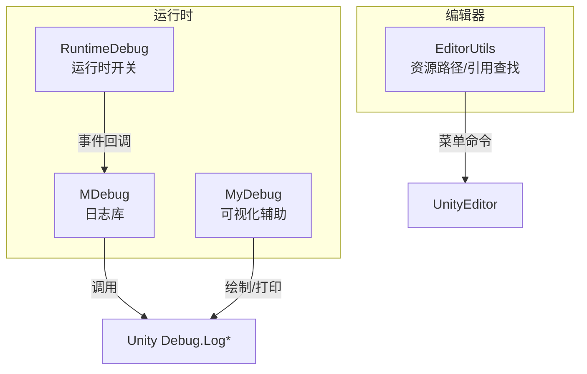
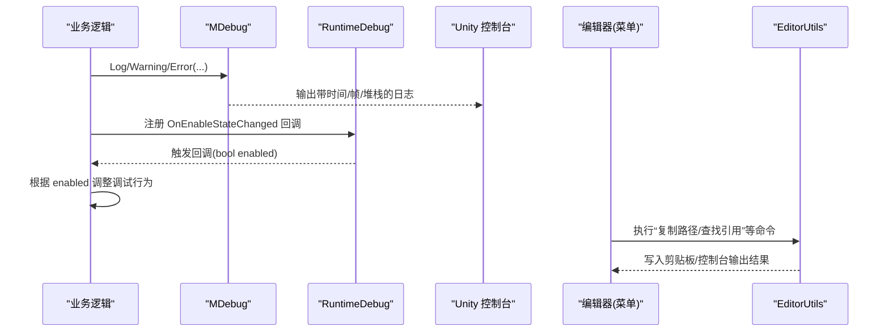
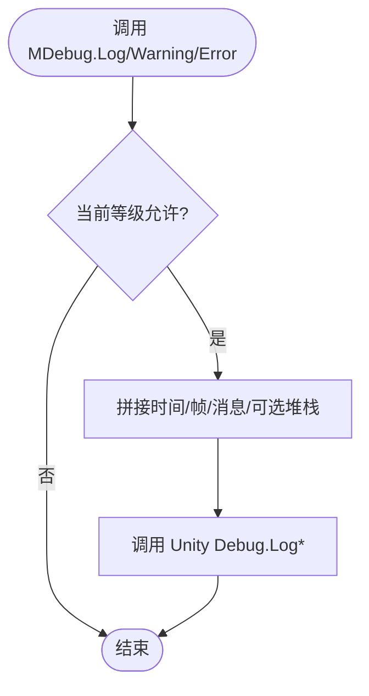
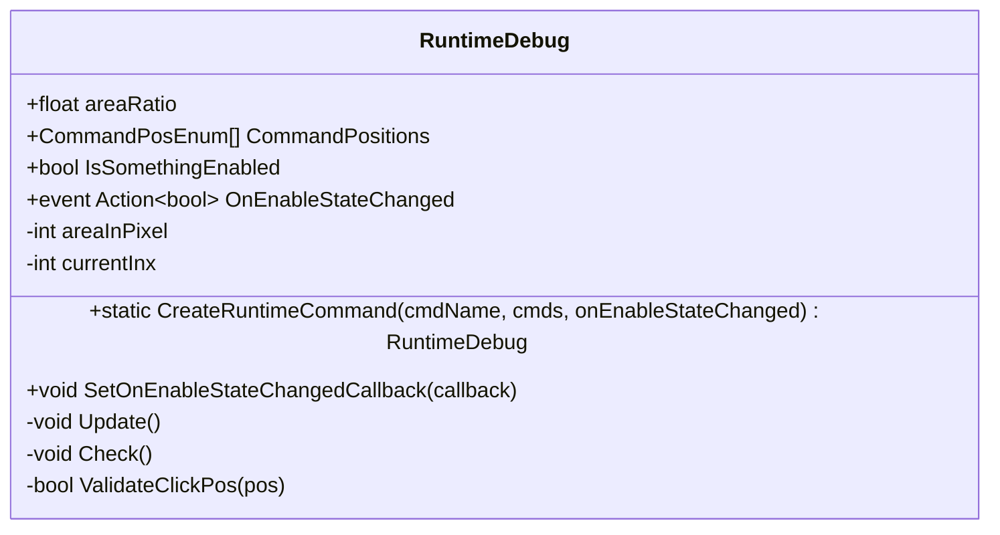
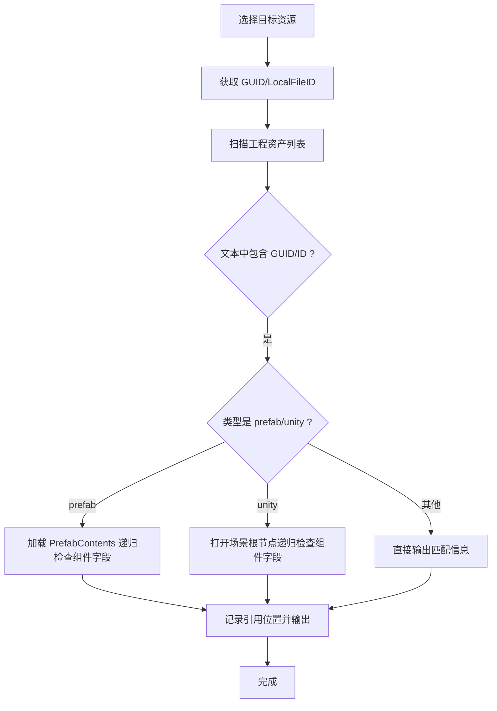
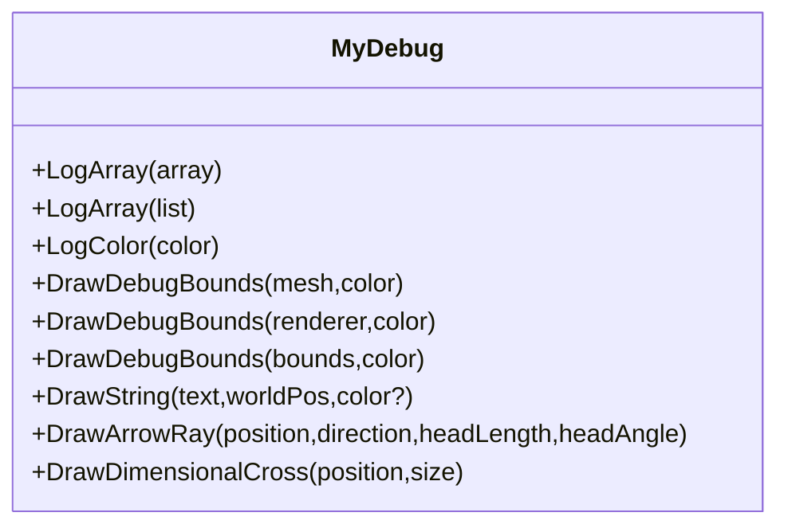
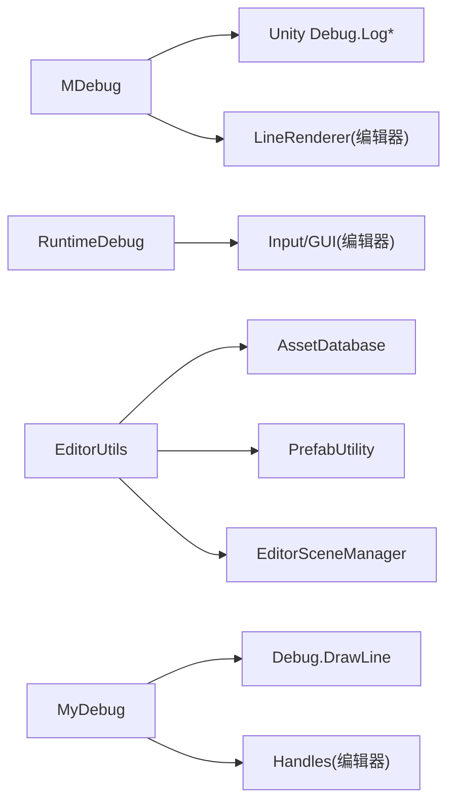

# 调试工具

<cite>
**本文引用的文件**   
- [MDebug.cs](file://Assets/Game/Framework/MDebug/MDebug.cs)
- [RuntimeDebug.cs](file://Assets/Game/Framework/Base/RuntimeDebug.cs)
- [EditorUtils.cs](file://Assets/Game/Framework/Base/Editor/EditorUtils.cs)
- [MyDebug.cs](file://Assets/Game/Framework/Base/Extensions/MyDebug.cs)
</cite>

## 目录
1. [简介](#简介)
2. [项目结构](#项目结构)
3. [核心组件](#核心组件)
4. [架构总览](#架构总览)
5. [详细组件分析](#详细组件分析)
6. [依赖关系分析](#依赖关系分析)
7. [性能与内存注意事项](#性能与内存注意事项)
8. [常见问题与故障排除](#常见问题与故障排除)
9. [结论](#结论)
10. [附录：Unity Profiler 使用技巧](#附录unity-profiler-使用技巧)

## 简介
本文件聚焦于 SimulationClient 项目的调试能力，围绕以下方面展开：
- MDebug 日志库：统一日志等级、时间戳、帧计数与可选堆栈输出。
- RuntimeDebug 运行时调试开关：通过屏幕边缘点击序列切换功能开关，便于在运行期快速启用/禁用调试特性。
- EditorUtils 编辑器扩展：资源路径复制、引用查找等开发期效率工具。
- MyDebug 可视化调试辅助：数组打印、包围盒绘制、箭头与坐标轴十字等。
- Unity Profiler 使用建议：CPU/GPU/内存分析的常用方法与定位思路。

## 项目结构
与调试相关的核心代码位于以下位置：
- 日志库：Assets/Game/Framework/MDebug/MDebug.cs
- 运行时调试开关：Assets/Game/Framework/Base/RuntimeDebug.cs
- 编辑器工具：Assets/Game/Framework/Base/Editor/EditorUtils.cs
- 可视化调试辅助：Assets/Game/Framework/Base/Extensions/MyDebug.cs

图表来源
- [MDebug.cs:1-191](file://Assets/Game/Framework/MDebug/MDebug.cs#L1-L191)
- [RuntimeDebug.cs:1-249](file://Assets/Game/Framework/Base/RuntimeDebug.cs#L1-L249)
- [EditorUtils.cs:1-308](file://Assets/Game/Framework/Base/Editor/EditorUtils.cs#L1-L308)
- [MyDebug.cs:1-167](file://Assets/Game/Framework/Base/Extensions/MyDebug.cs#L1-L167)

章节来源
- [MDebug.cs:1-191](file://Assets/Game/Framework/MDebug/MDebug.cs#L1-L191)
- [RuntimeDebug.cs:1-249](file://Assets/Game/Framework/Base/RuntimeDebug.cs#L1-L249)
- [EditorUtils.cs:1-308](file://Assets/Game/Framework/Base/Editor/EditorUtils.cs#L1-L308)
- [MyDebug.cs:1-167](file://Assets/Game/Framework/Base/Extensions/MyDebug.cs#L1-L167)

## 核心组件
- MDebug：提供分级日志（All/Log/Warring/Error）、可选堆栈、带时间与帧计数的格式化输出；编辑器下提供基于 LineRenderer 的几何绘制与清理接口。
- RuntimeDebug：挂载到场景后，按配置的屏幕区域顺序点击可切换 IsSomethingEnabled 状态，并通过事件通知外部开启或关闭某项调试功能。
- EditorUtils：提供“复制资源路径”、“复制 Resources 加载路径”、“复制游戏相对路径”以及“查找资源引用”等编辑器菜单命令。
- MyDebug：提供数组日志、颜色打印、包围盒绘制、射线箭头、三维坐标十字等可视化调试方法。

章节来源
- [MDebug.cs:1-191](file://Assets/Game/Framework/MDebug/MDebug.cs#L1-L191)
- [RuntimeDebug.cs:1-249](file://Assets/Game/Framework/Base/RuntimeDebug.cs#L1-L249)
- [EditorUtils.cs:1-308](file://Assets/Game/Framework/Base/Editor/EditorUtils.cs#L1-L308)
- [MyDebug.cs:1-167](file://Assets/Game/Framework/Base/Extensions/MyDebug.cs#L1-L167)

## 架构总览
下图展示了运行时与编辑器侧的交互关系：
- 业务逻辑通过 MDebug 输出日志，受全局等级控制。
- RuntimeDebug 作为运行时开关，通过事件驱动业务模块启用/禁用特定调试行为。
- EditorUtils 在编辑期提升资源管理与问题定位效率。
- MyDebug 为可视化调试提供便捷 API。

图表来源
- [MDebug.cs:1-191](file://Assets/Game/Framework/MDebug/MDebug.cs#L1-L191)
- [RuntimeDebug.cs:1-249](file://Assets/Game/Framework/Base/RuntimeDebug.cs#L1-L249)
- [EditorUtils.cs:1-308](file://Assets/Game/Framework/Base/Editor/EditorUtils.cs#L1-L308)

## 详细组件分析

### MDebug 日志库
- 日志等级
  - All：全部输出
  - Log：仅 Log
  - Warring：Warning/错误/异常
  - Error：仅错误/异常
- 输出格式
  - 包含时间戳 HH:mm:ss:fff 与 Time.frameCount
  - 支持参数化字符串
  - 可通过 showStackTrace 控制是否附加 System.Diagnostics.StackTrace
- 编辑器增强
  - 基于 LineRenderer 的多边形/点列绘制与清理，避免频繁创建销毁对象

使用要点
- 设置全局等级：SetLogLv(LogLevel)
- 输出日志：Log/Warning/Error
- 编辑器绘制：DrawPolyWithLineRenderer / DrawPosArrWithLineRenderer / RemoveLineRenderer / ClearAllLineRenderers

图表来源
- [MDebug.cs:1-191](file://Assets/Game/Framework/MDebug/MDebug.cs#L1-L191)

章节来源
- [MDebug.cs:1-191](file://Assets/Game/Framework/MDebug/MDebug.cs#L1-L191)

### RuntimeDebug 运行时调试开关
- 作用
  - 在运行期通过屏幕边缘指定区域的点击序列，切换 IsSomethingEnabled 标志位，并触发 OnEnableStateChanged 事件。
- 配置
  - areaRatio：点击判定区域大小比例
  - CommandPositions：点击区域顺序（左上、上、右上、右、右下、下、左下、左）
- 使用方式
  - 通过静态 CreateRuntimeCommand 创建实例并注册回调
  - 在回调中根据布尔值启用/禁用具体调试功能（如性能统计、内存泄漏检测、错误追踪等）

图表来源
- [RuntimeDebug.cs:1-249](file://Assets/Game/Framework/Base/RuntimeDebug.cs#L1-L249)

章节来源
- [RuntimeDebug.cs:1-249](file://Assets/Game/Framework/Base/RuntimeDebug.cs#L1-L249)

### EditorUtils 编辑器扩展工具
- 资源路径类
  - 复制资源路径到剪贴板
  - 复制 Resources 加载路径（自动去除后缀与 Resources/ 前缀）
  - 复制游戏相对路径（从 Assets/Game 开始）
- 引用查找
  - 遍历工程中的 .prefab/.unity/.mat/.asset，匹配 GUID 与本地文件 ID，递归检查 Prefab 与 Scene 中的 ObjectReference，输出精确引用位置，并提示 Missing 引用

图表来源
- [EditorUtils.cs:1-308](file://Assets/Game/Framework/Base/Editor/EditorUtils.cs#L1-L308)

章节来源
- [EditorUtils.cs:1-308](file://Assets/Game/Framework/Base/Editor/EditorUtils.cs#L1-L308)

### MyDebug 可视化调试辅助
- 数组与颜色日志：LogArray<T>/LogColor
- 包围盒绘制：DrawDebugBounds(MeshFilter/MeshRenderer/Bounds)
- 世界空间文字：DrawString
- 方向箭头：DrawArrowRay
- 三维坐标十字：DrawDimensionalCross

图表来源
- [MyDebug.cs:1-167](file://Assets/Game/Framework/Base/Extensions/MyDebug.cs#L1-L167)

章节来源
- [MyDebug.cs:1-167](file://Assets/Game/Framework/Base/Extensions/MyDebug.cs#L1-L167)

## 依赖关系分析
- MDebug 依赖 Unity 的 Debug 系统输出日志，并在编辑器条件下依赖 LineRenderer 进行可视化绘制。
- RuntimeDebug 依赖输入系统与 GUI 绘制（编辑器），并通过事件与业务层解耦。
- EditorUtils 依赖 AssetDatabase、PrefabUtility、EditorSceneManager 等编辑器 API。
- MyDebug 依赖 Unity 的 Debug.DrawLine、Handles 等编辑器绘制 API。

图表来源
- [MDebug.cs:1-191](file://Assets/Game/Framework/MDebug/MDebug.cs#L1-L191)
- [RuntimeDebug.cs:1-249](file://Assets/Game/Framework/Base/RuntimeDebug.cs#L1-L249)
- [EditorUtils.cs:1-308](file://Assets/Game/Framework/Base/Editor/EditorUtils.cs#L1-L308)
- [MyDebug.cs:1-167](file://Assets/Game/Framework/Base/Extensions/MyDebug.cs#L1-L167)

章节来源
- [MDebug.cs:1-191](file://Assets/Game/Framework/MDebug/MDebug.cs#L1-L191)
- [RuntimeDebug.cs:1-249](file://Assets/Game/Framework/Base/RuntimeDebug.cs#L1-L249)
- [EditorUtils.cs:1-308](file://Assets/Game/Framework/Base/Editor/EditorUtils.cs#L1-L308)
- [MyDebug.cs:1-167](file://Assets/Game/Framework/Base/Extensions/MyDebug.cs#L1-L167)

## 性能与内存注意事项
- MDebug
  - 高频率日志会显著影响性能，建议在发布构建中降低日志等级或关闭堆栈输出。
  - 编辑器下的 LineRenderer 绘制需及时移除，避免对象泄漏。
- RuntimeDebug
  - 每帧 Input 检测开销极低，但应避免在回调中进行重计算。
- EditorUtils
  - “查找资源引用”会遍历大量资产并可能打开场景/Prefab，属于耗时操作，建议在必要时使用。
- MyDebug
  - 每帧绘制包围盒/箭头/十字会产生额外 DrawCall，仅在需要时开启。

[本节为通用指导，不直接分析具体文件]

## 常见问题与故障排除
- 日志过多导致卡顿
  - 现象：运行期明显掉帧，控制台刷屏。
  - 处理：降低 MDebug 日志等级，或在关键路径减少 Log 调用；必要时关闭 showStackTrace。
- 运行时开关无效
  - 现象：点击屏幕边缘无反应。
  - 处理：确认已创建 RuntimeDebug 实例并正确配置 CommandPositions；检查 areaRatio 是否过小；确保未在其他地方覆盖 IsSomethingEnabled。
- 资源引用查找失败或报错
  - 现象：长时间无响应或抛出异常。
  - 处理：确认选中资源有效；工程中存在大量资产时会较慢；若遇到权限或路径问题，查看控制台错误信息并修正路径。
- 编辑器绘制不显示
  - 现象：MyDebug 的包围盒/箭头不可见。
  - 处理：确认在编辑器模式下运行；检查相机视锥体是否包含绘制区域；确认相关组件未被禁用。

章节来源
- [MDebug.cs:1-191](file://Assets/Game/Framework/MDebug/MDebug.cs#L1-L191)
- [RuntimeDebug.cs:1-249](file://Assets/Game/Framework/Base/RuntimeDebug.cs#L1-L249)
- [EditorUtils.cs:1-308](file://Assets/Game/Framework/Base/Editor/EditorUtils.cs#L1-L308)
- [MyDebug.cs:1-167](file://Assets/Game/Framework/Base/Extensions/MyDebug.cs#L1-L167)

## 结论
本项目提供了完善的调试体系：以 MDebug 为核心的日志管理、以 RuntimeDebug 为代表的运行期开关机制、以 EditorUtils 为代表的编辑器效率工具，以及 MyDebug 提供的可视化辅助。配合 Unity Profiler，可在 CPU、GPU、内存等方面高效定位问题。建议在生产环境严格管控日志等级与可视化绘制，保持运行稳定与性能可控。

[本节为总结性内容，不直接分析具体文件]

## 附录：Unity Profiler 使用技巧
- CPU 分析
  - 关注脚本执行时间、物理更新、动画、渲染线程占用；结合 MDebug 的时间戳与帧计数定位热点帧。
- GPU 分析
  - 观察 Overdraw、批处理、Shader 变体数量；对复杂 UI 与粒子系统进行专项优化。
- 内存分析
  - 使用 Allocation Reporter 与 Memory Profiler 排查瞬时分配与长期持有；结合 RuntimeDebug 的事件钩子，在关键流程前后采集快照对比。
- 网络与资源
  - 监控 YooAsset 等资源加载耗时与内存峰值；利用 EditorUtils 的引用查找快速定位冗余资源。

[本节为通用指导，不直接分析具体文件]