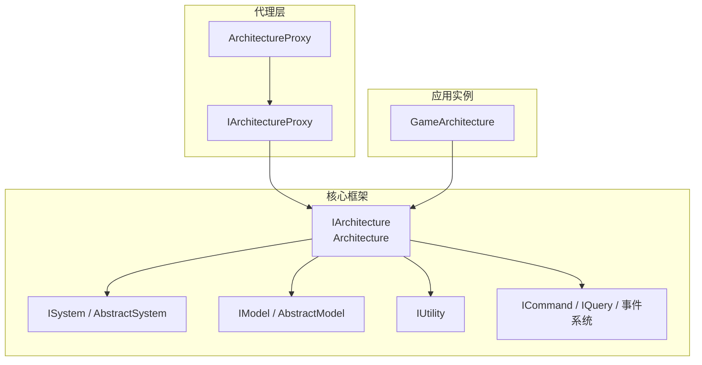
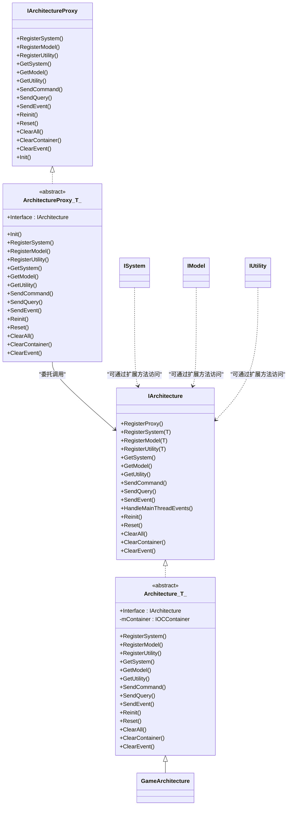
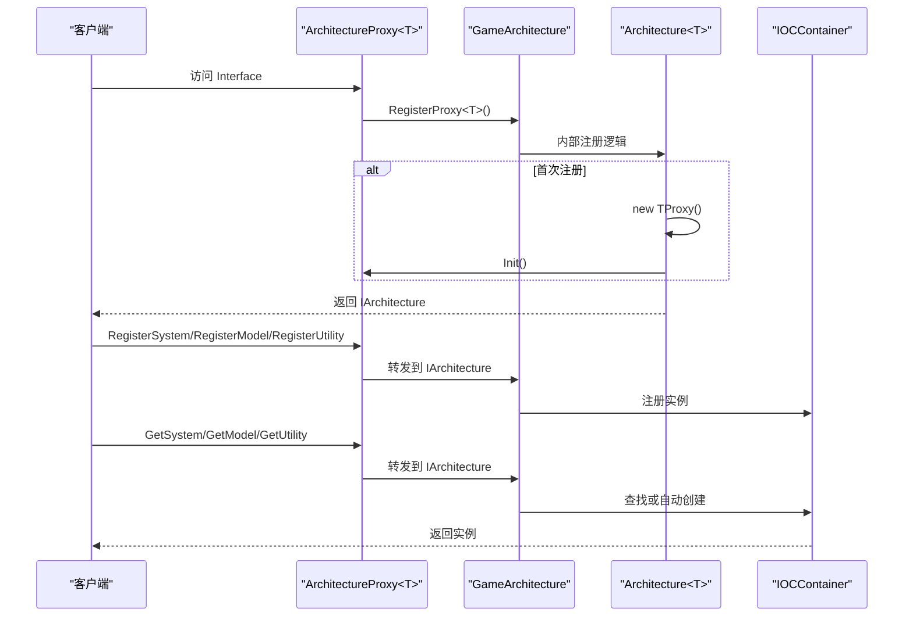
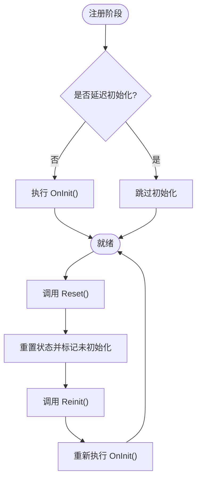
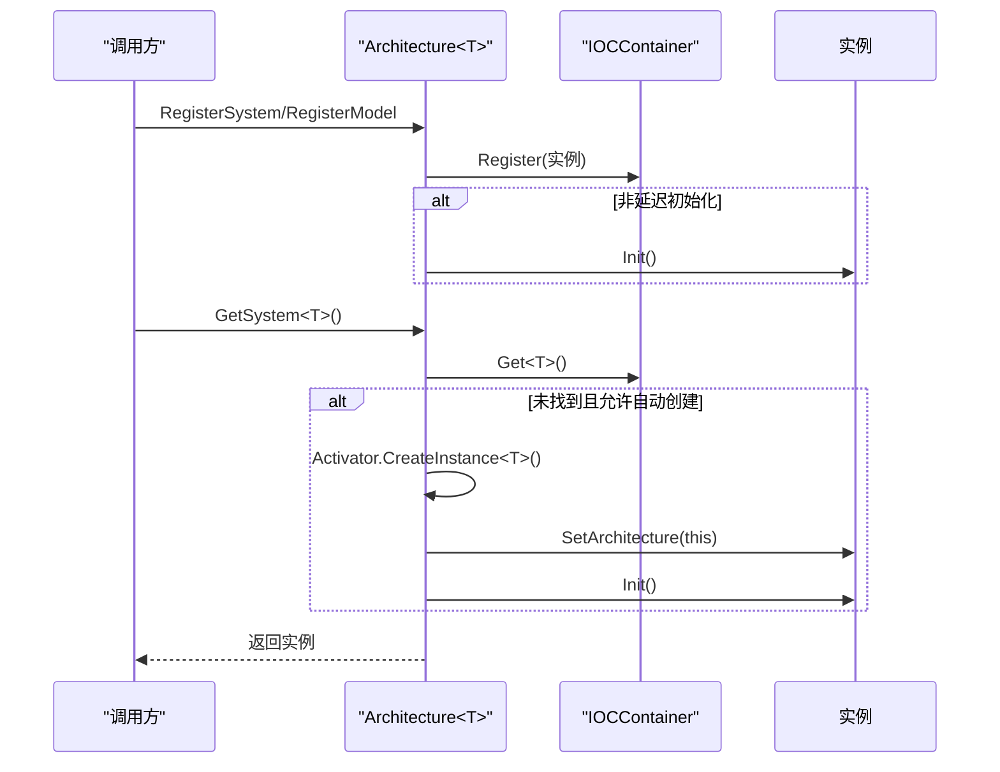
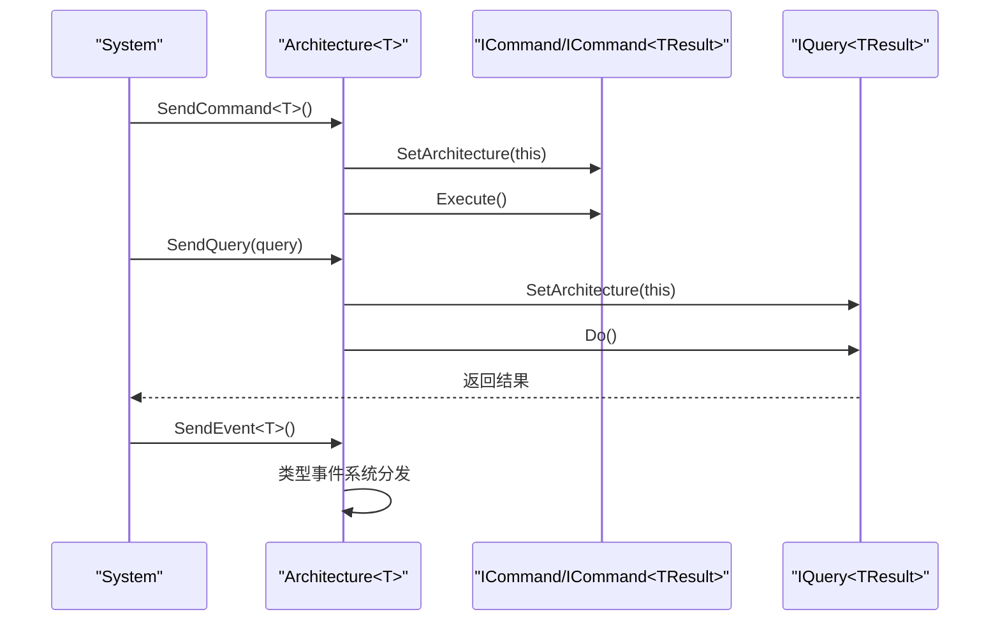
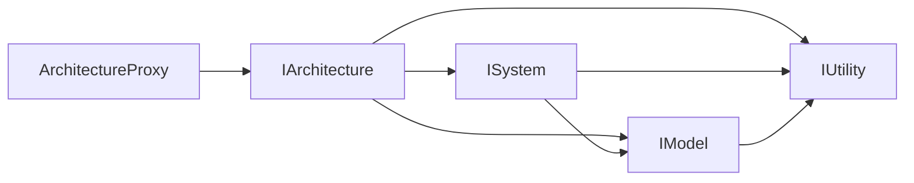

# QFramework 架构模式

<cite>
**本文引用的文件**   
- [QFramework.cs](file://Assets/Game/Framework/Qframework/Runtime/QFramework.cs)
- [ArchitectureProxy.cs](file://Assets/Game/Framework/Qframework/Runtime/Moyv/Proxies/ArchitectureProxy.cs)
- [GameArchitecture.cs](file://Assets/Game/Framework/Qframework/Runtime/Moyv/Proxies/GameArchitecture.cs)
- [TestArchitectureProxy.cs](file://Assets/Game/Framework/Qframework/Tests/Runtime/TestArchitectureProxy.cs)
</cite>

## 目录
1. [简介](#简介)
2. [项目结构](#项目结构)
3. [核心组件](#核心组件)
4. [架构总览](#架构总览)
5. [详细组件分析](#详细组件分析)
6. [依赖关系分析](#依赖关系分析)
7. [性能与生命周期](#性能与生命周期)
8. [故障排查指南](#故障排查指南)
9. [结论](#结论)
10. [附录：使用示例路径](#附录使用示例路径)

## 简介
本文件面向 QFramework 的架构模式，重点阐述 ArchitectureProxy 代理系统的设计原理与实现机制，包括泛型基类 ArchitectureProxy<T> 的使用方式、单例模式的实现、接口抽象层设计；并文档化 System-Model-Utility 三层架构的分层原则、职责分离与依赖关系。同时说明依赖注入容器的工作原理、组件注册与获取机制，提供架构图展示各层之间的关系和数据流向，并给出实际代码示例的路径指引，解释生命周期管理、初始化顺序和资源清理机制。

## 项目结构
围绕 QFramework 的核心运行时与代理层，关键文件分布如下：
- 核心框架定义（IArchitecture、Architecture<T>、System/Model/Utility 抽象、命令/查询/事件等）位于 QFramework.cs
- 代理层 IArchitectureProxy 与通用代理基类 ArchitectureProxy<T> 位于 ArchitectureProxy.cs
- 游戏级具体架构实例 GameArchitecture 位于 GameArchitecture.cs
- 测试用例 TestArchitectureProxy.cs 展示了代理注册与获取的典型用法

图示来源
- [QFramework.cs:45-92](file://Assets/Game/Framework/Qframework/Runtime/QFramework.cs#L45-L92)
- [QFramework.cs:424-510](file://Assets/Game/Framework/Qframework/Runtime/QFramework.cs#L424-L510)
- [ArchitectureProxy.cs:7-51](file://Assets/Game/Framework/Qframework/Runtime/Moyv/Proxies/ArchitectureProxy.cs#L7-L51)
- [GameArchitecture.cs:5-10](file://Assets/Game/Framework/Qframework/Runtime/Moyv/Proxies/GameArchitecture.cs#L5-L10)

章节来源
- [QFramework.cs:45-92](file://Assets/Game/Framework/Qframework/Runtime/QFramework.cs#L45-L92)
- [ArchitectureProxy.cs:7-51](file://Assets/Game/Framework/Qframework/Runtime/Moyv/Proxies/ArchitectureProxy.cs#L7-L51)
- [GameArchitecture.cs:5-10](file://Assets/Game/Framework/Qframework/Runtime/Moyv/Proxies/GameArchitecture.cs#L5-L10)

## 核心组件
- IArchitecture 与 Architecture<T>
  - 负责全局容器、组件注册与获取、命令/查询派发、事件分发、生命周期控制（Init/Reset/Reinit/ClearAll）。
  - 通过内部 IOC 容器维护 System/Model/Utility 实例，支持延迟初始化与自动创建。
- ArchitectureProxy<T> 与 IArchitectureProxy
  - 为业务模块提供统一的访问入口，屏蔽底层容器细节，统一注册与获取 API。
  - 通过静态 Interface 属性触发代理注册，确保每个 Proxy 仅初始化一次。
- GameArchitecture
  - 作为 Architecture<GameArchitecture> 的具体实现，承载全局状态与扩展点。
- System/Model/Utility 抽象
  - System：具备生命周期、可获取 Model/Utility、可发送事件与命令、可获取其他 System。
  - Model：具备生命周期、可获取 Utility、可发送事件。
  - Utility：纯工具能力，无生命周期约束。

章节来源
- [QFramework.cs:45-92](file://Assets/Game/Framework/Qframework/Runtime/QFramework.cs#L45-L92)
- [QFramework.cs:424-510](file://Assets/Game/Framework/Qframework/Runtime/QFramework.cs#L424-L510)
- [ArchitectureProxy.cs:53-197](file://Assets/Game/Framework/Qframework/Runtime/Moyv/Proxies/ArchitectureProxy.cs#L53-L197)
- [GameArchitecture.cs:5-10](file://Assets/Game/Framework/Qframework/Runtime/Moyv/Proxies/GameArchitecture.cs#L5-L10)

## 架构总览
下图展示了 ArchitectureProxy 到 Architecture 的调用链以及 System/Model/Utility 的依赖方向。

图示来源
- [QFramework.cs:45-92](file://Assets/Game/Framework/Qframework/Runtime/QFramework.cs#L45-L92)
- [QFramework.cs:424-510](file://Assets/Game/Framework/Qframework/Runtime/QFramework.cs#L424-L510)
- [ArchitectureProxy.cs:7-51](file://Assets/Game/Framework/Qframework/Runtime/Moyv/Proxies/ArchitectureProxy.cs#L7-L51)
- [ArchitectureProxy.cs:53-197](file://Assets/Game/Framework/Qframework/Runtime/Moyv/Proxies/ArchitectureProxy.cs#L53-L197)
- [GameArchitecture.cs:5-10](file://Assets/Game/Framework/Qframework/Runtime/Moyv/Proxies/GameArchitecture.cs#L5-L10)

## 详细组件分析

### ArchitectureProxy 代理系统与单例模式
- 设计要点
  - 每个自定义 Proxy 继承自 ArchitectureProxy<T>，并通过静态 Interface 暴露统一入口。
  - 首次访问 Interface 时，会向 GameArchitecture 注册该 Proxy，随后在 Architecture<T> 中缓存并执行其 Init()。
  - 所有 Register/Get/Send 操作均转发至 IArchitecture，保持对上层透明。
- 单例语义
  - 通过 Architecture<T>.Interface 的单例式访问，保证全局唯一架构实例。
  - 通过 mProxies 字典避免重复初始化同一 Proxy。
- 典型流程
  - 访问 Proxy.Interface → 调用 GameArchitecture.RegisterProxy<T>() → 若未注册则 new TProxy() 并调用 Init() → 返回 IArchitecture。

图示来源
- [ArchitectureProxy.cs:57-65](file://Assets/Game/Framework/Qframework/Runtime/Moyv/Proxies/ArchitectureProxy.cs#L57-L65)
- [QFramework.cs:196-204](file://Assets/Game/Framework/Qframework/Runtime/QFramework.cs#L196-L204)
- [QFramework.cs:206-242](file://Assets/Game/Framework/Qframework/Runtime/QFramework.cs#L206-L242)

章节来源
- [ArchitectureProxy.cs:53-197](file://Assets/Game/Framework/Qframework/Runtime/Moyv/Proxies/ArchitectureProxy.cs#L53-L197)
- [QFramework.cs:196-204](file://Assets/Game/Framework/Qframework/Runtime/QFramework.cs#L196-L204)
- [QFramework.cs:206-242](file://Assets/Game/Framework/Qframework/Runtime/QFramework.cs#L206-L242)

### System-Model-Utility 分层原则与依赖关系
- 分层原则
  - System：编排与协调，持有对 Model/Utility 的引用，可发送事件与命令，可获取其他 System。
  - Model：数据与状态，不直接依赖 System，可发送事件，可获取 Utility。
  - Utility：无状态工具集，供 System/Model 复用。
- 依赖方向
  - System → Model、Utility
  - Model → Utility
  - Utility → 无
- 生命周期
  - 注册时根据 LazyInit 决定是否立即 Init；Reset 后 Reinit 仅重新初始化尚未初始化的组件。

图示来源
- [QFramework.cs:206-218](file://Assets/Game/Framework/Qframework/Runtime/QFramework.cs#L206-L218)
- [QFramework.cs:148-171](file://Assets/Game/Framework/Qframework/Runtime/QFramework.cs#L148-L171)
- [QFramework.cs:429-500](file://Assets/Game/Framework/Qframework/Runtime/QFramework.cs#L429-L500)

章节来源
- [QFramework.cs:424-510](file://Assets/Game/Framework/Qframework/Runtime/QFramework.cs#L424-L510)
- [QFramework.cs:148-171](file://Assets/Game/Framework/Qframework/Runtime/QFramework.cs#L148-L171)

### 依赖注入容器工作原理
- 注册
  - RegisterSystem/RegisterModel 会将实例注入容器，并在非延迟模式下立即 Init。
  - RegisterUtility 仅注册工具实例，不参与生命周期。
- 获取
  - GetSystem<T> 优先从容器取，不存在且允许自动创建时反射构造并注入。
  - GetModel<T>/GetUtility<T> 直接从容器解析。
- 清理
  - ClearContainer 清空容器；ClearAll 组合 Reset/ClearEvent/ClearContainer 并重置架构状态。

图示来源
- [QFramework.cs:206-242](file://Assets/Game/Framework/Qframework/Runtime/QFramework.cs#L206-L242)
- [QFramework.cs:306-351](file://Assets/Game/Framework/Qframework/Runtime/QFramework.cs#L306-L351)

章节来源
- [QFramework.cs:206-242](file://Assets/Game/Framework/Qframework/Runtime/QFramework.cs#L206-L242)
- [QFramework.cs:306-351](file://Assets/Game/Framework/Qframework/Runtime/QFramework.cs#L306-L351)

### 事件与命令/查询
- 事件
  - SendEvent/SendEventToMainThread 基于类型事件系统分发；支持主线程调度。
- 命令/查询
  - SendCommand 将命令注入架构上下文并执行 Execute；SendQuery 执行查询并返回结果。
- 扩展能力
  - 通过 ICan* 扩展接口，System/Model/Command/Query 可直接以便捷方法访问架构能力。

图示来源
- [QFramework.cs:308-351](file://Assets/Game/Framework/Qframework/Runtime/QFramework.cs#L308-L351)
- [QFramework.cs:512-590](file://Assets/Game/Framework/Qframework/Runtime/QFramework.cs#L512-L590)

章节来源
- [QFramework.cs:308-351](file://Assets/Game/Framework/Qframework/Runtime/QFramework.cs#L308-L351)
- [QFramework.cs:512-590](file://Assets/Game/Framework/Qframework/Runtime/QFramework.cs#L512-L590)

## 依赖关系分析
- 耦合与内聚
  - ArchitectureProxy<T> 与 IArchitecture 解耦，便于替换不同架构实现。
  - System/Model 通过扩展方法与 IArchitecture 交互，降低显式依赖。
- 外部依赖
  - 事件系统、定时器（可选）、场景卸载监听等由 Architecture<T> 内部组合。
- 循环依赖规避
  - 通过延迟初始化与按需获取，避免强耦合导致的循环依赖。

图示来源
- [ArchitectureProxy.cs:53-197](file://Assets/Game/Framework/Qframework/Runtime/Moyv/Proxies/ArchitectureProxy.cs#L53-L197)
- [QFramework.cs:424-510](file://Assets/Game/Framework/Qframework/Runtime/QFramework.cs#L424-L510)

章节来源
- [ArchitectureProxy.cs:53-197](file://Assets/Game/Framework/Qframework/Runtime/Moyv/Proxies/ArchitectureProxy.cs#L53-L197)
- [QFramework.cs:424-510](file://Assets/Game/Framework/Qframework/Runtime/QFramework.cs#L424-L510)

## 性能与生命周期
- 初始化策略
  - 默认立即初始化；通过 LazyInit 可实现按需初始化，减少启动开销。
- 重置与重启
  - Reset 调用各组件 OnReset 并重置状态；Reinit 仅重新初始化未初始化的组件。
- 资源清理
  - ClearAll 组合 Reset/ClearEvent/ClearContainer，并清空代理缓存，适合场景切换或热重载。
- 主线程事件
  - 在多线程事件开关下，每帧调度 HandleMainThreadEvents，确保 UI 安全。

章节来源
- [QFramework.cs:148-171](file://Assets/Game/Framework/Qframework/Runtime/QFramework.cs#L148-L171)
- [QFramework.cs:180-187](file://Assets/Game/Framework/Qframework/Runtime/QFramework.cs#L180-L187)
- [QFramework.cs:191-194](file://Assets/Game/Framework/Qframework/Runtime/QFramework.cs#L191-L194)

## 故障排查指南
- 常见问题
  - 获取未注册的 Model/System 失败：检查是否在对应 Proxy.Init 中完成注册，或使用 GetSystem(autoCreate=true) 的自动创建行为。
  - 重复初始化：确认 Proxy 未被多次注册；Architecture<T> 内部已做去重。
  - 生命周期错乱：检查 LazyInit 设置与 Reset/Reinit 调用时机。
- 定位手段
  - 使用 GetAllSystems/GetAllModels 枚举当前容器内容，验证注册情况。
  - 借助日志 Tag 输出关键节点，结合测试用例对比预期。

章节来源
- [QFramework.cs:259-304](file://Assets/Game/Framework/Qframework/Runtime/QFramework.cs#L259-L304)
- [QFramework.cs:180-187](file://Assets/Game/Framework/Qframework/Runtime/QFramework.cs#L180-L187)

## 结论
QFramework 通过 ArchitectureProxy<T> 提供简洁一致的访问入口，配合 Architecture<T> 的全局容器与生命周期管理，实现了清晰的 System-Model-Utility 分层与松耦合依赖。延迟初始化、重置与重启机制使系统在复杂场景中具备良好的可控性与可维护性。

## 附录：使用示例路径
- 自定义 Proxy 与注册示例
  - [TestArchitectureProxy.cs:45-70](file://Assets/Game/Framework/Qframework/Tests/Runtime/TestArchitectureProxy.cs#L45-L70)
- 获取与断言示例
  - [TestArchitectureProxy.cs:78-107](file://Assets/Game/Framework/Qframework/Tests/Runtime/TestArchitectureProxy.cs#L78-L107)
- 架构与代理核心实现
  - [ArchitectureProxy.cs:53-197](file://Assets/Game/Framework/Qframework/Runtime/Moyv/Proxies/ArchitectureProxy.cs#L53-L197)
  - [QFramework.cs:45-92](file://Assets/Game/Framework/Qframework/Runtime/QFramework.cs#L45-L92)
  - [GameArchitecture.cs:5-10](file://Assets/Game/Framework/Qframework/Runtime/Moyv/Proxies/GameArchitecture.cs#L5-L10)