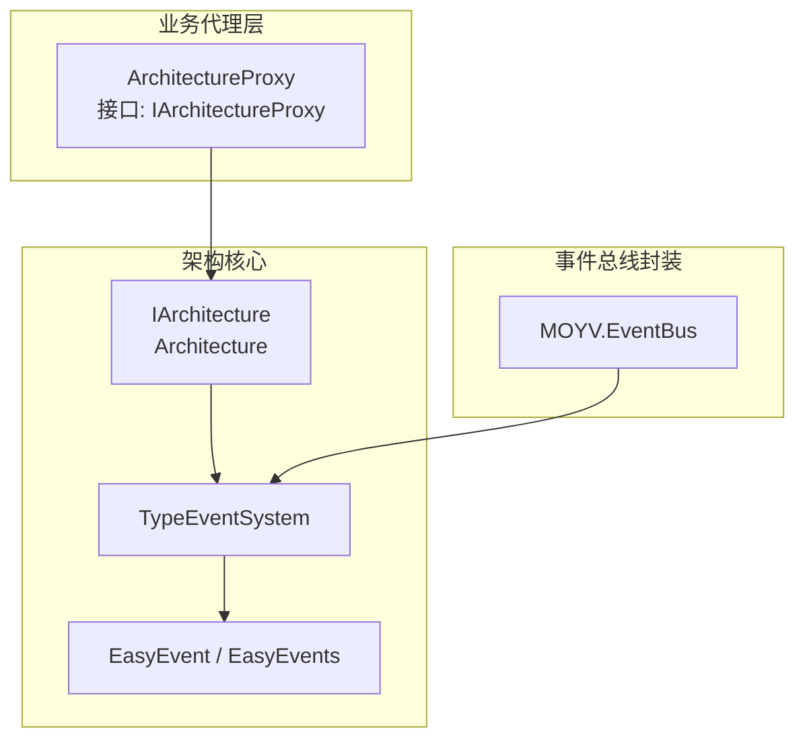
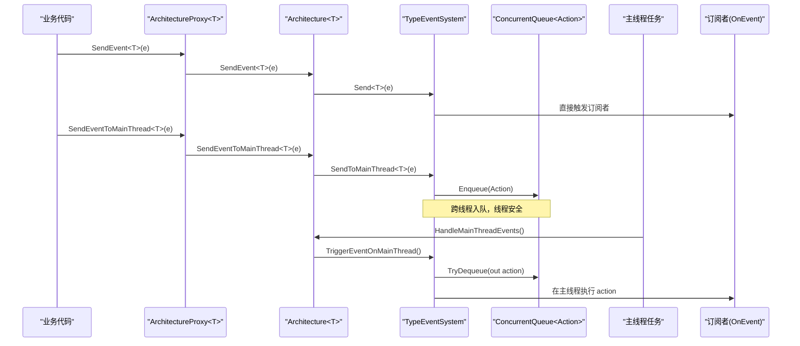
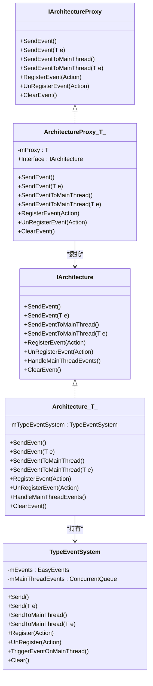
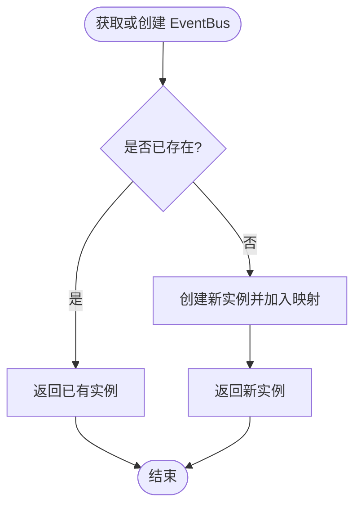
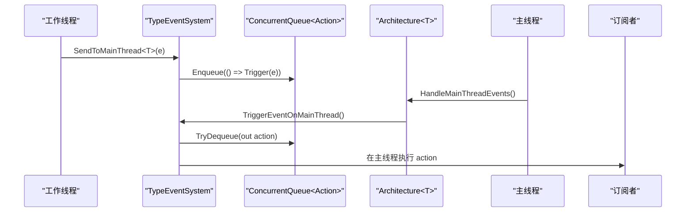
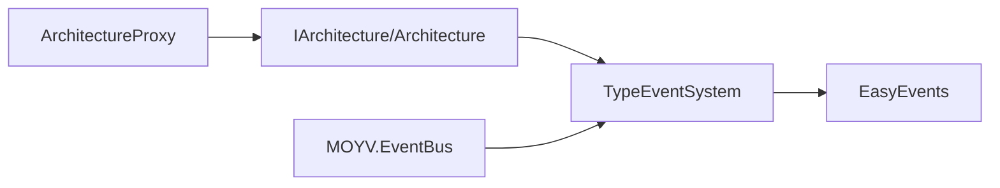

# 事件系统集成

<cite>
**本文引用的文件**
- [ArchitectureProxy.cs](file://Assets/Game/Framework/Qframework/Runtime/Moyv/Proxies/ArchitectureProxy.cs)
- [QFramework.cs](file://Assets/Game/Framework/Qframework/Runtime/QFramework.cs)
- [EventBus.cs](file://Assets/Game/Framework/Qframework/Runtime/Moyv/EventBus.cs)
- [TestMultiThreadEvents.cs](file://Assets/Game/Framework/Qframework/Tests/Runtime/TestMultiThreadEvents.cs)
- [TestMultiThreadEventsInEditor.cs](file://Assets/Game/Framework/Qframework/Tests/Editor/TestMultiThreadEventsInEditor.cs)
</cite>

## 目录
1. [简介](#简介)
2. [项目结构](#项目结构)
3. [核心组件](#核心组件)
4. [架构总览](#架构总览)
5. [详细组件分析](#详细组件分析)
6. [依赖关系分析](#依赖关系分析)
7. [性能与线程安全](#性能与线程安全)
8. [最佳实践](#最佳实践)
9. [故障排查指南](#故障排查指南)
10. [结论](#结论)

## 简介
本技术文档围绕事件系统的集成与实现，重点说明以下方面：
- ArchitectureProxy 如何桥接上层调用与底层事件系统（SendEvent、RegisterEvent、UnRegisterEvent、SendEventToMainThread）。
- EventBus 的实现原理及其与 TypeEventSystem 的协作。
- 类型安全事件的定义、发布与订阅模式。
- 主线程事件调度 SendEventToMainThread 的实现细节与使用场景。
- 事件系统设计模式的最佳实践（命名规范、数据传递、内存泄漏防护）。
- 事件过滤、优先级处理与性能优化策略。

## 项目结构
事件系统相关代码主要位于 QFramework 运行时模块中，并通过 Moyv 子模块提供面向业务层的代理与封装。关键路径如下：
- 架构与事件入口：IArchitecture、Architecture<T>、TypeEventSystem、EasyEvent/EasyEvents
- 业务代理层：ArchitectureProxy<T>、IArchitectureProxy
- 事件总线封装：MOYV.EventBus
- 多线程事件测试用例：TestMultiThreadEvents、TestMultiThreadEventsInEditor

图表来源
- [ArchitectureProxy.cs:53-197](file://Assets/Game/Framework/Qframework/Runtime/Moyv/Proxies/ArchitectureProxy.cs#L53-L197)
- [QFramework.cs:94-351](file://Assets/Game/Framework/Qframework/Runtime/QFramework.cs#L94-L351)
- [QFramework.cs:874-909](file://Assets/Game/Framework/Qframework/Runtime/QFramework.cs#L874-L909)
- [QFramework.cs:1126-1242](file://Assets/Game/Framework/Qframework/Runtime/QFramework.cs#L1126-L1242)
- [EventBus.cs:7-51](file://Assets/Game/Framework/Qframework/Runtime/Moyv/EventBus.cs#L7-L51)

章节来源
- [ArchitectureProxy.cs:53-197](file://Assets/Game/Framework/Qframework/Runtime/Moyv/Proxies/ArchitectureProxy.cs#L53-L197)
- [QFramework.cs:94-351](file://Assets/Game/Framework/Qframework/Runtime/QFramework.cs#L94-L351)
- [QFramework.cs:874-909](file://Assets/Game/Framework/Qframework/Runtime/QFramework.cs#L874-L909)
- [QFramework.cs:1126-1242](file://Assets/Game/Framework/Qframework/Runtime/QFramework.cs#L1126-L1242)
- [EventBus.cs:7-51](file://Assets/Game/Framework/Qframework/Runtime/Moyv/EventBus.cs#L7-L51)

## 核心组件
- IArchitectureProxy 与 ArchitectureProxy<T>：对外暴露统一的事件 API（SendEvent、RegisterEvent、UnRegisterEvent、SendEventToMainThread），内部委托给 GameArchitecture.Interface。
- IArchitecture 与 Architecture<T>：承载 IOC 容器、命令/查询分发以及事件系统入口；维护 TypeEventSystem 实例并提供 HandleMainThreadEvents。
- TypeEventSystem：基于 EasyEvents 的类型安全事件系统，支持主线程队列派发。
- EasyEvent/EasyEvents：轻量级泛型事件容器，按类型注册/触发回调。
- MOYV.EventBus：对 TypeEventSystem 的简单封装，提供 GetOrCreate 多实例管理。

章节来源
- [ArchitectureProxy.cs:7-51](file://Assets/Game/Framework/Qframework/Runtime/Moyv/Proxies/ArchitectureProxy.cs#L7-L51)
- [ArchitectureProxy.cs:53-197](file://Assets/Game/Framework/Qframework/Runtime/Moyv/Proxies/ArchitectureProxy.cs#L53-L197)
- [QFramework.cs:45-92](file://Assets/Game/Framework/Qframework/Runtime/QFramework.cs#L45-L92)
- [QFramework.cs:94-351](file://Assets/Game/Framework/Qframework/Runtime/QFramework.cs#L94-L351)
- [QFramework.cs:874-909](file://Assets/Game/Framework/Qframework/Runtime/QFramework.cs#L874-L909)
- [QFramework.cs:1126-1242](file://Assets/Game/Framework/Qframework/Runtime/QFramework.cs#L1126-L1242)
- [EventBus.cs:7-51](file://Assets/Game/Framework/Qframework/Runtime/Moyv/EventBus.cs#L7-L51)

## 架构总览
下图展示了从业务层到事件分发的完整链路，包括主线程调度流程。

图表来源
- [ArchitectureProxy.cs:134-152](file://Assets/Game/Framework/Qframework/Runtime/Moyv/Proxies/ArchitectureProxy.cs#L134-L152)
- [QFramework.cs:334-351](file://Assets/Game/Framework/Qframework/Runtime/QFramework.cs#L334-L351)
- [QFramework.cs:874-909](file://Assets/Game/Framework/Qframework/Runtime/QFramework.cs#L874-L909)
- [QFramework.cs:191-194](file://Assets/Game/Framework/Qframework/Runtime/QFramework.cs#L191-L194)

章节来源
- [ArchitectureProxy.cs:134-152](file://Assets/Game/Framework/Qframework/Runtime/Moyv/Proxies/ArchitectureProxy.cs#L134-L152)
- [QFramework.cs:334-351](file://Assets/Game/Framework/Qframework/Runtime/QFramework.cs#L334-L351)
- [QFramework.cs:874-909](file://Assets/Game/Framework/Qframework/Runtime/QFramework.cs#L874-L909)
- [QFramework.cs:191-194](file://Assets/Game/Framework/Qframework/Runtime/QFramework.cs#L191-L194)

## 详细组件分析

### ArchitectureProxy 与底层事件系统的集成
- 事件发送
  - SendEvent<T>() 与 SendEvent<T>(T e)：通过 GameArchitecture.Interface 转发至 Architecture<T>，最终由 TypeEventSystem.Send 触发对应类型的订阅者。
  - SendEventToMainThread<T>() 与 SendEventToMainThread<T>(T e)：将事件包装为 Action 入队至 ConcurrentQueue，后续由主线程统一消费。
- 事件订阅/注销
  - RegisterEvent<T>(Action<T>)：返回 IUnRegister，便于生命周期管理。
  - UnRegisterEvent<T>(Action<T>)：移除指定回调。
  - ClearEvent()：清空所有已注册事件。
- 控制流要点
  - ArchitectureProxy<T> 仅做薄封装，实际逻辑在 Architecture<T> 与 TypeEventSystem。
  - 主线程事件消费由 Architecture<T>.HandleMainThreadEvents 驱动，内部调用 TypeEventSystem.TriggerEventOnMainThread。

图表来源
- [ArchitectureProxy.cs:7-51](file://Assets/Game/Framework/Qframework/Runtime/Moyv/Proxies/ArchitectureProxy.cs#L7-L51)
- [ArchitectureProxy.cs:53-197](file://Assets/Game/Framework/Qframework/Runtime/Moyv/Proxies/ArchitectureProxy.cs#L53-L197)
- [QFramework.cs:45-92](file://Assets/Game/Framework/Qframework/Runtime/QFramework.cs#L45-L92)
- [QFramework.cs:94-351](file://Assets/Game/Framework/Qframework/Runtime/QFramework.cs#L94-L351)
- [QFramework.cs:874-909](file://Assets/Game/Framework/Qframework/Runtime/QFramework.cs#L874-L909)

章节来源
- [ArchitectureProxy.cs:134-167](file://Assets/Game/Framework/Qframework/Runtime/Moyv/Proxies/ArchitectureProxy.cs#L134-L167)
- [QFramework.cs:334-351](file://Assets/Game/Framework/Qframework/Runtime/QFramework.cs#L334-L351)
- [QFramework.cs:874-909](file://Assets/Game/Framework/Qframework/Runtime/QFramework.cs#L874-L909)

### EventBus 的实现原理与使用
- 职责：对 TypeEventSystem 进行轻量封装，提供 GetOrCreate(key) 的多实例管理，便于不同子系统隔离事件空间。
- 能力：
  - RegisterEvent<T>(Action<T>)
  - UnRegisterEvent<T>(Action<T>)
  - SendEvent<T>(T) 与 SendEvent<T>()
- 注意：当前实现未包含主线程队列方法，如需主线程派发，建议直接使用 ArchitectureProxy 或 TypeEventSystem 的 SendToMainThread。

图表来源
- [EventBus.cs:31-51](file://Assets/Game/Framework/Qframework/Runtime/Moyv/EventBus.cs#L31-L51)

章节来源
- [EventBus.cs:7-51](file://Assets/Game/Framework/Qframework/Runtime/Moyv/EventBus.cs#L7-L51)

### 类型安全事件的定义、发布与订阅
- 事件类型：任意引用或值类型均可作为事件载体，推荐结构体以减少 GC。
- 订阅：
  - 通过 ArchitectureProxy.RegisterEvent<T>(Action<T>) 或扩展方法 ICanRegisterEvent.RegisterEvent<T> 完成。
  - 返回 IUnRegister，可配合生命周期钩子自动注销。
- 发布：
  - 同步：ArchitectureProxy.SendEvent<T>() 或 SendEvent<T>(T)。
  - 异步（主线程）：ArchitectureProxy.SendEventToMainThread<T>() 或 SendEventToMainThread<T>(T)。
- 示例参考：
  - 单元测试中演示了从工作线程调用 SendEventToMainThread，并在主线程回调中操作 Unity 对象。

章节来源
- [QFramework.cs:642-687](file://Assets/Game/Framework/Qframework/Runtime/QFramework.cs#L642-L687)
- [QFramework.cs:1126-1242](file://Assets/Game/Framework/Qframework/Runtime/QFramework.cs#L1126-L1242)
- [TestMultiThreadEvents.cs:31-53](file://Assets/Game/Framework/Qframework/Tests/Runtime/TestMultiThreadEvents.cs#L31-L53)

### 主线程事件调度 SendEventToMainThread 的实现细节
- 入队：TypeEventSystem.SendToMainThread<T>() 将构造事件并触发订阅者的动作封装为委托，入队至 ConcurrentQueue<Action>。
- 出队与执行：Architecture<T>.HandleMainThreadEvents() 每帧调用一次（在 ENABLE_MULTITHREAD_EVENT 条件下由 TimerSystem 添加帧任务），内部调用 TypeEventSystem.TriggerEventOnMainThread()，逐条出队并执行。
- 使用场景：
  - 在工作线程中产生事件，但需要在主线程更新 UI、创建 GameObject 等。
  - 编辑器环境下，通过 EditorApplication.update 循环调用 HandleMainThreadEvents。

图表来源
- [QFramework.cs:874-909](file://Assets/Game/Framework/Qframework/Runtime/QFramework.cs#L874-L909)
- [QFramework.cs:191-194](file://Assets/Game/Framework/Qframework/Runtime/QFramework.cs#L191-L194)
- [TestMultiThreadEventsInEditor.cs:14-17](file://Assets/Game/Framework/Qframework/Tests/Editor/TestMultiThreadEventsInEditor.cs#L14-L17)

章节来源
- [QFramework.cs:874-909](file://Assets/Game/Framework/Qframework/Runtime/QFramework.cs#L874-L909)
- [QFramework.cs:191-194](file://Assets/Game/Framework/Qframework/Runtime/QFramework.cs#L191-L194)
- [TestMultiThreadEventsInEditor.cs:14-17](file://Assets/Game/Framework/Qframework/Tests/Editor/TestMultiThreadEventsInEditor.cs#L14-L17)
- [TestMultiThreadEvents.cs:55-81](file://Assets/Game/Framework/Qframework/Tests/Runtime/TestMultiThreadEvents.cs#L55-L81)

## 依赖关系分析
- ArchitectureProxy<T> 依赖 IArchitecture（GameArchitecture.Interface），用于统一事件与容器访问。
- Architecture<T> 持有 TypeEventSystem 实例，负责事件注册、发送与主线程调度。
- TypeEventSystem 依赖 EasyEvents 管理具体事件类型，并使用 ConcurrentQueue 保证跨线程安全。
- MOYV.EventBus 依赖 TypeEventSystem，提供多实例管理。

图表来源
- [ArchitectureProxy.cs:53-197](file://Assets/Game/Framework/Qframework/Runtime/Moyv/Proxies/ArchitectureProxy.cs#L53-L197)
- [QFramework.cs:94-351](file://Assets/Game/Framework/Qframework/Runtime/QFramework.cs#L94-L351)
- [QFramework.cs:874-909](file://Assets/Game/Framework/Qframework/Runtime/QFramework.cs#L874-L909)
- [EventBus.cs:7-51](file://Assets/Game/Framework/Qframework/Runtime/Moyv/EventBus.cs#L7-L51)

章节来源
- [ArchitectureProxy.cs:53-197](file://Assets/Game/Framework/Qframework/Runtime/Moyv/Proxies/ArchitectureProxy.cs#L53-L197)
- [QFramework.cs:94-351](file://Assets/Game/Framework/Qframework/Runtime/QFramework.cs#L94-L351)
- [QFramework.cs:874-909](file://Assets/Game/Framework/Qframework/Runtime/QFramework.cs#L874-L909)
- [EventBus.cs:7-51](file://Assets/Game/Framework/Qframework/Runtime/Moyv/EventBus.cs#L7-L51)

## 性能与线程安全
- 线程安全
  - 主线程队列使用 ConcurrentQueue<Action>，确保跨线程入队安全。
  - 主线程消费采用单帧内 TryDequeue 逐个执行，避免并发问题。
- 性能特性
  - 事件存储基于字典按类型索引，查找 O(1)。
  - 事件触发为委托链式调用，开销较小；建议使用结构体事件减少分配。
  - 主线程队列初始容量为 64，在高并发下可能扩容，必要时可在应用启动时预分配或限制事件频率。
- 注意事项
  - 避免在主线程回调中进行耗时操作，以免阻塞渲染与输入。
  - 大量事件频繁触发时，考虑合并或节流策略。

章节来源
- [QFramework.cs:874-909](file://Assets/Game/Framework/Qframework/Runtime/QFramework.cs#L874-L909)
- [QFramework.cs:1126-1242](file://Assets/Game/Framework/Qframework/Runtime/QFramework.cs#L1126-L1242)

## 最佳实践
- 事件命名规范
  - 使用动词+名词或状态变更语义，如 OnPlayerDied、OnLevelLoaded、OnNetworkConnected。
  - 区分“请求类”与“通知类”，前者可用 Command/Query，后者用 Event。
- 数据传递方式
  - 优先使用不可变结构体承载事件数据，减少 GC 压力。
  - 复杂数据尽量只传递必要字段，避免大对象拷贝。
- 内存泄漏防护
  - 始终使用 RegisterEvent 返回的 IUnRegister 进行生命周期管理，或在合适时机调用 UnRegisterEvent。
  - 结合 UnRegisterWhenGameObjectDestroyed/UnRegisterWhenDisabled 等扩展，自动清理。
- 事件过滤与优先级
  - 当前实现无内置过滤与优先级机制。若需要，可在订阅者内部进行条件判断，或通过自定义中间件/装饰器模式在触发前拦截。
- 性能优化策略
  - 批量事件合并：将多次小事件合并为一次大事件。
  - 节流/去抖：高频事件（如输入、网络心跳）进行时间窗口聚合。
  - 按需订阅：仅在需要时注册，避免全局常驻监听造成不必要开销。

[本节为通用指导，不直接分析具体文件]

## 故障排查指南
- 主线程事件未触发
  - 确认是否在每帧调用了 HandleMainThreadEvents（编辑器环境需订阅 EditorApplication.update）。
  - 检查是否启用了多线程事件编译宏（ENABLE_MULTITHREAD_EVENT）。
- 事件重复触发或丢失
  - 检查是否存在多处重复注册同一回调。
  - 确认是否正确注销，避免重复释放或悬挂引用。
- 主线程访问异常
  - 确保 SendEventToMainThread 的回调在主线程执行，不要在非主线程直接操作 Unity 对象。
- 性能抖动
  - 监控主线程队列长度，避免瞬时大量入队。
  - 评估事件载荷大小与触发频率，考虑合并与节流。

章节来源
- [TestMultiThreadEventsInEditor.cs:14-17](file://Assets/Game/Framework/Qframework/Tests/Editor/TestMultiThreadEventsInEditor.cs#L14-L17)
- [QFramework.cs:191-194](file://Assets/Game/Framework/Qframework/Runtime/QFramework.cs#L191-L194)
- [QFramework.cs:874-909](file://Assets/Game/Framework/Qframework/Runtime/QFramework.cs#L874-L909)

## 结论
该事件系统以类型安全为核心，通过 ArchitectureProxy 提供统一的 API，借助 TypeEventSystem 与 EasyEvents 实现高效分发，并利用 ConcurrentQueue 保障跨线程安全的主线程调度。结合 IUnRegister 的生命周期管理与合适的性能优化策略，能够在大型项目中稳定支撑解耦通信需求。对于过滤与优先级等高级特性，可通过订阅者内部逻辑或外部中间件扩展实现。