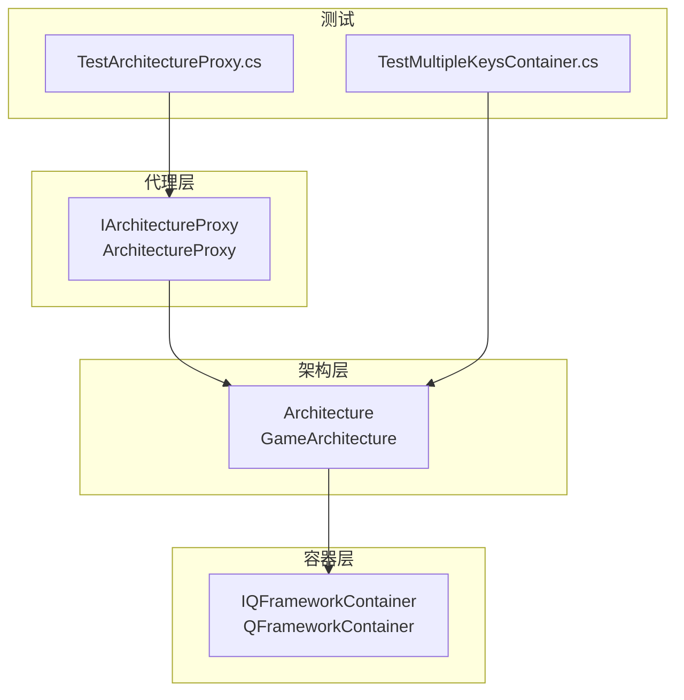
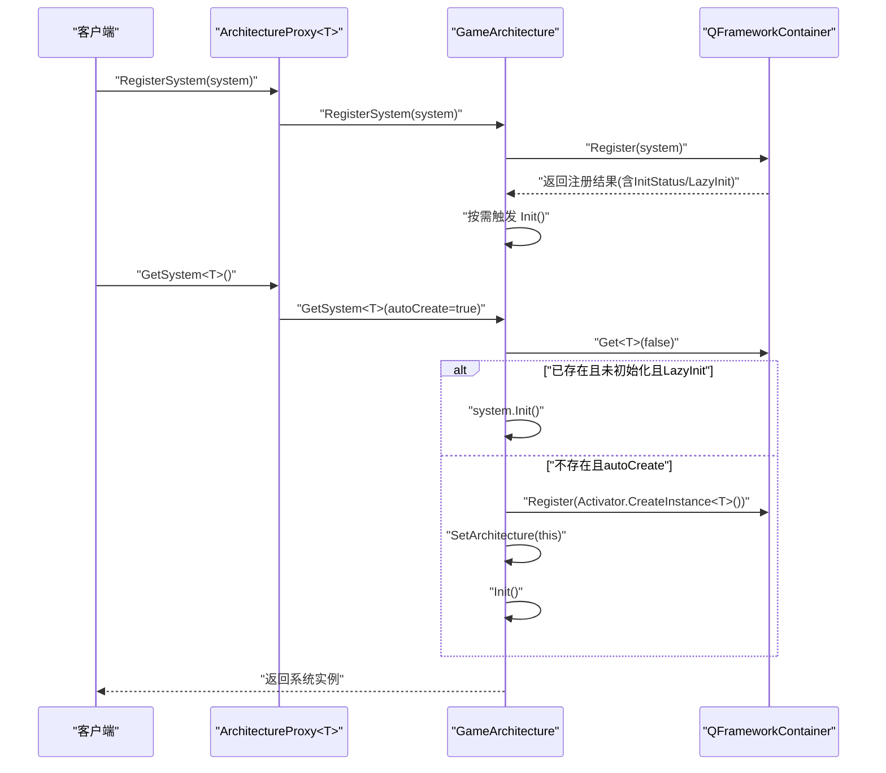
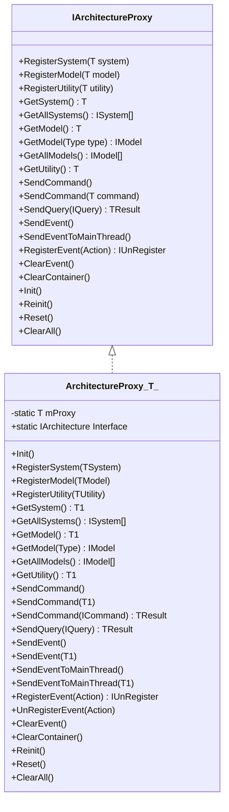
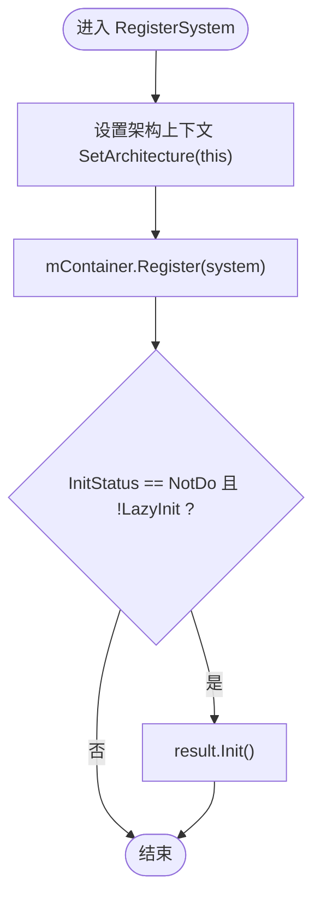
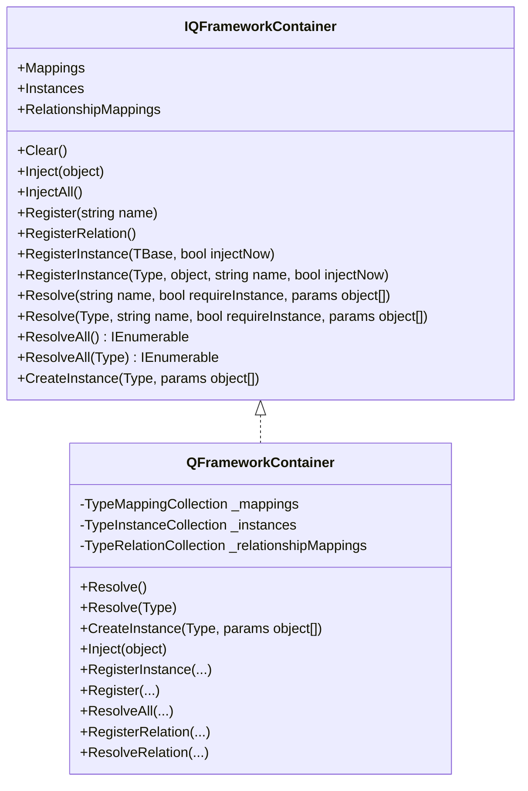
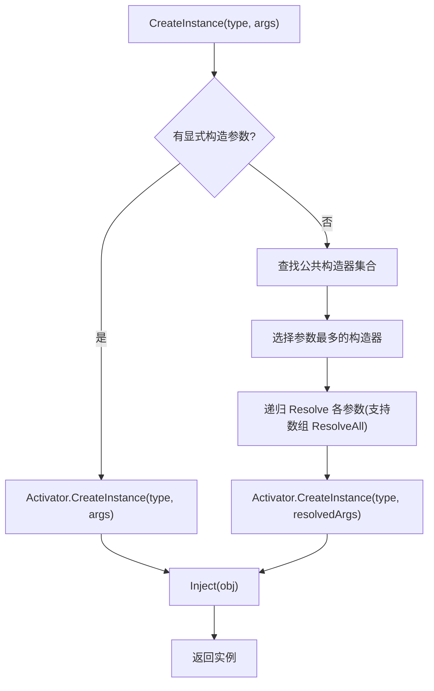
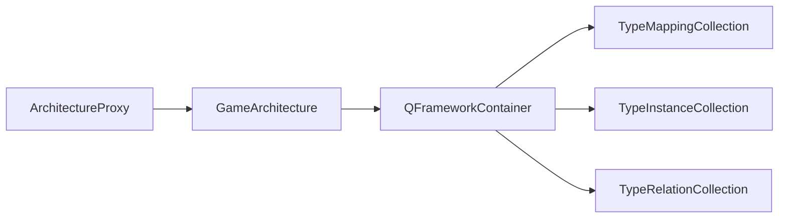

# 依赖注入容器

<cite>
**本文引用的文件**   
- [ArchitectureProxy.cs](file://Assets/Game/Framework/Qframework/Runtime/Moyv/Proxies/ArchitectureProxy.cs)
- [GameArchitecture.cs](file://Assets/Game/Framework/Qframework/Runtime/Moyv/Proxies/GameArchitecture.cs)
- [QFramework.cs](file://Assets/Game/Framework/Qframework/Runtime/QFramework.cs)
- [IOCKit.cs](file://Assets/Game/Framework/Qframework/Toolkits/_CoreKit/IOCKit/IOCKit.cs)
- [TestArchitectureProxy.cs](file://Assets/Game/Framework/Qframework/Tests/Runtime/TestArchitectureProxy.cs)
- [TestMultipleKeysContainer.cs](file://Assets/Game/Framework/Qframework/Tests/Editor/TestMultipleKeysContainer.cs)
</cite>

## 目录
1. [简介](#简介)
2. [项目结构](#项目结构)
3. [核心组件](#核心组件)
4. [架构总览](#架构总览)
5. [详细组件分析](#详细组件分析)
6. [依赖关系分析](#依赖关系分析)
7. [性能考量](#性能考量)
8. [故障排查指南](#故障排查指南)
9. [结论](#结论)
10. [附录](#附录)

## 简介
本技术文档围绕依赖注入容器系统，重点解析 IArchitectureProxy 接口及其实现 ArchitectureProxy<T> 的注册与解析机制，包括 RegisterSystem、RegisterModel、RegisterUtility 的实现原理与使用方式。文档同时说明类型安全的依赖解析、泛型约束的应用、运行时类型检查、循环依赖检测、依赖图构建与自动装配过程，并给出自定义依赖解析器的扩展点与最佳实践（构造函数注入、属性注入、方法注入），以及作用域管理、单例模式与工厂模式的集成方式。

## 项目结构
本项目中的依赖注入相关代码主要位于 QFramework 框架中：
- 代理层：IArchitectureProxy 与 ArchitectureProxy<T> 提供面向业务层的统一入口
- 架构层：Architecture<T> 与 GameArchitecture 作为全局容器与生命周期协调者
- 容器层：IQFrameworkContainer 与 QFrameworkContainer 提供映射、实例管理与反射注入能力
- 测试用例：验证多键注册、反向注册、延迟初始化等行为

图表来源
- [ArchitectureProxy.cs:7-197](file://Assets/Game/Framework/Qframework/Runtime/Moyv/Proxies/ArchitectureProxy.cs#L7-L197)
- [GameArchitecture.cs:1-10](file://Assets/Game/Framework/Qframework/Runtime/Moyv/Proxies/GameArchitecture.cs#L1-L10)
- [QFramework.cs:93-274](file://Assets/Game/Framework/Qframework/Runtime/QFramework.cs#L93-L274)
- [IOCKit.cs:138-460](file://Assets/Game/Framework/Qframework/Toolkits/_CoreKit/IOCKit/IOCKit.cs#L138-L460)
- [TestArchitectureProxy.cs:63-115](file://Assets/Game/Framework/Qframework/Tests/Runtime/TestArchitectureProxy.cs#L63-L115)
- [TestMultipleKeysContainer.cs:86-137](file://Assets/Game/Framework/Qframework/Tests/Editor/TestMultipleKeysContainer.cs#L86-L137)

章节来源
- [ArchitectureProxy.cs:7-197](file://Assets/Game/Framework/Qframework/Runtime/Moyv/Proxies/ArchitectureProxy.cs#L7-L197)
- [GameArchitecture.cs:1-10](file://Assets/Game/Framework/Qframework/Runtime/Moyv/Proxies/GameArchitecture.cs#L1-L10)
- [QFramework.cs:93-274](file://Assets/Game/Framework/Qframework/Runtime/QFramework.cs#L93-L274)
- [IOCKit.cs:138-460](file://Assets/Game/Framework/Qframework/Toolkits/_CoreKit/IOCKit/IOCKit.cs#L138-L460)
- [TestArchitectureProxy.cs:63-115](file://Assets/Game/Framework/Qframework/Tests/Runtime/TestArchitectureProxy.cs#L63-L115)
- [TestMultipleKeysContainer.cs:86-137](file://Assets/Game/Framework/Qframework/Tests/Editor/TestMultipleKeysContainer.cs#L86-L137)

## 核心组件
- IArchitectureProxy 与 ArchitectureProxy<T>
  - 提供统一的注册与获取入口，内部委托给 GameArchitecture.Interface
  - 支持 System、Model、Utility 三类组件的注册与获取
  - 提供事件、命令、查询等高层 API 的转发
- Architecture<T> 与 GameArchitecture
  - 全局单例式访问点，维护容器 mContainer
  - 负责设置 ICanSetArchitecture 上下文、容器注册、懒加载与初始化
- IQFrameworkContainer 与 QFrameworkContainer
  - 基于 TypeMappingCollection、TypeInstanceCollection、TypeRelationCollection 的映射与实例管理
  - 提供 Resolve、ResolveAll、CreateInstance、Inject 等反射注入能力
  - 支持按名称区分实例、关系映射、批量注入

章节来源
- [ArchitectureProxy.cs:7-197](file://Assets/Game/Framework/Qframework/Runtime/Moyv/Proxies/ArchitectureProxy.cs#L7-L197)
- [QFramework.cs:197-274](file://Assets/Game/Framework/Qframework/Runtime/QFramework.cs#L197-L274)
- [IOCKit.cs:138-460](file://Assets/Game/Framework/Qframework/Toolkits/_CoreKit/IOCKit/IOCKit.cs#L138-L460)

## 架构总览
下图展示了从代理层到容器层的调用链与职责划分：

图表来源
- [ArchitectureProxy.cs:69-87](file://Assets/Game/Framework/Qframework/Runtime/Moyv/Proxies/ArchitectureProxy.cs#L69-L87)
- [QFramework.cs:206-242](file://Assets/Game/Framework/Qframework/Runtime/QFramework.cs#L206-L242)

## 详细组件分析

### IArchitectureProxy 与 ArchitectureProxy<T> 分析
- 设计要点
  - 通过静态 Interface 访问器将具体 ArchitectureProxy<T> 注册到 GameArchitecture，确保每个代理类型仅初始化一次
  - 所有 Register/Get 操作均转发至 GameArchitecture.Interface，保持单一真实容器
  - 泛型约束 where T : class, ISystem/IModel/IUtility 保证类型安全
- 关键流程
  - RegisterSystem/RegisterModel：设置架构上下文后交由容器注册；若为 NotDo 且非 LazyInit，则立即 Init
  - GetSystem：优先从容器取，若为空且 autoCreate=true，则创建并注册，随后 SetArchitecture 与 Init
  - Reinit/Reset/ClearAll：分别用于重启、重置与清理容器与事件

图表来源
- [ArchitectureProxy.cs:7-197](file://Assets/Game/Framework/Qframework/Runtime/Moyv/Proxies/ArchitectureProxy.cs#L7-L197)

章节来源
- [ArchitectureProxy.cs:53-197](file://Assets/Game/Framework/Qframework/Runtime/Moyv/Proxies/ArchitectureProxy.cs#L53-L197)

### Architecture<T> 与 GameArchitecture 分析
- 职责
  - 提供全局访问点，持有容器 mContainer
  - 在 RegisterSystem/RegisterModel 时设置 ICanSetArchitecture 上下文，并按需触发 Init
  - GetSystem 支持自动创建与懒初始化
- 关键点
  - 通过 mContainer.Register 返回的注册结果判断是否立即初始化
  - GetSystem 支持 Type 重载，便于动态场景

图表来源
- [QFramework.cs:206-218](file://Assets/Game/Framework/Qframework/Runtime/QFramework.cs#L206-L218)

章节来源
- [QFramework.cs:197-274](file://Assets/Game/Framework/Qframework/Runtime/QFramework.cs#L197-L274)
- [GameArchitecture.cs:1-10](file://Assets/Game/Framework/Qframework/Runtime/Moyv/Proxies/GameArchitecture.cs#L1-L10)

### 容器层：IQFrameworkContainer 与 QFrameworkContainer
- 数据结构
  - TypeMappingCollection：类型映射表（基类型+名称 -> 目标类型）
  - TypeInstanceCollection：实例缓存表（基类型+名称 -> 对象）
  - TypeRelationCollection：关系映射表（For->Base -> Concrete）
- 注入机制
  - Inject：扫描字段/属性上的 [Inject] 特性，调用 Resolve 进行赋值
  - CreateInstance：选择参数最多的公共构造器，递归解析参数（支持数组 ResolveAll），完成后再次 Inject
  - Resolve/ResolveAll：先查实例，再查映射，必要时创建并注入
- 扩展点
  - 可继承 QFrameworkContainer 重写 RegisterInstance、Resolve、CreateInstance 等方法以定制解析策略
  - 可通过 RegisterRelation 定义“关系”映射，配合 ResolveRelation 使用

图表来源
- [IOCKit.cs:138-460](file://Assets/Game/Framework/Qframework/Toolkits/_CoreKit/IOCKit/IOCKit.cs#L138-L460)

章节来源
- [IOCKit.cs:138-460](file://Assets/Game/Framework/Qframework/Toolkits/_CoreKit/IOCKit/IOCKit.cs#L138-L460)

### 类型安全、泛型约束与运行时类型检查
- 类型安全
  - IArchitectureProxy 的 Register/Get 方法全部采用泛型约束，编译期限定 ISystem/IModel/IUtility
- 运行时检查
  - GetSystem<T> 在 autoCreate=false 时若未找到实例，会记录错误日志（参见测试断言）
  - 容器 Resolve 在未找到实例且 requireInstance=true 时返回 null，供上层做进一步处理

章节来源
- [ArchitectureProxy.cs:84-87](file://Assets/Game/Framework/Qframework/Runtime/Moyv/Proxies/ArchitectureProxy.cs#L84-L87)
- [TestArchitectureProxy.cs:89-90](file://Assets/Game/Framework/Qframework/Tests/Runtime/TestArchitectureProxy.cs#L89-L90)
- [IOCKit.cs:335-357](file://Assets/Game/Framework/Qframework/Toolkits/_CoreKit/IOCKit/IOCKit.cs#L335-L357)

### 循环依赖检测、依赖图构建与自动装配
- 循环依赖检测
  - 当前代码未显式实现循环依赖检测逻辑；建议在自定义容器或包装层加入访问栈检测以避免无限递归
- 依赖图构建
  - 通过 CreateInstance 选择最大参数的构造器，并递归 Resolve 其参数，从而隐式构建依赖图
- 自动装配
  - 构造完成后执行 Inject，对标记了 [Inject] 的字段/属性进行注入

图表来源
- [IOCKit.cs:359-406](file://Assets/Game/Framework/Qframework/Toolkits/_CoreKit/IOCKit/IOCKit.cs#L359-L406)

章节来源
- [IOCKit.cs:359-406](file://Assets/Game/Framework/Qframework/Toolkits/_CoreKit/IOCKit/IOCKit.cs#L359-L406)

### 自定义依赖解析器扩展点与使用场景
- 扩展点
  - 继承 QFrameworkContainer，重写以下方法：
    - RegisterInstance：控制命名实例注册与即时注入行为
    - Resolve/Resolve(Type)：自定义解析优先级、别名或外部服务桥接
    - CreateInstance：自定义构造器选择策略或参数解析规则
    - Inject：自定义注入策略（例如忽略某些类型、条件注入）
- 使用场景
  - 替换默认构造器选择策略（如强制无参构造）
  - 接入第三方容器或静态服务
  - 实现条件注入（根据配置或环境决定注入值）
  - 增加诊断与统计（记录解析耗时、失败原因）

章节来源
- [IOCKit.cs:280-315](file://Assets/Game/Framework/Qframework/Toolkits/_CoreKit/IOCKit/IOCKit.cs#L280-L315)
- [IOCKit.cs:322-357](file://Assets/Game/Framework/Qframework/Toolkits/_CoreKit/IOCKit/IOCKit.cs#L322-L357)
- [IOCKit.cs:359-406](file://Assets/Game/Framework/Qframework/Toolkits/_CoreKit/IOCKit/IOCKit.cs#L359-L406)
- [IOCKit.cs:220-246](file://Assets/Game/Framework/Qframework/Toolkits/_CoreKit/IOCKit/IOCKit.cs#L220-L246)

### 依赖注入最佳实践
- 构造函数注入
  - 优先使用构造函数注入强依赖，结合 CreateInstance 的最大参数构造器选择，自动装配
- 属性注入
  - 使用 [Inject] 标注可选依赖或外部服务，避免构造器膨胀
- 方法注入
  - 对于一次性依赖或回调注入，可在业务方法内通过 GetModel/GetSystem 获取，或使用自定义注入策略
- 作用域管理
  - 当前容器以单例为主（实例缓存于 Instances），如需作用域，可在自定义容器中引入作用域字典并在 Resolve 时按作用域键检索
- 单例与工厂
  - 单例：直接 RegisterInstance 或依赖容器默认单例语义
  - 工厂：通过 RegisterRelation 或自定义 Resolve 返回工厂委托，按需创建实例

章节来源
- [IOCKit.cs:220-246](file://Assets/Game/Framework/Qframework/Toolkits/_CoreKit/IOCKit/IOCKit.cs#L220-L246)
- [IOCKit.cs:359-406](file://Assets/Game/Framework/Qframework/Toolkits/_CoreKit/IOCKit/IOCKit.cs#L359-L406)
- [IOCKit.cs:432-459](file://Assets/Game/Framework/Qframework/Toolkits/_CoreKit/IOCKit/IOCKit.cs#L432-L459)

### 作用域管理、单例与工厂模式集成
- 作用域
  - 建议基于自定义容器扩展，为不同模块/场景维护独立的作用域字典，Resolve 时传入作用域标识
- 单例
  - 利用 Instances 缓存实现全局单例；注意生命周期与资源释放
- 工厂
  - 通过 RegisterRelation 建立 For->Base->Concrete 的关系，配合 ResolveRelation 获取特定实现

章节来源
- [IOCKit.cs:432-459](file://Assets/Game/Framework/Qframework/Toolkits/_CoreKit/IOCKit/IOCKit.cs#L432-L459)

## 依赖关系分析
- 组件耦合
  - ArchitectureProxy<T> 仅依赖 GameArchitecture.Interface，低耦合、高内聚
  - GameArchitecture 依赖容器 IQFrameworkContainer，屏蔽底层细节
  - QFrameworkContainer 依赖反射与集合结构，具备良好可扩展性
- 外部依赖
  - 反射（构造器选择、成员扫描）、Unity 日志（错误输出）

图表来源
- [ArchitectureProxy.cs:69-87](file://Assets/Game/Framework/Qframework/Runtime/Moyv/Proxies/ArchitectureProxy.cs#L69-L87)
- [QFramework.cs:206-242](file://Assets/Game/Framework/Qframework/Runtime/QFramework.cs#L206-L242)
- [IOCKit.cs:512-581](file://Assets/Game/Framework/Qframework/Toolkits/_CoreKit/IOCKit/IOCKit.cs#L512-L581)

章节来源
- [ArchitectureProxy.cs:69-87](file://Assets/Game/Framework/Qframework/Runtime/Moyv/Proxies/ArchitectureProxy.cs#L69-L87)
- [QFramework.cs:206-242](file://Assets/Game/Framework/Qframework/Runtime/QFramework.cs#L206-L242)
- [IOCKit.cs:512-581](file://Assets/Game/Framework/Qframework/Toolkits/_CoreKit/IOCKit/IOCKit.cs#L512-L581)

## 性能考量
- 反射开销
  - CreateInstance 与 Inject 使用反射，建议在启动阶段完成大量注册，减少运行期反射
- 构造器选择
  - 选择最大参数构造器可能带来额外遍历成本，尽量保持构造器数量稳定
- 懒初始化
  - 合理使用 LazyInit 与 NotDo 状态，避免不必要的初始化
- 批量操作
  - 使用 ResolveAll 批量解析时注意内存分配与重复创建问题

[本节为通用指导，不直接分析具体文件]

## 故障排查指南
- 常见问题
  - 获取未注册实例报错：检查是否在 Init 中正确注册，或是否误用 autoCreate=false
  - 循环引用导致栈溢出：当前未内置检测，需在自定义容器中加入访问栈保护
  - 注入失败：确认 [Inject] 标注的目标类型已在容器中存在映射或实例
- 定位手段
  - 查看容器 Entries 与 Mappings 状态
  - 在自定义 Resolve/CreateInstance 中打印解析路径与异常信息

章节来源
- [TestArchitectureProxy.cs:89-90](file://Assets/Game/Framework/Qframework/Tests/Runtime/TestArchitectureProxy.cs#L89-L90)
- [IOCKit.cs:335-357](file://Assets/Game/Framework/Qframework/Toolkits/_CoreKit/IOCKit/IOCKit.cs#L335-L357)

## 结论
该依赖注入容器通过代理层、架构层与容器层的清晰分层，提供了类型安全、易于扩展的依赖管理能力。借助泛型约束与反射注入，实现了自动装配与灵活扩展。建议在大型项目中引入循环依赖检测与作用域管理，并结合懒初始化优化启动性能。

[本节为总结性内容，不直接分析具体文件]

## 附录
- 多键注册与同名接口覆盖
  - 支持同一接口多个实现按名称区分，或通过类名直接获取
  - 测试覆盖了同接口不同实现的注册与获取行为

章节来源
- [TestMultipleKeysContainer.cs:86-137](file://Assets/Game/Framework/Qframework/Tests/Editor/TestMultipleKeysContainer.cs#L86-L137)