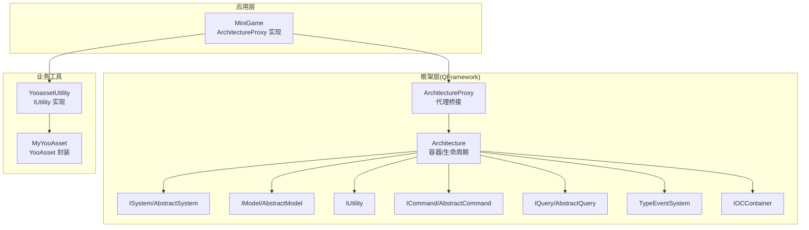
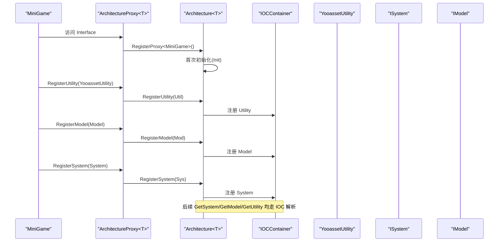
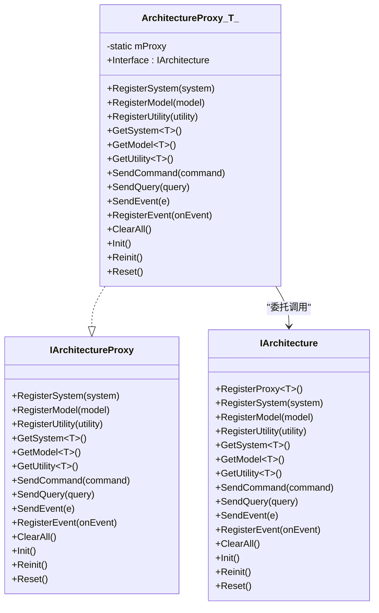
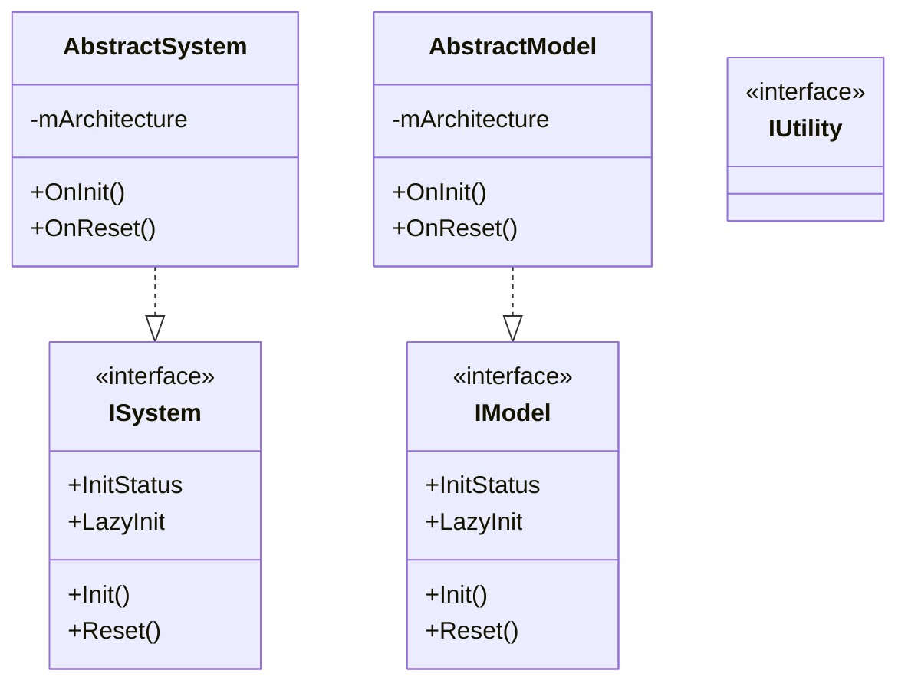
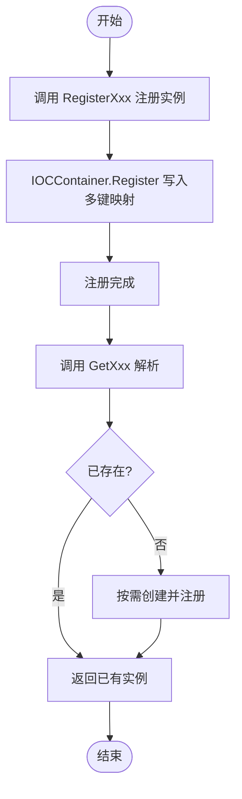
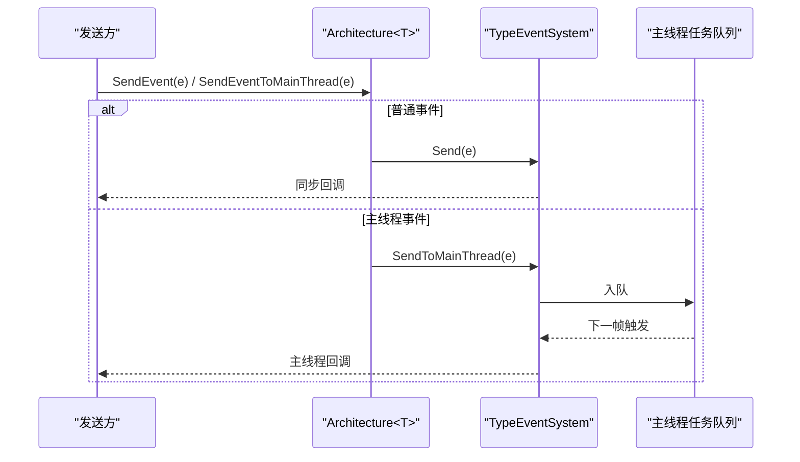
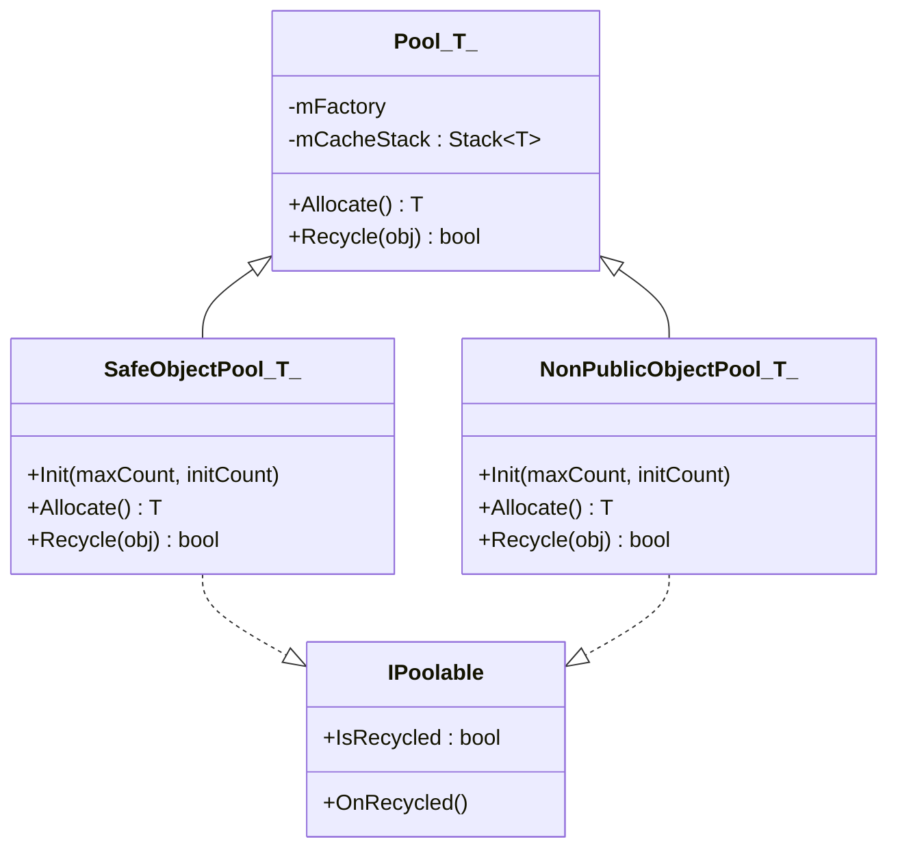
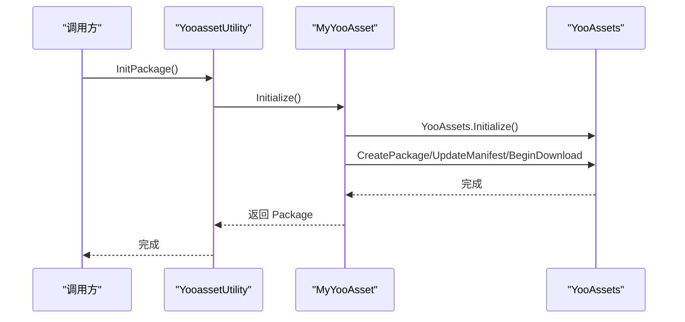
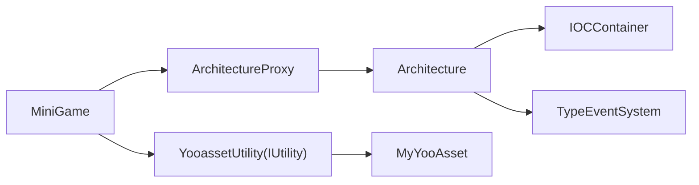

# 架构设计

<cite>
**本文引用的文件**
- [MiniGame.cs](file://Assets/Game/Scripts/MiniGame_Scripts/MiniGame.cs)
- [ArchitectureProxy.cs](file://Assets/Game/Framework/Qframework/Runtime/Moyv/Proxies/ArchitectureProxy.cs)
- [QFramework.cs](file://Assets/Game/Framework/Qframework/Runtime/QFramework.cs)
- [IOCKit.cs](file://Assets/Game/Framework/Qframework/Toolkits/_CoreKit/IOCKit/IOCKit.cs)
- [PoolKit.cs](file://Assets/Game/Framework/Qframework/Runtime/Toolkits/PoolKit.cs)
- [YooassetUtility.cs](file://Assets/Game/Scripts/MiniGame_Scripts/Utility/YooassetUtility.cs)
- [MyYooAsset.cs](file://Assets/Game/Scripts/MiniGame_Scripts/Utility/MyYooAsset.cs)
</cite>

## 目录
1. [简介](#简介)
2. [项目结构](#项目结构)
3. [核心组件](#核心组件)
4. [架构总览](#架构总览)
5. [详细组件分析](#详细组件分析)
6. [依赖关系分析](#依赖关系分析)
7. [性能考量](#性能考量)
8. [故障排查指南](#故障排查指南)
9. [结论](#结论)
10. [附录：使用模式与最佳实践](#附录使用模式与最佳实践)

## 简介
本架构文档围绕 SimulationClient 项目的 QFramework 架构模式展开，重点说明 ArchitectureProxy 代理系统、System-Model-Utility 分层设计、依赖注入机制，以及事件系统、对象池、状态管理等跨领域关注点。文档提供系统上下文图与组件分解图，解释数据流向与集成模式，并给出实际代码示例路径以展示架构的使用模式和最佳实践。

## 项目结构
本项目采用基于 QFramework 的模块化分层组织方式：
- 应用入口与代理注册：MiniGame 作为 ArchitectureProxy 的具体实现，负责在 Init 中完成 Utility、Model、System 的注册。
- 框架层：QFramework 核心（Architecture、ISystem/IModel/IUtility、Command/Query、事件系统等）位于 Framework/Qframework/Runtime。
- 工具与基础设施：IOC 容器、对象池等位于 Toolkits 与 Runtime/Toolkits。
- 业务资源与第三方集成：YooAsset 相关封装位于 Scripts/MiniGame_Scripts/Utility。

图表来源
- [MiniGame.cs:1-30](file://Assets/Game/Scripts/MiniGame_Scripts/MiniGame.cs#L1-L30)
- [ArchitectureProxy.cs:53-197](file://Assets/Game/Framework/Qframework/Runtime/Moyv/Proxies/ArchitectureProxy.cs#L53-L197)
- [QFramework.cs:94-351](file://Assets/Game/Framework/Qframework/Runtime/QFramework.cs#L94-L351)
- [YooassetUtility.cs:1-121](file://Assets/Game/Scripts/MiniGame_Scripts/Utility/YooassetUtility.cs#L1-L121)
- [MyYooAsset.cs:1-82](file://Assets/Game/Scripts/MiniGame_Scripts/Utility/MyYooAsset.cs#L1-L82)

章节来源
- [MiniGame.cs:1-30](file://Assets/Game/Scripts/MiniGame_Scripts/MiniGame.cs#L1-L30)
- [ArchitectureProxy.cs:53-197](file://Assets/Game/Framework/Qframework/Runtime/Moyv/Proxies/ArchitectureProxy.cs#L53-L197)
- [QFramework.cs:94-351](file://Assets/Game/Framework/Qframework/Runtime/QFramework.cs#L94-L351)

## 核心组件
- ArchitectureProxy<T>：面向业务的统一入口，屏蔽底层 IArchitecture 细节，提供 Register/Get/Send 系列便捷方法，并在首次访问时触发具体 Proxy 的初始化。
- Architecture<T>：全局容器与生命周期管理，维护 System/Model/Utility 实例，处理命令/查询执行、事件分发、重置与清理。
- ISystem/IModel/IUtility：分层契约，分别承载逻辑、数据与通用能力；通过 IOC 容器进行注册与解析。
- Command/Query：请求-响应与查询抽象，便于将操作与数据访问解耦。
- TypeEventSystem：类型安全的事件总线，支持主线程派发与自动销毁绑定。
- IOCContainer：轻量级多键映射容器，支持接口到实现的注册与解析。

章节来源
- [ArchitectureProxy.cs:53-197](file://Assets/Game/Framework/Qframework/Runtime/Moyv/Proxies/ArchitectureProxy.cs#L53-L197)
- [QFramework.cs:94-351](file://Assets/Game/Framework/Qframework/Runtime/QFramework.cs#L94-L351)
- [QFramework.cs:422-509](file://Assets/Game/Framework/Qframework/Runtime/QFramework.cs#L422-L509)
- [QFramework.cs:512-589](file://Assets/Game/Framework/Qframework/Runtime/QFramework.cs#L512-L589)
- [QFramework.cs:716-800](file://Assets/Game/Framework/Qframework/Runtime/QFramework.cs#L716-L800)
- [QFramework.cs:934-978](file://Assets/Game/Framework/Qframework/Runtime/QFramework.cs#L934-L978)

## 架构总览
下图展示了从 MiniGame 启动到各层协作的整体流程，包括代理注册、容器初始化、Utility/Model/System 的装配与获取。

图表来源
- [MiniGame.cs:1-30](file://Assets/Game/Scripts/MiniGame_Scripts/MiniGame.cs#L1-L30)
- [ArchitectureProxy.cs:53-197](file://Assets/Game/Framework/Qframework/Runtime/Moyv/Proxies/ArchitectureProxy.cs#L53-L197)
- [QFramework.cs:94-351](file://Assets/Game/Framework/Qframework/Runtime/QFramework.cs#L94-L351)
- [QFramework.cs:934-978](file://Assets/Game/Framework/Qframework/Runtime/QFramework.cs#L934-L978)

## 详细组件分析

### ArchitectureProxy 代理系统
- 职责：为每个业务域提供独立的生命周期与作用域入口，对外暴露统一的 Register/Get/Send API，内部委托给 GameArchitecture.Interface。
- 关键行为：
  - 首次访问 Interface 时，向全局 Architecture 注册当前 Proxy 并触发其 Init。
  - 所有 Register/Get/Send 方法均转发至 IArchitecture，保持调用一致性。
- 适用场景：按模块或子系统划分作用域，避免全局耦合。

图表来源
- [ArchitectureProxy.cs:7-197](file://Assets/Game/Framework/Qframework/Runtime/Moyv/Proxies/ArchitectureProxy.cs#L7-L197)
- [QFramework.cs:45-92](file://Assets/Game/Framework/Qframework/Runtime/QFramework.cs#L45-L92)

章节来源
- [ArchitectureProxy.cs:53-197](file://Assets/Game/Framework/Qframework/Runtime/Moyv/Proxies/ArchitectureProxy.cs#L53-L197)

### System-Model-Utility 分层设计
- System：业务逻辑编排与协调，可访问 Model/Utility，发送事件与命令，具备 LazyInit 与 Reset 生命周期。
- Model：领域数据与状态，持有持久化或运行时数据，支持事件发布。
- Utility：无状态的通用能力封装（如资源加载、网络、配置），通过 IOC 注册后由任意组件获取。

图表来源
- [QFramework.cs:422-509](file://Assets/Game/Framework/Qframework/Runtime/QFramework.cs#L422-L509)

章节来源
- [QFramework.cs:422-509](file://Assets/Game/Framework/Qframework/Runtime/QFramework.cs#L422-L509)

### 依赖注入机制（IOC）
- IOCContainer 使用多键字典同时支持“类型”和“接口”映射，避免重复注册冲突，并提供 Resolve/ResolveRelation 等扩展能力。
- Architecture<T> 在 RegisterSystem/RegisterModel/RegisterUtility 时将实例写入容器，并通过 GetXxx 进行解析与懒初始化。

图表来源
- [QFramework.cs:934-978](file://Assets/Game/Framework/Qframework/Runtime/QFramework.cs#L934-L978)
- [QFramework.cs:206-306](file://Assets/Game/Framework/Qframework/Runtime/QFramework.cs#L206-L306)

章节来源
- [QFramework.cs:934-978](file://Assets/Game/Framework/Qframework/Runtime/QFramework.cs#L934-L978)
- [QFramework.cs:206-306](file://Assets/Game/Framework/Qframework/Runtime/QFramework.cs#L206-L306)

### 事件系统与主线程调度
- TypeEventSystem 提供 Send/SendToMainThread/注册/反注册能力，结合 Unregister 列表可在对象销毁时自动清理。
- Architecture<T> 在多线程模式下每帧调度 HandleMainThreadEvents，确保事件在主线程执行。

图表来源
- [QFramework.cs:334-348](file://Assets/Game/Framework/Qframework/Runtime/QFramework.cs#L334-L348)
- [QFramework.cs:126-137](file://Assets/Game/Framework/Qframework/Runtime/QFramework.cs#L126-L137)

章节来源
- [QFramework.cs:334-348](file://Assets/Game/Framework/Qframework/Runtime/QFramework.cs#L334-L348)
- [QFramework.cs:126-137](file://Assets/Game/Framework/Qframework/Runtime/QFramework.cs#L126-L137)

### 对象池与内存优化
- PoolKit 提供 SafeObjectPool/NonPublicObjectPool 等泛型对象池，支持最大缓存数、预分配与回收钩子 OnRecycled。
- 适用于高频创建/销毁的对象（如临时数据结构、动作回调等），降低 GC 压力。

图表来源
- [PoolKit.cs:53-377](file://Assets/Game/Framework/Qframework/Runtime/Toolkits/PoolKit.cs#L53-L377)

章节来源
- [PoolKit.cs:53-377](file://Assets/Game/Framework/Qframework/Runtime/Toolkits/PoolKit.cs#L53-L377)

### 资源加载集成（YooAsset）
- YooassetUtility 作为 IUtility 实现，封装 YooAsset 的包初始化、清单更新、下载与卸载流程，提供异步接口供上层调用。
- MyYooAsset 进一步封装具体初始化步骤（包创建、版本更新、清单拉取、下载器创建与清理）。

图表来源
- [YooassetUtility.cs:1-121](file://Assets/Game/Scripts/MiniGame_Scripts/Utility/YooassetUtility.cs#L1-L121)
- [MyYooAsset.cs:1-82](file://Assets/Game/Scripts/MiniGame_Scripts/Utility/MyYooAsset.cs#L1-L82)

章节来源
- [YooassetUtility.cs:1-121](file://Assets/Game/Scripts/MiniGame_Scripts/Utility/YooassetUtility.cs#L1-L121)
- [MyYooAsset.cs:1-82](file://Assets/Game/Scripts/MiniGame_Scripts/Utility/MyYooAsset.cs#L1-L82)

## 依赖关系分析
- 松耦合：业务通过 ArchitectureProxy 访问框架能力，不直接依赖具体实现。
- 内聚性：System/Model/Utility 各自职责清晰，通过 IOC 容器进行装配。
- 外部依赖：YooAsset 通过 Utility 层隔离，便于替换或切换资源方案。

图表来源
- [MiniGame.cs:1-30](file://Assets/Game/Scripts/MiniGame_Scripts/MiniGame.cs#L1-L30)
- [ArchitectureProxy.cs:53-197](file://Assets/Game/Framework/Qframework/Runtime/Moyv/Proxies/ArchitectureProxy.cs#L53-L197)
- [QFramework.cs:94-351](file://Assets/Game/Framework/Qframework/Runtime/QFramework.cs#L94-L351)
- [YooassetUtility.cs:1-121](file://Assets/Game/Scripts/MiniGame_Scripts/Utility/YooassetUtility.cs#L1-L121)
- [MyYooAsset.cs:1-82](file://Assets/Game/Scripts/MiniGame_Scripts/Utility/MyYooAsset.cs#L1-L82)

章节来源
- [MiniGame.cs:1-30](file://Assets/Game/Scripts/MiniGame_Scripts/MiniGame.cs#L1-L30)
- [ArchitectureProxy.cs:53-197](file://Assets/Game/Framework/Qframework/Runtime/Moyv/Proxies/ArchitectureProxy.cs#L53-L197)
- [QFramework.cs:94-351](file://Assets/Game/Framework/Qframework/Runtime/QFramework.cs#L94-L351)
- [YooassetUtility.cs:1-121](file://Assets/Game/Scripts/MiniGame_Scripts/Utility/YooassetUtility.cs#L1-L121)
- [MyYooAsset.cs:1-82](file://Assets/Game/Scripts/MiniGame_Scripts/Utility/MyYooAsset.cs#L1-L82)

## 性能考量
- 懒初始化：System/Model 支持 LazyInit，减少启动开销。
- 对象池：对频繁创建的对象使用 SafeObjectPool/NonPublicObjectPool，降低 GC 峰值。
- 事件批处理：多线程模式下集中处理主线程事件，避免逐帧散乱调度。
- 资源卸载：通过 YooassetUtility 提供的卸载接口，在场景切换或空闲时释放未引用资源。

[本节为通用指导，无需源码引用]

## 故障排查指南
- 组件未找到：检查是否在对应 Proxy 的 Init 中完成 Register；确认 GetXxx 的类型参数正确。
- 事件未触发：确认是否使用了 SendEventToMainThread 且主线程调度已启用；检查是否正确反注册。
- 资源加载失败：核对 YooassetUtility 的包名、服务器地址与版本号；查看 MyYooAsset 的初始化顺序与异常抛出位置。
- 内存泄漏：检查对象池是否正确 Recycle；确认事件与监听器的生命周期绑定。

章节来源
- [QFramework.cs:164-187](file://Assets/Game/Framework/Qframework/Runtime/QFramework.cs#L164-L187)
- [QFramework.cs:334-348](file://Assets/Game/Framework/Qframework/Runtime/QFramework.cs#L334-L348)
- [YooassetUtility.cs:96-121](file://Assets/Game/Scripts/MiniGame_Scripts/Utility/YooassetUtility.cs#L96-L121)

## 结论
SimulationClient 基于 QFramework 实现了清晰的 System-Model-Utility 分层与 ArchitectureProxy 代理体系，配合 IOC 容器与事件系统，达到高内聚、低耦合与易扩展的目标。通过对象池与资源卸载策略，项目在性能与稳定性方面具备良好的工程基础。建议持续完善各模块的边界定义与错误处理，逐步引入更多 Query 与 Command 以提升可测试性与可维护性。

[本节为总结，无需源码引用]

## 附录：使用模式与最佳实践
- 在 MiniGame.Init 中集中注册 Utility/Model/System，保持入口清晰。
- 优先使用 SendCommand/SendQuery 表达业务意图，避免直接耦合 System/Model。
- 使用 SendEventToMainThread 保证 UI 相关逻辑在主线程执行。
- 对热点对象使用对象池，并在 OnRecycled 中清理状态。
- 在场景切换或空闲时机调用 YooassetUtility 的卸载接口，控制内存占用。

章节来源
- [MiniGame.cs:1-30](file://Assets/Game/Scripts/MiniGame_Scripts/MiniGame.cs#L1-L30)
- [QFramework.cs:308-332](file://Assets/Game/Framework/Qframework/Runtime/QFramework.cs#L308-L332)
- [QFramework.cs:334-348](file://Assets/Game/Framework/Qframework/Runtime/QFramework.cs#L334-L348)
- [PoolKit.cs:53-377](file://Assets/Game/Framework/Qframework/Runtime/Toolkits/PoolKit.cs#L53-L377)
- [YooassetUtility.cs:96-121](file://Assets/Game/Scripts/MiniGame_Scripts/Utility/YooassetUtility.cs#L96-L121)