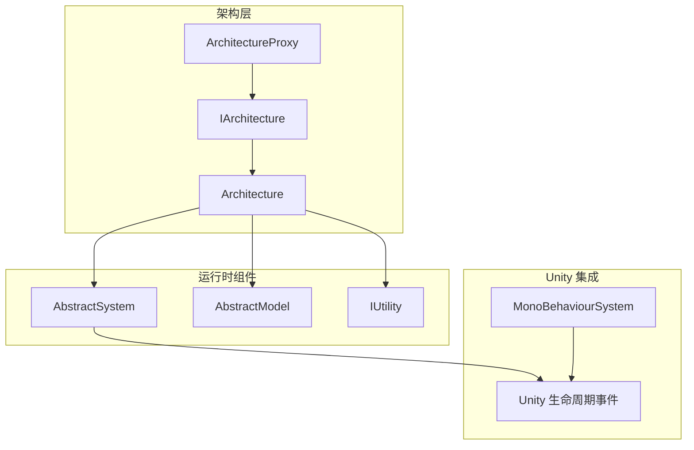
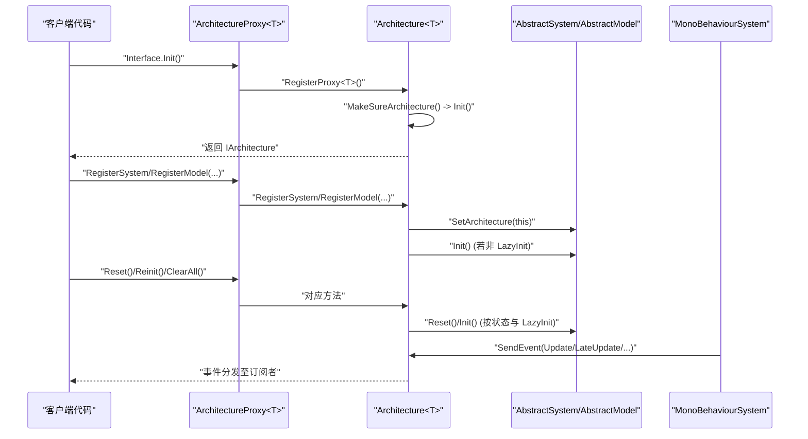
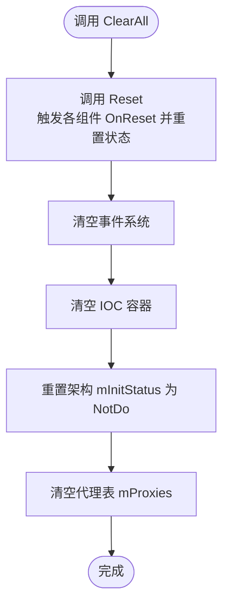
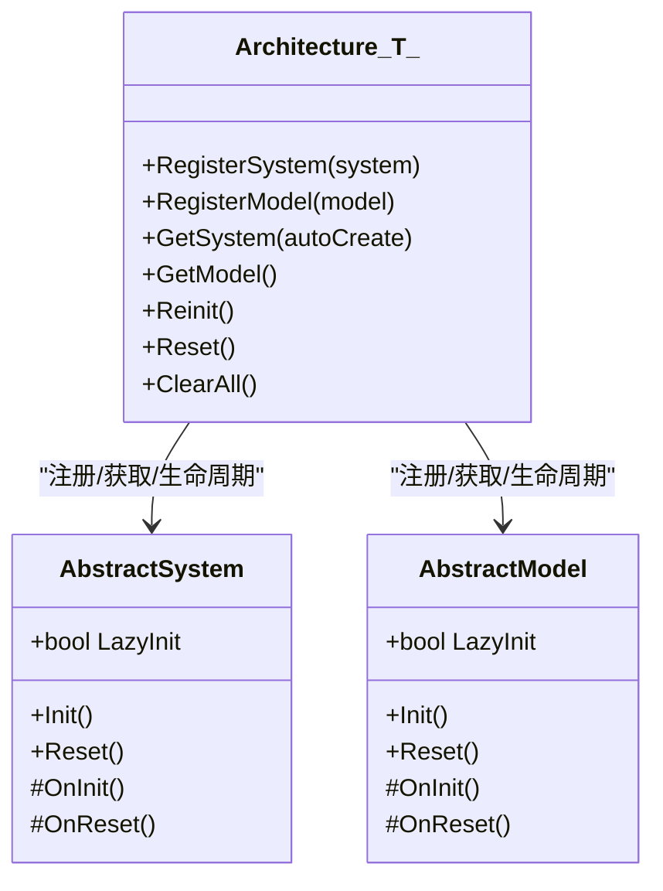
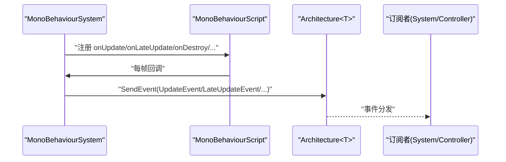
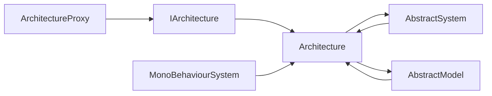

# 组件生命周期管理

<cite>
**本文引用的文件**   
- [QFramework.cs](file://Assets/Game/Framework/Qframework/Runtime/QFramework.cs)
- [ArchitectureProxy.cs](file://Assets/Game/Framework/Qframework/Runtime/Moyv/Proxies/ArchitectureProxy.cs)
- [MonoBehaviourSystem.cs](file://Assets/Game/Framework/Qframework/Runtime/Moyv/Systems/MonoBehaviourSystem.cs)
- [TestInitAndDeinit.cs](file://Assets/Game/Framework/Qframework/Tests/Runtime/TestInitAndDeinit.cs)
</cite>

## 目录
1. [简介](#简介)
2. [项目结构](#项目结构)
3. [核心组件](#核心组件)
4. [架构总览](#架构总览)
5. [详细组件分析](#详细组件分析)
6. [依赖关系分析](#依赖关系分析)
7. [性能考量](#性能考量)
8. [故障排查指南](#故障排查指南)
9. [结论](#结论)
10. [附录](#附录)

## 简介
本技术文档围绕组件生命周期管理系统，深入解析 ArchitectureProxy、System、Model 的初始化流程、依赖解析顺序与错误处理机制；说明 MonoBehaviourSystem 与 Unity 生命周期的集成方式；并提供组件注册、销毁与内存管理的最佳实践。同时给出生命周期钩子（如 Awake、Start、Update、OnDestroy）在系统中的正确调用时机与使用示例路径，解释多实例管理、对象池集成思路与性能优化策略。

## 项目结构
该生命周期系统基于 QFramework 的 Architecture 模式，核心由以下部分组成：
- 架构入口与容器：IArchitecture/Architecture<T> 负责全局单例、代理注册、System/Model/Utility 的注册与获取、事件分发以及生命周期方法 Reinit/Reset/ClearAll 的统一调度。
- 代理层：ArchitectureProxy<T> 提供静态 Interface 访问点，统一转发到 GameArchitecture.Interface，屏蔽底层实现细节。
- 系统与模型：AbstractSystem/AbstractModel 定义 Init/Reset 生命周期与 LazyInit 延迟初始化能力。
- Unity 生命周期桥接：MonoBehaviourSystem 将 Unity 的 Update/LateUpdate/OnDestroy/ApplicationPause/Focus/Quit 等事件转换为框架内事件，供 System/Controller 订阅。

图表来源
- [QFramework.cs:94-351](file://Assets/Game/Framework/Qframework/Runtime/QFramework.cs#L94-L351)
- [ArchitectureProxy.cs:53-197](file://Assets/Game/Framework/Qframework/Runtime/Moyv/Proxies/ArchitectureProxy.cs#L53-L197)
- [MonoBehaviourSystem.cs:7-186](file://Assets/Game/Framework/Qframework/Runtime/Moyv/Systems/MonoBehaviourSystem.cs#L7-L186)

章节来源
- [QFramework.cs:94-351](file://Assets/Game/Framework/Qframework/Runtime/QFramework.cs#L94-L351)
- [ArchitectureProxy.cs:53-197](file://Assets/Game/Framework/Qframework/Runtime/Moyv/Proxies/ArchitectureProxy.cs#L53-L197)
- [MonoBehaviourSystem.cs:7-186](file://Assets/Game/Framework/Qframework/Runtime/Moyv/Systems/MonoBehaviourSystem.cs#L7-L186)

## 核心组件
- IArchitecture/Architecture<T>
  - 职责：维护全局单例、代理字典、IOC 容器；提供 Register/Get 系列接口；统一触发 Reinit/Reset/ClearAll；事件分发与主线程事件调度。
  - 关键点：LazyInit 支持；InitStatus 状态机（NotDo/Doing/Did）；Reinit 仅对未初始化的组件进行 Init；Reset 对所有已初始化组件执行 Reset 并重置状态。
- ArchitectureProxy<T>
  - 职责：对外暴露静态 Interface，内部委托给 GameArchitecture.Interface；提供 Init/Reinit/Reset/ClearAll 的便捷入口。
- AbstractSystem/AbstractModel
  - 职责：封装 Init/Reset 生命周期；提供 LazyInit 开关；在 Reset 中回调 OnReset 并将状态置为 NotDo。
- MonoBehaviourSystem
  - 职责：创建或复用隐藏 GameObject 承载 MonoBehaviourScript；将 Unity 帧级与应用级事件转换为框架事件；提供 StartCoroutine/StopCoroutine 能力。

章节来源
- [QFramework.cs:94-351](file://Assets/Game/Framework/Qframework/Runtime/QFramework.cs#L94-L351)
- [ArchitectureProxy.cs:53-197](file://Assets/Game/Framework/Qframework/Runtime/Moyv/Proxies/ArchitectureProxy.cs#L53-L197)
- [MonoBehaviourSystem.cs:7-186](file://Assets/Game/Framework/Qframework/Runtime/Moyv/Systems/MonoBehaviourSystem.cs#L7-L186)

## 架构总览
下图展示从代理层到架构层再到具体 System/Model 的生命周期调用链，以及 Unity 事件如何进入系统。

图表来源
- [ArchitectureProxy.cs:57-67](file://Assets/Game/Framework/Qframework/Runtime/Moyv/Proxies/ArchitectureProxy.cs#L57-L67)
- [QFramework.cs:116-137](file://Assets/Game/Framework/Qframework/Runtime/QFramework.cs#L116-L137)
- [QFramework.cs:148-187](file://Assets/Game/Framework/Qframework/Runtime/QFramework.cs#L148-L187)
- [QFramework.cs:206-242](file://Assets/Game/Framework/Qframework/Runtime/QFramework.cs#L206-L242)
- [MonoBehaviourSystem.cs:79-111](file://Assets/Game/Framework/Qframework/Runtime/Moyv/Systems/MonoBehaviourSystem.cs#L79-L111)

## 详细组件分析

### ArchitectureProxy 生命周期方法
- Init
  - 作用：首次访问时通过静态 Interface 完成代理注册与架构初始化。
  - 执行时机：第一次访问 ArchitectureProxy<T>.Interface 时触发。
  - 注意：实际初始化逻辑在 Architecture<T>.MakeSureArchitecture 中完成。
- Reinit
  - 作用：在 Reset 之后重新初始化所有尚未初始化的 System/Model。
  - 执行时机：显式调用后，遍历未初始化的组件并调用其 Init。
- Reset
  - 作用：对所有已初始化（非 NotDo）的 System/Model 调用 Reset，清理状态并允许再次 Init。
  - 执行时机：场景切换、热重载、测试用例前后等需要“软重启”的场景。
- ClearAll
  - 作用：先 Reset，再清空事件与容器，最后重置架构初始化状态与代理表，达到“硬重启”。
  - 执行时机：应用退出、彻底重置、单元测试隔离环境。

图表来源
- [QFramework.cs:180-187](file://Assets/Game/Framework/Qframework/Runtime/QFramework.cs#L180-L187)
- [ArchitectureProxy.cs:193-196](file://Assets/Game/Framework/Qframework/Runtime/Moyv/Proxies/ArchitectureProxy.cs#L193-L196)

章节来源
- [ArchitectureProxy.cs:177-196](file://Assets/Game/Framework/Qframework/Runtime/Moyv/Proxies/ArchitectureProxy.cs#L177-L196)
- [QFramework.cs:148-187](file://Assets/Game/Framework/Qframework/Runtime/QFramework.cs#L148-L187)

### System 与 Model 的初始化流程与依赖解析
- 注册阶段
  - RegisterSystem/RegisterModel：设置 Architecture 引用，注册进容器；若非 LazyInit 则立即 Init。
- 获取阶段
  - GetSystem/GetModel：若存在且为 LazyInit 且未初始化，则在获取时触发 Init；否则直接返回。
- 依赖解析顺序
  - 无显式拓扑排序；建议将强依赖放在被依赖方先注册，或在 LazyInit 模式下按需加载。
- 错误处理
  - 当前实现未抛出异常；建议在 OnInit 中对必要依赖进行空引用检查并在日志中提示。

图表来源
- [QFramework.cs:206-242](file://Assets/Game/Framework/Qframework/Runtime/QFramework.cs#L206-L242)
- [QFramework.cs:429-500](file://Assets/Game/Framework/Qframework/Runtime/QFramework.cs#L429-L500)

章节来源
- [QFramework.cs:206-242](file://Assets/Game/Framework/Qframework/Runtime/QFramework.cs#L206-L242)
- [QFramework.cs:429-500](file://Assets/Game/Framework/Qframework/Runtime/QFramework.cs#L429-L500)

### MonoBehaviourSystem 与 Unity 生命周期集成
- 初始化
  - 查找现有 MonoBehaviourScript，不存在则创建隐藏 GameObject 并添加组件；注册 Unity 事件监听；启动帧末事件协程。
- 事件映射
  - Update/LateUpdate/OnDestroy/ApplicationPause/Focus/Quit 均转换为框架事件，供其他组件订阅。
- 协程支持
  - 提供 StartCoroutine/StopCoroutine 以统一管理协程生命周期。

图表来源
- [MonoBehaviourSystem.cs:79-111](file://Assets/Game/Framework/Qframework/Runtime/Moyv/Systems/MonoBehaviourSystem.cs#L79-L111)
- [MonoBehaviourSystem.cs:118-166](file://Assets/Game/Framework/Qframework/Runtime/Moyv/Systems/MonoBehaviourSystem.cs#L118-L166)

章节来源
- [MonoBehaviourSystem.cs:7-186](file://Assets/Game/Framework/Qframework/Runtime/Moyv/Systems/MonoBehaviourSystem.cs#L7-L186)

### 生命周期钩子调用时机与示例
- Awake/Start
  - 不在 QFramework 抽象层中直接暴露；可通过 MonoBehaviourSystem 提供的 Update/LateUpdate 事件替代；如需 Awake/Start 语义，可在自定义 System 的 OnInit 中模拟。
- Update/LateUpdate/OnDestroy
  - 通过订阅框架事件获得调用时机；示例见测试用例中的事件订阅与解绑。
- 示例路径
  - 事件订阅与重置解绑：[TestInitAndDeinit.cs:35-54](file://Assets/Game/Framework/Qframework/Tests/Runtime/TestInitAndDeinit.cs#L35-L54)
  - 懒加载 System/Model 的 Init 时机验证：[TestInitAndDeinit.cs:76-117](file://Assets/Game/Framework/Qframework/Tests/Runtime/TestInitAndDeinit.cs#L76-L117)
  - Reset/Reinit 行为断言：[TestInitAndDeinit.cs:127-196](file://Assets/Game/Framework/Qframework/Tests/Runtime/TestInitAndDeinit.cs#L127-L196)

章节来源
- [TestInitAndDeinit.cs:35-54](file://Assets/Game/Framework/Qframework/Tests/Runtime/TestInitAndDeinit.cs#L35-L54)
- [TestInitAndDeinit.cs:76-117](file://Assets/Game/Framework/Qframework/Tests/Runtime/TestInitAndDeinit.cs#L76-L117)
- [TestInitAndDeinit.cs:127-196](file://Assets/Game/Framework/Qframework/Tests/Runtime/TestInitAndDeinit.cs#L127-L196)

## 依赖关系分析
- 耦合与内聚
  - Architecture<T> 与 IOC 容器耦合，集中管理 System/Model/Utility 的创建与生命周期，内聚度高。
  - ArchitectureProxy<T> 作为门面，降低外部对架构实现的感知。
- 直接/间接依赖
  - System/Model 通过扩展方法间接依赖 Architecture<T>；MonoBehaviourSystem 依赖 Unity 生命周期并通过事件与 Architecture<T> 交互。
- 循环依赖风险
  - 避免在 OnInit 中相互强依赖；优先使用 LazyInit 与事件驱动。
- 外部依赖
  - Unity 引擎 API（GameObject、MonoBehaviour、Time、Application）。

图表来源
- [ArchitectureProxy.cs:53-197](file://Assets/Game/Framework/Qframework/Runtime/Moyv/Proxies/ArchitectureProxy.cs#L53-L197)
- [QFramework.cs:94-351](file://Assets/Game/Framework/Qframework/Runtime/QFramework.cs#L94-L351)
- [MonoBehaviourSystem.cs:7-186](file://Assets/Game/Framework/Qframework/Runtime/Moyv/Systems/MonoBehaviourSystem.cs#L7-L186)

章节来源
- [ArchitectureProxy.cs:53-197](file://Assets/Game/Framework/Qframework/Runtime/Moyv/Proxies/ArchitectureProxy.cs#L53-L197)
- [QFramework.cs:94-351](file://Assets/Game/Framework/Qframework/Runtime/QFramework.cs#L94-L351)
- [MonoBehaviourSystem.cs:7-186](file://Assets/Game/Framework/Qframework/Runtime/Moyv/Systems/MonoBehaviourSystem.cs#L7-L186)

## 性能考量
- 延迟初始化（LazyInit）
  - 对重型 System/Model 开启 LazyInit，按需加载，减少首帧开销。
- 事件分发
  - 大量事件订阅可能带来 GC 压力；建议使用 UnregisterList 或组件销毁自动解绑。
- 协程与帧任务
  - 合理使用 MonoBehaviourSystem 的协程与帧末事件，避免每帧分配对象。
- 容器与对象池
  - 结合 MPool 等对象池减少频繁创建/销毁；在 Reset/ClearAll 前归还对象。
- 主线程事件
  - 多线程事件需在主线程消费，避免跨线程访问 Unity API。

## 故障排查指南
- 常见问题
  - 重复订阅导致多次回调：确保在 OnReset 或 OnDestroy 中解绑事件。
  - 懒加载未触发：确认 LazyInit 标志与获取路径是否一致。
  - 资源泄漏：ClearAll 后仍持有旧引用；应更新引用或使用弱引用。
- 定位手段
  - 使用 Architecture<T> 的 GetAllSystems/GetAllModels 枚举当前实例。
  - 在测试用例中通过 Reset/Reinit/ClearAll 断言状态一致性。
- 参考路径
  - 事件订阅与解绑示例：[TestInitAndDeinit.cs:35-54](file://Assets/Game/Framework/Qframework/Tests/Runtime/TestInitAndDeinit.cs#L35-L54)
  - 重置与重初始化断言：[TestInitAndDeinit.cs:127-196](file://Assets/Game/Framework/Qframework/Tests/Runtime/TestInitAndDeinit.cs#L127-L196)

章节来源
- [TestInitAndDeinit.cs:35-54](file://Assets/Game/Framework/Qframework/Tests/Runtime/TestInitAndDeinit.cs#L35-L54)
- [TestInitAndDeinit.cs:127-196](file://Assets/Game/Framework/Qframework/Tests/Runtime/TestInitAndDeinit.cs#L127-L196)

## 结论
本生命周期系统通过 Architecture<T> 统一管控 System/Model 的注册、获取与生命周期，配合 ArchitectureProxy<T> 提供简洁的访问入口；MonoBehaviourSystem 将 Unity 生命周期无缝接入事件总线，形成松耦合的架构。借助 LazyInit、Reset/Reinit/ClearAll 的组合，可实现灵活的模块化管理与良好的可测试性。遵循本文的最佳实践与性能建议，可有效提升系统的稳定性与运行效率。

## 附录
- 多实例管理
  - 通过 IOC 容器控制单例或多实例；必要时为不同场景/子系统创建独立 Architecture 实例。
- 对象池集成
  - 在 OnInit 中初始化池，在 OnReset 中回收；避免在高频路径中 new。
- 最佳实践清单
  - 在 OnInit 中完成依赖注入与资源准备；在 OnReset 中释放资源与解绑事件。
  - 对重型模块启用 LazyInit；对关键路径避免每帧分配。
  - 使用 ClearAll 进行彻底重置；使用 Reinit 进行软重启。
  - 利用 MonoBehaviourSystem 的事件与协程能力，保持与 Unity 生命周期一致。