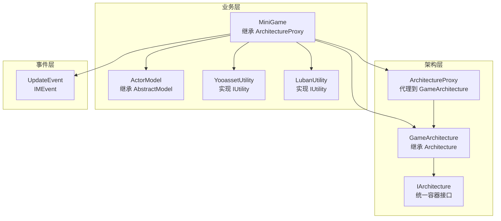
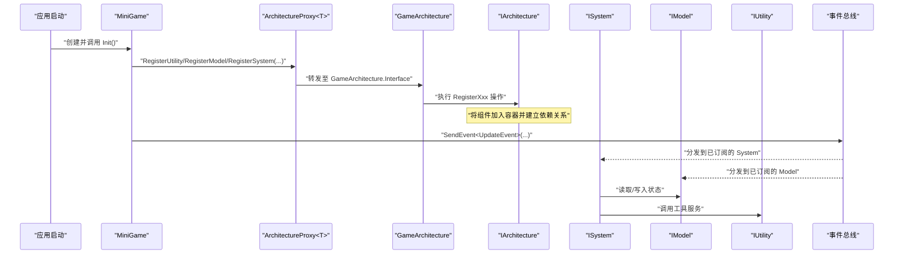
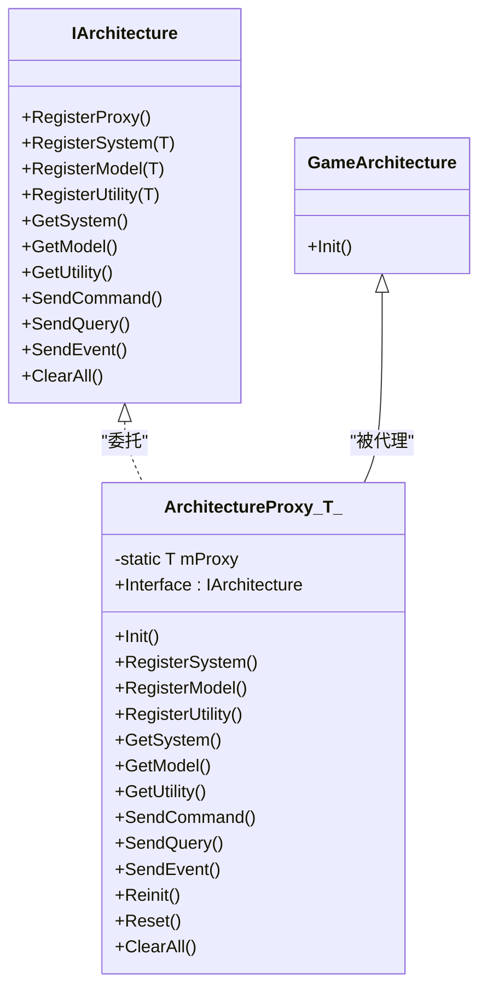
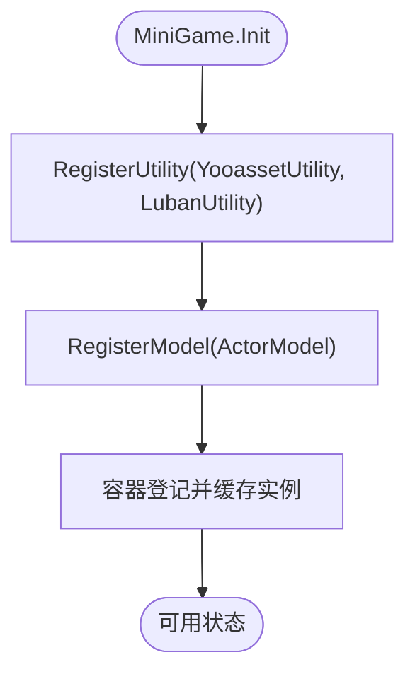
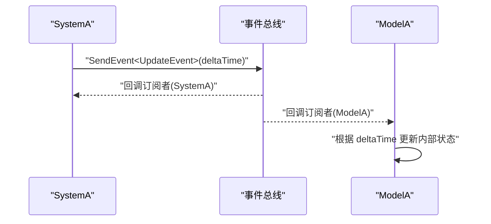
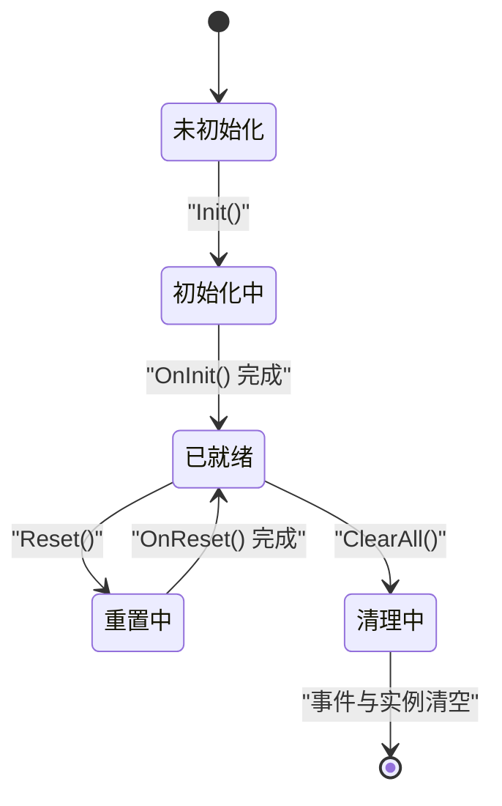
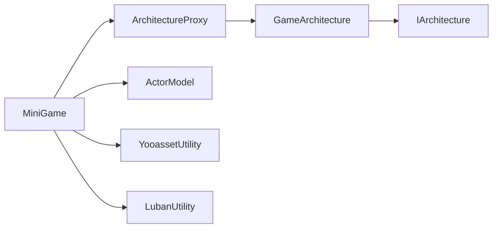

# QFramework 集成系统

<cite>
**本文引用的文件**
- [ArchitectureProxy.cs](file://Assets/Game/Framework/Qframework/Runtime/Moyv/Proxies/ArchitectureProxy.cs)
- [GameArchitecture.cs](file://Assets/Game/Framework/Qframework/Runtime/Moyv/Proxies/GameArchitecture.cs)
- [QFramework.cs](file://Assets/Game/Framework/Qframework/Runtime/QFramework.cs)
- [MiniGame.cs](file://Assets/Game/Scripts/MiniGame_Scripts/MiniGame.cs)
- [ActorModel.cs](file://Assets/Game/Scripts/MiniGame_Scripts/Model/ActorModel.cs)
- [YooassetUtility.cs](file://Assets/Game/Scripts/MiniGame_Scripts/Utility/YooassetUtility.cs)
- [LubanUtility.cs](file://Assets/Game/Scripts/MiniGame_Scripts/Utility/LubanUtility.cs)
- [UpdateEvent.cs](file://Assets/Game/Framework/Qframework/Runtime/Moyv/Events/UpdateEvent.cs)
- [TestArchitectureProxy.cs](file://Assets/Game/Framework/Qframework/Tests/Runtime/TestArchitectureProxy.cs)
</cite>

## 目录
1. [简介](#简介)
2. [项目结构](#项目结构)
3. [核心组件](#核心组件)
4. [架构总览](#架构总览)
5. [详细组件分析](#详细组件分析)
6. [依赖关系分析](#依赖关系分析)
7. [性能与优化](#性能与优化)
8. [故障排查指南](#故障排查指南)
9. [结论](#结论)
10. [附录：扩展指南与最佳实践](#附录扩展指南与最佳实践)

## 简介
本文件面向 SimulationClient 的 QFramework 集成系统，系统性阐述基于 QFramework 的模块化架构设计。内容涵盖 ArchitectureProxy 架构代理模式、System-Model-Utility 分层架构、依赖注入机制、事件系统（如 UpdateEvent）的集成与使用、组件生命周期管理、资源清理策略、与现有框架组件的集成方式与兼容性考虑，以及最佳实践、性能优化与调试工具使用。文档同时为初学者提供入门指引，并为有经验的开发者提供深度定制与扩展的高级指南。

## 项目结构
本项目在 Unity 工程中以“业务脚本 + 框架代码”的方式组织：
- 业务入口与模块注册位于 Scripts/MiniGame_Scripts 下，通过 MiniGame 继承 ArchitectureProxy 完成初始化与组件注册。
- 框架核心位于 Framework/Qframework/Runtime，包含 IArchitecture、AbstractModel、AbstractCommand、AbstractQuery 等基础抽象与接口定义。
- 自定义事件位于 Framework/Qframework/.../Moyv/Events，例如 UpdateEvent。
- 测试用例位于 Framework/Qframework/Tests，用于验证代理注册与获取行为。

图表来源
- [MiniGame.cs:1-30](file://Assets/Game/Scripts/MiniGame_Scripts/MiniGame.cs#L1-L30)
- [ArchitectureProxy.cs:1-197](file://Assets/Game/Framework/Qframework/Runtime/Moyv/Proxies/ArchitectureProxy.cs#L1-L197)
- [GameArchitecture.cs:1-10](file://Assets/Game/Framework/Qframework/Runtime/Moyv/Proxies/GameArchitecture.cs#L1-L10)
- [QFramework.cs:465-500](file://Assets/Game/Framework/Qframework/Runtime/QFramework.cs#L465-L500)
- [UpdateEvent.cs:1-7](file://Assets/Game/Framework/Qframework/Runtime/Moyv/Events/UpdateEvent.cs#L1-L7)

章节来源
- [MiniGame.cs:1-30](file://Assets/Game/Scripts/MiniGame_Scripts/MiniGame.cs#L1-L30)
- [ArchitectureProxy.cs:1-197](file://Assets/Game/Framework/Qframework/Runtime/Moyv/Proxies/ArchitectureProxy.cs#L1-L197)
- [GameArchitecture.cs:1-10](file://Assets/Game/Framework/Qframework/Runtime/Moyv/Proxies/GameArchitecture.cs#L1-L10)
- [QFramework.cs:465-500](file://Assets/Game/Framework/Qframework/Runtime/QFramework.cs#L465-L500)
- [UpdateEvent.cs:1-7](file://Assets/Game/Framework/Qframework/Runtime/Moyv/Events/UpdateEvent.cs#L1-L7)

## 核心组件
- ArchitectureProxy<T>：统一的架构代理，封装对底层容器的注册、查询、命令/查询发送、事件订阅与生命周期管理调用，对外暴露简洁 API。
- GameArchitecture：具体架构实例，承载所有 System/Model/Utility 的容器与调度逻辑。
- IArchitecture：容器能力契约，包括注册、获取、命令/查询、事件、重置与清理等。
- AbstractModel：模型基类，提供 Init/Reset 生命周期钩子与状态机，支持延迟初始化与日志记录。
- UpdateEvent：内置帧更新事件，携带 deltaTime，便于在系统中进行每帧处理。

章节来源
- [ArchitectureProxy.cs:1-197](file://Assets/Game/Framework/Qframework/Runtime/Moyv/Proxies/ArchitectureProxy.cs#L1-L197)
- [GameArchitecture.cs:1-10](file://Assets/Game/Framework/Qframework/Runtime/Moyv/Proxies/GameArchitecture.cs#L1-L10)
- [QFramework.cs:465-500](file://Assets/Game/Framework/Qframework/Runtime/QFramework.cs#L465-L500)
- [UpdateEvent.cs:1-7](file://Assets/Game/Framework/Qframework/Runtime/Moyv/Events/UpdateEvent.cs#L1-L7)

## 架构总览
下图展示了从业务入口到架构容器的事件与数据流：

图表来源
- [MiniGame.cs:1-30](file://Assets/Game/Scripts/MiniGame_Scripts/MiniGame.cs#L1-L30)
- [ArchitectureProxy.cs:1-197](file://Assets/Game/Framework/Qframework/Runtime/Moyv/Proxies/ArchitectureProxy.cs#L1-L197)
- [QFramework.cs:465-500](file://Assets/Game/Framework/Qframework/Runtime/QFramework.cs#L465-L500)
- [UpdateEvent.cs:1-7](file://Assets/Game/Framework/Qframework/Runtime/Moyv/Events/UpdateEvent.cs#L1-L7)

## 详细组件分析

### 架构代理与容器（ArchitectureProxy 与 GameArchitecture）
- ArchitectureProxy<T> 作为门面，屏蔽底层容器细节，提供注册、获取、命令/查询、事件、重置与清理的统一入口。
- GameArchitecture 是实际承载容器与调度的单例式架构实例，所有代理方法最终委托给其 Interface。
- 通过静态 Interface 属性，首次访问时自动完成当前 Proxy 类型的注册，确保后续可跨代理访问同一容器中的组件。

图表来源
- [ArchitectureProxy.cs:1-197](file://Assets/Game/Framework/Qframework/Runtime/Moyv/Proxies/ArchitectureProxy.cs#L1-L197)
- [GameArchitecture.cs:1-10](file://Assets/Game/Framework/Qframework/Runtime/Moyv/Proxies/GameArchitecture.cs#L1-L10)
- [QFramework.cs:465-500](file://Assets/Game/Framework/Qframework/Runtime/QFramework.cs#L465-L500)

章节来源
- [ArchitectureProxy.cs:1-197](file://Assets/Game/Framework/Qframework/Runtime/Moyv/Proxies/ArchitectureProxy.cs#L1-L197)
- [GameArchitecture.cs:1-10](file://Assets/Game/Framework/Qframework/Runtime/Moyv/Proxies/GameArchitecture.cs#L1-L10)

### 模型与工具（Model 与 Utility）
- ActorModel：示例模型，继承 AbstractModel，遵循 OnInit/OnReset 生命周期。
- YooassetUtility / LubanUtility：示例工具，实现 IUtility，提供资源加载与配置解析等通用能力。
- 注册流程：在 MiniGame.Init 中集中调用 RegisterModel 与 RegisterUtility，随后由容器统一管理生命周期与依赖。

图表来源
- [MiniGame.cs:1-30](file://Assets/Game/Scripts/MiniGame_Scripts/MiniGame.cs#L1-L30)
- [QFramework.cs:465-500](file://Assets/Game/Framework/Qframework/Runtime/QFramework.cs#L465-L500)

章节来源
- [MiniGame.cs:1-30](file://Assets/Game/Scripts/MiniGame_Scripts/MiniGame.cs#L1-L30)
- [ActorModel.cs](file://Assets/Game/Scripts/MiniGame_Scripts/Model/ActorModel.cs)
- [YooassetUtility.cs](file://Assets/Game/Scripts/MiniGame_Scripts/Utility/YooassetUtility.cs)
- [LubanUtility.cs](file://Assets/Game/Scripts/MiniGame_Scripts/Utility/LubanUtility.cs)
- [QFramework.cs:465-500](file://Assets/Game/Framework/Qframework/Runtime/QFramework.cs#L465-L500)

### 事件系统（UpdateEvent 与事件分发）
- UpdateEvent：携带 deltaTime 的帧更新事件，适合在 System/Model 中订阅以执行周期性逻辑。
- 事件发送：可通过 ArchitectureProxy 或 IArchitecture 提供的 SendEvent/SendEventToMainThread 等方法触发。
- 事件订阅：建议使用返回的 IUnRegister 对象在合适时机取消订阅，避免内存泄漏。

图表来源
- [UpdateEvent.cs:1-7](file://Assets/Game/Framework/Qframework/Runtime/Moyv/Events/UpdateEvent.cs#L1-L7)
- [ArchitectureProxy.cs:1-197](file://Assets/Game/Framework/Qframework/Runtime/Moyv/Proxies/ArchitectureProxy.cs#L1-L197)

章节来源
- [UpdateEvent.cs:1-7](file://Assets/Game/Framework/Qframework/Runtime/Moyv/Events/UpdateEvent.cs#L1-L7)
- [ArchitectureProxy.cs:1-197](file://Assets/Game/Framework/Qframework/Runtime/Moyv/Proxies/ArchitectureProxy.cs#L1-L197)

### 生命周期管理与资源清理
- 初始化：ArchitectureProxy.Reinit 会重启所有 System 和 Model；每个组件的 Init 由容器在注册后触发。
- 重置：ArchitectureProxy.Reset 会调用各组件 Reset，清空状态并恢复初始值。
- 清理：ArchitectureProxy.ClearAll 会清空所有事件与实例，适用于场景切换或热重载后的环境复位。
- 建议：在 OnReset 中释放引用、清空集合、注销事件，避免残留引用导致内存泄漏。

图表来源
- [ArchitectureProxy.cs:1-197](file://Assets/Game/Framework/Qframework/Runtime/Moyv/Proxies/ArchitectureProxy.cs#L1-L197)
- [QFramework.cs:465-500](file://Assets/Game/Framework/Qframework/Runtime/QFramework.cs#L465-L500)

章节来源
- [ArchitectureProxy.cs:1-197](file://Assets/Game/Framework/Qframework/Runtime/Moyv/Proxies/ArchitectureProxy.cs#L1-L197)
- [QFramework.cs:465-500](file://Assets/Game/Framework/Qframework/Runtime/QFramework.cs#L465-L500)

## 依赖关系分析
- 低耦合：业务层仅依赖 ArchitectureProxy 提供的统一接口，不直接耦合容器实现。
- 高内聚：System/Model/Utility 各自职责清晰，通过容器进行解耦通信。
- 外部依赖：YooassetUtility 与 LubanUtility 分别对接资源系统与配置系统，属于横向工具层。

图表来源
- [MiniGame.cs:1-30](file://Assets/Game/Scripts/MiniGame_Scripts/MiniGame.cs#L1-L30)
- [ArchitectureProxy.cs:1-197](file://Assets/Game/Framework/Qframework/Runtime/Moyv/Proxies/ArchitectureProxy.cs#L1-L197)
- [GameArchitecture.cs:1-10](file://Assets/Game/Framework/Qframework/Runtime/Moyv/Proxies/GameArchitecture.cs#L1-L10)
- [QFramework.cs:465-500](file://Assets/Game/Framework/Qframework/Runtime/QFramework.cs#L465-L500)

章节来源
- [MiniGame.cs:1-30](file://Assets/Game/Scripts/MiniGame_Scripts/MiniGame.cs#L1-L30)
- [ArchitectureProxy.cs:1-197](file://Assets/Game/Framework/Qframework/Runtime/Moyv/Proxies/ArchitectureProxy.cs#L1-L197)
- [GameArchitecture.cs:1-10](file://Assets/Game/Framework/Qframework/Runtime/Moyv/Proxies/GameArchitecture.cs#L1-L10)
- [QFramework.cs:465-500](file://Assets/Game/Framework/Qframework/Runtime/QFramework.cs#L465-L500)

## 性能与优化
- 延迟初始化：利用模型的 LazyInit 特性按需加载，减少首帧压力。
- 批量事件：合并多帧内的细粒度事件，降低事件分发开销。
- 对象池：对频繁创建销毁的对象使用对象池，减少 GC 压力。
- 查询优先：读多写少的场景优先使用 Query 而非 Command，避免不必要的副作用。
- 主线程安全：涉及 UI 的操作通过 SendEventToMainThread 切换到主线程执行，避免跨线程异常。

[本节为通用指导，无需源码引用]

## 故障排查指南
- 组件冲突：重复注册同类型组件可能导致覆盖或异常。建议在 Init 阶段集中注册，并使用 ClearAll 重置后再重新初始化。
- 内存泄漏：未正确取消事件订阅或未在 OnReset 中释放引用会导致泄漏。务必保存 IUnRegister 并在适当时机释放。
- 性能瓶颈：大量同步 IO 或重型计算放在主线程会导致卡顿。应拆分任务或使用协程/后台线程配合主线程回调。
- 调试技巧：结合单元测试验证注册与获取行为，参考测试用例路径进行回归验证。

章节来源
- [TestArchitectureProxy.cs:1-115](file://Assets/Game/Framework/Qframework/Tests/Runtime/TestArchitectureProxy.cs#L1-L115)

## 结论
SimulationClient 基于 QFramework 的 ArchitectureProxy 与 GameArchitecture 实现了清晰的 System-Model-Utility 分层架构，并通过统一的事件与命令/查询机制达成松耦合与高内聚。借助生命周期管理与资源清理策略，可有效控制内存与性能风险。对于复杂业务，建议遵循本文的最佳实践与扩展指南，逐步构建可扩展、可维护的系统。

[本节为总结性内容，无需源码引用]

## 附录：扩展指南与最佳实践

### 如何扩展新的 System
- 新建 System 类并继承 AbstractSystem（若需要）。
- 在 MiniGame.RegisterSystem 中调用 RegisterSystem(new YourSystem())。
- 在 OnInit 中完成依赖获取与订阅，在 OnReset 中清理状态与订阅。

章节来源
- [MiniGame.cs:1-30](file://Assets/Game/Scripts/MiniGame_Scripts/MiniGame.cs#L1-30)
- [ArchitectureProxy.cs:1-197](file://Assets/Game/Framework/Qframework/Runtime/Moyv/Proxies/ArchitectureProxy.cs#L1-197)

### 如何扩展新的 Model
- 新建 Model 类并继承 AbstractModel。
- 在 MiniGame.RegisterModel 中调用 RegisterModel(new YourModel())。
- 在 OnInit 中初始化数据源，在 OnReset 中清空数据与引用。

章节来源
- [MiniGame.cs:1-30](file://Assets/Game/Scripts/MiniGame_Scripts/MiniGame.cs#L1-30)
- [QFramework.cs:465-500](file://Assets/Game/Framework/Qframework/Runtime/QFramework.cs#L465-L500)

### 如何扩展新的 Utility
- 新建 Utility 类并实现 IUtility。
- 在 MiniGame.RegisterUtility 中调用 RegisterUtility(new YourUtility())。
- 在 System/Model 中通过 GetUtility<YourUtility>() 获取并使用。

章节来源
- [MiniGame.cs:1-30](file://Assets/Game/Scripts/MiniGame_Scripts/MiniGame.cs#L1-30)
- [ArchitectureProxy.cs:1-197](file://Assets/Game/Framework/Qframework/Runtime/Moyv/Proxies/ArchitectureProxy.cs#L1-197)

### 事件订阅与取消订阅最佳实践
- 使用 RegisterEvent 返回的 IUnRegister 保存句柄，在 OnDestroy/OnReset 中释放。
- 主线程相关操作使用 SendEventToMainThread，避免跨线程访问 UI。

章节来源
- [ArchitectureProxy.cs:1-197](file://Assets/Game/Framework/Qframework/Runtime/Moyv/Proxies/ArchitectureProxy.cs#L1-197)
- [UpdateEvent.cs:1-7](file://Assets/Game/Framework/Qframework/Runtime/Moyv/Events/UpdateEvent.cs#L1-L7)

### 与现有框架组件的集成与兼容性
- 保持与 IArchitecture 契约一致，避免绕过 ArchitectureProxy 直接操作容器。
- 对第三方库（如资源/配置系统）封装为 Utility，隔离变更影响面。
- 使用 ClearAll 与 Reinit 进行环境复位，确保多场景切换时的稳定性。

章节来源
- [ArchitectureProxy.cs:1-197](file://Assets/Game/Framework/Qframework/Runtime/Moyv/Proxies/ArchitectureProxy.cs#L1-197)
- [GameArchitecture.cs:1-10](file://Assets/Game/Framework/Qframework/Runtime/Moyv/Proxies/GameArchitecture.cs#L1-L10)