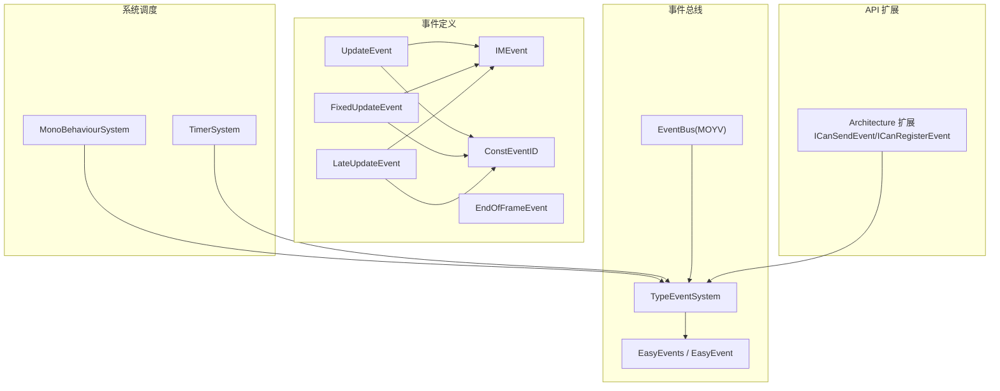
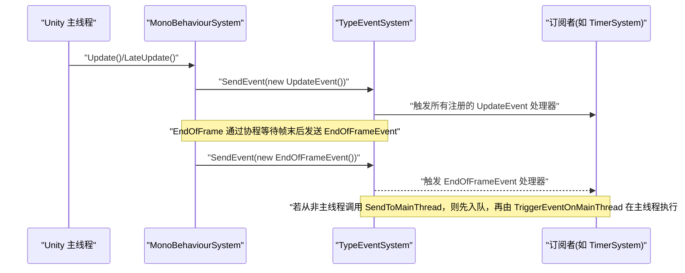
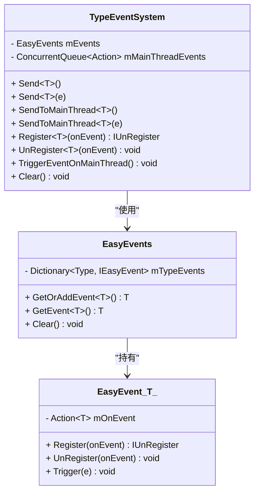
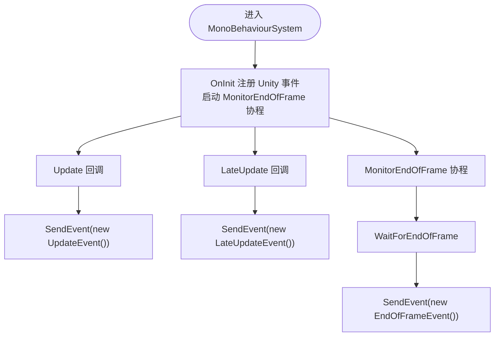
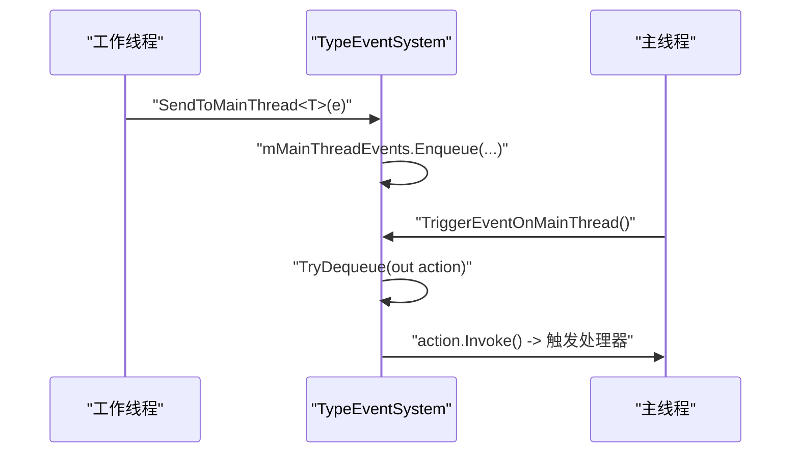
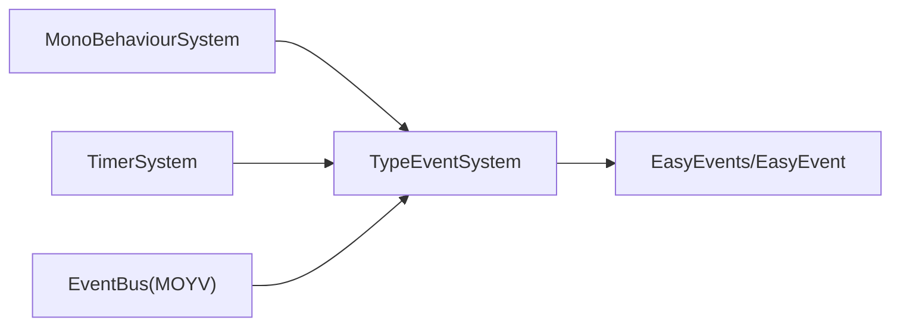

# 事件系统

<cite>
**本文引用的文件**   
- [QFramework.cs](file://Assets/Game/Framework/Qframework/Runtime/QFramework.cs)
- [EventBus.cs](file://Assets/Game/Framework/Qframework/Runtime/Moyv/EventBus.cs)
- [MonoBehaviourSystem.cs](file://Assets/Game/Framework/Qframework/Runtime/Moyv/Systems/MonoBehaviourSystem.cs)
- [TimerSystem.cs](file://Assets/Game/Framework/Qframework/Runtime/Moyv/Systems/TimerSystem.cs)
- [UpdateEvent.cs](file://Assets/Game/Framework/Qframework/Runtime/Moyv/Events/UpdateEvent.cs)
- [FixedUpdateEvent.cs](file://Assets/Game/Framework/Qframework/Runtime/Moyv/Events/FixedUpdateEvent.cs)
- [LateUpdateEvent.cs](file://Assets/Game/Framework/Qframework/Runtime/Moyv/Events/LateUpdateEvent.cs)
- [EndOfFrameEvent.cs](file://Assets/Game/Framework/Qframework/Runtime/Moyv/Events/EndOfFrameEvent.cs)
- [IMEvent.cs](file://Assets/Game/Framework/Qframework/Runtime/Moyv/Events/IMEvent.cs)
- [ConstEventID.cs](file://Assets/Game/Framework/Qframework/Runtime/Moyv/Events/ConstEventID.cs)
- [TestMultiThreadEvents.cs](file://Assets/Game/Framework/Qframework/Tests/Runtime/TestMultiThreadEvents.cs)
</cite>

## 目录
1. [简介](#简介)
2. [项目结构](#项目结构)
3. [核心组件](#核心组件)
4. [架构总览](#架构总览)
5. [详细组件分析](#详细组件分析)
6. [依赖关系分析](#依赖关系分析)
7. [性能考虑](#性能考虑)
8. [故障排查指南](#故障排查指南)
9. [结论](#结论)
10. [附录](#附录)

## 简介
本文件为 SimulationClient 中基于 QFramework 的类型安全事件系统的全面文档。重点覆盖：
- 内置帧事件类型：UpdateEvent、FixedUpdateEvent、LateUpdateEvent、EndOfFrameEvent 的实现与使用
- 发布订阅模式原理、线程安全机制与主线程集成
- SendEvent、SendEventToMainThread、RegisterEvent、UnRegisterEvent 等 API 的使用场景与参数说明
- 自定义事件类型与处理函数的创建方式
- 事件生命周期管理与自动清理机制
- 异步事件处理策略与 Unity 主线程协作
- 性能优化技巧与调试方法
- 常见问题：事件泄漏、循环引用、性能瓶颈的解决方案
- 面向初学者的事件驱动编程基础概念

## 项目结构
事件系统由“事件定义 + 事件总线 + 系统调度 + 扩展 API”四层组成，位于以下路径：
- 事件定义：Moyv/Events/*.cs（UpdateEvent、FixedUpdateEvent、LateUpdateEvent、EndOfFrameEvent、IMEvent、ConstEventID）
- 事件总线：Runtime/QFramework.cs（TypeEventSystem、EasyEvents/EasyEvent 系列）、Moyv/EventBus.cs
- 系统调度：Moyv/Systems/MonoBehaviourSystem.cs（将 Unity 生命周期转换为事件）、TimerSystem.cs（订阅 UpdateEvent 驱动任务）
- 扩展 API：Runtime/QFramework.cs（Architecture 及 ICanSendEvent/ICanRegisterEvent 扩展）

图表来源
- [QFramework.cs:874-909](file://Assets/Game/Framework/Qframework/Runtime/QFramework.cs#L874-L909)
- [EventBus.cs:1-52](file://Assets/Game/Framework/Qframework/Runtime/Moyv/EventBus.cs#L1-L52)
- [MonoBehaviourSystem.cs:118-186](file://Assets/Game/Framework/Qframework/Runtime/Moyv/Systems/MonoBehaviourSystem.cs#L118-L186)
- [TimerSystem.cs:118-146](file://Assets/Game/Framework/Qframework/Runtime/Moyv/Systems/TimerSystem.cs#L118-L146)
- [UpdateEvent.cs:1-7](file://Assets/Game/Framework/Qframework/Runtime/Moyv/Events/UpdateEvent.cs#L1-L7)
- [FixedUpdateEvent.cs:1-7](file://Assets/Game/Framework/Qframework/Runtime/Moyv/Events/FixedUpdateEvent.cs#L1-L7)
- [LateUpdateEvent.cs:1-7](file://Assets/Game/Framework/Qframework/Runtime/Moyv/Events/LateUpdateEvent.cs#L1-L7)
- [EndOfFrameEvent.cs:1-4](file://Assets/Game/Framework/Qframework/Runtime/Moyv/Events/EndOfFrameEvent.cs#L1-L4)
- [IMEvent.cs:1-4](file://Assets/Game/Framework/Qframework/Runtime/Moyv/Events/IMEvent.cs#L1-L4)
- [ConstEventID.cs:1-9](file://Assets/Game/Framework/Qframework/Runtime/Moyv/Events/ConstEventID.cs#L1-L9)

章节来源
- [QFramework.cs:874-909](file://Assets/Game/Framework/Qframework/Runtime/QFramework.cs#L874-L909)
- [EventBus.cs:1-52](file://Assets/Game/Framework/Qframework/Runtime/Moyv/EventBus.cs#L1-L52)
- [MonoBehaviourSystem.cs:118-186](file://Assets/Game/Framework/Qframework/Runtime/Moyv/Systems/MonoBehaviourSystem.cs#L118-L186)
- [TimerSystem.cs:118-146](file://Assets/Game/Framework/Qframework/Runtime/Moyv/Systems/TimerSystem.cs#L118-L146)
- [UpdateEvent.cs:1-7](file://Assets/Game/Framework/Qframework/Runtime/Moyv/Events/UpdateEvent.cs#L1-L7)
- [FixedUpdateEvent.cs:1-7](file://Assets/Game/Framework/Qframework/Runtime/Moyv/Events/FixedUpdateEvent.cs#L1-L7)
- [LateUpdateEvent.cs:1-7](file://Assets/Game/Framework/Qframework/Runtime/Moyv/Events/LateUpdateEvent.cs#L1-L7)
- [EndOfFrameEvent.cs:1-4](file://Assets/Game/Framework/Qframework/Runtime/Moyv/Events/EndOfFrameEvent.cs#L1-L4)
- [IMEvent.cs:1-4](file://Assets/Game/Framework/Qframework/Runtime/Moyv/Events/IMEvent.cs#L1-L4)
- [ConstEventID.cs:1-9](file://Assets/Game/Framework/Qframework/Runtime/Moyv/Events/ConstEventID.cs#L1-L9)

## 核心组件
- TypeEventSystem：类型安全事件的核心实现，提供 Send/SendToMainThread/Register/UnRegister/Clear 等方法；内部维护一个并发队列用于跨线程投递到主线程执行。
- EasyEvents/EasyEvent<T>：轻量级事件容器，按类型管理委托集合，支持 Register/UnRegister/Trigger。
- EventBus(MOYV)：对 TypeEventSystem 的简单封装，便于在 MOYV 模块内统一访问。
- MonoBehaviourSystem：桥接 Unity 生命周期（Update/LateUpdate/EndOfFrame），将 Unity 回调转化为事件发送。
- TimerSystem：订阅 UpdateEvent，驱动延迟、重复、逐帧任务。
- 事件类型：UpdateEvent、FixedUpdateEvent、LateUpdateEvent、EndOfFrameEvent 以及 IMEvent/ConstEventID。

章节来源
- [QFramework.cs:874-909](file://Assets/Game/Framework/Qframework/Runtime/QFramework.cs#L874-L909)
- [QFramework.cs:1127-1242](file://Assets/Game/Framework/Qframework/Runtime/QFramework.cs#L1127-L1242)
- [EventBus.cs:1-52](file://Assets/Game/Framework/Qframework/Runtime/Moyv/EventBus.cs#L1-L52)
- [MonoBehaviourSystem.cs:118-186](file://Assets/Game/Framework/Qframework/Runtime/Moyv/Systems/MonoBehaviourSystem.cs#L118-L186)
- [TimerSystem.cs:118-146](file://Assets/Game/Framework/Qframework/Runtime/Moyv/Systems/TimerSystem.cs#L118-L146)
- [UpdateEvent.cs:1-7](file://Assets/Game/Framework/Qframework/Runtime/Moyv/Events/UpdateEvent.cs#L1-L7)
- [FixedUpdateEvent.cs:1-7](file://Assets/Game/Framework/Qframework/Runtime/Moyv/Events/FixedUpdateEvent.cs#L1-L7)
- [LateUpdateEvent.cs:1-7](file://Assets/Game/Framework/Qframework/Runtime/Moyv/Events/LateUpdateEvent.cs#L1-L7)
- [EndOfFrameEvent.cs:1-4](file://Assets/Game/Framework/Qframework/Runtime/Moyv/Events/EndOfFrameEvent.cs#L1-L4)
- [IMEvent.cs:1-4](file://Assets/Game/Framework/Qframework/Runtime/Moyv/Events/IMEvent.cs#L1-L4)
- [ConstEventID.cs:1-9](file://Assets/Game/Framework/Qframework/Runtime/Moyv/Events/ConstEventID.cs#L1-L9)

## 架构总览
下图展示了从 Unity 生命周期到事件分发再到订阅者处理的完整流程，并体现主线程同步机制。

图表来源
- [MonoBehaviourSystem.cs:138-186](file://Assets/Game/Framework/Qframework/Runtime/Moyv/Systems/MonoBehaviourSystem.cs#L138-L186)
- [QFramework.cs:874-909](file://Assets/Game/Framework/Qframework/Runtime/QFramework.cs#L874-L909)

## 详细组件分析

### 类型安全事件核心：TypeEventSystem
- 职责
  - 按事件类型维护事件实例（EasyEvent<T>）
  - 提供 Send/SendToMainThread/Register/UnRegister/Clear 接口
  - 通过 ConcurrentQueue 实现跨线程安全的事件投递
- 关键特性
  - 线程安全：SendToMainThread 将触发动作入队，后续由 TriggerEventOnMainThread 在主线程出队执行
  - 全局单例：Global 静态实例便于全局访问
  - 内存友好：Lazy 初始化事件实例，Clear 可一次性释放

图表来源
- [QFramework.cs:874-909](file://Assets/Game/Framework/Qframework/Runtime/QFramework.cs#L874-L909)
- [QFramework.cs:1127-1242](file://Assets/Game/Framework/Qframework/Runtime/QFramework.cs#L1127-L1242)

章节来源
- [QFramework.cs:874-909](file://Assets/Game/Framework/Qframework/Runtime/QFramework.cs#L874-L909)
- [QFramework.cs:1127-1242](file://Assets/Game/Framework/Qframework/Runtime/QFramework.cs#L1127-L1242)

### 事件总线封装：EventBus(MOYV)
- 职责：对 TypeEventSystem 进行简单封装，提供 RegisterEvent/UnRegisterEvent/SendEvent 等便捷方法
- 特点：内部维护一个字典以键名获取或创建独立 EventBus 实例，便于多通道隔离

章节来源
- [EventBus.cs:1-52](file://Assets/Game/Framework/Qframework/Runtime/Moyv/EventBus.cs#L1-L52)

### Unity 生命周期到事件的桥接：MonoBehaviourSystem
- 职责：监听 Unity 的 Update/LateUpdate/EndOfFrame，构造对应事件并通过 Architecture 扩展发送
- 关键点：
  - Update/LateUpdate 直接发送 UpdateEvent/LateUpdateEvent
  - EndOfFrame 通过协程 WaitForEndOfFrame 等待帧末后发送 EndOfFrameEvent
  - 应用暂停/焦点/退出等也映射为相应事件

图表来源
- [MonoBehaviourSystem.cs:79-111](file://Assets/Game/Framework/Qframework/Runtime/Moyv/Systems/MonoBehaviourSystem.cs#L79-L111)
- [MonoBehaviourSystem.cs:138-186](file://Assets/Game/Framework/Qframework/Runtime/Moyv/Systems/MonoBehaviourSystem.cs#L138-L186)

章节来源
- [MonoBehaviourSystem.cs:79-111](file://Assets/Game/Framework/Qframework/Runtime/Moyv/Systems/MonoBehaviourSystem.cs#L79-L111)
- [MonoBehaviourSystem.cs:138-186](file://Assets/Game/Framework/Qframework/Runtime/Moyv/Systems/MonoBehaviourSystem.cs#L138-L186)

### 事件驱动的定时器：TimerSystem
- 职责：订阅 UpdateEvent，驱动 DelayTask/RepeatTask/FrameTask 的执行
- 生命周期：
  - OnInit 中 RegisterEvent<UpdateEvent>(OnUpdate)
  - OnReset 中清理任务并 UnRegisterEvent<UpdateEvent>(OnUpdate)

章节来源
- [TimerSystem.cs:118-146](file://Assets/Game/Framework/Qframework/Runtime/Moyv/Systems/TimerSystem.cs#L118-L146)
- [TimerSystem.cs:148-209](file://Assets/Game/Framework/Qframework/Runtime/Moyv/Systems/TimerSystem.cs#L148-L209)

### 内置事件类型与 ID
- UpdateEvent、FixedUpdateEvent、LateUpdateEvent：均实现 IMEvent，包含 EventID 与 deltaTime 字段
- EndOfFrameEvent：无数据负载的空事件
- ConstEventID：集中定义事件 ID 常量

章节来源
- [UpdateEvent.cs:1-7](file://Assets/Game/Framework/Qframework/Runtime/Moyv/Events/UpdateEvent.cs#L1-L7)
- [FixedUpdateEvent.cs:1-7](file://Assets/Game/Framework/Qframework/Runtime/Moyv/Events/FixedUpdateEvent.cs#L1-L7)
- [LateUpdateEvent.cs:1-7](file://Assets/Game/Framework/Qframework/Runtime/Moyv/Events/LateUpdateEvent.cs#L1-L7)
- [EndOfFrameEvent.cs:1-4](file://Assets/Game/Framework/Qframework/Runtime/Moyv/Events/EndOfFrameEvent.cs#L1-L4)
- [IMEvent.cs:1-4](file://Assets/Game/Framework/Qframework/Runtime/Moyv/Events/IMEvent.cs#L1-L4)
- [ConstEventID.cs:1-9](file://Assets/Game/Framework/Qframework/Runtime/Moyv/Events/ConstEventID.cs#L1-L9)

### API 详解：SendEvent、SendEventToMainThread、RegisterEvent、UnRegisterEvent
- SendEvent<T>() / SendEvent<T>(T e)
  - 用途：立即在当前线程触发指定类型的所有处理器
  - 适用：主线程逻辑、无需跨线程同步的场景
- SendEventToMainThread<T>() / SendEventToMainThread<T>(T e)
  - 用途：将触发动作入队，确保在主线程执行
  - 适用：从后台线程或异步任务中需要更新 UI/Unity 对象的场景
- RegisterEvent<T>(Action<T>)
  - 用途：注册事件处理器，返回 IUnRegister 以便自动清理
  - 建议：配合生命周期钩子或 IUnRegister 组合器使用
- UnRegisterEvent<T>(Action<T>)
  - 用途：显式注销处理器，避免泄漏
  - 建议：在对象销毁或场景切换时调用

章节来源
- [QFramework.cs:336-341](file://Assets/Game/Framework/Qframework/Runtime/QFramework.cs#L336-L341)
- [QFramework.cs:677-680](file://Assets/Game/Framework/Qframework/Runtime/QFramework.cs#L677-L680)
- [QFramework.cs:338-346](file://Assets/Game/Framework/Qframework/Runtime/QFramework.cs#L338-L346)
- [QFramework.cs:651-652](file://Assets/Game/Framework/Qframework/Runtime/QFramework.cs#L651-L652)

### 线程安全与主线程集成
- 线程安全
  - TypeEventSystem 内部使用 ConcurrentQueue 缓存待在主线程执行的动作
  - 非主线程调用 SendToMainThread 仅做入队操作，不直接触发处理器
- 主线程执行
  - 需要在主线程周期中调用 TriggerEventOnMainThread 以出队并执行
  - MonoBehaviourSystem 可作为合适的入口点（例如在 Update 中调用）

图表来源
- [QFramework.cs:874-909](file://Assets/Game/Framework/Qframework/Runtime/QFramework.cs#L874-L909)

章节来源
- [QFramework.cs:874-909](file://Assets/Game/Framework/Qframework/Runtime/QFramework.cs#L874-L909)

### 自定义事件类型与处理函数示例（路径指引）
- 定义事件类型
  - 参考路径：[UpdateEvent.cs:1-7](file://Assets/Game/Framework/Qframework/Runtime/Moyv/Events/UpdateEvent.cs#L1-L7)
  - 要点：struct 类型，实现 IMEvent，提供 EventID 与必要字段
- 注册处理器
  - 参考路径：[TimerSystem.cs:134](file://Assets/Game/Framework/Qframework/Runtime/Moyv/Systems/TimerSystem.cs#L134)
  - 要点：在系统初始化阶段 RegisterEvent<YourEvent>(Handler)
- 发送事件
  - 参考路径：[MonoBehaviourSystem.cs:138-146](file://Assets/Game/Framework/Qframework/Runtime/Moyv/Systems/MonoBehaviourSystem.cs#L138-L146)
  - 要点：SendEvent(new YourEvent())
- 注销处理器
  - 参考路径：[TimerSystem.cs:145](file://Assets/Game/Framework/Qframework/Runtime/Moyv/Systems/TimerSystem.cs#L145)
  - 要点：在系统重置或销毁时 UnRegisterEvent<YourEvent>(Handler)

章节来源
- [UpdateEvent.cs:1-7](file://Assets/Game/Framework/Qframework/Runtime/Moyv/Events/UpdateEvent.cs#L1-L7)
- [TimerSystem.cs:134](file://Assets/Game/Framework/Qframework/Runtime/Moyv/Systems/TimerSystem.cs#L134)
- [MonoBehaviourSystem.cs:138-146](file://Assets/Game/Framework/Qframework/Runtime/Moyv/Systems/MonoBehaviourSystem.cs#L138-L146)
- [TimerSystem.cs:145](file://Assets/Game/Framework/Qframework/Runtime/Moyv/Systems/TimerSystem.cs#L145)

### 事件生命周期管理与自动清理
- 推荐模式
  - 使用 Register 返回的 IUnRegister，结合场景卸载或对象销毁时机自动注销
  - 在系统 OnReset/OnDestroy 中显式 UnRegisterEvent
- 参考路径
  - 注册与返回 IUnRegister：[QFramework.cs:892](file://Assets/Game/Framework/Qframework/Runtime/QFramework.cs#L892)
  - 显式注销：[QFramework.cs:346](file://Assets/Game/Framework/Qframework/Runtime/QFramework.cs#L346)
  - 系统级清理：[TimerSystem.cs:137-146](file://Assets/Game/Framework/Qframework/Runtime/Moyv/Systems/TimerSystem.cs#L137-L146)

章节来源
- [QFramework.cs:892](file://Assets/Game/Framework/Qframework/Runtime/QFramework.cs#L892)
- [QFramework.cs:346](file://Assets/Game/Framework/Qframework/Runtime/QFramework.cs#L346)
- [TimerSystem.cs:137-146](file://Assets/Game/Framework/Qframework/Runtime/Moyv/Systems/TimerSystem.cs#L137-L146)

### 异步事件处理策略
- 从非主线程发送事件
  - 使用 SendEventToMainThread 将触发入队，避免跨线程访问 Unity 对象
- 测试用例参考
  - 多线程事件测试：[TestMultiThreadEvents.cs:1-53](file://Assets/Game/Framework/Qframework/Tests/Runtime/TestMultiThreadEvents.cs#L1-L53)

章节来源
- [TestMultiThreadEvents.cs:1-53](file://Assets/Game/Framework/Qframework/Tests/Runtime/TestMultiThreadEvents.cs#L1-L53)

## 依赖关系分析
- 松耦合：事件发布者与订阅者通过类型解耦，无需相互引用具体实现
- 低内聚：每个事件类型只关注自身数据，易扩展
- 外部依赖：Unity 生命周期由 MonoBehaviourSystem 桥接；计时与任务由 TimerSystem 消费 UpdateEvent

图表来源
- [MonoBehaviourSystem.cs:138-186](file://Assets/Game/Framework/Qframework/Runtime/Moyv/Systems/MonoBehaviourSystem.cs#L138-L186)
- [TimerSystem.cs:118-146](file://Assets/Game/Framework/Qframework/Runtime/Moyv/Systems/TimerSystem.cs#L118-L146)
- [EventBus.cs:1-52](file://Assets/Game/Framework/Qframework/Runtime/Moyv/EventBus.cs#L1-L52)
- [QFramework.cs:874-909](file://Assets/Game/Framework/Qframework/Runtime/QFramework.cs#L874-L909)
- [QFramework.cs:1127-1242](file://Assets/Game/Framework/Qframework/Runtime/QFramework.cs#L1127-L1242)

章节来源
- [MonoBehaviourSystem.cs:138-186](file://Assets/Game/Framework/Qframework/Runtime/Moyv/Systems/MonoBehaviourSystem.cs#L138-L186)
- [TimerSystem.cs:118-146](file://Assets/Game/Framework/Qframework/Runtime/Moyv/Systems/TimerSystem.cs#L118-L146)
- [EventBus.cs:1-52](file://Assets/Game/Framework/Qframework/Runtime/Moyv/EventBus.cs#L1-L52)
- [QFramework.cs:874-909](file://Assets/Game/Framework/Qframework/Runtime/QFramework.cs#L874-L909)
- [QFramework.cs:1127-1242](file://Assets/Game/Framework/Qframework/Runtime/QFramework.cs#L1127-L1242)

## 性能考虑
- 事件数量控制
  - 避免在同一帧内广播过多处理器；必要时合并事件或使用条件过滤
- 主线程压力
  - 大量 SendToMainThread 会导致队列积压，应在合适的主线程周期批量处理
- 对象分配
  - 事件载荷尽量使用 struct 或小对象，减少 GC 压力
- 清理策略
  - 及时 UnRegisterEvent 或借助 IUnRegister 自动清理，避免残留引用导致内存泄漏
- 监控与诊断
  - 在 Update 中统计事件触发次数与耗时，定位热点处理器

[本节为通用指导，不直接分析具体文件]

## 故障排查指南
- 事件未触发
  - 检查是否已正确 RegisterEvent
  - 确认 SendEvent 调用路径与事件类型一致
- 主线程异常
  - 在非主线程中访问 Unity 对象时，改用 SendEventToMainThread
- 内存泄漏
  - 检查是否存在未注销的处理器；优先使用 IUnRegister 自动清理
- 循环引用
  - 避免处理器中强引用持有自身或父级对象；必要时使用弱引用或显式清理
- 性能瓶颈
  - 使用 Profiler 定位高耗时处理器；拆分大任务为多帧执行

章节来源
- [QFramework.cs:874-909](file://Assets/Game/Framework/Qframework/Runtime/QFramework.cs#L874-L909)
- [TimerSystem.cs:137-146](file://Assets/Game/Framework/Qframework/Runtime/Moyv/Systems/TimerSystem.cs#L137-L146)

## 结论
SimulationClient 的事件系统基于 QFramework 的类型安全设计，具备清晰的职责划分、良好的线程安全支持与便捷的 API。通过 MonoBehaviourSystem 将 Unity 生命周期转换为事件，结合 TimerSystem 的任务驱动，形成了稳定高效的事件驱动架构。遵循本文的最佳实践与排障建议，可有效避免常见陷阱并获得更优的性能表现。

[本节为总结性内容，不直接分析具体文件]

## 附录
- 初学者入门
  - 事件驱动编程基本概念：发布-订阅、类型安全、生命周期管理
  - 建议先从订阅 UpdateEvent 开始，逐步引入自定义事件与异步处理
- 常用 API 速查
  - SendEvent<T>() / SendEvent<T>(T e)
  - SendEventToMainThread<T>() / SendEventToMainThread<T>(T e)
  - RegisterEvent<T>(Action<T>)
  - UnRegisterEvent<T>(Action<T>)

[本节为补充信息，不直接分析具体文件]