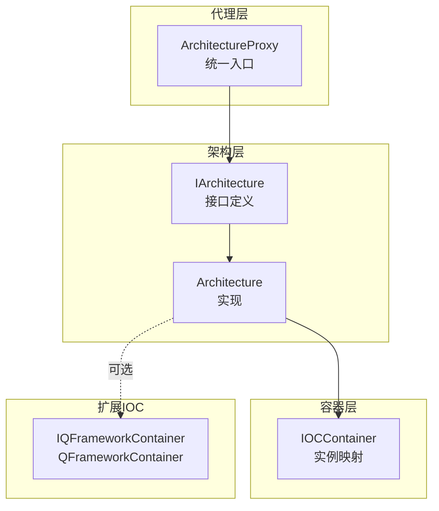
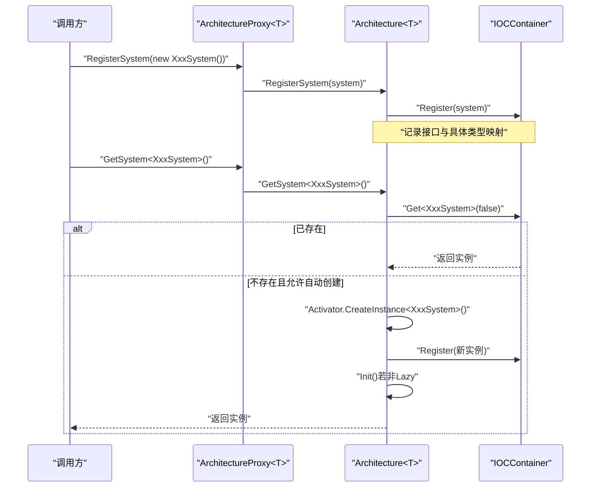
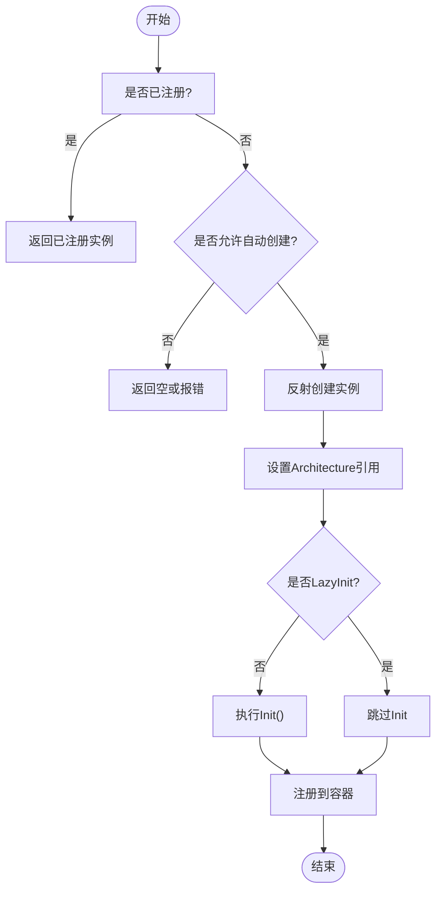
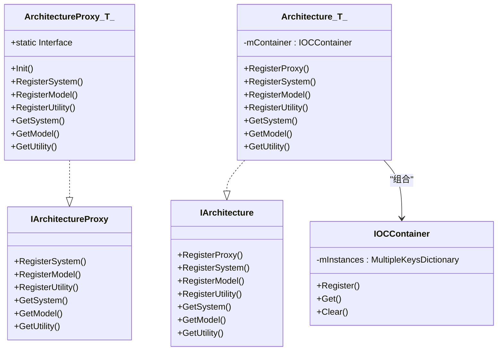

# 依赖注入机制

<cite>
**本文引用的文件**
- [ArchitectureProxy.cs](file://Assets/Game/Framework/Qframework/Runtime/Moyv/Proxies/ArchitectureProxy.cs)
- [QFramework.cs](file://Assets/Game/Framework/Qframework/Runtime/QFramework.cs)
- [IOCKit.cs](file://Assets/Game/Framework/Qframework/Toolkits/_CoreKit/IOCKit/IOCKit.cs)
- [TestArchitectureProxy.cs](file://Assets/Game/Framework/Qframework/Tests/Runtime/TestArchitectureProxy.cs)
</cite>

## 目录
1. [简介](#简介)
2. [项目结构](#项目结构)
3. [核心组件](#核心组件)
4. [架构总览](#架构总览)
5. [详细组件分析](#详细组件分析)
6. [依赖关系分析](#依赖关系分析)
7. [性能与内存管理](#性能与内存管理)
8. [故障排查指南](#故障排查指南)
9. [结论](#结论)
10. [附录：最佳实践与示例](#附录最佳实践与示例)

## 简介
本文件围绕 SimulationClient 中基于 ArchitectureProxy 的依赖注入机制，系统性阐述其容器管理与生命周期控制、组件注册与获取流程、泛型约束与类型安全、实例化策略（含单例）、解析顺序与循环依赖处理、性能优化与内存管理策略，以及解耦设计与模块化开发的最佳实践。文档同时提供面向初学者的可视化图示与代码级路径指引，帮助读者快速理解并落地使用。

## 项目结构
本项目采用分层与模块化组织方式，依赖注入相关能力集中在 QFramework 运行时与 IOC 工具包中：
- 代理层：通过 ArchitectureProxy<T> 暴露统一入口，屏蔽底层容器细节
- 架构层：IArchitecture 抽象与 Architecture<T> 实现，负责系统、模型、工具类的注册与获取
- 容器层：IOCContainer 维护实例映射，支持按接口与具体类型检索
- 扩展 IOC：IOCKit 提供属性/字段注入、命名实例、关系映射等高级特性

图表来源
- [ArchitectureProxy.cs:53-197](file://Assets/Game/Framework/Qframework/Runtime/Moyv/Proxies/ArchitectureProxy.cs#L53-L197)
- [QFramework.cs:45-351](file://Assets/Game/Framework/Qframework/Runtime/QFramework.cs#L45-L351)
- [QFramework.cs:940-1013](file://Assets/Game/Framework/Qframework/Runtime/QFramework.cs#L940-L1013)
- [IOCKit.cs:142-460](file://Assets/Game/Framework/Qframework/Toolkits/_CoreKit/IOCKit/IOCKit.cs#L142-L460)

章节来源
- [ArchitectureProxy.cs:53-197](file://Assets/Game/Framework/Qframework/Runtime/Moyv/Proxies/ArchitectureProxy.cs#L53-L197)
- [QFramework.cs:45-351](file://Assets/Game/Framework/Qframework/Runtime/QFramework.cs#L45-L351)
- [QFramework.cs:940-1013](file://Assets/Game/Framework/Qframework/Runtime/QFramework.cs#L940-L1013)
- [IOCKit.cs:142-460](file://Assets/Game/Framework/Qframework/Toolkits/_CoreKit/IOCKit/IOCKit.cs#L142-L460)

## 核心组件
- IArchitectureProxy / ArchitectureProxy<T>
  - 对外暴露 RegisterSystem/RegisterModel/RegisterUtility 与 GetSystem/GetModel/GetUtility 等 API
  - 内部委托至 GameArchitecture.Interface（即 Architecture<T> 的单例）
- IArchitecture / Architecture<T>
  - 维护 IOCContainer 实例集合
  - 提供 System/Model/Utility 的注册与获取，包含自动创建与懒初始化
- IOCContainer
  - 以 MultipleKeysDictionary 存储实例，支持按接口与具体类型检索
  - 提供 Clear 清理方法
- IOCKit（可选增强）
  - 提供 InjectAttribute、QFrameworkContainer 等，用于字段/属性注入与更丰富的映射

章节来源
- [ArchitectureProxy.cs:7-197](file://Assets/Game/Framework/Qframework/Runtime/Moyv/Proxies/ArchitectureProxy.cs#L7-L197)
- [QFramework.cs:45-351](file://Assets/Game/Framework/Qframework/Runtime/QFramework.cs#L45-L351)
- [QFramework.cs:940-1013](file://Assets/Game/Framework/Qframework/Runtime/QFramework.cs#L940-L1013)
- [IOCKit.cs:142-460](file://Assets/Game/Framework/Qframework/Toolkits/_CoreKit/IOCKit/IOCKit.cs#L142-L460)

## 架构总览
ArchitectureProxy<T> 作为“门面”，将调用转发到全局 Architecture<T>；后者持有 IOCContainer 完成实例注册与解析。System/Model 在注册时会被设置对 Architecture 的引用，从而可在组件内通过扩展方法便捷地访问其他组件。

图表来源
- [ArchitectureProxy.cs:69-87](file://Assets/Game/Framework/Qframework/Runtime/Moyv/Proxies/ArchitectureProxy.cs#L69-L87)
- [QFramework.cs:206-242](file://Assets/Game/Framework/Qframework/Runtime/QFramework.cs#L206-L242)
- [QFramework.cs:940-1013](file://Assets/Game/Framework/Qframework/Runtime/QFramework.cs#L940-L1013)

## 详细组件分析

### 组件注册与获取流程
- 注册
  - RegisterSystem/TSystem：为传入实例设置 Architecture 引用，写入容器；若未初始化且非 LazyInit，则立即 Init
  - RegisterModel/TModel：同上
  - RegisterUtility/TUtility：仅注册，不触发 Init
- 获取
  - GetSystem<T>(autoCreate=true)：优先从容器取；若不存在且 autoCreate 为真，则反射构造新实例、注册、必要时 Init
  - GetModel<T>：从容器取；若存在且为 LazyInit，按需 Init
  - GetUtility<T>：直接从容器取

图表来源
- [QFramework.cs:206-242](file://Assets/Game/Framework/Qframework/Runtime/QFramework.cs#L206-L242)
- [QFramework.cs:273-290](file://Assets/Game/Framework/Qframework/Runtime/QFramework.cs#L273-L290)
- [QFramework.cs:940-1013](file://Assets/Game/Framework/Qframework/Runtime/QFramework.cs#L940-L1013)

章节来源
- [QFramework.cs:206-242](file://Assets/Game/Framework/Qframework/Runtime/QFramework.cs#L206-L242)
- [QFramework.cs:273-290](file://Assets/Game/Framework/Qframework/Runtime/QFramework.cs#L273-L290)
- [QFramework.cs:940-1013](file://Assets/Game/Framework/Qframework/Runtime/QFramework.cs#L940-L1013)

### 泛型约束与类型安全
- 所有注册/获取 API 均使用泛型约束限定为 class 及对应接口（ISystem/IModel/IUtility），编译期保证类型正确性
- 容器内部以 Type 为键进行映射，结合接口与具体类型双重索引，避免运行期类型错误

章节来源
- [ArchitectureProxy.cs:9-22](file://Assets/Game/Framework/Qframework/Runtime/Moyv/Proxies/ArchitectureProxy.cs#L9-L22)
- [QFramework.cs:49-63](file://Assets/Game/Framework/Qframework/Runtime/QFramework.cs#L49-L63)
- [QFramework.cs:940-1013](file://Assets/Game/Framework/Qframework/Runtime/QFramework.cs#L940-L1013)

### 组件实例化策略与单例模式
- 单例
  - ArchitectureProxy<T> 的静态 Interface 属性在首次访问时触发 Architecture<T>.Interface 的单例初始化，并通过 RegisterProxy<T> 确保 Proxy 只被初始化一次
  - Architecture<T> 自身为静态单例，内部 mArchitecture 保证全局唯一
- 组件实例
  - 若显式 Register，则返回该实例（单例语义）
  - 若未注册且 autoCreate=true，则每次 GetSystem 会创建新实例并注册，后续获取复用该实例

章节来源
- [ArchitectureProxy.cs:57-65](file://Assets/Game/Framework/Qframework/Runtime/Moyv/Proxies/ArchitectureProxy.cs#L57-L65)
- [QFramework.cs:104-112](file://Assets/Game/Framework/Qframework/Runtime/QFramework.cs#L104-L112)
- [QFramework.cs:196-204](file://Assets/Game/Framework/Qframework/Runtime/QFramework.cs#L196-L204)
- [QFramework.cs:225-242](file://Assets/Game/Framework/Qframework/Runtime/QFramework.cs#L225-L242)

### 依赖解析顺序与循环依赖处理
- 解析顺序
  - 先查容器是否存在实例
  - 若不存在且允许自动创建，则反射构造并注册
  - 若组件标记为 LazyInit，则在首次获取时执行 Init
- 循环依赖
  - 当前实现未内置循环检测；若 A 在 OnInit 中强依赖 B，而 B 又在 OnInit 中强依赖 A，可能产生异常或空引用
  - 建议通过命令/事件或延迟初始化规避直接循环依赖

章节来源
- [QFramework.cs:225-242](file://Assets/Game/Framework/Qframework/Runtime/QFramework.cs#L225-L242)
- [QFramework.cs:273-290](file://Assets/Game/Framework/Qframework/Runtime/QFramework.cs#L273-L290)

### 测试用例验证
- 测试覆盖正常注册、反向注册顺序、缺失 Model 的错误日志预期等场景，验证了注册与获取行为符合预期

章节来源
- [TestArchitectureProxy.cs:79-107](file://Assets/Game/Framework/Qframework/Tests/Runtime/TestArchitectureProxy.cs#L79-L107)

## 依赖关系分析
- ArchitectureProxy<T> 依赖 IArchitecture 接口，实际由 Architecture<T> 提供
- Architecture<T> 依赖 IOCContainer 进行实例管理
- IOCContainer 依赖 MultipleKeysDictionary 进行多键映射
- IOCKit 提供可选的字段/属性注入能力，可通过 QFrameworkContainer 使用

图表来源
- [ArchitectureProxy.cs:7-197](file://Assets/Game/Framework/Qframework/Runtime/Moyv/Proxies/ArchitectureProxy.cs#L7-L197)
- [QFramework.cs:45-351](file://Assets/Game/Framework/Qframework/Runtime/QFramework.cs#L45-L351)
- [QFramework.cs:940-1013](file://Assets/Game/Framework/Qframework/Runtime/QFramework.cs#L940-L1013)

章节来源
- [ArchitectureProxy.cs:7-197](file://Assets/Game/Framework/Qframework/Runtime/Moyv/Proxies/ArchitectureProxy.cs#L7-L197)
- [QFramework.cs:45-351](file://Assets/Game/Framework/Qframework/Runtime/QFramework.cs#L45-L351)
- [QFramework.cs:940-1013](file://Assets/Game/Framework/Qframework/Runtime/QFramework.cs#L940-L1013)

## 性能与内存管理
- 性能优化技巧
  - 缓存常用组件引用：在组件生命周期早期获取并缓存，减少重复查找
  - 合理使用 LazyInit：对重型组件启用懒初始化，降低启动开销
  - 批量注册：在应用启动阶段集中注册，避免运行时频繁反射
  - 避免在 Init 中进行昂贵操作，可拆分为异步或帧后任务
- 内存管理策略
  - 使用 ClearAll/ClearContainer 在场景切换或退出时释放容器实例
  - 谨慎使用全局单例，避免长生命周期对象持有短生命周期资源
  - 及时注销事件订阅，防止内存泄漏
- 容器复杂度
  - 注册/获取均为字典查找，近似 O(1)
  - 自动创建涉及反射，应尽量避免高频调用

章节来源
- [QFramework.cs:180-187](file://Assets/Game/Framework/Qframework/Runtime/QFramework.cs#L180-L187)
- [QFramework.cs:225-242](file://Assets/Game/Framework/Qframework/Runtime/QFramework.cs#L225-L242)
- [QFramework.cs:940-1013](file://Assets/Game/Framework/Qframework/Runtime/QFramework.cs#L940-L1013)

## 故障排查指南
- 常见问题
  - 获取失败：当 Get 未找到实例且 logError=true 时会输出错误日志，检查是否正确注册
  - 循环依赖：组件间相互强依赖导致空引用或异常，改用事件/命令或延迟初始化
  - 重复注册：容器检测到重复注册会输出提示，确认业务逻辑是否重复注册
- 定位步骤
  - 查看错误日志中的类型全名，确认注册与获取的类型一致
  - 检查是否在正确的 Proxy 上下文中进行注册与获取
  - 使用 GetAllSystems/GetAllModels 枚举容器内容，辅助诊断

章节来源
- [QFramework.cs:982-994](file://Assets/Game/Framework/Qframework/Runtime/QFramework.cs#L982-L994)
- [QFramework.cs:950-967](file://Assets/Game/Framework/Qframework/Runtime/QFramework.cs#L950-L967)
- [TestArchitectureProxy.cs:89-91](file://Assets/Game/Framework/Qframework/Tests/Runtime/TestArchitectureProxy.cs#L89-L91)

## 结论
基于 ArchitectureProxy 的依赖注入机制提供了清晰的分层与统一的访问入口，配合 IOCContainer 实现了高效的实例管理与类型安全的获取。通过合理的注册时机、懒初始化与生命周期管理，可以在保证松耦合的同时获得良好的性能表现。对于复杂依赖关系，建议借助命令/事件与延迟初始化来规避循环依赖问题。

## 附录：最佳实践与示例

### 设计原则
- 面向接口编程：System/Model/Utility 均以接口形式暴露，便于替换与测试
- 单一职责：每个 System/Model 聚焦一个领域职责，避免过度耦合
- 明确生命周期：区分一次性初始化与每帧更新逻辑，合理拆分
- 显式注册：在应用启动阶段集中注册，避免隐式自动创建带来的不确定性

### 典型用法路径
- 在自定义 Proxy 的 Init 中注册所需组件
  - 参考路径：[ArchitectureProxy.cs:69-82](file://Assets/Game/Framework/Qframework/Runtime/Moyv/Proxies/ArchitectureProxy.cs#L69-L82)
- 在 System/Model 中通过扩展方法获取其他组件
  - 参考路径：[QFramework.cs:624-640](file://Assets/Game/Framework/Qframework/Runtime/QFramework.cs#L624-L640)
- 使用命令/事件进行跨模块通信
  - 参考路径：[QFramework.cs:308-348](file://Assets/Game/Framework/Qframework/Runtime/QFramework.cs#L308-L348)

### 扩展 IOC 的使用（可选）
- 使用 InjectAttribute 对字段/属性进行注入
- 使用 QFrameworkContainer 进行类型映射与实例注册
  - 参考路径：[IOCKit.cs:18-31](file://Assets/Game/Framework/Qframework/Toolkits/_CoreKit/IOCKit/IOCKit.cs#L18-L31)
  - 参考路径：[IOCKit.cs:142-460](file://Assets/Game/Framework/Qframework/Toolkits/_CoreKit/IOCKit/IOCKit.cs#L142-L460)