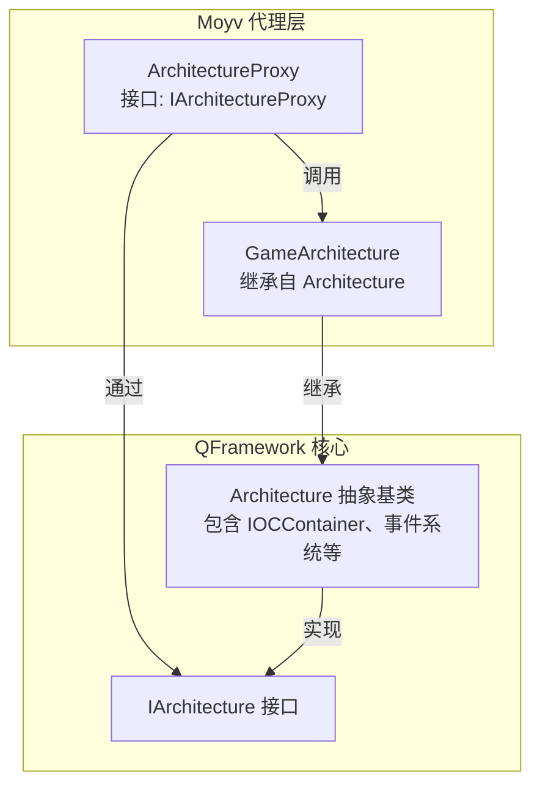
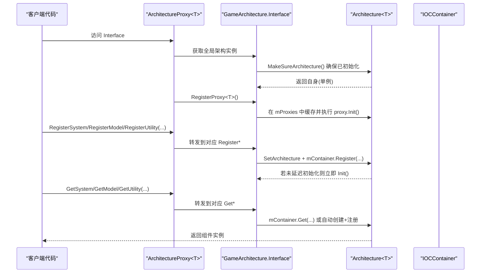
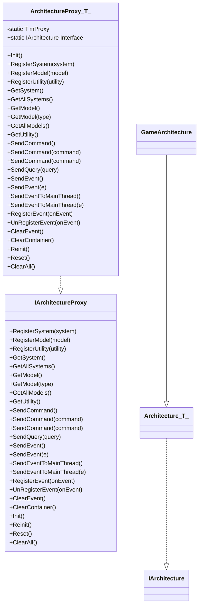
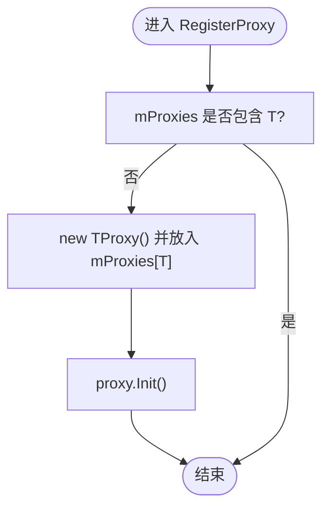
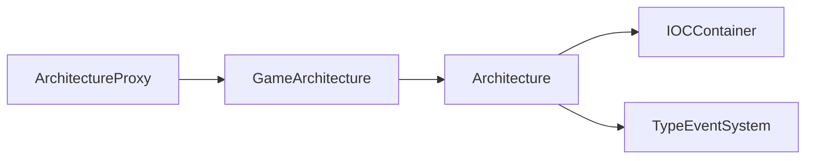

# 架构代理系统

<cite>
**本文引用的文件**   
- [ArchitectureProxy.cs](file://Assets/Game/Framework/Qframework/Runtime/Moyv/Proxies/ArchitectureProxy.cs)
- [GameArchitecture.cs](file://Assets/Game/Framework/Qframework/Runtime/Moyv/Proxies/GameArchitecture.cs)
- [QFramework.cs](file://Assets/Game/Framework/Qframework/Runtime/QFramework.cs)
- [TestArchitectureProxy.cs](file://Assets/Game/Framework/Qframework/Tests/Runtime/TestArchitectureProxy.cs)
</cite>

## 目录
1. [简介](#简介)
2. [项目结构](#项目结构)
3. [核心组件](#核心组件)
4. [架构总览](#架构总览)
5. [详细组件分析](#详细组件分析)
6. [依赖关系分析](#依赖关系分析)
7. [性能与内存管理](#性能与内存管理)
8. [故障排查指南](#故障排查指南)
9. [结论](#结论)
10. [附录：最佳实践与示例](#附录最佳实践与示例)

## 简介
本文件面向 SimulationClient 的架构代理子系统，围绕 ArchitectureProxy<T> 抽象基类、IArchitectureProxy 接口以及 GameArchitecture 的具体实现展开。文档将深入解释其设计模式（单例、泛型约束）、组件注册与获取机制、生命周期管理（Init、Reinit、Reset、ClearAll），并给出自定义架构代理的创建方式、依赖注入与查找原理、常见问题与优化建议。

## 项目结构
该子系统位于 QFramework 运行时模块中，关键位置如下：
- 架构代理与接口定义：Assets/Game/Framework/Qframework/Runtime/Moyv/Proxies
- 架构容器与核心实现：Assets/Game/Framework/Qframework/Runtime/QFramework.cs
- 单元测试用例：Assets/Game/Framework/Qframework/Tests/Runtime/TestArchitectureProxy.cs

图表来源
- [ArchitectureProxy.cs:7-67](file://Assets/Game/Framework/Qframework/Runtime/Moyv/Proxies/ArchitectureProxy.cs#L7-L67)
- [GameArchitecture.cs:5-10](file://Assets/Game/Framework/Qframework/Runtime/Moyv/Proxies/GameArchitecture.cs#L5-L10)
- [QFramework.cs:45-143](file://Assets/Game/Framework/Qframework/Runtime/QFramework.cs#L45-L143)

章节来源
- [ArchitectureProxy.cs:1-197](file://Assets/Game/Framework/Qframework/Runtime/Moyv/Proxies/ArchitectureProxy.cs#L1-L197)
- [GameArchitecture.cs:1-10](file://Assets/Game/Framework/Qframework/Runtime/Moyv/Proxies/GameArchitecture.cs#L1-L10)
- [QFramework.cs:45-351](file://Assets/Game/Framework/Qframework/Runtime/QFramework.cs#L45-L351)

## 核心组件
- IArchitectureProxy：统一对外暴露的代理接口，涵盖组件注册/获取、命令/查询/事件、生命周期管理等能力。
- ArchitectureProxy<T>：基于 CRTP 的抽象基类，提供静态访问入口 Interface，内部委托至全局 GameArchitecture 实例，完成具体操作。
- GameArchitecture：应用级架构单例，继承自 Architecture<GameArchitecture>，承载 IOC 容器、事件系统与生命周期控制。
- Architecture<T>：通用架构基类，实现 IArchitecture，封装了 RegisterProxy、RegisterSystem/Model/Utility、Get*、Reinit/Reset/ClearAll 等核心逻辑。

章节来源
- [ArchitectureProxy.cs:7-67](file://Assets/Game/Framework/Qframework/Runtime/Moyv/Proxies/ArchitectureProxy.cs#L7-L67)
- [QFramework.cs:94-351](file://Assets/Game/Framework/Qframework/Runtime/QFramework.cs#L94-L351)

## 架构总览
下图展示了从“代理访问”到“容器注册/获取”的完整链路，包括单例初始化、代理注册与懒加载机制。

图表来源
- [ArchitectureProxy.cs:57-67](file://Assets/Game/Framework/Qframework/Runtime/Moyv/Proxies/ArchitectureProxy.cs#L57-L67)
- [QFramework.cs:104-143](file://Assets/Game/Framework/Qframework/Runtime/QFramework.cs#L104-L143)
- [QFramework.cs:196-242](file://Assets/Game/Framework/Qframework/Runtime/QFramework.cs#L196-L242)

## 详细组件分析

### IArchitectureProxy 接口方法说明
- 组件注册
  - RegisterSystem<T>(T system)：注册系统实例，设置架构引用并加入容器；若非延迟初始化则立即 Init。
  - RegisterModel<T>(T model)：注册模型实例，设置架构引用并加入容器；若非延迟初始化则立即 Init。
  - RegisterUtility<T>(T utility)：注册工具实例，仅加入容器。
- 组件获取
  - GetSystem<T>()：优先从容器取，不存在时可按策略自动创建并注册；支持延迟初始化。
  - GetAllSystems()：遍历容器，收集所有 ISystem。
  - GetModel<T>() / GetModel(Type type)：从容器取模型，支持按类型获取。
  - GetAllModels()：遍历容器，收集所有 IModel。
  - GetUtility<T>()：从容器取工具。
- 通信与事件
  - SendCommand/SendQuery：发送命令/查询，内部为组件注入架构上下文后执行。
  - SendEvent/SendEventToMainThread：同步或主线程派发事件。
  - RegisterEvent/UnRegisterEvent/ClearEvent：事件订阅与清理。
- 生命周期
  - Init：由具体代理实现，用于集中注册组件。
  - Reinit：重置后重启所有尚未初始化的 Model/System。
  - Reset：调用各 System/Model 的 Reset，并将状态置回未初始化。
  - ClearAll：先 Reset，再清空事件与容器，并重置架构初始化状态与代理缓存。

章节来源
- [ArchitectureProxy.cs:7-51](file://Assets/Game/Framework/Qframework/Runtime/Moyv/Proxies/ArchitectureProxy.cs#L7-L51)
- [ArchitectureProxy.cs:67-197](file://Assets/Game/Framework/Qframework/Runtime/Moyv/Proxies/ArchitectureProxy.cs#L67-L197)
- [QFramework.cs:206-351](file://Assets/Game/Framework/Qframework/Runtime/QFramework.cs#L206-L351)

### ArchitectureProxy<T> 设计与实现要点
- 单例与 CRTP
  - 使用 static T mProxy 字段配合 where T : ArchitectureProxy<T>, new() 约束，保证派生类唯一性。
  - 静态属性 Interface 每次访问都会触发 architecture.RegisterProxy<T>()，从而在首次访问时完成代理注册与 Init 调用。
- 委托式实现
  - 所有注册/获取/生命周期方法均转发给 GameArchitecture.Interface，保持代理层薄而稳定。
- 泛型约束
  - 对 System/Model/Utility 分别限定 class, ISystem/IModel/IUtility，确保类型安全与可注入性。

图表来源
- [ArchitectureProxy.cs:7-67](file://Assets/Game/Framework/Qframework/Runtime/Moyv/Proxies/ArchitectureProxy.cs#L7-L67)
- [GameArchitecture.cs:5-10](file://Assets/Game/Framework/Qframework/Runtime/Moyv/Proxies/GameArchitecture.cs#L5-L10)
- [QFramework.cs:94-143](file://Assets/Game/Framework/Qframework/Runtime/QFramework.cs#L94-L143)

章节来源
- [ArchitectureProxy.cs:53-197](file://Assets/Game/Framework/Qframework/Runtime/Moyv/Proxies/ArchitectureProxy.cs#L53-L197)

### GameArchitecture 与 Architecture<T> 的实现细节
- 单例初始化
  - Architecture<T>.Interface 采用惰性单例：首次访问时构造 T 并执行 MakeSureArchitecture，确保 Init 只运行一次。
- 代理注册
  - RegisterProxy<TProxy> 在 mProxies 字典中缓存代理实例，并在首次注册时调用 proxy.Init()，避免重复初始化。
- 组件容器
  - 使用 IOCContainer 管理 System/Model/Utility 的生命周期与查找。
  - RegisterSystem/Model 会设置架构引用，并根据 LazyInit 决定是否立即 Init。
  - GetSystem 支持 autoCreate 参数，默认自动创建并注册；GetModel/GetUtility 直接从容器获取。
- 生命周期
  - Reinit：仅对尚未初始化的 Model/System 进行 Init。
  - Reset：对所有已初始化的 System/Model 调用 Reset，并将状态复位。
  - ClearAll：组合 Reset、ClearEvent、ClearContainer，并重置架构初始化状态与代理缓存。

图表来源
- [QFramework.cs:196-204](file://Assets/Game/Framework/Qframework/Runtime/QFramework.cs#L196-L204)

章节来源
- [QFramework.cs:104-143](file://Assets/Game/Framework/Qframework/Runtime/QFramework.cs#L104-L143)
- [QFramework.cs:196-242](file://Assets/Game/Framework/Qframework/Runtime/QFramework.cs#L196-L242)
- [QFramework.cs:244-351](file://Assets/Game/Framework/Qframework/Runtime/QFramework.cs#L244-L351)

## 依赖关系分析
- 耦合关系
  - ArchitectureProxy<T> 强依赖 GameArchitecture.Interface，但通过 IArchitecture 接口解耦，便于替换实现。
  - GameArchitecture 继承 Architecture<T>，复用容器、事件与生命周期逻辑。
- 外部依赖
  - IOCContainer：负责对象注册、查找与生命周期。
  - TypeEventSystem：事件分发与主线程调度。
- 循环依赖风险
  - 当前设计无直接循环依赖；注意在 System/Model 的 OnInit 中避免互相强依赖导致初始化顺序问题。

图表来源
- [ArchitectureProxy.cs:57-67](file://Assets/Game/Framework/Qframework/Runtime/Moyv/Proxies/ArchitectureProxy.cs#L57-L67)
- [QFramework.cs:94-143](file://Assets/Game/Framework/Qframework/Runtime/QFramework.cs#L94-L143)

章节来源
- [QFramework.cs:94-351](file://Assets/Game/Framework/Qframework/Runtime/QFramework.cs#L94-L351)

## 性能与内存管理
- 懒加载与一次性初始化
  - 利用 LazyInit 标志减少启动开销；仅在真正需要时初始化重型组件。
- 容器查找复杂度
  - 基于字典的查找近似 O(1)，频繁 GetSystem/GetModel 不会带来显著开销。
- 事件与主线程调度
  - 大量事件注册/取消需成对出现，避免内存泄漏；必要时使用 UnregisterList 批量释放。
- 资源释放
  - 场景切换或退出前调用 ClearAll，确保事件与容器全部清理，避免残留引用。

[本节为通用指导，不直接分析具体文件]

## 故障排查指南
- 常见错误：未注册即获取
  - 现象：GetModel/GetSystem 失败日志提示找不到类型。
  - 原因：未在 Init 中注册，或注册顺序不当导致依赖缺失。
  - 处理：确保在代理 Init 中按依赖顺序注册；或使用 GetSystem(autoCreate=true) 自动创建。
- 重复初始化
  - 现象：多次访问 Interface 仍只执行一次 Init。
  - 原因：RegisterProxy 内部已做存在性检查，属于预期行为。
- 生命周期误用
  - 现象：Reset 后组件状态异常。
  - 处理：在 OnReset 中正确清理状态；必要时调用 Reinit 重新初始化未初始化的组件。

章节来源
- [TestArchitectureProxy.cs:79-107](file://Assets/Game/Framework/Qframework/Tests/Runtime/TestArchitectureProxy.cs#L79-L107)
- [QFramework.cs:148-187](file://Assets/Game/Framework/Qframework/Runtime/QFramework.cs#L148-L187)

## 结论
ArchitectureProxy<T> 以简洁的代理层屏蔽底层容器细节，结合 Architecture<T> 的单例与 IOC 容器，提供了统一的组件注册、获取与生命周期管理能力。通过合理的命名规范、注册顺序与内存管理策略，可在大型项目中获得良好的可维护性与性能表现。

[本节为总结，不直接分析具体文件]

## 附录：最佳实践与示例

### 如何继承 ArchitectureProxy<T> 创建自定义架构代理
- 步骤
  - 新建类继承 ArchitectureProxy<YourProxy>。
  - 重写 Init，在其中调用 RegisterSystem/RegisterModel/RegisterUtility 完成组件注册。
  - 通过 YourProxy.Interface 访问架构能力。
- 参考用例
  - 测试用例中演示了多个代理在不同注册顺序下的行为与结果。

章节来源
- [TestArchitectureProxy.cs:45-70](file://Assets/Game/Framework/Qframework/Tests/Runtime/TestArchitectureProxy.cs#L45-L70)
- [TestArchitectureProxy.cs:79-107](file://Assets/Game/Framework/Qframework/Tests/Runtime/TestArchitectureProxy.cs#L79-L107)

### 依赖注入与组件查找机制
- 注入路径
  - 注册时 SetArchitecture(this)，使组件可通过扩展方法便捷获取其他组件。
- 查找路径
  - GetSystem/GetModel/GetUtility 均走 IOCContainer；GetSystem 支持自动创建与延迟初始化。

章节来源
- [QFramework.cs:206-242](file://Assets/Game/Framework/Qframework/Runtime/QFramework.cs#L206-L242)

### 组件命名规范与注册顺序
- 命名规范
  - 使用清晰、语义化的名称，如 XxxSystem、XxxModel、XxxUtility。
- 注册顺序
  - 被依赖者优先注册；或在依赖方使用 GetSystem(autoCreate=true) 自动创建。
- 内存管理
  - 在 OnReset 中释放资源；在 ClearAll 后不再持有旧实例引用。

[本节为通用指导，不直接分析具体文件]