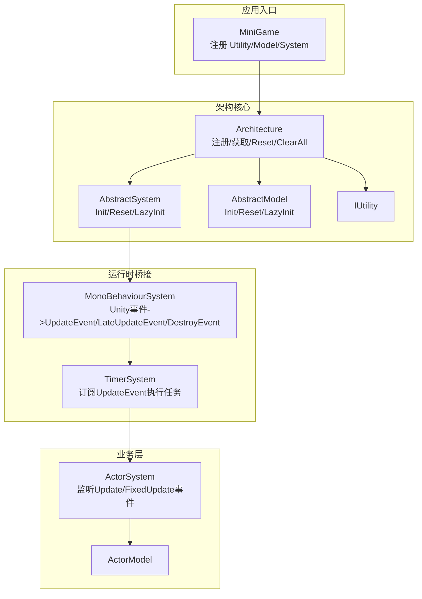
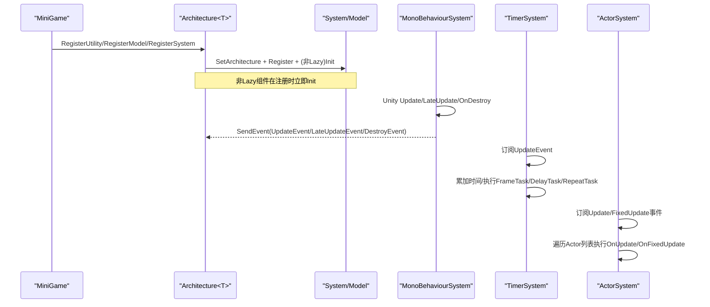
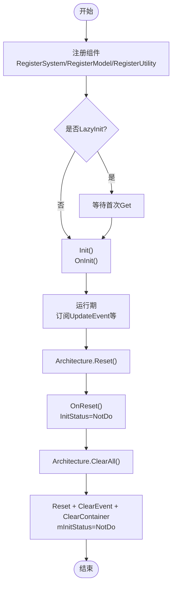
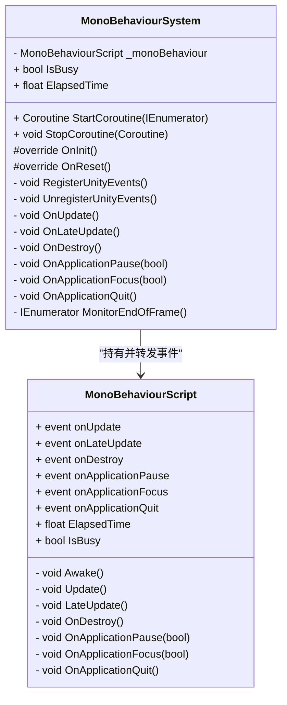
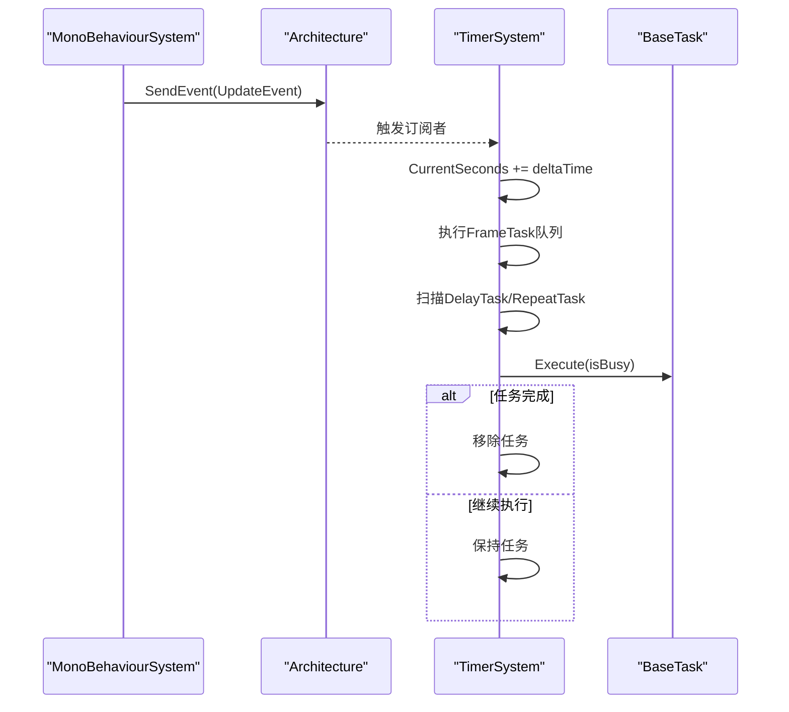
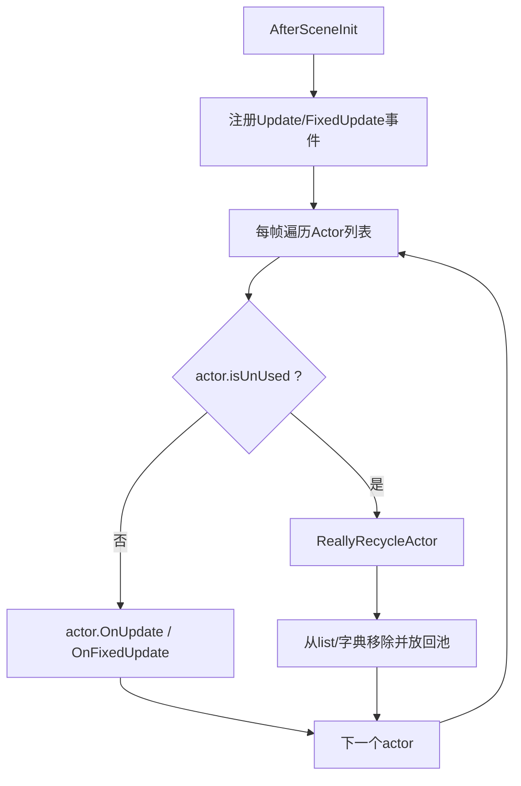
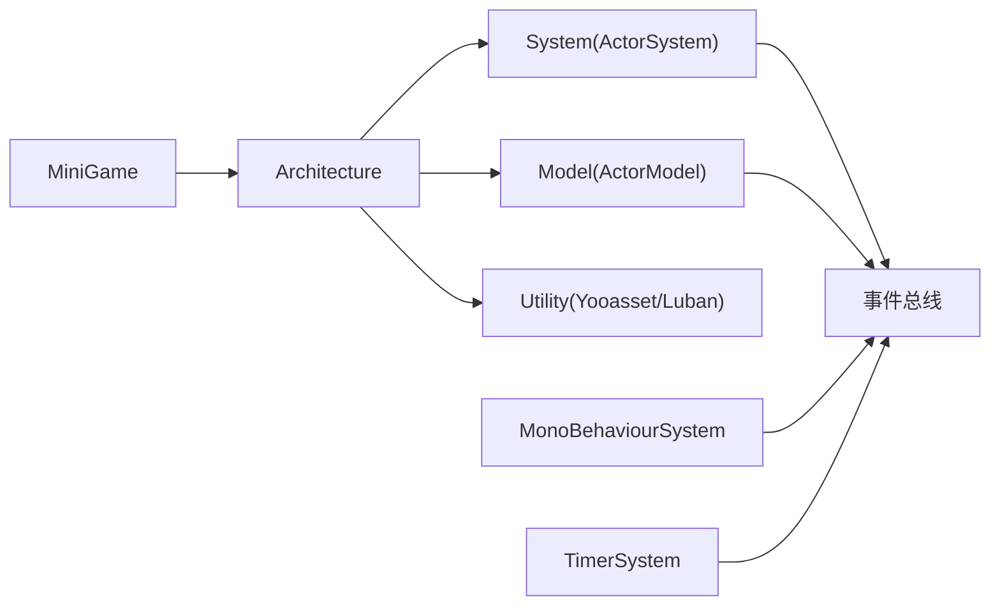

# 组件生命周期管理

<cite>
**本文引用的文件**
- [QFramework.cs](file://Assets/Game/Framework/Qframework/Runtime/QFramework.cs)
- [MonoBehaviourSystem.cs](file://Assets/Game/Framework/Qframework/Runtime/Moyv/Systems/MonoBehaviourSystem.cs)
- [TimerSystem.cs](file://Assets/Game/Framework/Qframework/Runtime/Moyv/Systems/TimerSystem.cs)
- [MiniGame.cs](file://Assets/Game/Scripts/MiniGame_Scripts/MiniGame.cs)
- [ActorModel.cs](file://Assets/Game/Scripts/MiniGame_Scripts/Model/ActorModel.cs)
- [ActorSystem.cs](file://Assets/Game/Scripts/MiniGame_Scripts/System/ActorSystem.cs)
</cite>

## 目录
1. [引言](#引言)
2. [项目结构](#项目结构)
3. [核心组件](#核心组件)
4. [架构总览](#架构总览)
5. [详细组件分析](#详细组件分析)
6. [依赖关系分析](#依赖关系分析)
7. [性能考量](#性能考量)
8. [故障排查指南](#故障排查指南)
9. [结论](#结论)
10. [附录](#附录)

## 引言
本文件面向 SimulationClient 的组件生命周期管理系统，聚焦 System、Model、Utility 三类组件的生命周期阶段（初始化 Init、更新 Update、重置 Reset、销毁 ClearAll），并深入解释 MonoBehaviourSystem 基类与 Unity 生命周期的集成方式。文档同时覆盖组件注册、发现与销毁流程，提供自定义组件生命周期方法的实践指引，说明依赖关系与初始化顺序控制策略，给出资源管理与内存清理的最佳实践，以及状态监控与调试工具的使用方法，帮助开发者解决组件冲突、资源泄漏和性能问题等常见挑战，并提供组件设计原则与架构建议。

## 项目结构
SimulationClient 使用 QFramework 作为架构基础，通过 Architecture 容器统一管理 System、Model、Utility 的注册、获取、事件分发与生命周期。关键入口位于 MiniGame 中完成 Utility、Model、System 的注册；运行时由 MonoBehaviourSystem 桥接 Unity 帧事件，TimerSystem 订阅 UpdateEvent 驱动定时任务；业务系统 ActorSystem 基于事件驱动进行对象管理与更新。

图表来源
- [QFramework.cs:94-351](file://Assets/Game/Framework/Qframework/Runtime/QFramework.cs#L94-L351)
- [QFramework.cs:429-500](file://Assets/Game/Framework/Qframework/Runtime/QFramework.cs#L429-L500)
- [MonoBehaviourSystem.cs:79-186](file://Assets/Game/Framework/Qframework/Runtime/Moyv/Systems/MonoBehaviourSystem.cs#L79-L186)
- [TimerSystem.cs:118-146](file://Assets/Game/Framework/Qframework/Runtime/Moyv/Systems/TimerSystem.cs#L118-L146)
- [ActorSystem.cs:37-47](file://Assets/Game/Scripts/MiniGame_Scripts/System/ActorSystem.cs#L37-L47)
- [MiniGame.cs:6-28](file://Assets/Game/Scripts/MiniGame_Scripts/MiniGame.cs#L6-L28)

章节来源
- [MiniGame.cs:6-28](file://Assets/Game/Scripts/MiniGame_Scripts/MiniGame.cs#L6-L28)
- [QFramework.cs:94-351](file://Assets/Game/Framework/Qframework/Runtime/QFramework.cs#L94-L351)

## 核心组件
- AbstractSystem：定义 System 的标准生命周期接口，包含 InitStatus、LazyInit、Init()、Reset() 及抽象 OnInit()、虚 OnReset()。
- AbstractModel：定义 Model 的标准生命周期接口，结构与 System 一致，用于数据模型初始化与重置。
- IUtility：无方法标记接口，表示纯工具型组件，不参与 Init/Reset 生命周期。
- Architecture<T>：统一注册与获取 System/Model/Utility，提供 Reset()、ClearAll()、Reinit() 等全局生命周期控制，内部维护 IOC 容器与事件系统。

要点
- LazyInit：当为 true 时，组件在首次 Get 时才触发 Init，适合重型或可选模块。
- InitStatus：NotDo/Doing/Did 三态，避免重复初始化。
- Reset：调用各组件 OnReset，并将 InitStatus 置回 NotDo，以便 Reinit 再次 Init。
- ClearAll：先 Reset，再清空事件与容器，最后将 Architecture 自身初始化状态复位。

章节来源
- [QFramework.cs:429-500](file://Assets/Game/Framework/Qframework/Runtime/QFramework.cs#L429-L500)
- [QFramework.cs:94-351](file://Assets/Game/Framework/Qframework/Runtime/QFramework.cs#L94-L351)

## 架构总览
下图展示从应用入口到运行时事件驱动的完整链路：MiniGame 注册组件后，Architecture 负责实例化与初始化；MonoBehaviourSystem 在 Unity 帧回调中发送 UpdateEvent/LateUpdateEvent/DestroyEvent 等；TimerSystem 订阅 UpdateEvent 推进时间并调度任务；业务系统如 ActorSystem 订阅帧事件执行逻辑。

图表来源
- [MiniGame.cs:6-28](file://Assets/Game/Scripts/MiniGame_Scripts/MiniGame.cs#L6-L28)
- [QFramework.cs:206-242](file://Assets/Game/Framework/Qframework/Runtime/QFramework.cs#L206-L242)
- [MonoBehaviourSystem.cs:118-166](file://Assets/Game/Framework/Qframework/Runtime/Moyv/Systems/MonoBehaviourSystem.cs#L118-L166)
- [TimerSystem.cs:128-146](file://Assets/Game/Framework/Qframework/Runtime/Moyv/Systems/TimerSystem.cs#L128-L146)
- [ActorSystem.cs:42-47](file://Assets/Game/Scripts/MiniGame_Scripts/System/ActorSystem.cs#L42-L47)

## 详细组件分析

### System/Model/Utility 生命周期阶段
- 初始化 Init
  - 注册时若为非 LazyInit，则立即调用 Init()，内部设置 InitStatus=Doing，执行 OnInit()，完成后设为 Did。
  - 若为 LazyInit，则在首次 GetSystem/GetModel 时触发 Init。
- 更新 Update
  - 通过 MonoBehaviourSystem 发送 UpdateEvent/LateUpdateEvent，业务系统订阅后实现每帧更新。
- 重置 Reset
  - Architecture.Reset() 遍历所有已初始化的 System/Model，调用其 Reset()，内部执行 OnReset() 并将 InitStatus 置回 NotDo。
- 销毁 ClearAll
  - 先 Reset，再清空事件与容器，最后将 Architecture 初始化状态复位为 NotDo，便于后续 Reinit。

图表来源
- [QFramework.cs:206-242](file://Assets/Game/Framework/Qframework/Runtime/QFramework.cs#L206-L242)
- [QFramework.cs:164-187](file://Assets/Game/Framework/Qframework/Runtime/QFramework.cs#L164-L187)
- [QFramework.cs:441-458](file://Assets/Game/Framework/Qframework/Runtime/QFramework.cs#L441-L458)
- [QFramework.cs:482-499](file://Assets/Game/Framework/Qframework/Runtime/QFramework.cs#L482-L499)

章节来源
- [QFramework.cs:206-242](file://Assets/Game/Framework/Qframework/Runtime/QFramework.cs#L206-L242)
- [QFramework.cs:164-187](file://Assets/Game/Framework/Qframework/Runtime/QFramework.cs#L164-L187)
- [QFramework.cs:441-458](file://Assets/Game/Framework/Qframework/Runtime/QFramework.cs#L441-L458)
- [QFramework.cs:482-499](file://Assets/Game/Framework/Qframework/Runtime/QFramework.cs#L482-L499)

### MonoBehaviourSystem 基类与 Unity 生命周期集成
- 职责
  - 在 OnInit 中查找或创建 MonoBehaviourScript 单例，绑定 Unity 生命周期事件。
  - 将 Unity 的 Update/LateUpdate/OnDestroy/ApplicationPause/Focus/Quit 转换为框架内的事件（UpdateEvent/LateUpdateEvent/DestroyEvent/ApplicationPauseEvent/ApplicationFocusEvent/ApplicationQuitEvent）。
  - 提供 StartCoroutine/StopCoroutine 代理，支持协程生命周期管理。
  - 提供 IsBusy/ElapsedTime 指标，辅助 TimerSystem 判断繁忙帧。
- 关键点
  - 避免重复注册：在重建 GameObject 前会 UnregisterUnityEvents。
  - 隐藏且常驻：GameObject 使用 HideAndDontSave，并在 Play 模式下 DontDestroyOnLoad。
  - 帧末事件：通过 WaitForEndOfFrame 循环发送 EndOfFrameEvent。

图表来源
- [MonoBehaviourSystem.cs:7-186](file://Assets/Game/Framework/Qframework/Runtime/Moyv/Systems/MonoBehaviourSystem.cs#L7-L186)

章节来源
- [MonoBehaviourSystem.cs:79-186](file://Assets/Game/Framework/Qframework/Runtime/Moyv/Systems/MonoBehaviourSystem.cs#L79-L186)

### TimerSystem 与帧事件驱动
- 订阅 UpdateEvent，累计 CurrentSeconds，按优先级处理 FrameTask、DelayTask、RepeatTask。
- 支持 ExecuteBySlice 分片执行，结合 MonoBehaviourSystem.ElapsedTime 控制帧耗时。
- Reset 时清空任务队列并取消事件订阅，避免泄漏。

图表来源
- [MonoBehaviourSystem.cs:138-166](file://Assets/Game/Framework/Qframework/Runtime/Moyv/Systems/MonoBehaviourSystem.cs#L138-L166)
- [TimerSystem.cs:128-209](file://Assets/Game/Framework/Qframework/Runtime/Moyv/Systems/TimerSystem.cs#L128-L209)

章节来源
- [TimerSystem.cs:118-209](file://Assets/Game/Framework/Qframework/Runtime/Moyv/Systems/TimerSystem.cs#L118-L209)

### 业务系统示例：ActorSystem
- 在 AfterSceneInit 中注册 UpdateEvent/FixedUpdateEvent 处理器。
- 每帧遍历 Actor 列表，调用 OnUpdate/OnFixedUpdate，并对标记回收的对象执行 ReallyRecycleActor。
- 提供 AddActor/RemoveActor/AddData/RemoveData 等方法管理对象与数据字典。

图表来源
- [ActorSystem.cs:42-99](file://Assets/Game/Scripts/MiniGame_Scripts/System/ActorSystem.cs#L42-L99)
- [ActorSystem.cs:101-121](file://Assets/Game/Scripts/MiniGame_Scripts/System/ActorSystem.cs#L101-L121)

章节来源
- [ActorSystem.cs:37-99](file://Assets/Game/Scripts/MiniGame_Scripts/System/ActorSystem.cs#L37-L99)

### 自定义组件生命周期方法实现指引
- 自定义 System
  - 继承 AbstractSystem，重写 OnInit 完成依赖获取与资源准备；重写 OnReset 清理引用与状态。
  - 如需延迟初始化，返回 LazyInit=true，并在需要时通过 GetSystem<T>() 获取以触发 Init。
- 自定义 Model
  - 继承 AbstractModel，重写 OnInit 初始化数据；重写 OnReset 重置字段与集合。
- 自定义 Utility
  - 实现 IUtility 接口，无需 Init/Reset，直接注册即可使用。
- 参考路径
  - System 示例：[ActorSystem.cs](file://Assets/Game/Scripts/MiniGame_Scripts/System/ActorSystem.cs)
  - Model 示例：[ActorModel.cs](file://Assets/Game/Scripts/MiniGame_Scripts/Model/ActorModel.cs)
  - 基类定义：[QFramework.cs](file://Assets/Game/Framework/Qframework/Runtime/QFramework.cs)

章节来源
- [ActorSystem.cs:37-47](file://Assets/Game/Scripts/MiniGame_Scripts/System/ActorSystem.cs#L37-L47)
- [ActorModel.cs:7-10](file://Assets/Game/Scripts/MiniGame_Scripts/Model/ActorModel.cs#L7-L10)
- [QFramework.cs:429-500](file://Assets/Game/Framework/Qframework/Runtime/QFramework.cs#L429-L500)

## 依赖关系分析
- 组件注册与发现
  - RegisterSystem/RegisterModel 会将组件注入 Architecture 的 IOC 容器，并根据 LazyInit 决定是否立即 Init。
  - GetSystem/GetModel 支持自动创建与懒加载，确保按需初始化。
- 事件驱动耦合
  - MonoBehaviourSystem 解耦 Unity 帧事件与业务逻辑，通过事件总线传递。
  - TimerSystem 与 ActorSystem 均通过事件订阅参与更新循环，降低直接耦合。
- 生命周期顺序
  - 注册顺序决定首次 Init 的顺序；Reset 顺序为 System 优先于 Model；ClearAll 保证彻底清理。

图表来源
- [MiniGame.cs:6-28](file://Assets/Game/Scripts/MiniGame_Scripts/MiniGame.cs#L6-L28)
- [QFramework.cs:206-242](file://Assets/Game/Framework/Qframework/Runtime/QFramework.cs#L206-L242)
- [MonoBehaviourSystem.cs:118-166](file://Assets/Game/Framework/Qframework/Runtime/Moyv/Systems/MonoBehaviourSystem.cs#L118-L166)
- [TimerSystem.cs:128-146](file://Assets/Game/Framework/Qframework/Runtime/Moyv/Systems/TimerSystem.cs#L128-L146)

章节来源
- [QFramework.cs:206-242](file://Assets/Game/Framework/Qframework/Runtime/QFramework.cs#L206-L242)
- [MiniGame.cs:6-28](file://Assets/Game/Scripts/MiniGame_Scripts/MiniGame.cs#L6-L28)

## 性能考量
- 使用 LazyInit 减少启动开销，仅在需要时初始化重型 System/Model。
- 利用 TimerSystem.ExecuteBySlice 对大数据集进行分片处理，避免单帧卡顿。
- 关注 MonoBehaviourSystem.IsBusy 与 ElapsedTime，合理设置 busyRun 参数，避免在繁忙帧执行重任务。
- 及时在 OnReset 中释放事件订阅与引用，防止内存泄漏。
- 使用对象池（如 CPool）复用 Actor 与数据结构，减少 GC 压力。

## 故障排查指南
- 组件未初始化
  - 检查 LazyInit 是否为 true，确认是否在 Get 之前尝试访问。
  - 查看 InitStatus 是否为 Did，必要时调用 Reinit。
- 事件未触发
  - 确认 MonoBehaviourSystem 是否正确创建并注册 Unity 事件。
  - 检查订阅是否被 Reset 清除，必要时重新注册。
- 资源泄漏
  - 在 OnReset 中取消事件订阅、停止协程、清空集合与引用。
  - 使用 ClearAll 进行全量清理后再 Reinit 验证。
- 性能问题
  - 使用 TimerSystem 的分片执行与忙闲检测，避免长耗时操作阻塞主线程。
  - 使用 Profiler 定位热点，优化 Update 中的循环与分配。

章节来源
- [QFramework.cs:164-187](file://Assets/Game/Framework/Qframework/Runtime/QFramework.cs#L164-L187)
- [MonoBehaviourSystem.cs:118-186](file://Assets/Game/Framework/Qframework/Runtime/Moyv/Systems/MonoBehaviourSystem.cs#L118-L186)
- [TimerSystem.cs:211-258](file://Assets/Game/Framework/Qframework/Runtime/Moyv/Systems/TimerSystem.cs#L211-L258)

## 结论
通过 QFramework 的 Architecture 容器与 MonoBehaviourSystem 的 Unity 事件桥接，SimulationClient 实现了清晰、可扩展的组件生命周期管理。System/Model/Utility 的职责边界明确，事件驱动降低了耦合度，TimerSystem 提供了灵活的调度能力。遵循 LazyInit、OnReset 清理、分片执行等最佳实践，可有效避免资源泄漏与性能瓶颈。建议在大型项目中持续完善状态监控与调试工具，提升可观测性与可维护性。

## 附录
- 组件设计原则
  - 单一职责：System 专注逻辑，Model 专注数据，Utility 提供通用能力。
  - 显式依赖：通过 GetSystem/GetModel 获取依赖，避免静态全局引用。
  - 可重置：每个组件必须正确实现 OnReset，确保可重复使用。
  - 可观测：记录关键状态与异常，配合日志标签 logTag 输出上下文。
- 架构建议
  - 使用 Reinit 进行热重载场景下的安全重启。
  - 通过 ArchitectureProxy 集中管理注册流程，保持入口整洁。
  - 将 UI 相关逻辑封装为 AbstractUISystem，与游戏逻辑解耦。