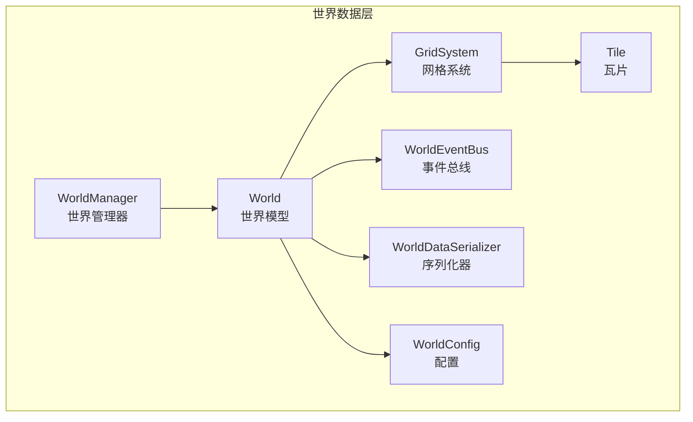
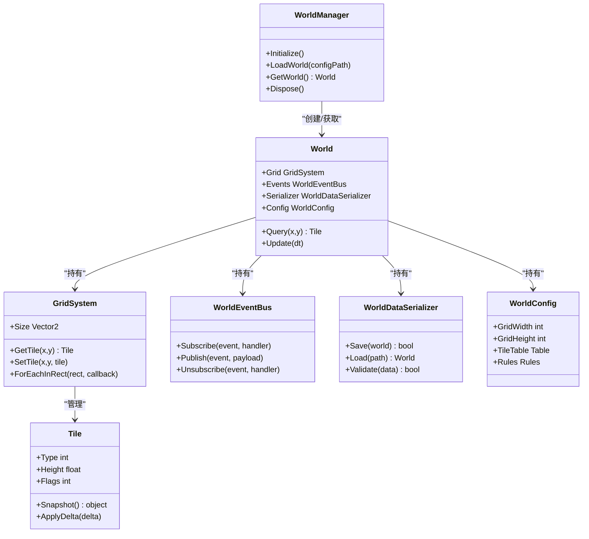
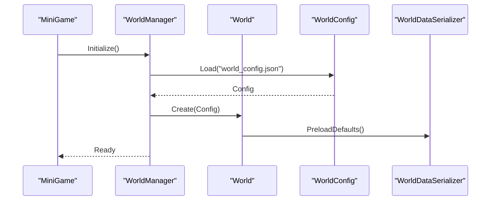
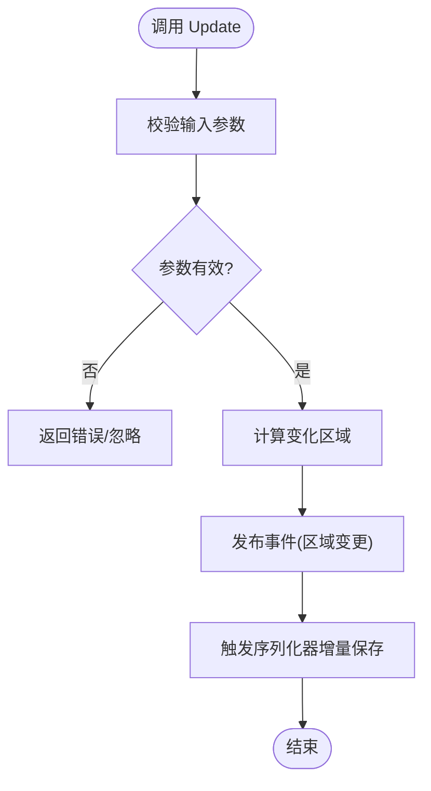
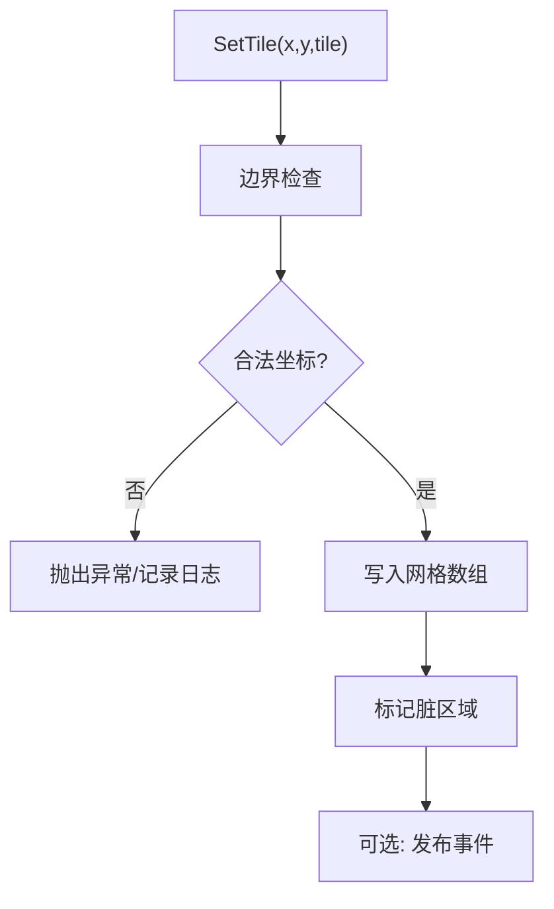
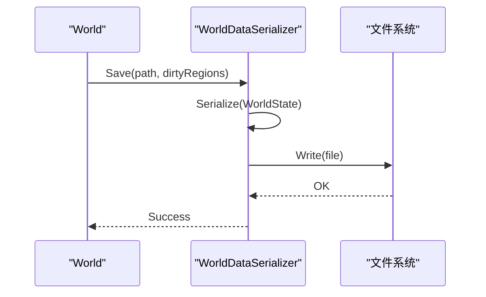
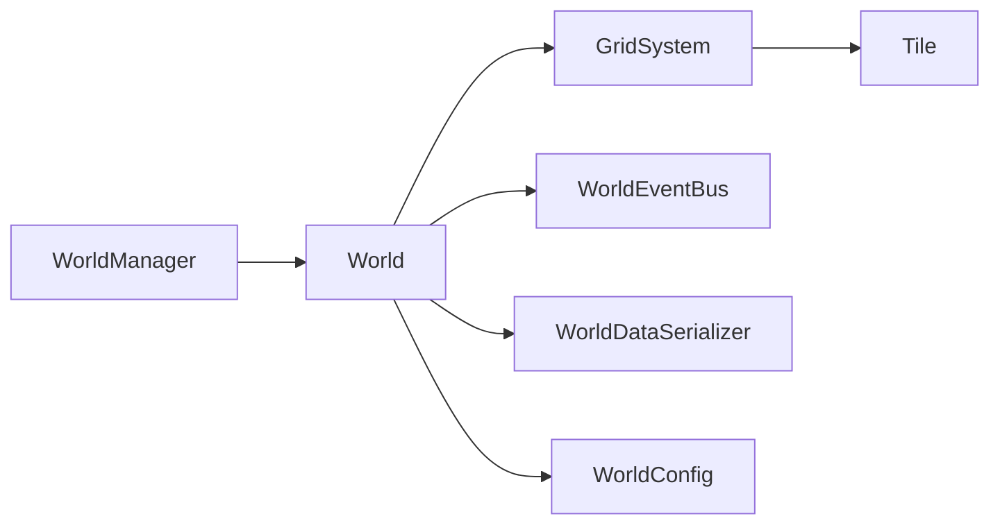

# 世界数据层

<cite>
**本文引用的文件**   
- [MiniGame.cs](file://Assets/Game/Scripts/MiniGame_Scripts/MiniGame.cs)
- [WorldManager.cs](file://Assets/Game/Scripts/Simulation/World/WorldManager.cs)
- [World.cs](file://Assets/Game/Scripts/Simulation/World/World.cs)
- [Tile.cs](file://Assets/Game/Scripts/Simulation/World/Tile.cs)
- [GridSystem.cs](file://Assets/Game/Scripts/Simulation/World/GridSystem.cs)
- [WorldEventBus.cs](file://Assets/Game/Scripts/Simulation/World/WorldEventBus.cs)
- [WorldDataSerializer.cs](file://Assets/Game/Scripts/Simulation/World/WorldDataSerializer.cs)
- [WorldConfig.cs](file://Assets/Game/Scripts/Simulation/World/WorldConfig.cs)
</cite>

## 目录
1. [简介](#简介)
2. [项目结构](#项目结构)
3. [核心组件](#核心组件)
4. [架构总览](#架构总览)
5. [详细组件分析](#详细组件分析)
6. [依赖关系分析](#依赖关系分析)
7. [性能考量](#性能考量)
8. [故障排查指南](#故障排查指南)
9. [结论](#结论)
10. [附录](#附录)

## 简介
本文件聚焦于“世界数据层”的设计与实现，围绕模拟客户端中的世界模型、网格系统、瓦片实体、事件总线与序列化等关键模块进行系统化说明。目标是为开发者提供从高层架构到代码级细节的完整理解，帮助快速定位问题并进行扩展优化。

## 项目结构
世界数据层位于 Simulation 子系统中，采用分层组织：
- 顶层入口：负责初始化与生命周期管理
- 世界管理层：协调世界实例、配置加载、事件分发
- 世界模型层：维护世界状态、网格拓扑、瓦片集合
- 基础设施：事件总线、序列化、配置读取

**图表来源**
- [WorldManager.cs](file://Assets/Game/Scripts/Simulation/World/WorldManager.cs)
- [World.cs](file://Assets/Game/Scripts/Simulation/World/World.cs)
- [GridSystem.cs](file://Assets/Game/Scripts/Simulation/World/GridSystem.cs)
- [Tile.cs](file://Assets/Game/Scripts/Simulation/World/Tile.cs)
- [WorldEventBus.cs](file://Assets/Game/Scripts/Simulation/World/WorldEventBus.cs)
- [WorldDataSerializer.cs](file://Assets/Game/Scripts/Simulation/World/WorldDataSerializer.cs)
- [WorldConfig.cs](file://Assets/Game/Scripts/Simulation/World/WorldConfig.cs)

**章节来源**
- [MiniGame.cs](file://Assets/Game/Scripts/MiniGame_Scripts/MiniGame.cs)
- [WorldManager.cs](file://Assets/Game/Scripts/Simulation/World/WorldManager.cs)
- [World.cs](file://Assets/Game/Scripts/Simulation/World/World.cs)
- [GridSystem.cs](file://Assets/Game/Scripts/Simulation/World/GridSystem.cs)
- [Tile.cs](file://Assets/Game/Scripts/Simulation/World/Tile.cs)
- [WorldEventBus.cs](file://Assets/Game/Scripts/Simulation/World/WorldEventBus.cs)
- [WorldDataSerializer.cs](file://Assets/Game/Scripts/Simulation/World/WorldDataSerializer.cs)
- [WorldConfig.cs](file://Assets/Game/Scripts/Simulation/World/WorldConfig.cs)

## 核心组件
- 世界管理器（WorldManager）
  - 职责：创建/销毁世界实例、加载配置、驱动初始化流程、对外暴露统一接口
  - 关键点：单例或集中式访问点；与 MiniGame 生命周期对接
- 世界模型（World）
  - 职责：持有网格系统、事件总线、序列化器、配置；维护全局状态（尺寸、坐标范围、时间步长等）
  - 关键点：对上层提供查询与变更世界的稳定 API；内部委托给子系统执行
- 网格系统（GridSystem）
  - 职责：二维/三维网格索引、坐标映射、邻居查找、区域裁剪
  - 关键点：高效存储布局（数组/分块）、边界处理、批量操作
- 瓦片（Tile）
  - 职责：表示网格单元的数据与行为（类型、高度、资源占用、可通行性等）
  - 关键点：值对象或轻量实体；支持增量更新与快照
- 事件总线（WorldEventBus）
  - 职责：发布/订阅世界内事件（如瓦片变更、区域刷新、世界加载完成）
  - 关键点：解耦模块间通信；避免循环依赖；支持过滤与优先级
- 序列化器（WorldDataSerializer）
  - 职责：世界数据的持久化与反序列化（存档/读档、热重载）
  - 关键点：版本兼容、增量保存、校验与回滚
- 配置（WorldConfig）
  - 职责：加载并缓存世界相关配置（网格大小、瓦片表、规则集）
  - 关键点：只读视图、热更新支持、默认值与校验

**章节来源**
- [WorldManager.cs](file://Assets/Game/Scripts/Simulation/World/WorldManager.cs)
- [World.cs](file://Assets/Game/Scripts/Simulation/World/World.cs)
- [GridSystem.cs](file://Assets/Game/Scripts/Simulation/World/GridSystem.cs)
- [Tile.cs](file://Assets/Game/Scripts/Simulation/World/Tile.cs)
- [WorldEventBus.cs](file://Assets/Game/Scripts/Simulation/World/WorldEventBus.cs)
- [WorldDataSerializer.cs](file://Assets/Game/Scripts/Simulation/World/WorldDataSerializer.cs)
- [WorldConfig.cs](file://Assets/Game/Scripts/Simulation/World/WorldConfig.cs)

## 架构总览
世界数据层遵循“管理器—模型—子系统”的分层模式，通过事件总线降低耦合，通过序列化器保障数据一致性。

**图表来源**
- [WorldManager.cs](file://Assets/Game/Scripts/Simulation/World/WorldManager.cs)
- [World.cs](file://Assets/Game/Scripts/Simulation/World/World.cs)
- [GridSystem.cs](file://Assets/Game/Scripts/Simulation/World/GridSystem.cs)
- [Tile.cs](file://Assets/Game/Scripts/Simulation/World/Tile.cs)
- [WorldEventBus.cs](file://Assets/Game/Scripts/Simulation/World/WorldEventBus.cs)
- [WorldDataSerializer.cs](file://Assets/Game/Scripts/Simulation/World/WorldDataSerializer.cs)
- [WorldConfig.cs](file://Assets/Game/Scripts/Simulation/World/WorldConfig.cs)

## 详细组件分析

### 世界管理器（WorldManager）
- 设计要点
  - 作为世界数据层的唯一入口，封装世界生命周期
  - 与 MiniGame 启动流程集成，确保在合适时机初始化
  - 提供线程安全的世界实例访问
- 典型流程
  - 初始化：注册事件、加载配置、创建世界实例
  - 加载世界：解析配置、构建网格、填充初始瓦片
  - 销毁：释放资源、清空事件订阅、持久化可选快照

**图表来源**
- [MiniGame.cs](file://Assets/Game/Scripts/MiniGame_Scripts/MiniGame.cs)
- [WorldManager.cs](file://Assets/Game/Scripts/Simulation/World/WorldManager.cs)
- [WorldConfig.cs](file://Assets/Game/Scripts/Simulation/World/WorldConfig.cs)
- [WorldDataSerializer.cs](file://Assets/Game/Scripts/Simulation/World/WorldDataSerializer.cs)
- [World.cs](file://Assets/Game/Scripts/Simulation/World/World.cs)

**章节来源**
- [MiniGame.cs](file://Assets/Game/Scripts/MiniGame_Scripts/MiniGame.cs)
- [WorldManager.cs](file://Assets/Game/Scripts/Simulation/World/WorldManager.cs)

### 世界模型（World）
- 设计要点
  - 聚合网格、事件、序列化与配置，提供统一的查询与更新接口
  - 将复杂逻辑下沉至子系统，保持自身简洁
- 关键能力
  - 坐标到瓦片的映射与批量遍历
  - 事件发布前的数据校验与快照生成
  - 与序列化器的协作，保证一致性

**图表来源**
- [World.cs](file://Assets/Game/Scripts/Simulation/World/World.cs)
- [WorldEventBus.cs](file://Assets/Game/Scripts/Simulation/World/WorldEventBus.cs)
- [WorldDataSerializer.cs](file://Assets/Game/Scripts/Simulation/World/WorldDataSerializer.cs)

**章节来源**
- [World.cs](file://Assets/Game/Scripts/Simulation/World/World.cs)
- [WorldEventBus.cs](file://Assets/Game/Scripts/Simulation/World/WorldEventBus.cs)
- [WorldDataSerializer.cs](file://Assets/Game/Scripts/Simulation/World/WorldDataSerializer.cs)

### 网格系统（GridSystem）
- 设计要点
  - 使用连续内存布局提升缓存命中率
  - 支持矩形区域迭代与边界检查
  - 提供高效的邻居查询与路径辅助数据结构
- 复杂度
  - 随机访问 O(1)
  - 区域遍历 O(k)，k 为区域内瓦片数
  - 邻居查询 O(1)~O(n)，n 为邻域半径

**图表来源**
- [GridSystem.cs](file://Assets/Game/Scripts/Simulation/World/GridSystem.cs)
- [Tile.cs](file://Assets/Game/Scripts/Simulation/World/Tile.cs)

**章节来源**
- [GridSystem.cs](file://Assets/Game/Scripts/Simulation/World/GridSystem.cs)
- [Tile.cs](file://Assets/Game/Scripts/Simulation/World/Tile.cs)

### 瓦片（Tile）
- 设计要点
  - 轻量数据载体，包含类型、高度、标志位等
  - 支持快照与增量应用，便于撤销/重做与网络同步
- 注意事项
  - 避免在频繁路径中分配新对象
  - 使用位掩码优化标志位空间

**章节来源**
- [Tile.cs](file://Assets/Game/Scripts/Simulation/World/Tile.cs)

### 事件总线（WorldEventBus）
- 设计要点
  - 基于事件名或枚举的发布/订阅机制
  - 支持订阅者优先级与一次性订阅
  - 提供过滤条件，减少无关事件传播
- 最佳实践
  - 避免在事件回调中再次发布相同事件，防止递归
  - 大对象载荷使用引用传递，注意生命周期

**章节来源**
- [WorldEventBus.cs](file://Assets/Game/Scripts/Simulation/World/WorldEventBus.cs)

### 序列化器（WorldDataSerializer）
- 设计要点
  - 支持全量与增量保存，结合脏区域标记
  - 版本迁移策略，兼容旧存档格式
  - 校验与回滚，确保存档完整性
- 流程示意

**图表来源**
- [WorldDataSerializer.cs](file://Assets/Game/Scripts/Simulation/World/WorldDataSerializer.cs)
- [World.cs](file://Assets/Game/Scripts/Simulation/World/World.cs)

**章节来源**
- [WorldDataSerializer.cs](file://Assets/Game/Scripts/Simulation/World/WorldDataSerializer.cs)

### 配置（WorldConfig）
- 设计要点
  - 只读配置对象，提供默认值与校验
  - 支持运行时热更新（需配合世界重建或增量补丁）
- 常见字段
  - 网格宽高、瓦片表、规则集、默认瓦片类型

**章节来源**
- [WorldConfig.cs](file://Assets/Game/Scripts/Simulation/World/WorldConfig.cs)

## 依赖关系分析
- 组件耦合
  - WorldManager 仅依赖 World 与配置/序列化器，保持低耦合
  - World 聚合各子系统，但不反向依赖管理器
  - GridSystem 与 Tile 紧密耦合，但通过接口抽象可扩展
- 外部依赖
  - 文件系统用于存档读写
  - 事件总线用于跨模块通信
- 潜在循环依赖
  - 通过事件总线解耦，避免 World 与子系统互相直接引用

**图表来源**
- [WorldManager.cs](file://Assets/Game/Scripts/Simulation/World/WorldManager.cs)
- [World.cs](file://Assets/Game/Scripts/Simulation/World/World.cs)
- [GridSystem.cs](file://Assets/Game/Scripts/Simulation/World/GridSystem.cs)
- [Tile.cs](file://Assets/Game/Scripts/Simulation/World/Tile.cs)
- [WorldEventBus.cs](file://Assets/Game/Scripts/Simulation/World/WorldEventBus.cs)
- [WorldDataSerializer.cs](file://Assets/Game/Scripts/Simulation/World/WorldDataSerializer.cs)
- [WorldConfig.cs](file://Assets/Game/Scripts/Simulation/World/WorldConfig.cs)

**章节来源**
- [WorldManager.cs](file://Assets/Game/Scripts/Simulation/World/WorldManager.cs)
- [World.cs](file://Assets/Game/Scripts/Simulation/World/World.cs)

## 性能考量
- 内存与缓存
  - 使用连续数组存储瓦片，提高缓存局部性
  - 批量更新时合并脏区域，减少事件与序列化开销
- 并发与线程
  - 世界更新建议在固定时间步长内串行执行
  - 序列化可在后台线程异步进行，注意锁与拷贝
- 事件风暴
  - 使用事件批处理与节流，避免高频事件导致卡顿
- 序列化
  - 增量保存优先；大对象使用流式写入；校验失败快速回滚

[本节为通用指导，不直接分析具体文件]

## 故障排查指南
- 常见问题
  - 坐标越界：检查边界检查逻辑与输入合法性
  - 事件未触发：确认订阅是否生效、事件名匹配、订阅者生命周期
  - 存档损坏：验证序列化版本与校验和，必要时回滚到上一版本
- 调试建议
  - 输出脏区域与事件日志
  - 使用最小复现场景隔离问题
  - 对比快照差异定位异常瓦片

**章节来源**
- [WorldEventBus.cs](file://Assets/Game/Scripts/Simulation/World/WorldEventBus.cs)
- [WorldDataSerializer.cs](file://Assets/Game/Scripts/Simulation/World/WorldDataSerializer.cs)
- [GridSystem.cs](file://Assets/Game/Scripts/Simulation/World/GridSystem.cs)

## 结论
世界数据层以清晰的分层与职责划分，提供了稳定的世界建模与数据管理能力。通过事件总线与序列化器，实现了模块解耦与数据持久化。建议在后续迭代中持续优化批量更新、事件批处理与增量序列化，以提升整体性能与稳定性。

[本节为总结性内容，不直接分析具体文件]

## 附录
- 术语
  - 瓦片：网格单元的最小数据单位
  - 脏区域：自上次更新以来发生变化的瓦片集合
  - 增量保存：仅保存变化部分以减少 IO 与 CPU 开销
- 参考路径
  - 世界管理器入口：[WorldManager.cs](file://Assets/Game/Scripts/Simulation/World/WorldManager.cs)
  - 世界模型聚合：[World.cs](file://Assets/Game/Scripts/Simulation/World/World.cs)
  - 网格与瓦片：[GridSystem.cs](file://Assets/Game/Scripts/Simulation/World/GridSystem.cs)、[Tile.cs](file://Assets/Game/Scripts/Simulation/World/Tile.cs)
  - 事件与序列化：[WorldEventBus.cs](file://Assets/Game/Scripts/Simulation/World/WorldEventBus.cs)、[WorldDataSerializer.cs](file://Assets/Game/Scripts/Simulation/World/WorldDataSerializer.cs)
  - 配置加载：[WorldConfig.cs](file://Assets/Game/Scripts/Simulation/World/WorldConfig.cs)