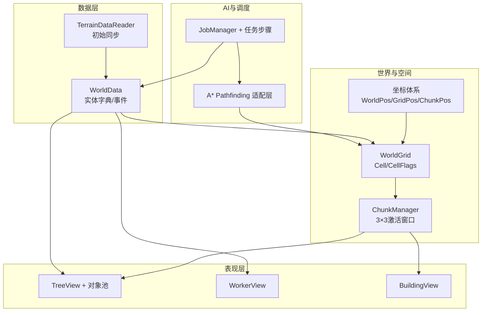
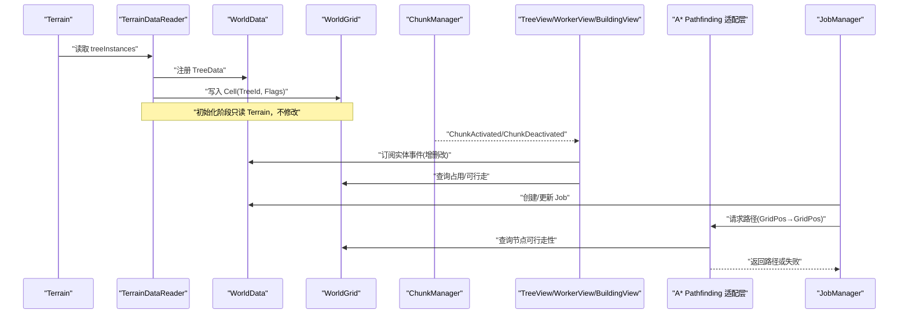
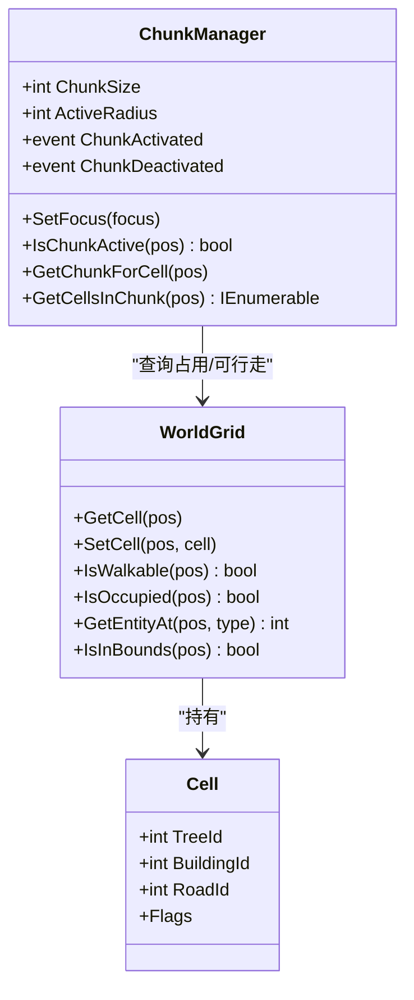
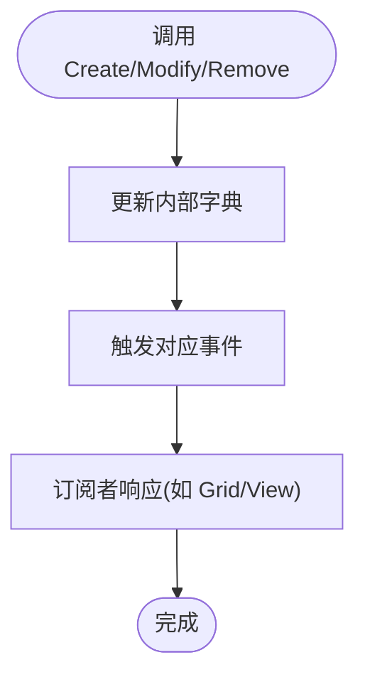
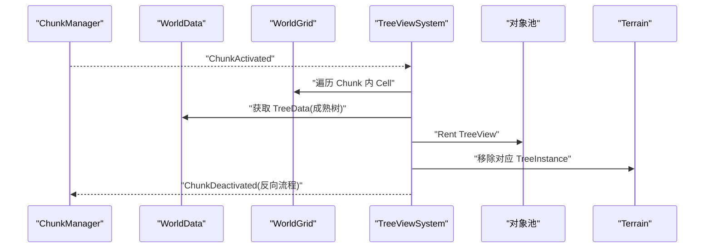
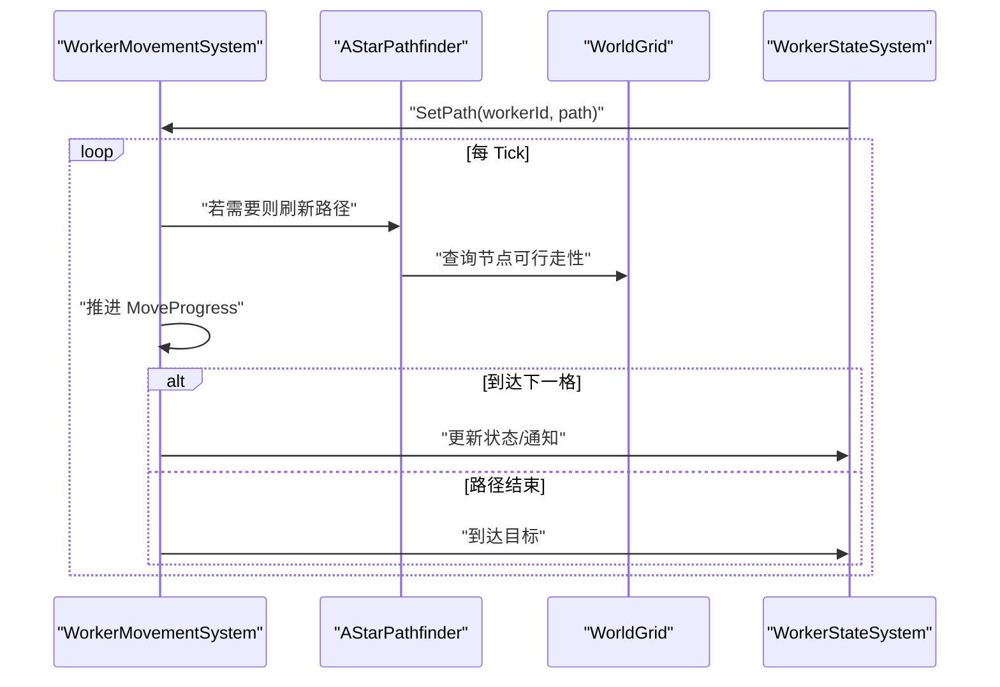
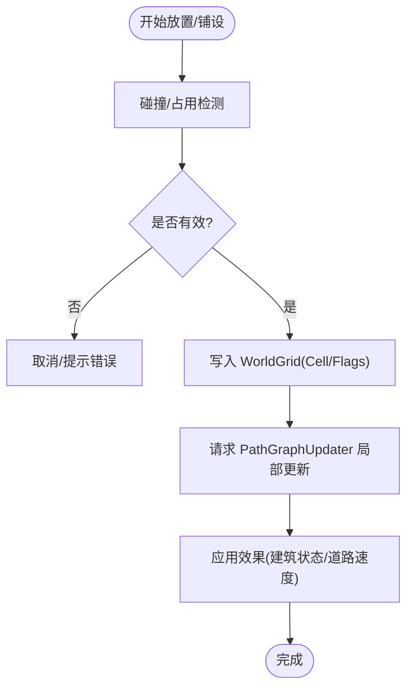
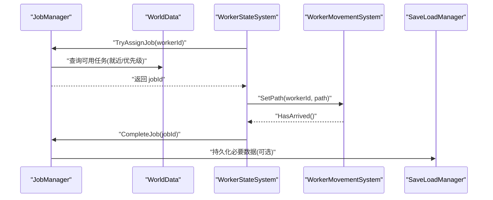
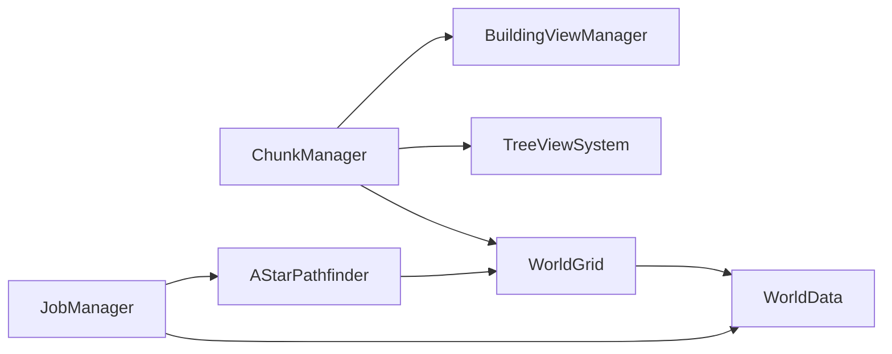

# 世界网格系统

<cite>
**本文引用的文件**   
- [unity_simulation_design_v1.md](file://.simulationdoc/unity_simulation_design_v1.md)
- [02-phase-1-world-grid.md](file://.simulationdoc/specs/02-phase-1-world-grid.md)
- [03-phase-2-tree-view.md](file://.simulationdoc/specs/03-phase-2-tree-view.md)
- [04-phase-3-worker-pathfinding.md](file://.simulationdoc/specs/04-phase-3-worker-pathfinding.md)
- [05-phase-4-building-road.md](file://.simulationdoc/specs/05-phase-4-building-road.md)
- [06-phase-5-simulation.md](file://.simulationdoc/specs/06-phase-5-simulation.md)
- [07-phase-6-optimization.md](file://.simulationdoc/specs/07-phase-6-optimization.md)
</cite>

## 目录
1. [引言](#引言)
2. [项目结构](#项目结构)
3. [核心组件](#核心组件)
4. [架构总览](#架构总览)
5. [详细组件分析](#详细组件分析)
6. [依赖分析](#依赖分析)
7. [性能考量](#性能考量)
8. [故障排查指南](#故障排查指南)
9. [结论](#结论)
10. [附录](#附录)

## 引言
本项目旨在构建一个面向大规模地形与实体的高性能模拟经营原型，参考《Against the Storm》《Timberborn》《Factorio》等作品的设计思路。核心目标包括：大地图地形、上万个树木资源、上百名工人、斜45°视角、建筑/道路/农田系统，以及高性能可扩展的架构。整体遵循“数据与表现分离”的原则：Terrain仅负责渲染，WorldGrid承担世界逻辑，A*仅负责寻路，GameObject仅用于表现层。

## 项目结构
从设计文档可知，代码按阶段（Phase）逐步实现，围绕“世界+网格”这一核心展开，后续依次叠加树木视图、工人寻路、建筑道路、任务模拟与优化。关键产出集中在以下模块：
- 坐标与空间：WorldPos/GridPos/ChunkPos 与 CoordinateUtility
- 空间数据库：CellFlags/Cell/WorldGrid
- 权威数据层：WorldData/IWorldEntity/IdGenerator
- 分区管理：Chunk/ChunkManager
- 初始同步：TerrainDataReader
- 树木系统：TreeData/TreeView/对象池/Terrain同步
- 工人系统：WorkerData/WorkerView/A*适配/移动/状态机
- 建筑与道路：Building/Road 数据、放置、生命周期、速度修正
- 任务与模拟：Job抽象、JobManager、四种任务、Tick管理、存档、UI
- 优化：监控、LOD、路径缓存、GC优化、GPU批处理

图表来源
- [02-phase-1-world-grid.md:36-132](file://.simulationdoc/specs/02-phase-1-world-grid.md#L36-L132)
- [02-phase-1-world-grid.md:183-223](file://.simulationdoc/specs/02-phase-1-world-grid.md#L183-L223)
- [02-phase-1-world-grid.md:224-252](file://.simulationdoc/specs/02-phase-1-world-grid.md#L224-L252)
- [03-phase-2-tree-view.md:45-94](file://.simulationdoc/specs/03-phase-2-tree-view.md#L45-L94)
- [03-phase-2-tree-view.md:215-249](file://.simulationdoc/specs/03-phase-2-tree-view.md#L215-L249)
- [04-phase-3-worker-pathfinding.md:117-158](file://.simulationdoc/specs/04-phase-3-worker-pathfinding.md#L117-L158)
- [05-phase-4-building-road.md:85-123](file://.simulationdoc/specs/05-phase-4-building-road.md#L85-L123)
- [06-phase-5-simulation.md:96-134](file://.simulationdoc/specs/06-phase-5-simulation.md#L96-L134)

章节来源
- [unity_simulation_design_v1.md:20-44](file://.simulationdoc/unity_simulation_design_v1.md#L20-L44)
- [02-phase-1-world-grid.md:12-35](file://.simulationdoc/specs/02-phase-1-world-grid.md#L12-L35)

## 核心组件
- 坐标系与工具
  - GridPos/ChunkPos/WorldPos 提供零分配双向转换，支撑所有空间计算。
- WorldGrid 空间数据库
  - Cell 记录 TreeId/BuildingId/RoadId/Flags；提供 IsWalkable/IsOccupied/GetEntityAt 等查询。
- WorldData 权威数据层
  - 以 ID 索引 Trees/Buildings/Roads/Workers，并提供增删改事件，供各系统订阅。
- ChunkManager 分区管理
  - 维护 3×3 激活窗口，触发 ChunkActivated/ChunkDeactivated 事件。
- Terrain 初始同步
  - 启动时读取 Terrain.treeInstances，生成 TreeData 并写入 Grid。

章节来源
- [02-phase-1-world-grid.md:36-78](file://.simulationdoc/specs/02-phase-1-world-grid.md#L36-L78)
- [02-phase-1-world-grid.md:79-132](file://.simulationdoc/specs/02-phase-1-world-grid.md#L79-L132)
- [02-phase-1-world-grid.md:133-182](file://.simulationdoc/specs/02-phase-1-world-grid.md#L133-L182)
- [02-phase-1-world-grid.md:183-223](file://.simulationdoc/specs/02-phase-1-world-grid.md#L183-L223)
- [02-phase-1-world-grid.md:224-252](file://.simulationdoc/specs/02-phase-1-world-grid.md#L224-L252)

## 架构总览
下图展示了从 Terrain 到 View 的数据流与控制流，体现“数据与表现分离”的核心原则。

图表来源
- [02-phase-1-world-grid.md:224-252](file://.simulationdoc/specs/02-phase-1-world-grid.md#L224-L252)
- [03-phase-2-tree-view.md:215-249](file://.simulationdoc/specs/03-phase-2-tree-view.md#L215-L249)
- [04-phase-3-worker-pathfinding.md:117-158](file://.simulationdoc/specs/04-phase-3-worker-pathfinding.md#L117-L158)
- [06-phase-5-simulation.md:96-134](file://.simulationdoc/specs/06-phase-5-simulation.md#L96-L134)

## 详细组件分析

### 世界网格与分区（WorldGrid + ChunkManager）
- 职责边界
  - WorldGrid：空间查询、占用管理、可行走判断。
  - ChunkManager：3×3 激活窗口，事件驱动下游系统按需加载/卸载。
- 数据结构
  - Cell：包含 TreeId/BuildingId/RoadId 与 Flags（Walkable/Occupied/HasTree/HasBuilding/HasRoad）。
- 对外接口要点
  - GetCell/SetCell/IsWalkable/IsOccupied/GetEntityAt/IsInBounds
- 验收标准
  - 读写稳定性、占用标记一致性、边界外查询安全。

图表来源
- [02-phase-1-world-grid.md:79-132](file://.simulationdoc/specs/02-phase-1-world-grid.md#L79-L132)
- [02-phase-1-world-grid.md:183-223](file://.simulationdoc/specs/02-phase-1-world-grid.md#L183-L223)

章节来源
- [02-phase-1-world-grid.md:79-132](file://.simulationdoc/specs/02-phase-1-world-grid.md#L79-L132)
- [02-phase-1-world-grid.md:183-223](file://.simulationdoc/specs/02-phase-1-world-grid.md#L183-L223)

### 权威数据层（WorldData）
- 职责边界
  - 集中管理 Trees/Buildings/Roads/Workers 的权威数据，提供唯一 ID 与事件通知。
- 关键能力
  - 增删改查、事件回调（TreeAdded/Removed/Modified 等），Tick 热路径优先使用原生事件避免 GC。
- 验收标准
  - ID 唯一递增、事件正确触发、删除后查询返回默认值。

图表来源
- [02-phase-1-world-grid.md:133-182](file://.simulationdoc/specs/02-phase-1-world-grid.md#L133-L182)

章节来源
- [02-phase-1-world-grid.md:133-182](file://.simulationdoc/specs/02-phase-1-world-grid.md#L133-L182)

### 树木系统与视图（TreeData + TreeView + 对象池 + Terrain 同步）
- 职责边界
  - TreeData：权威数据（位置、尺寸、HP、状态、类型）。
  - TreeView：仅表现（缩放/材质/动画），不存逻辑。
  - 对象池：预生成 300~500 实例，Rent/Return 无分配。
  - Terrain 同步：近处显示 View，远处恢复 Terrain；砍伐后两者都消失。
- 关键流程
  - Chunk 激活时遍历 Cell，为成熟树 Rent TreeView，并从 Terrain 移除对应 TreeInstance。
  - Chunk 停用时回收 TreeView，恢复 Terrain TreeInstance。
- 验收标准
  - 活跃 TreeView ≤ 500，无闪烁或重复渲染。

图表来源
- [03-phase-2-tree-view.md:45-94](file://.simulationdoc/specs/03-phase-2-tree-view.md#L45-L94)
- [03-phase-2-tree-view.md:215-249](file://.simulationdoc/specs/03-phase-2-tree-view.md#L215-L249)
- [03-phase-2-tree-view.md:251-285](file://.simulationdoc/specs/03-phase-2-tree-view.md#L251-L285)

章节来源
- [03-phase-2-tree-view.md:45-94](file://.simulationdoc/specs/03-phase-2-tree-view.md#L45-L94)
- [03-phase-2-tree-view.md:215-249](file://.simulationdoc/specs/03-phase-2-tree-view.md#L215-L249)
- [03-phase-2-tree-view.md:251-285](file://.simulationdoc/specs/03-phase-2-tree-view.md#L251-L285)

### 工人寻路与移动（Worker + A* + 移动系统 + 状态机）
- 职责边界
  - WorkerData：权威数据（位置、状态、当前任务、携带物品、移动进度）。
  - A* 适配层：将 WorldGrid 与 A* 插件对接，支持局部 Graph Update。
  - 移动系统：消费路径队列，推进 MoveProgress，受道路速度影响。
  - 状态机：Idle/Move/Work/Carry 切换，空闲时向 JobManager 要任务。
- 关键流程
  - 设置路径 → 逐格推进 → 到达目标 → 通知状态机。
- 验收标准
  - 可绕过障碍物寻路，不可达返回空路径；移动不穿墙；状态切换正确。

图表来源
- [04-phase-3-worker-pathfinding.md:117-158](file://.simulationdoc/specs/04-phase-3-worker-pathfinding.md#L117-L158)
- [04-phase-3-worker-pathfinding.md:159-190](file://.simulationdoc/specs/04-phase-3-worker-pathfinding.md#L159-L190)
- [04-phase-3-worker-pathfinding.md:191-224](file://.simulationdoc/specs/04-phase-3-worker-pathfinding.md#L191-L224)
- [04-phase-3-worker-pathfinding.md:225-266](file://.simulationdoc/specs/04-phase-3-worker-pathfinding.md#L225-L266)

章节来源
- [04-phase-3-worker-pathfinding.md:117-158](file://.simulationdoc/specs/04-phase-3-worker-pathfinding.md#L117-L158)
- [04-phase-3-worker-pathfinding.md:159-190](file://.simulationdoc/specs/04-phase-3-worker-pathfinding.md#L159-L190)
- [04-phase-3-worker-pathfinding.md:191-224](file://.simulationdoc/specs/04-phase-3-worker-pathfinding.md#L191-L224)
- [04-phase-3-worker-pathfinding.md:225-266](file://.simulationdoc/specs/04-phase-3-worker-pathfinding.md#L225-L266)

### 建筑与道路（Building + Road）
- 职责边界
  - 建筑：多尺寸 footprint 碰撞检测、幽灵预览、建造进度、生命周期。
  - 道路：按格铺设，影响移动速度，更新寻路图。
- 关键流程
  - 放置建筑：检测冲突 → 确认写入 Grid → 请求局部 Graph Update。
  - 铺设道路：写入 RoadId → 更新寻路图 → 应用速度倍率。
- 验收标准
  - 重叠建筑无法放置；道路连续铺设；拆除后释放 Grid 单元并更新寻路。

图表来源
- [05-phase-4-building-road.md:85-123](file://.simulationdoc/specs/05-phase-4-building-road.md#L85-L123)
- [05-phase-4-building-road.md:189-229](file://.simulationdoc/specs/05-phase-4-building-road.md#L189-L229)
- [05-phase-4-building-road.md:230-255](file://.simulationdoc/specs/05-phase-4-building-road.md#L230-L255)

章节来源
- [05-phase-4-building-road.md:85-123](file://.simulationdoc/specs/05-phase-4-building-road.md#L85-L123)
- [05-phase-4-building-road.md:189-229](file://.simulationdoc/specs/05-phase-4-building-road.md#L189-L229)
- [05-phase-4-building-road.md:230-255](file://.simulationdoc/specs/05-phase-4-building-road.md#L230-L255)

### 任务与模拟（Job + JobManager + Tick + 存档 + UI）
- 职责边界
  - Job 抽象：CutTree/Build/Farm/Haul 四种任务，状态 Pending/Assigned/InProgress/Completed/Cancelled。
  - JobManager：按距离和优先级分配任务，避免全局扫描，优先在激活 Chunk 或附近半径选择。
  - Tick 管理：固定频率更新，顺序明确，支持暂停/调速。
  - 存档：保存 WorldData，不保存 GameObject，带版本号。
  - UI：放置建筑/道路、标记树木、查看工人信息。
- 关键流程
  - 空闲工人 → 请求任务 → 分配 → 执行步骤 → 完成归档。
- 验收标准
  - 空闲工人能收到任务；一帧内状态一致；存档可恢复世界状态。

图表来源
- [06-phase-5-simulation.md:96-134](file://.simulationdoc/specs/06-phase-5-simulation.md#L96-L134)
- [06-phase-5-simulation.md:239-267](file://.simulationdoc/specs/06-phase-5-simulation.md#L239-L267)
- [06-phase-5-simulation.md:268-298](file://.simulationdoc/specs/06-phase-5-simulation.md#L268-L298)

章节来源
- [06-phase-5-simulation.md:96-134](file://.simulationdoc/specs/06-phase-5-simulation.md#L96-L134)
- [06-phase-5-simulation.md:239-267](file://.simulationdoc/specs/06-phase-5-simulation.md#L239-L267)
- [06-phase-5-simulation.md:268-298](file://.simulationdoc/specs/06-phase-5-simulation.md#L268-L298)

## 依赖分析
- 组件耦合与内聚
  - WorldGrid 与 WorldData 强耦合（Grid 反映数据变化，数据变更需写回 Grid）。
  - ChunkManager 与 View 系统松耦合（通过事件驱动）。
  - A* 适配层对 WorldGrid 有直接依赖，但封装了插件细节。
- 外部依赖
  - A* Pathfinding Project（寻路）、MonsterLove FSM（状态机）、MOYVDoTween（动画）、MPool/UniFramework.Pooling（对象池）、MEvent/QFramework（事件）、URP（渲染优化）。
- 潜在循环依赖
  - 应避免 View 直接修改 WorldData，防止循环；统一由系统层协调。

图表来源
- [02-phase-1-world-grid.md:79-132](file://.simulationdoc/specs/02-phase-1-world-grid.md#L79-L132)
- [04-phase-3-worker-pathfinding.md:117-158](file://.simulationdoc/specs/04-phase-3-worker-pathfinding.md#L117-L158)
- [06-phase-5-simulation.md:96-134](file://.simulationdoc/specs/06-phase-5-simulation.md#L96-L134)

章节来源
- [02-phase-1-world-grid.md:79-132](file://.simulationdoc/specs/02-phase-1-world-grid.md#L79-L132)
- [04-phase-3-worker-pathfinding.md:117-158](file://.simulationdoc/specs/04-phase-3-worker-pathfinding.md#L117-L158)
- [06-phase-5-simulation.md:96-134](file://.simulationdoc/specs/06-phase-5-simulation.md#L96-L134)

## 性能考量
- 目标预算
  - TreeView ≤ 500，Worker ≤ 100，CPU < 10ms，GPU < 8ms。
- 优化策略
  - TreeView 裁剪与 LOD，限制激活数量。
  - 寻路优化：路径缓存、按帧分摊请求、局部 Graph Update。
  - 任务调度优化：按 Chunk 建立任务索引，避免全图扫描。
  - 内存与 GC 优化：集合池、struct 替代 class、避免 LINQ/闭包。
  - GPU 与 Draw Call 优化：启用 URP GPU Instancing/SRP Batcher，合并材质。
- 验证方式
  - Profiler Markers、HUD 输出、Frame Debugger、最终性能报告。

章节来源
- [07-phase-6-optimization.md:34-45](file://.simulationdoc/specs/07-phase-6-optimization.md#L34-L45)
- [07-phase-6-optimization.md:46-74](file://.simulationdoc/specs/07-phase-6-optimization.md#L46-L74)
- [07-phase-6-optimization.md:75-92](file://.simulationdoc/specs/07-phase-6-optimization.md#L75-L92)
- [07-phase-6-optimization.md:93-115](file://.simulationdoc/specs/07-phase-6-optimization.md#L93-L115)
- [07-phase-6-optimization.md:116-133](file://.simulationdoc/specs/07-phase-6-optimization.md#L116-L133)
- [07-phase-6-optimization.md:134-158](file://.simulationdoc/specs/07-phase-6-optimization.md#L134-L158)
- [07-phase-6-optimization.md:159-176](file://.simulationdoc/specs/07-phase-6-optimization.md#L159-L176)
- [07-phase-6-optimization.md:177-201](file://.simulationdoc/specs/07-phase-6-optimization.md#L177-L201)

## 故障排查指南
- 常见问题定位
  - 坐标转换异常：检查 GridPos/ChunkPos/WorldPos 的双向转换与边界处理。
  - WorldGrid 性能瓶颈：评估数组/字典 backing 的选择与批量操作。
  - 寻路失败：确认 A* 插件配置与 GraphUpdateObject 的局部更新范围。
  - 树木丢失或重复：核对 Chunk 激活/停用与 Terrain TreeInstance 同步逻辑。
  - 任务分配卡顿：检查 JobManager 的就近搜索与 Chunk 索引是否正确。
- 建议手段
  - 使用 MDebug/Profiler 输出关键指标。
  - 针对热点路径进行 GC.Alloc 分析与集合池替换。
  - 使用 Frame Debugger 分析 Draw Call 与 SetPass Call。

章节来源
- [02-phase-1-world-grid.md:263-267](file://.simulationdoc/specs/02-phase-1-world-grid.md#L263-L267)
- [03-phase-2-tree-view.md:295-300](file://.simulationdoc/specs/03-phase-2-tree-view.md#L295-L300)
- [04-phase-3-worker-pathfinding.md:277-282](file://.simulationdoc/specs/04-phase-3-worker-pathfinding.md#L277-L282)
- [05-phase-4-building-road.md:267-272](file://.simulationdoc/specs/05-phase-4-building-road.md#L267-L272)
- [06-phase-5-simulation.md:338-343](file://.simulationdoc/specs/06-phase-5-simulation.md#L338-L343)

## 结论
本方案以 WorldGrid 为核心，结合 WorldData 权威数据层与 ChunkManager 分区管理，构建了可扩展、高性能的世界网格系统。通过数据与表现分离、对象池与局部更新、任务就近分配与 Tick 统一管理，能够在 10000+ 树木与 100+ 工人的规模下稳定运行。后续优化聚焦于 LOD、路径缓存、GC 与 GPU 批处理，确保达到 CPU/GPU 预算。

## 附录
- 开发阶段规划
  - Phase 1：World + Grid
  - Phase 2：Tree + View
  - Phase 3：Worker + A*
  - Phase 4：Building + Road
  - Phase 5：Simulation
  - Phase 6：Optimization

章节来源
- [unity_simulation_design_v1.md:182-196](file://.simulationdoc/unity_simulation_design_v1.md#L182-L196)