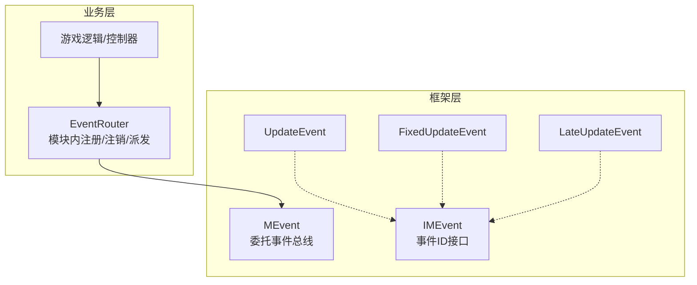
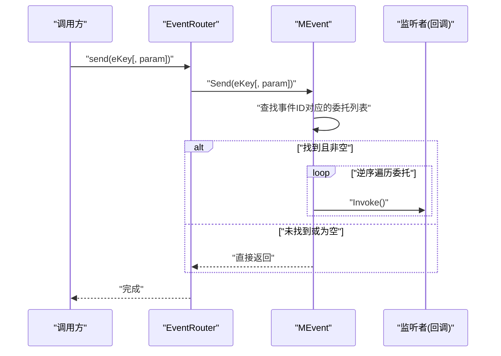
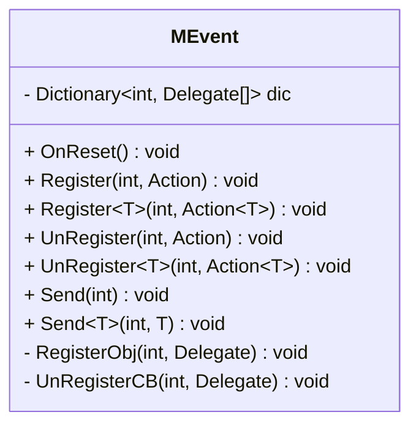
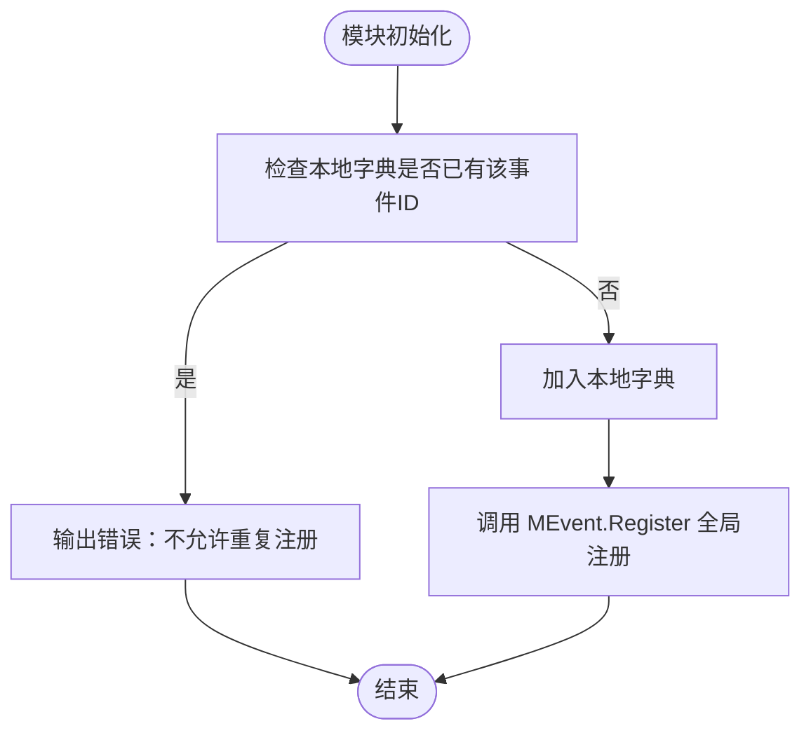
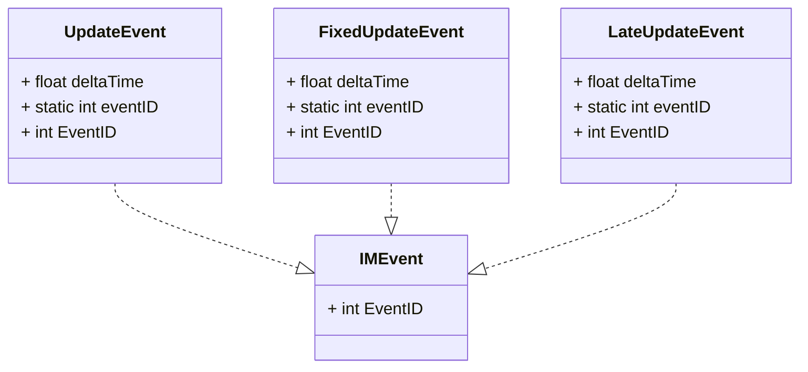
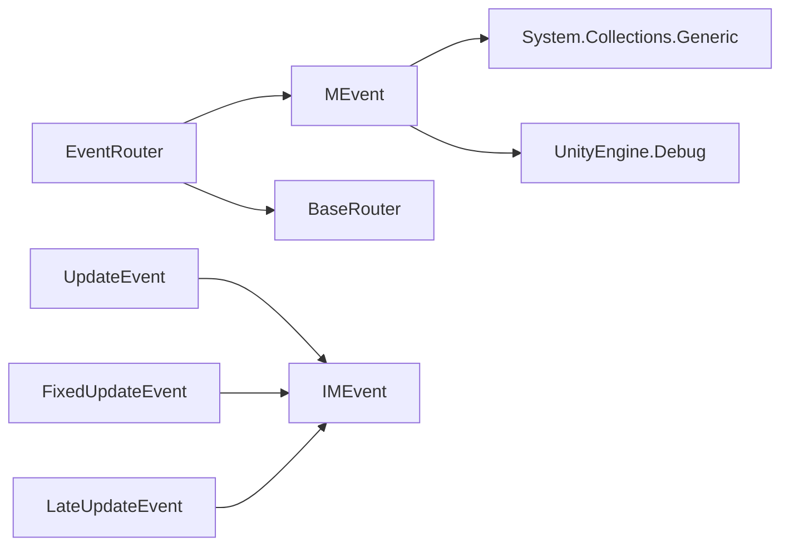

# 事件系统 (MEvent)

<cite>
**本文引用的文件**   
- [MEvent.cs](file://Assets/Game/Framework/MEvent/MEvent.cs)
- [EventRouter.cs](file://Assets/Game/Scripts/Game/Runtime/Logic/Router/EventRouter.cs)
- [IMEvent.cs](file://Assets/Game/Framework/Qframework/Runtime/Moyv/Events/IMEvent.cs)
- [UpdateEvent.cs](file://Assets/Game/Framework/Qframework/Runtime/Moyv/Events/UpdateEvent.cs)
- [FixedUpdateEvent.cs](file://Assets/Game/Framework/Qframework/Runtime/Moyv/Events/FixedUpdateEvent.cs)
- [LateUpdateEvent.cs](file://Assets/Game/Framework/Qframework/Runtime/Moyv/Events/LateUpdateEvent.cs)
</cite>

## 目录
1. [简介](#简介)
2. [项目结构](#项目结构)
3. [核心组件](#核心组件)
4. [架构总览](#架构总览)
5. [详细组件分析](#详细组件分析)
6. [依赖关系分析](#依赖关系分析)
7. [性能与内存优化](#性能与内存优化)
8. [常见问题与排错](#常见问题与排错)
9. [最佳实践与使用模式](#最佳实践与使用模式)
10. [结论](#结论)
11. [附录：API 速查](#附录api-速查)

## 简介
本章节面向 SimulationClient 的事件系统 MEvent，提供从入门到进阶的完整文档。MEvent 是一个基于委托（Delegate）的轻量级发布订阅机制，支持无参与单参事件，通过整型事件 ID 进行路由分发。它被上层 EventRouter 封装，用于模块间解耦通信，并配合 Unity 生命周期与对象池进行资源管理。

## 项目结构
MEvent 位于框架层，供业务逻辑通过统一的路由器 EventRouter 访问；同时存在一套基于 IMEvent 接口的强类型事件定义（QFramework 风格），可用于更严格的类型安全场景。

图表来源
- [MEvent.cs:1-288](file://Assets/Game/Framework/MEvent/MEvent.cs#L1-L288)
- [EventRouter.cs:1-90](file://Assets/Game/Scripts/Game/Runtime/Logic/Router/EventRouter.cs#L1-L90)
- [IMEvent.cs:1-4](file://Assets/Game/Framework/Qframework/Runtime/Moyv/Events/IMEvent.cs#L1-L4)
- [UpdateEvent.cs:1-7](file://Assets/Game/Framework/Qframework/Runtime/Moyv/Events/UpdateEvent.cs#L1-L7)
- [FixedUpdateEvent.cs:1-7](file://Assets/Game/Framework/Qframework/Runtime/Moyv/Events/FixedUpdateEvent.cs#L1-L7)
- [LateUpdateEvent.cs:1-7](file://Assets/Game/Framework/Qframework/Runtime/Moyv/Events/LateUpdateEvent.cs#L1-L7)

章节来源
- [MEvent.cs:1-288](file://Assets/Game/Framework/MEvent/MEvent.cs#L1-L288)
- [EventRouter.cs:1-90](file://Assets/Game/Scripts/Game/Runtime/Logic/Router/EventRouter.cs#L1-L90)
- [IMEvent.cs:1-4](file://Assets/Game/Framework/Qframework/Runtime/Moyv/Events/IMEvent.cs#L1-L4)
- [UpdateEvent.cs:1-7](file://Assets/Game/Framework/Qframework/Runtime/Moyv/Events/UpdateEvent.cs#L1-L7)
- [FixedUpdateEvent.cs:1-7](file://Assets/Game/Framework/Qframework/Runtime/Moyv/Events/FixedUpdateEvent.cs#L1-L7)
- [LateUpdateEvent.cs:1-7](file://Assets/Game/Framework/Qframework/Runtime/Moyv/Events/LateUpdateEvent.cs#L1-L7)

## 核心组件
- MEvent：静态事件总线，维护事件ID到委托列表的映射，提供 Register、UnRegister、Send 等 API。
- EventRouter：模块级路由器，负责在模块生命周期中集中注册/注销事件，避免重复注册与泄漏。
- IMEvent 及 Update/FixedUpdate/LateUpdate 事件：强类型事件定义示例，展示以结构体承载事件数据并通过固定事件ID进行分发的模式。

章节来源
- [MEvent.cs:1-288](file://Assets/Game/Framework/MEvent/MEvent.cs#L1-L288)
- [EventRouter.cs:1-90](file://Assets/Game/Scripts/Game/Runtime/Logic/Router/EventRouter.cs#L1-L90)
- [IMEvent.cs:1-4](file://Assets/Game/Framework/Qframework/Runtime/Moyv/Events/IMEvent.cs#L1-L4)
- [UpdateEvent.cs:1-7](file://Assets/Game/Framework/Qframework/Runtime/Moyv/Events/UpdateEvent.cs#L1-L7)
- [FixedUpdateEvent.cs:1-7](file://Assets/Game/Framework/Qframework/Runtime/Moyv/Events/FixedUpdateEvent.cs#L1-L7)
- [LateUpdateEvent.cs:1-7](file://Assets/Game/Framework/Qframework/Runtime/Moyv/Events/LateUpdateEvent.cs#L1-L7)

## 架构总览
MEvent 采用“字典 + 委托列表”的简单高效实现：
- 事件注册：将委托加入对应事件ID的列表，若已存在则告警避免重复。
- 事件发送：按事件ID取出委托列表，逆序遍历调用，保证后注册的先执行。
- 参数传递：当前版本支持无参与单参两种签名，内部通过 as 转换并调用。

图表来源
- [EventRouter.cs:77-85](file://Assets/Game/Scripts/Game/Runtime/Logic/Router/EventRouter.cs#L77-L85)
- [MEvent.cs:128-165](file://Assets/Game/Framework/MEvent/MEvent.cs#L128-L165)

## 详细组件分析

### MEvent 类
- 数据结构
  - 内部使用字典<int, List<Delegate>> 存储事件ID到委托集合的映射。
  - OnReset 清空所有事件，便于场景切换或热重载时释放引用。
- 注册与取消注册
  - Register<T>(eventId, cb)：支持无参 Action 与单参 Action<T>。
  - UnRegister<T>(eventId, cb)：移除指定委托。
  - 重复注册会输出警告日志，防止同一回调多次触发。
- 事件发送
  - Send(eventId)：仅调用无参委托。
  - Send<T>(eventId, param)：调用单参委托；若类型不匹配会记录错误日志。
- 设计要点
  - 逆序遍历：后注册先执行，符合常见订阅模型预期。
  - 弱类型存储：统一以 Delegate 保存，发送时再按签名转换，简化 API 数量。

图表来源
- [MEvent.cs:11-165](file://Assets/Game/Framework/MEvent/MEvent.cs#L11-L165)

章节来源
- [MEvent.cs:11-165](file://Assets/Game/Framework/MEvent/MEvent.cs#L11-L165)

### EventRouter 模块路由器
- 职责
  - 为每个模块维护一份本地注册表，避免跨模块重复注册。
  - 在 OnRecycle/OnReset 中统一注销，确保对象回收时不会残留引用。
- 关键方法
  - Register / Register<T>：检查本地是否已注册，未注册则写入本地字典并转发至 MEvent.Register。
  - UnRegister / UnRegisterAll：根据本地字典向 MEvent.UnRegisterCB 注销并清理本地缓存。
  - send / send<T>：透传至 MEvent.Send。

图表来源
- [EventRouter.cs:24-48](file://Assets/Game/Scripts/Game/Runtime/Logic/Router/EventRouter.cs#L24-L48)

章节来源
- [EventRouter.cs:11-21](file://Assets/Game/Scripts/Game/Runtime/Logic/Router/EventRouter.cs#L11-L21)
- [EventRouter.cs:24-48](file://Assets/Game/Scripts/Game/Runtime/Logic/Router/EventRouter.cs#L24-L48)
- [EventRouter.cs:55-72](file://Assets/Game/Scripts/Game/Runtime/Logic/Router/EventRouter.cs#L55-L72)
- [EventRouter.cs:77-85](file://Assets/Game/Scripts/Game/Runtime/Logic/Router/EventRouter.cs#L77-L85)

### 强类型事件（IMEvent 系列）
- IMEvent 接口定义了事件ID属性，便于统一管理事件常量。
- UpdateEvent、FixedUpdateEvent、LateUpdateEvent 作为示例，展示了如何在每帧周期中携带 deltaTime 等上下文信息。
- 这些事件通常配合独立的事件分发器使用（例如 QFramework 的事件系统），与 MEvent 的整型+委托方式互补。

图表来源
- [IMEvent.cs:1-4](file://Assets/Game/Framework/Qframework/Runtime/Moyv/Events/IMEvent.cs#L1-L4)
- [UpdateEvent.cs:1-7](file://Assets/Game/Framework/Qframework/Runtime/Moyv/Events/UpdateEvent.cs#L1-L7)
- [FixedUpdateEvent.cs:1-7](file://Assets/Game/Framework/Qframework/Runtime/Moyv/Events/FixedUpdateEvent.cs#L1-L7)
- [LateUpdateEvent.cs:1-7](file://Assets/Game/Framework/Qframework/Runtime/Moyv/Events/LateUpdateEvent.cs#L1-L7)

章节来源
- [IMEvent.cs:1-4](file://Assets/Game/Framework/Qframework/Runtime/Moyv/Events/IMEvent.cs#L1-L4)
- [UpdateEvent.cs:1-7](file://Assets/Game/Framework/Qframework/Runtime/Moyv/Events/UpdateEvent.cs#L1-L7)
- [FixedUpdateEvent.cs:1-7](file://Assets/Game/Framework/Qframework/Runtime/Moyv/Events/FixedUpdateEvent.cs#L1-L7)
- [LateUpdateEvent.cs:1-7](file://Assets/Game/Framework/Qframework/Runtime/Moyv/Events/LateUpdateEvent.cs#L1-L7)

## 依赖关系分析
- MEvent 依赖 System.Collections.Generic 与 UnityEngine.Debug。
- EventRouter 依赖 MEvent 以及模块基类 BaseRouter（用于生命周期钩子）。
- 强类型事件仅依赖 IMEvent 接口，属于纯数据载体。

图表来源
- [MEvent.cs:1-4](file://Assets/Game/Framework/MEvent/MEvent.cs#L1-L4)
- [EventRouter.cs:1-6](file://Assets/Game/Scripts/Game/Runtime/Logic/Router/EventRouter.cs#L1-L6)
- [IMEvent.cs:1-4](file://Assets/Game/Framework/Qframework/Runtime/Moyv/Events/IMEvent.cs#L1-L4)

章节来源
- [MEvent.cs:1-4](file://Assets/Game/Framework/MEvent/MEvent.cs#L1-L4)
- [EventRouter.cs:1-6](file://Assets/Game/Scripts/Game/Runtime/Logic/Router/EventRouter.cs#L1-L6)
- [IMEvent.cs:1-4](file://Assets/Game/Framework/Qframework/Runtime/Moyv/Events/IMEvent.cs#L1-L4)

## 性能与内存优化
- 时间复杂度
  - 注册/注销：O(n)，n 为该事件已注册的回调数（Contains/Remove 线性扫描）。
  - 发送：O(n)，逆序遍历并调用回调。
- 空间占用
  - 字典键为整型，值委托列表按需增长；注意避免大量短生命周期事件导致频繁分配。
- 优化建议
  - 控制单事件回调数量，必要时合并相关事件。
  - 使用对象池复用事件载荷（当使用强类型事件时），减少 GC。
  - 在场景切换或模块销毁时务必调用 UnRegisterAll，避免委托持有对象引用导致内存泄漏。
  - 对高频事件（如 Update/FixedUpdate）谨慎注册过多回调，考虑批处理或节流。

[本节为通用性能讨论，无需具体文件引用]

## 常见问题与排错
- 重复注册警告
  - 现象：控制台出现“回调被重复注册”的警告。
  - 原因：同一回调在同一事件上多次注册。
  - 解决：使用 EventRouter.Register 前确保唯一性；或在模块卸载时调用 UnRegisterAll。
  - 参考路径
    - [MEvent.cs:66-73](file://Assets/Game/Framework/MEvent/MEvent.cs#L66-L73)
    - [EventRouter.cs:26-34](file://Assets/Game/Scripts/Game/Runtime/Logic/Router/EventRouter.cs#L26-L34)
- 类型不匹配错误
  - 现象：发送带参事件时报错“请保持参数类型注册和发送时一致”。
  - 原因：注册与发送时的泛型类型不一致。
  - 解决：统一事件参数类型；建议使用常量或枚举集中管理事件ID与参数类型。
  - 参考路径
    - [MEvent.cs:154-161](file://Assets/Game/Framework/MEvent/MEvent.cs#L154-L161)
- 事件未触发
  - 排查步骤：确认事件ID一致；确认已正确注册；确认发送时机在注册之后；检查是否有提前 UnRegister。
  - 参考路径
    - [MEvent.cs:128-141](file://Assets/Game/Framework/MEvent/MEvent.cs#L128-L141)
- 生命周期与对象回收
  - 建议在对象的 OnRecycle/OnDestroy 中调用 EventRouter.UnRegisterAll，避免悬挂引用。
  - 参考路径
    - [EventRouter.cs:11-21](file://Assets/Game/Scripts/Game/Runtime/Logic/Router/EventRouter.cs#L11-L21)

章节来源
- [MEvent.cs:66-73](file://Assets/Game/Framework/MEvent/MEvent.cs#L66-L73)
- [MEvent.cs:154-161](file://Assets/Game/Framework/MEvent/MEvent.cs#L154-L161)
- [MEvent.cs:128-141](file://Assets/Game/Framework/MEvent/MEvent.cs#L128-L141)
- [EventRouter.cs:11-21](file://Assets/Game/Scripts/Game/Runtime/Logic/Router/EventRouter.cs#L11-L21)
- [EventRouter.cs:26-34](file://Assets/Game/Scripts/Game/Runtime/Logic/Router/EventRouter.cs#L26-L34)

## 最佳实践与使用模式
- 使用 EventRouter 管理模块内事件
  - 优点：避免重复注册、集中注销、清晰的生命周期边界。
  - 参考路径
    - [EventRouter.cs:24-48](file://Assets/Game/Scripts/Game/Runtime/Logic/Router/EventRouter.cs#L24-L48)
    - [EventRouter.cs:55-72](file://Assets/Game/Scripts/Game/Runtime/Logic/Router/EventRouter.cs#L55-L72)
- 事件ID管理
  - 建议集中定义事件ID常量，避免魔法数字；结合 IMEvent 可进一步约束事件标识。
  - 参考路径
    - [IMEvent.cs:1-4](file://Assets/Game/Framework/Qframework/Runtime/Moyv/Events/IMEvent.cs#L1-L4)
- 与 Unity 生命周期集成
  - 在 Awake/Start 注册，在 OnDestroy/OnDisable 注销；或使用对象池时在 Recycle 阶段注销。
  - 参考路径
    - [EventRouter.cs:11-21](file://Assets/Game/Scripts/Game/Runtime/Logic/Router/EventRouter.cs#L11-L21)
- 与对象池集成
  - 对象入池前调用 UnRegisterAll，出池后重新注册所需事件，避免跨实例共享回调导致的异常行为。
- 高频事件优化
  - 合并多个细粒度事件为一个大事件；或将回调放入队列批量处理，降低每帧开销。
- 调试与日志
  - 利用内置警告/错误日志快速定位重复注册与类型不匹配问题。
  - 参考路径
    - [MEvent.cs:72-73](file://Assets/Game/Framework/MEvent/MEvent.cs#L72-L73)
    - [MEvent.cs:160-161](file://Assets/Game/Framework/MEvent/MEvent.cs#L160-L161)

章节来源
- [EventRouter.cs:24-48](file://Assets/Game/Scripts/Game/Runtime/Logic/Router/EventRouter.cs#L24-L48)
- [EventRouter.cs:55-72](file://Assets/Game/Scripts/Game/Runtime/Logic/Router/EventRouter.cs#L55-L72)
- [EventRouter.cs:11-21](file://Assets/Game/Scripts/Game/Runtime/Logic/Router/EventRouter.cs#L11-L21)
- [IMEvent.cs:1-4](file://Assets/Game/Framework/Qframework/Runtime/Moyv/Events/IMEvent.cs#L1-L4)
- [MEvent.cs:72-73](file://Assets/Game/Framework/MEvent/MEvent.cs#L72-L73)
- [MEvent.cs:160-161](file://Assets/Game/Framework/MEvent/MEvent.cs#L160-L161)

## 结论
MEvent 提供了简洁高效的委托式事件总线，适合中小规模项目的模块间通信。配合 EventRouter 可实现模块级的注册管理与生命周期绑定，避免常见的重复注册与内存泄漏问题。对于需要更强类型安全的场景，可结合 IMEvent 及其派生事件进行扩展。在生产环境中，应关注事件数量、回调数量与频率，并结合对象池与批处理策略进行性能优化。

[本节为总结性内容，无需具体文件引用]

## 附录：API 速查
- 注册
  - Register(int eventId, Action cb)
  - Register<T>(int eventId, Action<T> cb)
- 取消注册
  - UnRegister(int eventId, Action cb)
  - UnRegister<T>(int eventId, Action<T> cb)
  - UnRegisterCB(int eventId, Delegate cb)
- 发送
  - Send(int eventId)
  - Send<T>(int eventId, T param)
- 重置
  - OnReset()：清空所有事件与回调

章节来源
- [MEvent.cs:25-33](file://Assets/Game/Framework/MEvent/MEvent.cs#L25-L33)
- [MEvent.cs:81-89](file://Assets/Game/Framework/MEvent/MEvent.cs#L81-L89)
- [MEvent.cs:116-126](file://Assets/Game/Framework/MEvent/MEvent.cs#L116-L126)
- [MEvent.cs:128-165](file://Assets/Game/Framework/MEvent/MEvent.cs#L128-L165)
- [MEvent.cs:15-23](file://Assets/Game/Framework/MEvent/MEvent.cs#L15-L23)