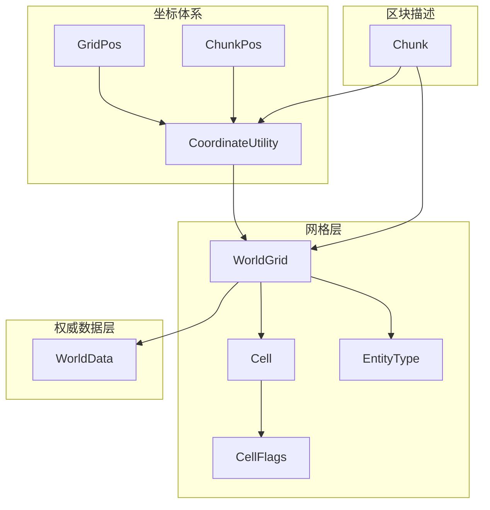
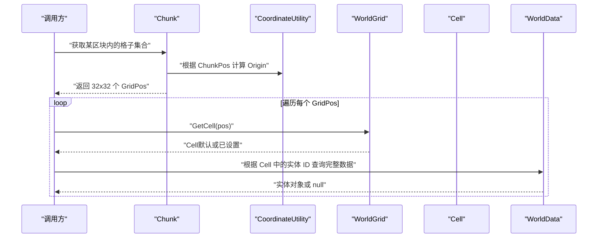
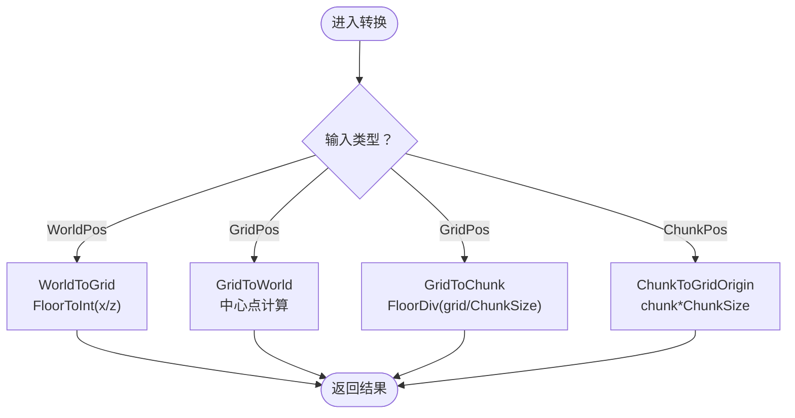
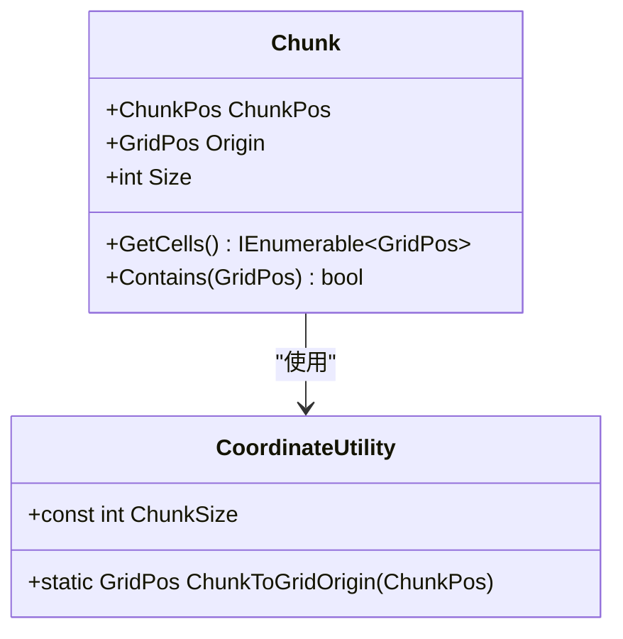
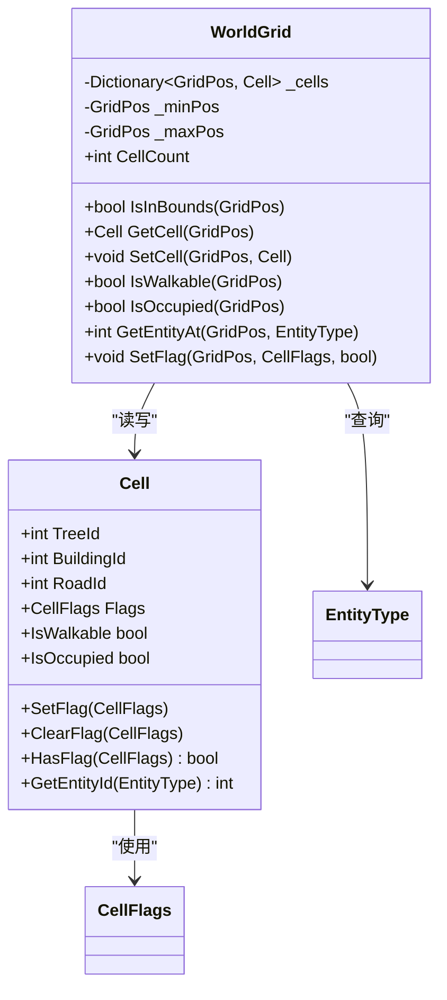
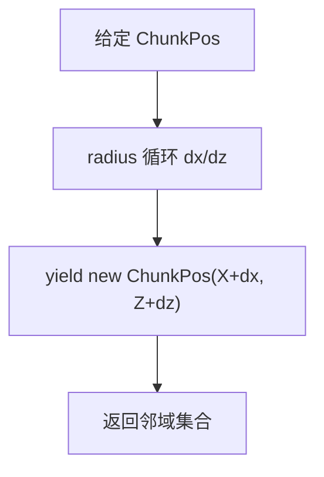
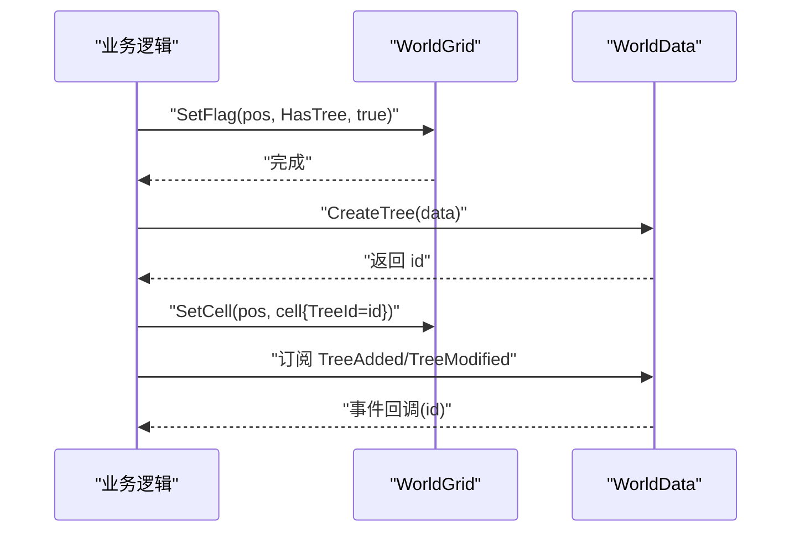
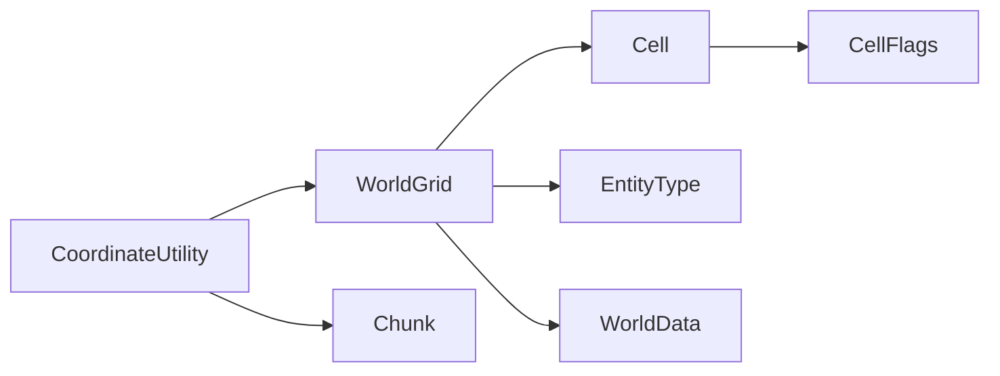

# 区块管理系统

<cite>
**本文引用的文件**
- [Chunk.cs](file://Assets/Game/Scripts/Simulation/World/Chunk/Chunk.cs)
- [ChunkPos.cs](file://Assets/Game/Scripts/Simulation/World/Coordinates/ChunkPos.cs)
- [CoordinateUtility.cs](file://Assets/Game/Scripts/Simulation/World/Coordinates/CoordinateUtility.cs)
- [GridPos.cs](file://Assets/Game/Scripts/Simulation/World/Coordinates/GridPos.cs)
- [Cell.cs](file://Assets/Game/Scripts/Simulation/World/Grid/Cell.cs)
- [CellFlags.cs](file://Assets/Game/Scripts/Simulation/World/Grid/CellFlags.cs)
- [EntityType.cs](file://Assets/Game/Scripts/Simulation/World/Grid/EntityType.cs)
- [WorldGrid.cs](file://Assets/Game/Scripts/Simulation/World/Grid/WorldGrid.cs)
- [WorldData.cs](file://Assets/Game/Scripts/Simulation/World/Data/WorldData.cs)
</cite>

## 目录
1. [简介](#简介)
2. [项目结构](#项目结构)
3. [核心组件](#核心组件)
4. [架构总览](#架构总览)
5. [详细组件分析](#详细组件分析)
6. [依赖关系分析](#依赖关系分析)
7. [性能考量](#性能考量)
8. [故障排查指南](#故障排查指南)
9. [结论](#结论)
10. [附录](#附录)

## 简介
本文件聚焦于“区块管理系统”，围绕空间分块（Chunk）、网格索引（GridPos）、坐标转换（CoordinateUtility）与格子状态存储（WorldGrid/Cell）展开，说明其在模拟世界中的职责、数据流与交互方式。系统采用“只读描述 + 按需生成”的轻量设计：Chunk 仅作为区域描述符，不持有 Cell 数据；实际格子状态由 WorldGrid 以字典形式按 GridPos 索引管理，边界外或未被显式设置的格子遵循默认语义。

## 项目结构
与区块管理相关的代码主要位于 Simulation/World 子目录中，分为坐标体系、网格与实体数据三层：
- 坐标体系：GridPos、ChunkPos、WorldPos（通过 CoordinateUtility 进行互转）
- 网格层：WorldGrid（世界空间数据库）、Cell（格子状态）、CellFlags（位标记）、EntityType（实体类型）
- 区块描述：Chunk（区域描述符）
- 权威数据层：WorldData（实体完整数据与事件）

图表来源
- [CoordinateUtility.cs:28-139](file://Assets/Game/Scripts/Simulation/World/Coordinates/CoordinateUtility.cs#L28-L139)
- [GridPos.cs:22-79](file://Assets/Game/Scripts/Simulation/World/Coordinates/GridPos.cs#L22-L79)
- [ChunkPos.cs:21-65](file://Assets/Game/Scripts/Simulation/World/Coordinates/ChunkPos.cs#L21-L65)
- [WorldGrid.cs:24-163](file://Assets/Game/Scripts/Simulation/World/Grid/WorldGrid.cs#L24-L163)
- [Cell.cs:23-83](file://Assets/Game/Scripts/Simulation/World/Grid/Cell.cs#L23-L83)
- [CellFlags.cs:33-44](file://Assets/Game/Scripts/Simulation/World/Grid/CellFlags.cs#L33-L44)
- [EntityType.cs:7-15](file://Assets/Game/Scripts/Simulation/World/Grid/EntityType.cs#L7-L15)
- [Chunk.cs:22-66](file://Assets/Game/Scripts/Simulation/World/Chunk/Chunk.cs#L22-L66)
- [WorldData.cs:26-265](file://Assets/Game/Scripts/Simulation/World/Data/WorldData.cs#L26-L265)

章节来源
- [CoordinateUtility.cs:28-139](file://Assets/Game/Scripts/Simulation/World/Coordinates/CoordinateUtility.cs#L28-L139)
- [WorldGrid.cs:24-163](file://Assets/Game/Scripts/Simulation/World/Grid/WorldGrid.cs#L24-L163)
- [Chunk.cs:22-66](file://Assets/Game/Scripts/Simulation/World/Chunk/Chunk.cs#L22-L66)

## 核心组件
- Chunk：只读的区域描述符，固定大小为 32×32 格，提供遍历与包含判断方法，不持有 Cell 数据。
- ChunkPos：区块索引坐标，支持半径邻域枚举，便于激活窗口计算。
- GridPos：格子整数索引坐标，提供四方向常量与运算符，适合热路径零分配使用。
- CoordinateUtility：三套坐标系之间的双向转换工具，含负数地板除法实现，保证坐标映射正确性。
- WorldGrid：世界空间数据库，维护 Dictionary<GridPos, Cell>，提供查询、设置、标记修改与边界检查。
- Cell：格子状态结构体，包含实体 ID 字段与 Flags 位掩码，提供便捷标记操作与查询。
- CellFlags：位标记枚举，定义 Walkable/Occupied/HasTree/HasBuilding/HasRoad 等标志。
- EntityType：实体类型枚举，用于从 Cell 中按类型取对应实体 ID。
- WorldData：权威数据层，按 ID 管理 Tree/Building/Road/Worker 的 CRUD 与事件通知。

章节来源
- [Chunk.cs:22-66](file://Assets/Game/Scripts/Simulation/World/Chunk/Chunk.cs#L22-L66)
- [ChunkPos.cs:21-65](file://Assets/Game/Scripts/Simulation/World/Coordinates/ChunkPos.cs#L21-L65)
- [GridPos.cs:22-79](file://Assets/Game/Scripts/Simulation/World/Coordinates/GridPos.cs#L22-L79)
- [CoordinateUtility.cs:28-139](file://Assets/Game/Scripts/Simulation/World/Coordinates/CoordinateUtility.cs#L28-L139)
- [WorldGrid.cs:24-163](file://Assets/Game/Scripts/Simulation/World/Grid/WorldGrid.cs#L24-L163)
- [Cell.cs:23-83](file://Assets/Game/Scripts/Simulation/World/Grid/Cell.cs#L23-L83)
- [CellFlags.cs:33-44](file://Assets/Game/Scripts/Simulation/World/Grid/CellFlags.cs#L33-L44)
- [EntityType.cs:7-15](file://Assets/Game/Scripts/Simulation/World/Grid/EntityType.cs#L7-L15)
- [WorldData.cs:26-265](file://Assets/Game/Scripts/Simulation/World/Data/WorldData.cs#L26-L265)

## 架构总览
区块管理系统的核心思想是“描述与数据分离”：
- 描述层：Chunk 仅描述区域范围与遍历能力，零 GC 开销。
- 数据层：WorldGrid 负责格子状态与空间查询，Cell 承载具体信息。
- 坐标层：CoordinateUtility 统一坐标转换，确保跨层级映射一致。
- 权威数据层：WorldData 提供实体全量数据与事件，供渲染/逻辑订阅。

图表来源
- [Chunk.cs:33-53](file://Assets/Game/Scripts/Simulation/World/Chunk/Chunk.cs#L33-L53)
- [CoordinateUtility.cs:103-106](file://Assets/Game/Scripts/Simulation/World/Coordinates/CoordinateUtility.cs#L103-L106)
- [WorldGrid.cs:83-89](file://Assets/Game/Scripts/Simulation/World/Grid/WorldGrid.cs#L83-L89)
- [WorldData.cs:232-242](file://Assets/Game/Scripts/Simulation/World/Data/WorldData.cs#L232-L242)

## 详细组件分析

### 坐标与转换（CoordinateUtility）
- 作用：在 WorldPos、GridPos、ChunkPos 之间进行双向转换，并提供 FloorDiv 处理负数整除。
- 关键点：
  - 格子中心点为 ((X+0.5)*cellSize, Y, (Z+0.5)*cellSize)。
  - 负数必须用 FloorDiv，避免向零取整导致归属错误。
  - 所有方法均为零分配，适合热路径。

图表来源
- [CoordinateUtility.cs:52-57](file://Assets/Game/Scripts/Simulation/World/Coordinates/CoordinateUtility.cs#L52-L57)
- [CoordinateUtility.cs:68-84](file://Assets/Game/Scripts/Simulation/World/Coordinates/CoordinateUtility.cs#L68-L84)
- [CoordinateUtility.cs:91-96](file://Assets/Game/Scripts/Simulation/World/Coordinates/CoordinateUtility.cs#L91-L96)
- [CoordinateUtility.cs:103-106](file://Assets/Game/Scripts/Simulation/World/Coordinates/CoordinateUtility.cs#L103-L106)
- [CoordinateUtility.cs:129-136](file://Assets/Game/Scripts/Simulation/World/Coordinates/CoordinateUtility.cs#L129-L136)

章节来源
- [CoordinateUtility.cs:28-139](file://Assets/Game/Scripts/Simulation/World/Coordinates/CoordinateUtility.cs#L28-L139)

### 区块描述（Chunk）
- 角色：只读 struct，描述一个 32×32 的区域，提供 GetCells() 与 Contains(GridPos)。
- 优势：
  - 零 GC 开销，可随意创建。
  - 不持有 Cell 数据，避免冗余内存占用。
  - 通过 CoordinateUtility.ChunkToGridOrigin 快速定位左下角格子。

图表来源
- [Chunk.cs:22-66](file://Assets/Game/Scripts/Simulation/World/Chunk/Chunk.cs#L22-L66)
- [CoordinateUtility.cs:38-39](file://Assets/Game/Scripts/Simulation/World/Coordinates/CoordinateUtility.cs#L38-L39)
- [CoordinateUtility.cs:103-106](file://Assets/Game/Scripts/Simulation/World/Coordinates/CoordinateUtility.cs#L103-L106)

章节来源
- [Chunk.cs:22-66](file://Assets/Game/Scripts/Simulation/World/Chunk/Chunk.cs#L22-L66)

### 格子与状态（WorldGrid / Cell / CellFlags / EntityType）
- WorldGrid：
  - 使用 Dictionary<GridPos, Cell> 按需存储，边界内未设置格子返回默认值（Walkable）。
  - 提供 SetFlag 便捷修改、IsInBounds 边界检查、IsWalkable/IsOccupied 快捷查询。
- Cell：
  - 紧凑布局（TreeId/BuildingId/RoadId/Flags），提供 SetFlag/ClearFlag/HasFlag 与 IsWalkable/IsOccupied。
  - GetEntityId(EntityType) 按类型返回对应实体 ID。
- CellFlags：
  - 位掩码表示多种状态，节省内存且便于组合查询。
- EntityType：
  - 用于从 Cell 中取出指定类型的实体 ID。

图表来源
- [WorldGrid.cs:24-163](file://Assets/Game/Scripts/Simulation/World/Grid/WorldGrid.cs#L24-L163)
- [Cell.cs:23-83](file://Assets/Game/Scripts/Simulation/World/Grid/Cell.cs#L23-L83)
- [CellFlags.cs:33-44](file://Assets/Game/Scripts/Simulation/World/Grid/CellFlags.cs#L33-L44)
- [EntityType.cs:7-15](file://Assets/Game/Scripts/Simulation/World/Grid/EntityType.cs#L7-L15)

章节来源
- [WorldGrid.cs:24-163](file://Assets/Game/Scripts/Simulation/World/Grid/WorldGrid.cs#L24-L163)
- [Cell.cs:23-83](file://Assets/Game/Scripts/Simulation/World/Grid/Cell.cs#L23-L83)
- [CellFlags.cs:33-44](file://Assets/Game/Scripts/Simulation/World/Grid/CellFlags.cs#L33-L44)
- [EntityType.cs:7-15](file://Assets/Game/Scripts/Simulation/World/Grid/EntityType.cs#L7-L15)

### 区块索引与邻域（ChunkPos）
- 作用：表示区块索引，支持 GetNeighborsInRadius(radius) 枚举正方形邻域。
- 用途：常用于激活窗口（如 radius=1 的 3×3 区块范围）。

图表来源
- [ChunkPos.cs:55-60](file://Assets/Game/Scripts/Simulation/World/Coordinates/ChunkPos.cs#L55-L60)

章节来源
- [ChunkPos.cs:21-65](file://Assets/Game/Scripts/Simulation/World/Coordinates/ChunkPos.cs#L21-L65)

### 权威数据层（WorldData）
- 作用：按 ID 管理 Tree/Building/Road/Worker 的增删改查，并触发 Added/Removed/Modified 事件。
- 与 WorldGrid 的关系：
  - WorldGrid 记录“格子上有什么”（ID 与 Flags）。
  - WorldData 记录“实体是什么”（完整数据）。
  - 两者通过 int ID 建立双向索引。

图表来源
- [WorldGrid.cs:144-155](file://Assets/Game/Scripts/Simulation/World/Grid/WorldGrid.cs#L144-L155)
- [WorldData.cs:62-69](file://Assets/Game/Scripts/Simulation/World/Data/WorldData.cs#L62-L69)
- [WorldData.cs:232-242](file://Assets/Game/Scripts/Simulation/World/Data/WorldData.cs#L232-L242)

章节来源
- [WorldData.cs:26-265](file://Assets/Game/Scripts/Simulation/World/Data/WorldData.cs#L26-L265)

## 依赖关系分析
- 低耦合：Chunk 仅依赖 CoordinateUtility 与 GridPos/ChunkPos，不直接访问 WorldGrid。
- 高内聚：WorldGrid 封装了边界检查、默认值约定与常用修改接口。
- 明确职责：WorldData 专注实体数据与事件，WorldGrid 专注空间状态。

图表来源
- [CoordinateUtility.cs:28-139](file://Assets/Game/Scripts/Simulation/World/Coordinates/CoordinateUtility.cs#L28-L139)
- [WorldGrid.cs:24-163](file://Assets/Game/Scripts/Simulation/World/Grid/WorldGrid.cs#L24-L163)
- [Cell.cs:23-83](file://Assets/Game/Scripts/Simulation/World/Grid/Cell.cs#L23-L83)
- [CellFlags.cs:33-44](file://Assets/Game/Scripts/Simulation/World/Grid/CellFlags.cs#L33-L44)
- [EntityType.cs:7-15](file://Assets/Game/Scripts/Simulation/World/Grid/EntityType.cs#L7-L15)
- [Chunk.cs:22-66](file://Assets/Game/Scripts/Simulation/World/Chunk/Chunk.cs#L22-L66)
- [WorldData.cs:26-265](file://Assets/Game/Scripts/Simulation/World/Data/WorldData.cs#L26-L265)

章节来源
- [CoordinateUtility.cs:28-139](file://Assets/Game/Scripts/Simulation/World/Coordinates/CoordinateUtility.cs#L28-L139)
- [WorldGrid.cs:24-163](file://Assets/Game/Scripts/Simulation/World/Grid/WorldGrid.cs#L24-L163)
- [Chunk.cs:22-66](file://Assets/Game/Scripts/Simulation/World/Chunk/Chunk.cs#L22-L66)
- [WorldData.cs:26-265](file://Assets/Game/Scripts/Simulation/World/Data/WorldData.cs#L26-L265)

## 性能考量
- 零分配策略：
  - Chunk、GridPos、ChunkPos 均为 readonly struct，避免堆分配。
  - CoordinateUtility 的方法只做基本运算，无额外分配。
- 内存友好：
  - WorldGrid 使用 Dictionary 按需分配，预估容量减少扩容开销。
  - Cell 使用紧凑布局与位掩码，降低每格内存占用。
- 热点路径建议：
  - 批量遍历优先使用 Chunk.GetCells() 与 WorldGrid.GetCell() 的组合。
  - 频繁修改标记使用 WorldGrid.SetFlag 而非反复 Get/SetCell。
  - 如需更高性能，可在后续阶段将 WorldGrid 优化为一维数组（需权衡哈希查找与直接索引）。

[本节为通用指导，无需列出具体文件来源]

## 故障排查指南
- 坐标越界：
  - 现象：对边界外格子进行 SetCell 无效。
  - 排查：确认 IsInBounds 判定与 Terrain 尺寸初始化是否正确。
- 负数坐标归属错误：
  - 现象：GridPos(-1, 0) 被归入错误的 Chunk。
  - 排查：确保使用 CoordinateUtility.FloorDiv 进行整除。
- 格子状态不一致：
  - 现象：CellFlags 与实体 ID 不同步。
  - 排查：修改 Cell 后务必调用 SetCell 回写；或使用 SetFlag 便捷方法。
- 事件未触发：
  - 现象：WorldData 的 Added/Removed/Modified 未收到回调。
  - 排查：确认订阅是否绑定到正确的实体类型与方法签名。

章节来源
- [WorldGrid.cs:70-74](file://Assets/Game/Scripts/Simulation/World/Grid/WorldGrid.cs#L70-L74)
- [WorldGrid.cs:96-102](file://Assets/Game/Scripts/Simulation/World/Grid/WorldGrid.cs#L96-L102)
- [CoordinateUtility.cs:129-136](file://Assets/Game/Scripts/Simulation/World/Coordinates/CoordinateUtility.cs#L129-L136)
- [WorldData.cs:46-55](file://Assets/Game/Scripts/Simulation/World/Data/WorldData.cs#L46-L55)

## 结论
该区块管理系统通过“描述与数据分离”的设计，实现了高效、可扩展的空间分块与格子状态管理。Chunk 作为只读描述符，配合 CoordinateUtility 的坐标转换与 WorldGrid 的字典化存储，既保证了运行时性能，又简化了复杂场景下的逻辑组织。WorldData 提供权威数据与事件机制，使渲染与逻辑模块能够解耦协作。整体架构清晰、职责明确，具备良好的扩展性与维护性。

[本节为总结性内容，无需列出具体文件来源]

## 附录
- 术语表：
  - 区块（Chunk）：32×32 格子的空间分区描述符。
  - 格子（Cell）：世界的基本单位，承载实体 ID 与状态标记。
  - 坐标体系：WorldPos（世界坐标）、GridPos（格子索引）、ChunkPos（区块索引）。
- 最佳实践：
  - 使用 SetFlag 进行常见标记修改，避免重复 Get/SetCell。
  - 遍历区块时优先使用 Chunk.GetCells() 生成器，减少中间集合分配。
  - 对负数坐标一律使用 CoordinateUtility 提供的转换方法，避免手动整除错误。

[本节为补充说明，无需列出具体文件来源]