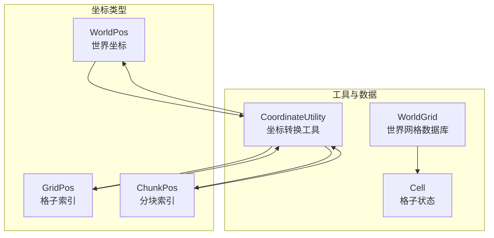
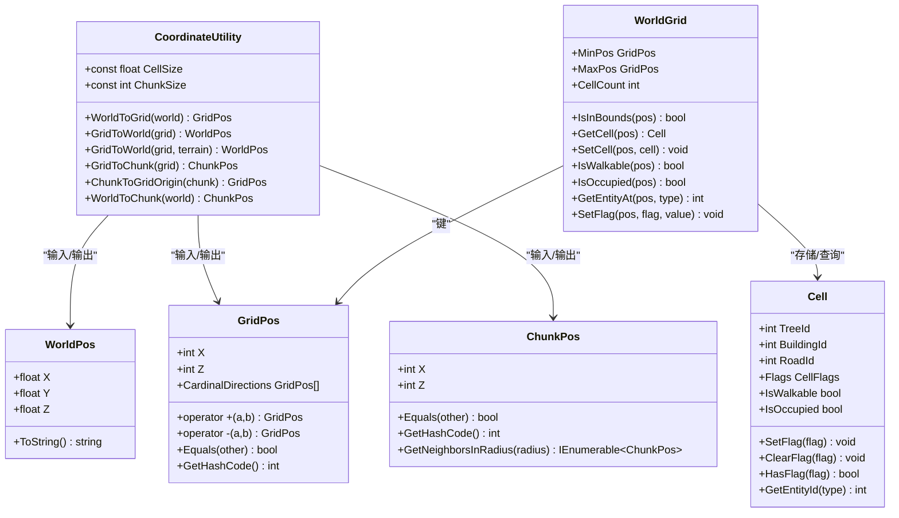
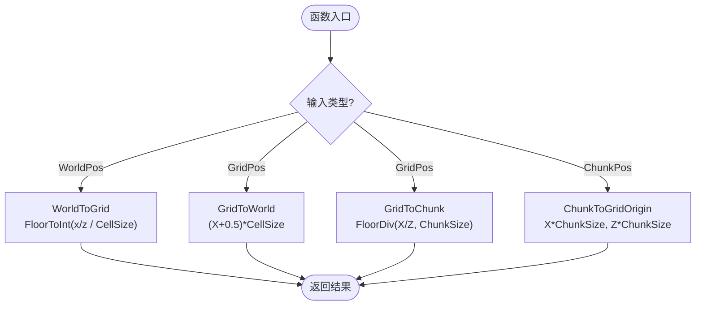
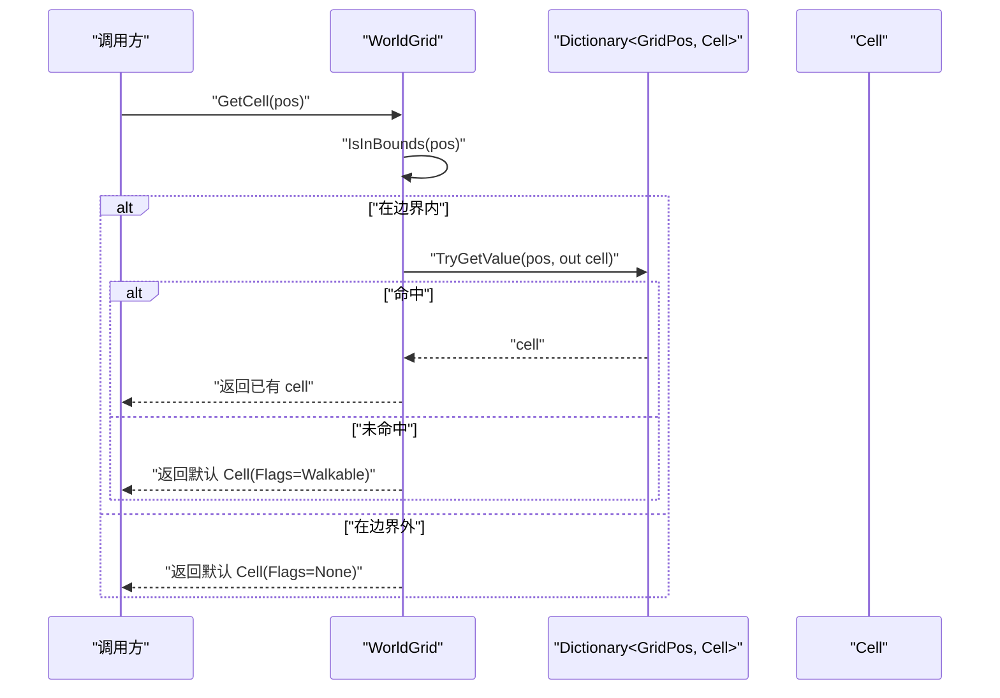
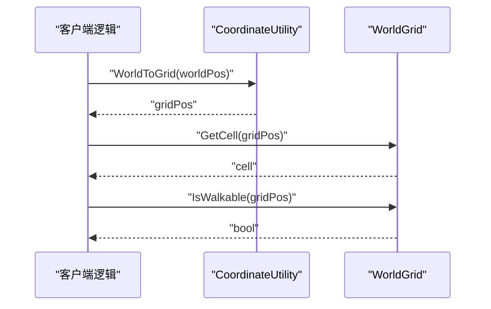
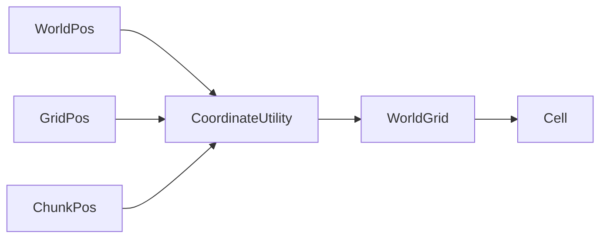

# 坐标系统工具

<cite>
**本文引用的文件**   
- [CoordinateUtility.cs](file://Assets/Game/Scripts/Simulation/World/Coordinates/CoordinateUtility.cs)
- [WorldPos.cs](file://Assets/Game/Scripts/Simulation/World/Coordinates/WorldPos.cs)
- [GridPos.cs](file://Assets/Game/Scripts/Simulation/World/Coordinates/GridPos.cs)
- [ChunkPos.cs](file://Assets/Game/Scripts/Simulation/World/Coordinates/ChunkPos.cs)
- [WorldGrid.cs](file://Assets/Game/Scripts/Simulation/World/Grid/WorldGrid.cs)
- [Cell.cs](file://Assets/Game/Scripts/Simulation/World/Grid/Cell.cs)
</cite>

## 目录
1. [简介](#简介)
2. [项目结构](#项目结构)
3. [核心组件](#核心组件)
4. [架构总览](#架构总览)
5. [详细组件分析](#详细组件分析)
6. [依赖关系分析](#依赖关系分析)
7. [性能考量](#性能考量)
8. [故障排查指南](#故障排查指南)
9. [结论](#结论)
10. [附录](#附录)

## 简介
本文件系统化梳理并文档化“坐标系统工具”，覆盖世界坐标、格子坐标与分块（Chunk）坐标之间的双向转换、边界与状态管理，以及关键数据结构与算法。目标是帮助开发者快速理解三套坐标体系的设计动机、使用方式与注意事项，并提供可视化图示与排错建议。

## 项目结构
坐标系统相关代码集中在 Simulation 子模块的 World 目录下，包含三类坐标类型与转换工具，以及世界网格数据库：
- 坐标类型：WorldPos、GridPos、ChunkPos
- 转换工具：CoordinateUtility
- 网格数据库：WorldGrid（含 Cell 状态）

图表来源
- [CoordinateUtility.cs:1-139](file://Assets/Game/Scripts/Simulation/World/Coordinates/CoordinateUtility.cs#L1-L139)
- [WorldPos.cs:1-48](file://Assets/Game/Scripts/Simulation/World/Coordinates/WorldPos.cs#L1-L48)
- [GridPos.cs:1-79](file://Assets/Game/Scripts/Simulation/World/Coordinates/GridPos.cs#L1-L79)
- [ChunkPos.cs:1-65](file://Assets/Game/Scripts/Simulation/World/Coordinates/ChunkPos.cs#L1-L65)
- [WorldGrid.cs:1-163](file://Assets/Game/Scripts/Simulation/World/Grid/WorldGrid.cs#L1-L163)
- [Cell.cs:1-83](file://Assets/Game/Scripts/Simulation/World/Grid/Cell.cs#L1-L83)

章节来源
- [CoordinateUtility.cs:1-139](file://Assets/Game/Scripts/Simulation/World/Coordinates/CoordinateUtility.cs#L1-L139)
- [WorldPos.cs:1-48](file://Assets/Game/Scripts/Simulation/World/Coordinates/WorldPos.cs#L1-L48)
- [GridPos.cs:1-79](file://Assets/Game/Scripts/Simulation/World/Coordinates/GridPos.cs#L1-L79)
- [ChunkPos.cs:1-65](file://Assets/Game/Scripts/Simulation/World/Coordinates/ChunkPos.cs#L1-L65)
- [WorldGrid.cs:1-163](file://Assets/Game/Scripts/Simulation/World/Grid/WorldGrid.cs#L1-L163)
- [Cell.cs:1-83](file://Assets/Game/Scripts/Simulation/World/Grid/Cell.cs#L1-L83)

## 核心组件
- 坐标类型
  - WorldPos：封装 Unity 世界坐标，保留 Y 轴，便于与 Transform、射线检测等 3D API 对接。
  - GridPos：水平面整数格子索引，提供常用方向常量与四邻偏移数组，适合寻路与扩散。
  - ChunkPos：空间分块索引，用于按块加载/卸载或批量处理。
- 转换工具
  - CoordinateUtility：实现 WorldPos ↔ GridPos ↔ ChunkPos 的双向转换，内置 FloorDiv 保证负数正确性，并提供 Terrain 高度采样便捷方法。
- 网格数据库
  - WorldGrid：基于 Dictionary<GridPos, Cell> 的空间查询与状态更新，支持边界检查与默认值约定。
  - Cell：格子状态（实体 ID 与位标记），提供便捷标记操作与查询。

章节来源
- [WorldPos.cs:1-48](file://Assets/Game/Scripts/Simulation/World/Coordinates/WorldPos.cs#L1-L48)
- [GridPos.cs:1-79](file://Assets/Game/Scripts/Simulation/World/Coordinates/GridPos.cs#L1-L79)
- [ChunkPos.cs:1-65](file://Assets/Game/Scripts/Simulation/World/Coordinates/ChunkPos.cs#L1-L65)
- [CoordinateUtility.cs:1-139](file://Assets/Game/Scripts/Simulation/World/Coordinates/CoordinateUtility.cs#L1-L139)
- [WorldGrid.cs:1-163](file://Assets/Game/Scripts/Simulation/World/Grid/WorldGrid.cs#L1-L163)
- [Cell.cs:1-83](file://Assets/Game/Scripts/Simulation/World/Grid/Cell.cs#L1-L83)

## 架构总览
下图展示坐标系统与网格数据库之间的交互关系与职责划分。

图表来源
- [WorldPos.cs:1-48](file://Assets/Game/Scripts/Simulation/World/Coordinates/WorldPos.cs#L1-L48)
- [GridPos.cs:1-79](file://Assets/Game/Scripts/Simulation/World/Coordinates/GridPos.cs#L1-L79)
- [ChunkPos.cs:1-65](file://Assets/Game/Scripts/Simulation/World/Coordinates/ChunkPos.cs#L1-L65)
- [CoordinateUtility.cs:1-139](file://Assets/Game/Scripts/Simulation/World/Coordinates/CoordinateUtility.cs#L1-L139)
- [WorldGrid.cs:1-163](file://Assets/Game/Scripts/Simulation/World/Grid/WorldGrid.cs#L1-L163)
- [Cell.cs:1-83](file://Assets/Game/Scripts/Simulation/World/Grid/Cell.cs#L1-L83)

## 详细组件分析

### 坐标类型设计
- WorldPos
  - 语义：明确表达“世界坐标”，避免 Vector3 含义模糊。
  - 特性：隐式转换为 Vector3，方便直接赋值给 Transform.position 等。
  - 适用场景：与 Unity 3D API 交互、地形高度采样、射线检测。
- GridPos
  - 语义：水平面整数格子索引，忽略 Y。
  - 特性：重载加减运算符、四方向常量与 CardinalDirections 数组，利于寻路展开邻居。
  - 哈希优化：自定义 GetHashCode 降低装箱与碰撞概率。
- ChunkPos
  - 语义：分块索引，数值范围通常远小于 GridPos。
  - 特性：提供 GetNeighborsInRadius 遍历相邻块，便于区块激活窗口计算。

章节来源
- [WorldPos.cs:1-48](file://Assets/Game/Scripts/Simulation/World/Coordinates/WorldPos.cs#L1-L48)
- [GridPos.cs:1-79](file://Assets/Game/Scripts/Simulation/World/Coordinates/GridPos.cs#L1-L79)
- [ChunkPos.cs:1-65](file://Assets/Game/Scripts/Simulation/World/Coordinates/ChunkPos.cs#L1-L65)

### 坐标转换工具（CoordinateUtility）
- 全局参数
  - CellSize：每个格子的世界边长（单位：Unity 米）。
  - ChunkSize：每个 Chunk 包含的格子数（一维），例如 32×32。
- 转换规则
  - WorldPos → GridPos：使用向下取整（FloorToInt），确保 [0,1) 归入格子 0，负数同样正确。
  - GridPos → WorldPos：返回格子中心点世界坐标；可选通过 Terrain.SampleHeight 填充 Y。
  - GridPos → ChunkPos：使用 FloorDiv 进行整除，正确处理负数归属。
  - ChunkPos → GridPos：返回该 Chunk 左下角（最小索引）的格子坐标，作为遍历起点。
  - WorldPos → ChunkPos：快捷组合调用。
- 负数处理（FloorDiv）
  - C# 整除为“向零取整”，需修正为“向负无穷取整”以符合数学地板除法。
  - 实现要点：若有余数且被除数与除数异号，则结果减 1。

图表来源
- [CoordinateUtility.cs:41-114](file://Assets/Game/Scripts/Simulation/World/Coordinates/CoordinateUtility.cs#L41-L114)
- [CoordinateUtility.cs:116-136](file://Assets/Game/Scripts/Simulation/World/Coordinates/CoordinateUtility.cs#L116-L136)

章节来源
- [CoordinateUtility.cs:1-139](file://Assets/Game/Scripts/Simulation/World/Coordinates/CoordinateUtility.cs#L1-L139)

### 世界网格数据库（WorldGrid）
- 存储方案
  - 使用 Dictionary<GridPos, Cell> 按需分配，支持任意坐标（含负数），内存友好。
  - 预估容量初始化以减少扩容开销。
- 边界管理
  - MinPos/MaxPos 定义有效范围；IsInBounds 判断是否越界。
  - 边界外格子默认不可行走（Flags=None），ID 全为 0。
- 查询与更新
  - GetCell/SetCell：获取或设置格子状态；未设置的格子返回默认值（可行走，ID 全为 0）。
  - IsWalkable/IsOccupied/GetEntityAt：便捷查询接口。
  - SetFlag：封装 GetCell → SetFlag/ClearFlag → SetCell 的常用模式。
- 调试辅助
  - CellCount：已存储格子数量，便于监控与诊断。

图表来源
- [WorldGrid.cs:67-123](file://Assets/Game/Scripts/Simulation/World/Grid/WorldGrid.cs#L67-L123)
- [Cell.cs:23-83](file://Assets/Game/Scripts/Simulation/World/Grid/Cell.cs#L23-L83)

章节来源
- [WorldGrid.cs:1-163](file://Assets/Game/Scripts/Simulation/World/Grid/WorldGrid.cs#L1-L163)
- [Cell.cs:1-83](file://Assets/Game/Scripts/Simulation/World/Grid/Cell.cs#L1-L83)

### 典型调用流程示例
以下序列图展示从世界坐标到格子状态查询的完整链路。

图表来源
- [CoordinateUtility.cs:48-57](file://Assets/Game/Scripts/Simulation/World/Coordinates/CoordinateUtility.cs#L48-L57)
- [WorldGrid.cs:83-108](file://Assets/Game/Scripts/Simulation/World/Grid/WorldGrid.cs#L83-L108)

## 依赖关系分析
- 低耦合高内聚
  - 坐标类型仅承载数据与基础运算，无外部依赖。
  - CoordinateUtility 仅依赖坐标类型与 Unity 数学库，职责单一。
  - WorldGrid 依赖坐标类型与 Cell，负责空间状态管理。
- 潜在循环依赖
  - 当前结构无循环依赖风险。
- 外部集成点
  - 地形高度采样：CoordinateUtility.GridToWorld(GridPos, Terrain)。
  - Unity 3D 交互：WorldPos 与 Vector3 的隐式转换。

图表来源
- [CoordinateUtility.cs:1-139](file://Assets/Game/Scripts/Simulation/World/Coordinates/CoordinateUtility.cs#L1-L139)
- [WorldGrid.cs:1-163](file://Assets/Game/Scripts/Simulation/World/Grid/WorldGrid.cs#L1-L163)
- [Cell.cs:1-83](file://Assets/Game/Scripts/Simulation/World/Grid/Cell.cs#L1-L83)

章节来源
- [CoordinateUtility.cs:1-139](file://Assets/Game/Scripts/Simulation/World/Coordinates/CoordinateUtility.cs#L1-L139)
- [WorldGrid.cs:1-163](file://Assets/Game/Scripts/Simulation/World/Grid/WorldGrid.cs#L1-L163)
- [Cell.cs:1-83](file://Assets/Game/Scripts/Simulation/World/Grid/Cell.cs#L1-L83)

## 性能考量
- 零 GC 保证
  - 坐标类型为 readonly struct，栈分配，避免堆分配。
  - 转换工具只操作 readonly struct，不产生额外 GC。
- 哈希与查找
  - GridPos 自定义 GetHashCode，减少装箱与冲突，提升 Dictionary 性能。
- 容量预估
  - WorldGrid 构造时预估容量，减少 Dictionary 扩容带来的开销。
- 地形采样
  - GridToWorld(GridPos, Terrain) 会调用 Terrain.SampleHeight，属于 I/O 密集操作，应避免在热路径中频繁调用。

[本节为通用指导，无需具体文件分析]

## 故障排查指南
- 负数坐标归属错误
  - 现象：GridPos(-1, 0) 被误判为 Chunk 0。
  - 原因：直接使用 C# 整除（向零取整）。
  - 解决：使用 CoordinateUtility.FloorDiv 进行向负无穷取整。
- 格子中心点偏差
  - 现象：对象放置偏移到格子角点。
  - 原因：使用 (X * CellSize) 而非 ((X + 0.5) * CellSize)。
  - 解决：使用 GridToWorld 返回的中心点坐标。
- 边界外访问异常
  - 现象：对边界外格子查询得到非预期结果。
  - 原因：未先进行 IsInBounds 检查。
  - 解决：在访问前调用 IsInBounds，或使用 GetCell 的默认值约定。
- 地形高度未生效
  - 现象：Y 始终为 0。
  - 原因：未调用带 Terrain 的重载方法。
  - 解决：使用 GridToWorld(GridPos, Terrain) 以采样高度。

章节来源
- [CoordinateUtility.cs:86-136](file://Assets/Game/Scripts/Simulation/World/Coordinates/CoordinateUtility.cs#L86-L136)
- [WorldGrid.cs:67-108](file://Assets/Game/Scripts/Simulation/World/Grid/WorldGrid.cs#L67-L108)

## 结论
本坐标系统工具以清晰的数据类型与转换规则为核心，结合高效的网格数据库，提供了稳定可靠的三套坐标体系互转能力。通过严格的负数处理、零 GC 设计与边界管理，满足大规模地图与高频查询的性能需求。建议在开发中遵循本文档的使用规范与最佳实践，以获得一致的行为与良好的性能表现。

[本节为总结性内容，无需具体文件分析]

## 附录
- 术语表
  - 世界坐标（WorldPos）：Unity 世界空间中的三维坐标。
  - 格子坐标（GridPos）：水平面整数格子索引，忽略 Y。
  - 分块坐标（ChunkPos）：空间分块索引，用于区块化管理。
  - 格子（Cell）：格子状态数据，包含实体 ID 与位标记。
- 参考路径
  - 坐标类型与转换：见“坐标类型设计”与“坐标转换工具（CoordinateUtility）”章节。
  - 网格数据库：见“世界网格数据库（WorldGrid）”章节。

[本节为概念性内容，无需具体文件分析]