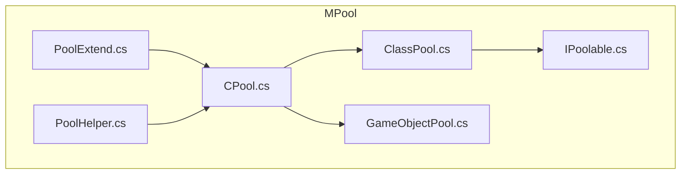
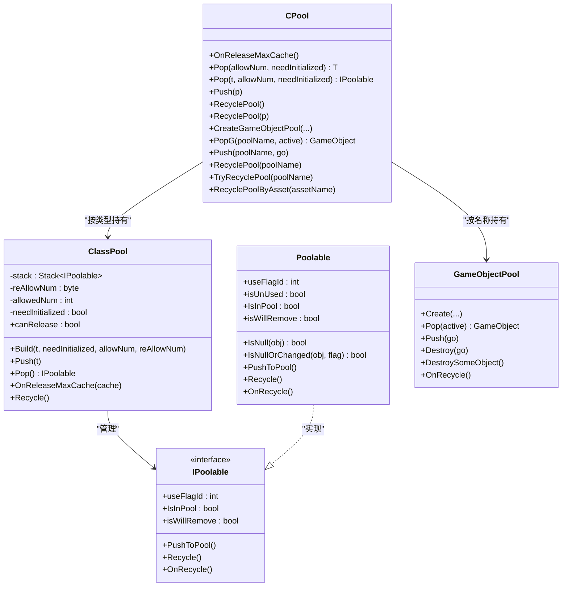
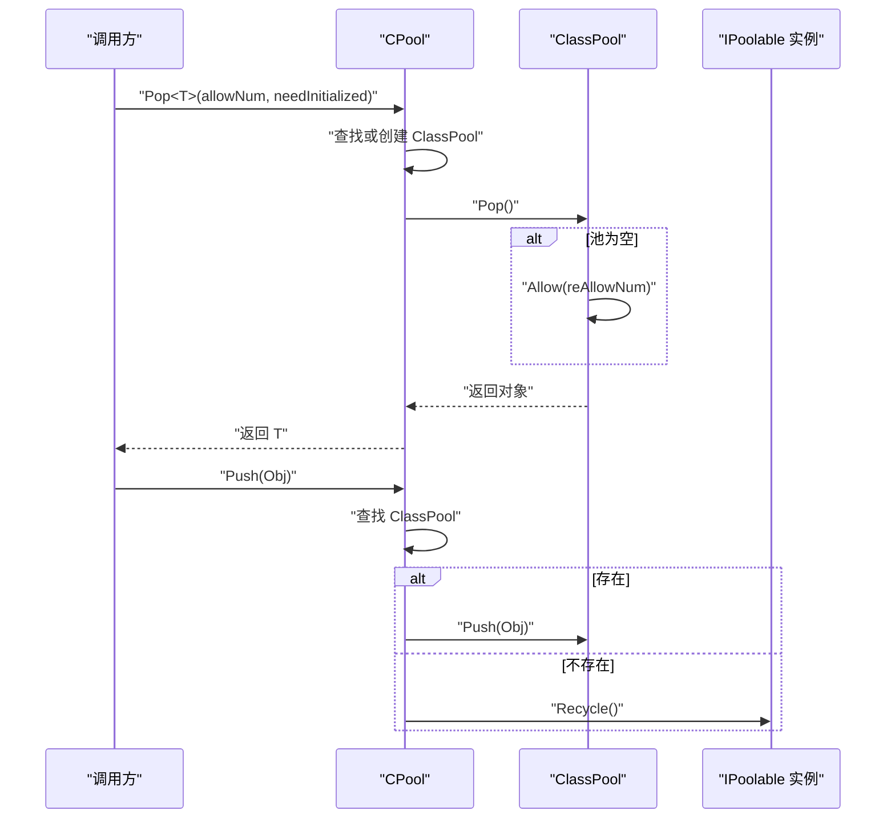
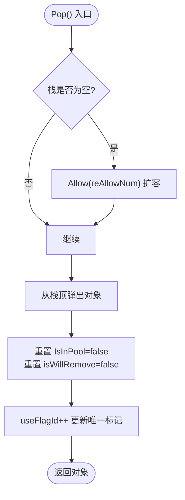
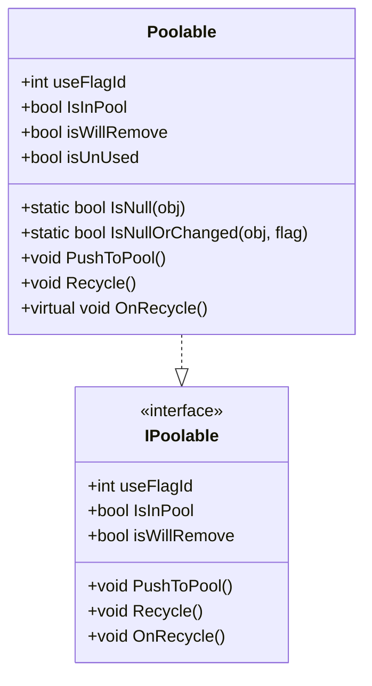
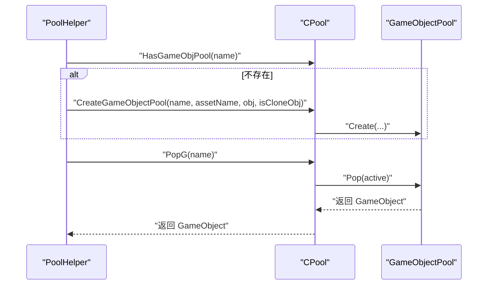
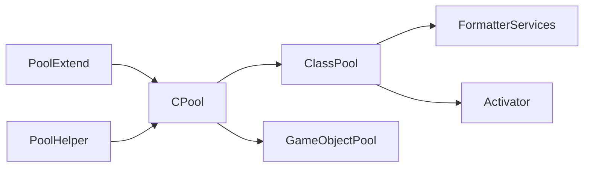

# CPool - 值类型和基础类型对象池

<cite>
**本文引用的文件**
- [CPool.cs](file://Assets/Game/Framework/MPool/CPool.cs)
- [ClassPool.cs](file://Assets/Game/Framework/MPool/ClassPool.cs)
- [IPoolable.cs](file://Assets/Game/Framework/MPool/IPoolable.cs)
- [GameObjectPool.cs](file://Assets/Game/Framework/MPool/GameObjectPool.cs)
- [PoolExtend.cs](file://Assets/Game/Framework/MPool/PoolExtend.cs)
- [PoolHelper.cs](file://Assets/Game/Framework/MPool/PoolHelper.cs)
</cite>

## 目录
1. [简介](#简介)
2. [项目结构](#项目结构)
3. [核心组件](#核心组件)
4. [架构总览](#架构总览)
5. [详细组件分析](#详细组件分析)
6. [依赖关系分析](#依赖关系分析)
7. [性能与内存布局优化](#性能与内存布局优化)
8. [使用指南与最佳实践](#使用指南与最佳实践)
9. [故障排查](#故障排查)
10. [结论](#结论)

## 简介
本文件围绕 SimulationClient 中的 CPool 对象池体系，重点阐述其针对“值类型和基础类型”的特殊设计与实现机制。尽管当前代码库中未直接提供值类型的专用泛型版本，但通过接口与基类的设计、构造策略以及标志位机制，CPool 为值类型的高效复用提供了可扩展的基础能力。文档将深入解释：
- 为什么需要专门针对值类型进行对象池化优化（避免装箱拆箱、减少 GC、提升缓存局部性）
- CPool 的核心功能：Push()/Pop()/Clear() 等关键方法的使用方式与性能特点
- 与 Poolable 基类的集成方式和值类型对象池化的特殊处理
- 在数学计算、数据结构操作、高频调用函数等场景的应用示例
- 内存布局优化与 CPU 缓存友好的设计考虑
- 与引用类型对象池的差异与选择策略
- 性能调优与最佳实践指导

## 项目结构
CPool 位于 MPool 模块下，主要包含以下文件：
- CPool.cs：统一入口，管理类对象池与 GameObject 对象池
- ClassPool.cs：具体类对象池实现，基于 Stack 的 LIFO 回收
- IPoolable.cs：对象池契约与默认实现基类
- GameObjectPool.cs：Unity GameObject 对象池实现
- PoolExtend.cs：扩展方法与便捷 API
- PoolHelper.cs：常用池名与便捷工具

图表来源
- [CPool.cs:1-263](file://Assets/Game/Framework/MPool/CPool.cs#L1-L263)
- [ClassPool.cs:1-127](file://Assets/Game/Framework/MPool/ClassPool.cs#L1-L127)
- [IPoolable.cs:1-71](file://Assets/Game/Framework/MPool/IPoolable.cs#L1-L71)
- [GameObjectPool.cs:1-191](file://Assets/Game/Framework/MPool/GameObjectPool.cs#L1-L191)
- [PoolExtend.cs:1-25](file://Assets/Game/Framework/MPool/PoolExtend.cs#L1-L25)
- [PoolHelper.cs:1-66](file://Assets/Game/Framework/MPool/PoolHelper.cs#L1-L66)

章节来源
- [CPool.cs:1-263](file://Assets/Game/Framework/MPool/CPool.cs#L1-L263)
- [ClassPool.cs:1-127](file://Assets/Game/Framework/MPool/ClassPool.cs#L1-L127)
- [IPoolable.cs:1-71](file://Assets/Game/Framework/MPool/IPoolable.cs#L1-L71)
- [GameObjectPool.cs:1-191](file://Assets/Game/Framework/MPool/GameObjectPool.cs#L1-L191)
- [PoolExtend.cs:1-25](file://Assets/Game/Framework/MPool/PoolExtend.cs#L1-L25)
- [PoolHelper.cs:1-66](file://Assets/Game/Framework/MPool/PoolHelper.cs#L1-L66)

## 核心组件
- CPool：静态门面，统一管理类对象池与 GameObject 对象池的生命周期与访问入口
- ClassPool：按类型维护一个栈式对象池，支持按需扩容、自动初始化开关、可释放判定
- IPoolable/Poolable：定义对象池契约与通用行为（入池、回收、标记、状态判断）
- GameObjectPool：管理 Unity GameObject 的实例化、激活、回收与超时清理
- PoolExtend：为常见操作提供扩展方法，简化调用
- PoolHelper：封装常用池名与便捷获取/归还逻辑

章节来源
- [CPool.cs:1-263](file://Assets/Game/Framework/MPool/CPool.cs#L1-L263)
- [ClassPool.cs:1-127](file://Assets/Game/Framework/MPool/ClassPool.cs#L1-L127)
- [IPoolable.cs:1-71](file://Assets/Game/Framework/MPool/IPoolable.cs#L1-L71)
- [GameObjectPool.cs:1-191](file://Assets/Game/Framework/MPool/GameObjectPool.cs#L1-L191)
- [PoolExtend.cs:1-25](file://Assets/Game/Framework/MPool/PoolExtend.cs#L1-L25)
- [PoolHelper.cs:1-66](file://Assets/Game/Framework/MPool/PoolHelper.cs#L1-L66)

## 架构总览
CPool 作为统一入口，内部维护两类池：
- 类对象池：以 Type 为键，ClassPool 为值，用于任意实现 IPoolable 的类型
- GameObject 对象池：以字符串名称为键，GameObjectPool 为值，用于 Unity 对象

图表来源
- [CPool.cs:1-263](file://Assets/Game/Framework/MPool/CPool.cs#L1-L263)
- [ClassPool.cs:1-127](file://Assets/Game/Framework/MPool/ClassPool.cs#L1-L127)
- [IPoolable.cs:1-71](file://Assets/Game/Framework/MPool/IPoolable.cs#L1-L71)
- [GameObjectPool.cs:1-191](file://Assets/Game/Framework/MPool/GameObjectPool.cs#L1-L191)

## 详细组件分析

### CPool 门面与生命周期管理
- 类对象池管理
  - Pop<T>/Pop(Type)：根据类型查找或创建 ClassPool，按需分配对象；支持是否自动初始化参数
  - Push(IPoolable)：将对象归还到对应类型池，若池不存在则直接回收
  - RecyclePool<T>()/RecyclePool(IPoolable)：回收指定类型池并移除映射
  - OnReleaseMaxCache()：遍历所有类池，对允许释放的池执行完全回收，否则按阈值裁剪缓存
- GameObject 对象池管理
  - CreateGameObjectPool(...)：按名称创建并注册池，支持初始数量、扩容数量、最大缓存
  - PopG(...)/Push(...)/RecyclePool(...)/TryRecyclePool(...)：提供便捷的取用与回收
  - RecyclePoolByAsset(assetName)：按资源名批量回收

图表来源
- [CPool.cs:55-91](file://Assets/Game/Framework/MPool/CPool.cs#L55-L91)
- [ClassPool.cs:80-96](file://Assets/Game/Framework/MPool/ClassPool.cs#L80-L96)

章节来源
- [CPool.cs:14-42](file://Assets/Game/Framework/MPool/CPool.cs#L14-L42)
- [CPool.cs:55-114](file://Assets/Game/Framework/MPool/CPool.cs#L55-L114)
- [CPool.cs:131-259](file://Assets/Game/Framework/MPool/CPool.cs#L131-L259)

### ClassPool 内部机制
- 存储结构：Stack<IPoolable>，LIFO 高效出入栈
- 分配策略：
  - Allow(num)：按需创建对象，支持两种构造路径
    - 需要初始化：Activator.CreateInstance
    - 跳过构造函数：FormatterServices.GetUninitializedObject（提高性能，要求调用方确保字段全赋值）
- 出栈 Pop()：
  - 空时扩容 reAllowNum
  - 重置 IsInPool/isWillRemove，并更新 useFlagId（全局递增），用于检测对象是否被重用
- 入栈 Push(t)：
  - 防重复入池、校验 IsInPool 状态
  - 重置 useFlagId=0，避免脏数据
- 可释放判定 canRelease：当已分配数大于1且等于池中剩余数时，表示无外部引用，可整体回收
- 场景切换优化 OnReleaseMaxCache(cache)：保留不超过 cache 数量的对象，其余释放

图表来源
- [ClassPool.cs:80-96](file://Assets/Game/Framework/MPool/ClassPool.cs#L80-L96)
- [ClassPool.cs:41-59](file://Assets/Game/Framework/MPool/ClassPool.cs#L41-L59)
- [ClassPool.cs:62-77](file://Assets/Game/Framework/MPool/ClassPool.cs#L62-L77)
- [ClassPool.cs:98-101](file://Assets/Game/Framework/MPool/ClassPool.cs#L98-L101)
- [ClassPool.cs:104-114](file://Assets/Game/Framework/MPool/ClassPool.cs#L104-L114)

章节来源
- [ClassPool.cs:1-127](file://Assets/Game/Framework/MPool/ClassPool.cs#L1-L127)

### IPoolable 与 Poolable 基类
- IPoolable 契约：
  - useFlagId：每次使用时赋予的唯一标记，便于检测对象是否被重用
  - IsInPool/isWillRemove：对象状态标记
  - PushToPool()/Recycle()/OnRecycle()：入池、框架层回收、用户自定义回收钩子
- Poolable 基类：
  - 提供 PushToPool() 便捷入池
  - Recycle() 内部调用 OnRecycle() 并设置 IsInPool=true
  - 辅助方法 IsNull()/IsNullOrChanged() 帮助上层快速判断对象有效性

图表来源
- [IPoolable.cs:7-71](file://Assets/Game/Framework/MPool/IPoolable.cs#L7-L71)

章节来源
- [IPoolable.cs:1-71](file://Assets/Game/Framework/MPool/IPoolable.cs#L1-L71)

### GameObjectPool 与 CPool 协作
- 创建与配置：Create(...) 支持初始数量、扩容数量、最大缓存、是否克隆参照物
- 取用与归还：Pop(active)/Push(go)，工作集与空闲集分离，记录使用时间
- 超时与裁剪：isTimeOut 判定、DestroySomeObject() 裁剪超出 maxCache 的对象
- 回收：OnRecycle() 销毁所有对象并清空集合

图表来源
- [PoolHelper.cs:33-43](file://Assets/Game/Framework/MPool/PoolHelper.cs#L33-L43)
- [CPool.cs:164-178](file://Assets/Game/Framework/MPool/CPool.cs#L164-L178)
- [GameObjectPool.cs:55-93](file://Assets/Game/Framework/MPool/GameObjectPool.cs#L55-L93)

章节来源
- [GameObjectPool.cs:1-191](file://Assets/Game/Framework/MPool/GameObjectPool.cs#L1-L191)
- [PoolHelper.cs:1-66](file://Assets/Game/Framework/MPool/PoolHelper.cs#L1-L66)
- [CPool.cs:164-259](file://Assets/Game/Framework/MPool/CPool.cs#L164-L259)

## 依赖关系分析
- CPool 依赖 ClassPool 与 GameObjectPool 完成对象分配与回收
- ClassPool 依赖 System.Runtime.Serialization.FormatterServices 与 Activator 进行对象构造
- PoolExtend 提供扩展方法，简化 CPool.Pop<T>() 与 CPool.Push(poolName, go) 的调用
- PoolHelper 封装常用池名与便捷获取/归还逻辑，降低业务耦合

图表来源
- [CPool.cs:1-263](file://Assets/Game/Framework/MPool/CPool.cs#L1-L263)
- [ClassPool.cs:1-127](file://Assets/Game/Framework/MPool/ClassPool.cs#L1-L127)
- [PoolExtend.cs:1-25](file://Assets/Game/Framework/MPool/PoolExtend.cs#L1-L25)
- [PoolHelper.cs:1-66](file://Assets/Game/Framework/MPool/PoolHelper.cs#L1-L66)

章节来源
- [CPool.cs:1-263](file://Assets/Game/Framework/MPool/CPool.cs#L1-L263)
- [ClassPool.cs:1-127](file://Assets/Game/Framework/MPool/ClassPool.cs#L1-L127)
- [PoolExtend.cs:1-25](file://Assets/Game/Framework/MPool/PoolExtend.cs#L1-L25)
- [PoolHelper.cs:1-66](file://Assets/Game/Framework/MPool/PoolHelper.cs#L1-L66)

## 性能与内存布局优化
- 避免装箱拆箱
  - 对于值类型，若需接入现有 CPool 体系，建议将其包装为轻量级引用类型并实现 IPoolable，从而避免在泛型约束与接口调用时的装箱开销
  - 若直接使用值类型，应避免通过接口或 object 传递，优先采用非泛型数组/结构体缓冲池（例如 BetterList 的 BufferPoolNode 思路）以减少 GC
- 构造策略优化
  - 使用 needInitialized=false 配合 FormatterServices.GetUninitializedObject 可跳过构造函数，显著降低频繁分配的性能损耗，但必须保证调用方在使用前完整赋值所有字段
- 标志位与状态管理
  - useFlagId 全局递增，结合 Poolable.IsNullOrChanged 可在高频循环中快速判断对象是否被重用，避免误用旧数据
- 内存对齐与缓存友好
  - 值类型通常连续存储在数组或结构中，有利于 CPU 缓存命中；对象池应尽量减少跨代分配，保持热点对象在同一区域
- 扩容策略
  - ClassPool.reAllowNum 控制每次扩容数量，合理设置可减少频繁扩容带来的额外分配与复制
- 最大缓存与裁剪
  - CPool.OnReleaseMaxCache() 与 GameObjectPool.DestroySomeObject() 提供切场景或空闲时的裁剪能力，避免长期占用过多内存

章节来源
- [ClassPool.cs:41-59](file://Assets/Game/Framework/MPool/ClassPool.cs#L41-L59)
- [ClassPool.cs:80-96](file://Assets/Game/Framework/MPool/ClassPool.cs#L80-L96)
- [IPoolable.cs:24-71](file://Assets/Game/Framework/MPool/IPoolable.cs#L24-L71)
- [CPool.cs:14-42](file://Assets/Game/Framework/MPool/CPool.cs#L14-L42)
- [GameObjectPool.cs:132-145](file://Assets/Game/Framework/MPool/GameObjectPool.cs#L132-L145)

## 使用指南与最佳实践

### 关键方法说明
- Push()/Pop()
  - CPool.Pop<T>(allowNum=1, needInitialized=false)：从指定类型池取出对象，allowNum 控制一次性分配数量，needInitialized 决定是否跳过构造函数
  - CPool.Push(IPoolable p)：将对象归还到对应类型池；若池不存在则直接调用对象的 Recycle()
  - ClassPool.Pop()/Push()：底层栈式分配与回收，注意 IsInPool 状态与 useFlagId 更新
- Clear()
  - 当前 CPool 未提供统一的 Clear() 方法；可按类型调用 RecyclePool<T>() 或遍历 classDic 手动回收
  - GameObject 对象池可通过 RecyclePool(poolName)/TryRecyclePool(poolName)/RecyclePoolByAsset(assetName) 进行清理

### 与 Poolable 基类的集成
- 继承 Poolable 后，可直接使用 PushToPool() 便捷入池
- 重写 OnRecycle() 进行资源释放（如解绑事件、清空引用）
- 使用 Poolable.IsNull()/IsNullOrChanged() 在高频循环中快速判断对象有效性

### 值类型对象池化的特殊处理
- 由于 CPool 的泛型约束要求 T: IPoolable，值类型无法直接满足该约束
- 推荐做法：
  - 将值类型封装为轻量级引用类型并实现 IPoolable，纳入 CPool 管理
  - 或者使用非泛型缓冲池（数组/结构体）+ 索引管理，避免装箱与接口调用开销
- 若坚持使用值类型，请确保：
  - 不使用接口/泛型约束导致装箱
  - 使用连续内存布局（数组/结构体）以提升缓存命中率
  - 自行实现入池/出池逻辑，避免触发 GC

### 应用场景示例（概念性描述）
- 数学计算
  - 在向量运算、矩阵变换等高频场景中，使用结构体缓冲池替代临时对象分配，减少 GC 压力
- 数据结构操作
  - 节点、边、区间等小对象频繁创建/销毁时，采用对象池复用，避免碎片化
- 高频调用函数
  - 每帧大量生成的中间结果对象，通过对象池复用，结合 needInitialized=false 跳过构造函数，显著提升性能

### 与引用类型对象池的差异与选择策略
- 引用类型对象池
  - 适合复杂对象、带资源引用的对象（如 GameObject、网络消息对象）
  - 通过 IPoolable 与 Poolable 基类提供统一生命周期管理
- 值类型对象池
  - 适合纯数据、无资源引用的小对象
  - 优先使用数组/结构体缓冲池，避免装箱与接口调用
  - 若需统一生命周期管理，可将值类型包装为轻量引用类型并实现 IPoolable

### 性能调优建议
- 合理设置 allowNum/reAllowNum/maxCache，平衡内存占用与分配频率
- 在热路径中使用 needInitialized=false，并确保字段全赋值
- 使用 useFlagId 与 Poolable.IsNullOrChanged 避免误用旧数据
- 定期调用 OnReleaseMaxCache() 或在场景切换时裁剪多余缓存
- 对 GameObject 对象池设置合理的 outTime 与 maxCache，避免长时间占用

章节来源
- [CPool.cs:55-114](file://Assets/Game/Framework/MPool/CPool.cs#L55-L114)
- [ClassPool.cs:29-59](file://Assets/Game/Framework/MPool/ClassPool.cs#L29-L59)
- [IPoolable.cs:24-71](file://Assets/Game/Framework/MPool/IPoolable.cs#L24-L71)
- [GameObjectPool.cs:55-145](file://Assets/Game/Framework/MPool/GameObjectPool.cs#L55-L145)

## 故障排查
- 对象池不存在
  - 现象：PopG(poolName) 返回 null 并输出警告
  - 排查：确认是否已调用 CreateGameObjectPool(poolName,...)
- 对象重复入池
  - 现象：Push(go) 无效或重复计数
  - 排查：检查 workStack/idleStack 去重逻辑，确保不在使用中重复入池
- 对象状态异常
  - 现象：对象被重用后仍持有旧数据
  - 排查：确保使用 needInitialized=false 时，调用方在使用前完整赋值所有字段；或使用 useFlagId 与 Poolable.IsNullOrChanged 进行检测
- 内存泄漏
  - 现象：长时间运行后内存持续增长
  - 排查：调用 OnReleaseMaxCache() 或场景切换时裁剪缓存；检查 GameObject 对象池的 onRecycle 是否正确销毁

章节来源
- [CPool.cs:181-193](file://Assets/Game/Framework/MPool/CPool.cs#L181-L193)
- [GameObjectPool.cs:96-111](file://Assets/Game/Framework/MPool/GameObjectPool.cs#L96-L111)
- [ClassPool.cs:62-77](file://Assets/Game/Framework/MPool/ClassPool.cs#L62-L77)
- [ClassPool.cs:80-96](file://Assets/Game/Framework/MPool/ClassPool.cs#L80-L96)

## 结论
CPool 为 SimulationClient 提供了统一的对象池管理能力，既支持引用类型（通过 IPoolable/Poolable），也通过灵活的构造策略与标志位机制为值类型的高效复用奠定基础。在实际工程中，应根据数据类型与使用场景选择合适的池化方案：
- 引用类型：使用 CPool 与 Poolable 基类，享受统一生命周期管理
- 值类型：优先采用数组/结构体缓冲池，避免装箱与接口调用；必要时包装为轻量引用类型并实现 IPoolable
- 性能调优：合理设置扩容与最大缓存，利用 needInitialized=false 与 useFlagId 提升效率与安全性

通过以上策略，可以在数学计算、数据结构操作、高频调用函数等场景中显著降低 GC 压力，提升运行时性能与稳定性。