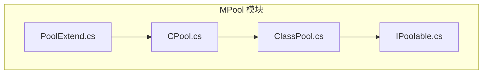
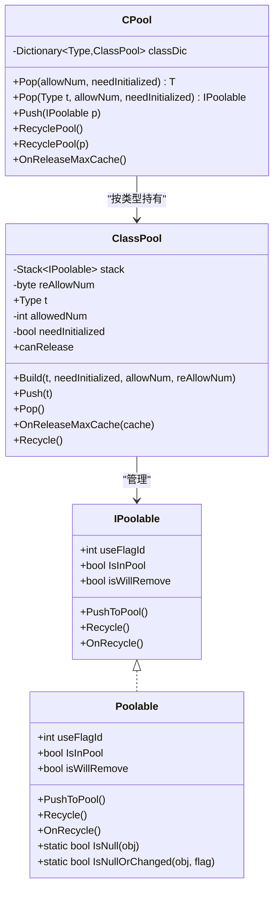
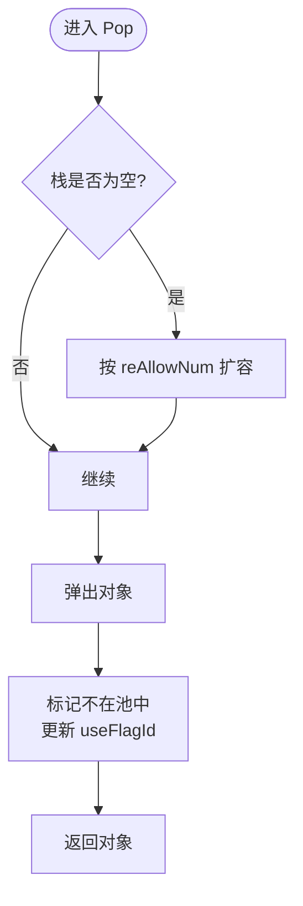
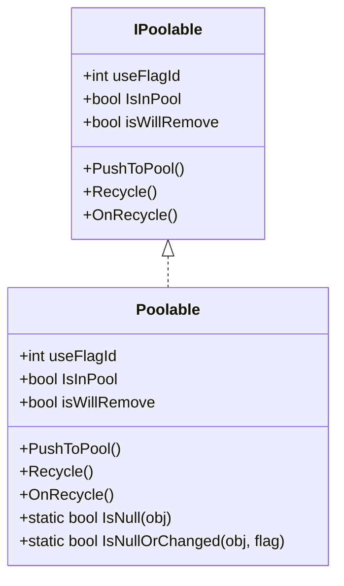
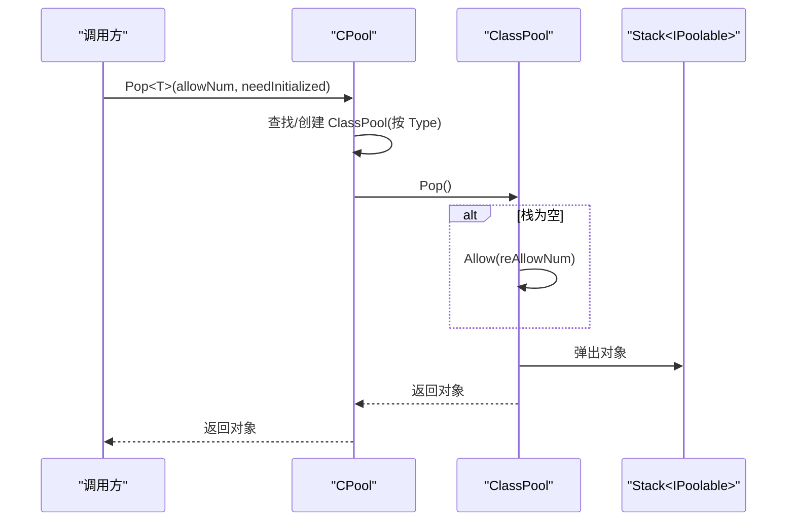
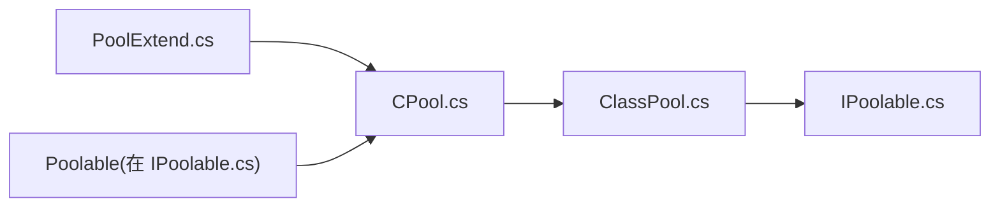

# ClassPool - 普通类实例对象池

<cite>
**本文引用的文件列表**
- [ClassPool.cs](file://Assets/Game/Framework/MPool/ClassPool.cs)
- [IPoolable.cs](file://Assets/Game/Framework/MPool/IPoolable.cs)
- [CPool.cs](file://Assets/Game/Framework/MPool/CPool.cs)
- [PoolExtend.cs](file://Assets/Game/Framework/MPool/PoolExtend.cs)
</cite>

## 目录
1. [简介](#简介)
2. [项目结构](#项目结构)
3. [核心组件](#核心组件)
4. [架构总览](#架构总览)
5. [详细组件分析](#详细组件分析)
6. [依赖关系分析](#依赖关系分析)
7. [性能与内存管理](#性能与内存管理)
8. [线程安全与并发访问](#线程安全与并发访问)
9. [使用指南与最佳实践](#使用指南与最佳实践)
10. [常见问题排查](#常见问题排查)
11. [结论](#结论)

## 简介
本文件为 SimulationClient 中 MPool 模块的“普通类实例对象池”提供系统化文档，重点围绕 ClassPool 的设计模式、实现原理与使用方法展开。内容涵盖：
- 类型安全的对象获取与释放
- 构造函数参数传递策略（含跳过构造的性能优化）
- 对象初始化回调机制
- 与 IPoolable 接口的集成方式
- 典型应用场景示例
- 性能优势与注意事项
- 线程安全考虑与并发控制建议
- 状态重置与内存管理策略
- 扩展自定义对象池行为的指导

## 项目结构
MPool 模块位于 Assets/Game/Framework/MPool 下，包含以下关键文件：
- ClassPool.cs：普通类对象池的核心实现
- IPoolable.cs：对象池化协议接口及默认抽象基类
- CPool.cs：全局静态入口，按类型维护 ClassPool 实例
- PoolExtend.cs：便捷扩展方法

图表来源
- [ClassPool.cs:1-127](file://Assets/Game/Framework/MPool/ClassPool.cs#L1-L127)
- [IPoolable.cs:1-71](file://Assets/Game/Framework/MPool/IPoolable.cs#L1-L71)
- [CPool.cs:1-263](file://Assets/Game/Framework/MPool/CPool.cs#L1-L263)
- [PoolExtend.cs:1-25](file://Assets/Game/Framework/MPool/PoolExtend.cs#L1-L25)

章节来源
- [ClassPool.cs:1-127](file://Assets/Game/Framework/MPool/ClassPool.cs#L1-L127)
- [IPoolable.cs:1-71](file://Assets/Game/Framework/MPool/IPoolable.cs#L1-L71)
- [CPool.cs:1-263](file://Assets/Game/Framework/MPool/CPool.cs#L1-L263)
- [PoolExtend.cs:1-25](file://Assets/Game/Framework/MPool/PoolExtend.cs#L1-L25)

## 核心组件
- ClassPool：基于 Stack 的对象池实现，负责对象的分配、回收、扩容与释放判定。
- IPoolable：定义对象池化的最小契约；Poolable 提供默认实现，简化业务类接入。
- CPool：全局静态工厂，按 Type 维度缓存 ClassPool，并提供泛型 Pop/Push 等便捷 API。
- PoolExtend：对 Transform、GameObject 与 IPoolable 的便捷扩展方法。

章节来源
- [ClassPool.cs:1-127](file://Assets/Game/Framework/MPool/ClassPool.cs#L1-L127)
- [IPoolable.cs:1-71](file://Assets/Game/Framework/MPool/IPoolable.cs#L1-L71)
- [CPool.cs:1-263](file://Assets/Game/Framework/MPool/CPool.cs#L1-L263)
- [PoolExtend.cs:1-25](file://Assets/Game/Framework/MPool/PoolExtend.cs#L1-L25)

## 架构总览
整体采用“全局静态入口 + 按类型分池”的架构：
- CPool 作为统一入口，内部以 Dictionary<Type, ClassPool> 维护每个类型的对象池。
- ClassPool 内部以 Stack<IPoolable> 存储可用对象，支持按需扩容与最大缓存裁剪。
- 业务对象通过实现 IPoolable（或继承 Poolable）接入池化生命周期。

图表来源
- [IPoolable.cs:1-71](file://Assets/Game/Framework/MPool/IPoolable.cs#L1-L71)
- [ClassPool.cs:1-127](file://Assets/Game/Framework/MPool/ClassPool.cs#L1-L127)
- [CPool.cs:1-263](file://Assets/Game/Framework/MPool/CPool.cs#L1-L263)

## 详细组件分析

### ClassPool 设计要点
- 数据结构：内部使用 Stack<IPoolable> 作为对象容器，保证 LIFO 复用。
- 预分配与扩容：
  - Build 时可按 allowNum 预分配若干对象。
  - Pop 时若栈空则按 reAllowNum 自动扩容。
- 构造策略：
  - needInitialized=false：通过 Activator.CreateInstance 调用默认构造函数。
  - needInitialized=true：通过 FormatterServices.GetUninitializedObject 跳过构造函数，提升性能，但要求使用者在每次使用前完整赋值所有字段。
- 入池 Push：
  - 校验是否已在池中，避免重复入池。
  - 入池前调用 Recycle 完成状态重置，并清空 useFlagId。
- 出池 Pop：
  - 确保栈非空（必要时扩容）。
  - 取出对象后标记为非池中状态，更新 useFlagId 用于变更检测。
- 释放判定 canRelease：当允许分配数等于池中数量且大于 1 时，表示可整体释放该类型池。
- 场景切换释放 OnReleaseMaxCache：将池中对象裁剪到指定上限，减少常驻内存。
- 回收 Recycle：遍历并逐个调用 Recycle，最终由 GC 回收。

图表来源
- [ClassPool.cs:79-96](file://Assets/Game/Framework/MPool/ClassPool.cs#L79-L96)

章节来源
- [ClassPool.cs:1-127](file://Assets/Game/Framework/MPool/ClassPool.cs#L1-L127)

### IPoolable 与 Poolable
- IPoolable 定义了对象池化的最小契约：
  - useFlagId：每次取出的唯一标识，便于检测对象是否被外部修改。
  - IsInPool：是否在池中。
  - isWillRemove：是否将被移除。
  - PushToPool/Recycle/OnRecycle：入池、回收、重置钩子。
- Poolable 提供默认实现：
  - PushToPool 委托给 CPool.Push。
  - Recycle 会调用 OnRecycle 并将 IsInPool 置为 true。
  - 提供静态工具方法 IsNull/IsNullOrChanged 辅助判断对象有效性。

图表来源
- [IPoolable.cs:1-71](file://Assets/Game/Framework/MPool/IPoolable.cs#L1-L71)

章节来源
- [IPoolable.cs:1-71](file://Assets/Game/Framework/MPool/IPoolable.cs#L1-L71)

### CPool 全局入口
- 职责：
  - 按 Type 维度缓存 ClassPool。
  - 提供泛型与非泛型 Pop/Push 接口。
  - 提供按类型或实例回收整个对象池的方法。
  - 提供 OnReleaseMaxCache 进行全局缓存裁剪。
- 关键点：
  - Pop<T> 与 Pop(Type) 内部根据类型懒创建 ClassPool 并调用其 Pop。
  - Push 会将对象归还对应类型的 ClassPool；若无对应池则直接调用 Recycle。
  - RecyclePool<T>/RecyclePool(IPoolable) 会清理对应 ClassPool 并从字典移除。

图表来源
- [CPool.cs:55-79](file://Assets/Game/Framework/MPool/CPool.cs#L55-L79)
- [ClassPool.cs:79-96](file://Assets/Game/Framework/MPool/ClassPool.cs#L79-L96)

章节来源
- [CPool.cs:1-263](file://Assets/Game/Framework/MPool/CPool.cs#L1-L263)

### PoolExtend 便捷扩展
- AddChild_Pool：设置父节点并激活子对象。
- PopFromPool<T>：快捷从 CPool.Pop<T> 获取对象。
- PushToPool(GameObject, string)：快捷将 GameObject 推回指定名称的游戏对象池（与类池不同）。

章节来源
- [PoolExtend.cs:1-25](file://Assets/Game/Framework/MPool/PoolExtend.cs#L1-L25)

## 依赖关系分析
- ClassPool 依赖 System.Collections.Generic.Stack 与 System.Runtime.Serialization.FormatterServices。
- CPool 依赖 Dictionary<Type, ClassPool> 维护类型到池的映射。
- Poolable 依赖 CPool 完成 PushToPool 的统一回收路径。
- PoolExtend 依赖 CPool 暴露便捷 API。

图表来源
- [CPool.cs:1-263](file://Assets/Game/Framework/MPool/CPool.cs#L1-L263)
- [ClassPool.cs:1-127](file://Assets/Game/Framework/MPool/ClassPool.cs#L1-L127)
- [IPoolable.cs:1-71](file://Assets/Game/Framework/MPool/IPoolable.cs#L1-L71)
- [PoolExtend.cs:1-25](file://Assets/Game/Framework/MPool/PoolExtend.cs#L1-L25)

章节来源
- [CPool.cs:1-263](file://Assets/Game/Framework/MPool/CPool.cs#L1-L263)
- [ClassPool.cs:1-127](file://Assets/Game/Framework/MPool/ClassPool.cs#L1-L127)
- [IPoolable.cs:1-71](file://Assets/Game/Framework/MPool/IPoolable.cs#L1-L71)
- [PoolExtend.cs:1-25](file://Assets/Game/Framework/MPool/PoolExtend.cs#L1-L25)

## 性能与内存管理
- 性能优势
  - 减少频繁 new 带来的 GC 压力，降低帧间抖动。
  - 通过 needInitialized 跳过构造函数，进一步降低分配成本（需确保字段全量覆盖）。
  - 预分配 allowNum 与自动扩容 reAllowNum 平衡冷启动与峰值需求。
- 内存管理
  - canRelease 结合 OnReleaseMaxCache 可在场景切换时裁剪多余缓存。
  - Recycle 会遍历并调用各对象的 Recycle，确保资源释放后再交由 GC 回收。
- 使用建议
  - 对高频短生命周期对象优先使用对象池。
  - 谨慎开启 needInitialized，仅在能完全覆盖字段时使用。
  - 合理设置 allowNum/reAllowNum，避免过大导致常驻内存过高。

[本节为通用性能讨论，不直接分析具体代码行]

## 线程安全与并发访问
- 当前实现未显式加锁，Stack 与 Dictionary 并非线程安全。
- 建议在多线程环境下：
  - 在调用 CPool.Pop/Push 与 ClassPool.Push/Pop 的外部增加互斥保护（如 lock）。
  - 或使用线程局部池（ThreadLocal<ClassPool>）隔离访问。
  - 对于跨线程共享对象，务必在入池前完成状态重置，避免脏数据传播。

[本节为通用并发建议，不直接分析具体代码行]

## 使用指南与最佳实践

### 接入步骤（实现 IPoolable）
- 方案一：直接实现 IPoolable
  - 实现 useFlagId、IsInPool、isWillRemove 属性。
  - 实现 PushToPool/Recycle/OnRecycle，其中 OnRecycle 用于重置对象状态。
- 方案二：继承 Poolable（推荐）
  - 仅需重写 OnRecycle 完成状态重置逻辑。
  - 使用 PushToPool 即可将对象归还至全局池。

章节来源
- [IPoolable.cs:1-71](file://Assets/Game/Framework/MPool/IPoolable.cs#L1-L71)

### 获取与释放（泛型 API）
- 获取对象
  - 使用 CPool.Pop<T>(allowNum=1, needInitialized=false)。
  - 如需跳过构造函数以提升性能，设置 needInitialized=true，并确保使用前完整赋值所有字段。
- 释放对象
  - 使用对象自身的 PushToPool()，或通过 CPool.Push(this)。
  - 也可通过 CPool.RecyclePool<T>() 回收整个类型池（例如退出场景时）。

章节来源
- [CPool.cs:55-79](file://Assets/Game/Framework/MPool/CPool.cs#L55-L79)
- [IPoolable.cs:48-54](file://Assets/Game/Framework/MPool/IPoolable.cs#L48-L54)

### 构造函数参数传递
- 当前 ClassPool 仅支持无参构造（Activator.CreateInstance 或 GetUninitializedObject）。
- 若需要带参构造，可通过以下方式扩展：
  - 在目标类中提供默认构造，并在 OnRecycle 中接收参数进行初始化。
  - 或在 CPool 层新增工厂方法，使用 Activator.CreateInstance(type, params) 动态构造，再交给 ClassPool 管理。

章节来源
- [ClassPool.cs:41-58](file://Assets/Game/Framework/MPool/ClassPool.cs#L41-L58)

### 典型应用场景
- 游戏数据缓存
  - 将配置表解析后的临时 DTO 放入对象池，避免每帧大量分配。
- 临时计算对象
  - 向量、矩阵、中间结果对象等高频创建销毁的类型。
- 网络消息处理
  - 解析后的消息体对象池化，提高吞吐并降低 GC 抖动。

[本节为概念性说明，不直接分析具体代码行]

### 状态重置最佳实践
- 在 OnRecycle 中：
  - 清空集合、重置数值、取消引用外部对象、关闭协程/定时器。
  - 确保下次使用时不会残留上一次的状态。
- 使用 useFlagId 配合 Poolable.IsNullOrChanged 快速检测对象是否被外部修改。

章节来源
- [IPoolable.cs:57-69](file://Assets/Game/Framework/MPool/IPoolable.cs#L57-L69)

### 对象池行为扩展
- 自定义扩容策略：
  - 继承 ClassPool 并重写 Pop/Allow 逻辑，实现更复杂的扩容阈值或分批扩容。
- 自定义回收策略：
  - 在 CPool.OnReleaseMaxCache 中针对不同池采取差异化裁剪策略。
- 自定义工厂：
  - 在 CPool 层引入工厂函数，支持带参构造或复杂初始化流程。

[本节为扩展指导，不直接分析具体代码行]

## 常见问题排查
- 问题：对象状态异常
  - 检查是否正确实现 OnRecycle，确保所有可变字段都被重置。
  - 确认没有遗漏对外部资源的释放（事件订阅、协程、句柄等）。
- 问题：重复入池或丢失对象
  - 避免手动调用 Recycle 后再 PushToPool；应只调用一次。
  - 使用 Poolable.IsNull/IsNullOrChanged 做防护判断。
- 问题：内存持续增长
  - 在场景切换时调用 CPool.OnReleaseMaxCache 或针对特定类型调用 RecyclePool<T>。
  - 调整 allowNum/reAllowNum，避免过度预分配。
- 问题：needInitialized 导致脏数据
  - 仅在能完全覆盖所有字段的情况下启用 needInitialized。
  - 否则保持默认 false，让框架调用默认构造函数。

章节来源
- [ClassPool.cs:41-58](file://Assets/Game/Framework/MPool/ClassPool.cs#L41-L58)
- [ClassPool.cs:62-77](file://Assets/Game/Framework/MPool/ClassPool.cs#L62-L77)
- [CPool.cs:14-42](file://Assets/Game/Framework/MPool/CPool.cs#L14-L42)
- [IPoolable.cs:33-43](file://Assets/Game/Framework/MPool/IPoolable.cs#L33-L43)

## 结论
ClassPool 提供了轻量、高效的普通类实例对象池能力，配合 CPool 的全局管理与 IPoolable 的简洁协议，能够在游戏运行时显著降低 GC 压力并提升稳定性。通过合理的预分配、按需扩容、场景级裁剪以及严谨的状态重置策略，可以在多种高频场景中取得良好收益。在多核或多线程环境中，请自行补充同步保护以确保线程安全。