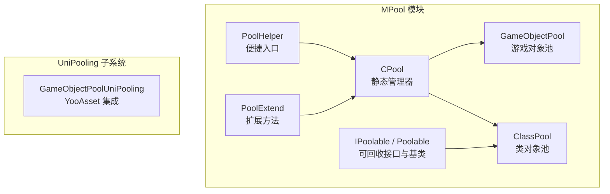
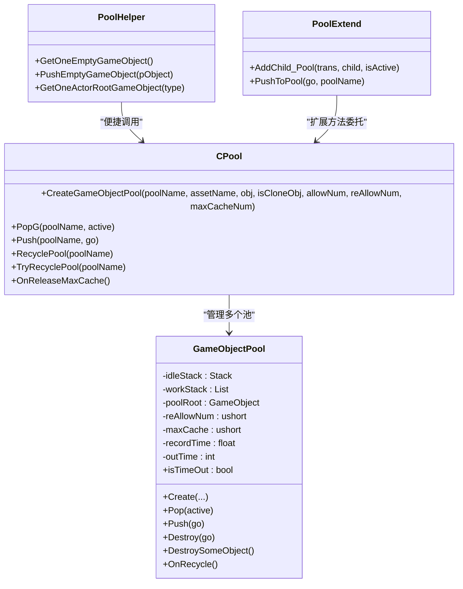
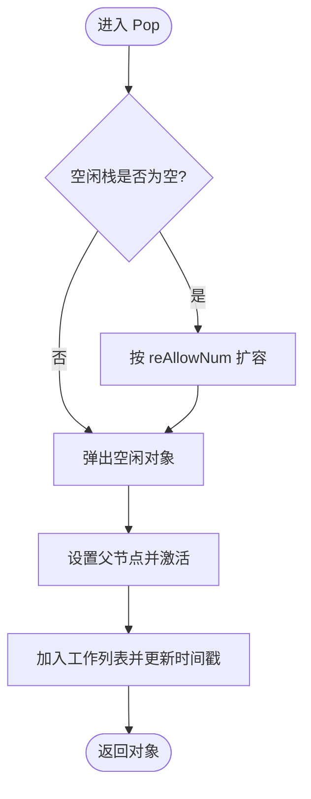
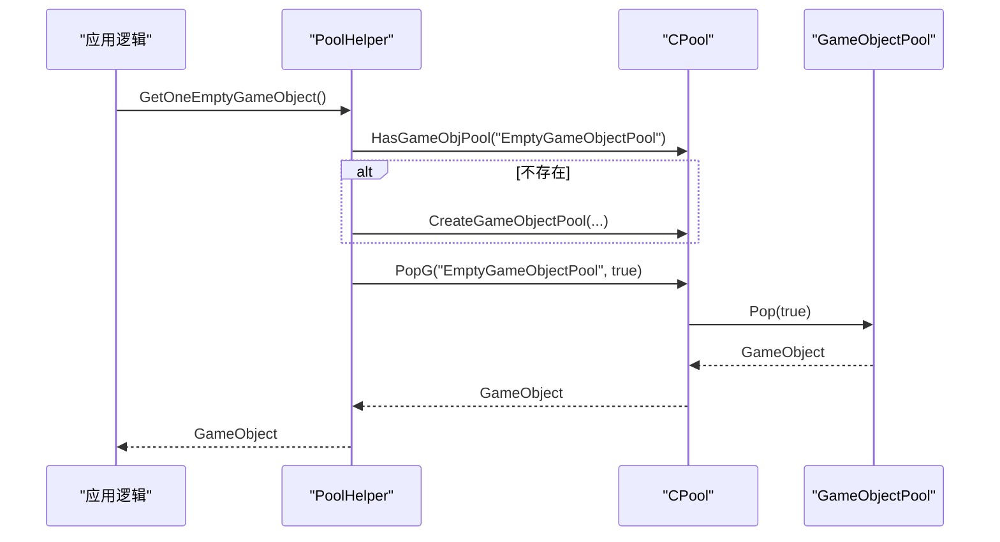
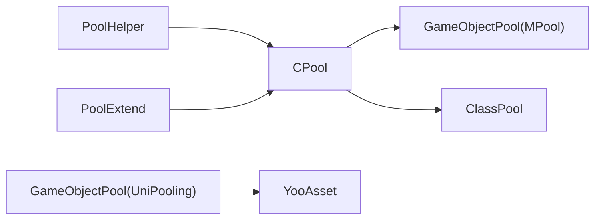

# GameObjectPool - Unity GameObject 对象池

<cite>
**本文引用的文件**   
- [GameObjectPool.cs](file://Assets/Game/Framework/MPool/GameObjectPool.cs)
- [CPool.cs](file://Assets/Game/Framework/MPool/CPool.cs)
- [IPoolable.cs](file://Assets/Game/Framework/MPool/IPoolable.cs)
- [ClassPool.cs](file://Assets/Game/Framework/MPool/ClassPool.cs)
- [PoolHelper.cs](file://Assets/Game/Framework/MPool/PoolHelper.cs)
- [PoolExtend.cs](file://Assets/Game/Framework/MPool/PoolExtend.cs)
- [GameObjectPool.cs（UniPooling）](file://Assets/Game/Scripts/MiniGame_Scripts/Utility/UniPooling/Runtime/GameObjectPool.cs)
</cite>

## 目录
1. [简介](#简介)
2. [项目结构](#项目结构)
3. [核心组件](#核心组件)
4. [架构总览](#架构总览)
5. [详细组件分析](#详细组件分析)
6. [依赖关系分析](#依赖关系分析)
7. [性能与内存优化](#性能与内存优化)
8. [故障排查指南](#故障排查指南)
9. [结论](#结论)
10. [附录：API 速查与使用示例](#附录api-速查与使用示例)

## 简介
本文件围绕 SimulationClient 中的 GameObject 对象池体系，重点解析 MPool 模块下的 GameObjectPool 及其协作类，说明其设计原理、实现机制与最佳实践。文档涵盖对象预分配、动态扩容、自动回收、超时清理、最大缓存控制等特性；并给出关键方法的使用方式、与 Unity 生命周期钩子的集成建议、常见场景的用法指引、配置项说明、GC 压力优化策略以及调试与排错技巧。

## 项目结构
MPool 模块位于 Assets/Game/Framework/MPool，提供两类对象池能力：
- 基于 GameObject 的对象池：GameObjectPool + CPool 管理
- 基于普通类的对象池：ClassPool + IPoolable/Poolable 抽象

此外，项目中还存在一个独立的 UniPooling 子系统的 GameObjectPool，用于与 YooAsset 异步加载流程结合。

图表来源
- [CPool.cs:1-263](file://Assets/Game/Framework/MPool/CPool.cs#L1-L263)
- [GameObjectPool.cs:1-191](file://Assets/Game/Framework/MPool/GameObjectPool.cs#L1-L191)
- [ClassPool.cs:1-127](file://Assets/Game/Framework/MPool/ClassPool.cs#L1-L127)
- [IPoolable.cs:1-71](file://Assets/Game/Framework/MPool/IPoolable.cs#L1-L71)
- [PoolHelper.cs:1-66](file://Assets/Game/Framework/MPool/PoolHelper.cs#L1-L66)
- [PoolExtend.cs:1-25](file://Assets/Game/Framework/MPool/PoolExtend.cs#L1-L25)
- [GameObjectPool.cs（UniPooling）:1-222](file://Assets/Game/Scripts/MiniGame_Scripts/Utility/UniPooling/Runtime/GameObjectPool.cs#L1-L222)

章节来源
- [CPool.cs:1-263](file://Assets/Game/Framework/MPool/CPool.cs#L1-L263)
- [GameObjectPool.cs:1-191](file://Assets/Game/Framework/MPool/GameObjectPool.cs#L1-L191)
- [ClassPool.cs:1-127](file://Assets/Game/Framework/MPool/ClassPool.cs#L1-L127)
- [IPoolable.cs:1-71](file://Assets/Game/Framework/MPool/IPoolable.cs#L1-L71)
- [PoolHelper.cs:1-66](file://Assets/Game/Framework/MPool/PoolHelper.cs#L1-L66)
- [PoolExtend.cs:1-25](file://Assets/Game/Framework/MPool/PoolExtend.cs#L1-L25)
- [GameObjectPool.cs（UniPooling）:1-222](file://Assets/Game/Scripts/MiniGame_Scripts/Utility/UniPooling/Runtime/GameObjectPool.cs#L1-L222)

## 核心组件
- CPool：全局静态管理器，负责创建、查找、回收 GameObject 池与类对象池，并提供统一 Pop/Push 入口。
- GameObjectPool：具体 GameObject 对象池实现，维护空闲栈与工作列表，支持预分配、按需扩容、超时回收、最大缓存裁剪。
- ClassPool：普通类对象池，配合 IPoolable/Poolable 实现轻量级对象复用。
- IPoolable/Poolable：定义可回收对象的通用协议与默认行为。
- PoolHelper：常用池名常量与便捷 API，简化 Actor 根节点、空对象等常见池的获取与归还。
- PoolExtend：为 Transform 和泛型类型提供池相关扩展方法。
- GameObjectPool（UniPooling）：与 YooAsset 集成的异步实例化对象池，适用于资源包场景。

章节来源
- [CPool.cs:1-263](file://Assets/Game/Framework/MPool/CPool.cs#L1-L263)
- [GameObjectPool.cs:1-191](file://Assets/Game/Framework/MPool/GameObjectPool.cs#L1-L191)
- [ClassPool.cs:1-127](file://Assets/Game/Framework/MPool/ClassPool.cs#L1-L127)
- [IPoolable.cs:1-71](file://Assets/Game/Framework/MPool/IPoolable.cs#L1-L71)
- [PoolHelper.cs:1-66](file://Assets/Game/Framework/MPool/PoolHelper.cs#L1-L66)
- [PoolExtend.cs:1-25](file://Assets/Game/Framework/MPool/PoolExtend.cs#L1-L25)
- [GameObjectPool.cs（UniPooling）:1-222](file://Assets/Game/Scripts/MiniGame_Scripts/Utility/UniPooling/Runtime/GameObjectPool.cs#L1-L222)

## 架构总览
下图展示了 MPool 中 GameObject 对象池的核心交互：CPool 作为门面，持有多个 GameObjectPool 实例；每个池内部通过空闲栈与工作列表管理对象生命周期，并在必要时进行扩容或裁剪。

图表来源
- [CPool.cs:1-263](file://Assets/Game/Framework/MPool/CPool.cs#L1-L263)
- [GameObjectPool.cs:1-191](file://Assets/Game/Framework/MPool/GameObjectPool.cs#L1-L191)
- [PoolHelper.cs:1-66](file://Assets/Game/Framework/MPool/PoolHelper.cs#L1-L66)
- [PoolExtend.cs:1-25](file://Assets/Game/Framework/MPool/PoolExtend.cs#L1-L25)

## 详细组件分析

### GameObjectPool（MPool）
- 设计要点
  - 以 Stack 管理空闲对象，List 记录工作对象，避免重复入池与非法状态。
  - 支持初始容量 Allow(allowNum)、按需扩容 Allow(reAllowNum)。
  - 支持最大缓存 maxCache，超出时销毁多余空闲对象。
  - 支持超时回收：当无工作对象且超过 outTime 秒标记为可回收。
  - OnRecycle 彻底释放所有对象与引用，防止内存泄漏。
- 关键方法与语义
  - Create：初始化池名称、资源名、克隆模式、父容器、初始数量与扩容策略。
  - Pop：从空闲栈取对象，若为空则按 reAllowNum 扩容；将对象挂载到合适父节点并加入工作列表。
  - Push：将对象放回空闲栈，确保不在工作列表中且未重复入池。
  - Destroy：直接销毁指定对象（从工作列表移除）。
  - DestroySomeObject：当空闲对象超过 maxCache 时销毁多余对象。
  - OnRecycle：清空空闲与工作对象，销毁对象与引用，标记池已释放。
- 与 Unity 生命周期的集成建议
  - Awake/Start：在场景启动阶段通过 CPool.CreateGameObjectPool 完成预分配。
  - Update：可在主循环中检查 isTimeOut 并调用 DestroySomeObject 或触发池回收。
  - OnDestroy：在场景卸载前调用 CPool.RecyclePool 或 TryRecyclePool，避免残留。

图表来源
- [GameObjectPool.cs:84-93](file://Assets/Game/Framework/MPool/GameObjectPool.cs#L84-L93)

章节来源
- [GameObjectPool.cs:1-191](file://Assets/Game/Framework/MPool/GameObjectPool.cs#L1-L191)

### CPool（静态管理器）
- 职责
  - 维护 GameObjectPool 字典与 ClassPool 字典。
  - 提供统一的创建、获取、归还、回收接口。
  - 提供 OnReleaseMaxCache 在场景切换后批量裁剪空闲对象。
- 重要方法
  - CreateGameObjectPool：创建并注册池，支持初始容量、扩容步长、最大缓存。
  - PopG/Push：从指定池获取/归还 GameObject。
  - RecyclePool/TryRecyclePool：立即回收或条件回收。
  - RecyclePoolByAsset：按资源名回收对应池。
  - OnReleaseMaxCache：遍历类池与游戏对象池执行最大缓存裁剪。

图表来源
- [PoolHelper.cs:45-54](file://Assets/Game/Framework/MPool/PoolHelper.cs#L45-L54)
- [CPool.cs:164-178](file://Assets/Game/Framework/MPool/CPool.cs#L164-L178)
- [CPool.cs:181-193](file://Assets/Game/Framework/MPool/CPool.cs#L181-L193)
- [GameObjectPool.cs:84-93](file://Assets/Game/Framework/MPool/GameObjectPool.cs#L84-L93)

章节来源
- [CPool.cs:1-263](file://Assets/Game/Framework/MPool/CPool.cs#L1-L263)
- [PoolHelper.cs:1-66](file://Assets/Game/Framework/MPool/PoolHelper.cs#L1-L66)

### ClassPool 与 IPoolable/Poolable
- ClassPool：基于 Stack 的类对象池，支持按需构造与延迟初始化，提供 canRelease 判断是否可整体释放。
- IPoolable/Poolable：定义 IsInPool、useFlagId、PushToPool、Recycle、OnRecycle 等协议，便于框架层统一管理回收时机与状态。

章节来源
- [ClassPool.cs:1-127](file://Assets/Game/Framework/MPool/ClassPool.cs#L1-L127)
- [IPoolable.cs:1-71](file://Assets/Game/Framework/MPool/IPoolable.cs#L1-L71)

### PoolExtend 与 PoolHelper
- PoolExtend：提供 AddChild_Pool、PushToPool 等扩展方法，简化对象挂接与归还。
- PoolHelper：封装常用池名与便捷 API，如获取空对象、Actor 根对象等。

章节来源
- [PoolExtend.cs:1-25](file://Assets/Game/Framework/MPool/PoolExtend.cs#L1-L25)
- [PoolHelper.cs:1-66](file://Assets/Game/Framework/MPool/PoolHelper.cs#L1-L66)

### GameObjectPool（UniPooling）
- 特点
  - 与 YooAsset 异步加载管线集成，使用 InstantiateOperation 队列缓存异步实例化结果。
  - 支持 SpawnCount 统计外部使用数，支持静默时间后自动销毁。
  - 提供 Restore/Discard 两种回收路径，支持强制克隆与用户数据透传。
- 适用场景
  - 资源包加载、按需实例化、大对象池管理与自动销毁。

章节来源
- [GameObjectPool.cs（UniPooling）:1-222](file://Assets/Game/Scripts/MiniGame_Scripts/Utility/UniPooling/Runtime/GameObjectPool.cs#L1-L222)

## 依赖关系分析
- CPool 强依赖 GameObjectPool 与 ClassPool，作为唯一对外暴露的管理器。
- GameObjectPool 依赖 Unity 基础 API（Instantiate、SetActive、Destroy）与自定义扩展 AddChild_Pool。
- PoolHelper 与 PoolExtend 对 CPool 进行薄封装，降低业务代码耦合度。
- UniPooling 的 GameObjectPool 独立于 MPool，面向 YooAsset 生态。

图表来源
- [CPool.cs:1-263](file://Assets/Game/Framework/MPool/CPool.cs#L1-L263)
- [GameObjectPool.cs:1-191](file://Assets/Game/Framework/MPool/GameObjectPool.cs#L1-L191)
- [ClassPool.cs:1-127](file://Assets/Game/Framework/MPool/ClassPool.cs#L1-L127)
- [PoolHelper.cs:1-66](file://Assets/Game/Framework/MPool/PoolHelper.cs#L1-L66)
- [PoolExtend.cs:1-25](file://Assets/Game/Framework/MPool/PoolExtend.cs#L1-L25)
- [GameObjectPool.cs（UniPooling）:1-222](file://Assets/Game/Scripts/MiniGame_Scripts/Utility/UniPooling/Runtime/GameObjectPool.cs#L1-L222)

## 性能与内存优化
- 预分配与扩容策略
  - 合理设置初始容量 allowNum 与扩容步长 reAllowNum，减少频繁扩容带来的 GC 与 Instantiate 开销。
  - 针对高频短生命周期对象（子弹、特效），适当增大初始容量与扩容步长。
- 最大缓存与超时回收
  - 设置 maxCache 限制空闲对象上限，避免长期占用内存。
  - 利用 isTimeOut 与 outTime 在长时间无使用时主动回收，降低峰值内存。
- 对象归属与层级
  - 使用 poolRoot 统一管理对象层级，避免散落导致难以回收。
  - 使用 AddChild_Pool 统一设置激活状态与父子关系，减少分支判断。
- 与 GC 的关系
  - 对象池显著减少频繁 Instantiate/Destroy 导致的托管堆分配与非托管对象抖动。
  - 注意避免在池对象上频繁创建临时字符串、数组等，尽量复用缓冲区。
- 监控与调优
  - 观察 workStack.Count 与 idleStack.Count 的变化趋势，评估扩容与裁剪阈值。
  - 在场景切换时调用 OnReleaseMaxCache 或 TryRecyclePool，及时释放不再使用的池。

[本节为通用指导，不直接分析具体文件]

## 故障排查指南
- 常见问题
  - 重复入池：Push 前需确保对象不在 workStack 且不在 idleStack，否则可能导致重复回收或丢失。
  - 忘记归还：务必在对象生命周期结束时调用 Push 或 CPool.Push，避免内存泄漏。
  - 池不存在：PopG 时若池未创建会返回 null，需在调用前检查或先创建。
  - 销毁时机：在场景卸载前调用 RecyclePool/TryRecyclePool，避免残留对象。
- 定位手段
  - 打印 workStack.Count 与 idleStack.Count，确认对象去向。
  - 检查 isTimeOut 与 outTime 配置，确认是否过早回收。
  - 使用 OnRecycle 断点，验证池回收流程是否正确执行。
- 修复建议
  - 在业务层封装统一的 Get/Return 方法，保证成对调用。
  - 在编辑器或测试环境中增加“未归还检测”，在帧末扫描 workStack 并告警。

章节来源
- [GameObjectPool.cs:95-111](file://Assets/Game/Framework/MPool/GameObjectPool.cs#L95-L111)
- [CPool.cs:181-213](file://Assets/Game/Framework/MPool/CPool.cs#L181-L213)
- [CPool.cs:232-242](file://Assets/Game/Framework/MPool/CPool.cs#L232-L242)

## 结论
MPool 的 GameObjectPool 提供了简洁高效的 GameObject 复用方案，结合 CPool 的统一管理与 PoolHelper 的便捷 API，能够在复杂场景中稳定地降低 Instantiate/Destroy 的性能开销。配合合理的预分配、扩容与裁剪策略，以及与 Unity 生命周期钩子的良好集成，可有效缓解 GC 压力并提升运行时稳定性。对于资源包驱动的场景，UniPooling 的 GameObjectPool 提供了异步实例化与自动销毁能力，适合与 YooAsset 协同工作。

[本节为总结性内容，不直接分析具体文件]

## 附录：API 速查与使用示例

### 关键 API 与参数说明
- CPool.CreateGameObjectPool(poolName, assetName, obj, isCloneObj, allowNum=1, reAllowNum=1, maxCacheNum=5)
  - poolName：池标识名
  - assetName：资源名（用于按资源回收）
  - obj：克隆参照物或根对象
  - isCloneObj：是否克隆对象
  - allowNum：初始容量
  - reAllowNum：扩容步长
  - maxCacheNum：最大空闲缓存
- CPool.PopG(poolName, active=true)
  - 从指定池取出对象，active 控制是否激活
- CPool.Push(poolName, go)
  - 归还对象至指定池
- CPool.RecyclePool(poolName) / TryRecyclePool(poolName)
  - 立即回收或条件回收池
- GameObjectPool.Pop(active=true)
  - 出栈对象，若空闲栈为空则扩容
- GameObjectPool.Push(go)
  - 入栈对象，确保不在工作列表且未重复入池
- GameObjectPool.Destroy(go)
  - 直接销毁对象（从工作列表移除）
- GameObjectPool.DestroySomeObject()
  - 裁剪空闲对象至 maxCache
- GameObjectPool.OnRecycle()
  - 彻底释放池内所有对象与引用

章节来源
- [CPool.cs:164-178](file://Assets/Game/Framework/MPool/CPool.cs#L164-L178)
- [CPool.cs:181-213](file://Assets/Game/Framework/MPool/CPool.cs#L181-L213)
- [CPool.cs:216-242](file://Assets/Game/Framework/MPool/CPool.cs#L216-L242)
- [GameObjectPool.cs:84-145](file://Assets/Game/Framework/MPool/GameObjectPool.cs#L84-L145)
- [GameObjectPool.cs:153-189](file://Assets/Game/Framework/MPool/GameObjectPool.cs#L153-L189)

### 典型使用流程（文字示例）
- 粒子系统
  - 在场景启动时创建粒子池（例如“ParticleExplosion”），设置合适的初始容量与扩容步长。
  - 需要时通过 CPool.PopG 获取对象，设置位置与旋转，播放动画或粒子效果。
  - 效果结束后调用 CPool.Push 归还，或在对象脚本中监听结束事件自动归还。
- UI 元素
  - 为按钮、提示框等创建专用池，避免频繁 Instantiate/Destroy。
  - 使用 PoolHelper.GetOneEmptyGameObject 快速获得空对象作为容器，再添加 UI 组件。
- 特效对象
  - 对高频短时特效对象采用较大的初始容量与扩容步长，减少卡顿。
  - 设置合理的 maxCache 与 outTime，避免长时间占用内存。

[本节为概念性示例，不直接分析具体文件]

### 与 Unity 生命周期钩子的集成建议
- Awake/Start
  - 初始化并预分配池：调用 CPool.CreateGameObjectPool 设置初始容量与扩容策略。
- Update
  - 周期性检查 isTimeOut 并调用 DestroySomeObject，或根据业务需求触发池回收。
- OnDestroy
  - 在场景卸载前调用 CPool.RecyclePool 或 TryRecyclePool，确保对象全部释放。

章节来源
- [GameObjectPool.cs:127-130](file://Assets/Game/Framework/MPool/GameObjectPool.cs#L127-L130)
- [CPool.cs:232-242](file://Assets/Game/Framework/MPool/CPool.cs#L232-L242)