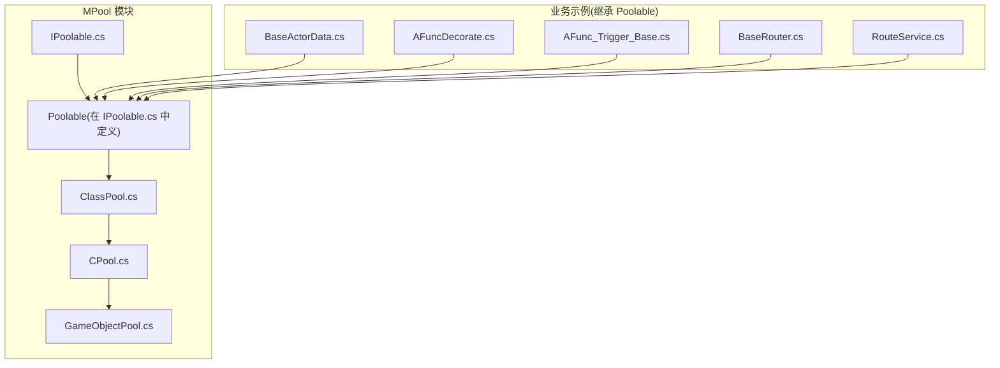
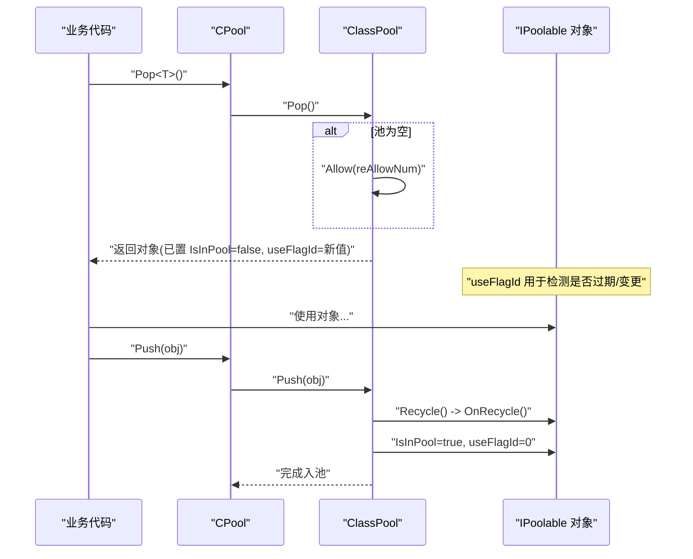
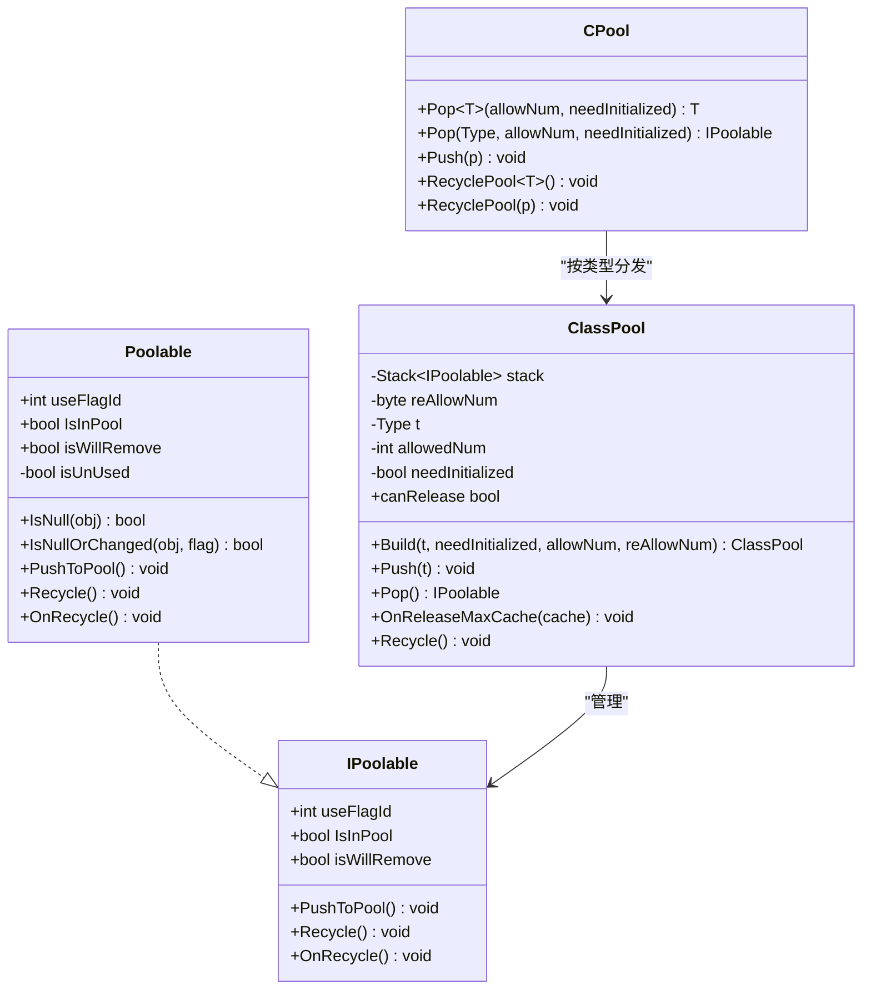
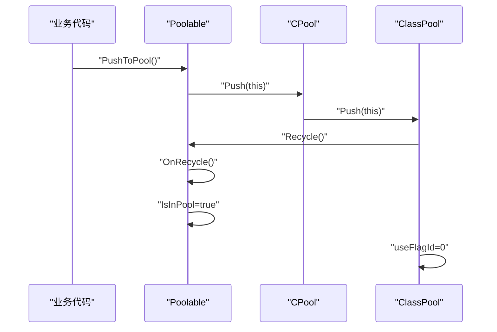
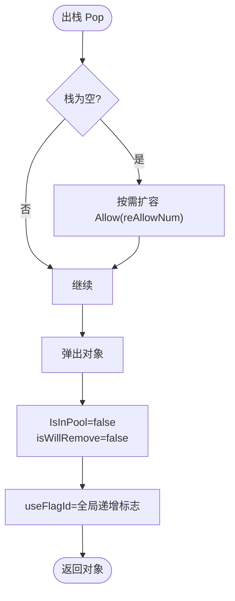
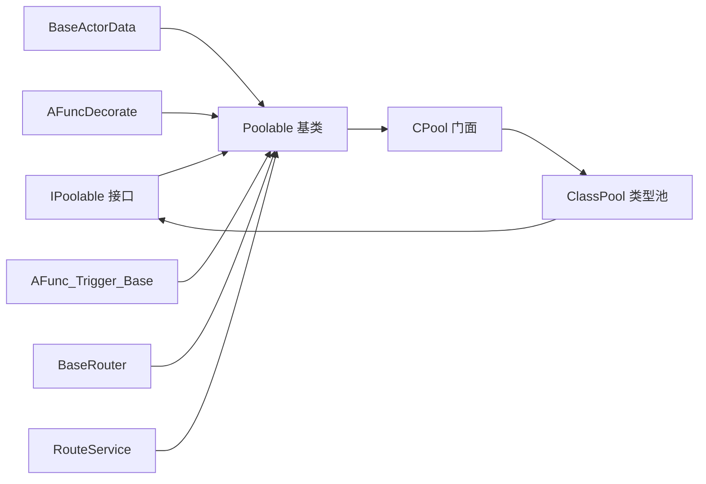

# IPoolable 接口与 Poolable 基类

<cite>
**本文引用的文件列表**
- [IPoolable.cs](file://Assets/Game/Framework/MPool/IPoolable.cs)
- [ClassPool.cs](file://Assets/Game/Framework/MPool/ClassPool.cs)
- [CPool.cs](file://Assets/Game/Framework/MPool/CPool.cs)
- [GameObjectPool.cs](file://Assets/Game/Framework/MPool/GameObjectPool.cs)
- [BaseActorData.cs](file://Assets/Game/Scripts/Game/Runtime/Logic/Actor/BaseActorData.cs)
- [AFuncDecorate.cs](file://Assets/Game/Scripts/Game/Runtime/Logic/Decorate/AFuncDecorate.cs)
- [AFunc_Trigger_Base.cs](file://Assets/Game/Scripts/Game/Runtime/Logic/Decorate/Trigger/AFunc_Trigger_Base.cs)
- [BaseRouter.cs](file://Assets/Game/Scripts/Game/Runtime/Logic/Router/BaseRouter.cs)
- [RouteService.cs](file://Assets/Game/Scripts/Game/Runtime/Logic/Router/RouteService.cs)
</cite>

## 目录
1. [简介](#简介)
2. [项目结构](#项目结构)
3. [核心组件](#核心组件)
4. [架构总览](#架构总览)
5. [详细组件分析](#详细组件分析)
6. [依赖关系分析](#依赖关系分析)
7. [性能考虑](#性能考虑)
8. [故障排查指南](#故障排查指南)
9. [结论](#结论)
10. [附录：使用示例与最佳实践](#附录使用示例与最佳实践)

## 简介
本文件围绕 SimulationClient 中的对象池化体系，聚焦于 IPoolable 接口与 Poolable 抽象基类的实现与使用。对象池化的核心思想是“复用对象、减少分配与销毁”，从而降低 GC 压力、提升运行时稳定性与帧率表现。在本项目中，IPoolable 定义了可被池化管理的对象契约；Poolable 提供了默认实现，简化了状态管理与生命周期回调；CPool 与 ClassPool 则负责按类型维护对象栈并自动初始化/回收。

## 项目结构
与 IPoolable/Poolable 相关的核心代码位于 MPool 模块中，同时游戏逻辑层存在多处继承 Poolable 的示例类，便于理解实际用法。

图表来源
- [IPoolable.cs:1-71](file://Assets/Game/Framework/MPool/IPoolable.cs#L1-L71)
- [ClassPool.cs:1-127](file://Assets/Game/Framework/MPool/ClassPool.cs#L1-L127)
- [CPool.cs:1-263](file://Assets/Game/Framework/MPool/CPool.cs#L1-L263)
- [GameObjectPool.cs:1-191](file://Assets/Game/Framework/MPool/GameObjectPool.cs#L1-L191)
- [BaseActorData.cs](file://Assets/Game/Scripts/Game/Runtime/Logic/Actor/BaseActorData.cs)
- [AFuncDecorate.cs](file://Assets/Game/Scripts/Game/Runtime/Logic/Decorate/AFuncDecorate.cs)
- [AFunc_Trigger_Base.cs](file://Assets/Game/Scripts/Game/Runtime/Logic/Decorate/Trigger/AFunc_Trigger_Base.cs)
- [BaseRouter.cs](file://Assets/Game/Scripts/Game/Runtime/Logic/Router/BaseRouter.cs)
- [RouteService.cs](file://Assets/Game/Scripts/Game/Runtime/Logic/Router/RouteService.cs)

章节来源
- [IPoolable.cs:1-71](file://Assets/Game/Framework/MPool/IPoolable.cs#L1-L71)
- [ClassPool.cs:1-127](file://Assets/Game/Framework/MPool/ClassPool.cs#L1-L127)
- [CPool.cs:1-263](file://Assets/Game/Framework/MPool/CPool.cs#L1-L263)
- [GameObjectPool.cs:1-191](file://Assets/Game/Framework/MPool/GameObjectPool.cs#L1-L191)

## 核心组件
- IPoolable 接口：定义可池化对象的统一契约，包括唯一标识 useFlagId、池状态 IsInPool、移除标记 isWillRemove，以及入池 PushToPool、框架回收 Recycle、重置回调 OnRecycle。
- Poolable 抽象基类：提供默认实现，封装 isUnUsed 计算、IsNull/IsNullOrChanged 静态辅助方法，以及 PushToPool/Recycle/OnRecycle 的标准流程。
- ClassPool：按类型管理对象栈，支持按需扩容、出栈时设置 useFlagId、入栈时调用 Recycle 并复位状态。
- CPool：全局入口，按类型分发到对应 ClassPool，并提供 GameObjectPool 的管理能力（与本主题相关但非重点）。

章节来源
- [IPoolable.cs:1-71](file://Assets/Game/Framework/MPool/IPoolable.cs#L1-L71)
- [ClassPool.cs:1-127](file://Assets/Game/Framework/MPool/ClassPool.cs#L1-L127)
- [CPool.cs:1-263](file://Assets/Game/Framework/MPool/CPool.cs#L1-L263)

## 架构总览
下图展示了从业务侧获取对象、使用对象、归还对象的全链路交互，以及关键状态变化。

图表来源
- [CPool.cs:55-91](file://Assets/Game/Framework/MPool/CPool.cs#L55-L91)
- [ClassPool.cs:62-96](file://Assets/Game/Framework/MPool/ClassPool.cs#L62-L96)
- [IPoolable.cs:1-71](file://Assets/Game/Framework/MPool/IPoolable.cs#L1-L71)

## 详细组件分析

### IPoolable 接口详解
- useFlagId：每次从池中取出的对象会被赋予新的唯一标识，用于判断对象是否已被回收或替换。常见用法是在持有引用处比对 useFlagId，若不一致则视为失效。
- IsInPool：对象当前是否在池中。用于避免重复入池或误用。
- isWillRemove：移除标记。当对象被标记为即将移除时，即使仍在外部持有，也应被视为不可用。
- PushToPool()：将对象归还给池。通常由业务侧主动调用。
- Recycle()：框架内部调用，禁止逻辑层直接调用。负责重置对象状态并触发 OnRecycle。
- OnRecycle()：对象重置回调，子类应在此清理资源、重置字段、取消订阅等。

章节来源
- [IPoolable.cs:7-22](file://Assets/Game/Framework/MPool/IPoolable.cs#L7-L22)

### Poolable 抽象基类详解
- isUnUsed：派生属性，当 isWillRemove 为真或 IsInPool 为真时，表示对象处于“未使用”状态。
- IsNull(IPoolable obj)：静态辅助方法，判定对象是否为 null、isWillRemove 为真或已在池中。常用于批量遍历前的快速过滤。
- IsNullOrChanged(IPoolable obj, int flag)：在 Null 判定基础上，额外比较 useFlagId 是否与传入标志一致，用于检测对象是否被替换。
- PushToPool()：若不在池中，则通过 CPool.Push(this) 入池。
- Recycle()：框架层调用。先清除 isWillRemove，再执行 OnRecycle，最后标记 IsInPool=true。
- OnRecycle()：虚方法，默认空实现，供子类覆盖以进行重置。

图表来源
- [IPoolable.cs:1-71](file://Assets/Game/Framework/MPool/IPoolable.cs#L1-L71)
- [ClassPool.cs:1-127](file://Assets/Game/Framework/MPool/ClassPool.cs#L1-L127)
- [CPool.cs:1-263](file://Assets/Game/Framework/MPool/CPool.cs#L1-L263)

章节来源
- [IPoolable.cs:24-71](file://Assets/Game/Framework/MPool/IPoolable.cs#L24-L71)
- [ClassPool.cs:1-127](file://Assets/Game/Framework/MPool/ClassPool.cs#L1-L127)
- [CPool.cs:1-263](file://Assets/Game/Framework/MPool/CPool.cs#L1-L263)

### 关键方法与生命周期时序

#### 入池与回收时序

图表来源
- [IPoolable.cs:48-65](file://Assets/Game/Framework/MPool/IPoolable.cs#L48-L65)
- [ClassPool.cs:62-77](file://Assets/Game/Framework/MPool/ClassPool.cs#L62-L77)
- [CPool.cs:82-91](file://Assets/Game/Framework/MPool/CPool.cs#L82-L91)

#### 出池与 useFlagId 更新

图表来源
- [ClassPool.cs:80-96](file://Assets/Game/Framework/MPool/ClassPool.cs#L80-L96)

## 依赖关系分析
- Poolable 依赖 CPool 完成入池操作。
- ClassPool 依赖 IPoolable 契约，并通过 Stack 管理对象生命周期。
- CPool 作为门面，根据类型查找/创建 ClassPool，并将 Push/Pop 请求路由至具体池。
- 业务侧示例类（如 BaseActorData、AFuncDecorate、BaseRouter 等）继承 Poolable，获得对象池能力。

图表来源
- [IPoolable.cs:1-71](file://Assets/Game/Framework/MPool/IPoolable.cs#L1-L71)
- [ClassPool.cs:1-127](file://Assets/Game/Framework/MPool/ClassPool.cs#L1-L127)
- [CPool.cs:1-263](file://Assets/Game/Framework/MPool/CPool.cs#L1-L263)
- [BaseActorData.cs](file://Assets/Game/Scripts/Game/Runtime/Logic/Actor/BaseActorData.cs)
- [AFuncDecorate.cs](file://Assets/Game/Scripts/Game/Runtime/Logic/Decorate/AFuncDecorate.cs)
- [AFunc_Trigger_Base.cs](file://Assets/Game/Scripts/Game/Runtime/Logic/Decorate/Trigger/AFunc_Trigger_Base.cs)
- [BaseRouter.cs](file://Assets/Game/Scripts/Game/Runtime/Logic/Router/BaseRouter.cs)
- [RouteService.cs](file://Assets/Game/Scripts/Game/Runtime/Logic/Router/RouteService.cs)

章节来源
- [IPoolable.cs:1-71](file://Assets/Game/Framework/MPool/IPoolable.cs#L1-L71)
- [ClassPool.cs:1-127](file://Assets/Game/Framework/MPool/ClassPool.cs#L1-L127)
- [CPool.cs:1-263](file://Assets/Game/Framework/MPool/CPool.cs#L1-L263)

## 性能考虑
- 避免重复入池：PushToPool 会检查 IsInPool，防止重复入池导致状态错乱。
- 合理使用 needInitialized：ClassPool 支持跳过构造函数以提升性能，但要求所有字段在使用前被正确赋值，否则会出现脏数据。
- useFlagId 校验：在持有引用处比对 useFlagId，可低成本检测对象是否已被回收并重新分配。
- 最大缓存控制：ClassPool 支持 OnReleaseMaxCache 和 canRelease 机制，在场景切换或内存紧张时释放多余对象。
- 对象池根节点：GameObjectPool 使用 poolRoot 统一管理实例，便于批量销毁与层级组织。

[本节为通用性能建议，不直接分析具体文件]

## 故障排查指南
- 问题：对象仍被外部引用却显示“已在池中”。排查 IsInPool 与 isWillRemove 的状态流转，确认是否存在重复入池或未正确重置。
- 问题：useFlagId 不一致导致逻辑异常。确保在持有引用处进行 IsNullOrChanged 校验，或在回调中及时更新本地缓存的 useFlagId。
- 问题：Recycle 未被调用。检查 PushToPool 路径是否正确进入 ClassPool.Push，以及 CPool.Push 是否命中对应类型池。
- 问题：needInitialized=false 导致字段脏数据。确认使用前对所有字段显式赋值，或改为 needInitialized=true。

章节来源
- [ClassPool.cs:62-96](file://Assets/Game/Framework/MPool/ClassPool.cs#L62-L96)
- [CPool.cs:82-91](file://Assets/Game/Framework/MPool/CPool.cs#L82-L91)
- [IPoolable.cs:48-65](file://Assets/Game/Framework/MPool/IPoolable.cs#L48-L65)

## 结论
IPoolable 与 Poolable 构成了 SimulationClient 对象池化的基础契约与默认实现。通过 useFlagId、IsInPool、isWillRemove 三要素，配合 ClassPool 的栈式管理与 CPool 的门面路由，实现了高效、安全的对象复用。遵循本文的最佳实践与注意事项，可在保证功能正确性的前提下显著降低 GC 压力并提升运行稳定性。

[本节为总结性内容，不直接分析具体文件]

## 附录：使用示例与最佳实践

### 如何继承 Poolable 实现自定义可池化对象
- 步骤概览
  - 让自定义类继承 Poolable。
  - 在 OnRecycle 中重置所有可变状态（字段、事件订阅、定时器、外部引用等）。
  - 使用时通过 CPool.Pop<T>() 获取对象，并在不再需要时调用 PushToPool() 归还。
  - 在持有引用处使用 Poolable.IsNull / IsNullOrChanged 进行有效性检查。

- 参考示例位置
  - [BaseActorData.cs](file://Assets/Game/Scripts/Game/Runtime/Logic/Actor/BaseActorData.cs)
  - [AFuncDecorate.cs](file://Assets/Game/Scripts/Game/Runtime/Logic/Decorate/AFuncDecorate.cs)
  - [AFunc_Trigger_Base.cs](file://Assets/Game/Scripts/Game/Runtime/Logic/Decorate/Trigger/AFunc_Trigger_Base.cs)
  - [BaseRouter.cs](file://Assets/Game/Scripts/Game/Runtime/Logic/Router/BaseRouter.cs)
  - [RouteService.cs](file://Assets/Game/Scripts/Game/Runtime/Logic/Router/RouteService.cs)

章节来源
- [BaseActorData.cs](file://Assets/Game/Scripts/Game/Runtime/Logic/Actor/BaseActorData.cs)
- [AFuncDecorate.cs](file://Assets/Game/Scripts/Game/Runtime/Logic/Decorate/AFuncDecorate.cs)
- [AFunc_Trigger_Base.cs](file://Assets/Game/Scripts/Game/Runtime/Logic/Decorate/Trigger/AFunc_Trigger_Base.cs)
- [BaseRouter.cs](file://Assets/Game/Scripts/Game/Runtime/Logic/Router/BaseRouter.cs)
- [RouteService.cs](file://Assets/Game/Scripts/Game/Runtime/Logic/Router/RouteService.cs)

### 状态管理最佳实践
- 始终在 OnRecycle 中彻底重置对象状态，避免残留数据影响下次使用。
- 使用 useFlagId 做“版本”校验，避免使用已回收并被重新分配的对象。
- 仅在业务侧调用 PushToPool，不要直接调用 Recycle。
- 对可能跨帧持有的引用，定期使用 IsNullOrChanged 校验。

章节来源
- [IPoolable.cs:24-71](file://Assets/Game/Framework/MPool/IPoolable.cs#L24-L71)
- [ClassPool.cs:80-96](file://Assets/Game/Framework/MPool/ClassPool.cs#L80-L96)

### 线程安全与并发注意
- 当前实现基于 Stack 与字典，未包含显式锁保护。若在多线程环境下使用，请在上层增加同步策略（例如单线程调度或使用线程安全集合），以避免竞态条件。
- 建议在主线程或固定工作线程内集中处理对象的 Pop/Push，减少跨线程访问风险。

[本节为通用指导，不直接分析具体文件]