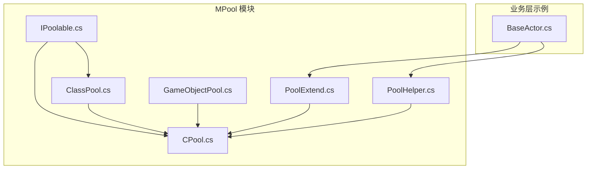
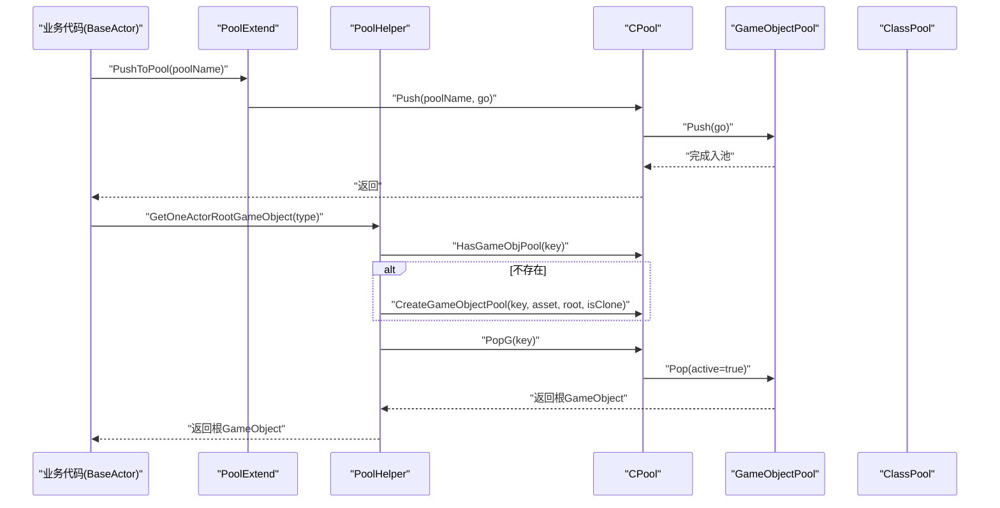
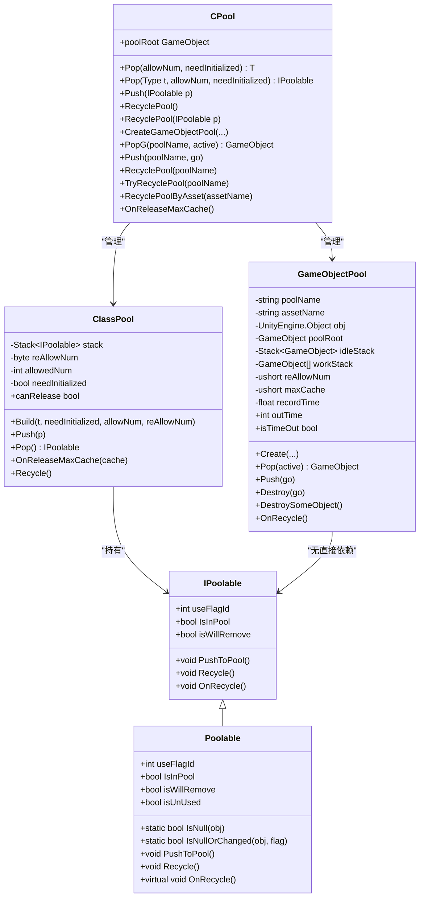
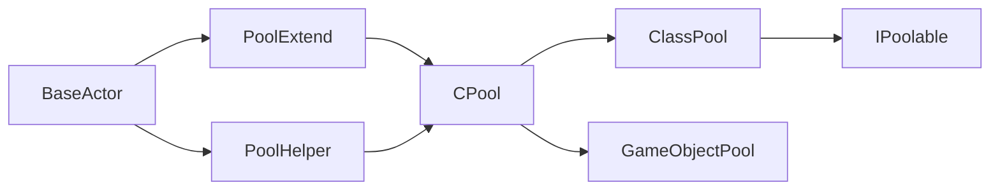

# 对象池工具类和扩展方法

<cite>
**本文引用的文件**
- [PoolExtend.cs](file://Assets/Game/Framework/MPool/PoolExtend.cs)
- [PoolHelper.cs](file://Assets/Game/Framework/MPool/PoolHelper.cs)
- [IPoolable.cs](file://Assets/Game/Framework/MPool/IPoolable.cs)
- [ClassPool.cs](file://Assets/Game/Framework/MPool/ClassPool.cs)
- [GameObjectPool.cs](file://Assets/Game/Framework/MPool/GameObjectPool.cs)
- [CPool.cs](file://Assets/Game/Framework/MPool/CPool.cs)
- [BaseActor.cs](file://Assets/Game/Scripts/Game/Runtime/Logic/Actor/BaseActor.cs)
</cite>

## 目录
1. [简介](#简介)
2. [项目结构](#项目结构)
3. [核心组件](#核心组件)
4. [架构总览](#架构总览)
5. [详细组件分析](#详细组件分析)
6. [依赖关系分析](#依赖关系分析)
7. [性能与内存特性](#性能与内存特性)
8. [故障排查指南](#故障排查指南)
9. [结论](#结论)
10. [附录：最佳实践与扩展指南](#附录最佳实践与扩展指南)

## 简介
本文件聚焦于 SimulationClient 中 MPool 模块的对象池工具类与扩展方法，重点说明以下方面：
- PoolExtend 扩展方法库提供的便捷 API（如 Transform 子节点管理、对象池 Pop/Push 的链式友好封装）
- PoolHelper 辅助类的实用能力（批量对象操作、按类型选择根对象池、空 GameObject 池等）
- 与主对象池系统（CPool、ClassPool、GameObjectPool、IPoolable/Poolable）的集成方式
- 错误处理与异常场景的处理策略
- 设计原则、扩展点与自定义工具方法的指导
- 实际使用场景与最佳实践

## 项目结构
MPool 模块位于 Assets/Game/Framework/MPool 下，包含以下关键文件：
- IPoolable.cs：定义可池化对象的接口与抽象基类
- ClassPool.cs：通用类对象池实现
- GameObjectPool.cs：Unity GameObject 对象池实现
- CPool.cs：统一入口静态类，聚合类池与游戏对象池
- PoolExtend.cs：面向开发者的扩展方法集合
- PoolHelper.cs：常用对象池名称常量与便捷工具方法

图表来源
- [IPoolable.cs:1-71](file://Assets/Game/Framework/MPool/IPoolable.cs#L1-L71)
- [ClassPool.cs:1-127](file://Assets/Game/Framework/MPool/ClassPool.cs#L1-L127)
- [GameObjectPool.cs:1-191](file://Assets/Game/Framework/MPool/GameObjectPool.cs#L1-L191)
- [CPool.cs:1-263](file://Assets/Game/Framework/MPool/CPool.cs#L1-L263)
- [PoolExtend.cs:1-25](file://Assets/Game/Framework/MPool/PoolExtend.cs#L1-L25)
- [PoolHelper.cs:1-66](file://Assets/Game/Framework/MPool/PoolHelper.cs#L1-L66)
- [BaseActor.cs:70-140](file://Assets/Game/Scripts/Game/Runtime/Logic/Actor/BaseActor.cs#L70-L140)

章节来源
- [PoolExtend.cs:1-25](file://Assets/Game/Framework/MPool/PoolExtend.cs#L1-L25)
- [PoolHelper.cs:1-66](file://Assets/Game/Framework/MPool/PoolHelper.cs#L1-L66)
- [IPoolable.cs:1-71](file://Assets/Game/Framework/MPool/IPoolable.cs#L1-L71)
- [ClassPool.cs:1-127](file://Assets/Game/Framework/MPool/ClassPool.cs#L1-L127)
- [GameObjectPool.cs:1-191](file://Assets/Game/Framework/MPool/GameObjectPool.cs#L1-L191)
- [CPool.cs:1-263](file://Assets/Game/Framework/MPool/CPool.cs#L1-L263)
- [BaseActor.cs:70-140](file://Assets/Game/Scripts/Game/Runtime/Logic/Actor/BaseActor.cs#L70-L140)

## 核心组件
本节概述各组件职责与协作关系。

- IPoolable/Poolable
  - 定义可池化对象的生命周期钩子与状态字段（是否已在池中、是否将被移除、useFlagId 用于变更检测）
  - 提供默认 PushToPool/Recycle/OnRecycle 行为，简化逻辑层复用

- ClassPool
  - 基于 Stack<IPoolable> 的泛型类对象池
  - 支持按需扩容、标记回收、最大缓存裁剪、释放判定

- GameObjectPool
  - 针对 Unity GameObject 的池化实现
  - 维护空闲栈与工作列表，支持超时自动回收、超出最大缓存销毁、完整回收流程

- CPool
  - 统一静态入口，管理 ClassPool 字典与 GameObjectPool 字典
  - 提供 Pop/Push、创建/回收/尝试回收、按资源名回收、全局最大缓存清理等能力

- PoolExtend
  - 为 Transform 提供 AddChild_Pool 便捷方法
  - 为 IPoolable 提供 PopFromPool 便捷方法
  - 为 GameObject 提供 PushToPool 便捷方法

- PoolHelper
  - 集中 Actor 相关根对象池名称常量
  - 根据碰撞体类型返回对应根对象池名并获取一个可用根 GameObject
  - 提供“空 GameObject”池的获取与归还

章节来源
- [IPoolable.cs:1-71](file://Assets/Game/Framework/MPool/IPoolable.cs#L1-L71)
- [ClassPool.cs:1-127](file://Assets/Game/Framework/MPool/ClassPool.cs#L1-L127)
- [GameObjectPool.cs:1-191](file://Assets/Game/Framework/MPool/GameObjectPool.cs#L1-L191)
- [CPool.cs:1-263](file://Assets/Game/Framework/MPool/CPool.cs#L1-L263)
- [PoolExtend.cs:1-25](file://Assets/Game/Framework/MPool/PoolExtend.cs#L1-L25)
- [PoolHelper.cs:1-66](file://Assets/Game/Framework/MPool/PoolHelper.cs#L1-L66)

## 架构总览
下图展示从业务层到对象池系统的调用路径与数据流。

图表来源
- [PoolExtend.cs:17-21](file://Assets/Game/Framework/MPool/PoolExtend.cs#L17-L21)
- [PoolHelper.cs:21-54](file://Assets/Game/Framework/MPool/PoolHelper.cs#L21-L54)
- [CPool.cs:163-213](file://Assets/Game/Framework/MPool/CPool.cs#L163-L213)
- [GameObjectPool.cs:84-111](file://Assets/Game/Framework/MPool/GameObjectPool.cs#L84-L111)
- [BaseActor.cs:79-140](file://Assets/Game/Scripts/Game/Runtime/Logic/Actor/BaseActor.cs#L79-L140)

## 详细组件分析

### PoolExtend 扩展方法库
- 功能概览
  - AddChild_Pool(Transform, Transform, bool): 将子 Transform 挂载到父节点并可控制激活状态
  - PopFromPool<T>(this T): 通过泛型约束直接对当前实例执行出池，返回已就绪对象
  - PushToPool(this GameObject, string): 将 GameObject 归还至指定名称的对象池

- 设计要点
  - 以 this 扩展方法形式提供链式友好的 API，减少样板代码
  - 内部委托给 CPool 的核心 Pop/Push 能力，保持单一职责

- 典型用法
  - 在 Actor 生命周期结束时，将自身或子对象推回对应根对象池
  - 在需要时直接从对象池取出一个可用的 Actor 根对象

章节来源
- [PoolExtend.cs:7-21](file://Assets/Game/Framework/MPool/PoolExtend.cs#L7-L21)
- [BaseActor.cs:79-82](file://Assets/Game/Scripts/Game/Runtime/Logic/Actor/BaseActor.cs#L79-L82)

### PoolHelper 辅助类
- 功能概览
  - GetActorRootPoolName(ColliderType): 根据碰撞体类型映射到对应的根对象池名
  - GetOneActorRootGameObject(ColliderType): 若对应池不存在则创建，然后弹出一个根 GameObject
  - GetOneEmptyGameObject()/PushEmptyGameObject(GameObject): 提供“空 GameObject”池的获取与归还

- 设计要点
  - 将 Actor 根对象池命名规则集中管理，避免散落的字符串常量
  - 懒创建池并在首次使用时初始化，降低启动开销
  - 对常见场景提供一键式 API，提升可读性与一致性

- 典型用法
  - 在 Actor 初始化阶段，根据所需碰撞体类型获取根对象
  - 在 UI 或调试场景中快速获得一个空的 GameObject 作为容器

章节来源
- [PoolHelper.cs:9-66](file://Assets/Game/Framework/MPool/PoolHelper.cs#L9-L66)
- [BaseActor.cs:135-140](file://Assets/Game/Scripts/Game/Runtime/Logic/Actor/BaseActor.cs#L135-L140)

### 与主对象池系统的集成
- CPool 作为统一入口，对外暴露两类能力：
  - 类对象池：Pop<T>/Push(IPoolable)/RecyclePool<T>()/RecyclePool(IPoolable)
  - GameObject 池：CreateGameObjectPool/PopG/Push/RecyclePool/TryRecyclePool/RecyclePoolByAsset
- ClassPool 与 GameObjectPool 分别负责不同类型对象的分配、回收与容量管理
- IPoolable/Poolable 为类对象提供统一的回收语义与状态管理

图表来源
- [IPoolable.cs:1-71](file://Assets/Game/Framework/MPool/IPoolable.cs#L1-L71)
- [ClassPool.cs:1-127](file://Assets/Game/Framework/MPool/ClassPool.cs#L1-L127)
- [GameObjectPool.cs:1-191](file://Assets/Game/Framework/MPool/GameObjectPool.cs#L1-L191)
- [CPool.cs:1-263](file://Assets/Game/Framework/MPool/CPool.cs#L1-L263)

章节来源
- [IPoolable.cs:1-71](file://Assets/Game/Framework/MPool/IPoolable.cs#L1-L71)
- [ClassPool.cs:1-127](file://Assets/Game/Framework/MPool/ClassPool.cs#L1-L127)
- [GameObjectPool.cs:1-191](file://Assets/Game/Framework/MPool/GameObjectPool.cs#L1-L191)
- [CPool.cs:1-263](file://Assets/Game/Framework/MPool/CPool.cs#L1-L263)

## 依赖关系分析
- 低耦合高内聚
  - PoolExtend 仅依赖 CPool 的静态方法，不感知具体池实现细节
  - PoolHelper 通过 CPool 的 HasGameObjPool/CreateGameObjectPool/PopG 组合完成懒创建与取用
- 外部依赖
  - 强依赖 UnityEngine（Transform、GameObject、Time 等）
  - 业务层通过扩展方法与辅助类间接使用对象池，避免直接耦合底层实现
- 可能的循环依赖
  - 当前结构未发现循环引用；扩展与辅助类均单向依赖 CPool

图表来源
- [PoolExtend.cs:1-25](file://Assets/Game/Framework/MPool/PoolExtend.cs#L1-L25)
- [PoolHelper.cs:1-66](file://Assets/Game/Framework/MPool/PoolHelper.cs#L1-L66)
- [CPool.cs:1-263](file://Assets/Game/Framework/MPool/CPool.cs#L1-L263)
- [BaseActor.cs:79-140](file://Assets/Game/Scripts/Game/Runtime/Logic/Actor/BaseActor.cs#L79-L140)

章节来源
- [PoolExtend.cs:1-25](file://Assets/Game/Framework/MPool/PoolExtend.cs#L1-L25)
- [PoolHelper.cs:1-66](file://Assets/Game/Framework/MPool/PoolHelper.cs#L1-L66)
- [CPool.cs:1-263](file://Assets/Game/Framework/MPool/CPool.cs#L1-L263)
- [BaseActor.cs:79-140](file://Assets/Game/Scripts/Game/Runtime/Logic/Actor/BaseActor.cs#L79-L140)

## 性能与内存特性
- 类对象池
  - 按需扩容：当栈为空时按 reAllowNum 批量创建，减少频繁分配
  - 可选跳过构造函数：needInitialized=false 时使用非初始化实例化，提高性能但需确保使用前完全赋值
  - 最大缓存裁剪：OnReleaseMaxCache 可在场景切换后主动释放多余对象
- GameObject 池
  - 空闲/工作双栈分离：便于统计与超时回收
  - 超时回收：当工作对象为空且超过 outTime 秒，可触发销毁策略
  - 最大缓存限制：超出 maxCache 时销毁多余空闲对象，控制峰值内存
- 统一释放
  - CPool.OnReleaseMaxCache 会遍历所有类池与游戏对象池，进行裁剪与回收

章节来源
- [ClassPool.cs:29-127](file://Assets/Game/Framework/MPool/ClassPool.cs#L29-L127)
- [GameObjectPool.cs:43-145](file://Assets/Game/Framework/MPool/GameObjectPool.cs#L43-L145)
- [CPool.cs:14-42](file://Assets/Game/Framework/MPool/CPool.cs#L14-L42)

## 故障排查指南
- 常见问题与定位
  - 重复入池：ClassPool.Push 会检查 IsInPool 与 Contains，避免重复入栈
  - 未创建即弹出：CPool.PopG 在未找到池时会警告并返回 null，需在业务侧判空
  - 池名无效：CPool.RecycleGameObjectPool 对空名进行警告保护
  - 非资源追踪对象入池：CPool.Push 对空池名情况会销毁对象并提示
- 建议排查步骤
  - 确认池名是否正确（参考 PoolHelper 中的常量）
  - 确认是否在合适时机 Push（例如对象销毁前）
  - 检查是否有重复 Push 或忘记 Pop 的情况
  - 关注控制台日志中的警告信息，快速定位问题

章节来源
- [ClassPool.cs:62-77](file://Assets/Game/Framework/MPool/ClassPool.cs#L62-L77)
- [CPool.cs:138-213](file://Assets/Game/Framework/MPool/CPool.cs#L138-L213)

## 结论
- PoolExtend 与 PoolHelper 提供了面向业务的便捷 API，显著提升了对象池使用的可读性与开发效率
- 通过 CPool 的统一入口，类对象与 GameObject 对象池被良好解耦，便于扩展与维护
- 合理的扩容、裁剪与超时回收机制有助于控制内存峰值与 GC 压力
- 建议在业务层遵循“谁创建谁回收”的原则，结合工具类提供的便捷方法，形成一致的回收模式

## 附录：最佳实践与扩展指南
- 使用建议
  - 优先使用 PoolHelper 提供的 Actor 根对象池方法，避免散落字符串常量
  - 使用 PoolExtend 的扩展方法简化 Push/Pop 调用，保持代码简洁
  - 在对象生命周期结束处及时 Push，避免悬挂引用导致内存泄漏
- 自定义工具方法扩展
  - 在 PoolExtend 中添加新的 this 扩展方法，封装常用组合操作（如批量 Push、条件 Pop）
  - 在 PoolHelper 中新增按业务维度命名的池获取方法，集中管理池名与初始化逻辑
- 错误处理与健壮性
  - 对 PopG 返回值进行判空处理
  - 对 Push 的池名有效性进行检查，必要时降级为直接销毁
- 与主对象池系统的集成
  - 所有扩展与辅助方法最终都委托给 CPool，保持单一职责与最小依赖
  - 如需新增池类型，可在 CPool 中增加相应管理方法，并在 PoolHelper/PoolExtend 中提供上层封装

章节来源
- [PoolExtend.cs:7-21](file://Assets/Game/Framework/MPool/PoolExtend.cs#L7-L21)
- [PoolHelper.cs:21-66](file://Assets/Game/Framework/MPool/PoolHelper.cs#L21-L66)
- [CPool.cs:163-213](file://Assets/Game/Framework/MPool/CPool.cs#L163-L213)